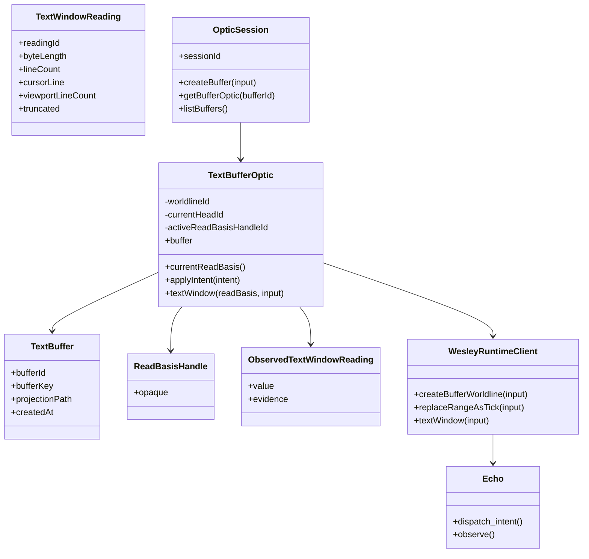
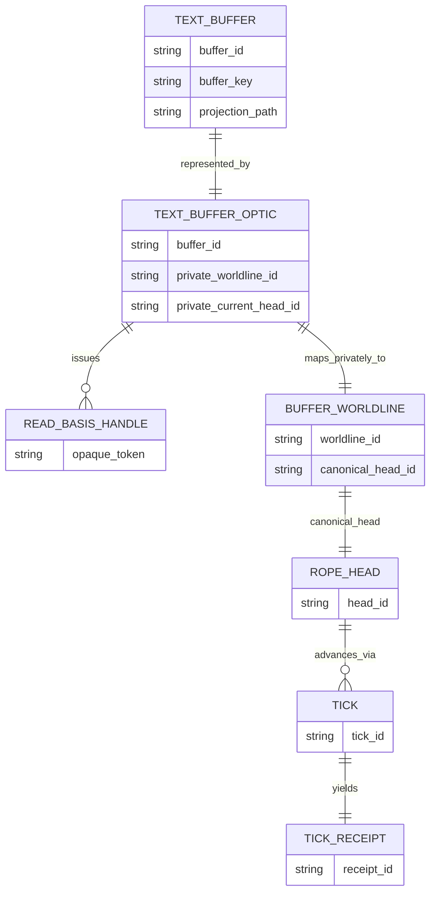
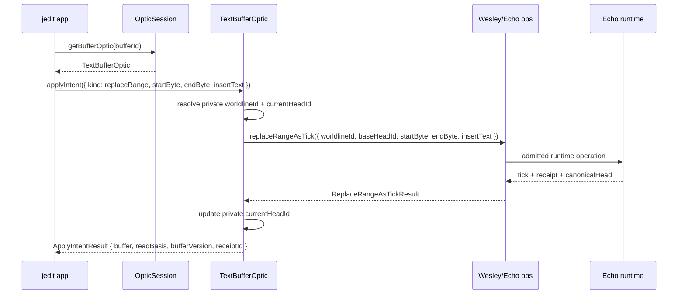

# jedit Data Model

## Doctrine

jedit owns the **editor contract** and product nouns. Echo owns **runtime execution** and substrate truth. Wesley compiles GraphQL SDL into runtime-specific artifacts such as Echo ops, Postgres schema, codecs, and observers.

The rope, ticks, worldlines, and heads are **runtime law**, not editor law. The jedit contract is defined by product pressure first, then stabilized through witnessed execution and boundary discipline rather than by exposing substrate mechanics upward.

Contract flow:


Core rules:

- App-facing jedit code never sees `worldlineId`, `headId`, or other runtime coordinates.
- `TextBufferOptic` is the authorized capability that may hold them privately.
- Wesley operations require them explicitly.
- Echo executes against them and produces evidence.

> The app may hold the optic.
> The app may invoke the optic.
> The app may not inspect the optic’s runtime coordinates.

`ReadBasisHandle` is supporting machinery, not the star. `TextBufferOptic` is the primary authorized boundary object.

***

## Layer split

### Conceptual layers

| Layer | Responsibility |
| :--- | :--- |
| Product | Product pressure and user semantics |
| Runtime | Execution and substrate truth |
| Wesley | Semantic compilation |
| Extensions | Domain law |
| Protocols | Deferred publication of proven seams |

jedit lives at the **product** and **contract** layers. Echo lives at the **runtime** layer. Wesley and its extensions form the compilation boundary between them.

### Editor-side ownership

- **Product nouns**: `TextBuffer`, `TextWindowReading`, edit intents.
- **Session capability**: `OpticSession`.
- **Per-buffer capability**: `TextBufferOptic`.
- **App-safe token**: `ReadBasisHandle`.
- **Runtime coordinates**: `worldlineId`, `headId` (private to optic + Echo).

If app-facing code needs runtime coordinates to make progress, either the boundary is wrong or the witness is not ready. That is the trap detector.

***

## TypeScript model

```ts
// ---------- identity types ----------

type SessionId = string;
type BufferId = string;
type BufferKey = string;
type ReadingId = string;
type BufferVersion = number;

type WorldlineId = string;
type RopeHeadId = string;

// ---------- app-safe token ----------

export type ReadBasisHandle = {
  readonly kind: 'read-basis-handle';
  readonly id: string; // diagnostic only; not authority
};

// ---------- product nouns ----------

export type TextBuffer = {
  readonly bufferId: BufferId;
  readonly bufferKey: BufferKey;
  readonly projectionPath: string | null;
  readonly createdAt: string;
};

export type ReplaceRangeIntent = {
  readonly kind: 'replaceRange';
  readonly startByte: number;
  readonly endByte: number;
  readonly insertText: string;
};

export type TextWindowInput = {
  readonly cursorLine: number;
  readonly viewportLineCount: number;
  readonly beforeLines: number;
  readonly afterLines: number;
  readonly maxBytes: number;
};

export type TextWindowLine = {
  readonly lineNumber: number;
  readonly startByte: number;
  readonly endByte: number;
  readonly text: string;
};

export type TextWindowReading = {
  readonly readingId: ReadingId;
  readonly lines: readonly TextWindowLine[];
  readonly byteLength: number;
  readonly lineCount: number;
  readonly cursorLine: number;
  readonly viewportLineCount: number;
  readonly truncated: boolean;
};

export type ApplyIntentResult = {
  readonly buffer: TextBuffer;
  readonly readBasis: ReadBasisHandle;
  readonly bufferVersion: BufferVersion;
  readonly receiptId: string;
};

export type Observed<T> = {
  readonly value: T;
  readonly evidence: {
    readonly readingId: string;
    readonly receiptId?: string;
  };
};

// ---------- optic capability ----------

export interface TextBufferOptic {
  readonly buffer: TextBuffer;

  currentReadBasis(): ReadBasisHandle;

  applyIntent(intent: ReplaceRangeIntent): Promise<ApplyIntentResult>;

  textWindow(
    readBasis: ReadBasisHandle,
    input: TextWindowInput
  ): Promise<Observed<TextWindowReading>>;
}

// ---------- session capability ----------

export interface OpticSession {
  readonly sessionId: SessionId;

  createBuffer(input: {
    bufferKey: BufferKey;
    initialText: string;
    projectionPath?: string | null;
  }): Promise<TextBufferOptic>;

  getBufferOptic(bufferId: BufferId): Promise<TextBufferOptic | null>;

  listBuffers(): Promise<readonly TextBuffer[]>;
}

// ---------- internal optic state (runtime-facing, not in contracts) ----------

type InternalOpticState = {
  bufferId: BufferId;
  worldlineId: WorldlineId;
  currentHeadId: RopeHeadId;
  activeReadBasisHandleId: string;
};
```

The optic may freely hold `worldlineId` and `currentHeadId` in `InternalOpticState`, but those fields never cross the contract boundary. This follows the opaque-capability pattern: callers can use the capability while remaining insulated from its internal representation.

***

## App-facing GraphQL SDL

The canonical jedit-facing SDL now lives at
[`contracts/jedit/text-buffer-optic.graphql`](../contracts/jedit/text-buffer-optic.graphql).
It defines product nouns plus an opaque app-safe read basis token. In GraphQL,
`ReadBasisHandle` is a custom scalar rather than an object type, because the
token is intentionally opaque and should not invite field-level coupling.

The SDL is intentionally compile-ready before its generated TypeScript artifact
is committed. The current Wesley TypeScript emitter maps custom scalars such as
`ReadBasisHandle` and `DateTime` to `unknown`; jedit should not check in that
surface until Wesley has a scalar-mapping policy that preserves this repo's
no-new-`unknown` rule.

```graphql
scalar DateTime
scalar ReadBasisHandle

type TextBuffer {
  bufferId: ID!
  bufferKey: String!
  projectionPath: String
  createdAt: DateTime!
}

type TextWindowLine {
  lineNumber: Int!
  startByte: Int!
  endByte: Int!
  text: String!
}

type TextWindowReading {
  readingId: ID!
  lines: [TextWindowLine!]!
  byteLength: Int!
  lineCount: Int!
  cursorLine: Int!
  viewportLineCount: Int!
  truncated: Boolean!
}

type CreateBufferPayload {
  buffer: TextBuffer!
  readBasis: ReadBasisHandle!
  bufferVersion: Int!
  receiptId: ID!
}

type ReplaceRangePayload {
  buffer: TextBuffer!
  readBasis: ReadBasisHandle!
  bufferVersion: Int!
  receiptId: ID!
}

input CreateBufferInput {
  bufferKey: String!
  initialText: String!
  projectionPath: String
}

input ReplaceRangeInput {
  bufferId: ID!
  startByte: Int!
  endByte: Int!
  insertText: String!
}

input TextWindowInput {
  cursorLine: Int!
  viewportLineCount: Int!
  beforeLines: Int!
  afterLines: Int!
  maxBytes: Int!
}

type Mutation {
  createBuffer(input: CreateBufferInput!): CreateBufferPayload!
  replaceRange(input: ReplaceRangeInput!): ReplaceRangePayload!
}

type Query {
  textWindow(readBasis: ReadBasisHandle!, input: TextWindowInput!): TextWindowReading!
}
```

No `worldlineId` or `headId` appear here. Those are Echo runtime coordinates, not jedit product nouns.

***

## Echo/Wesley operation model

Echo uses Wesley to compile runtime-facing operations from an Echo-owned SDL that includes domain directives such as `@wes_op` and `@wes_footprint`. GraphQL directives are implementation-defined metadata, and Wesley uses that fact to support domain-owned law without claiming universal runtime semantics itself.

```graphql
directive @wes_op(name: String!) on FIELD_DEFINITION

"""Echo runtime footprint metadata"""
directive @wes_footprint(
  reads: [String!]
  writes: [String!]
  creates: [String!]
  slots: [WesSlotBindingInput!]
  closures: [WesClosureInput!]
  createSlots: [WesCreateSlotInput!]
  updates: [WesUpdateInput!]
  forbids: [String!]
) on FIELD_DEFINITION

# ... helper inputs omitted for brevity ...

type Mutation {
  createBufferWorldline(
    input: CreateBufferWorldlineInput!
  ): CreateBufferWorldlineResult!
    @wes_op(name: "createBufferWorldline")
    @wes_footprint(...)

  replaceRangeAsTick(
    input: ReplaceRangeAsTickInput!
  ): ReplaceRangeAsTickResult!
    @wes_op(name: "replaceRangeAsTick")
    @wes_footprint(...)
}

type Query {
  worldlineSnapshot(input: WorldlineSnapshotInput!): WorldlineSnapshot!
    @wes_op(name: "worldlineSnapshot")

  textWindow(input: TextWindowRuntimeInput!): TextWindowReading!
    @wes_op(name: "textWindow")
}
```

This schema is not app-facing; it is Echo/Wesley-facing. It may and should speak explicitly in `worldlineId`, `headId`, rope objects, ticks, and checkpoints. Wesley compiles the runtime law. Echo executes it. [apollographql](https://www.apollographql.com/docs/apollo-server/v3/schema/creating-directives)

***

## Mermaid class diagram



***

## Mermaid ER diagram



Runtime coordinates exist (`worldline_id`, `head_id`, etc.) but remain below the optic boundary.

***

## Sequence: `replaceRange`



The optic is the authorized translator from product intent to runtime operation. The app never handles `worldlineId` or `headId` directly.

***

## Rope posture and operating rule

The rope, piece table, or any other text data structure is not part of the jedit contract. The contract says:

> replace byte range with text
> read bounded text window
> preserve deterministic history
> produce evidence-bearing readings

Echo may implement this with a piece table, a rope, a persistent tree, a chunk graph, or any other structure that satisfies the law. Event-sourcing and projection-oriented systems routinely separate write-side history from read-side projections, which matches the split between admitted runtime operations and observed text windows here.

**Operating rule:**

If a jedit layer needs forbidden runtime knowledge such as worldlines, heads, scheduler state, or rope nodes to make progress, the boundary is wrong or the witness is not ready.

The optic exists so that boundaries can remain correct while real runtime work still happens.
