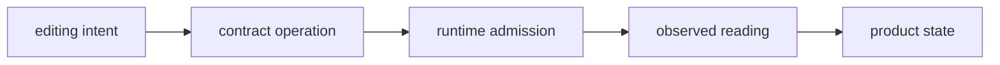
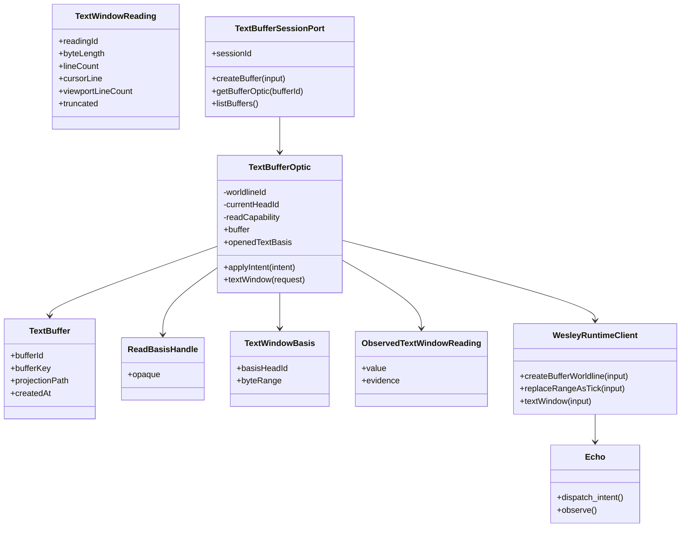
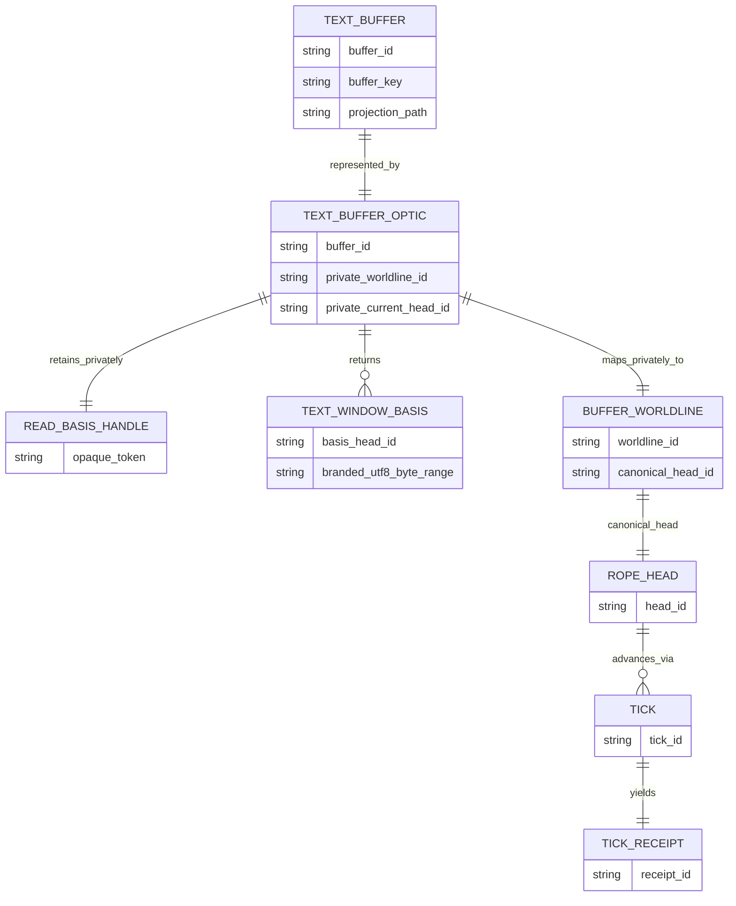
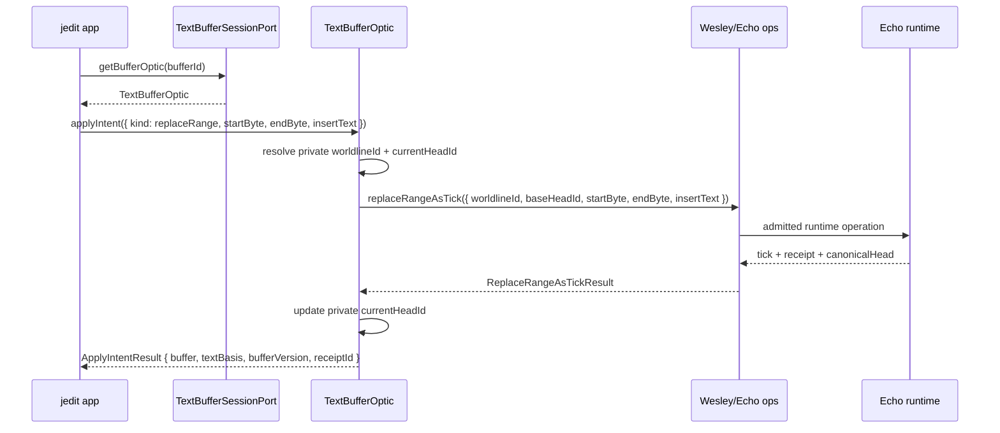

# jedit Data Model

## Doctrine

jedit owns the **editor contract** and product nouns. Echo owns **generic
runtime execution**, admission, scheduler-owned ticks, receipts, readings, and
retained evidence. Wesley compiles jedit-owned GraphQL SDL into generated
artifacts such as Echo operation metadata, codecs, and observers.

The rope model is jedit contract law hosted through Echo's generic graph and
contract-host surfaces. Echo must not implement a privileged jedit rope engine.
The jedit contract is defined by product pressure first, then stabilized through
witnessed execution and boundary discipline rather than by exposing substrate
mechanics upward.

Contract flow:



Core rules:

- App-facing jedit code carries opaque Jim-owned rope-head identities and
  branded UTF-8 byte ranges when it requests materialized text.
- App code does not derive, inspect, or mint those identities.
- `ReadBasisHandle` is an internal transport capability. It is not the causal
  basis of a text reading.
- `TextBufferOptic` retains the transport capability and exposes explicit
  `TextWindowBasis` values returned by admitted operations.
- Wesley operations require the same head and range semantics explicitly.
- Echo hosts generic installed contracts, schedules admitted work, and produces
  evidence.

> The app may hold the optic.
> The app may invoke the optic.
> The app may replay an opaque head identity returned by Jim.
> The app may not manufacture Echo or Jim authority.

`ReadBasisHandle` is supporting machinery, not the star. `TextBufferOptic` is the primary authorized boundary object.

***

## Structural history authority

The canonical structural history SDL now lives at
[`contracts/jedit/structural-history.graphql`](../contracts/jedit/structural-history.graphql).
It extracts the current in-memory TypeScript facts for text revisions, admitted
replace events, edit groups, checkpoints, provenance, command status, and
evidence-bearing readings into a GraphQL contract that Wesley should consume in
a later generation slice.

The hand-authored TypeScript model below is now transitional evidence. It
documents current behavior and adapter shape, but future structural history work
should extend the SDL first and then move TypeScript toward generated contracts
or boundary projections.

The extraction note is
[`docs/design/structural-history-graphql-authority.md`](design/structural-history-graphql-authority.md).

The first generated-metadata consumer is the `replaceTextRange` boundary in
`src/app/structural-history-replace-text-range.ts`. That adapter takes its
operation identity from the build-generated Wesley descriptor while the current
in-memory runtime remains the transitional executor. The descriptor is generated
into an ignored source path during build/test; the authored SDL remains the
committed authority.

***

## Layer split

### Conceptual layers

| Layer | Responsibility |
| :--- | :--- |
| Product | Product pressure and user semantics |
| Runtime | Execution and substrate truth |
| Wesley | Semantic compilation |
| Extensions | Domain law |
| Protocols | Deferred publication of proven seams |

jedit lives at the **product** and **contract** layers. Echo lives at the **runtime** layer. Wesley and its extensions form the compilation boundary between them.

### Editor-side ownership

- **Product nouns**: `TextBuffer`, `TextWindowReading`, edit intents.
- **Session capability**: `TextBufferSessionPort`.
- **Per-buffer capability**: `TextBufferOptic`.
- **Transport capability**: `ReadBasisHandle` (private to the optic).
- **Materialization basis**: opaque Jim `basisHeadId` plus branded UTF-8 range.
- **Runtime coordinate**: `worldlineId` (private to the optic and runtime).

If app-facing code unwraps a branded offset outside a serialization or external
adapter boundary, derives an authority identity, or treats `ReadBasisHandle` as
history, the boundary is wrong. That is the trap detector.

***

## TypeScript model

```ts
// ---------- identity types ----------

type SessionId = string;
type BufferId = string;
type BufferKey = string;
type ReadingId = string;
type BufferVersion = number;

type WorldlineId = string;
type RopeHeadId = string;

type Utf8ByteOffset = {
  readonly kind: 'utf8-byte-offset';
  readonly value: number;
};

type TextByteRange = {
  readonly startByte: Utf8ByteOffset;
  readonly endByte: Utf8ByteOffset;
};

// ---------- app-safe token ----------

export type ReadBasisHandle = {
  readonly kind: 'read-basis-handle';
  readonly id: string; // diagnostic only; not authority
};

// ---------- product nouns ----------

export type TextBuffer = {
  readonly bufferId: BufferId;
  readonly bufferKey: BufferKey;
  readonly projectionPath: string | null;
  readonly createdAt: string;
};

export type ReplaceRangeIntent = {
  readonly kind: 'replaceRange';
  readonly startByte: number;
  readonly endByte: number;
  readonly insertText: string;
};

export type TextWindowBasis = {
  readonly basisHeadId: RopeHeadId;
  readonly byteRange: TextByteRange;
};

export type TextWindowAperture = {
  readonly cursorLine: number;
  readonly viewportLineCount: number;
  readonly beforeLines: number;
  readonly afterLines: number;
  readonly maxBytes: number;
};

export type TextWindowRequest = TextWindowBasis & {
  readonly aperture: TextWindowAperture;
};

export type TextWindowLine = {
  readonly lineNumber: number;
  readonly startByte: number;
  readonly endByte: number;
  readonly text: string;
};

export type TextWindowReading = {
  readonly readingId: ReadingId;
  readonly textBasis: TextWindowBasis;
  readonly lines: readonly TextWindowLine[];
  readonly byteLength: number;
  readonly lineCount: number;
  readonly cursorLine: number;
  readonly viewportLineCount: number;
  readonly truncated: boolean;
};

export type ApplyIntentResult = {
  readonly buffer: TextBuffer;
  readonly textBasis: TextWindowBasis;
  readonly bufferVersion: BufferVersion;
  readonly receiptId: string;
};

export type Observed<T> = {
  readonly value: T;
  readonly evidence: {
    readonly readingId: string;
    readonly receiptId?: string;
  };
};

// ---------- optic capability ----------

export interface TextBufferOptic {
  readonly buffer: TextBuffer;
  readonly openedTextBasis: TextWindowBasis;

  applyIntent(intent: ReplaceRangeIntent): Promise<ApplyIntentResult>;

  textWindow(request: TextWindowRequest): Promise<Observed<TextWindowReading>>;
}

// ---------- session capability ----------

export interface TextBufferSessionPort {
  readonly sessionId: SessionId;

  createBuffer(input: {
    bufferKey: BufferKey;
    initialText: string;
    projectionPath?: string | null;
  }): Promise<TextBufferOptic>;

  getBufferOptic(bufferId: BufferId): Promise<TextBufferOptic | null>;

  listBuffers(): Promise<readonly TextBuffer[]>;
}

// ---------- internal optic state (runtime-facing, not in contracts) ----------

type InternalOpticState = {
  bufferId: BufferId;
  worldlineId: WorldlineId;
  currentHeadId: RopeHeadId;
  readCapability: ReadBasisHandle;
};
```

The optic may hold `worldlineId`, the current head, and the read capability in
`InternalOpticState`. Product callers receive only immutable Jim text bases
returned by open/edit/checkpoint operations. The optic passes the transport
capability internally while serializing the explicit head and branded range at
the generated-query adapter boundary.

***

## App-facing GraphQL SDL

The canonical jedit-facing SDL now lives at
[`contracts/jedit/text-buffer-optic.graphql`](../contracts/jedit/text-buffer-optic.graphql).
It defines product nouns plus the explicit Jim head and UTF-8 range basis
required for every text materialization. The transport-only `ReadBasisHandle`
does not appear in this app-facing schema.

The SDL is intentionally compile-ready before its generated TypeScript artifact
is committed. The current Wesley TypeScript emitter maps custom scalars such as
`DateTime` to `unknown`; jedit should not check in that surface until Wesley has
a scalar-mapping policy that preserves this repo's no-new-`unknown` rule.

```graphql
scalar DateTime

type TextBuffer {
  bufferId: ID!
  bufferKey: String!
  projectionPath: String
  createdAt: DateTime!
}

type TextWindowLine {
  lineNumber: Int!
  startByte: Int!
  endByte: Int!
  text: String!
}

type TextWindowBasis {
  basisHeadId: ID!
  startByte: Int!
  endByte: Int!
}

type TextWindowReading {
  readingId: ID!
  textBasis: TextWindowBasis!
  lines: [TextWindowLine!]!
  byteLength: Int!
  lineCount: Int!
  cursorLine: Int!
  viewportLineCount: Int!
  truncated: Boolean!
}

type CreateBufferPayload {
  buffer: TextBuffer!
  textBasis: TextWindowBasis!
  bufferVersion: Int!
  receiptId: ID!
}

type ReplaceRangePayload {
  buffer: TextBuffer!
  textBasis: TextWindowBasis!
  bufferVersion: Int!
  receiptId: ID!
}

input CreateBufferInput {
  bufferKey: String!
  initialText: String!
  projectionPath: String
}

input ReplaceRangeInput {
  bufferId: ID!
  startByte: Int!
  endByte: Int!
  insertText: String!
}

input TextWindowInput {
  basisHeadId: ID!
  startByte: Int!
  endByte: Int!
  cursorLine: Int!
  viewportLineCount: Int!
  beforeLines: Int!
  afterLines: Int!
  maxBytes: Int!
}

type Mutation {
  createBuffer(input: CreateBufferInput!): CreateBufferPayload!
  replaceRange(input: ReplaceRangeInput!): ReplaceRangePayload!
}

type Query {
  textWindow(input: TextWindowInput!): TextWindowReading!
}
```

`basisHeadId` is an opaque Jim-owned fact identity, not a value the product may
construct. `startByte` and `endByte` are serialized forms of branded UTF-8
offsets. `worldlineId` and the `ReadBasisHandle` representation remain below
the optic boundary.

### Authoritative line summaries and disposable indexes

Line metrics retained by `RopeHead`, `RopeBranch`, and `RopeLeaf` are
authoritative Jim facts. They participate in rope validation, causal readings,
and retained evidence. A line-offset index is different: it is a versioned,
basis-pinned projection derived from complete UTF-8 coverage of one rope head.

The current disposable projection records:

- the worldline and rope head that supplied its basis;
- the immutable head metrics used to validate that basis;
- the complete branded UTF-8 byte range it indexed;
- zero-based line identities and branded byte offsets for line content and the
  following line start; and
- a projection kind and implementation version.

The store keys indexes by both worldline and head identity. Head labels are not
assumed globally unique. An observer may reuse a matching index to select a
bounded text window, but it must reject and evict the index when the requested
coverage or returned head metadata no longer matches.

Line projection treats CRLF as one logical break and preserves the original
UTF-8 byte width of Unicode text. Clearing every line index changes only read
cost: the same index can be rebuilt from the same basis. It cannot change rope
history, retained rewrite evidence, `:why` answers, or the authoritative line
counts. The projection must never be emitted as a graph fact or used to mint a
head, receipt, or causal identity.

***

## Echo/Wesley operation model

jedit uses Wesley to compile runtime-facing operations from jedit-owned SDL that
includes domain directives such as `@wes_op` and `@wes_footprint`. GraphQL
directives are implementation-defined metadata, and Wesley uses that fact to
support domain-owned law without claiming universal runtime semantics itself.

```graphql
directive @wes_op(name: String!) on FIELD_DEFINITION

"""Echo runtime footprint metadata"""
directive @wes_footprint(
  reads: [String!]
  writes: [String!]
  creates: [String!]
  slots: [WesSlotBindingInput!]
  closures: [WesClosureInput!]
  createSlots: [WesCreateSlotInput!]
  updates: [WesUpdateInput!]
  forbids: [String!]
) on FIELD_DEFINITION

# ... helper inputs omitted for brevity ...

type Mutation {
  createBufferWorldline(
    input: CreateBufferWorldlineInput!
  ): CreateBufferWorldlineResult!
    @wes_op(name: "createBufferWorldline")
    @wes_footprint(...)

  replaceRangeAsTick(
    input: ReplaceRangeAsTickInput!
  ): ReplaceRangeAsTickResult!
    @wes_op(name: "replaceRangeAsTick")
    @wes_footprint(...)
}

type Query {
  worldlineSnapshot(input: WorldlineSnapshotInput!): WorldlineSnapshot!
    @wes_op(name: "worldlineSnapshot")

  textWindow(input: TextWindowInput!): TextWindowReading!
    @wes_op(name: "textWindow")
}
```

This schema is not app-facing; it is generated-host-facing. It may and should
speak explicitly in `worldlineId`, `headId`, rope objects, ticks, and
checkpoints because those are jedit contract coordinates below the
`TextBufferOptic` boundary. Wesley compiles the contract law. Generated host
adapters and jedit-owned contract code interpret the text nouns. Echo admits,
schedules, records, and observes the resulting generic contract work.
[apollographql](https://www.apollographql.com/docs/apollo-server/v3/schema/creating-directives)

***

## Mermaid class diagram



***

## Mermaid ER diagram



Runtime coordinates still exist. `worldline_id` remains below the optic
boundary; a `head_id` crosses it only as an opaque Jim fact reference inside a
`TextWindowBasis`.

***

## Sequence: `replaceRange`



The optic is the authorized translator from product intent to runtime
operation. The app never handles `worldlineId`; it carries `headId` only as an
opaque basis returned by Jim.

***

## Rope posture and operating rule

The rope, piece table, or any other text data structure is part of the jedit
contract and generated host model, not Echo core. The app-facing contract says:

> replace byte range with text
> read bounded text window
> preserve deterministic history
> produce evidence-bearing readings

jedit may model this as rope-shaped Echo graph facts, a piece table, a
persistent tree, a chunk graph, or another generated contract representation
that satisfies the law. Echo should see generic installed contract work and
retained evidence, not a built-in text data structure. Event-sourcing and
projection-oriented systems routinely separate write-side history from
read-side projections, which matches the split between admitted runtime
operations and observed text windows here.

**Operating rule:**

If a jedit layer needs forbidden runtime knowledge such as worldlines,
scheduler state, rope nodes, or the representation of a head identity to make
progress, the boundary is wrong or the witness is not ready.

The optic exists so that boundaries can remain correct while real runtime work still happens.
