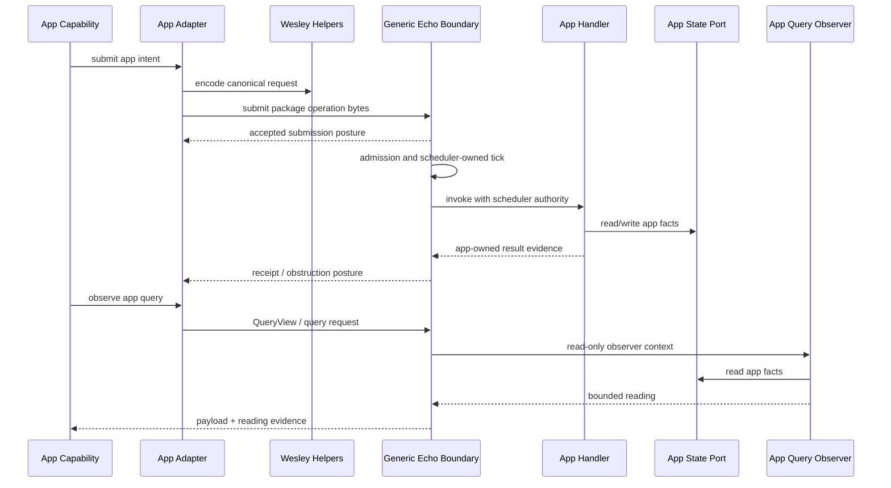

# Echo Application Hosting Pattern

Status: active post-release-pressure direction

This document records the reusable application-hosting pattern that `jedit`
must prove before the same model is trusted for Graft, Think, or other Echo
applications.

The goal is no longer to force a release label. The goal is to make the
architecture correct.

## Claim

An Echo-hosted application is a domain-owned contract package installed into a
generic Echo runtime boundary. The application owns its nouns, state model,
mutation handlers, query observers, and app-safe capability API. Echo owns
generic admission, scheduling, tick authority, receipt posture, retained
evidence, query routing, and obstruction/fault posture.

For `jedit`, that means:

```text
jedit owns TextBufferOptic, text windows, roots, buffers, cursors, panes,
commands, and editor policy.

Echo never owns those nouns.
```

The reusable pattern is:

```text
App GraphQL contract
-> Wesley generated helpers/codecs/metadata
-> app-owned package descriptor
-> app-owned mutation handlers
-> app-owned query observers
-> app-owned state and submission ports
-> generic Echo transport/admission/scheduler/retention boundaries
-> app-safe client capability
```

## Why This Exists

The first thirty slices proved that `jedit` can expose an Echo-shaped witness
path without giving the app tick authority and without moving `jedit` nouns into
Echo. That is necessary, but not sufficient.

The next work must prove the hosting pattern itself:

- writes and reads converge on one app-owned state authority;
- submission is separate from execution;
- ticketed work is separate from accepted submission;
- receipt correlation is real when execution is decided;
- retained evidence is inspectable;
- local restart posture is honest;
- at least one second app-shaped contract can follow the same recipe.

The test app is `jedit`, but the deliverable is a repeatable application-hosting
spine.

## Ownership Boundaries

| Boundary | Owned By | Examples | Forbidden Leakage |
|---|---|---|---|
| Domain vocabulary | App | `TextBufferOptic`, text window, cursor, workflow, note | Echo core imports app nouns |
| Contract schema | App | GraphQL SDL, operation names, query names | Echo edits product schemas |
| Code generation | Wesley | typed helpers, codecs, metadata | hand-written generated shadows |
| Package descriptor | App adapter | package id, schema hash, operation ids | app capability installs packages |
| Mutation handlers | App host code | jedit replace/checkpoint handlers | application dispatch invokes handlers |
| Query observers | App host code | jedit text-window observer | observer mutates state or ticks |
| State authority | App port/adapter | jedit contract facts, state port | caller-owned session object as truth |
| Submission ledger | Host/app adapter | accepted submission identity | hidden execution during acceptance |
| Scheduling and ticks | Echo trusted runtime | run-until-idle, receipts | app code controls ticks |
| Retention | Echo/app adapter seam | receipts, readings, payload refs | byte hash treated as semantic identity |

## Authority Bar

These constraints are release-independent. They are the shape of correctness.

- Application code cannot tick Echo.
- Application code cannot access trusted runtime control.
- Application dispatch does not execute synchronously.
- App-safe capability APIs do not expose package install, handler invocation,
  state-port write access, lifecycle control, or tick control.
- Mutation handlers run only behind scheduler-authority invocation.
- Query observers are read-only.
- Submission identity is not ticket identity.
- Admission or ticket posture is not execution.
- Receipt correlation happens only after a decided runtime outcome.
- Conflict or rejection is final for that attempt.
- Retry is a new explicit causal input.
- Wall-clock cadence is host/runtime policy, not semantic history.

## Generic Hosting Flow



## Port/Adapter Rule

Every crossing that could become a second app's integration point must be behind
a port or adapter. In particular:

- app-facing UI and command code speaks to app capabilities;
- app capabilities speak to app client ports;
- app client ports encode/decode at adapters;
- installed packages speak through package host ports;
- handlers speak through state ports;
- observers speak through read-only state/query ports;
- submission and retention use explicit ledger/lookup ports;
- Echo-facing code sees generic package, operation, query, ticket, receipt,
  reading, obstruction, and retained-evidence shapes.

If a direct call would teach a future Graft or Think implementation a `jedit`
detail, it belongs behind a port.

## jedit Instantiation

For `jedit`, the pattern currently maps like this:

| Generic Role | jedit Concrete Surface |
|---|---|
| app-safe capability | `TextBufferOptic` |
| app contract | `contracts/jedit/hot-text-runtime.graphql` |
| package descriptor | `jedit.hot-text-runtime` descriptor |
| mutation handlers | create buffer, replace range, checkpoint |
| query observers | worldline snapshot, text window |
| state model | jedit-owned roots, heads, ticks, checkpoints, fact sets |
| submission evidence | jedit submission ids and pending/app outcome posture |
| retained evidence | package, receipt, reading-envelope, and payload refs |
| local witness | `scripts/jedit-echo-powered-session.mjs` |

The app-facing API may use `TextBufferOptic`. The Echo-facing transport must
not. Echo sees installed package operations and query observers.

## Second-App Litmus Test

This pattern is not proven until a second small contract can follow it without
copying `jedit` internals.

The second-app proof can be intentionally small, such as a counter or todo
contract. It must still exercise the same shape:

- Wesley schema and generated helpers;
- package descriptor;
- mutation handler;
- query observer;
- state port;
- submission ledger;
- receipt or obstruction posture;
- retained reading or payload evidence;
- no imports from `jedit` product modules except shared test harness utilities.

If the second app needs to know `TextBufferOptic`, the architecture failed.

## Next Ten Slices

These slices supersede the release-pressure continuation shape after slice 30.
They keep `jedit` as the proof app, but the objective is reusable hosting
correctness rather than release ceremony.

### Slice 31 - Application Hosting Contract Pattern

User story: As a future Echo application author, I can read one document and
understand where app semantics, generated code, app adapters, and generic Echo
runtime boundaries belong.

Work:

- Define the reusable Echo application-hosting pattern.
- State the ownership and authority boundaries.
- Show how `jedit` instantiates the pattern.
- Name the second-app litmus test.
- Point the repo bearing at this direction.

Test plan:

- `git diff --check`
- `npm run --silent quality`
- Manual review that the document does not move `jedit` nouns into Echo.

Checklist:

- [x] Hosting pattern document exists.
- [x] Ownership boundaries are explicit.
- [x] Authority bar is explicit.
- [x] `jedit` instantiation is mapped.
- [x] Second-app litmus test is named.

### Slice 32 - jedit State Authority Cutover

User story: As `jedit`, installed mutation handlers use the jedit contract
state port as their state authority instead of private process-local state.

Work:

- Route installed handlers through the state port.
- Keep the in-memory adapter as the local implementation.
- Prevent app-facing code from writing or reading fact sets directly.

Test plan:

- Installed mutation flow writes through the state port.
- App-facing `TextBufferOptic` exposes no state-port methods.
- Existing installed headless flow still edits and reads text.

Checklist:

- [x] Installed handlers use the state port.
- [x] In-memory adapter remains behind the port.
- [x] App-facing API remains clean.
- [x] Existing installed flow passes.

### Slice 33 - Read-Side State Authority Cutover

User story: As an observer, jedit query observers read from the same state
authority used by mutation handlers.

Work:

- Route `worldlineSnapshot` through state-port-backed state.
- Route `textWindow` through state-port-backed state.
- Preserve read-only observer authority.
- Preserve bounded aperture and byte budget.

Test plan:

- Snapshot observer returns state-port-backed reading.
- Text-window observer returns state-port-backed reading.
- Missing basis/state returns typed obstruction.
- Query observer cannot mutate state or tick.

Checklist:

- [x] Snapshot observer uses state port.
- [x] Text-window observer uses state port.
- [x] Missing state is typed.
- [x] Read-only authority holds.

### Slice 34 - Submission Ledger Port

User story: As a host adapter, I can record accepted jedit submissions without
pretending they executed synchronously.

Work:

- Add submission ledger port.
- Record accepted submission identity and canonical envelope before runtime
  work can decide it.
- Keep ledger write authority away from app-facing capability code.

Test plan:

- Accepted submission is recorded before handler execution.
- Duplicate canonical submission returns same identity or duplicate posture.
- Recording a submission does not tick, mutate text state, or dispatch handlers.
- App-facing code cannot write ledger entries directly.

Checklist:

- [x] Submission ledger port exists.
- [x] Accepted submission is recorded before execution.
- [x] Duplicate posture is deterministic.
- [x] App-facing API cannot write ledger entries.

### Slice 35 - Ticketed Work Boundary

User story: As an Echo-hosted app, accepted submission and runtime work are
separate; only ticketed work can reach handler invocation.

Work:

- Route jedit installed work through a ticketed work boundary.
- Preserve submission id, package id, operation id, and basis identity.
- Keep ticket identity distinct from submission identity.

Test plan:

- Unticketed work cannot invoke handlers.
- Ticketed work preserves submission and operation identity.
- Missing ticket posture is typed.
- Ticketed work does not imply execution until scheduler-authority invocation.

Checklist:

- [x] Ticketed work boundary exists.
- [x] Unticketed work is blocked.
- [x] Ticket and submission identities are distinct.
- [x] Handler invocation still requires scheduler authority.

### Slice 36 - Real Receipt Correlation

User story: As an app, I can correlate a decided jedit submission to the receipt
that decided it.

Work:

- Replace transitional missing correlation on the happy path.
- Correlate submission, ticket/work, and receipt identity.
- Keep unsupported and incomplete paths typed.

Test plan:

- Applied jedit intent maps to receipt correlation.
- Missing receipt remains typed outside decided paths.
- Unsupported operation does not fabricate receipt.
- Witness report carries real correlation where available.

Checklist:

- [x] Happy path has real receipt correlation.
- [x] Missing receipt remains typed.
- [x] Unsupported operation does not fabricate receipt.
- [x] Witness report exposes correlation.

### Slice 37 - Real Local Retained Evidence Lookup

User story: As a diagnostic host or agent, I can load retained jedit evidence
material through the retention lookup boundary.

Work:

- Store/load receipt material.
- Store/load reading envelope material.
- Store/load reading payload material.
- Preserve semantic coordinate versus byte identity distinction.

Test plan:

- Receipt material loads by byte hash.
- Reading envelope material loads by byte hash.
- Reading payload material loads by byte hash.
- Missing material returns obstruction.
- Semantic coordinate mismatch does not become a cache hit.

Checklist:

- [x] Receipt material lookup works.
- [x] Reading envelope lookup works.
- [x] Reading payload lookup works.
- [x] Semantic coordinate and byte identity remain distinct.

### Slice 38 - Restart And Recovery Witness

User story: As a local host operator, I can restart and observe honest posture
for pending, decided, rejected, and unknown submissions.

Work:

- Add deterministic restart witness fixture.
- Cover pending, decided, rejected, and unknown postures.
- Ensure recovery does not execute handlers.

Test plan:

- Pending submission recovers as pending.
- Decided submission recovers with receipt correlation.
- Unknown submission remains typed.
- Half-accepted state is impossible or obstructed.

Checklist:

- [x] Restart witness exists.
- [x] Pending posture covered.
- [x] Decided posture covered.
- [x] Unknown posture covered.
- [x] Recovery is non-executing.

### Slice 39 - Second-App Template Proof

User story: As a future Echo app author, I can see a tiny non-jedit contract
hosted through the same pattern.

Work:

- Add a minimal second contract fixture.
- Generate or provide its app-owned helper surface.
- Install package descriptor, mutation handler, query observer, and state port.
- Prove no `jedit` product module imports are required.

Test plan:

- Second app installs through same hosting shape.
- Second app mutation and query path pass.
- Echo-facing abstractions do not import jedit modules.
- App-specific nouns stay in the app fixture.

Checklist:

- [x] Second contract fixture exists.
- [x] Same hosting shape works.
- [x] No jedit product imports leak into the second app.
- [x] Generic helper docs cover both apps.

### Slice 40 - Developer App Host Guide

User story: As a developer building Graft, Think, or another app on Echo, I can
follow a concrete guide rather than reverse-engineering `jedit`.

Work:

- Write the app-host guide.
- Include mutation flow, query flow, submission/outcome lifecycle, and authority
  diagrams.
- Link evidence commands and required tests.
- Update BEARING with the completed status.

Test plan:

- Documentation links are valid.
- Example commands run.
- The guide names required tests for a new app.

Checklist:

- [ ] Developer guide exists.
- [ ] Diagrams are included.
- [ ] Evidence commands are current.
- [ ] BEARING reflects completed status.

## Non-Goals

These are intentionally outside this ten-slice plan:

- release tagging;
- package publishing;
- browser packaging;
- streaming subscriptions;
- distributed replica import;
- settlement shells;
- full observer-rights governance;
- social/speculative lane policy;
- moving `jedit` semantics into Echo.

## Completion Bar

This ten-slice plan is complete when the repository can honestly say:

```text
jedit proves the reusable Echo application-hosting pattern. jedit owns its
domain semantics; Echo remains generic; Wesley supplies generated contract
surfaces; app-hosting uses explicit ports for package install, submission,
ticketed work, state, query observation, receipt correlation, retention, and
restart posture.
```
