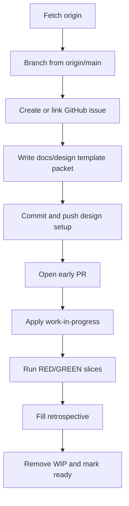
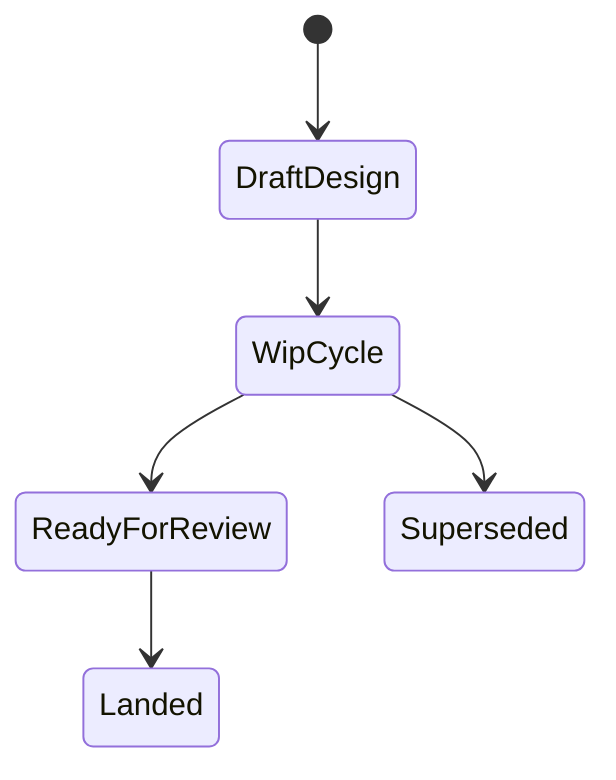

# WF-0034 - Executable Design Cycle Template

## Linked Issue

- https://github.com/flyingrobots/jedit/issues/51

## Decision Summary

jedit will make full-cycle design docs a first-class workflow artifact, backed
by `docs/design/TEMPLATE.md`, `docs/method/process.md`, `AGENTS.md`, and a
process spec. The template requires concrete contracts, current-truth evidence,
test-first slices, lower-mode posture, accessibility, localization when strings
change, and a retrospective, while explicitly forbidding design-doc assertions
as the sole proof for implementation work.

## Sponsored Human

A jedit maintainer wants cycle work to start from a precise, reviewable design
so that implementation can move quickly without repeatedly renegotiating scope,
without having to mine chat transcripts for the intended behavior.

## Sponsored Agent

An agent needs a stable cycle template and process contract so it can create
branches, issues, docs, RED tests, PRs, and retrospectives, without inferring
private workflow expectations from previous conversations.

## Hill

By the end of this cycle, a maintainer or agent can start a full jedit cycle
through `docs/design/TEMPLATE.md` and `docs/method/process.md`, and the repo
proves the policy with a focused process spec plus the quality gate.

## Current Truth

At the merge target SHA `df35e90cd77823d295240116cbc7ff07b66c3c76`,
`AGENTS.md` states git safety and delivery workflow rules, but does not define a
design-cycle startup path, GitHub issue linkage, WIP labeling, or template
contract:
[AGENTS.md#L3:df35e90cd77823d295240116cbc7ff07b66c3c76](https://github.com/flyingrobots/jedit/blob/df35e90cd77823d295240116cbc7ff07b66c3c76/AGENTS.md#L3)
and
[AGENTS.md#L72:df35e90cd77823d295240116cbc7ff07b66c3c76](https://github.com/flyingrobots/jedit/blob/df35e90cd77823d295240116cbc7ff07b66c3c76/AGENTS.md#L72).

`docs/method/process.md` is a placeholder with no executable cycle workflow:
[docs/method/process.md#L1:df35e90cd77823d295240116cbc7ff07b66c3c76](https://github.com/flyingrobots/jedit/blob/df35e90cd77823d295240116cbc7ff07b66c3c76/docs/method/process.md#L1).

`docs/design/project-invariants.md` already says tests are executable spec and
design should become repo truth, but it does not say that design docs cannot be
the sole implementation proof:
[docs/design/project-invariants.md#L191:df35e90cd77823d295240116cbc7ff07b66c3c76](https://github.com/flyingrobots/jedit/blob/df35e90cd77823d295240116cbc7ff07b66c3c76/docs/design/project-invariants.md#L191).

Several historical design packets include retrospectives and playback notes, but
there is no current reusable jedit template that requires lower modes, agent
inspectability, UI geometry, Echo authority, Graft boundary, and executable
witnesses together.

## Problem

jedit design cycles are inspectable only when individual contributors remember
the full method. The repo has strong design precedent, but the process is not
encoded as a reusable template or tested contract, so a new cycle can still land
with vague intent, missing current-truth evidence, missing lower-mode posture,
or documentation assertions masquerading as proof.

## Scope

This cycle includes:

- Add a jedit-specific full-cycle design template.
- Replace the placeholder process doc with the official cycle workflow.
- Update `AGENTS.md` so agents follow the same workflow.
- Record this policy decision as a design doc.
- Add a focused spec that protects the template and process contract.
- Create and link the GitHub issue for the policy cycle.

## Non-Goals

This cycle does not include:

- Rewriting existing historical design docs into the new template.
- Enforcing the template against every old design document.
- Changing branch protection.
- Changing release-gate behavior.
- Adding a new docs inventory system.
- Porting the template to Echo, Bijou, or other repositories in this jedit PR.

## User Experience / Product Shape

This is a repository workflow change, not a rendered jedit TUI surface. The user
experience is the maintainer or agent flow for starting and reviewing a cycle.

### User Journey



### Wide UI Mockup

Not applicable. This cycle changes repository workflow docs and process tests,
not rendered UI.

### Narrow UI Mockup

Not applicable. This cycle changes repository workflow docs and process tests,
not rendered UI.

### Accessibility Considerations

The workflow is text-first Markdown. Headings, tables, checklists, and code
blocks are screen-reader and agent-readable without requiring visual layout.

## Runtime / API Contract

The software contract is a repository process contract:

- `docs/design/TEMPLATE.md` defines required full-cycle design sections.
- `docs/method/process.md` defines cycle classes, startup, active work,
  ready-for-review, and landing rules.
- `AGENTS.md` points agents to the canonical process and proof standard.
- `spec/design-cycle-policy.spec.mjs` verifies the required headings and policy
  anchors.

This contract does not add runtime APIs, command intents, Echo schema, Graft
schema, or editor state transitions.

## Lower Modes

Not applicable to rendered output. The lower-mode equivalent is that an agent
can inspect the policy with plain filesystem reads and `node --test`, without a
browser, TUI, or GitHub UI.

## Data / State Model

| Category | Description |
| --- | --- |
| Source of truth | `docs/method/process.md`, `docs/design/TEMPLATE.md`, and `AGENTS.md`. |
| Derived state | GitHub issues, PR labels, checklists, retrospectives, and process tests. |
| Invalid states | Full-cycle implementation with no executable witness, no linked issue, or design-only proof for runtime work. |
| Reset behavior | Superseded process docs must be replaced by a new design decision and issue. |
| Serialization | Markdown frontmatter, headings, checklists, and GitHub issue/PR metadata. |
| Deterministic assumptions | Process tests inspect stable headings and phrases; no clock-sensitive behavior. |



## Accessibility Posture

| Concern | Posture |
| --- | --- |
| Semantic labels or facts | Markdown headings and frontmatter expose stable sections and status. |
| Focus order or ownership | Not applicable; no interactive UI changes. |
| Hidden or visual-only information | None. Required proof must be inspectable in text or command output. |
| Keyboard behavior | Not applicable; no TUI input changes. |
| Secret or redaction behavior | GitHub issue/PR links are public repo metadata; no secrets are introduced. |

## Localization / Directionality Posture

No product strings change. The new visible text is maintainer documentation in
English and does not touch `translations.json` or runtime i18n catalogs.

| Concern | Posture |
| --- | --- |
| User-visible strings | Documentation-only process text. |
| Catalog keys | None. |
| Supported locales updated | None required. |
| Directionality assumptions | Markdown remains readable in source order. |
| Validation command | `npm run quality`; no i18n command applies. |

## Agent Inspectability / Explainability Posture

Agents can inspect the result through:

- stable headings in `docs/design/TEMPLATE.md`
- explicit cycle workflow in `docs/method/process.md`
- agent-facing rules in `AGENTS.md`
- issue link `https://github.com/flyingrobots/jedit/issues/51`
- `spec/design-cycle-policy.spec.mjs`
- deterministic `node --test` output

No agent needs to scrape pixels or infer workflow from chat.

## Linked Invariants

- Tests are executable spec.
- Design should become repo truth.
- Runtime truth beats type theater.
- Agent-first.
- Honest causal strata.

## Design Alternatives Considered

### Option A: Template Only

Pros:

- Small change.
- Gives humans a starting point.

Cons:

- Agents may miss the workflow if `AGENTS.md` and process docs do not point to
  it.
- Nothing protects the template from drifting into fake proof.

### Option B: Process Doc Only

Pros:

- Centralizes workflow.
- Avoids a large template.

Cons:

- Does not give cycle authors a concrete packet structure.
- Leaves lower modes, accessibility, localization, and agent inspectability as
  easy omissions.

### Option C: Template, Process, Agent Contract, And Spec

Pros:

- Makes the policy visible to humans and agents.
- Gives cycle authors a concrete shape.
- Adds an executable guard against missing proof language.

Cons:

- Adds more documentation surface.
- Requires future cycles to spend design effort before implementation.

## Decision

Choose Option C. jedit will use a full-cycle template plus canonical process
doc, agent contract, and process spec. The extra documentation cost is accepted
because it reduces ambiguous implementation cycles and blocks design-only proof.

## Implementation Slices

- [x] Slice 1: Create issue #51 and mark the policy cycle work in progress.
- [x] Slice 2: Add `docs/design/TEMPLATE.md`.
- [x] Slice 3: Replace `docs/method/process.md` with the official cycle
  workflow.
- [x] Slice 4: Update `AGENTS.md` to point agents at the workflow and proof
  standard.
- [x] Slice 5: Add a process spec for required headings and policy anchors.
- [x] Slice 6: Validate, commit, push, and open a PR.

## Tests To Write First

Behavior tests required:

- [ ] Not applicable; this is a repository workflow contract.

Documentation and process tests:

- [x] `spec/design-cycle-policy.spec.mjs` proves the template has required
  sections.
- [x] `spec/design-cycle-policy.spec.mjs` proves the process doc forbids
  design-only proof for implementation work.
- [x] `spec/design-cycle-policy.spec.mjs` proves `AGENTS.md` points to the
  template and process.

Rule: documentation tests cannot be the only proof for implementation work.
This cycle is process-only, so a process spec is the relevant witness.

## Acceptance Criteria

The work is done when:

- [x] Template exists at `docs/design/TEMPLATE.md`.
- [x] Process doc defines cycle classes, startup, active work, ready, and
  landing.
- [x] AGENTS points to the template and process.
- [x] Process spec covers required headings and proof doctrine.
- [x] Issue and PR are linked correctly.
- [x] CI and local validation are green.

## Validation Plan

Commands expected before PR:

```bash
node --test --test-concurrency=1 spec/design-cycle-policy.spec.mjs
npm run quality
```

Run `npm run check` if the process spec or docs changes interact with broader
repo validation.

## Playback / Witness

Reviewers can inspect:

```bash
sed -n '1,220p' docs/design/TEMPLATE.md
sed -n '1,180p' docs/method/process.md
sed -n '1,120p' AGENTS.md
node --test --test-concurrency=1 spec/design-cycle-policy.spec.mjs
```

## Risks

Known risks:

- The full template may feel heavy for small fixes.
- Future agents may still try to treat design text as proof.
- Draft PR behavior may differ across repositories.

Mitigations:

- `docs/method/process.md` defines full, mini, and no-design classes.
- The template and process doc explicitly require executable witnesses.
- The process permits a normal PR with `work-in-progress` when draft PRs are
  unavailable.

## Follow-On Debt

No jedit follow-on debt is deferred in this cycle.

Adapting equivalent templates in Echo, Bijou, or other repositories should be
tracked in those repositories so their local invariants own the final shape.

## Retrospective

What changed from the design:

- The implemented policy keeps the template broad but makes UI mockups
  conditional for rendered surfaces.
- The process allows draft PRs only for cycle work, with a labeled normal PR as
  the fallback.

What the tests proved:

- The template contains the required sections.
- The process doc names the cycle lifecycle and executable-proof rule.
- AGENTS points future agents at the canonical workflow.

What remains open:

- Other repositories still need their own adapted templates.

PR:

- https://github.com/flyingrobots/jedit/pull/52
