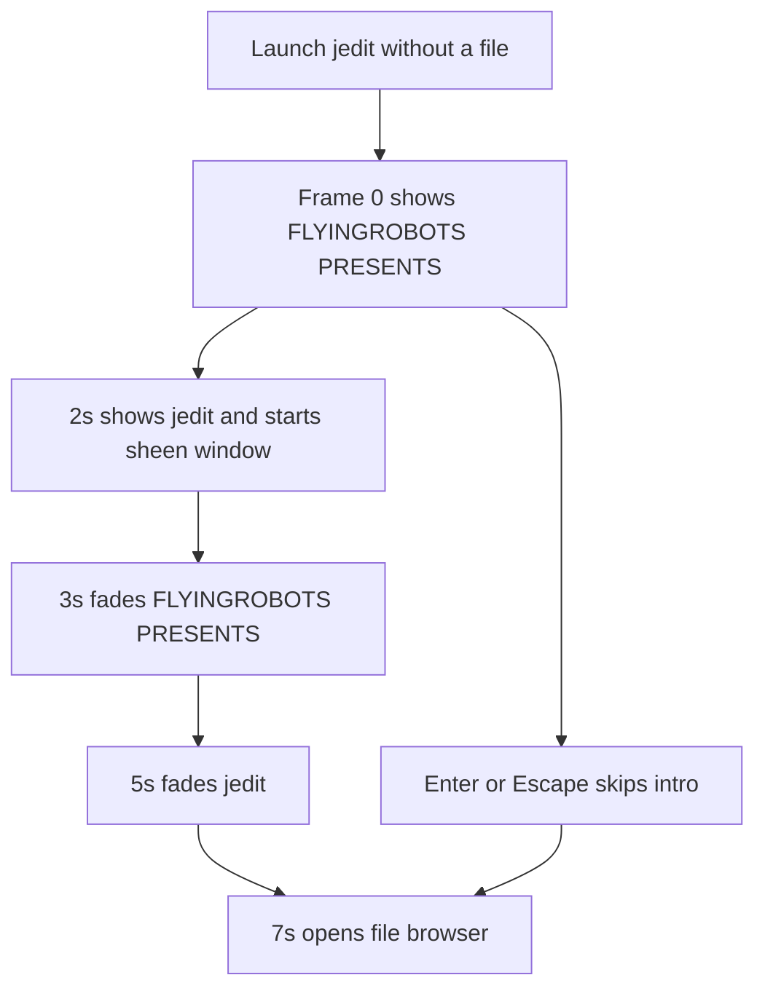
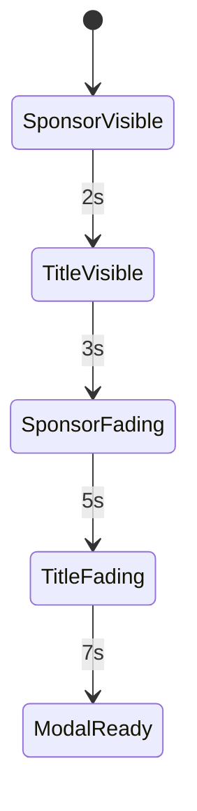

# WF-0037 - Title Intro Fade Before Modal

## Linked Issue

- https://github.com/flyingrobots/jedit/issues/63

## Decision Summary

The title presentation sequence will fade `FLYINGROBOTS PRESENTS` out before
the startup file browser opens, then fade the `jedit` logo out before the modal
appears. The startup modal remains responsible only for opening at the completed
intro boundary; the title presentation owns logo opacity, sheen timing, and
direction-aware highlight motion.

## Sponsored Human

A person starting jedit without a file wants the title sequence to finish cleanly
before the file browser appears so that startup feels deliberate, without
having title logos visually collide with the first actionable modal.

## Sponsored Agent

An agent needs a deterministic title-presentation contract so it can assert the
logo opacity and modal-open boundary from rendered output, without inferring
animation state from visual overlap in terminal screenshots.

## Hill

By the end of this cycle, the user sees `FLYINGROBOTS PRESENTS` immediately,
the `jedit` logo at 2 seconds, the `FLYINGROBOTS PRESENTS` layer fading after 3
seconds, the `jedit` layer fading after 5 seconds, and the file browser opening
at 7 seconds, and the repo proves it with focused title-render and workspace
startup tests.

## Current Truth

The merge target for this cycle is `origin/main` at
`2fd89d253046b1dd2b4122426dc0a3dd2f8ed7f6`.

Current anchors:

- `src/ui/title-presentation-sequence.ts` sets the title appear time to 2
  seconds, the complete time to 7 seconds, and the fade duration to 0 seconds:
  [src/ui/title-presentation-sequence.ts#L17:2fd89d253046b1dd2b4122426dc0a3dd2f8ed7f6](https://github.com/flyingrobots/jedit/blob/2fd89d253046b1dd2b4122426dc0a3dd2f8ed7f6/src/ui/title-presentation-sequence.ts#L17).
- The same sequence keeps any visible layer fully opaque until its fade boundary
  when fade duration is 0:
  [src/ui/title-presentation-sequence.ts#L65:2fd89d253046b1dd2b4122426dc0a3dd2f8ed7f6](https://github.com/flyingrobots/jedit/blob/2fd89d253046b1dd2b4122426dc0a3dd2f8ed7f6/src/ui/title-presentation-sequence.ts#L65).
- `src/app/workspace/startup-file-modal.ts` opens the startup modal at 7
  seconds:
  [src/app/workspace/startup-file-modal.ts#L17:2fd89d253046b1dd2b4122426dc0a3dd2f8ed7f6](https://github.com/flyingrobots/jedit/blob/2fd89d253046b1dd2b4122426dc0a3dd2f8ed7f6/src/app/workspace/startup-file-modal.ts#L17).
- The existing title spec asserts both logos are still visible at 6.5 seconds
  and gone only after 7 seconds:
  [spec/title-screen.spec.mjs#L247:2fd89d253046b1dd2b4122426dc0a3dd2f8ed7f6](https://github.com/flyingrobots/jedit/blob/2fd89d253046b1dd2b4122426dc0a3dd2f8ed7f6/spec/title-screen.spec.mjs#L247).
- The linked bug report records the desired timing and observed regression:
  https://github.com/flyingrobots/jedit/issues/63.

## Problem

The title sequence currently treats the file browser open time as the same
moment as logo disappearance. Because fade duration is 0, the logos stay fully
visible through the intro and then disappear abruptly at the modal boundary,
which regresses the requested product startup rhythm.

## Scope

This cycle includes:

- Retiming the pure title presentation sequence.
- Preserving the 7 second startup modal open boundary.
- Preserving Enter and Escape as intentional intro skips.
- Adding regression coverage that fails when the logos are still visible near
  the modal-open boundary.
- Filling in this design doc retrospective before the PR is marked ready.

## Non-Goals

This cycle does not include:

- Replacing the startup file modal with Bijou components.
- Changing the file browser Esc behavior.
- Adding a new title-scene director timeline authoring tool.
- Adding screenshot or pixel-baseline infrastructure beyond focused rendered
  surface assertions.
- Changing localization strings.

## User Experience / Product Shape

The user starts jedit without a file. The title scene appears immediately with
`FLYINGROBOTS PRESENTS`. At 2 seconds, `jedit` appears and the highlight sheen
can sweep across the logo in the local text direction. At 3 seconds, the
`FLYINGROBOTS PRESENTS` layer begins fading away. At 5 seconds, the `jedit`
layer begins fading away. At 7 seconds, neither logo is visible and the startup
file browser can appear over the frozen title backdrop.

Success is communicated by the modal appearing only after the title layers have
cleared. Failure is the old behavior: any title logo still visible at the modal
open boundary. The user can skip the sequence with Enter or Escape before the
modal opens; a skip intentionally jumps to the modal without playing the fade.

### User Journey



### Wide UI Mockup

Static layout does not change in this cycle. The wide product shape is the
existing full-width title scene with the following timeline:

| Time | Wide terminal state                                      |
| ---- | -------------------------------------------------------- |
| 0s   | `FLYINGROBOTS PRESENTS` visible above the scene.         |
| 2s   | `jedit` logo visible below the sponsor layer.            |
| 3s   | Sponsor layer fades.                                     |
| 5s   | `jedit` layer fades.                                     |
| 7s   | Startup file browser appears with no title logo overlap. |

### Narrow UI Mockup

Static layout does not change in this cycle. Narrow terminals use the same
timeline and the same existing modal breakpoint behavior; this cycle only
changes layer opacity before the modal appears.

### Accessibility Considerations

The intro remains keyboard-skippable with Enter and Escape. The sequence does
not add hidden state that must be narrated. The modal retains existing focus
ownership once it opens.

## Runtime / API Contract

Contract: `titlePresentationSequence(time, textDirection)`.

Relevant behavior:

- `flyingRobotsOpacity` is 1 at 0 seconds.
- `titleOpacity` is 0 before 2 seconds and greater than 0 at 2 seconds.
- `titleSheen` is present only while the title logo is visible and inside the
  sheen window.
- `flyingRobotsOpacity` fades after 3 seconds and reaches 0 before the 7 second
  modal boundary.
- `titleOpacity` fades after 5 seconds and reaches 0 before the 7 second modal
  boundary.
- Right-to-left text direction keeps the sheen direction right-to-left.
- Startup modal auto-open remains keyed to 7 seconds in
  `applyStartupIntroTime`.

## Lower Modes

No separate lower-mode output changes. The proof surface is the same rendered
terminal surface used by the existing title-screen spec, and the existing
keyboard-only skip behavior remains covered by workspace specs.

## Data / State Model

| Category                  | Description                                                                 |
| ------------------------- | --------------------------------------------------------------------------- |
| Source of truth           | `titlePresentationSequence` owns logo opacity and sheen timing.             |
| Derived state             | Rendered title cells derive from opacity values.                            |
| Invalid states            | The startup modal opens at 7 seconds while any title logo layer is visible. |
| Reset behavior            | A new process starts from title time 0.                                     |
| Serialization             | No serialized state changes.                                                |
| Deterministic assumptions | Tests pass fixed times into deterministic render functions.                 |



## Accessibility Posture

| Concern                           | Posture                                                                                         |
| --------------------------------- | ----------------------------------------------------------------------------------------------- |
| Semantic labels or facts          | No new copy or semantic labels.                                                                 |
| Focus order or ownership          | Focus remains in title startup flow until modal open; modal owns focus after 7 seconds or skip. |
| Hidden or visual-only information | No required action depends on observing the fade.                                               |
| Keyboard behavior                 | Enter and Escape still skip the intro before the modal opens.                                   |
| Secret or redaction behavior      | Not applicable.                                                                                 |

## Localization / Directionality Posture

No visible strings change. Directionality remains relevant only to the existing
logo sheen direction, which must keep sweeping right-to-left for right-to-left
locales.

## Agent Inspectability / Explainability Posture

Agents can inspect:

- deterministic `titlePresentationSequence` return values;
- rendered surface cells at fixed timestamps;
- workspace startup state after `applyStartupIntroTime`;
- GitHub issue and PR links attached to this cycle.

## Linked Invariants

- Tests are executable spec.
- Runtime truth beats type theater.
- Design should become repo truth.
- Files and previews are projections.
- Echo authority remains outside jedit product nouns.

## Design Alternatives Considered

### Option A: Independent Fade Windows

Pros:

- Matches the reported timing exactly.
- Keeps modal open time stable at 7 seconds.
- Keeps animation state local to the title presentation sequence.

Cons:

- Adds two fade constants instead of one shared complete boundary.

### Option B: Delay Modal Until Existing Logos Disappear

Pros:

- Smaller code change if current sequence stayed mostly intact.

Cons:

- Changes startup interaction latency.
- Does not match the issue's requested timing.
- Keeps the title sequence coupled to modal timing.

## Decision

Choose Option A. The title presentation will own separate fade start times for
the sponsor layer and title layer while the startup flow keeps the modal open
boundary at 7 seconds.

## Implementation Slices

- [ ] Slice 1: Commit this design packet. Commit message: `docs: design title intro fade before modal`.
- [ ] Slice 2: Add a failing rendered title regression test for the 3s, 5s,
      and 7s fade contract.
- [ ] Slice 3: Retiming `titlePresentationSequence` with independent fade
      windows while preserving sheen direction.
- [ ] Slice 4: Verify focused title and workspace startup tests.
- [ ] Slice 5: Fill in the retrospective, push, and mark the PR ready.

## Tests To Write First

Behavior tests required:

- [ ] `spec/title-screen.spec.mjs` proves sponsor fade after 3 seconds, title
      fade after 5 seconds, and no logo cells before the modal opens at 7 seconds.
- [ ] `spec/workspace-title-screen.spec.mjs` continues proving Enter and Escape
      skip directly to the startup modal.

Documentation and process tests:

- [ ] Prettier validates this design doc.

Rule: documentation tests cannot be the only proof for implementation work.

## Acceptance Criteria

The work is done when:

- [ ] Rendered title output proves `FLYINGROBOTS PRESENTS` is absent before the
      modal opens.
- [ ] Rendered title output proves `jedit` is absent before the modal opens.
- [ ] Direction-aware sheen behavior still passes.
- [ ] Startup modal still opens at 7 seconds and still supports Enter/Escape
      skip.
- [ ] Issue and PR are linked correctly.
- [ ] CI and local validation are green.

## Validation Plan

Commands expected before PR:

```bash
npm run build
JEDIT_DIST_PREBUILT=1 node --test --test-concurrency=1 spec/title-screen.spec.mjs spec/workspace-title-screen.spec.mjs
npm run quality
npx --no-install prettier --check docs/design/0037-title-intro-fade-before-modal.md
```

## Playback / Witness

Reviewers can run:

```bash
npm run build
JEDIT_DIST_PREBUILT=1 node --test --test-concurrency=1 spec/title-screen.spec.mjs spec/workspace-title-screen.spec.mjs
```

Visual reproduction:

- Launch jedit without a file.
- Do not press keys.
- Watch `FLYINGROBOTS PRESENTS` immediately, `jedit` at 2 seconds, sponsor
  fade after 3 seconds, title fade after 5 seconds, and file browser at 7
  seconds.
- Repeat with Enter or Escape before 7 seconds to confirm skip still opens the
  modal immediately.

## Risks

Known risks:

- Rendered-cell assertions can accidentally count scene cells as logo cells if
  the test predicates are too broad.
- Very short fade windows could become visually abrupt.

Mitigations:

- Reuse existing logo cell predicates that already distinguish bold logo
  overlays from scene cells.
- Keep fade windows long enough to be visible while still complete before the
  modal opens.

## Follow-On Debt

No follow-on debt is introduced by this cycle. Existing title-screen issues
remain tracked separately:

- https://github.com/flyingrobots/jedit/issues/39
- https://github.com/flyingrobots/jedit/issues/40
- https://github.com/flyingrobots/jedit/issues/41
- https://github.com/flyingrobots/jedit/issues/42
- https://github.com/flyingrobots/jedit/issues/43
- https://github.com/flyingrobots/jedit/issues/44
- https://github.com/flyingrobots/jedit/issues/46
- https://github.com/flyingrobots/jedit/issues/56
- https://github.com/flyingrobots/jedit/issues/78

## Retrospective

Fill this in after implementation.

What changed from the design:

- Pending.

What the tests proved:

- Pending.

What remains open:

- Pending.

PR:

- Pending.
