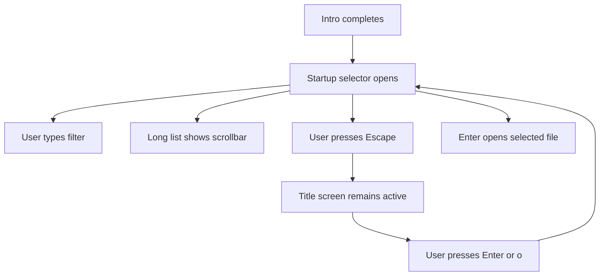
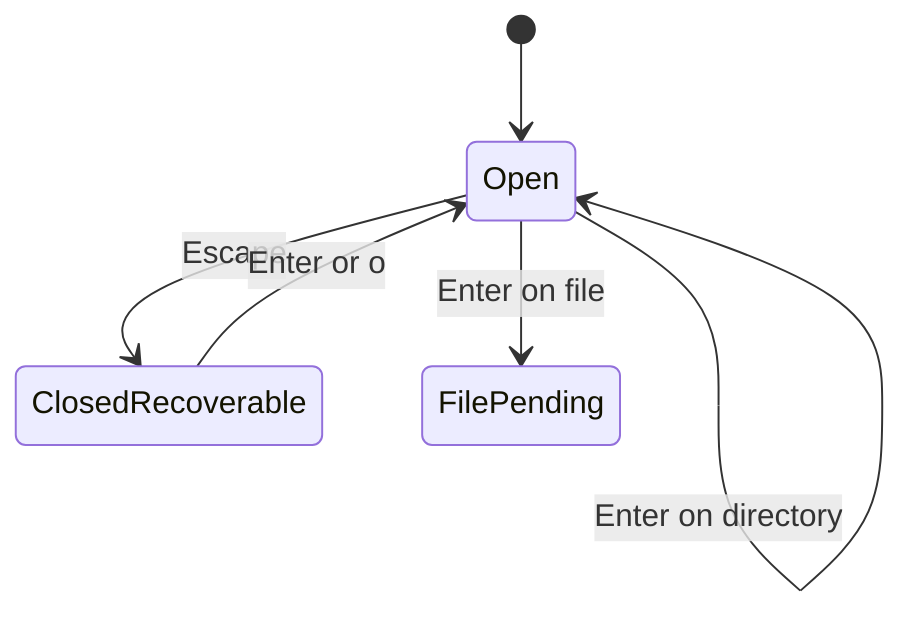

# WF-0038 - Startup File Modal Bijou Recovery

## Linked Issue

- https://github.com/flyingrobots/jedit/issues/56

## Decision Summary

The startup file modal will keep Jedit-owned file identity, filtering, and open
effects, but it will render the selectable file list through Bijou's browsable
list and viewport surface so overflow receives a real scrollbar affordance. If
the user dismisses the modal with Escape, the title screen will remain
recoverable by reopening the selector with Enter or `o`.

## Sponsored Human

A person launching jedit without a file wants the startup file selector to look
and behave like the rest of the app so that opening a file is obvious and
recoverable, without getting stranded on an inert title screen after pressing
Escape.

## Sponsored Agent

An agent needs a deterministic modal rendering contract so it can inspect theme
tokens, overflow affordances, and key recovery from surfaces and model state,
without comparing screenshots or assuming private title-screen state.

## Hill

By the end of this cycle, the title startup selector renders overflowing file
rows with a Bijou scrollbar using jedit theme tokens, Escape can dismiss the
selector without trapping the user, Enter or `o` reopens it from the title
screen, and focused workspace specs prove the behavior.

## Current Truth

The merge target for this cycle is `origin/main` at
`62b8ae43e729bec7602311477646c00c5fb817b6`.

Current anchors:

- `src/ui/startup-file-modal.ts` imports Bijou's `modal` shell:
  [src/ui/startup-file-modal.ts#L2:62b8ae43e729bec7602311477646c00c5fb817b6](https://github.com/flyingrobots/jedit/blob/62b8ae43e729bec7602311477646c00c5fb817b6/src/ui/startup-file-modal.ts#L2).
- The same file still hand-paints the modal body and rows:
  [src/ui/startup-file-modal.ts#L68:62b8ae43e729bec7602311477646c00c5fb817b6](https://github.com/flyingrobots/jedit/blob/62b8ae43e729bec7602311477646c00c5fb817b6/src/ui/startup-file-modal.ts#L68).
- The current scroll window is bespoke row slicing with no rendered scrollbar:
  [src/ui/startup-file-modal.ts#L98:62b8ae43e729bec7602311477646c00c5fb817b6](https://github.com/flyingrobots/jedit/blob/62b8ae43e729bec7602311477646c00c5fb817b6/src/ui/startup-file-modal.ts#L98).
- Escape closes the open startup modal:
  [src/app/workspace/startup-file-modal-key-bindings.ts#L44:62b8ae43e729bec7602311477646c00c5fb817b6](https://github.com/flyingrobots/jedit/blob/62b8ae43e729bec7602311477646c00c5fb817b6/src/app/workspace/startup-file-modal-key-bindings.ts#L44).
- Existing workspace specs cover rendering, filtering, opening files, bounded
  navigation, directory entry, empty states, and small-terminal behavior:
  [spec/workspace-title-screen.spec.mjs#L258:62b8ae43e729bec7602311477646c00c5fb817b6](https://github.com/flyingrobots/jedit/blob/62b8ae43e729bec7602311477646c00c5fb817b6/spec/workspace-title-screen.spec.mjs#L258).
- Bijou TUI exposes `browsableListSurface` and `viewportSurface` with a
  `showScrollbar` option through `@flyingrobots/bijou-tui` 7.0.0.
- The linked issue records the user-facing failure report:
  https://github.com/flyingrobots/jedit/issues/56.

## Problem

The startup file selector is only partially Bijou-backed. It uses Bijou for the
modal frame but owns row clipping and list rendering itself, so long current
directories do not expose a scrollbar affordance. Escape dismisses the modal
and leaves no tested key path to reopen it from the title screen.

## Scope

This cycle includes:

- Rendering the selectable file row viewport with Bijou's browsable list
  surface.
- Painting list, selected row, and scrollbar cells with existing jedit theme
  tokens.
- Preserving current filtering, directory navigation, selected index, and file
  open behavior.
- Adding a recoverable closed-modal title path: Enter or `o` reopens the
  startup selector when no editor is open and the intro is complete.
- Adding regression specs for overflow scrollbar rendering, theme-token use,
  and Esc recovery.

## Non-Goals

This cycle does not include:

- Moving Jedit file identity or open effects into Bijou's `filePicker` state.
- Adding mouse support to the startup selector.
- Replacing the startup modal with a full app-frame project picker.
- Changing localization copy.
- Changing the title intro timing.

## User Experience / Product Shape

The user starts jedit without a file. After the intro, the file selector appears
over the frozen title scene. The selector shows the current directory, an input
line, a current-directory label, and a scrollable list of matching files. When
the matching file list overflows, a scrollbar appears at the list edge. Escape
dismisses the selector. From the title screen, Enter or `o` opens the selector
again.

Success is communicated by the visible scrollbar on overflow, selected row
highlighting, and the modal returning when the user presses Enter or `o` after
Escape. Failure is a long file list with no scroll affordance or a modal-close
state where common open keys do nothing.

### User Journey



### Wide UI Mockup

```text
+--------------------------------------------------------------+
| Open file                                                    |
| /repo                                                        |
| Filter: read                                                 |
|                                                              |
| Current directory                                            |
| > src/                                                    █  |
|   README.md                                              │  |
|   package.json                                           │  |
|   docs/                                                  │  |
| Type filter - Enter open - Esc close                       |
+--------------------------------------------------------------+
```

The wide view keeps the existing centered modal. The scrollbar is part of the
list viewport, not the modal border.

### Narrow UI Mockup

```text
+------------------------------------+
| Open file                          |
| /repo                              |
| Filter: r                          |
| Current directory                  |
| > README.md                     █  |
|   ROADMAP.md                   │  |
| Type filter - Enter open - Esc close |
+------------------------------------+
```

The narrow view keeps the existing small-terminal guard. When the terminal is
below the existing minimum geometry, the selector remains hidden and the
minimum-terminal notice wins.

### Accessibility Considerations

The startup selector is keyboard-only and remains keyboard-recoverable after
Escape. The scrollbar is an additional visual affordance; it is not the only
way to move through the list. Agents can inspect model state and rendered
surface cells to determine focus and overflow.

## Runtime / API Contract

Contract: startup file modal rendering and key bindings.

Relevant behavior:

- `renderStartupFileModal` returns a Bijou `Overlay` with a modal shell and a
  body surface.
- File rows are rendered through Bijou's browsable list surface.
- Overflowing rows render a scrollbar in the list viewport.
- The scrollbar track and thumb are painted from jedit theme tokens.
- Selected rows continue to use the current selected-index model.
- Escape closes an open startup modal.
- Enter and `o` reopen the startup modal when no editor is open, the intro is
  complete, and no higher-priority overlay owns focus.

## Lower Modes

The rendered surface remains deterministic for tests and non-interactive
inspection. The small-terminal lower mode is unchanged: the minimum-terminal
notice suppresses the startup selector below the existing geometry threshold.

## Data / State Model

| Category                  | Description                                                                             |
| ------------------------- | --------------------------------------------------------------------------------------- |
| Source of truth           | `WorkspaceModel.entries`, `startupFileModalInput`, and `startupFileModalSelectedIndex`. |
| Derived state             | Filtered rows, Bijou list state, first visible row, and scrollbar position.             |
| Invalid states            | Modal closed after Escape with no key path to reopen while no editor is open.           |
| Reset behavior            | Reopened modal resets selection to the first row through `openStartupFileModal`.        |
| Serialization             | No serialized state changes.                                                            |
| Deterministic assumptions | Render tests use fixed model entries and theme tokens.                                  |



## Accessibility Posture

| Concern                           | Posture                                                                            |
| --------------------------------- | ---------------------------------------------------------------------------------- |
| Semantic labels or facts          | Existing title, hint, input label, and current-directory copy remain.              |
| Focus order or ownership          | Modal owns focus while open; title screen owns focus after Escape.                 |
| Hidden or visual-only information | Scrollbar is redundant to keyboard navigation and model-selected index.            |
| Keyboard behavior                 | Escape closes; Enter and `o` reopen; arrows and Vim keys keep existing navigation. |
| Secret or redaction behavior      | Not applicable.                                                                    |

## Localization / Directionality Posture

No user-visible strings change. The existing localized modal copy remains
authoritative. Directionality does not change in this cycle.

## Agent Inspectability / Explainability Posture

Agents can inspect:

- `WorkspaceModel.startupFileModalOpen` after Escape and reopen keys;
- rendered `Overlay.surface` cells for scrollbar characters;
- rendered cells for theme-token foreground/background values;
- focused row text and model-selected index;
- PR and issue links for this cycle.

## Linked Invariants

- Tests are executable spec.
- Runtime truth beats type theater.
- Design should become repo truth.
- Buffers, panes, panels, and lenses are different things.
- Files and previews are projections.
- Echo authority remains outside jedit product nouns.

## Design Alternatives Considered

### Option A: Adopt Bijou Browsable List Surface

Pros:

- Reuses Bijou's viewport and scrollbar behavior.
- Keeps Jedit's file identity, filtering, and open effects unchanged.
- Gives this cycle a focused, testable surface contract.

Cons:

- Jedit still maps its theme tokens onto the resulting surface.

### Option B: Adopt Bijou File Picker State

Pros:

- Would reuse more of Bijou's file picker surface and state transforms.

Cons:

- Duplicates or bypasses Jedit's existing file entry port and directory-open
  behavior.
- Risks changing file identity while fixing a UI affordance bug.

### Option C: Keep Bespoke Rows and Paint a Custom Scrollbar

Pros:

- Smallest code change.

Cons:

- Continues the exact bespoke-list drift the issue calls out.
- Makes future list behavior diverge from Bijou primitives.

## Decision

Choose Option A. Jedit remains responsible for product file semantics, while
Bijou owns the list viewport and scrollbar primitive used by the selector.

## Implementation Slices

- [x] Slice 1: Commit this design packet. Commit message:
      `docs: design startup file modal Bijou recovery`.
- [x] Slice 2: Add failing specs for overflow scrollbar, scrollbar token use,
      and Esc-to-reopen recovery.
- [x] Slice 3: Render file rows through Bijou `browsableListSurface` with
      jedit theme-token styling.
- [x] Slice 4: Add title-screen reopen key handling after Escape.
- [x] Slice 5: Verify focused tests, quality, and docs formatting.
- [x] Slice 6: Fill retrospective, push, mark PR ready, and merge when eligible.

## Tests To Write First

Behavior tests required:

- [x] `spec/workspace-title-screen.spec.mjs` proves overflowing startup modal
      rows render a scrollbar.
- [x] `spec/workspace-title-screen.spec.mjs` proves scrollbar cells use jedit
      theme token colors.
- [x] `spec/workspace-title-screen.spec.mjs` proves Escape followed by Enter or
      `o` reopens the startup selector from the title screen.
- [x] Existing workspace startup specs continue to prove filtering, opening,
      directory navigation, and small-terminal behavior.

Documentation and process tests:

- [x] Prettier validates this design doc.

Rule: documentation tests cannot be the only proof for implementation work.

## Acceptance Criteria

The work is done when:

- [x] Overflowing startup selector rows visibly expose a scrollbar.
- [x] The scrollbar and selected row use theme-token-derived cell styles.
- [x] Escape dismissal is recoverable with Enter or `o`.
- [x] Existing startup modal filtering and open behavior still pass.
- [x] New strings have supported translations, if relevant.
- [x] Issue and PR are linked correctly.
- [ ] CI and local validation are green.

## Validation Plan

Commands expected before PR:

```bash
npm run build
JEDIT_DIST_PREBUILT=1 node --test --test-concurrency=1 spec/workspace-title-screen.spec.mjs
npm run quality
npx --no-install prettier --check docs/design/0038-startup-file-modal-bijou-recovery.md
```

## Playback / Witness

Reviewers can run:

```bash
npm run build
JEDIT_DIST_PREBUILT=1 node --test --test-concurrency=1 spec/workspace-title-screen.spec.mjs
```

Manual playback:

- Launch jedit without a file from a directory with more files than the selector
  can show.
- Wait for the startup selector.
- Confirm the list shows a scrollbar.
- Press Escape, then Enter or `o`, and confirm the selector returns.

## Risks

Known risks:

- Bijou list rows may not preserve jedit's selected-row colors unless Jedit
  explicitly maps theme tokens after rendering.
- Reopen keys could steal input from another overlay if the candidate predicate
  is too broad.

Mitigations:

- Add token-level surface assertions for the scrollbar and selected row.
- Reuse the existing startup intro candidate constraints and require no editor,
  no modal, and editor focus before reopening.

## Follow-On Debt

No follow-on debt is introduced by this cycle. Broader title-screen component
tooling remains tracked by separate issues.

## Retrospective

What changed from the design:

- Implemented the planned Bijou `browsableListSurface` row viewport while
  preserving Jedit-owned file rows and open behavior.
- Painted selected row and scrollbar cells with jedit theme tokens after Bijou
  renders the viewport.
- Added title-screen reopen handling for Enter and `o` after Escape dismissal.

What the tests proved:

- RED: the new overflow test failed because no startup selector scrollbar thumb
  existed, and the new recovery test failed because Enter after Escape left the
  modal closed.
- GREEN:
  `JEDIT_DIST_PREBUILT=1 node --test --test-concurrency=1 spec/workspace-title-screen.spec.mjs`
  passed after the renderer and key-binding changes.
- `npm run quality` and Prettier checks passed locally.

What remains open:

- GitHub CI has not run yet at the time of this implementation commit.
- Other title-screen issues remain tracked as separate cycles.

PR:

- https://github.com/flyingrobots/jedit/pull/89
