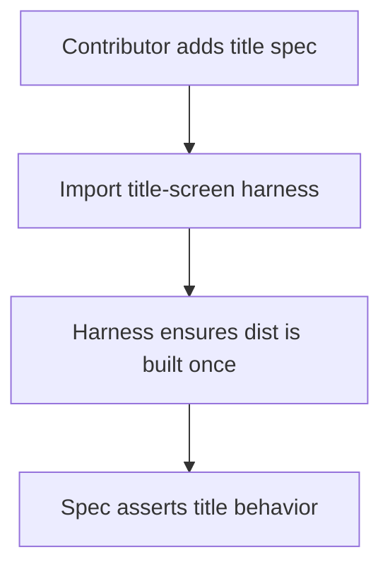

# DX-0039 - Title Screen Spec Harness

## Linked Issue

- https://github.com/flyingrobots/jedit/issues/39

## Decision Summary

Title-related specs will share a small test-only harness for build-once module
imports and genuinely reused surface helpers. The harness will not own one-off
assertions, production constants, or title-scene behavior; it only removes
duplicated setup that makes title specs slower to maintain.

## Sponsored Human

A contributor adding title-screen coverage wants one obvious import/setup helper
so that title specs stay focused on behavior, without copying local
`loadTitleModules` functions and path constants between files.

## Sponsored Agent

An agent needs a shared title spec harness so it can add focused title tests
without inferring dist paths, build timing, or duplicated helper conventions
from neighboring specs.

## Hill

By the end of this cycle, title-screen and title-screen-optics specs share a
test-only harness for dist imports and common surface helpers, each focused spec
remains below the 500-line doctrine, and the repo proves it with focused title
specs plus `npm run quality`.

## Current Truth

The merge target for this cycle is `origin/main` at
`e3f064eb5458b6131f9a996bf7cd5f8bfe63fdaf`.

Current anchors:

- `spec/title-screen.spec.mjs` defines its own dist module paths and
  `loadTitleModules` helper:
  [spec/title-screen.spec.mjs#L8:e3f064eb5458b6131f9a996bf7cd5f8bfe63fdaf](https://github.com/flyingrobots/jedit/blob/e3f064eb5458b6131f9a996bf7cd5f8bfe63fdaf/spec/title-screen.spec.mjs#L8).
- `spec/title-screen.spec.mjs` also owns common surface helpers such as `cells`,
  `positionedCells`, and `isBraille`:
  [spec/title-screen.spec.mjs#L79:e3f064eb5458b6131f9a996bf7cd5f8bfe63fdaf](https://github.com/flyingrobots/jedit/blob/e3f064eb5458b6131f9a996bf7cd5f8bfe63fdaf/spec/title-screen.spec.mjs#L79).
- `spec/title-screen-optics.spec.mjs` defines a second local title module
  loader:
  [spec/title-screen-optics.spec.mjs#L7:e3f064eb5458b6131f9a996bf7cd5f8bfe63fdaf](https://github.com/flyingrobots/jedit/blob/e3f064eb5458b6131f9a996bf7cd5f8bfe63fdaf/spec/title-screen-optics.spec.mjs#L7).
- The issue requests a shared helper while warning against creating a dumping
  ground for one-off assertions: https://github.com/flyingrobots/jedit/issues/39.

## Problem

Title specs repeat build/import setup and basic surface traversal helpers. That
duplication is small today, but every new title-scene spec can copy the same
loader and drift from the other files when dist paths or setup behavior change.

## Scope

This cycle includes:

- Adding `spec/title-screen-helpers.mjs`.
- Moving shared title dist import setup into the helper.
- Moving genuinely reused surface helpers into the helper.
- Updating title-screen and title-screen-optics specs to consume the harness.
- Keeping focused specs below 500 lines.

## Non-Goals

This cycle does not include:

- Changing title rendering behavior.
- Changing title-scene optics behavior.
- Adding new visual regression baselines.
- Extracting every helper from every spec.
- Changing CI shard selection.

## User Experience / Product Shape

Not applicable. This cycle changes test authoring infrastructure only; rendered
Jedit behavior does not change.

### User Journey



### Wide UI Mockup

Not applicable. No rendered UI changes.

### Narrow UI Mockup

Not applicable. No rendered UI changes.

### Accessibility Considerations

Not applicable. No rendered surface or input behavior changes.

## Runtime / API Contract

Contract: test-only `spec/title-screen-helpers.mjs`.

The harness may export:

- fixed title render options used by multiple specs;
- `loadTitleModules` for dist imports;
- `cells`, `positionedCells`, and `isBraille` for surface inspection.

The harness must not export:

- product runtime APIs;
- one-off assertion helpers used by only one spec;
- mutable shared test state beyond the build/import promise.

## Lower Modes

Not applicable. This is test infrastructure only. The executable lower mode is
the focused Node test command.

## Data / State Model

| Category                  | Description                                                      |
| ------------------------- | ---------------------------------------------------------------- |
| Source of truth           | Dist modules built by `ensureDistBuilt`.                         |
| Derived state             | Cached title module import promise in the helper.                |
| Invalid states            | Multiple title specs carry divergent local loaders.              |
| Reset behavior            | Each Node test process starts with an empty helper module cache. |
| Serialization             | No serialization changes.                                        |
| Deterministic assumptions | Fixed render options remain explicit in specs or helper exports. |

## Accessibility Posture

Not applicable. No user-visible surface changes.

## Localization / Directionality Posture

No visible strings change.

## Agent Inspectability / Explainability Posture

Agents can inspect:

- the shared helper exports;
- title spec imports;
- line counts for title specs;
- focused spec output and quality gate output.

## Linked Invariants

- Tests are executable spec.
- Runtime truth beats type theater.
- Design should become repo truth.
- No file over 500 lines of code.

## Design Alternatives Considered

### Option A: Shared Minimal Harness

Pros:

- Removes duplicated setup.
- Keeps one-off assertions close to the tests that use them.
- Reduces future title spec drift.

Cons:

- Adds one more test helper module.

### Option B: Leave Local Helpers Alone

Pros:

- No immediate refactor.

Cons:

- Lets setup drift continue.
- Makes future title specs more likely to copy stale paths.

### Option C: Large Title Assertion Library

Pros:

- Could centralize more title-specific checks.

Cons:

- Creates the dumping ground the issue warns against.
- Makes tests less explicit.

## Decision

Choose Option A. Extract only repeated setup and surface traversal helpers.

## Implementation Slices

- [ ] Slice 1: Commit this design packet. Commit message:
      `docs: design title screen spec harness`.
- [ ] Slice 2: Add the shared title spec harness.
- [ ] Slice 3: Move title-screen spec to the harness.
- [ ] Slice 4: Move title-screen-optics spec to the harness.
- [ ] Slice 5: Verify focused title specs and quality.
- [ ] Slice 6: Fill retrospective, push, mark PR ready, and merge when eligible.

## Tests To Write First

Behavior tests required:

- [ ] `spec/title-screen.spec.mjs` still passes.
- [ ] `spec/title-screen-optics.spec.mjs` still passes.
- [ ] `npm run quality` proves the line-count doctrine remains green.

Documentation and process tests:

- [ ] Prettier validates this design doc.

Rule: documentation tests cannot be the only proof for implementation work.

## Acceptance Criteria

The work is done when:

- [ ] A shared title spec harness exists.
- [ ] Title-screen and title-screen-optics specs use the shared loader.
- [ ] No one-off assertion helpers are moved into the harness.
- [ ] Title specs remain below 500 lines.
- [ ] Issue and PR are linked correctly.
- [ ] CI and local validation are green.

## Validation Plan

Commands expected before PR:

```bash
npm run build
JEDIT_DIST_PREBUILT=1 node --test --test-concurrency=1 spec/title-screen.spec.mjs spec/title-screen-optics.spec.mjs
npm run quality
npx --no-install prettier --check docs/design/0039-title-screen-spec-harness.md spec/title-screen-helpers.mjs spec/title-screen.spec.mjs spec/title-screen-optics.spec.mjs
```

## Playback / Witness

Reviewers can run:

```bash
npm run build
JEDIT_DIST_PREBUILT=1 node --test --test-concurrency=1 spec/title-screen.spec.mjs spec/title-screen-optics.spec.mjs
```

## Risks

Known risks:

- Moving too many helpers would make the harness vague.
- Import caching could accidentally hide test isolation bugs.

Mitigations:

- Export only loader and surface traversal helpers.
- Keep assertion helpers in the spec files where their test intent is visible.

## Follow-On Debt

No follow-on debt is introduced by this cycle.

## Retrospective

Fill this in after implementation.

What changed from the design:

- Pending.

What the tests proved:

- Pending.

What remains open:

- Pending.

PR:

- Pending.
