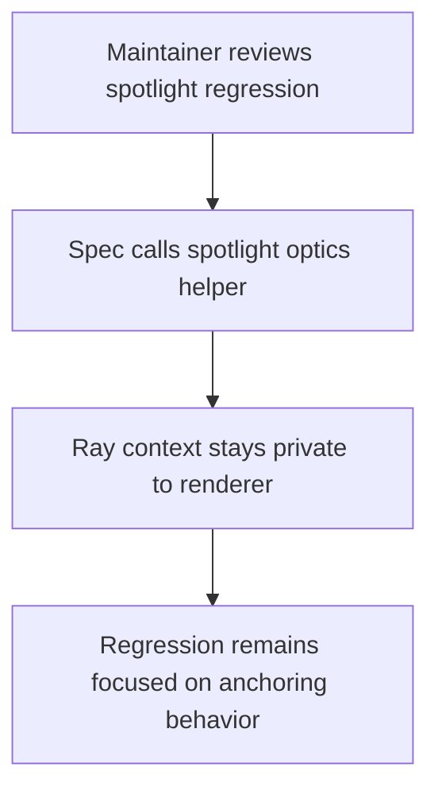
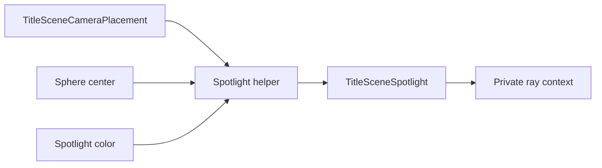

# DX-0040 - Title Scene Optics Hook

## Linked Issue

- https://github.com/flyingrobots/jedit/issues/40

## Decision Summary

The title-scene spotlight anchoring seam will move into
`src/ui/title-screen-optics.ts` as a spotlight-specific helper, and
`titleSceneRayContext` will become private to `src/ui/title-screen.ts` again.
Tests will assert spotlight anchoring through the optics helper instead of
calling the full renderer ray-context constructor.

## Sponsored Human

A contributor maintaining title-scene rendering wants tests to expose only the
behavior under review so that renderer internals do not become accidental API,
without losing regression coverage for the startup scene spotlight.

## Sponsored Agent

An agent needs a named optics helper for spotlight anchoring so it can verify
camera/spotlight geometry directly, without inferring private ray-rendering
state from an exported broad test seam.

## Hill

By the end of this cycle, the spotlight anchoring regression passes through a
spotlight-named optics helper, `titleSceneRayContext` is no longer exported from
the title-screen module, and the repo proves the boundary with focused title
optics specs plus `npm run quality`.

## Current Truth

The merge target for this cycle is `origin/main` at
`de5e4dc5e0c9f05f69345b80c2ddf23d16d9b1f8`.

Current anchors:

- `src/ui/title-screen.ts` exports `titleSceneRayContext`, which constructs the
  full renderer ray context:
  [src/ui/title-screen.ts#L186:de5e4dc5e0c9f05f69345b80c2ddf23d16d9b1f8](https://github.com/flyingrobots/jedit/blob/de5e4dc5e0c9f05f69345b80c2ddf23d16d9b1f8/src/ui/title-screen.ts#L186).
- The exported ray context creates its spotlight from `options.spotlightCamera`
  rather than render camera angle/radius:
  [src/ui/title-screen.ts#L191:de5e4dc5e0c9f05f69345b80c2ddf23d16d9b1f8](https://github.com/flyingrobots/jedit/blob/de5e4dc5e0c9f05f69345b80c2ddf23d16d9b1f8/src/ui/title-screen.ts#L191).
- `src/ui/title-screen-optics.ts` already owns the low-level spotlight object
  constructor:
  [src/ui/title-screen-optics.ts#L76:de5e4dc5e0c9f05f69345b80c2ddf23d16d9b1f8](https://github.com/flyingrobots/jedit/blob/de5e4dc5e0c9f05f69345b80c2ddf23d16d9b1f8/src/ui/title-screen-optics.ts#L76).
- `spec/title-screen-optics.spec.mjs` currently calls
  `title.titleSceneRayContext` solely to prove spotlight anchoring:
  [spec/title-screen-optics.spec.mjs#L70:de5e4dc5e0c9f05f69345b80c2ddf23d16d9b1f8](https://github.com/flyingrobots/jedit/blob/de5e4dc5e0c9f05f69345b80c2ddf23d16d9b1f8/spec/title-screen-optics.spec.mjs#L70).
- The GitHub issue asks for a narrower seam named around spotlight anchoring:
  https://github.com/flyingrobots/jedit/issues/40.

## Problem

The optics regression exports and calls `titleSceneRayContext`, which exposes
renderer internals beyond the behavior under test. The exported surface invites
future tests or callers to depend on full ray-context construction when they
only need to verify spotlight anchoring.

## Scope

This cycle includes:

- Adding a title-screen optics helper named around spotlight camera anchoring.
- Moving spotlight camera placement math out of the broad renderer test seam.
- Updating `titleSceneRayContext` to use the new optics helper internally.
- Removing the public export from `titleSceneRayContext`.
- Updating focused optics specs to assert through the new helper.

## Non-Goals

This cycle does not include:

- Changing title-scene visuals.
- Reworking all title-scene geometry.
- Adding visual regression snapshots.
- Changing the Echo-backed editor path.
- Changing title startup timing.

## User Experience / Product Shape

Not applicable. This cycle changes test and module boundaries only; rendered
Jedit behavior does not change.

### User Journey



### Wide UI Mockup

Not applicable. No rendered UI changes.

### Narrow UI Mockup

Not applicable. No rendered UI changes.

### Accessibility Considerations

Not applicable. No rendered surface or input behavior changes.

## Runtime / API Contract

Contract: title-scene optics module boundary.

`src/ui/title-screen-optics.ts` will export a helper shaped like:

```ts
titleSceneSpotlightForCameraPlacement(
  camera: TitleSceneCameraPlacement,
  sphereCenter: TitleSceneVector3,
  color: readonly [number, number, number],
): TitleSceneSpotlight
```

`src/ui/title-screen.ts` will keep `titleSceneRayContext` as an internal
function. Tests and external modules must not import it as a public seam.

Error behavior does not change. Rendering state transitions do not change.

## Lower Modes

Not applicable. This is a TypeScript module boundary and focused Node spec
cycle. The lower-mode witness is the focused test command.

## Data / State Model

| Category                  | Description                                                        |
| ------------------------- | ------------------------------------------------------------------ |
| Source of truth           | Title-scene camera placement and material colors passed to render. |
| Derived state             | Spotlight source, target, direction, and cone metadata.            |
| Invalid states            | Tests depending on full ray context to inspect spotlight behavior. |
| Reset behavior            | No persistent state.                                               |
| Serialization             | No serialization changes.                                          |
| Deterministic assumptions | Same camera placement and color produce the same spotlight.        |



## Accessibility Posture

Not applicable. No user-visible surface changes.

## Localization / Directionality Posture

No visible strings change.

## Agent Inspectability / Explainability Posture

Agents can inspect:

- exported optics helper names;
- the absence of `export` on `titleSceneRayContext`;
- focused optics spec assertions;
- local and CI check output.

## Linked Invariants

- Tests are executable spec.
- Runtime truth beats type theater.
- Design should become repo truth.
- No accidental API surface for private renderer internals.

## Design Alternatives Considered

### Option A: Spotlight-Specific Optics Helper

Pros:

- Names the seam after the behavior under test.
- Keeps full ray-context construction private.
- Reuses the optics module that already owns spotlight math.

Cons:

- Adds one exported helper to optics.

### Option B: Keep Exported Ray Context

Pros:

- No implementation work.

Cons:

- Keeps broad internals exposed.
- Encourages future tests to depend on ray-context construction.

### Option C: Render Pixels Only

Pros:

- Tests the visible surface.

Cons:

- Makes the anchoring regression indirect and brittle.
- Belongs more naturally to the visual-regression follow-up issue.

## Decision

Choose Option A. Add the spotlight-specific optics helper and make the ray
context private again.

## Implementation Slices

- [ ] Slice 1: Commit this design packet. Commit message:
      `docs: design title scene optics hook`.
- [ ] Slice 2: Add the spotlight camera placement helper in title optics.
- [ ] Slice 3: Update title-screen renderer internals to use the helper.
- [ ] Slice 4: Update optics specs to remove `titleSceneRayContext` usage.
- [ ] Slice 5: Verify focused specs, build, quality, and formatting.
- [ ] Slice 6: Fill retrospective, push, mark PR ready, and merge when eligible.

## Tests To Write First

Behavior tests required:

- [ ] `spec/title-screen-optics.spec.mjs` fails while it still depends on
      `titleSceneRayContext`, then passes through the narrower helper.
- [ ] `npm run build` proves the removed export does not leak through public
      consumers.
- [ ] `npm run quality` stays green.

Documentation and process tests:

- [ ] Prettier validates this design doc.

Rule: documentation tests cannot be the only proof for implementation work.

## Acceptance Criteria

The work is done when:

- [ ] The spotlight anchoring regression asserts through a spotlight-named
      optics helper.
- [ ] `titleSceneRayContext` is no longer exported from `title-screen.ts`.
- [ ] The new seam is narrower than full ray-context construction.
- [ ] No title-scene visual behavior changes.
- [ ] Issue and PR are linked correctly.
- [ ] Local validation is green; CI is green before merge.

## Validation Plan

Commands expected before PR:

```bash
npm run build
JEDIT_DIST_PREBUILT=1 node --test --test-concurrency=1 spec/title-screen-optics.spec.mjs
npm run quality
npx --no-install prettier --check docs/design/0040-title-scene-optics-hook.md src/ui/title-screen.ts src/ui/title-screen-optics.ts spec/title-screen-optics.spec.mjs
```

## Playback / Witness

Reviewers can run:

```bash
npm run build
JEDIT_DIST_PREBUILT=1 node --test --test-concurrency=1 spec/title-screen-optics.spec.mjs
```

## Risks

Known risks:

- Moving geometry can accidentally duplicate or drift camera height constants.
- A too-broad helper would repeat the same API-surface mistake under a new name.

Mitigations:

- Keep the exported helper named around spotlight placement.
- Leave ray origin/ray direction construction private to the renderer.
- Verify the focused optics regression and build.

## Follow-On Debt

No follow-on debt is introduced by this cycle.

## Retrospective

Fill this in after implementation.

What changed from the design:

- Pending.

What the tests proved:

- Pending.

What remains open:

- Pending.

PR:

- Pending.
