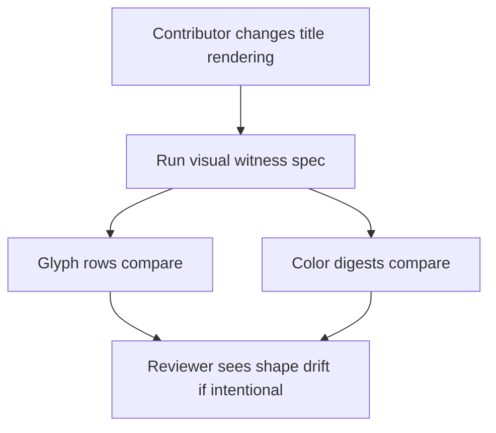
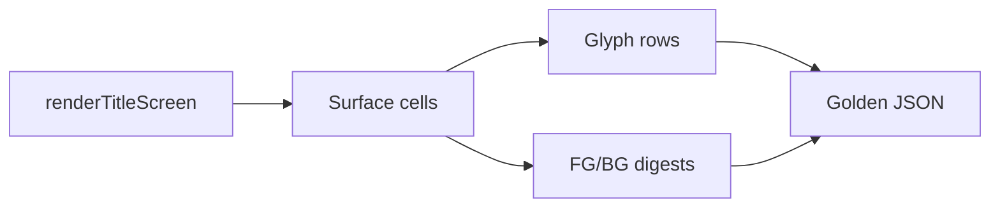

# DX-0041 - Title Scene Visual Regression

## Linked Issue

- https://github.com/flyingrobots/jedit/issues/41

## Decision Summary

Title-scene visual regression coverage will use a small golden JSON witness with
human-readable glyph rows and separate color digests for representative
deterministic render cases. The witness will live under `spec/fixtures/`, and a
focused Node spec will compare glyph shape separately from color evidence so
failures identify the kind of visual drift.

## Sponsored Human

A maintainer changing the title scene wants a compact visual witness so that
intentional rendering changes are reviewable, without scanning a full terminal
frame or reverse-engineering low-level optics assertions.

## Sponsored Agent

An agent needs deterministic render witness data so it can identify glyph drift
and color drift independently, without scraping screenshots or inferring visual
state from prose.

## Hill

By the end of this cycle, title-scene renders have a committed compact visual
witness for deterministic Braille, ASCII, logo-visible, and logo-faded cases,
and the repo proves it with a focused witness spec plus `npm run quality`.

## Current Truth

The merge target for this cycle is `origin/main` at
`4a1cb499a46895dd3efdc6fd8fdf2b5d89fe5004`.

Current anchors:

- `spec/title-scene-render.spec.mjs` asserts deterministic title-scene
  behavior through targeted optics and glyph checks:
  [spec/title-scene-render.spec.mjs#L1:4a1cb499a46895dd3efdc6fd8fdf2b5d89fe5004](https://github.com/flyingrobots/jedit/blob/4a1cb499a46895dd3efdc6fd8fdf2b5d89fe5004/spec/title-scene-render.spec.mjs#L1).
- `spec/title-screen-helpers.mjs` provides shared title module loading and
  surface traversal helpers:
  [spec/title-screen-helpers.mjs#L1:4a1cb499a46895dd3efdc6fd8fdf2b5d89fe5004](https://github.com/flyingrobots/jedit/blob/4a1cb499a46895dd3efdc6fd8fdf2b5d89fe5004/spec/title-screen-helpers.mjs#L1).
- `src/ui/title-screen.ts` owns the rendered title surface entrypoint:
  [src/ui/title-screen.ts#L124:4a1cb499a46895dd3efdc6fd8fdf2b5d89fe5004](https://github.com/flyingrobots/jedit/blob/4a1cb499a46895dd3efdc6fd8fdf2b5d89fe5004/src/ui/title-screen.ts#L124).
- There is no committed golden fixture for title-scene render shape or color
  posture.
- The GitHub issue asks for deterministic visual regression coverage that is
  small enough for review and separates glyph from color failures:
  https://github.com/flyingrobots/jedit/issues/41.

## Problem

Existing title tests prove individual geometry, optics, material, and timeline
claims, but there is no compact artifact that lets a reviewer see and detect
whole-render drift across representative title-scene cases.

## Scope

This cycle includes:

- Adding a focused title-scene visual witness spec.
- Adding a committed compact JSON fixture under `spec/fixtures/`.
- Capturing deterministic glyph rows separately from foreground/background
  color digests.
- Covering at least one Braille render, one ASCII render, one logo-visible
  timestamp, and one logo-faded timestamp.
- Keeping fixtures small and reviewable.

## Non-Goals

This cycle does not include:

- Pixel screenshots or terminal screenshot comparison.
- Full-size terminal frame fixtures.
- A fixture update command.
- New title-scene visuals.
- New theme authoring or lighting behavior.

## User Experience / Product Shape

Not applicable. This cycle adds test witness coverage only; rendered Jedit
behavior does not change.

### User Journey



### Wide UI Mockup

Not applicable. No rendered UI changes.

### Narrow UI Mockup

Not applicable. No rendered UI changes.

### Accessibility Considerations

Not applicable. No rendered surface or input behavior changes.

## Runtime / API Contract

Contract: test-only title visual witness.

The fixture will store entries shaped like:

```ts
interface TitleVisualWitnessCase {
  readonly name: string;
  readonly cols: number;
  readonly rows: number;
  readonly glyphRows: readonly string[];
  readonly foregroundDigest: string;
  readonly backgroundDigest: string;
}
```

The spec will produce the same shape from deterministic calls to
`renderTitleScreen` and compare `glyphRows`, `foregroundDigest`, and
`backgroundDigest` independently.

No production API changes.

## Lower Modes

The witness is plain JSON and can be inspected without color-capable terminals
or screenshots. No-color rendering behavior is not changed.

## Data / State Model

| Category                  | Description                                                   |
| ------------------------- | ------------------------------------------------------------- |
| Source of truth           | Deterministic title render surfaces from built dist modules.  |
| Derived state             | Compact glyph rows and color digests.                         |
| Invalid states            | Fixture rows generated with non-fixed time, seed, or camera.  |
| Reset behavior            | Each Node test process regenerates actual witness data.       |
| Serialization             | Stable JSON fixture committed under `spec/fixtures/`.         |
| Deterministic assumptions | Fixed dimensions, theme, time, camera, seed, and render mode. |



## Accessibility Posture

Not applicable. The witness is test data, not a user-facing surface.

## Localization / Directionality Posture

No visible strings change.

## Agent Inspectability / Explainability Posture

Agents can inspect:

- stable fixture case names;
- glyph rows as text;
- separate foreground and background digests;
- focused spec assertion failure messages.

## Linked Invariants

- Tests are executable spec.
- Runtime truth beats type theater.
- Design should become repo truth.
- Docs and witnesses should be compact enough to review.

## Design Alternatives Considered

### Option A: Compact JSON Witness

Pros:

- Reviewable in normal diffs.
- Separates glyph and color drift.
- Runs quickly in existing Node test flow.

Cons:

- Does not show true pixel output.

### Option B: Screenshot Regression

Pros:

- Closest to visual inspection.

Cons:

- Requires heavier tooling and terminal/font control.
- More brittle across environments.

### Option C: More Low-Level Assertions

Pros:

- Precise and cheap.

Cons:

- Does not create a whole-render visual artifact.

## Decision

Choose Option A. Add a compact JSON visual witness and focused spec.

## Implementation Slices

- [ ] Slice 1: Commit this design packet. Commit message:
      `docs: design title scene visual regression`.
- [ ] Slice 2: Add the title visual witness spec and make it fail because the
      fixture is missing.
- [ ] Slice 3: Add the committed fixture generated from deterministic renders.
- [ ] Slice 4: Verify focused witness spec, existing title render spec, build,
      quality, and formatting.
- [ ] Slice 5: Fill retrospective, push, mark PR ready, and merge when eligible.

## Tests To Write First

Behavior tests required:

- [ ] `spec/title-scene-visual-witness.spec.mjs` fails before the fixture
      exists and passes after the fixture is committed.
- [ ] `spec/title-scene-render.spec.mjs` still passes.
- [ ] `npm run quality` stays green.

Documentation and process tests:

- [ ] Prettier validates this design doc and fixture formatting.

Rule: documentation tests cannot be the only proof for implementation work.

## Acceptance Criteria

The work is done when:

- [ ] A compact title-scene visual witness fixture is committed.
- [ ] The witness covers Braille, ASCII, logo-visible, and logo-faded cases.
- [ ] The spec compares glyph rows separately from foreground/background color
      digests.
- [ ] The fixture is deterministic under fixed render inputs.
- [ ] Issue and PR are linked correctly.
- [ ] Local validation is green; CI is green before merge.

## Validation Plan

Commands expected before PR:

```bash
npm run build
JEDIT_DIST_PREBUILT=1 node --test --test-concurrency=1 spec/title-scene-visual-witness.spec.mjs spec/title-scene-render.spec.mjs
npm run quality
npx --no-install prettier --check docs/design/0041-title-scene-visual-regression.md spec/title-scene-visual-witness.spec.mjs spec/fixtures/title-scene-visual-witness.json
```

## Playback / Witness

Reviewers can inspect:

```bash
spec/fixtures/title-scene-visual-witness.json
```

Reviewers can run:

```bash
npm run build
JEDIT_DIST_PREBUILT=1 node --test --test-concurrency=1 spec/title-scene-visual-witness.spec.mjs
```

## Risks

Known risks:

- Fixture drift can become noisy if the render dimensions are too large.
- Color digests can hide the exact color cell that changed.

Mitigations:

- Keep dimensions deliberately small.
- Commit glyph rows for shape review and separate foreground/background digests
  for color posture.

## Follow-On Debt

No follow-on debt is introduced by this cycle.

## Retrospective

Fill this in after implementation.

What changed from the design:

- Pending.

What the tests proved:

- Pending.

What remains open:

- Pending.

PR:

- Pending.
