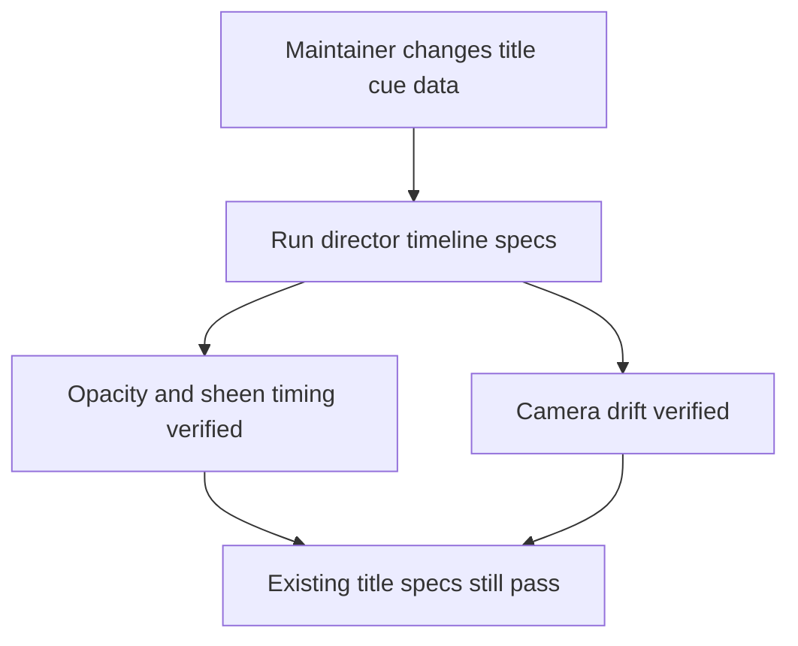
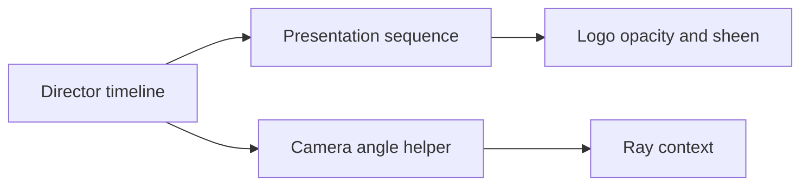

# DX-0042 - Title Scene Director Timeline

## Linked Issue

- https://github.com/flyingrobots/jedit/issues/42

## Decision Summary

The title scene will gain a small validated director timeline object that owns
the default logo opacity cues, sheen cue, and camera drift cue. Existing render
behavior stays unchanged, but `titlePresentationSequence` and title camera drift
will read from the default timeline instead of isolated constants.

## Sponsored Human

A maintainer tuning the startup scene wants camera and logo timing expressed as
named cue data so that the scene feels intentionally directed, without changing
the existing title-screen timing by accident.

## Sponsored Agent

An agent needs an inspectable timeline object and pure interpolation helpers so
it can verify camera and logo cues, without scraping rendered cells or inferring
timing from private constants.

## Hill

By the end of this cycle, the default title-screen logo and camera behavior is
represented by a validated director timeline, existing timing specs still pass,
and new focused timeline specs prove validation, opacity, sheen, and camera
drift behavior.

## Current Truth

The merge target for this cycle is `origin/main` at
`4657d50f45f5179165e1a51d46f7aa6a414dab7a`.

Current anchors:

- `src/ui/title-presentation-sequence.ts` owns logo timing as private constants:
  [src/ui/title-presentation-sequence.ts#L16:4657d50f45f5179165e1a51d46f7aa6a414dab7a](https://github.com/flyingrobots/jedit/blob/4657d50f45f5179165e1a51d46f7aa6a414dab7a/src/ui/title-presentation-sequence.ts#L16).
- `src/ui/title-screen.ts` owns camera drift as `TITLE_CAMERA_DRIFT_RATE`:
  [src/ui/title-screen.ts#L120:4657d50f45f5179165e1a51d46f7aa6a414dab7a](https://github.com/flyingrobots/jedit/blob/4657d50f45f5179165e1a51d46f7aa6a414dab7a/src/ui/title-screen.ts#L120).
- `spec/title-screen.spec.mjs` already proves the existing title presentation
  timing:
  [spec/title-screen.spec.mjs#L282:4657d50f45f5179165e1a51d46f7aa6a414dab7a](https://github.com/flyingrobots/jedit/blob/4657d50f45f5179165e1a51d46f7aa6a414dab7a/spec/title-screen.spec.mjs#L282).
- `spec/title-scene-render.spec.mjs` proves camera drift is readable:
  [spec/title-scene-render.spec.mjs#L17:4657d50f45f5179165e1a51d46f7aa6a414dab7a](https://github.com/flyingrobots/jedit/blob/4657d50f45f5179165e1a51d46f7aa6a414dab7a/spec/title-scene-render.spec.mjs#L17).
- The GitHub issue requests a data-authored director timeline with validation
  and deterministic interpolation: https://github.com/flyingrobots/jedit/issues/42.

## Problem

The title scene has directed timing, but that timing is scattered across private
constants in the presentation sequence and renderer. This makes future cue work
harder to inspect and encourages procedural additions instead of authored data.

## Scope

This cycle includes:

- Adding a `src/ui/title-scene-director.ts` module.
- Defining and validating the default director timeline data.
- Moving default logo opacity, sheen, and camera drift cues into that timeline.
- Updating presentation sequence and camera angle computation to use the
  timeline.
- Adding focused director timeline specs.

## Non-Goals

This cycle does not include:

- Changing default startup visuals or timing.
- Adding an authoring UI.
- Adding theme-authored lighting rigs.
- Adding object keyframes beyond existing camera drift.
- Replacing the existing title camera spring controls.

## User Experience / Product Shape

Rendered behavior should not visibly change in this cycle. The user still sees
the same FLYINGROBOTS and jedit timing, fades, sheen, and ambient camera drift.

### User Journey



### Wide UI Mockup

Not applicable. No visible UI changes.

### Narrow UI Mockup

Not applicable. No visible UI changes.

### Accessibility Considerations

Not applicable. No rendered surface or input behavior changes.

## Runtime / API Contract

Contract: `src/ui/title-scene-director.ts`.

The module will export:

- `TITLE_SCENE_DEFAULT_DIRECTOR_TIMELINE`;
- `validateTitleSceneDirectorTimeline`;
- `titleSceneCueOpacity`;
- `titleSceneCueProgress`;
- `titleSceneCameraAngleAt`.

The timeline contains:

- camera drift rate;
- FLYINGROBOTS opacity cue;
- jedit title opacity cue;
- title sheen cue.

`titlePresentationSequence(time, textDirection)` remains the public presentation
helper and keeps its current return shape. `TITLE_CAMERA_DRIFT_RATE` remains
exported from `title-screen.ts` as a compatibility alias for the default
timeline drift rate.

## Lower Modes

Not applicable. This is deterministic runtime data and focused Node tests.

## Data / State Model

| Category                  | Description                                                    |
| ------------------------- | -------------------------------------------------------------- |
| Source of truth           | `TITLE_SCENE_DEFAULT_DIRECTOR_TIMELINE`.                       |
| Derived state             | Presentation sequence and camera angle at a given time.        |
| Invalid states            | Negative/non-finite times, fade before appear, negative drift. |
| Reset behavior            | No mutable state.                                              |
| Serialization             | No serialization changes.                                      |
| Deterministic assumptions | Same timeline and time produce same cues and camera angle.     |



## Accessibility Posture

Not applicable. No user-visible surface changes.

## Localization / Directionality Posture

No visible strings change. Directionality remains represented by
`TitleScreenTextDirection` and controls sheen direction.

## Agent Inspectability / Explainability Posture

Agents can inspect:

- timeline cue names;
- pure helper outputs for fixed times;
- validation failures for invalid cue data;
- existing title render specs.

## Linked Invariants

- Tests are executable spec.
- Runtime truth beats type theater.
- Design should become repo truth.
- No file over 500 lines of code.

## Design Alternatives Considered

### Option A: Validated Default Timeline

Pros:

- Makes existing timing inspectable as data.
- Keeps behavior stable.
- Creates a foundation for future authoring work.

Cons:

- Adds one runtime module.

### Option B: Leave Constants In Place

Pros:

- No implementation work.

Cons:

- Timing remains scattered and procedural.

### Option C: Full Keyframe System Now

Pros:

- More expressive immediately.

Cons:

- Too much scope for this title-issue cleanup pass.
- Risks changing visuals before the data boundary is proven.

## Decision

Choose Option A. Land the validated default timeline first and keep default
rendering stable.

## Implementation Slices

- [ ] Slice 1: Commit this design packet. Commit message:
      `docs: design title scene director timeline`.
- [ ] Slice 2: Add focused director timeline specs and prove the module is
      missing.
- [ ] Slice 3: Add the director timeline module and validation helpers.
- [ ] Slice 4: Move presentation sequence and camera drift to the timeline.
- [ ] Slice 5: Verify focused director specs plus existing title specs, build,
      quality, and formatting.
- [ ] Slice 6: Fill retrospective, push, mark PR ready, and merge when eligible.

## Tests To Write First

Behavior tests required:

- [ ] `spec/title-scene-director.spec.mjs` fails before the module exists and
      passes after implementation.
- [ ] `spec/title-screen.spec.mjs` still proves current logo timing.
- [ ] `spec/title-scene-render.spec.mjs` still proves camera drift.
- [ ] `npm run quality` stays green.

Documentation and process tests:

- [ ] Prettier validates this design doc.

Rule: documentation tests cannot be the only proof for implementation work.

## Acceptance Criteria

The work is done when:

- [ ] Default logo and camera cues are represented by timeline data.
- [ ] Timeline data is runtime-validated.
- [ ] Default title render behavior remains stable under existing specs.
- [ ] Camera and logo behavior are inspectable by focused specs.
- [ ] Issue and PR are linked correctly.
- [ ] Local validation is green; CI is green before merge.

## Validation Plan

Commands expected before PR:

```bash
npm run build
JEDIT_DIST_PREBUILT=1 node --test --test-concurrency=1 spec/title-scene-director.spec.mjs spec/title-screen.spec.mjs spec/title-scene-render.spec.mjs
npm run quality
npx --no-install prettier --check docs/design/0042-title-scene-director-timeline.md src/ui/title-scene-director.ts src/ui/title-presentation-sequence.ts src/ui/title-screen.ts spec/title-scene-director.spec.mjs
```

## Playback / Witness

Reviewers can run:

```bash
npm run build
JEDIT_DIST_PREBUILT=1 node --test --test-concurrency=1 spec/title-scene-director.spec.mjs
```

## Risks

Known risks:

- Moving constants into data can silently retime the title if tests are too
  coarse.
- Validation helpers can become broader than this cycle needs.

Mitigations:

- Keep existing title-screen timing specs in the validation set.
- Validate only the fields introduced in this cycle.

## Follow-On Debt

No follow-on debt is introduced by this cycle.

## Retrospective

Fill this in after implementation.

What changed from the design:

- Pending.

What the tests proved:

- Pending.

What remains open:

- Pending.

PR:

- Pending.
