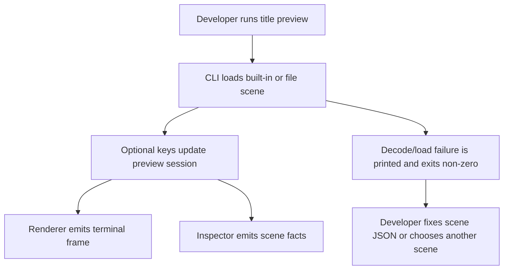
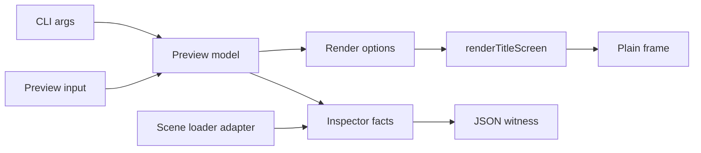

# DX-0043 - Title Scene Authoring Preview

## Linked Issue

- https://github.com/flyingrobots/jedit/issues/43

## Decision Summary

Jedit will add an opt-in title-scene authoring preview surface made of a pure
preview session contract and a developer CLI witness. The preview can scrub
time, adjust camera posture, cycle themes/render modes/scenes/objects, render a
plain terminal frame, and emit machine-readable inspection facts without adding
new authority to title-scene runtime logic or changing normal startup behavior.

## Sponsored Human

A maintainer tuning the title scene wants to preview scene timing, camera
posture, themes, render modes, and selected object facts from the terminal so
that scene authoring is faster, without editing constants and repeatedly
starting the full editor.

## Sponsored Agent

An agent needs deterministic preview state, control intents, and JSON
inspection output so it can verify scene authoring behavior, without scraping
pixels or inferring private renderer state.

## Hill

By the end of this cycle, a developer can run `npm run title:preview -- --json`
or apply preview controls through `titleScenePreviewInput`, and the repo proves
the state/control/inspection contract with focused session and CLI tests.

## Current Truth

The merge target for this cycle is `origin/main` at
`c05587481df6cb2c97899798c0b713c700446ee0`.

Current anchors:

- `renderTitleScreen` can already render a scene override, render mode, theme,
  time, and camera options:
  [src/ui/title-screen.ts#L138:c05587481df6cb2c97899798c0b713c700446ee0](https://github.com/flyingrobots/jedit/blob/c05587481df6cb2c97899798c0b713c700446ee0/src/ui/title-screen.ts#L138).
- `createTitleSceneLoaderPort` already decodes external scene JSON at the
  adapter boundary:
  [src/adapters/title-scene-loader.ts#L73:c05587481df6cb2c97899798c0b713c700446ee0](https://github.com/flyingrobots/jedit/blob/c05587481df6cb2c97899798c0b713c700446ee0/src/adapters/title-scene-loader.ts#L73).
- Built-in title scenes are already registered through
  `BUILT_IN_TITLE_SCENE_NAMES`:
  [src/ports/title-scene-loader.ts#L10:c05587481df6cb2c97899798c0b713c700446ee0](https://github.com/flyingrobots/jedit/blob/c05587481df6cb2c97899798c0b713c700446ee0/src/ports/title-scene-loader.ts#L10).
- `package.json` has no title-scene preview command:
  [package.json#L5:c05587481df6cb2c97899798c0b713c700446ee0](https://github.com/flyingrobots/jedit/blob/c05587481df6cb2c97899798c0b713c700446ee0/package.json#L5).
- Issue #43 requests an opt-in preview mode with controls and focused tests:
  https://github.com/flyingrobots/jedit/issues/43.

## Problem

Title-scene tuning currently requires changing runtime constants or scene JSON
and then running the normal editor or pixel-oriented specs. There is no small
authoring surface that exposes the title scene's time, camera, theme, render
mode, selected object, and scene facts as stable data.

## Scope

This cycle includes:

- Adding a pure `src/app/title-scene-preview-session.ts` session contract.
- Adding a small `src/app/title-scene-preview-input.ts` input vocabulary
  re-exported by the session contract.
- Adding preview inputs for time scrub, camera angle/radius adjustment, theme
  cycling, render-mode cycling, scene cycling, and selected-object cycling.
- Adding an inspector snapshot that reports scene/theme/render/camera/object
  facts.
- Adding an opt-in `scripts/title-scene-preview.mjs` CLI and
  `npm run title:preview` script.
- Covering the session and CLI witness with focused Node tests.

## Non-Goals

This cycle does not include:

- Changing the normal jedit startup title screen.
- Adding an interactive full-screen TUI editor for scenes.
- Writing scene JSON back to disk.
- Adding new scene semantics or lighting rigs.
- Moving scene JSON decoding out of the existing adapter boundary.
- Adding Echo authority to preview-only state.

## User Experience / Product Shape

The user runs an explicit command from the repo root:

```bash
npm run title:preview -- --json
npm run title:preview -- --scene neon-orbit.jedit-scene --key time+ --key theme+
```

Plain mode prints a terminal frame followed by compact inspector lines. JSON
mode emits a deterministic object with `preview`, `inspector`, and optional
`frame` fields. The command is keyboard-compatible through `--key`, which lets
developers and agents replay the same controls that a future full-screen TUI
can use.

### User Journey



### Wide UI Mockup

Plain terminal output at 96 columns:

```text
<title-scene glyph frame>

jedit title preview
scene neon-orbit.jedit-scene  theme graphite  render braille
time 2.50s  camera angle -0.58  radius 6.10  object 2/6 sphere
object radius 0.72  reflectivity 1.00  color 78,195,224
```

### Narrow UI Mockup

Plain terminal output at 48 columns keeps inspector rows separate:

```text
<wrapped title-scene frame>

jedit title preview
scene neon-orbit.jedit-scene
theme graphite  render ascii
time 2.50s  camera -0.58 / 6.10
object 2/6 sphere
```

### Accessibility Considerations

The CLI is keyboard-only and text-first. JSON output provides the same state as
the visible inspector without requiring visual inspection of the rendered frame.

## Runtime / API Contract

Contract: `src/app/title-scene-preview-session.ts`.

The session module will export:

- `TITLE_SCENE_PREVIEW_INPUT`;
- `TITLE_SCENE_PREVIEW_RENDER_MODE`;
- `createTitleScenePreviewModel`;
- `updateTitleScenePreviewModel`;
- `titleScenePreviewInspector`;
- `titleScenePreviewRenderOptions`.

Preview inputs:

- time forward/back;
- camera angle left/right;
- camera radius in/out;
- next/previous theme;
- next/previous render mode;
- next/previous scene;
- next/previous object.

`scripts/title-scene-preview.mjs` will load built-in scenes through
`createTitleSceneLoaderPort`, load meshes through `loadStartupTitleMeshes`, use
`renderTitleScreen`, and print either plain text or JSON. Scene JSON remains
decoded at the adapter boundary. The preview session receives already-decoded
scene facts and does not own file IO.

## Lower Modes

| Concern           | Posture                                                                 |
| ----------------- | ----------------------------------------------------------------------- |
| Terminal size     | CLI accepts `--width` and `--height`; defaults are deterministic.       |
| No color          | Plain output uses glyphs and inspector text; JSON is color-independent. |
| JSON/pipe         | `--json` emits deterministic structured data.                           |
| Keyboard-only     | `--key` accepts replayable preview inputs.                              |
| Optional adapters | Mesh load failures remain reported by existing mesh loader behavior.    |
| Partial evidence  | Invalid scene paths or scene names fail before rendering.               |

## Data / State Model

| Category                  | Description                                                            |
| ------------------------- | ---------------------------------------------------------------------- |
| Source of truth           | Decoded `TitleScene`, built-in scene names, theme list, preview model. |
| Derived state             | Render options, inspector facts, plain frame text.                     |
| Invalid states            | Negative time, radius below minimum, empty theme/scene/render lists.   |
| Reset behavior            | Each CLI invocation starts from a fresh preview model.                 |
| Serialization             | JSON output only; no persisted preview state.                          |
| Deterministic assumptions | Same model, scene, theme, and dimensions produce same output.          |



## Accessibility Posture

| Concern                           | Posture                                                                |
| --------------------------------- | ---------------------------------------------------------------------- |
| Semantic labels or facts          | JSON keys name scene, theme, render mode, camera, and selected object. |
| Focus order or ownership          | Not applicable; no interactive focus in this slice.                    |
| Hidden or visual-only information | Inspector mirrors selected object facts outside the frame.             |
| Keyboard behavior                 | `--key` replays named controls without pointer input.                  |
| Secret or redaction behavior      | No secrets are read or emitted.                                        |

## Localization / Directionality Posture

New visible strings are developer CLI strings and are not part of the localized
product TUI catalog in this cycle. The rendered title scene keeps the existing
left-to-right default; JSON facts are locale-independent.

## Agent Inspectability / Explainability Posture

Agents can inspect:

- stable preview input ids;
- deterministic model fields;
- JSON output with scene/theme/render/camera/object facts;
- focused session tests for state transitions;
- CLI tests for pipe output.

## Linked Invariants

- Tests are executable spec.
- Runtime truth beats type theater.
- Design should become repo truth.
- Files and previews are projections.
- Echo authority remains outside jedit product nouns.

## Design Alternatives Considered

### Option A: Pure Session Plus CLI Witness

Pros:

- Small and testable.
- Keeps decoding at the adapter boundary.
- Gives agents JSON without pixel scraping.
- Does not disturb normal startup behavior.

Cons:

- Not a full-screen interactive editor yet.

### Option B: Full-Screen TUI Preview

Pros:

- Best developer ergonomics eventually.

Cons:

- Larger scope and more focus/layout risk for a cleanup pass.

### Option C: Pixel Fixtures Only

Pros:

- Easy to add more render snapshots.

Cons:

- Does not create an authoring surface or inspectable controls.

## Decision

Choose Option A. Land the session and CLI witness first so future full-screen
preview work can reuse the same controls and inspector contract.

## Implementation Slices

- [x] Slice 1: Commit this design packet. Commit message:
      `docs: design title scene authoring preview`.
- [x] Slice 2: Add RED session and CLI tests for missing preview contract.
- [x] Slice 3: Add the pure preview session, reducer, render options, and
      inspector.
- [x] Slice 4: Add `scripts/title-scene-preview.mjs` and
      `npm run title:preview`.
- [x] Slice 5: Verify focused tests, build, quality, formatting, and
      retrospective.
- [ ] Slice 6: Push, mark PR ready, and merge when eligible.

## Tests To Write First

Behavior tests required:

- [x] `spec/title-scene-preview-session.spec.mjs` fails before the preview
      session exists and passes after implementation.
- [x] `spec/title-scene-preview-cli.spec.mjs` fails before the CLI exists and
      passes after implementation.
- [x] Existing title-screen render specs stay green.
- [x] `npm run quality` stays green.

Documentation and process tests:

- [x] Prettier validates this design doc.

Rule: documentation tests cannot be the only proof for implementation work.

## Acceptance Criteria

The work is done when:

- [x] Preview state/control contract is covered by behavior tests.
- [x] CLI JSON output proves scene/theme/render/camera/object inspection.
- [x] Plain CLI output renders a deterministic terminal frame and inspector.
- [x] Normal startup behavior is unchanged.
- [x] Issue and PR are linked correctly.
- [x] Local validation is green.
- [ ] CI is green before merge.

## Validation Plan

Commands expected before PR:

```bash
npm run build
JEDIT_DIST_PREBUILT=1 node --test --test-concurrency=1 spec/title-scene-preview-session.spec.mjs spec/title-scene-preview-cli.spec.mjs spec/title-screen.spec.mjs
npm run quality
npx --no-install prettier --check docs/design/0043-title-scene-authoring-preview.md src/app/title-scene-preview-input.ts src/app/title-scene-preview-session.ts scripts/title-scene-preview.mjs spec/title-scene-preview-session.spec.mjs spec/title-scene-preview-cli.spec.mjs package.json
```

## Playback / Witness

Reviewers can run:

```bash
npm run title:preview -- --json --scene neon-orbit.jedit-scene --key time+ --key theme+
npm run title:preview -- --width 72 --height 20 --render-mode ascii
```

## Risks

Known risks:

- CLI argument parsing can grow into an ad hoc framework.
- Rendering full frames in tests can become brittle.
- Mesh-heavy scenes can make the preview slower than expected.

Mitigations:

- Keep parser support to the flags needed in this cycle.
- Assert structural output and a non-empty frame instead of a full golden.
- Use small default dimensions in tests.

## Follow-On Debt

No follow-on debt is introduced by this cycle. A full-screen interactive preview
can be filed separately after the session contract proves useful.

## Retrospective

What changed from the design:

- The preview input vocabulary moved into
  `src/app/title-scene-preview-input.ts` and is re-exported by
  `title-scene-preview-session.ts` so the session module stays below the
  500-line quality cap.
- The CLI loads only the final selected scene instead of eagerly decoding every
  built-in scene. This keeps valid requested scenes usable even when unrelated
  authoring fixtures need follow-up.

What the tests proved:

- `spec/title-scene-preview-session.spec.mjs` proved deterministic preview
  controls, scene/object cycling, render-mode cycling, and object inspection
  facts without pixel scraping.
- `spec/title-scene-preview-cli.spec.mjs` proved JSON output, plain terminal
  frame output, and custom scene path loading.
- `spec/title-screen.spec.mjs` proved normal title-screen behavior stayed
  stable.
- `npm run build`, `npm run quality`, Prettier, and `git diff --check` stayed
  green locally.

What remains open:

- CI must pass before merge.

PR:

- https://github.com/flyingrobots/jedit/pull/94
