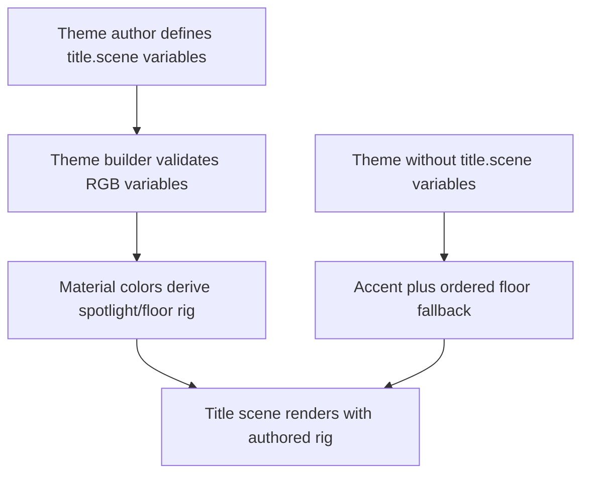
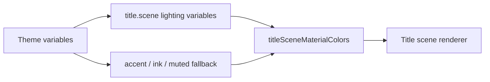

# DX-0044 - Theme-Authored Title Lighting Rigs

## Linked Issue

- https://github.com/flyingrobots/jedit/issues/44

## Decision Summary

Jedit will let themes author a constrained title-scene lighting rig through
named theme variables: `title.scene.spotlight`, `title.scene.floor.dark`, and
`title.scene.floor.light`. `titleSceneMaterialColors` will read those variables
with the current accent/floor fallback behavior, and one built-in theme will
ship an authored rig to prove the boundary.

## Sponsored Human

A maintainer tuning built-in themes wants the startup scene's spotlight and
floor lighting to be authored as theme data so that themes feel distinct,
without adding renderer branches for named themes.

## Sponsored Agent

An agent needs stable lighting variable names and material-color derivation
tests so it can verify title-scene lighting behavior, without comparing pixels
or inferring private renderer constants.

## Hill

By the end of this cycle, `titleSceneMaterialColors(theme)` derives spotlight
and floor colors from optional `title.scene.*` variables, and focused specs
prove both fallback behavior and one authored rig.

## Current Truth

The merge target for this cycle is `origin/main` at
`407d1f95aff5521a7c6079b34b7e812ace786800`.

Current anchors:

- `titleSceneMaterialColors` currently derives spotlight from the theme accent
  and floor colors from ordered ink/muted values:
  [src/ui/title-scene-material-colors.ts#L34:407d1f95aff5521a7c6079b34b7e812ace786800](https://github.com/flyingrobots/jedit/blob/407d1f95aff5521a7c6079b34b7e812ace786800/src/ui/title-scene-material-colors.ts#L34).
- `jedit-themes.ts` currently defines base theme variables but no title-scene
  lighting variables:
  [src/ui/jedit-themes.ts#L17:407d1f95aff5521a7c6079b34b7e812ace786800](https://github.com/flyingrobots/jedit/blob/407d1f95aff5521a7c6079b34b7e812ace786800/src/ui/jedit-themes.ts#L17).
- `title-screen-optics.spec.mjs` currently assumes every theme spotlight equals
  the accent token:
  [spec/title-screen-optics.spec.mjs#L14:407d1f95aff5521a7c6079b34b7e812ace786800](https://github.com/flyingrobots/jedit/blob/407d1f95aff5521a7c6079b34b7e812ace786800/spec/title-screen-optics.spec.mjs#L14).
- Issue #44 requests optional theme-authored title-scene light tokens with
  fallback behavior and no ad hoc renderer branches:
  https://github.com/flyingrobots/jedit/issues/44.

## Problem

The title scene is visually rich, but the lighting rig is only partially
theme-authored: spotlight color is tied to `accent`, and floor tint is derived
from `ink`/`muted`. This prevents a theme from deliberately authoring the title
scene's lighting posture without changing renderer code.

## Scope

This cycle includes:

- Adding exported title-scene lighting variable names.
- Teaching `titleSceneMaterialColors` to read optional lighting variables.
- Authoring one built-in theme lighting rig.
- Updating material/optics specs to prove fallback and authored-rig behavior.

## Non-Goals

This cycle does not include:

- Adding intensity, ambient, rim, or sky scalar controls.
- Changing raytracing algorithms.
- Adding per-theme conditionals to renderer or optics code.
- Requiring every built-in theme to author a lighting rig immediately.
- Changing title-scene layout, camera, object placement, or startup timing.

## User Experience / Product Shape

Normal users do not see a new control. The startup scene may render one theme
with more intentionally authored spotlight/floor colors, while all other themes
continue using the current fallback.

### User Journey



### Wide UI Mockup

Not applicable. This is a theme data boundary with no new rendered UI controls.

### Narrow UI Mockup

Not applicable. This is a theme data boundary with no new rendered UI controls.

### Accessibility Considerations

No user input changes. Existing contrast specs continue to verify floor dark
and floor light ordering across built-in themes.

## Runtime / API Contract

Contracts:

- `src/ui/jedit-theme-palettes.ts`
- `src/ui/title-scene-lighting-tokens.ts`
- `src/ui/title-scene-material-colors.ts`

`title-scene-lighting-tokens.ts` will export
`TITLE_SCENE_LIGHTING_VARIABLE` with:

- `Spotlight`;
- `FloorDark`;
- `FloorLight`.

`jedit-theme-palettes.ts` will keep authored palette data, including any
optional title-scene lighting rig, outside the main theme behavior module.

`titleSceneMaterialColors(theme)` will:

- use `title.scene.spotlight` when present, otherwise `accent`;
- use both `title.scene.floor.dark` and `title.scene.floor.light` when present;
- otherwise retain ordered `ink`/`muted` floor fallback;
- keep the existing `TitleSceneMaterialColors` return shape.

## Lower Modes

Not applicable. The change is deterministic theme data consumed by runtime
material-color derivation.

## Data / State Model

| Category                  | Description                                                |
| ------------------------- | ---------------------------------------------------------- |
| Source of truth           | Theme variables and `TITLE_SCENE_LIGHTING_VARIABLE`.       |
| Derived state             | `TitleSceneMaterialColors`.                                |
| Invalid states            | Missing partial floor rig falls back to ordered ink/muted. |
| Reset behavior            | No mutable state.                                          |
| Serialization             | No serialization changes.                                  |
| Deterministic assumptions | Same theme variables produce same material colors.         |



## Accessibility Posture

| Concern                           | Posture                                         |
| --------------------------------- | ----------------------------------------------- |
| Semantic labels or facts          | Lighting token names are exported constants.    |
| Focus order or ownership          | Not applicable.                                 |
| Hidden or visual-only information | Tests inspect derived material colors directly. |
| Keyboard behavior                 | Not applicable.                                 |
| Secret or redaction behavior      | No secrets are read or emitted.                 |

## Localization / Directionality Posture

Not applicable. No visible strings are added or changed.

## Agent Inspectability / Explainability Posture

Agents can inspect:

- exported lighting variable constants;
- theme variable maps;
- `titleSceneMaterialColors(theme)` outputs;
- focused specs for fallback and authored-rig behavior.

## Linked Invariants

- Tests are executable spec.
- Runtime truth beats type theater.
- Design should become repo truth.
- Files and previews are projections.
- Echo authority remains outside jedit product nouns.

## Design Alternatives Considered

### Option A: Theme Variables As Lighting Rig

Pros:

- Fits the existing theme boundary.
- Reuses theme-builder RGB validation.
- Keeps renderer code declarative.
- Allows incremental per-theme adoption.

Cons:

- Only covers color rig fields in this cycle.

### Option B: New `titleSceneLighting` Object On `JeditTheme`

Pros:

- More explicit object shape.

Cons:

- Larger theme API migration for a small first rig.
- Requires generated or builder-wide changes before proving value.

### Option C: Renderer Branches Per Theme

Pros:

- Fast to make one theme look different.

Cons:

- Violates the issue's no-conditionals intent.
- Makes future theme authoring hard to inspect.

## Decision

Choose Option A. Title-scene lighting starts as optional theme variables with
current fallback behavior preserved.

## Implementation Slices

- [x] Slice 1: Commit this design packet. Commit message:
      `docs: design theme authored title lighting`.
- [x] Slice 2: Add RED specs for fallback and authored lighting variables.
- [x] Slice 3: Add lighting variable constants and material-color derivation.
- [x] Slice 4: Author one built-in theme rig.
- [x] Slice 5: Verify focused specs, title render specs, build, quality, and
      formatting.
- [ ] Slice 6: Push, mark PR ready, and merge when eligible.

## Tests To Write First

Behavior tests required:

- [x] `spec/title-scene-lighting-rig.spec.mjs` fails before lighting variables
      are consumed and passes after implementation.
- [x] Existing title-screen optics tests still prove spotlight behavior.
- [x] Existing title-scene render contrast tests stay green.
- [x] `npm run quality` stays green.

Documentation and process tests:

- [x] Prettier validates this design doc.

Rule: documentation tests cannot be the only proof for implementation work.

## Acceptance Criteria

The work is done when:

- [x] Fallback themes still derive spotlight from accent.
- [x] One authored theme derives spotlight/floor colors from `title.scene.*`
      variables.
- [x] Floor dark/light contrast remains ordered for all built-in themes.
- [x] No renderer branch keys off a theme name.
- [x] Issue and PR are linked correctly.
- [x] Local validation is green.
- [ ] CI is green before merge.

## Validation Plan

Commands expected before PR:

```bash
npm run build
JEDIT_DIST_PREBUILT=1 node --test --test-concurrency=1 spec/title-scene-lighting-rig.spec.mjs spec/title-screen-optics.spec.mjs spec/title-scene-render.spec.mjs
npm run quality
npx --no-install prettier --check docs/design/0044-theme-authored-title-lighting-rigs.md src/ui/title-scene-lighting-tokens.ts src/ui/title-scene-material-colors.ts src/ui/jedit-themes.ts src/ui/jedit-theme-palettes.ts spec/title-scene-lighting-rig.spec.mjs spec/title-screen-optics.spec.mjs spec/title-scene-render.spec.mjs
```

## Playback / Witness

Reviewers can run:

```bash
JEDIT_DIST_PREBUILT=1 node --test --test-concurrency=1 spec/title-scene-lighting-rig.spec.mjs
```

## Risks

Known risks:

- A partial authored floor rig could reduce contrast.
- Adding variables in the theme file can grow line count near the cap.

Mitigations:

- Use authored floor colors only when both dark and light tokens exist.
- Keep the authored rig to one built-in theme in this cycle.
- Retain existing floor contrast tests.

## Follow-On Debt

No follow-on debt is introduced by this cycle. Intensity, ambient, rim, or sky
lighting variables can be separate issues after color rigs prove stable.

## Retrospective

What changed from the design:

- Implementation matched the design. The first authored rig is Monokai, using
  `title.scene.spotlight`, `title.scene.floor.dark`, and
  `title.scene.floor.light` variables. The authored palette table now lives in
  `src/ui/jedit-theme-palettes.ts` so `src/ui/jedit-themes.ts` stays under the
  quality gate line cap.

What the tests proved:

- `spec/title-scene-lighting-rig.spec.mjs` proved RED missing-token behavior,
  fallback spotlight derivation, authored spotlight derivation, authored floor
  colors, and authored floor contrast.
- `spec/title-screen-optics.spec.mjs` proved spotlight behavior still works
  through the existing optics without theme-name renderer branches.
- `spec/title-scene-render.spec.mjs` proved built-in floor light/dark contrast
  stays ordered.
- `npm run build`, `npm run quality`, Prettier, and `git diff --check` stayed
  green locally.

What remains open:

- CI must pass before merge.

PR:

- https://github.com/flyingrobots/jedit/pull/95
