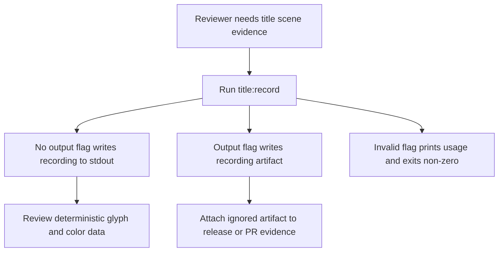
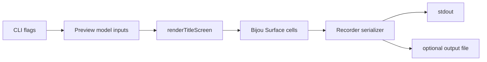

# DX-0045 - Terminal Scene Recording Exports

## Linked Issue

- https://github.com/flyingrobots/jedit/issues/45

## Decision Summary

Jedit will add a deterministic title-scene recording CLI that renders the
existing terminal title screen through `renderTitleScreen` and exports fixed
frame sequences as JSON, plain glyph text, compact HTML, or ANSI terminal
frames. The recorder owns review/share artifacts for the title scene; it does
not introduce a second renderer or product UI.

## Sponsored Human

A reviewer wants to inspect and share the animated title scene as terminal
artifacts so that title-screen changes can be reviewed without launching an
interactive TUI, without depending on screenshots or local timing.

## Sponsored Agent

An agent needs deterministic frame exports with glyph rows, color metadata, and
render parameters so it can compare title-scene output, without scraping pixels
or inferring terminal-cell colors from screenshots.

## Hill

By the end of this cycle, a reviewer can run `npm run title:record -- --format
json --frames 2`, get deterministic title-scene frames rendered through the
same title-screen path, and the repo proves determinism and headless execution
with a focused CLI spec.

## Current Truth

The merge target for this cycle is `origin/main` at
`50a41506ea666919814cbcf0a634aeae47c13419`.

Current anchors:

- `package.json` exposes `title:preview`, but there is no `title:record` script:
  [package.json#L16:50a41506ea666919814cbcf0a634aeae47c13419](https://github.com/flyingrobots/jedit/blob/50a41506ea666919814cbcf0a634aeae47c13419/package.json#L16).
- The preview CLI already loads built-in title scenes, themes, preview session
  options, and `renderTitleScreen` from `dist`:
  [scripts/title-scene-preview.mjs#L5:50a41506ea666919814cbcf0a634aeae47c13419](https://github.com/flyingrobots/jedit/blob/50a41506ea666919814cbcf0a634aeae47c13419/scripts/title-scene-preview.mjs#L5).
- The preview CLI renders a frame by calling `renderTitleScreen` with a scene
  override and preview render options:
  [scripts/title-scene-preview.mjs#L215:50a41506ea666919814cbcf0a634aeae47c13419](https://github.com/flyingrobots/jedit/blob/50a41506ea666919814cbcf0a634aeae47c13419/scripts/title-scene-preview.mjs#L215).
- The preview CLI currently serializes glyph rows only, dropping terminal-cell
  foreground/background metadata:
  [scripts/title-scene-preview.mjs#L229:50a41506ea666919814cbcf0a634aeae47c13419](https://github.com/flyingrobots/jedit/blob/50a41506ea666919814cbcf0a634aeae47c13419/scripts/title-scene-preview.mjs#L229).
- The title renderer accepts render mode, camera, scene seed, mesh, scene
  override, ASCII palette, and text direction as explicit options:
  [src/ui/title-screen.ts#L94:50a41506ea666919814cbcf0a634aeae47c13419](https://github.com/flyingrobots/jedit/blob/50a41506ea666919814cbcf0a634aeae47c13419/src/ui/title-screen.ts#L94).
- The existing preview CLI spec proves JSON inspection and plain frame output,
  but not deterministic multi-frame recordings or color metadata:
  [spec/title-scene-preview-cli.spec.mjs#L14:50a41506ea666919814cbcf0a634aeae47c13419](https://github.com/flyingrobots/jedit/blob/50a41506ea666919814cbcf0a634aeae47c13419/spec/title-scene-preview-cli.spec.mjs#L14).
- `.gitignore` ignores generated build/cache artifacts but has no dedicated
  title-recording artifact directory:
  [.gitignore#L1:50a41506ea666919814cbcf0a634aeae47c13419](https://github.com/flyingrobots/jedit/blob/50a41506ea666919814cbcf0a634aeae47c13419/.gitignore#L1).

## Problem

The title scene is terminal-cell output, so screenshots are a lossy review
surface and the existing preview CLI cannot export deterministic multi-frame
recordings with color metadata. That makes title-scene PR review and visual
debugging harder than it needs to be.

## Scope

This cycle includes:

- Adding `scripts/title-scene-record.mjs`.
- Adding `npm run title:record`.
- Rendering fixed frame sequences through `renderTitleScreen`.
- Emitting deterministic `json`, `text`, `html`, and `ansi` formats.
- Including glyph rows plus RGB foreground/background metadata in JSON output.
- Supporting explicit width, height, theme, scene, render mode, start time,
  frame count, frame step, camera angle, and camera radius flags.
- Writing to stdout by default and only writing files when `--output` is passed.
- Ignoring the default explicit recording artifact directory.
- Adding focused CLI tests for deterministic JSON, text output, and output-file
  behavior.

## Non-Goals

This cycle does not include:

- Interactive preview controls; `title:preview` continues to own that.
- Visual diffing or color-distance comparison between recordings.
- A new title renderer, image/video encoding, GIF export, or screenshot capture.
- Persisting recordings in Echo, WSC, or workspace state.
- Changing title intro timing, title scene materials, or startup modal behavior.

## User Experience / Product Shape

The recorder is a CLI surface. A developer runs:

```bash
npm run title:record -- --format json --frames 2 --width 80 --height 24
npm run title:record -- --format html --output title-recordings/title.html
npm run title:record -- --format ansi
```

The command writes to stdout unless `--output` is supplied. JSON output includes
metadata and frame records. Text output is easy to paste into an issue. HTML
output preserves the terminal-cell grid in a compact `<pre>`-style document.
ANSI output can be replayed in a terminal.

### User Journey



### Wide UI Mockup

Not applicable. This cycle adds a terminal artifact export, not rendered
application UI.

### Narrow UI Mockup

Not applicable. The recorder supports width and height flags, but does not add
new TUI layout.

### Accessibility Considerations

The text and JSON formats provide non-visual access to the title-scene glyphs
and color metadata. The HTML format must retain glyph text in document order
instead of encoding the scene only as an image.

## Runtime / API Contract

Contract: `scripts/title-scene-record.mjs`.

CLI inputs:

- `--format json|text|html|ansi`, default `json`;
- `--frames <positive integer>`, default `1`;
- `--width <positive integer>`, default `96`;
- `--height <positive integer>`, default `28`;
- `--start <finite number>`, default `0`;
- `--step <finite number>`, default `0.5`;
- `--theme <theme name>`;
- `--scene <built-in scene name or scene file path>`;
- `--render-mode braille|ascii`;
- `--camera-angle <finite number>`;
- `--camera-radius <finite number>`;
- `--output <path>`;
- `--help`.

JSON output:

- top-level `recording` metadata with format, dimensions, timing, scene, theme,
  render mode, camera, and frame count;
- `frames[]` records with stable `index`, `timeSeconds`, `glyphRows`, and
  `colorRows`;
- `colorRows` has one row per terminal row and one object per cell containing
  foreground RGB and background RGB.

Error behavior:

- invalid options print usage to stderr and exit with code `2`;
- runtime load/render failures print the error message and exit non-zero.

## Lower Modes

Lower-mode outputs:

- `json`: machine-readable witness for agents and tests;
- `text`: glyph-only terminal frame dump for issues and notes;
- `html`: compact browser-viewable artifact that keeps text accessible;
- `ansi`: terminal-native colored output.

The command is headless and must not require terminal raw mode, Bijou app
startup, or an interactive TTY.

## Data / State Model

| Category                  | Description                                             |
| ------------------------- | ------------------------------------------------------- |
| Source of truth           | `renderTitleScreen` output for each deterministic time. |
| Derived state             | Serialized glyph rows and RGB cell metadata.            |
| Invalid states            | Non-positive dimensions/frames or non-finite numbers.   |
| Reset behavior            | Each invocation starts with no retained state.          |
| Serialization             | JSON, plain text, HTML, ANSI, or explicit file path.    |
| Deterministic assumptions | Fixed inputs produce byte-identical output.             |



## Accessibility Posture

| Concern                           | Posture                                        |
| --------------------------------- | ---------------------------------------------- |
| Semantic labels or facts          | JSON metadata names scene, theme, and timing.  |
| Focus order or ownership          | Not applicable; the command is noninteractive. |
| Hidden or visual-only information | Glyph rows and RGB colors are serializable.    |
| Keyboard behavior                 | Not applicable; no interactive controls.       |
| Secret or redaction behavior      | No secrets are read or emitted.                |

## Localization / Directionality Posture

Not applicable. The recorder adds CLI option strings only; it does not add
localized product copy. Title logo directionality remains whatever
`renderTitleScreen` receives through existing render options.

## Agent Inspectability / Explainability Posture

Agents can parse JSON output and inspect:

- dimensions;
- format;
- scene name;
- theme name;
- render mode;
- camera posture;
- exact frame times;
- glyph rows;
- foreground and background RGB cells.

No pixel scraping, screenshot OCR, or private renderer hooks are required.

## Linked Invariants

- Tests are executable spec.
- Runtime truth beats type theater.
- Design should become repo truth.
- Files and previews are projections.
- Echo authority remains outside jedit product nouns.
- The recorder must reuse the title renderer instead of introducing a second
  rendering law.

## Design Alternatives Considered

### Option A: Extend `title:preview`

Pros:

- Reuses the existing script entry point.
- Keeps title-scene command count small.

Cons:

- Mixes interactive preview inspection with recording/export semantics.
- Makes the preview CLI harder to reason about.
- Risks coupling key-step preview state to deterministic artifact production.

### Option B: Add A Dedicated Recorder CLI

Pros:

- Gives recording exports a focused contract and test surface.
- Keeps deterministic serialization separate from interactive preview controls.
- Allows future compare/diff modes without bloating preview.

Cons:

- Some scene/theme loading logic overlaps the preview script.
- Adds another npm script.

## Decision

Choose Option B. A dedicated recorder CLI is the cleanest boundary because
recording is an artifact-production workflow, not a preview-control workflow.
The script may share loading patterns with `title-scene-preview.mjs`, but the
observable contract is deterministic frame serialization.

## Implementation Slices

- [x] Slice 1: Write this design document and open the cycle PR.
- [x] Slice 2: Add a failing CLI spec for deterministic JSON recording.
- [x] Slice 3: Add `scripts/title-scene-record.mjs` and `npm run title:record`.
- [x] Slice 4: Add text, HTML, ANSI, and explicit output-file serialization.
- [x] Slice 5: Ignore explicit title recording artifacts and update the
      retrospective with validation evidence.

## Tests To Write First

Behavior tests required:

- [x] `spec/title-scene-record-cli.spec.mjs` proves fixed JSON inputs produce
      byte-identical output on repeated runs.
- [x] `spec/title-scene-record-cli.spec.mjs` proves text output emits expected
      frame labels and glyph rows.
- [x] `spec/title-scene-record-cli.spec.mjs` proves `--output` writes the
      chosen artifact and leaves stdout quiet.

Documentation and process tests:

- [x] Prettier checks this design doc.

Rule: documentation tests cannot be the only proof for implementation work.

## Acceptance Criteria

The work is done when:

- [x] `npm run title:record` exists and builds before running the recorder.
- [x] JSON recording output is deterministic for fixed inputs.
- [x] JSON frames include glyph rows plus RGB foreground/background metadata.
- [x] Recorder output defaults to stdout and writes files only with `--output`.
- [x] Generated title recording artifacts are ignored unless explicitly staged.
- [x] The recorder uses `renderTitleScreen`.
- [x] The recorder runs headless in local and CI test processes.
- [x] Issue and PR are linked correctly.
- [x] Local validation is green; remote CI remains the PR merge gate.

## Validation Plan

Commands expected before PR completion:

```bash
npm run build
JEDIT_DIST_PREBUILT=1 node --test --test-concurrency=1 spec/title-scene-record-cli.spec.mjs
JEDIT_DIST_PREBUILT=1 npm run ci:shard -- title-rendering
npm run quality
npx --no-install prettier --check docs/design/0045-terminal-scene-recording-exports.md scripts/title-scene-record.mjs spec/title-scene-record-cli.spec.mjs package.json
git diff --check
```

## Playback / Witness

Reviewer commands:

```bash
npm run title:record -- --format json --frames 2 --width 64 --height 18
npm run title:record -- --format text --frames 2 --render-mode ascii
npm run title:record -- --format html --output title-recordings/title.html
npm run title:record -- --format ansi
```

The JSON command is the primary machine-readable witness.

## Risks

Known risks:

- Scene/theme loading may duplicate preview CLI logic.
- Full-cell JSON color metadata can be large.
- ANSI output varies by terminal support even if emitted bytes are stable.

Mitigations:

- Keep the first recorder small and reuse existing title preview/load patterns.
- Default dimensions and frame counts remain modest.
- Treat JSON as the canonical witness and ANSI as terminal playback.

## Follow-On Debt

Future visual diff or color-distance comparison belongs in a separate issue if
recorded artifacts become a regular review gate.

## Retrospective

What changed from the design:

- The implementation matched the planned dedicated recorder CLI.
- `title-recordings/` was added to `.gitignore` as the default explicit
  artifact directory.
- The validation plan dropped `.gitignore` from the Prettier command because
  this repo's Prettier setup does not infer a parser for that file.

What the tests proved:

- RED:
  `JEDIT_DIST_PREBUILT=1 node --test --test-concurrency=1 spec/title-scene-record-cli.spec.mjs`
  failed because `scripts/title-scene-record.mjs` did not exist.
- GREEN:
  `JEDIT_DIST_PREBUILT=1 node --test --test-concurrency=1 spec/title-scene-record-cli.spec.mjs`
  passed with 3 tests.
- `JEDIT_DIST_PREBUILT=1 npm run ci:shard -- title-rendering` passed with 97
  tests.
- `npm run title:record -- --format text --frames 1 --width 24 --height 8 --scene sphere.jedit-scene --theme graphite --render-mode ascii`
  built and emitted a terminal text recording.
- `npm run quality`, Prettier, and `git diff --check` passed.

What remains open:

- Visual diff or color-distance comparison remains deferred follow-on work.
- Remote CI and review gates are handled by PR #98.

PR:

- https://github.com/flyingrobots/jedit/pull/98
