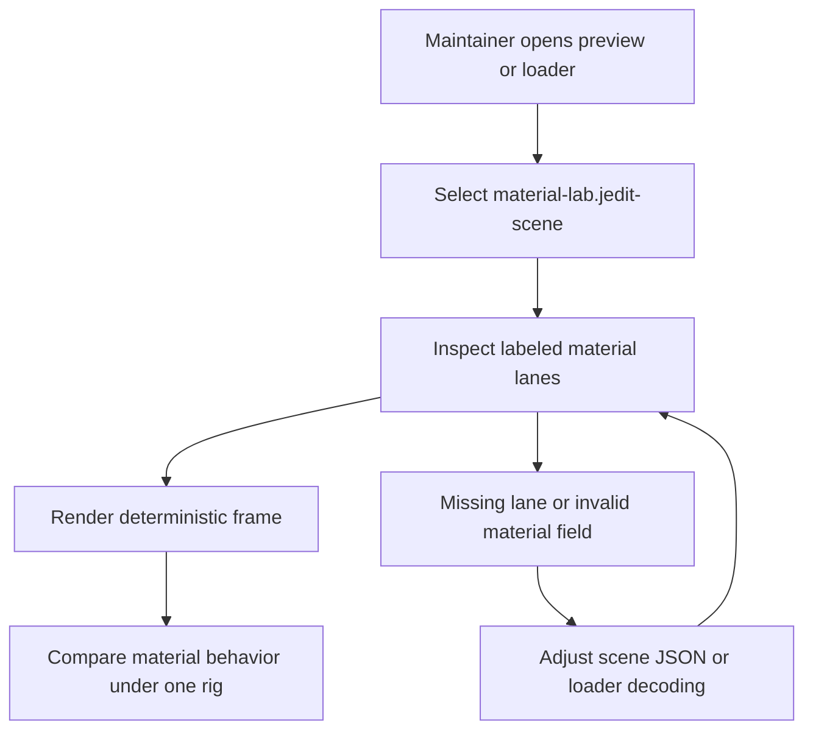
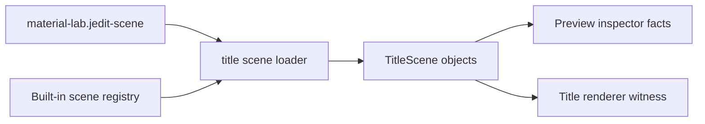

# DX-0046 - Title Scene Material Lab

## Linked Issue

- https://github.com/flyingrobots/jedit/issues/46

## Decision Summary

Jedit will add a deterministic, non-default built-in title scene named
`material-lab.jedit-scene`. The scene will arrange labeled material lanes under
one lighting/floor environment so agents and maintainers can compare matte,
mirror, transparent, refractive, rim-lit, and spotlight-responsive objects
without changing the user startup default or scraping pixels.

## Sponsored Human

A maintainer tuning the title renderer wants a compact material comparison scene
so that optics changes can be judged against controlled samples, without
manually editing ad hoc scene JSON or guessing which default-scene object
exercises which material path.

## Sponsored Agent

An agent needs labeled scene objects, bounded material fields, and focused
render/loader witnesses so it can verify material coverage, without inferring
semantics from array positions or visual appearance alone.

## Hill

By the end of this cycle, a reviewer can load `material-lab.jedit-scene` through
the built-in title-scene loader and prove that its labeled lanes exercise matte,
mirror, transparent, refractive, rim, spotlight, and floor effects through
focused specs.

## Current Truth

The merge target for this cycle is `origin/main` at
`31f551d329e3183e67d4e33e7d8077c6bac0dfba`.

Current anchors:

- Built-in scene names are an explicit registry, and the first entry controls
  the default scene order:
  [src/ports/title-scene-loader.ts#L10:31f551d329e3183e67d4e33e7d8077c6bac0dfba](https://github.com/flyingrobots/jedit/blob/31f551d329e3183e67d4e33e7d8077c6bac0dfba/src/ports/title-scene-loader.ts#L10).
- Scene JSON already decodes bounded optical material fields,
  `transparency` and `refractiveIndex`:
  [src/adapters/title-scene-loader.ts#L183:31f551d329e3183e67d4e33e7d8077c6bac0dfba](https://github.com/flyingrobots/jedit/blob/31f551d329e3183e67d4e33e7d8077c6bac0dfba/src/adapters/title-scene-loader.ts#L183).
- Existing built-in scenes can author lighting, floor, walls, and material
  values, but they are composed as product scenes rather than controlled test
  lanes:
  [scenes/teapot-gallery.jedit-scene#L1:31f551d329e3183e67d4e33e7d8077c6bac0dfba](https://github.com/flyingrobots/jedit/blob/31f551d329e3183e67d4e33e7d8077c6bac0dfba/scenes/teapot-gallery.jedit-scene#L1).
- The preview inspector exposes selected object facts such as kind, radius,
  reflectivity, color, and center, but not a semantic label or optical material
  fields:
  [src/app/title-scene-preview-session.ts#L89:31f551d329e3183e67d4e33e7d8077c6bac0dfba](https://github.com/flyingrobots/jedit/blob/31f551d329e3183e67d4e33e7d8077c6bac0dfba/src/app/title-scene-preview-session.ts#L89).
- Issue #46 asks for a focused material lab that is deterministic, not default,
  named/validated by lane, and covered by focused witnesses:
  https://github.com/flyingrobots/jedit/issues/46.

## Problem

The title renderer has several optical paths, but no controlled scene that
names and places comparable samples for each material behavior. Existing product
scenes prove rendering works, but they do not provide a small inspectable
fixture for material tuning or regression review.

## Scope

This cycle includes:

- Adding `material-lab.jedit-scene` under `scenes/`.
- Registering it as a built-in title scene without making it the first/default
  scene.
- Adding optional scene-object labels to the runtime object model and loader.
- Exposing object label, transparency, and refractive index through the preview
  inspector.
- Adding focused specs for registry order, scene labels, optical material lanes,
  floor/light environment, and one render/optics witness.

## Non-Goals

This cycle does not include:

- Changing the default title startup scene.
- Adding a new TUI control, modal, or visible string.
- Adding a material editor UI.
- Adding mesh placement transforms.
- Expanding the scene JSON format beyond optional labels.
- Creating a full golden image fixture for every material lane.

## User Experience / Product Shape

Normal startup behavior is unchanged. Developers and agents can select or load
`material-lab.jedit-scene` through the existing built-in scene registry and
preview tooling. The scene is intentionally compact: a row/grid of named objects
under one stable floor and lighting rig.

### User Journey



### Wide UI Mockup

Not applicable. This cycle adds a built-in scene and inspectable runtime facts,
not a new rendered UI control. The visible result is reproduced through the
existing title-scene preview command.

### Narrow UI Mockup

Not applicable. No layout, drawer, modal, footer, or narrow-terminal behavior
changes in this cycle.

### Accessibility Considerations

The scene remains visual, but semantic lane labels and material facts are
available through runtime objects and preview inspector output so agents and
screen-reader-adjacent tooling do not need to infer meaning from pixels.

## Runtime / API Contract

Contracts:

- `scenes/material-lab.jedit-scene`
- `src/ports/title-scene-loader.ts`
- `src/adapters/title-scene-loader.ts`
- `src/ui/title-scene.ts`
- `src/app/title-scene-preview-session.ts`

`scenes/material-lab.jedit-scene` will contain labeled object lanes:

- `matte`;
- `mirror`;
- `transparent`;
- `refractive`;
- `rim-column`;
- `spotlight-target`.

`TitleSceneObject` will allow an optional `label?: string`. The scene loader
will decode an optional object `label` string and reject non-string labels. The
preview object inspector will include optional `label`, `transparency`, and
`refractiveIndex` fields when present on the selected object.

`BUILT_IN_TITLE_SCENE_NAMES` will include `material-lab.jedit-scene`, but not at
index zero.

## Lower Modes

The lower mode is deterministic loader and preview-inspector output:

- `parseTitleSceneJson` and `loadBuiltInTitleScene` expose runtime objects with
  labels and material fields.
- `titleScenePreviewInspector` exposes selected-object label and optical fields.
- The scene can be rendered through the existing preview CLI without a TUI.

## Data / State Model

| Category                  | Description                                                    |
| ------------------------- | -------------------------------------------------------------- |
| Source of truth           | `scenes/material-lab.jedit-scene` and built-in scene registry. |
| Derived state             | Runtime `TitleSceneObject` labels and preview inspector facts. |
| Invalid states            | Non-string labels or out-of-range material fields.             |
| Reset behavior            | Static scene asset; no mutable state.                          |
| Serialization             | JSON scene file copied to `dist/scenes/` during build.         |
| Deterministic assumptions | Same scene JSON, theme, and render time produce same witness.  |



## Accessibility Posture

| Concern                           | Posture                                          |
| --------------------------------- | ------------------------------------------------ |
| Semantic labels or facts          | Material lanes expose `label` on runtime object. |
| Focus order or ownership          | Not applicable; no focus change.                 |
| Hidden or visual-only information | Optical fields are inspector facts.              |
| Keyboard behavior                 | Existing scene preview controls only.            |
| Secret or redaction behavior      | No secrets are read or emitted.                  |

## Localization / Directionality Posture

Not applicable. No user-visible localized copy changes. The scene filename and
object labels are developer/agent identifiers, not catalog copy.

## Agent Inspectability / Explainability Posture

Agents can inspect:

- `BUILT_IN_TITLE_SCENE_NAMES` for the non-default registered scene;
- loaded `TitleSceneObject.label` values;
- loaded `reflectivity`, `transparency`, and `refractiveIndex` values;
- preview inspector facts for selected objects;
- focused render/optics assertions proving the lab exercises floor and light
  behavior.

## Linked Invariants

- Tests are executable spec.
- Runtime truth beats type theater.
- Design should become repo truth.
- Files and previews are projections.
- Echo authority remains outside jedit product nouns.

## Design Alternatives Considered

### Option A: Registered Built-In Scene With Object Labels

Pros:

- Uses the existing scene loader and preview surfaces.
- Keeps the scene deterministic and easy to inspect.
- Makes material lanes machine-readable.
- Avoids renderer branches.

Cons:

- Adds a tiny JSON schema field for labels.

### Option B: Dedicated TypeScript Scene Factory

Pros:

- Stronger compile-time control over lane construction.

Cons:

- Bypasses the JSON scene path this feature should validate.
- Adds more runtime code for static scene data.

### Option C: Preview-Only Script Fixture

Pros:

- Keeps the built-in scene registry unchanged.

Cons:

- Harder to discover.
- Does not prove built-in scene loading or asset copying.
- Makes the lab a script artifact instead of repo truth.

## Decision

Choose Option A. The material lab is a registered, non-default JSON scene with
runtime labels and focused specs.

## Implementation Slices

- [x] Slice 1: Commit this design packet. Commit message:
      `docs: design title scene material lab`.
- [ ] Slice 2: Add RED specs for missing material lab registration, labels, and
      inspector facts.
- [ ] Slice 3: Add optional object labels to scene object model and loader.
- [ ] Slice 4: Add `material-lab.jedit-scene` and register it as non-default.
- [ ] Slice 5: Add focused render/optics witness for material lab floor/light
      behavior.
- [ ] Slice 6: Verify build, focused specs, title-rendering shard, quality,
      formatting, push, mark PR ready, and merge when eligible.

## Tests To Write First

Behavior tests required:

- [ ] `spec/title-scene-material-lab.spec.mjs` fails before the scene is
      registered and passes after implementation.
- [ ] Loader test fails before labels decode and passes after implementation.
- [ ] Preview inspector test fails before label/optical fields are exposed and
      passes after implementation.
- [ ] Focused render/optics test proves floor/light behavior using the material
      lab scene.

Documentation and process tests:

- [ ] Prettier validates this design doc.

Rule: documentation tests cannot be the only proof for implementation work.

## Acceptance Criteria

The work is done when:

- [ ] `material-lab.jedit-scene` is registered but not first/default.
- [ ] Loaded material lab objects include the expected lane labels.
- [ ] The lab includes matte, mirror, transparent, refractive, rim, spotlight,
      and floor coverage.
- [ ] Preview inspector exposes selected object label and optical fields.
- [ ] Focused render/optics witness proves material lab light/floor behavior.
- [ ] Issue and PR are linked correctly.
- [ ] Local validation is green.
- [ ] CI is green before merge.

## Validation Plan

Commands expected before PR:

```bash
npm run build
JEDIT_DIST_PREBUILT=1 node --test --test-concurrency=1 spec/title-scene-material-lab.spec.mjs spec/title-scene-loader.spec.mjs spec/title-scene-preview-session.spec.mjs
JEDIT_DIST_PREBUILT=1 npm run ci:shard -- title-rendering
npm run quality
npx --no-install prettier --check docs/design/0046-title-scene-material-lab.md scenes/material-lab.jedit-scene src/ports/title-scene-loader.ts src/adapters/title-scene-loader.ts src/ui/title-scene.ts src/app/title-scene-preview-session.ts spec/title-scene-material-lab.spec.mjs spec/title-scene-loader.spec.mjs spec/title-scene-preview-session.spec.mjs
```

## Playback / Witness

Reviewers can run:

```bash
JEDIT_DIST_PREBUILT=1 node --test --test-concurrency=1 spec/title-scene-material-lab.spec.mjs
npm run title:preview -- --scene material-lab.jedit-scene --json
```

## Risks

Known risks:

- Adding labels could become a generic application metadata system.
- Adding another built-in scene could accidentally become the default scene.
- A render witness could become too broad and duplicate the full title suite.

Mitigations:

- Labels are optional plain strings only, with no behavior attached.
- Specs assert the material lab is not first in the built-in registry.
- Keep render proof to one focused material-lab assertion.

## Follow-On Debt

No follow-on debt is introduced by this cycle. A future material editor UI,
per-lane golden fixtures, or richer material metadata should be separate issues.

## Retrospective

Fill this in after implementation.

What changed from the design:

- Pending.

What the tests proved:

- Pending.

What remains open:

- Pending.

PR:

- Pending.
