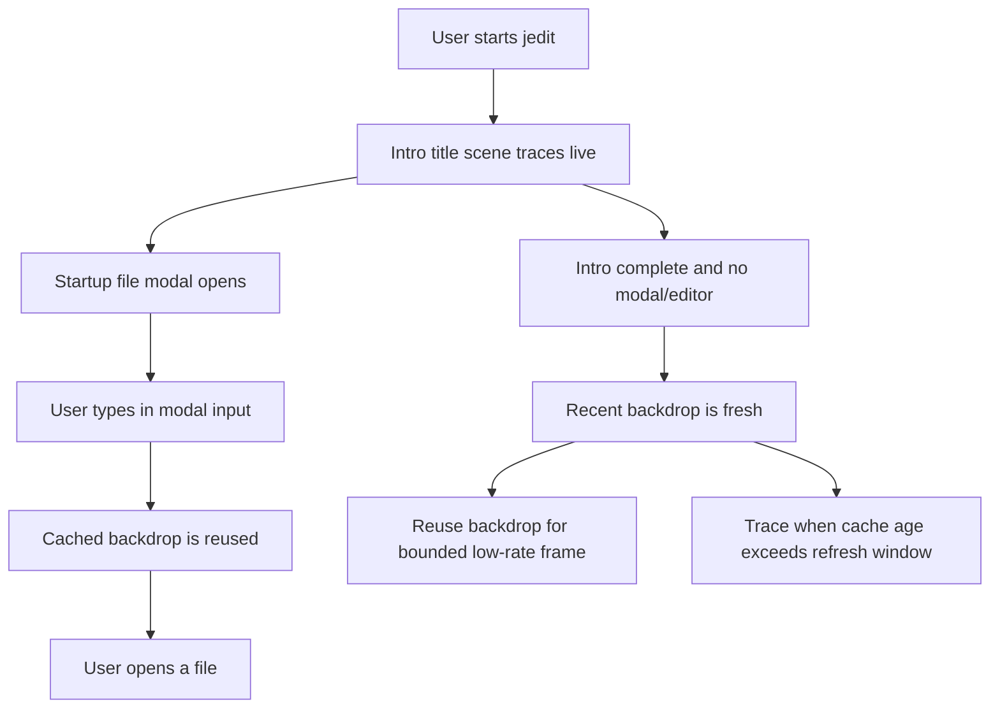
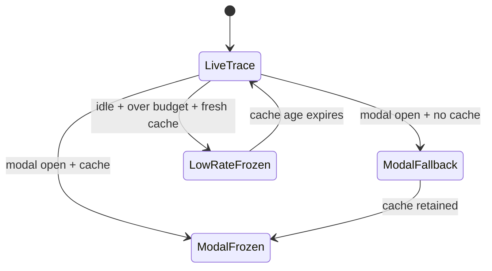

# DX-0078 - Startup Scene Performance Governor

## Linked Issue

- https://github.com/flyingrobots/jedit/issues/78

## Decision Summary

Jedit will add a small startup title-scene performance governor that owns the
choice between live ray tracing, modal frozen backdrop reuse, modal fallback
tracing, and low-rate cached backdrop reuse. The workspace viewer will route
title backdrop rendering through this governor and expose the last render
posture as inspectable runtime facts so tests and agents can prove modal input
does not compete with the ray tracer.

## Sponsored Human

A user typing into the startup file modal wants immediate input feedback so
that opening a file feels like an editor workflow, without having to wait for
the rich title scene to retrace on every keystroke.

## Sponsored Agent

An agent needs a stable render-posture contract so it can verify startup render
cost decisions, without inferring whether rays were traced from pixels, frame
timing noise, or private renderer state.

## Hill

By the end of this cycle, a reviewer can render the startup title surface,
inspect the renderer's title-scene performance facts, and prove through specs
that modal input reuses a cached backdrop while slow idle title frames refresh
at a bounded low rate.

## Current Truth

The merge target for this cycle is `origin/main` at
`6fc1905ff731a08d57ffde988cad9812709c7a91`.

Current anchors:

- The viewer currently keeps `frozenTitleBackdrop` inside
  `viewer-content.ts`, but the render policy is encoded directly in
  `renderTitleBackdrop`:
  [src/app/workspace/viewer-content.ts#L22:6fc1905ff731a08d57ffde988cad9812709c7a91](https://github.com/flyingrobots/jedit/blob/6fc1905ff731a08d57ffde988cad9812709c7a91/src/app/workspace/viewer-content.ts#L22).
- The current modal freeze behavior is tested by counting title-renderer calls
  while modal input changes:
  [spec/workspace-title-screen.spec.mjs#L184:6fc1905ff731a08d57ffde988cad9812709c7a91](https://github.com/flyingrobots/jedit/blob/6fc1905ff731a08d57ffde988cad9812709c7a91/spec/workspace-title-screen.spec.mjs#L184).
- The prior startup modal design already says the modal backdrop should be a
  render-performance posture, not workspace or Echo state:
  [docs/design/0036-title-intro-startup-file-modal.md#L75:6fc1905ff731a08d57ffde988cad9812709c7a91](https://github.com/flyingrobots/jedit/blob/6fc1905ff731a08d57ffde988cad9812709c7a91/docs/design/0036-title-intro-startup-file-modal.md#L75).
- The workspace model already tracks `frameTimeMs` and `frameTimeHistory`, but
  title rendering does not consume those fields for a named posture:
  [src/app/workspace/model.ts#L67:6fc1905ff731a08d57ffde988cad9812709c7a91](https://github.com/flyingrobots/jedit/blob/6fc1905ff731a08d57ffde988cad9812709c7a91/src/app/workspace/model.ts#L67).

## Problem

The startup file modal already avoids retracing the title scene when a cached
backdrop exists, but that decision is an implicit branch inside the viewer. The
result is hard for agents to inspect, does not name the fallback trace case, and
does not provide a single contract for later render-budget decisions such as
low-rate refresh on slow idle title screens.

## Scope

This cycle includes:

- Adding a focused startup title-scene performance governor module.
- Routing workspace title backdrop rendering through the governor.
- Storing the cached backdrop render time so low-rate refresh can make bounded
  cache-age decisions.
- Exposing the last title-scene performance posture through
  `ViewerContentRenderer`.
- Adding focused specs for modal cached reuse, modal fallback tracing, intro
  live tracing, and slow idle low-rate reuse.
- Updating the #78 design retrospective and PR validation evidence.

## Non-Goals

This cycle does not include:

- New visible UI, copy, settings, or keyboard controls.
- A full adaptive renderer, quality ladder, or ray-resolution scaler.
- Persisting performance state in Echo, WSC, or workspace model state.
- Changing the title intro timeline or startup modal layout.
- Changing profiler trace file format.

## User Experience / Product Shape

There is no new visible control. The user-visible behavior is that modal input
continues to feel responsive because the title backdrop stays visible but frozen
while the modal owns focus. During the intro, the title scene still renders live
frames. After the intro, if the terminal is slow and a fresh cached title
backdrop exists, the governor may reuse that cached backdrop for a short bounded
interval before tracing a new frame.

### User Journey



### Wide UI Mockup

Not applicable. This cycle changes render scheduling and inspectable facts, not
layout or visible modal chrome.

### Narrow UI Mockup

Not applicable. Small-terminal rendering remains owned by the existing
workspace small-terminal notice and startup modal layout.

### Accessibility Considerations

The visual title backdrop remains decorative. The meaningful state added here
is exposed as structured performance facts rather than hidden in pixels.

## Runtime / API Contract

Contracts:

- `src/app/workspace/title-scene-performance-governor.ts`
- `src/app/workspace/viewer-content.ts`

The governor will export:

- posture constants for `live-trace`, `modal-frozen-backdrop`,
  `modal-fallback-trace`, and `low-rate-frozen-backdrop`;
- `governTitleSceneRender(input)` returning a render decision;
- `titleScenePerformanceFacts(decision)` returning machine-readable facts;
- frame-budget constants used by the decision.

`ViewerContentRenderer` will expose:

- `titleScenePerformanceFacts()` returning the last title-scene render posture.

Decision semantics:

- Intro active: always live trace.
- Startup modal open with matching cached backdrop: do not trace; reuse frozen
  backdrop.
- Startup modal open without matching cached backdrop: trace once and retain the
  rendered backdrop.
- Idle title screen over frame budget with fresh cache: reuse cached backdrop
  until the refresh window expires.
- Otherwise: live trace and retain the rendered backdrop.

## Lower Modes

Lower mode is the structured renderer facts:

- posture id;
- whether rays were traced;
- whether the frozen backdrop was used;
- whether a rendered frame was retained for future reuse;
- input-latency posture;
- frame-budget posture.

No-color and small-terminal rendering behavior are unchanged.

## Data / State Model

| Category                  | Description                                              |
| ------------------------- | -------------------------------------------------------- |
| Source of truth           | Runtime workspace model plus renderer-local cache.       |
| Derived state             | Governor decision and performance facts.                 |
| Invalid states            | Negative cache age or non-finite frame time.             |
| Reset behavior            | Clearing the renderer cache resets facts to no backdrop. |
| Serialization             | None; render posture is process-local evidence.          |
| Deterministic assumptions | Same model time/frame/cache inputs produce same posture. |



## Accessibility Posture

| Concern                           | Posture                                        |
| --------------------------------- | ---------------------------------------------- |
| Semantic labels or facts          | Performance facts expose named render posture. |
| Focus order or ownership          | Modal focus behavior is unchanged.             |
| Hidden or visual-only information | Trace/frozen state is available structurally.  |
| Keyboard behavior                 | Existing startup modal keys are unchanged.     |
| Secret or redaction behavior      | No secrets are read or emitted.                |

## Localization / Directionality Posture

Not applicable. No user-visible strings change.

## Agent Inspectability / Explainability Posture

Agents can inspect the renderer's last title-scene performance facts without
scraping pixels:

- stable posture id;
- ray-trace boolean;
- frozen-backdrop boolean;
- retained-backdrop boolean;
- input-latency posture;
- frame-budget posture.

## Linked Invariants

- Tests are executable spec.
- Runtime truth beats type theater.
- Design should become repo truth.
- Layout owns interaction geometry.
- Files and previews are projections.
- Echo authority remains outside jedit product nouns.

## Design Alternatives Considered

### Option A: Extract A Pure Governor And Expose Renderer Facts

Pros:

- Makes the policy testable without terminal pixels.
- Keeps cache state local to the renderer.
- Preserves existing modal rendering behavior while naming it.
- Gives future slow-terminal work a single decision boundary.

Cons:

- Adds one more small workspace module.

### Option B: Keep The Existing Inline Branch And Add More Tests

Pros:

- Smallest code movement.

Cons:

- Keeps render-cost policy hidden in the view function.
- Does not provide agent-readable facts.
- Makes future low-rate behavior harder to add cleanly.

### Option C: Put Performance Policy In WorkspaceModel

Pros:

- The runtime model would make posture visible everywhere.

Cons:

- Persists render-cache concerns into workspace state.
- Makes a decorative renderer cache look like product state.
- Conflicts with the prior design that backdrop retention is not workspace or
  Echo state.

## Decision

Choose Option A. The governor is a pure runtime helper, while the cached surface
stays renderer-local.

## Implementation Slices

- [x] Slice 1: Commit this design packet. Commit message:
      `docs: design startup scene performance governor`.
- [ ] Slice 2: Add RED specs for the missing governor contract and renderer
      performance facts.
- [ ] Slice 3: Implement the governor decision and facts module.
- [ ] Slice 4: Route `viewer-content` title backdrop rendering through the
      governor and retain cache render time.
- [ ] Slice 5: Add low-rate idle cache reuse tests and preserve existing modal
      freeze tests.
- [ ] Slice 6: Verify build, focused specs, title-rendering/workspace-ui
      shards, quality, formatting, push, mark PR ready, and merge when eligible.

## Tests To Write First

Behavior tests required:

- [ ] Governor pure spec fails before
      `title-scene-performance-governor.js` exists.
- [ ] Renderer inspector spec fails before
      `titleScenePerformanceFacts()` exists.
- [ ] Modal input regression proves cached backdrop reuse does not trace rays.
- [ ] Slow idle title regression proves fresh cache reuse and bounded refresh.

Documentation and process tests:

- [ ] Prettier validates this design doc.

Rule: documentation tests cannot be the only proof for implementation work.

## Acceptance Criteria

The work is done when:

- [ ] Render posture decisions are centralized in a governor module.
- [ ] Modal input with cached title backdrop does not invoke the title renderer.
- [ ] Modal fallback traces one frame and then freezes it.
- [ ] Slow idle title rendering can reuse a fresh cached backdrop and refreshes
      after the bounded interval.
- [ ] Renderer performance facts are inspectable without pixel scraping.
- [ ] Existing title modal behavior still passes.
- [ ] Issue and PR are linked correctly.
- [ ] Local validation is green.
- [ ] CI is green before merge.

## Validation Plan

Commands expected before PR:

```bash
npm run build
JEDIT_DIST_PREBUILT=1 node --test --test-concurrency=1 spec/workspace-title-performance-governor.spec.mjs spec/workspace-title-screen.spec.mjs
JEDIT_DIST_PREBUILT=1 npm run ci:shard -- title-rendering
JEDIT_DIST_PREBUILT=1 npm run ci:shard -- workspace-ui
npm run quality
npx --no-install prettier --check docs/design/0078-startup-scene-performance-governor.md src/app/workspace/title-scene-performance-governor.ts src/app/workspace/viewer-content.ts spec/workspace-title-performance-governor.spec.mjs spec/workspace-title-screen.spec.mjs
git diff --check
```

## Playback / Witness

Reviewers can run:

```bash
JEDIT_DIST_PREBUILT=1 node --test --test-concurrency=1 spec/workspace-title-performance-governor.spec.mjs
```

The spec exposes the render posture without relying on a terminal screenshot.

## Risks

Known risks:

- Low-rate cache reuse could accidentally freeze the intro.
- Render facts could become a public user-facing API too early.
- A cache-age threshold could become magic if not named and tested.

Mitigations:

- Intro active always wins and forces live tracing.
- Facts remain on the renderer test/runtime boundary, not visible UI copy.
- Thresholds are exported constants and covered by focused tests.

## Follow-On Debt

No follow-on issue is required for the core #78 acceptance. A future adaptive
ray-quality ladder or user-visible performance setting should be separate work.

## Retrospective

Fill this in after implementation.

What changed from the design:

- Pending.

What the tests proved:

- Pending.

What remains open:

- Pending.

PR:

- Pending.
