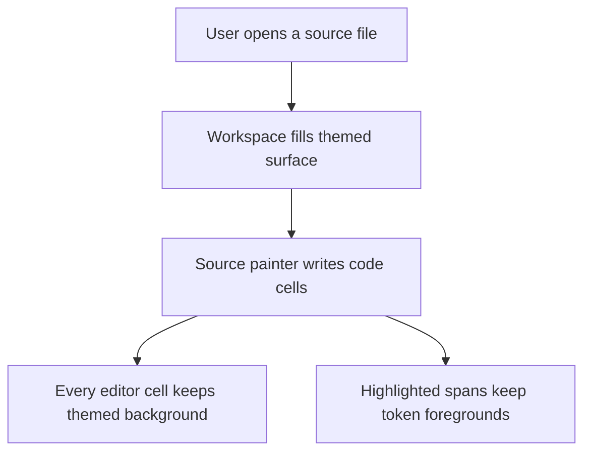
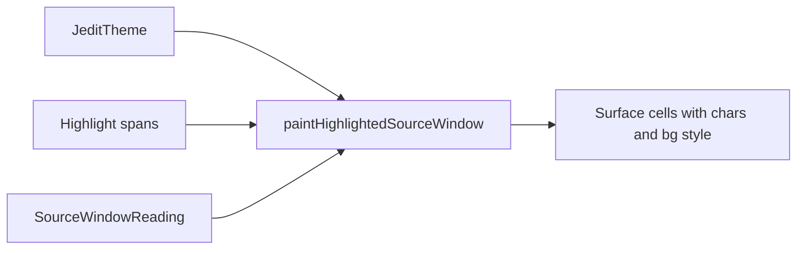

# DX-0099 - Source Editor Background Fill

## Linked Issue

- https://github.com/flyingrobots/jedit/issues/99

## Decision Summary

The source editor painter will preserve or apply theme-owned background style
for every painted source cell. Syntax highlighting may override foreground,
modifiers, and explicit token backgrounds, but unhighlighted text, whitespace,
and blank viewport rows must retain `theme.surface.workspace` instead of
clearing the already-filled surface background.

## Sponsored Human

A person editing source code wants the editor body to look like one coherent
themed surface so that code is readable across terminals, without seeing
terminal-default background holes around normal text or blank rows.

## Sponsored Agent

An agent needs inspectable cell-level style evidence so it can verify source
editor background ownership, without inferring visual correctness from a
screenshot or terminal palette.

## Hill

By the end of this cycle, the source highlight/editor specs prove that
unhighlighted source cells, highlighted source cells, whitespace, and blank
viewport rows all carry deterministic background style from the active theme.

## Current Truth

The merge target for this cycle is `origin/main` at
`8ef5b8ad3170aca02b7fe1ec5c67e4f6ec3d27ab`.

Current anchors:

- The workspace source viewer path creates a fresh surface and fills it with
  `model.jeditTheme.surface.workspace` before rendering editor content:
  [src/app/workspace/viewer-content.ts#L114:8ef5b8ad3170aca02b7fe1ec5c67e4f6ec3d27ab](https://github.com/flyingrobots/jedit/blob/8ef5b8ad3170aca02b7fe1ec5c67e4f6ec3d27ab/src/app/workspace/viewer-content.ts#L114).
- Source viewer delegates source body painting to
  `paintHighlightedSourceWindow`:
  [src/ui/source-viewer.ts#L44:8ef5b8ad3170aca02b7fe1ec5c67e4f6ec3d27ab](https://github.com/flyingrobots/jedit/blob/8ef5b8ad3170aca02b7fe1ec5c67e4f6ec3d27ab/src/ui/source-viewer.ts#L44).
- `paintHighlightedSourceWindow` calls `surface.set` with only `char`, optional
  highlight style, and `empty: false`:
  [src/ui/source-highlight.ts#L40:8ef5b8ad3170aca02b7fe1ec5c67e4f6ec3d27ab](https://github.com/flyingrobots/jedit/blob/8ef5b8ad3170aca02b7fe1ec5c67e4f6ec3d27ab/src/ui/source-highlight.ts#L40).
- When no highlight span covers a cell, `styleAt` returns an empty object,
  which means the source painter can erase the pre-filled background:
  [src/ui/source-highlight.ts#L60:8ef5b8ad3170aca02b7fe1ec5c67e4f6ec3d27ab](https://github.com/flyingrobots/jedit/blob/8ef5b8ad3170aca02b7fe1ec5c67e4f6ec3d27ab/src/ui/source-highlight.ts#L60).
- The current source highlight spec proves token foregrounds and modifiers, but
  does not assert background preservation:
  [spec/source-highlight.spec.mjs#L25:8ef5b8ad3170aca02b7fe1ec5c67e4f6ec3d27ab](https://github.com/flyingrobots/jedit/blob/8ef5b8ad3170aca02b7fe1ec5c67e4f6ec3d27ab/spec/source-highlight.spec.mjs#L25).

## Problem

The source editor is painted over a themed workspace background, but the source
highlight painter overwrites each source body cell without first preserving the
existing cell style or supplying a fallback background. Unhighlighted cells,
whitespace cells, and blank rows can therefore become cells with no
theme-owned background.

## Scope

This cycle includes:

- Adding source-highlight regression coverage for unhighlighted source text,
  trailing whitespace, blank viewport rows, and highlighted cells.
- Updating the source highlight painter so every painted cell carries a
  background.
- Preserving token foregrounds and modifiers for highlighted spans.
- Letting explicit highlight token backgrounds win when a token supplies one.
- Falling back to `theme.surface.workspace` background when a highlighted token
  has no background or no highlight span applies.

## Non-Goals

This cycle does not include:

- Changing theme palettes or adding new theme tokens.
- Changing cursor rendering.
- Changing markdown preview rendering.
- Changing terminal clear behavior, app frame layout, or Bijou surface
  internals.
- Solving every possible background issue in unrelated views.

## User Experience / Product Shape

The visible effect is that the source code editor body uses one coherent
theme-colored background. Blank rows and padded cells no longer expose a
terminal-default background. Syntax-highlighted spans keep their foreground
colors and modifiers.

### User Journey



### Wide UI Mockup

Not applicable. This is a cell-style correctness fix; the layout is unchanged.

### Narrow UI Mockup

Not applicable. Narrow terminal geometry is unchanged; the same cell-style
rules apply to the clipped viewport.

### Accessibility Considerations

Consistent background ownership improves contrast stability for terminals using
custom default colors. No focus order, command, or spoken label changes.

## Runtime / API Contract

Contract: `paintHighlightedSourceWindow`.

For every cell inside the requested source window rectangle:

- the painter sets a visible character, using a space for missing source text;
- the painter sets `empty: false`;
- the painter preserves highlight token foreground and modifiers when a span
  applies;
- the painter uses an explicit highlight token background when available;
- otherwise the painter uses `theme.surface.workspace.bg/bgRGB`.

No exported type changes are required.

## Lower Modes

Lower-mode proof is cell inspection in Node specs. The test reads individual
Bijou surface cells and asserts `bg` and `bgRGB` without relying on screenshots,
terminal colors, or rendered pixels.

## Data / State Model

| Category                  | Description                                          |
| ------------------------- | ---------------------------------------------------- |
| Source of truth           | Active `JeditTheme` and source highlight spans.      |
| Derived state             | Painted Bijou surface cells.                         |
| Invalid states            | Painted source cells without theme-owned bg data.    |
| Reset behavior            | Each render starts from the caller-owned surface.    |
| Serialization             | None.                                                |
| Deterministic assumptions | Same source/highlight/theme inputs paint same cells. |



## Accessibility Posture

| Concern                           | Posture                                    |
| --------------------------------- | ------------------------------------------ |
| Semantic labels or facts          | Not changed.                               |
| Focus order or ownership          | Not changed.                               |
| Hidden or visual-only information | Background style becomes cell-inspectable. |
| Keyboard behavior                 | Not changed.                               |
| Secret or redaction behavior      | No secrets are read or emitted.            |

## Localization / Directionality Posture

Not applicable. No user-visible strings change.

## Agent Inspectability / Explainability Posture

Agents can inspect source editor cells directly in the regression spec:

- unhighlighted text cell background;
- trailing whitespace background;
- blank viewport row background;
- highlighted token foreground/modifier plus background fallback.

## Linked Invariants

- Tests are executable spec.
- Runtime truth beats type theater.
- Layout owns interaction geometry.
- Files and previews are projections.
- Theme tokens own visible styling.

## Design Alternatives Considered

### Option A: Preserve Existing Cell Style Before Source Painting

Pros:

- Respects caller-owned pre-fill behavior.
- Keeps source painter flexible for surfaces that intentionally supply a
  different background.

Cons:

- Makes the source painter depend on the prior surface state.
- Still needs fallback behavior if the prior cell has no background.

### Option B: Use Theme Fallback In The Source Painter

Pros:

- Gives the source painter a direct, deterministic background contract.
- Does not rely on the caller having pre-filled the surface correctly.
- Matches the existing options object, which already provides `theme`.

Cons:

- Source painter now owns more of the source cell style contract.

## Decision

Choose Option B with preservation semantics for token-specific style. The source
painter already owns every source body cell, so it should also guarantee that
those cells carry a theme-owned background.

## Implementation Slices

- [x] Slice 1: File issue #99 and write this design document.
- [x] Slice 2: Add failing source-highlight regression assertions for
      background style.
- [x] Slice 3: Update the source highlight painter to apply workspace
      background fallback.
- [x] Slice 4: Run focused and quality validation, update this retrospective,
      and open the PR.

## Tests To Write First

Behavior tests required:

- [x] `spec/source-highlight.spec.mjs` proves unhighlighted text cells carry the
      workspace background.
- [x] `spec/source-highlight.spec.mjs` proves trailing whitespace and blank rows
      carry the workspace background.
- [x] `spec/source-highlight.spec.mjs` proves highlighted cells keep token
      foreground/modifiers and receive a background.

Documentation and process tests:

- [x] Prettier checks this design doc.

Rule: documentation tests cannot be the only proof for implementation work.

## Acceptance Criteria

The work is done when:

- [x] Source editor body cells do not erase the theme background.
- [x] Highlighted cells keep existing source token behavior.
- [x] Focused regression tests fail before the implementation and pass after.
- [x] Issue and PR are linked correctly.
- [x] Local validation is green; remote CI remains the PR merge gate.

## Validation Plan

Commands expected before PR completion:

```bash
npm run build
JEDIT_DIST_PREBUILT=1 node --test --test-concurrency=1 spec/source-highlight.spec.mjs
JEDIT_DIST_PREBUILT=1 npm run ci:shard -- workspace-ui
npm run quality
npx --no-install prettier --check docs/design/0099-source-editor-background-fill.md src/ui/source-highlight.ts spec/source-highlight.spec.mjs
git diff --check
```

## Playback / Witness

Focused witness:

```bash
JEDIT_DIST_PREBUILT=1 node --test --test-concurrency=1 spec/source-highlight.spec.mjs
```

The reviewer can also open any source file in jedit and inspect that blank
editor cells use the active theme background instead of terminal defaults.

## Risks

Known risks:

- A source token with an intentional background should not lose it.
- Cursor styling should remain the final overlay.

Mitigations:

- Test highlighted spans separately from unhighlighted cells.
- Leave cursor rendering untouched.

## Follow-On Debt

None planned. If other non-source views have similar background holes, file
separate issues with the failing view and paint path.

## Retrospective

What changed from the design:

- The implementation matched the design. `paintHighlightedSourceWindow` now
  builds a workspace-surface base style for every source body cell and merges
  defined syntax-token fields over that base.

What the tests proved:

- RED:
  `JEDIT_DIST_PREBUILT=1 node --test --test-concurrency=1 spec/source-highlight.spec.mjs`
  failed because unhighlighted and blank source cells had `bg: undefined`.
- GREEN:
  `JEDIT_DIST_PREBUILT=1 node --test --test-concurrency=1 spec/source-highlight.spec.mjs`
  passed with 2 tests after the painter change.
- `JEDIT_DIST_PREBUILT=1 npm run ci:shard -- workspace-ui` passed with 103
  tests.
- `npm run build`, `npm run quality`, Prettier, and `git diff --check` passed.

What remains open:

- Remote CI and review gates are handled by PR #100.
- Other non-source views with background holes should get separate issues with
  their failing paint paths.

PR:

- https://github.com/flyingrobots/jedit/pull/100
