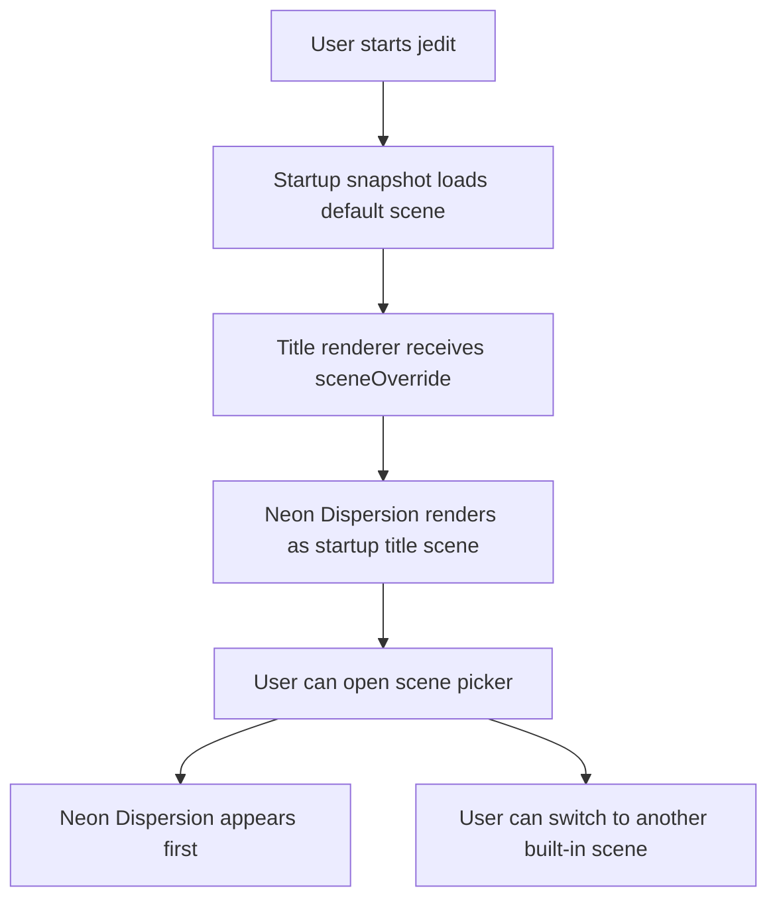
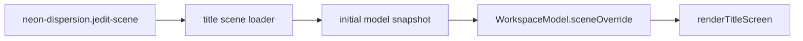

# DX-0101 - Neon Dispersion Default Scene

## Linked Issue

- https://github.com/flyingrobots/jedit/issues/101

## Decision Summary

Jedit will add `neon-dispersion.jedit-scene` as the first built-in title scene
and make it the production startup default by loading it into the initial
workspace snapshot. The scene will use the renderer's real current primitives:
transparent/refractive objects, high-reflectivity chrome objects, dark
enclosed walls, floor reflection/caustic posture, and hot-pink/cyan
neon-colored geometry. Unsupported cinematic requests such as true emissive
tube lights, wavelength dispersion, roughness maps, torus primitives, and depth
of field will be tracked as follow-on renderer work instead of implied by the
scene asset.

## Sponsored Human

A person starting jedit wants the default title screen to demonstrate the ray
tracer's optical personality so that startup feels intentional and visually
distinct, without opening the scene picker or hand-selecting a demo scene.

## Sponsored Agent

An agent needs a named default-scene contract and inspectable scene object
facts so it can verify the startup scene selection and optical material
coverage, without scraping screenshots or guessing which generated scene
loaded.

## Hill

By the end of this cycle, startup loads `neon-dispersion.jedit-scene` as the
default title scene, the scene picker lists it first, and focused specs prove
the scene's refractive, reflective, neon, environment, and render-variety
posture.

## Current Truth

The merge target for this cycle is `origin/main` at
`2be4470d1b1efeb4a4738ca42c5a061490d31943`.

Current anchors:

- `BUILT_IN_TITLE_SCENE_NAMES` is the authoritative registry and currently
  starts with `teapot-cornell.jedit-scene`:
  [src/ports/title-scene-loader.ts#L10:2be4470d1b1efeb4a4738ca42c5a061490d31943](https://github.com/flyingrobots/jedit/blob/2be4470d1b1efeb4a4738ca42c5a061490d31943/src/ports/title-scene-loader.ts#L10).
- The production startup snapshot loads meshes, seed, theme, i18n, and entries,
  but no authored scene:
  [src/adapters/workspace-initial-model-snapshot.ts#L12:2be4470d1b1efeb4a4738ca42c5a061490d31943](https://github.com/flyingrobots/jedit/blob/2be4470d1b1efeb4a4738ca42c5a061490d31943/src/adapters/workspace-initial-model-snapshot.ts#L12).
- Initial scene state exposes the built-in scene names and chooses a camera from
  either the random generated scene or loaded bunny mesh, not from an authored
  default scene:
  [src/app/workspace/init.ts#L130:2be4470d1b1efeb4a4738ca42c5a061490d31943](https://github.com/flyingrobots/jedit/blob/2be4470d1b1efeb4a4738ca42c5a061490d31943/src/app/workspace/init.ts#L130).
- The title renderer only uses authored scene JSON when `sceneOverride` is
  supplied; otherwise it generates a seeded scene:
  [src/ui/title-screen.ts#L156:2be4470d1b1efeb4a4738ca42c5a061490d31943](https://github.com/flyingrobots/jedit/blob/2be4470d1b1efeb4a4738ca42c5a061490d31943/src/ui/title-screen.ts#L156).
- Existing scene-list tests assert the current scene order and asset
  existence:
  [spec/workspace-runtime.spec.mjs#L199:2be4470d1b1efeb4a4738ca42c5a061490d31943](https://github.com/flyingrobots/jedit/blob/2be4470d1b1efeb4a4738ca42c5a061490d31943/spec/workspace-runtime.spec.mjs#L199).
- Existing material-lab tests show the pattern for proving built-in scene
  registration, optical material facts, and render variety:
  [spec/title-scene-material-lab.spec.mjs#L20:2be4470d1b1efeb4a4738ca42c5a061490d31943](https://github.com/flyingrobots/jedit/blob/2be4470d1b1efeb4a4738ca42c5a061490d31943/spec/title-scene-material-lab.spec.mjs#L20).

## Problem

The title renderer has richer authored-scene support than the startup default
uses. Startup still falls back to generated/bunny scene state, so the most
intentional ray-traced scenes only appear after manual scene-picker selection
or preview commands.

## Scope

This cycle includes:

- Adding `scenes/neon-dispersion.jedit-scene`.
- Exporting a named default built-in title scene constant.
- Registering Neon Dispersion first in the built-in scene registry.
- Loading the default built-in scene into production startup snapshots.
- Applying the default scene camera to initial workspace title camera state.
- Adding focused tests proving scene facts, default startup selection, registry
  order, render variety, and asset copying.
- Creating follow-on issue debt for renderer features needed to make the full
  cinematic prompt literal.

## Non-Goals

This cycle does not include:

- Implementing real emissive light geometry.
- Implementing spectral chromatic dispersion or wavelength splitting.
- Adding torus or high-poly icosahedron primitives.
- Adding roughness maps, texture maps, or depth of field.
- Replacing the title ray tracer architecture.
- Changing intro logo timing or startup file modal behavior.

## User Experience / Product Shape

On startup, before any editor is open, the title screen shows Neon Dispersion by
default: a refractive central crystal cluster in a dark enclosed room, neon
pink/cyan tubes represented by luminous thin columns, a dark reflective floor,
and floating chrome/matte spheres for depth. The user does not need to press
`ctrl+l` or use the scene picker. The scene picker still works and lists Neon
Dispersion first.

### User Journey



### Wide UI Mockup

Not applicable. This cycle changes the rendered ray-traced scene content, not
TUI layout or controls.

### Narrow UI Mockup

Not applicable. Existing title renderer and startup modal small-screen behavior
remain unchanged.

### Accessibility Considerations

The title scene is decorative startup art. The machine-readable proof is the
scene JSON and test-inspected scene facts. No focus order or keyboard behavior
changes.

## Runtime / API Contract

Contracts:

- `src/ports/title-scene-loader.ts`
- `src/adapters/title-scene-loader.ts`
- `src/adapters/workspace-initial-model-snapshot.ts`
- `src/app/workspace/init.ts`

The title scene loader port will export:

- `DEFAULT_BUILT_IN_TITLE_SCENE_NAME`.

Startup snapshot behavior:

- Production startup attempts to load `DEFAULT_BUILT_IN_TITLE_SCENE_NAME`.
- If the scene loads, `WorkspaceInitialModelSnapshot.sceneOverride` contains
  that scene.
- If loading fails, startup remains usable and falls back to the generated
  scene path while reporting a concise stderr message.

Initial model behavior:

- `availableScenes[0]` is `DEFAULT_BUILT_IN_TITLE_SCENE_NAME`.
- When `sceneOverride` exists, `titleCamera` starts from the scene camera.
- When `sceneOverride` is absent, existing seed/mesh camera behavior remains.

## Lower Modes

Lower-mode proof is through specs and CLI preview:

- specs inspect scene object labels, optical fields, registry order, and initial
  model state;
- `npm run title:preview -- --scene neon-dispersion.jedit-scene --json`
  provides machine-readable preview facts;
- render tests inspect terminal surface color variety.

## Data / State Model

| Category                  | Description                                        |
| ------------------------- | -------------------------------------------------- |
| Source of truth           | `scenes/neon-dispersion.jedit-scene`.              |
| Derived state             | Loaded `TitleScene` and initial `sceneOverride`.   |
| Invalid states            | Default scene missing, malformed, or unregistered. |
| Reset behavior            | Scene can be changed through the existing picker.  |
| Serialization             | `.jedit-scene` JSON copied into `dist/scenes`.     |
| Deterministic assumptions | Same scene/theme/time renders same surface.        |



## Accessibility Posture

| Concern                           | Posture                                     |
| --------------------------------- | ------------------------------------------- |
| Semantic labels or facts          | Object labels identify scene design roles.  |
| Focus order or ownership          | Not changed.                                |
| Hidden or visual-only information | Scene facts are test- and preview-readable. |
| Keyboard behavior                 | Existing scene picker controls remain.      |
| Secret or redaction behavior      | No secrets are read or emitted.             |

## Localization / Directionality Posture

Not applicable. No user-visible localized strings change. The scene asset name
is a developer/reviewer artifact and scene-picker row label.

## Agent Inspectability / Explainability Posture

Agents can inspect:

- `DEFAULT_BUILT_IN_TITLE_SCENE_NAME`;
- registry order;
- scene object labels;
- optical material fields;
- environment fields;
- initial model `sceneOverride`;
- render surface color variety.

## Linked Invariants

- Tests are executable spec.
- Runtime truth beats type theater.
- Design should become repo truth.
- Theme tokens own visible styling.
- The default experience should feel intentional without requiring manual
  setup.

## Design Alternatives Considered

### Option A: Put Neon Dispersion First In The Registry Only

Pros:

- Very small change.
- Scene picker and preview default to the new scene.

Cons:

- Production startup would still render generated/bunny scene unless the user
  manually loads a scene.
- Does not satisfy "default title screen scene" in the app.

### Option B: Load The Authored Scene In Startup Snapshot

Pros:

- Makes Neon Dispersion the actual app startup scene.
- Keeps `renderTitleScreen` unchanged by using existing `sceneOverride`.
- Lets failures fall back before the app runtime starts.

Cons:

- Requires a synchronous startup scene load path or snapshot adapter change.
- Adds another startup asset to keep valid.

## Decision

Choose Option B. A default title scene should be true in the production app, not
only in scene picker order. The startup snapshot is the correct boundary because
it already owns startup assets, meshes, theme, entries, and seed.

## Implementation Slices

- [x] Slice 1: File issue #101 and write this design document.
- [x] Slice 2: Add failing tests for default scene registry/startup behavior
      and Neon Dispersion scene facts.
- [x] Slice 3: Add `neon-dispersion.jedit-scene` and default scene loader
      contract.
- [x] Slice 4: Wire startup snapshot/model camera to the default scene.
- [x] Slice 5: Validate render/preview, create follow-on renderer debt, update
      retrospective, and open the PR.

## Tests To Write First

Behavior tests required:

- [x] A Neon Dispersion scene spec fails until the built-in scene exists and is
      registered first.
- [x] A workspace startup spec fails until production initial snapshots carry
      the default scene override.
- [x] A render spec fails until the scene produces varied visible color output.
- [x] Existing title-preview shard coverage proves the scene is copied and
      preview-loadable.

Documentation and process tests:

- [x] Prettier checks this design doc and scene JSON.

Rule: documentation tests cannot be the only proof for implementation work.

## Acceptance Criteria

The work is done when:

- [x] `neon-dispersion.jedit-scene` exists under `scenes/`.
- [x] `DEFAULT_BUILT_IN_TITLE_SCENE_NAME` is `neon-dispersion.jedit-scene`.
- [x] `BUILT_IN_TITLE_SCENE_NAMES[0]` is the default scene.
- [x] Production startup initial model has `sceneOverride` set to Neon
      Dispersion.
- [x] The initial title camera uses the default scene camera.
- [x] The scene includes refractive, reflective, neon-colored, dark-room, floor,
      and floating-depth object facts.
- [x] Focused tests fail before implementation and pass after.
- [x] Follow-on renderer debt is tracked.
- [x] Issue and PR are linked correctly.
- [ ] CI and local validation are green.

## Validation Plan

Commands expected before PR completion:

```bash
npm run build
JEDIT_DIST_PREBUILT=1 node --test --test-concurrency=1 spec/title-scene-neon-dispersion.spec.mjs spec/workspace-runtime.spec.mjs spec/workspace-title-screen.spec.mjs
JEDIT_DIST_PREBUILT=1 npm run ci:shard -- title-rendering
JEDIT_DIST_PREBUILT=1 npm run ci:shard -- workspace-ui
npm run title:preview -- --scene neon-dispersion.jedit-scene --json --no-frame
npm run quality
npx --no-install prettier --check docs/design/0101-neon-dispersion-default-scene.md src/ports/title-scene-loader.ts src/adapters/title-scene-loader.ts src/adapters/workspace-initial-model-snapshot.ts src/app/workspace/init.ts spec/title-scene-neon-dispersion.spec.mjs spec/workspace-runtime.spec.mjs
npx --no-install prettier --parser json --check scenes/neon-dispersion.jedit-scene
git diff --check
```

## Playback / Witness

Reviewer commands:

```bash
npm run title:preview -- --scene neon-dispersion.jedit-scene --json
npm run title:record -- --scene neon-dispersion.jedit-scene --format text --frames 1 --width 80 --height 24
```

Interactive witness:

```bash
npm start
```

The first startup title scene should be Neon Dispersion before opening a file.

## Risks

Known risks:

- The user prompt asks for renderer features that do not exist yet.
- Startup should not crash if a built-in scene asset is malformed or missing.
- A richer default scene can increase startup ray-trace cost.

Mitigations:

- Encode only real current renderer primitives in scene JSON.
- Fall back to generated scene if the default built-in scene cannot load.
- Keep object count bounded and reuse the startup performance governor.

## Follow-On Debt

Follow-on renderer debt is tracked in
https://github.com/flyingrobots/jedit/issues/103.

## Retrospective

What changed from the design:

- The production startup snapshot now loads
  `DEFAULT_BUILT_IN_TITLE_SCENE_NAME` through a synchronous built-in scene
  adapter path and falls back to generated scene rendering if that asset is
  unavailable.
- The default scene uses current renderer primitives rather than pretending to
  have physical emissive tubes, spectral dispersion, roughness maps, torus
  geometry, or depth of field.

What the tests proved:

- RED:
  `node --test --test-concurrency=1 spec/title-scene-neon-dispersion.spec.mjs`
  failed because `neon-dispersion.jedit-scene` was unknown and startup had no
  `sceneOverride`.
- GREEN:
  `npm run build && JEDIT_DIST_PREBUILT=1 node --test --test-concurrency=1 spec/title-scene-neon-dispersion.spec.mjs`
  passed.
- Adjacent checks passed:
  `node --test --test-concurrency=1 spec/title-scene-loader.spec.mjs spec/workspace-runtime.spec.mjs spec/title-scene-material-lab.spec.mjs`,
  `JEDIT_DIST_PREBUILT=1 npm run ci:shard -- title-rendering`,
  `JEDIT_DIST_PREBUILT=1 npm run ci:shard -- workspace-ui`,
  `npm run title:preview -- --scene neon-dispersion.jedit-scene --json --no-frame`,
  `npm run quality`, and `git diff --check`.

What remains open:

- CI still needs to run on PR #102 after the implementation commit is pushed.
- Renderer feature debt remains in issue #103.

PR:

- https://github.com/flyingrobots/jedit/pull/102
