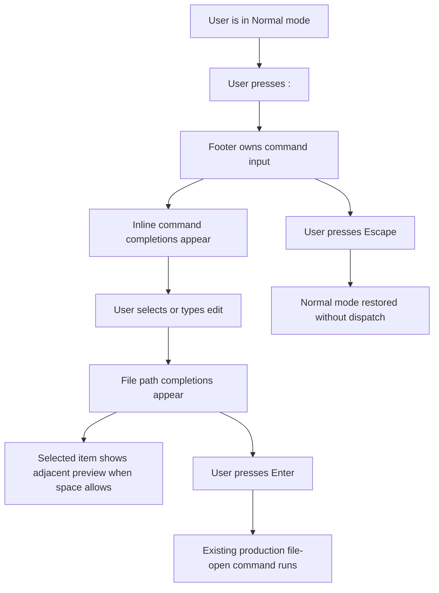
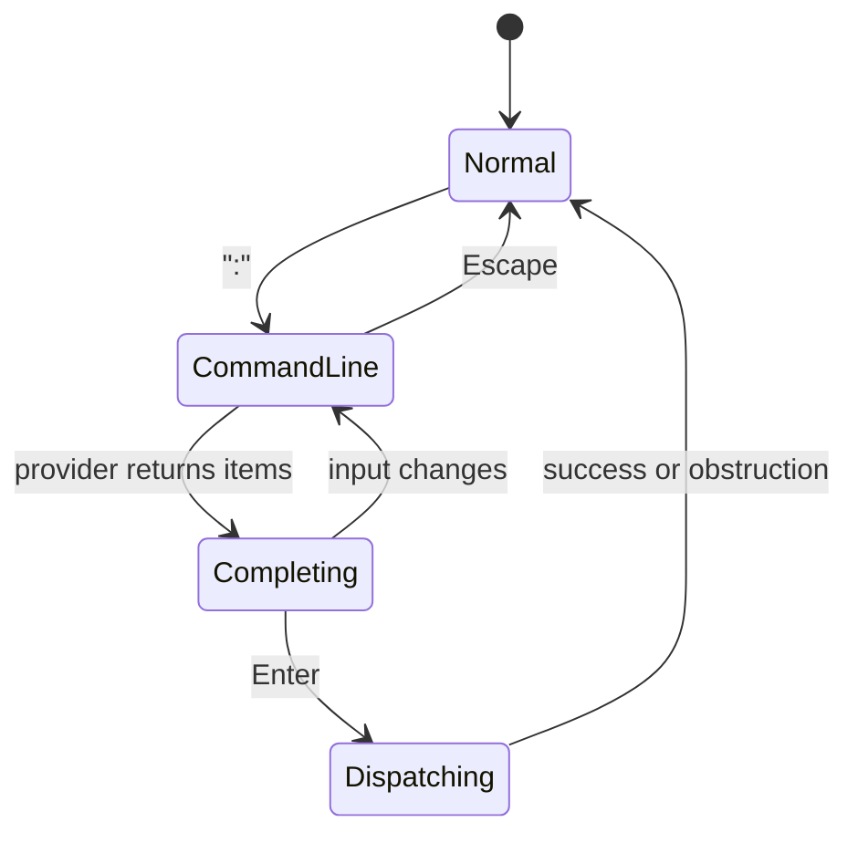

# WF-0102 - Vim Command-Line Completion Surface

## Linked Issue

- https://github.com/flyingrobots/jedit/issues/107

## Decision Summary

Jedit will replace one-off startup file-search surfaces with a reusable
Vim-shaped command-line and inline completion surface. Pressing `:` in Normal
mode enters a command input context, command and file providers supply
completions, `:edit <path>` opens files through the existing production
Echo-backed file-open path, and the inline completion popup is a Bijou-shaped
component that Jedit can also reuse for editor completions backed by Graft
symbols, documentation, source definitions, or causal-history previews.

## Sponsored Human

A person editing in Jedit wants familiar Vim command entry and rich inline file
or symbol completion so that opening files and discovering commands feels like
one coherent editor interaction, without switching between unrelated drawers,
startup-only pickers, or hidden key modes.

## Sponsored Agent

An agent needs command, completion, preview, and provider contracts with stable
ids so it can verify command dispatch, file suggestions, Graft-backed symbol
suggestions, and preview posture without scraping pixels or inferring private
focus state.

## Hill

By the end of this cycle, a user can press `:` in Normal mode, type `edit`,
see inline completions anchored to the command cursor, choose a file completion
with an optional inline preview, open that file through the production text
session, and the repo proves the same completion component can accept a
Graft-backed editor provider without rendering a custom second UI.

## Current Truth

The merge target for this cycle is `origin/main` at
`8c1cd49914abcdcc6696fa5d6a02694283ecbc5e`.

This design is also responding to active title/startup work on branch commit
`f0880078e0a0a93f171789ebc3747a8b7e7e6ff0`.

Current anchors:

- Workspace key dispatch currently routes quit confirmation, hard globals, the
  startup file selector, settings, scene picker, title keys, global keys, then
  focused-pane keys:
  [src/app/workspace/key-bindings.ts#L22:f0880078e0a0a93f171789ebc3747a8b7e7e6ff0](https://github.com/flyingrobots/jedit/blob/f0880078e0a0a93f171789ebc3747a8b7e7e6ff0/src/app/workspace/key-bindings.ts#L22).
- The startup file selector currently captures intro skip, reopen, input,
  navigation, Escape, and Enter behavior as a separate key-binding mode:
  [src/app/workspace/startup-file-modal-key-bindings.ts#L30:f0880078e0a0a93f171789ebc3747a8b7e7e6ff0](https://github.com/flyingrobots/jedit/blob/f0880078e0a0a93f171789ebc3747a8b7e7e6ff0/src/app/workspace/startup-file-modal-key-bindings.ts#L30).
- The startup file selector currently opens or changes directory by calling
  `openWorkspaceFileEntry`, which already routes file opens into production
  text authority:
  [src/app/workspace/startup-file-modal-key-bindings.ts#L101:f0880078e0a0a93f171789ebc3747a8b7e7e6ff0](https://github.com/flyingrobots/jedit/blob/f0880078e0a0a93f171789ebc3747a8b7e7e6ff0/src/app/workspace/startup-file-modal-key-bindings.ts#L101).
- The startup selector renderer is already a Jedit-owned surface using Bijou
  `drawer` and `browsableListSurface`, but its contract is title/startup
  specific:
  [src/ui/startup-file-modal.ts#L61:f0880078e0a0a93f171789ebc3747a8b7e7e6ff0](https://github.com/flyingrobots/jedit/blob/f0880078e0a0a93f171789ebc3747a8b7e7e6ff0/src/ui/startup-file-modal.ts#L61).
- File opening from the standard file tree already converges through
  `openWorkspaceFileEntry` and `createWorkspaceTextOpenCmd`:
  [src/app/workspace/file-tree.ts#L99:f0880078e0a0a93f171789ebc3747a8b7e7e6ff0](https://github.com/flyingrobots/jedit/blob/f0880078e0a0a93f171789ebc3747a8b7e7e6ff0/src/app/workspace/file-tree.ts#L99).
- Existing `WorkspaceKeys` does not define a colon key yet:
  [src/app/workspace/workspace-key.ts#L3:f0880078e0a0a93f171789ebc3747a8b7e7e6ff0](https://github.com/flyingrobots/jedit/blob/f0880078e0a0a93f171789ebc3747a8b7e7e6ff0/src/app/workspace/workspace-key.ts#L3).
- Graft is already modeled as a port in workspace dependencies and can become
  a completion content provider without making the completion renderer know
  Graft internals:
  [src/app/workspace/file-tree.ts#L30:f0880078e0a0a93f171789ebc3747a8b7e7e6ff0](https://github.com/flyingrobots/jedit/blob/f0880078e0a0a93f171789ebc3747a8b7e7e6ff0/src/app/workspace/file-tree.ts#L30).

## Problem

Jedit has multiple file-opening experiences that compete for user intent. The
standard `ctrl+b` files drawer respects the Bijou app frame, but it does not
offer type-to-search. The startup file selector offers type-to-search, but it is
title-specific and duplicates file-opening interaction. Neither surface creates
the Vim-shaped command-line interaction needed for `:edit`, `:write`, `:quit`,
or later editor completions.

The likely long-term surface is not another drawer. It is a provider-backed
inline completion popup that can be anchored to the active text cursor or the
command-line cursor, flip above when there is no room below, and optionally show
an adjacent preview.

## Scope

This cycle includes:

- A Normal-mode `:` command-line context.
- A command registry for Vim-shaped commands and aliases.
- A reusable Jedit-hosted, Bijou-shaped inline completion component.
- Command completions for `edit`, `write`, `quit`, `wq`, and aliases.
- File completions for `:edit <path>` from the current workspace directory.
- Optional inline preview for the selected file completion when geometry allows.
- A provider seam that can be exercised with a fake Graft-backed editor
  completion provider.
- Opening files through the existing production text session command path.
- Footer, focus, Escape, Enter, Tab, and arrow-key behavior for command mode.
- Narrow-terminal fallback and no-preview lower mode.
- Documentation and technical-teardown updates for Vim command behavior.

## Non-Goals

This cycle does not include:

- Implementing every Vim ex command.
- Implementing insert-mode language-server completion.
- Replacing Graft's API or changing Graft semantics.
- Adding mouse support.
- Adding a new recent-workspace database.
- Moving command-line UI into Echo.
- Moving Graft nouns into the completion renderer.
- Removing the standard files drawer before `:edit` is proven.
- Solving causal-history symbol previews beyond an inspectable provider
  posture and placeholder preview type.

## User Experience / Product Shape

The user presses `:` while in Normal mode. The footer changes into a command
line. As the user types, an inline completion popup appears anchored to the
command cursor. If there is room below the cursor, suggestions appear below; if
not, they flip above. The selected completion can show a preview beside the
suggestion list when there is room.

For `:edit`, completions are file paths. Selecting a file shows a short preview
of its contents or a compact unavailable preview. Pressing Enter opens the file
through the existing production Echo-backed text session path. Pressing Escape
closes command mode and restores Normal mode without dispatching a command.

The same completion popup is later reusable in an editor buffer. In that mode,
the content provider can be Graft: suggestions may be symbols, definitions,
documentation, source snippets, or causal-history summaries. The renderer sees
only completion items and preview documents, not Graft internals.

### User Journey



### Wide UI Mockup

```text
+------------------------------------------------------------+
| src/app/workspace/key-bindings.ts                          |
|                                                            |
| 17 export function updateFromKey(...) {                    |
| 18   return updateQuitConfirmationKey(...)                 |
| 19     ?? updateHardGlobalWorkspaceKey(...)                |
|                                                            |
| :edit src/app/workspace/ke                                 |
|       key-bindings.ts       F  src/app/workspace/...       |
|       key-binding-context.ts F  import type { ...          |
|       workspace-key.ts       F  export const WorkspaceKeys |
+------------------------------------------------------------+
```

The popup is inline and cursor-anchored. It is not a side panel and not the
files drawer. The preview floats beside the selected completion only when the
terminal has enough room.

### Narrow UI Mockup

```text
+--------------------------------+
| :edit src/app/workspace/ke     |
| key-bindings.ts       F        |
| key-binding-context.ts F       |
| workspace-key.ts      F        |
+--------------------------------+
```

The narrow view suppresses the preview and keeps the suggestion list clipped to
available width. If there is no room below the command line, the list flips
above it.

### Accessibility Considerations

Command mode is keyboard-only. The focused completion, item count, selected
index, provider id, preview availability, and command dispatch posture are
model facts that agents can inspect. The preview is redundant to item labels
and never required to execute the command.

## Runtime / API Contract

Contract: command-line mode, inline completion, and provider-backed preview.

Relevant exported shapes:

- `WorkspaceCommandLineState`
  - mode: closed or active;
  - input text;
  - cursor index;
  - selected completion index;
  - provider id;
  - optional dispatch posture.
- `WorkspaceCommandDescriptor`
  - stable command id;
  - canonical name;
  - aliases;
  - argument posture;
  - dispatch function.
- `InlineCompletionItem`
  - stable id;
  - label;
  - detail;
  - kind;
  - replacement range in the active input surface;
  - provider id;
  - optional preview request.
- `InlineCompletionPreview`
  - preview kind: file, documentation, source definition, causal history, or
    unavailable;
  - stable title;
  - bounded lines;
  - evidence posture when provided by Echo or Graft.
- `InlineCompletionProvider`
  - receives input context, cursor coordinate, workspace facts, and budget;
  - returns deterministic items and optional preview data;
  - does not render UI.
- `renderInlineCompletionPopup`
  - receives theme tokens, geometry, items, selected index, command cursor
    coordinate, and optional preview;
  - returns a Bijou `Surface`;
  - owns flipping and clipping behavior.

Behavior:

- `:` in Normal mode opens command mode when no higher-priority modal or drawer
  owns focus.
- Escape exits command mode and dispatches nothing.
- Enter dispatches the parsed command when valid.
- Tab accepts the focused completion when completions exist.
- Arrow keys move the focused completion while command mode owns input.
- `:edit <path>` resolves through the file provider and then calls the existing
  production open path.
- `:q`, `:quit`, `:w`, `:write`, `:wq`, and `:q!` map to existing quit/save
  postures where those postures are already available.
- Editor-mode providers may use Graft, but the renderer consumes only the
  provider-neutral completion and preview contracts.

## Lower Modes

| Concern                       | Posture                                                                                           |
| ----------------------------- | ------------------------------------------------------------------------------------------------- |
| Small terminal                | Completion list clips to available rows; preview is omitted first.                                |
| No color                      | Labels, kind glyphs, and selected index remain readable without color.                            |
| Keyboard-only                 | All interactions are keyboard-owned.                                                              |
| Pipe or fixture output        | Completion providers expose deterministic items for focused tests.                                |
| Optional adapters unavailable | Graft-backed providers return unavailable preview posture; command and file providers still work. |
| Echo or file evidence partial | File preview may be unavailable; file open still uses the production obstruction path.            |

## Data / State Model

| Category                  | Description                                                                                                                |
| ------------------------- | -------------------------------------------------------------------------------------------------------------------------- |
| Source of truth           | Command-line state in `WorkspaceModel`; provider responses are derived.                                                    |
| Derived state             | Parsed command, active provider, completion list, selected item, popup geometry, preview content.                          |
| Invalid states            | Command mode active while a higher-priority modal owns focus; dispatching invalid commands; preview required for dispatch. |
| Reset behavior            | Escape closes command mode; successful command dispatch closes command mode unless command opts to remain open.            |
| Serialization             | No serialized state in this cycle.                                                                                         |
| Deterministic assumptions | Providers receive explicit context and budget; render geometry is pure over width, height, cursor coordinate, and theme.   |



## Accessibility Posture

| Concern                           | Posture                                                                                            |
| --------------------------------- | -------------------------------------------------------------------------------------------------- |
| Semantic labels or facts          | Command input, provider id, selected completion, item count, and preview kind are model facts.     |
| Focus order or ownership          | Command line owns focus while active; completion popup follows that focus.                         |
| Hidden or visual-only information | Preview content is optional and reflected by preview availability facts.                           |
| Keyboard behavior                 | `:`, Escape, Enter, Tab, arrows, Backspace, and printable keys are covered by tests.               |
| Secret or redaction behavior      | Providers must redact or omit previews through preview posture, not through renderer conditionals. |

## Localization / Directionality Posture

This cycle adds user-visible strings for command names, command descriptions,
completion unavailable messages, and preview titles.

| Concern                    | Posture                                                                                                                   |
| -------------------------- | ------------------------------------------------------------------------------------------------------------------------- |
| User-visible strings       | Command descriptions, preview headings, invalid-command messages.                                                         |
| Catalog keys               | Add under command-line and inline-completion namespaces.                                                                  |
| Supported locales updated  | Existing generated locales must remain complete.                                                                          |
| Directionality assumptions | Popup opens to the right in LTR and to the left in RTL when preview geometry permits; list text follows locale direction. |
| Validation command         | `npm run quality` and focused i18n completeness checks that exist at implementation time.                                 |

## Agent Inspectability / Explainability Posture

Agents can inspect:

- stable command ids and aliases;
- command-line state in the workspace model;
- provider ids and completion item ids;
- selected completion index and replacement range;
- preview kind and evidence posture;
- rendered `Surface` geometry for above/below and preview left/right decisions;
- file-open command dispatch through the production text session witness.

## Linked Invariants

- Tests are executable spec.
- Runtime truth beats type theater.
- Design should become repo truth.
- Buffers, panes, panels, and lenses are different things.
- Files and previews are projections.
- Echo authority remains outside jedit product nouns.
- UI surfaces are Bijou-shaped components, even when they live in Jedit.
- Providers supply content; components render content; command dispatch changes
  state.

## Design Alternatives Considered

### Option A: Improve Both Drawers

Pros:

- Lowest migration cost from current UI.
- Keeps `ctrl+b` and startup selector behavior familiar.

Cons:

- Preserves duplicate file-opening concepts.
- Does not create Vim command mode.
- Does not solve editor autocomplete reuse.
- Makes future Graft completion likely to become a third UI.

### Option B: Standard Files Drawer With Search

Pros:

- Reuses the standard app frame.
- Good for broad browsing and directory navigation.

Cons:

- Still panel-oriented rather than command-oriented.
- Does not match `:edit` or Vim command flow.
- Popup completion for editor symbols would still need another component.

### Option C: Reusable Inline Completion For Command And Editor Contexts

Pros:

- Matches Vim command-line flow.
- Creates one reusable completion component.
- Lets file, command, Graft, source, documentation, and causal-history
  providers share a UI contract.
- Keeps content providers separate from rendering.

Cons:

- Requires a real command-line state machine.
- Requires careful geometry tests.
- Startup browser retirement needs a phased migration.

## Decision

Choose Option C.

Jedit will build a reusable inline completion component and provider contract
first, then use it for `:` command mode and `:edit`. The standard files drawer
remains for browse-mode file navigation until command-line file opening is
proven. The startup file selector becomes temporary transition UI and should be
removed or reduced to a command-line entry path after the command surface lands.

## Goalposts And Slices

### Goalpost 1: Command-Line Spine

Outcome:

Normal mode has a real command-line context with deterministic focus, input,
cancel, and dispatch posture.

Witnesses:

- focused key-binding spec for `:` entering command mode;
- focused key-binding spec for printable input, Backspace, Escape, and Enter;
- model-state spec proving command mode loses to higher-priority modals.

Slices:

- [x] Slice 1: Add `WorkspaceKeys.Colon` and command-line state.
      Commit: `UX: add command-line workspace state`.
- [x] Slice 2: Add command-line key-binding priority and Escape cancel.
      Commit: `UX: enter and cancel command mode`.
- [x] Slice 3: Add command input editing and cursor movement.
      Commit: `UX: edit command-line input`.
- [x] Slice 4: Add command parser and invalid-command obstruction.
      Commit: `UX: parse command-line commands`.

### Goalpost 2: Bijou Inline Completion Component

Outcome:

A reusable Jedit-hosted component renders inline suggestions and optional
preview as a Bijou-shaped surface, with geometry tests for below, above,
preview right, preview left, and narrow no-preview modes.

Witnesses:

- pure render spec for below-cursor placement;
- pure render spec for above-cursor flip;
- pure render spec for adjacent preview placement;
- pure render spec proving theme-token use and no ad hoc colors.

Slices:

- [x] Slice 5: Define provider-neutral completion item and preview types.
      Commit: `UI: define inline completion contracts`.
- [x] Slice 6: Render completion list as a Bijou-shaped component.
      Commit: `UI: render inline completion list`.
- [x] Slice 7: Add preview pane geometry and narrow fallback.
      Commit: `UI: add inline completion preview`.
- [x] Slice 8: Integrate completion popup into workspace overlays.
      Commit: `UI: show command-line completions`.

### Goalpost 3: Command And File Providers

Outcome:

Command mode offers command completions and `:edit <path>` offers file
completions with optional preview. Dispatch opens files through existing
production text authority.

Witnesses:

- provider spec for command names and aliases;
- provider spec for file path filtering and directory/file labels;
- file-preview spec with bounded lines and unavailable posture;
- integration spec proving `:edit <file>` calls production open.

Slices:

- [x] Slice 9: Add command registry and command completion provider.
      Commit: `UX: complete command names`.
- [x] Slice 10: Add file completion provider for `:edit`.
      Commit: `UX: complete edit paths`.
- [x] Slice 11: Add bounded file preview provider.
      Commit: `UX: preview edit path completions`.
- [x] Slice 12: Dispatch `:edit`, `:write`, `:quit`, `:wq`, and aliases.
      Commit: `UX: dispatch vim command-line commands`.

### Goalpost 4: Graft-Backed Editor Provider Seam

Outcome:

The same completion component can render an editor-context provider result.
Graft is the content provider for symbols, docs, definitions, or causal-history
preview posture, but the renderer remains provider-neutral.

Witnesses:

- fake Graft provider spec proving symbol/docs/source/history preview shapes;
- render spec proving editor-context items use the same popup component;
- adapter-unavailable spec proving no crash and honest preview posture.

Slices:

- [x] Slice 13: Add editor completion context and provider registry seam.
      Commit: `UX: add editor completion provider seam`.
- [x] Slice 14: Add fake Graft symbol provider witness.
      Commit: `UX: witness graft completion provider`.
- [x] Slice 15: Render documentation, source-definition, and causal-history
      preview kinds through the same component.
      Commit: `UI: render completion preview kinds`.
- [ ] Slice 16: Add unavailable-adapter lower-mode posture.
      Commit: `UX: handle unavailable completion providers`.

### Goalpost 5: Surface Consolidation

Outcome:

Overlapping startup/file-browser behavior is reduced. Command-line file open is
the primary type-to-open surface, and the technical teardown explains Vim
controls and completion reuse.

Witnesses:

- regression spec proving `ctrl+b` remains the standard files drawer;
- regression spec proving startup flow does not own a second type-to-search
  browser after command-line open is available;
- documentation spec or focused text assertion for the teardown updates.

Slices:

- [ ] Slice 17: Route startup post-intro open affordance toward command mode or
      the standard files drawer.
      Commit: `UX: consolidate startup file opening`.
- [ ] Slice 18: Remove duplicate startup type-to-search code that command mode
      replaces.
      Commit: `UX: retire duplicate startup search`.
- [ ] Slice 19: Update footer hints and localized command copy.
      Commit: `Docs: update command-line copy`.
- [ ] Slice 20: Update technical teardown, retrospective, and playback witness.
      Commit: `Docs: document vim command completion`.

## Tests To Write First

Behavior tests required:

- [x] `:` in Normal mode enters command-line mode and owns focus.
- [x] Escape cancels command mode without dispatching.
- [x] Printable input, Backspace, selected completion movement, and Tab accept
      behave deterministically.
- [x] Inline completion popup flips above when the command line is near the
      bottom of the terminal.
- [x] Inline completion preview is omitted on narrow terminals.
- [x] `:edit <path>` opens through `createWorkspaceTextOpenCmd`.
- [x] Invalid commands produce an obstruction or toast without mutating editor
      state.
- [ ] A fake Graft provider can render symbol documentation/source/history
      previews through the same component.

Documentation and process tests:

- [ ] Technical teardown explains command-line mode, `:edit`, `:write`, `:quit`,
      and provider-backed completion reuse.
- [ ] Design retrospective records which startup/browser surfaces remain.

Rule: documentation tests cannot be the only proof for implementation work.

## Acceptance Criteria

The work is done when:

- [x] Behavior tests prove command-line state, input, completion, preview, and
      dispatch.
- [x] Render tests prove inline popup geometry and theme-token posture.
- [x] `:edit <file>` opens a file through production text authority.
- [x] `:write`, `:quit`, `:wq`, and aliases use existing save/quit postures.
- [ ] The same popup component renders fake Graft-backed editor completions.
- [ ] Lower modes cover small terminals and unavailable providers.
- [x] New strings have supported translations or tracked localization follow-up
      if the CSV localization migration lands first.
- [ ] Docs and technical teardown are updated.
- [ ] Issue and PR are linked correctly.
- [ ] CI and local validation are green.

## Validation Plan

Commands expected before PR:

```bash
npm run build
JEDIT_DIST_PREBUILT=1 node --test spec/workspace-command-line.spec.mjs
JEDIT_DIST_PREBUILT=1 node --test spec/inline-completion-popup.spec.mjs
JEDIT_DIST_PREBUILT=1 node --test spec/workspace-command-completion.spec.mjs
JEDIT_DIST_PREBUILT=1 npm run ci:shard -- workspace-ui
JEDIT_DIST_PREBUILT=1 npm run ci:shard -- misc-fast
npm run quality
git diff --check
```

Trim commands that do not apply after the final slice plan lands.

## Playback / Witness

Manual playback:

```bash
npm run build
npm run jedit
```

Then:

- open Jedit into an editor buffer;
- press `:`;
- type `edit src/app/workspace/`;
- use arrows to select a file completion;
- verify the inline list appears above the command line when needed;
- verify preview appears only when terminal width allows;
- press Enter and confirm the selected file opens;
- press `:` again, type `q`, and confirm quit behavior follows the normal quit
  confirmation posture unless a force command explicitly bypasses it.

Editor-provider playback after Goalpost 4:

- open a source file;
- invoke the editor completion key chosen during implementation;
- verify fake or real Graft provider items render through the same inline popup;
- verify selected symbol previews can show documentation, source definition, or
  causal-history posture without a separate panel implementation.

## Risks

Known risks:

- Command-line mode can accidentally preempt higher-priority modal or drawer
  keys.
- Inline popup geometry can become brittle across small terminals and RTL
  locales.
- File preview can block input if it reads too much synchronously.
- Reusing the popup for Graft-backed editor completions can tempt provider
  details into UI code.
- Retiring startup search too early can make no-file startup less useful.

Mitigations:

- Key-binding priority gets focused tests before rendering work.
- Geometry is pure and covered by render fixtures.
- Preview providers are budgeted and bounded.
- Provider-neutral contracts keep renderer independent.
- Startup consolidation waits until `:edit` is proven with executable tests.

## Follow-On Debt

Create GitHub issues for anything deferred:

- Full insert-mode language completion.
- Real Graft symbol/documentation provider.
- Real causal-history symbol preview.
- CSV localization migration if command-line strings land before issue #53.
- Fuzzy path scoring if simple prefix and substring matching is not enough.

## Retrospective

Fill this in after implementation.

What changed from the design:

- Pending.

What the tests proved:

- Pending.

What remains open:

- Pending.

PR:

- Pending.
