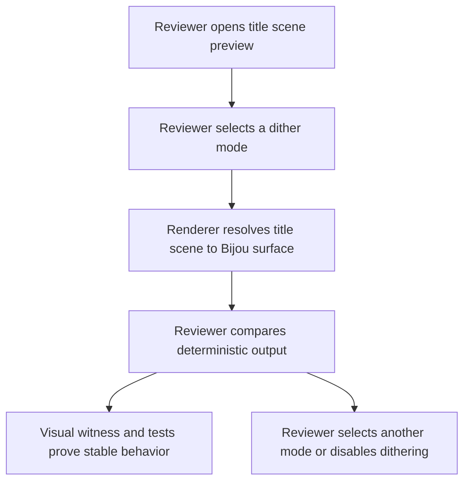
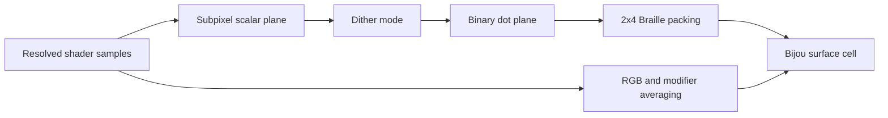

# WF-0103 - Title Braille Dither Modes

## Linked Issue

- https://github.com/flyingrobots/jedit/issues/108

## Decision Summary

The title-screen Braille renderer should gain optional renderer-native dither
modes over its resolved Braille subpixel luminance field. The dither boundary
belongs in the Bijou/jedit surface renderer, not in a browser canvas, DOM image
pipeline, title scene object model, or Echo text authority path.

## Sponsored Human

A jedit user wants the animated title scene to show smoother tone, shadows, and
soft gradients so that the ray-traced scene reads as intentional terminal art,
without having to switch to ASCII mode or tolerate harsh thresholded Braille
dots.

## Sponsored Agent

An agent needs a deterministic renderer option and visual witness surface so it
can compare dither modes, capture render facts, and detect regressions, without
inferring visual quality from screenshots alone.

## Hill

By the end of this cycle, a reviewer can choose a title Braille dither mode
through a typed renderer option, render the title scene through the existing
Bijou surface path, and the repo proves the behavior with focused renderer
tests, visual witness fixture updates, and title-rendering shard coverage.

## Current Truth

The Braille title renderer is a pure Bijou surface renderer. Its shader returns
`BrailleShaderSample` values with `on`, `fgRGB`, `bgRGB`, optional ray stats,
and optional modifiers
([src/ui/averaging-braille-canvas.ts#11:8c1cd49914abcdcc6696fa5d6a02694283ecbc5e](https://github.com/flyingrobots/jedit/blob/8c1cd49914abcdcc6696fa5d6a02694283ecbc5e/src/ui/averaging-braille-canvas.ts#L11)).

Each terminal cell is resolved from eight Braille subpixels, arranged as two
columns by four rows
([src/ui/averaging-braille-canvas.ts#79:8c1cd49914abcdcc6696fa5d6a02694283ecbc5e](https://github.com/flyingrobots/jedit/blob/8c1cd49914abcdcc6696fa5d6a02694283ecbc5e/src/ui/averaging-braille-canvas.ts#L79)).
`collapseBrailleCell` currently packs those subpixel booleans directly into a
Unicode Braille code point and averages foreground/background RGB values
([src/ui/averaging-braille-canvas.ts#181:8c1cd49914abcdcc6696fa5d6a02694283ecbc5e](https://github.com/flyingrobots/jedit/blob/8c1cd49914abcdcc6696fa5d6a02694283ecbc5e/src/ui/averaging-braille-canvas.ts#L181)).

The Braille path already has temporal sampling support. `BrailleSampleCache`
retains resolved subpixel samples, and `BrailleTraceBudget` controls whether a
frame traces all dots or reuses prior samples
([src/ui/averaging-braille-canvas.ts#24:8c1cd49914abcdcc6696fa5d6a02694283ecbc5e](https://github.com/flyingrobots/jedit/blob/8c1cd49914abcdcc6696fa5d6a02694283ecbc5e/src/ui/averaging-braille-canvas.ts#L24)).

The ASCII title renderer already has a small ordered dither option for one ASCII
palette using a 4x4 Bayer matrix
([src/ui/averaging-ascii-canvas.ts#65:8c1cd49914abcdcc6696fa5d6a02694283ecbc5e](https://github.com/flyingrobots/jedit/blob/8c1cd49914abcdcc6696fa5d6a02694283ecbc5e/src/ui/averaging-ascii-canvas.ts#L65)).
That implementation proves the repo already accepts deterministic renderer-side
dithering, but it is ASCII-specific and maps averaged luminance to ramp
characters rather than packing Braille dots.

## Problem

The title Braille renderer currently treats each subpixel as an already-binary
dot. That keeps the renderer simple, but it makes soft ray-traced effects look
coarse: caustics, soft shadows, low-contrast material transitions, and floor
gradients can collapse into abrupt on/off texture. A direct image-processing
port of browser canvas dithering would sit at the wrong boundary because jedit's
renderer works from shader samples and Bijou cells, not DOM image pixels.

## Scope

This cycle includes:

- Adding a typed title Braille dither mode contract.
- Adding a pure renderer dither module for threshold, ordered Bayer 4x4, and
  Atkinson.
- Applying dither over the full Braille subpixel plane before 2x4 cell packing.
- Preserving existing foreground/background RGB averaging, modifiers, ray stats,
  temporal cache behavior, and adaptive trace budgets.
- Adding focused renderer tests and title-scene visual witness updates.

## Non-Goals

This cycle does not include:

- Browser canvas, DOM, `ImageData`, or HTML image ingestion.
- Dithering the editor text buffer, file browser, Graft drawer, footer, or
  normal UI components.
- Making dithering an Echo event or Echo-owned setting.
- Replacing the ASCII renderer's existing palette system.
- Optimizing mesh traversal, BVH, title scene materials, or camera movement.
- Interrupting the active Vim command-line completion plan.

## User Experience / Product Shape

The title screen remains a live ray-traced terminal scene. A dither mode changes
only how resolved Braille dots represent fractional tone. The user should see
smoother gradients and less harsh thresholding without losing the cell color
styling that makes neon lighting and material tint visible.

The first implementation should not add a new default keybinding. Dither modes
should be renderer options and preview-session controls first. A later cycle may
decide whether title-screen keys, scene metadata, or settings expose the mode.

### User Journey



### Wide UI Mockup

Not applicable for this draft. The work changes the rendering algorithm for an
existing full-screen title scene rather than adding a new layout surface.

### Narrow UI Mockup

Not applicable for this draft. Narrow terminal behavior should use the same
renderer contract and should be covered by existing title-rendering tests if the
mode becomes user-selectable.

### Accessibility Considerations

Dithering must not be the only source of state. If the selected mode becomes
user-visible later, it needs a text label in preview output, footer/status copy,
or deterministic JSON facts. The rendered Braille texture itself is visual-only.

## Runtime / API Contract

Contract: `TitleBrailleDitherMode`.

Relevant exported surface:

- `BRAILLE_DITHER_MODE.None`
- `BRAILLE_DITHER_MODE.Threshold`
- `BRAILLE_DITHER_MODE.OrderedBayer4`
- `BRAILLE_DITHER_MODE.Atkinson`
- `ditherBrailleSubpixels(input)`
- `AveragingBrailleCanvasOptions.ditherMode`

Expected behavior:

- `None` preserves the current `sample.on` packing behavior.
- `Threshold` converts scalar luminance or coverage to binary dots with a fixed
  threshold.
- `OrderedBayer4` applies a deterministic 4x4 ordered matrix across the full
  Braille subpixel plane.
- `Atkinson` applies error diffusion across the full Braille subpixel plane,
  including across terminal-cell boundaries.
- Unknown external mode names are rejected at adapter boundaries, not accepted
  into renderer core.

The title screen may later thread this mode through preview controls, scene
metadata, or settings, but the first implementation should prove the renderer
contract before product controls are added.

## Lower Modes

- Terminal size constraints: dither operates over `cols * 2` by `rows * 4`
  subpixels and must handle zero or negative dimensions by returning the current
  empty surface behavior.
- No-color output: dither changes dot on/off decisions only; it must not require
  color support.
- JSON/fixture output: title preview/profile/record commands should expose the
  selected mode once wired into those tools.
- Keyboard-only operation: no required change in the first renderer slice.
- Partial adapters: if preview controls are not available, the renderer default
  remains `None`.

## Data / State Model

| Category                  | Description                                                                   |
| ------------------------- | ----------------------------------------------------------------------------- |
| Source of truth           | Renderer option passed into `averagingBrailleCanvas`.                         |
| Derived state             | Full-frame scalar subpixel plane and binary dithered dot plane.               |
| Invalid states            | Unknown dither mode, mismatched plane dimensions, non-finite scalar values.   |
| Reset behavior            | Dither work is per frame; no persistent renderer state is required.           |
| Serialization             | Optional future preview/profile facts may serialize the selected mode string. |
| Deterministic assumptions | Same shader samples, dimensions, time, and mode produce the same surface.     |



## Accessibility Posture

| Concern                           | Posture                                                                 |
| --------------------------------- | ----------------------------------------------------------------------- |
| Semantic labels or facts          | Future preview/profile output should name the selected dither mode.     |
| Focus order or ownership          | No focus changes in the renderer-only slice.                            |
| Hidden or visual-only information | Dither texture remains visual-only and must not encode state by itself. |
| Keyboard behavior                 | No new keybinding in the first implementation.                          |
| Secret or redaction behavior      | Not applicable.                                                         |

## Localization / Directionality Posture

Not applicable for the renderer-only slice. If later controls expose mode names
to users, those strings must follow the repo's localization path and remain
direction-neutral. Error diffusion scan order should be deterministic and should
not depend on locale direction unless a later product decision explicitly
requires direction-aware visual texture.

## Agent Inspectability / Explainability Posture

An agent should be able to inspect dither behavior without scraping screenshots:

- stable mode ids;
- deterministic title preview JSON fields;
- renderer tests over small scalar fixtures;
- visual witness fixture names that include the mode;
- profile facts that report dither mode when enabled.

## Linked Invariants

- Tests are executable spec.
- Runtime truth beats type theater.
- Design should become repo truth.
- Layout owns interaction geometry.
- Files and previews are projections.
- Echo authority remains outside jedit product nouns.

## Design Alternatives Considered

### Option A: Browser Canvas Port

Pros:

- Existing examples and kernels can be copied mechanically.
- Easy to reason about if the input is already image-like.

Cons:

- Wrong runtime boundary for jedit.
- Pulls DOM and `ImageData` assumptions into a terminal renderer.
- Loses jedit's shader sample facts, ray stats, modifiers, and Bijou cell model.

### Option B: Per-Cell Error Diffusion

Pros:

- Simple to fit into the current `collapseBrailleCell` function.
- Low memory overhead.

Cons:

- Produces 2x4-cell artifacts.
- Prevents error diffusion from crossing cell boundaries.
- Makes Atkinson/Floyd-Steinberg/Stucki behave unlike their intended kernels.

### Option C: Full Subpixel Plane Dither

Pros:

- Keeps the renderer native to Bijou/jedit.
- Preserves existing cell style averaging.
- Allows ordered and error-diffusion algorithms to behave across cell
  boundaries.
- Provides a clean contract for future preview controls.

Cons:

- Requires a frame-local scalar plane before cell packing.
- Needs careful interaction with temporal sample reuse to avoid shimmer.

## Decision

Choose Option C. Implement dither as a pure renderer stage over the full Braille
subpixel plane. Start with `None`, `Threshold`, `OrderedBayer4`, and `Atkinson`.
Keep Floyd-Steinberg and Stucki out of the first implementation unless the
initial tests show Atkinson is insufficient.

## Implementation Slices

- [ ] Slice 1: Add `TitleBrailleDitherMode` and scalar-plane fixture tests.
      Commit: `Render: add Braille dither mode contract`.
- [ ] Slice 2: Implement threshold and ordered Bayer over the full subpixel
      plane. Commit: `Render: add ordered Braille dithering`.
- [ ] Slice 3: Implement Atkinson error diffusion across cell boundaries.
      Commit: `Render: add Atkinson Braille dithering`.
- [ ] Slice 4: Thread mode through title preview/profile/record lower modes
      without adding title-screen keybindings. Commit: `Tools: expose title
Braille dither facts`.
- [ ] Slice 5: Update visual witnesses and decide whether any mode should
      become the title default. Commit: `Test: witness title Braille dithering`.

## Tests To Write First

Behavior tests required:

- [ ] Renderer fixture proving `None` preserves current Braille output.
- [ ] Renderer fixture proving ordered Bayer is deterministic for a gradient.
- [ ] Renderer fixture proving Atkinson diffuses across terminal-cell
      boundaries.
- [ ] Renderer fixture proving dither does not change averaged foreground and
      background RGB styling.
- [ ] Temporal-cache fixture proving repeated cached sample fields produce
      deterministic dithered output.

Documentation and process tests, only if relevant:

- [ ] Existing design-cycle policy test continues to recognize the design doc.

## Acceptance Criteria

The work is done when:

- [ ] Behavior tests prove each implemented mode.
- [ ] Rendered output proves the title scene can use the selected mode.
- [ ] Lower-mode preview/profile/record facts report the selected mode, if
      wired.
- [ ] No new user-visible strings are added without localization coverage.
- [ ] Visual witnesses are updated only after the behavior tests pass.
- [ ] Issue and PR are linked correctly.
- [ ] CI and local validation are green.

## Validation Plan

Commands expected before PR:

```bash
npm run build
JEDIT_DIST_PREBUILT=1 node --test --test-concurrency=1 spec/averaging-braille-dither.spec.mjs
JEDIT_DIST_PREBUILT=1 npm run ci:shard -- title-rendering
npm run quality
git diff --check
```

## Playback / Witness

Reviewer playback should include one deterministic CLI or fixture path, for
example:

```bash
npm run title:preview -- --scene neon-dispersion.jedit-scene --render braille --dither ordered-bayer-4 --json
JEDIT_DIST_PREBUILT=1 node --test --test-concurrency=1 spec/averaging-braille-dither.spec.mjs
```

If a visual witness is updated, include terminal size, theme, scene, camera
radius, dither mode, and time in the fixture name or metadata.

## Risks

Known risks:

- Error diffusion may shimmer during camera motion.
- Full-plane dithering may allocate more than the current direct cell path.
- Dithered dots may fight temporal phase reuse when the renderer traces only a
  subset of Braille samples.
- Better tone can hide actual ray-tracing regressions if witnesses become too
  forgiving.

Mitigations:

- Keep `None` as a stable baseline.
- Prefer ordered Bayer for animated default behavior.
- Test temporal-cache determinism explicitly.
- Keep visual witness thresholds strict and fixture-specific.

## Follow-On Debt

- Decide later whether Floyd-Steinberg and Stucki should be implemented.
- Decide later whether a keybinding, scene metadata field, or settings row
  should expose the mode in the live title screen.
- Decide later whether dither mode belongs in profile/perf overlay facts.

## Retrospective

What changed from the design:

- Draft only. Implementation has not started.

What the tests proved:

- No product/runtime tests yet. This document defines the future executable
  witnesses.

What remains open:

- All implementation slices remain open.
- Vim command-line completion remains the active priority after this parking
  document.

PR:

- Not opened for this deferred idea.
