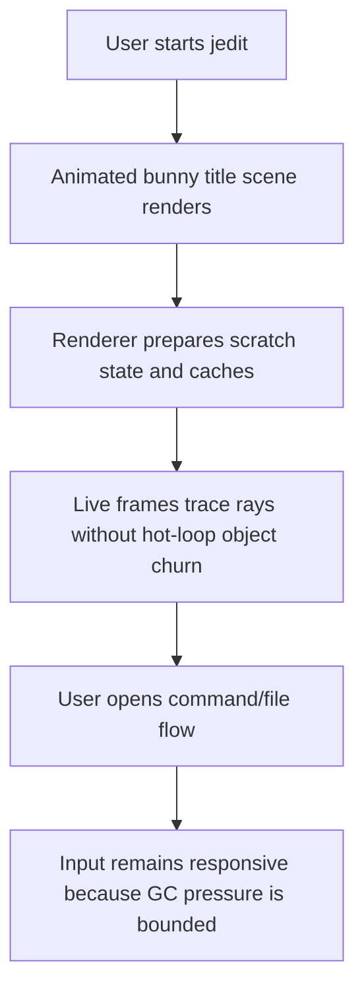
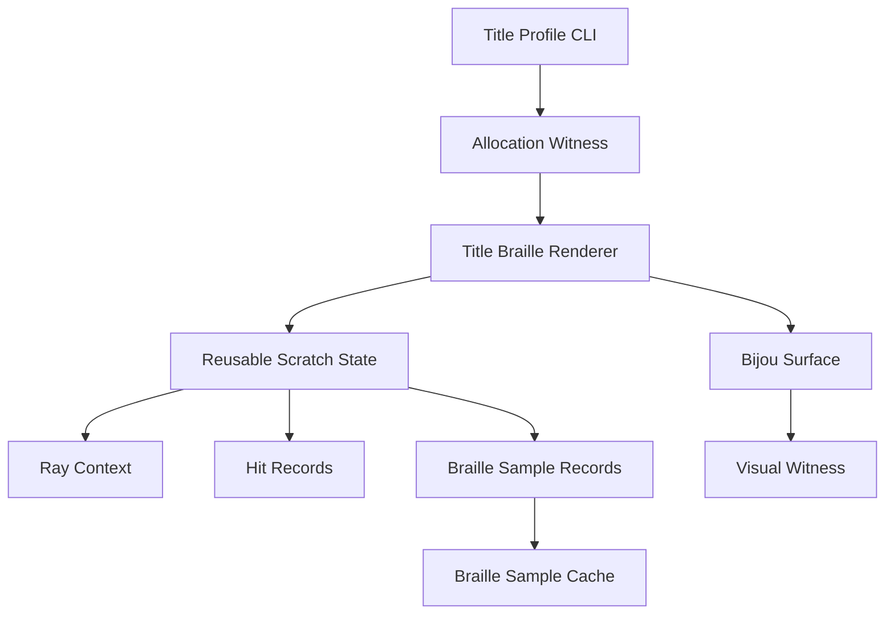

# WF-0104 - Title Zero Allocation Ray Tracing

## Linked Issue

- https://github.com/flyingrobots/jedit/issues/112

## Decision Summary

Jedit should make the live title-screen ray tracer allocate zero ordinary
JavaScript objects in the per-frame ray hot path after warmup.

The existing title performance work reduced how often expensive samples are
traced. This cycle targets a different failure mode: V8 nursery exhaustion from
thousands of short-lived vectors, colors, hit objects, shader parameter objects,
and cell accumulators created inside the render loop.

The target is not merely lower memory use. The target is a renderer contract:
after scratch storage, mesh traversal state, sample cache, and output surfaces
are prepared, tracing a Braille frame should mutate preallocated state rather
than creating new object graphs for each ray.

## Sponsored Human

A jedit user wants the animated bunny title scene to remain smooth and
responsive so that startup feels like a polished terminal application, without
periodic freezes caused by garbage collection.

## Sponsored Agent

An agent needs inspectable allocation and render facts so it can distinguish
between reduced ray-tracing frequency and true hot-loop allocation elimination,
without relying on subjective animation smoothness or one-off heap snapshots.

## Hill

By the end of this cycle, a reviewer can run a title-rendering allocation
witness, see bounded or zero hot-loop allocations after warmup, and verify that
the Braille bunny title scene still renders through the same Bijou surface
contract.

## Current Truth

Jedit already has two performance mitigations:

- `title-scene-performance-governor.ts` can reuse a retained title backdrop on
  slow idle frames.
- `title-braille-sampling.ts` and `BrailleSampleCache` can trace a reduced
  phase set and reuse resolved Braille samples.

Those mitigations reduce work, but they do not prove zero allocation.

The current hot path still allocates ordinary objects:

- `averagingBrailleCanvas` creates a new Bijou `Surface` per rendered frame.
- Each Braille cell calls `collapseBrailleCell` with a newly created options
  object.
- Each cell creates a new accumulator object and modifier array.
- Each traced subpixel calls the shader with a newly created params object.
- The title scene shader constructs a ray context object for each sample.
- Vector helpers such as `add`, `sub`, `scale`, `cross`, `normalize`, and
  color helpers return fresh arrays.
- Hit helpers return fresh hit objects for object, mesh, floor, and wall hits.
- Environment floor and wall tests create point, normal, color, and hit arrays
  on the traced path.

This is consistent with minor GC events firing every few milliseconds with
`allocation failure` while rendering a dense Braille terminal grid.

## Problem

The title renderer currently pays allocation cost proportional to the number of
traced subpixels, not just proportional to terminal dimensions or scene
complexity. At a 191x48 terminal, the Braille surface has 9,168 cells and
73,344 subpixels. Even with adaptive trace budgets, a live frame can allocate
large numbers of temporary arrays and objects.

This creates severe GC pressure:

- V8 new-space fills rapidly.
- Minor GC runs repeatedly during animation.
- Surviving objects occasionally promote and trigger larger collections.
- The UI can stutter even when raw ray math is acceptable.

Sampling and frozen-backdrop reuse are still useful, but they are not a
substitute for making the traced hot path allocation-free.

## Scope

This cycle includes:

- Adding a title allocation witness for Braille ray tracing.
- Introducing reusable scratch state for vectors, colors, ray context, hit
  results, Braille accumulation, and shader sample output.
- Replacing per-sample shader params objects with primitive parameters or a
  mutable params record.
- Replacing array-returning vector and color helpers in the traced title path
  with scalar or scratch-output helpers.
- Replacing hit-object returns in the traced title path with mutable hit records
  or sentinel status values.
- Reusing Braille cell accumulator state inside a frame.
- Preserving existing title render visuals and existing adaptive sampling
  semantics.
- Keeping allocation facts inspectable through tests or profile output.

## Non-Goals

This cycle does not include:

- Removing the title scene, bunny mesh, Braille renderer, or Bijou surface
  output.
- Replacing JavaScript rendering with native code, WASM, WebGL, Canvas, or DOM.
- Changing Echo text authority, WSC storage, file lifecycle, Graft, or editor
  behavior.
- Making the title renderer visually simpler as the primary fix.
- Adding new user-visible settings.
- Continuing the Braille dither mode work.
- Continuing Vim command-line completion work inside this branch.

## User Experience / Product Shape

There is no new visible control. The expected user-visible outcome is smoother
title animation and fewer startup freezes. The title screen should still show
the same bunny scene, lighting, camera motion, and Braille surface style.

The product rule is: performance fixes must not silently change the title
scene's meaning. Any accepted visual delta must be documented as an intentional
rendering change, not hidden behind an allocation optimization.

### User Journey



### Wide UI Mockup

Not applicable. This work changes renderer internals and inspectable
performance facts, not layout or visible controls.

### Narrow UI Mockup

Not applicable. Small-terminal behavior remains owned by the existing
workspace small-terminal notice and title renderer sizing.

### Accessibility Considerations

The title scene is decorative. Allocation and performance facts must be
inspectable through commands, tests, or JSON output rather than encoded only in
visual smoothness.

## Runtime / API Contract

Contract: `TitleRayAllocationPosture`.

Relevant exported or inspectable shapes:

- `TitleRayAllocationPosture`
  - `unmeasured`
  - `allocating`
  - `bounded-after-warmup`
  - `zero-hot-loop`
- `TitleRayAllocationFacts`
  - renderer name
  - terminal width and height
  - render mode
  - warmup frame count
  - measured frame count
  - total allocated bytes or allocation sample count when available
  - posture
- title profiling CLI JSON facts
- focused allocation witness spec

Expected behavior:

- Before measurement support lands, allocation posture is `unmeasured`.
- During migration, traced paths may be `allocating`, but regressions must be
  visible in the witness.
- The first hard gate is `bounded-after-warmup`: no unbounded per-ray object
  growth and no runaway minor-GC pattern under the witness workload.
- The final gate is `zero-hot-loop`: after warmup, traced rays do not allocate
  ordinary JavaScript objects in the renderer's ray path.

## Lower Modes

- If allocation instrumentation is unavailable on the local runtime, the
  witness should report `unmeasured` rather than claim success.
- If a scene uses unsupported geometry, the renderer may fall back to the
  allocating path only when the allocation posture reports that fallback.
- If terminal dimensions change, scratch storage may be resized. Resize
  allocation is allowed outside the hot-loop measurement window.
- If theme, mesh, scene, or render mode changes, scratch identity may reset.
  Rebuild allocation is allowed before the next warmup completes.

## Authority And Boundaries

- Runtime rendering behavior and allocation witnesses outrank design intent.
- Pixel snapshots prove visual stability but not allocation posture.
- Heap snapshots and GC logs are evidence only when tied to a deterministic
  command, dimensions, scene, and frame count.
- Echo does not own title-render scratch state.
- WSC does not persist title-render scratch state.
- The renderer may retain scratch buffers between frames, but those buffers are
  process-local performance state only.

## Technical Plan

### Phase 1: Witness Before Refactor

Add a deterministic allocation witness around a small but representative title
render workload.

The witness should:

- run a warmup frame set;
- run a measured frame set;
- exercise Braille bunny rendering, not only an empty scene;
- fix terminal dimensions, theme, scene seed, render mode, and camera posture;
- record allocation posture as structured facts;
- fail only when the runtime can measure allocations with enough precision.

### Phase 2: Braille Cell Scratch

Remove per-cell allocation in `averaging-braille-canvas.ts`.

Changes:

- Replace per-cell options objects with primitive parameters or a reusable
  frame context.
- Replace per-cell accumulator allocation with one mutable accumulator reused
  for each cell.
- Replace `averageRgb` array allocation with direct cell channel assignment.
- Avoid allocating modifier arrays when no modifier changes are present.

### Phase 3: Shader Params And Sample Output

Remove per-subpixel shader object allocation.

Changes:

- Replace `shader({ u, v, time })` with `shaderSampleAt(u, v, time, out)`.
- Reuse one mutable sample record per traced subpixel.
- Cache sample records in `BrailleSampleCache` only when the record must
  survive across frames; otherwise copy scalar fields into typed storage.
- Consider replacing `BrailleSampleCache.samples` object slots with parallel
  typed arrays for `on`, `fg`, `bg`, `rayCount`, and `intersectionCount`.

### Phase 4: Ray Context Scratch

Remove per-ray vector and context allocation in `title-screen.ts`.

Changes:

- Store origin, target, ray, light direction, spotlight vectors, and temporary
  vectors in a mutable `TitleRayScratch`.
- Compute ray direction with scalar math into scratch arrays.
- Avoid allocating screen coordinate vectors.
- Reuse spotlight context for frames where camera and scene identity are stable.

### Phase 5: Hit Records

Remove per-hit allocation across object, mesh, floor, wall, shadow, reflection,
and refraction checks.

Changes:

- Replace hit-object return values with mutable `out` records plus boolean
  success.
- Store nearest hit state in scratch during traversal.
- Use scalar point/normal fields or fixed scratch arrays.
- Keep public convenience wrappers only outside the hot path.

### Phase 6: Profile Gate

Add the final gate:

- the witness runs warmup frames;
- the measured traced frame loop reports `zero-hot-loop` when instrumentation is
  available;
- title-rendering shard covers the renderer contract;
- `npm run quality` remains green.

## Data Model

```text
TitleRayAllocationFacts = {
  renderer: "title-braille-bunny",
  width: PositiveInteger,
  height: PositiveInteger,
  renderMode: "braille",
  warmupFrames: NonNegativeInteger,
  measuredFrames: PositiveInteger,
  posture:
    | "unmeasured"
    | "allocating"
    | "bounded-after-warmup"
    | "zero-hot-loop",
  allocatedBytes?: NonNegativeInteger,
  allocationEvents?: NonNegativeInteger,
  notes: string[]
}
```

## Relationship Model



## Alternatives Considered

### Keep Adaptive Sampling Only

Pros:

- Already exists.
- Reduces traced sample count under pressure.

Cons:

- Does not eliminate object churn for samples that are traced.
- Can still thrash GC on large terminals, motion frames, cold cache, or high
  pressure scenes.

### Freeze More Frames

Pros:

- Simple.
- Reduces CPU and allocation frequency.

Cons:

- Reduces animation quality and input feel.
- Hides the allocator problem instead of fixing it.

### Rewrite In Native Or WASM

Pros:

- Could move allocation away from V8.

Cons:

- Too large for this cycle.
- Adds portability and build complexity.
- Avoids proving that the current renderer boundary is efficient.

### Zero Allocation JavaScript Hot Path

Pros:

- Keeps the current renderer architecture.
- Directly targets nursery exhaustion.
- Produces measurable facts and keeps visual output inspectable.

Cons:

- Requires careful refactoring.
- Scratch-state code is less casually readable than pure array-return helpers.

Decision: choose zero allocation JavaScript hot path.

## Goalposts

### Goalpost 1: Allocation Witness

Outcome:

The repo can measure or honestly report title-ray allocation posture for a
deterministic Braille bunny workload.

Slices:

- [x] Slice 1: Add title allocation facts contract.
      Commit: `Perf: define title allocation facts`.
- [x] Slice 2: Add allocation witness command or spec.
      Commit: `Perf: witness title allocation posture`.

### Goalpost 2: Braille Cell And Sample Scratch

Outcome:

Braille cell collapse and shader invocation stop allocating ordinary objects in
the per-cell and per-subpixel path.

Slices:

- [ ] Slice 3: Reuse Braille cell accumulator state.
      Commit: `Perf: reuse Braille cell scratch`.
- [ ] Slice 4: Remove per-sample shader params allocation.
      Commit: `Perf: pass shader samples through scratch`.
- [ ] Slice 5: Move sample cache storage toward scalar or typed storage.
      Commit: `Perf: store Braille samples without objects`.

### Goalpost 3: Title Ray Scratch

Outcome:

The title scene ray context uses mutable scratch state instead of fresh vectors,
colors, and context objects per sample.

Slices:

- [ ] Slice 6: Add `TitleRayScratch`.
      Commit: `Perf: add title ray scratch`.
- [ ] Slice 7: Rewrite camera ray direction into scratch.
      Commit: `Perf: reuse title ray vectors`.
- [ ] Slice 8: Rewrite color helpers into scalar or scratch output.
      Commit: `Perf: reuse title color scratch`.

### Goalpost 4: Hit Record Scratch

Outcome:

Object, mesh, floor, wall, reflection, refraction, and shadow hit checks update
scratch hit records instead of returning new hit objects in the traced path.

Slices:

- [ ] Slice 9: Add mutable title hit records.
      Commit: `Perf: add title hit records`.
- [ ] Slice 10: Rewrite primitive hit checks to use hit records.
      Commit: `Perf: reuse primitive hit scratch`.
- [ ] Slice 11: Rewrite environment hit checks to use hit records.
      Commit: `Perf: reuse environment hit scratch`.
- [ ] Slice 12: Rewrite mesh hit traversal to use hit records where practical.
      Commit: `Perf: reuse mesh hit scratch`.
- [ ] Slice 13: Rewrite reflection, refraction, and shadow checks.
      Commit: `Perf: reuse secondary ray scratch`.

### Goalpost 5: Gate And Retrospective

Outcome:

The renderer has a stable allocation gate and the design records measured
results.

Slices:

- [ ] Slice 14: Add final allocation gate to title-rendering validation.
      Commit: `Perf: gate title allocation posture`.
- [ ] Slice 15: Update title performance docs and retrospective.
      Commit: `Docs: record title allocation results`.

## Tests To Write First

- [x] Allocation facts contract rejects impossible dimensions and frame counts.
- [x] Allocation witness reports `unmeasured` when instrumentation is absent.
- [x] Allocation witness records a deterministic title Braille bunny workload.
- [ ] Braille cell rendering keeps existing visual fixture output.
- [ ] Shader scratch path preserves ray stats and sample cache behavior.
- [ ] Ray scratch path preserves camera ray direction facts.
- [ ] Primitive hit scratch preserves sphere, column, cube, and mesh hit facts.
- [ ] Environment hit scratch preserves floor and wall facts.
- [ ] Final gate proves bounded or zero hot-loop allocation after warmup.

## Acceptance Criteria

- [x] The title allocation witness exists and emits structured facts.
- [ ] The Braille ray hot path does not allocate per-cell options objects.
- [ ] The Braille ray hot path does not allocate per-subpixel shader params.
- [ ] Title ray context math uses reusable scratch state.
- [ ] Hit checks use reusable hit records on the traced path.
- [ ] Existing title visual and behavior specs still pass.
- [ ] Allocation posture reaches `zero-hot-loop` when instrumentation is
      available.
- [ ] `npm run quality` passes.

## Validation Plan

Expected validation for implementation PRs:

```text
npm run build
JEDIT_DIST_PREBUILT=1 node --test spec/title-allocation-facts.spec.mjs
JEDIT_DIST_PREBUILT=1 node --test spec/averaging-braille-cache.spec.mjs
JEDIT_DIST_PREBUILT=1 node --test spec/workspace-title-braille-sampling.spec.mjs
JEDIT_DIST_PREBUILT=1 npm run ci:shard -- title-rendering
npm run quality
git diff --check
```

Design-only validation:

```text
npx --yes markdownlint-cli docs/design/0104-title-zero-allocation-ray-tracing.md
git diff --check
```

## Risks

- Scratch-state code can become harder to reason about than pure helper
  returns.
- Allocation instrumentation can be runtime-sensitive.
- Visual output can drift if scalar rewrites change math order or rounding.
- Mesh traversal may need a staged migration because public helpers currently
  return object-shaped hits.
- Typed arrays can reduce object allocation but introduce indexing mistakes.

## Retrospective

To be completed after implementation.
