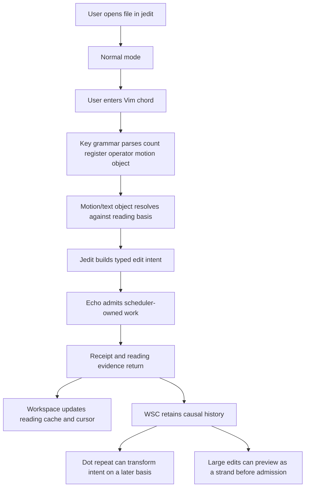
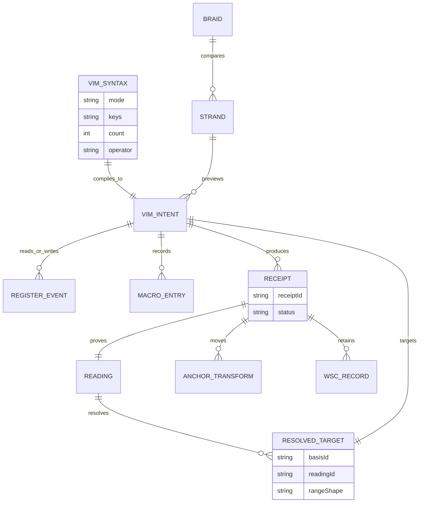

# WF-0105 - Vim Power Moves Causal Parity

## Linked Issue

- TBD - open before implementation starts.

## Decision Summary

Jedit should grow from a Vim-shaped editor into a comprehensive Vim power-move
surface whose operators, motions, text objects, search commands, marks,
registers, macros, repeat, undo, visual selections, and ex commands compile
into explicit jedit edit intents over Echo-backed causal text truth.

The goal is not to clone Vim internals. The goal is behavioral parity where
users expect Vim muscle memory, plus causal movements where jedit can do better:
operator ranges are captured against a reading basis, text objects can be
backed by Graft structure, repeat can transform intent across changing text,
undo can become inverse causal input, search/replace can preview as a strand,
and macros can replay as a receipt-bearing causal script rather than raw key
sleep.

This document also locks the product naming direction: `jim` is the intended
future user-facing command and editor name for the Vim-shaped application,
while `jedit` remains the repository, package, and internal migration name until
the Echo-powered proof and compatibility plan make the rename safe.

## Naming Lock

`jim` is the product name for the modal editor that grows out of `jedit`.

The name works because:

- `jedit` started as "James + edit";
- the modal/Vim-shaped product can be shortened to `jim`;
- `jim` is a good terminal command: `jim .`, `jim README.md`, `jim src/main.ts`;
- `JIM = Jedit Is Modal` is the standing backronym.

Transition policy:

- Do not rename the repository in this arc.
- Do not rename internal jedit contracts, package descriptors, WSC directories,
  or release gates until the powered-by-Echo closeout is complete.
- Add `jim` first as a user-facing binary/command alias when implementation
  starts.
- Keep `jedit` as a compatibility command during migration.
- Documentation may say "jim, formerly jedit" only after the alias exists.
- Echo must not learn either name as product semantics; Echo still sees generic
  package, operation, receipt, retention, and WSC facts.

## Sponsored Human

A developer wants Vim's composable power moves in jedit so that text editing
feels precise, fast, and expressive, without falling back to a weak subset that
breaks muscle memory the moment the user reaches for `ci"`, `gqap`, `:g`,
macros, registers, marks, or dot repeat.

## Sponsored Agent

An agent needs stable command, operator, motion, range, text-object, register,
macro, strand, and replay facts so it can exercise Vim workflows through the
same production authority path as the TUI, without scraping terminal pixels or
guessing whether a key sequence became a causal edit.

## Hill

By the end of this roadmap, a user can perform common and advanced Vim editing
workflows in jedit, including operator-motion commands, text objects, visual
mode edits, search/replace, registers, macros, repeat, undo/redo, marks, jumps,
and ex commands, and the repo proves those workflows with deterministic
usability witnesses that report Echo-backed receipts, reading bases, transformed
ranges, causal anchors, and WSC history evidence.

## Current Truth

Jedit currently has a meaningful but incomplete Vim layer:

- Normal and Insert modes exist.
- Basic motions exist, including line, character, and word-shaped movement.
- Pending operators exist for delete, change, yank, and goto flows.
- Some line and word operator combinations exist, including `dd`, `cw`, and
  related focused behavior.
- Vim command-line mode exists for `:edit`, `:write`, `:quit`, and `:wq`.
- Inline command/file completion exists and is backed by provider-neutral
  completion items.
- Unknown command feedback exists for the command line.
- Production text changes route through the Echo-backed production text
  session rather than local mutable line truth.
- WSC history listing, current export, historical export, and replay closeout
  exist as agent-facing JSON surfaces.

Important current caveats:

- Vim parity is not complete.
- Motions are mostly imperative UI cursor operations, not a first-class motion
  algebra.
- Operator ranges are not yet a complete compiled intent model.
- Text objects are not comprehensive.
- Visual mode and blockwise edits are not production-complete.
- Registers, macros, repeat, marks, jumps, folds, quickfix/location lists, and
  most ex commands are not parity-complete.
- Undo/redo is only honest when modeled as explicit causal input; hidden local
  snapshot rollback cannot be production text authority.
- Graft-backed structural text objects and causal-history previews are design
  direction, not complete runtime truth.

Relevant existing design anchors:

- [0102 Vim Command-Line Completion Surface](0102-vim-command-line-completion-surface.md)
- [Text Edit Algebra](text-edit-algebra.md)
- [Why Echo](why-echo.md)
- [Causal Event Model](causal-event-model.md)
- [0106 Emacs Ideas To Steal Causally](0106-emacs-ideas-to-steal-causally.md)
- [Technical Teardown: The Vim Editor Layer](../technical-teardown.md#12-the-vim-editor-layer)

Slice 2 adds the first machine-readable inventory:

- [0105 Vim Power Moves Parity Matrix](0105-vim-power-moves-parity-matrix.json)

That matrix is current-state truth for the power-move surface. It names what is
supported, partial, unsupported, or intentionally causally enhanced, and it
records the proof gaps that later slices must close.

Slice 3 adds the target workflow fixture set:

- [0105 Vim Power Target Usability Fixtures](0105-vim-power-target-usability-fixtures.json)

Those fixtures keep human workflow descriptions separate from future executable
witness inputs. Each workflow references parity matrix row ids so target tests
stay connected to the inventory.

## Problem

Vim's power comes from composition:

```text
operator + motion
operator + text object
count + operator + motion
selection + operator
ex range + command
macro + repeat
search result set + command
```

Jedit currently has pieces of this model, but not the full language. If jedit
keeps adding one-off commands, it will miss the thing that makes Vim feel
powerful: users can express editing intent in a compact grammar, and the editor
can apply that grammar consistently across text, structure, ranges, registers,
search results, and history.

Echo raises the bar further. In jedit, a Vim command should not merely mutate a
local string. A command should compile into an auditable causal operation:

- what command was expressed;
- what basis it was interpreted against;
- what motion or text object resolved to;
- what range or set of ranges was touched;
- what receipt was produced;
- what reading proves the resulting text;
- what history can replay or explain it.

Without that contract, jedit will feel like a terminal editor skin over ad hoc
state, not a causal editor.

## Scope

This roadmap includes:

- A Vim key grammar and parser for Normal, Operator-pending, Visual, Select,
  Insert, Replace, and Command-line contexts.
- Counts, registers, motions, text objects, operators, modifiers, and command
  prefixes as typed syntax.
- A motion algebra that resolves cursor moves and operator ranges against a
  specific reading basis.
- Comprehensive text-object coverage for words, WORDs, sentences, paragraphs,
  quotes, brackets, braces, tags, comments, functions, classes, blocks,
  indentation, and Graft-backed structural objects.
- Operator parity for delete, change, yank, put, replace, indent, outdent,
  format, case transform, join, filter, sort, substitute, and external command
  hooks where appropriate.
- Visual charwise, linewise, and blockwise selections.
- Registers, yank/delete history, black-hole register, system clipboard seam,
  numbered registers, expression register posture, and causal register
  provenance.
- Dot repeat as transformed intent replay, not byte-for-byte key replay.
- Macros as causal scripts over parsed editor intents.
- Marks, jump list, change list, search history, command history, and recorded
  navigation receipts.
- Search, substitute, global, vglobal, arglist-like, quickfix-like, and
  location-list-like workflows.
- Causal enhancements: strand preview, braid comparison, partial admission,
  causal undo, transformed repeat, anchor-based marks, and history-aware
  command previews.
- Agent-facing JSON witnesses for common workflows and power moves.
- A parity matrix that can become a release gate.

## Non-Goals

This roadmap does not include:

- Reimplementing Vim's source code or compatibility bugs.
- Supporting Vimscript as a first-class extension language in this cycle.
- Claiming compatibility with every plugin ecosystem behavior.
- Making Echo understand Vim, text, operators, motions, buffers, or editor
  nouns.
- Making Graft the source of editable truth.
- Giving app code Echo tick, drain, scheduler, or lifecycle authority.
- Replacing filesystem or Git interop with Echo-only behavior in this cycle.
- Building a full collaborative network protocol before local causal parity is
  proven.

## User Experience / Product Shape

The user should be able to use jedit like a powerful Vim-shaped editor:

- `daw`, `ci"`, `gqap`, `>ip`, `yG`, `gg=G`, `:%s/foo/bar/g`
- `qa...q`, `@a`, `@@`
- `.` to repeat the last meaningful edit intent
- marks and jumps with `ma`, `` `a ``, `''`, `ctrl-o`, `ctrl-i`
- search and substitute with `/`, `?`, `n`, `N`, `:s`, `:g`, `:v`
- visual char, line, and block selection with `v`, `V`, `ctrl-v`
- registers with `"ay`, `"ap`, `"_d`, `"+y`
- text objects with `iw`, `aw`, `i(`, `a{`, `it`, `af`, `ic`

Jedit should communicate causal state without making the user read a debug log.
The primary editor remains quiet. Causal facts appear in focused places:

- a footer posture when a command is pending or obstructed;
- a command preview when an ex operation spans many edits;
- an optional history drawer or preview for causal strands and braids;
- JSON witnesses and history export for agents.

### User Journey



### Wide UI Mockup

```text
+----------------------------------------------------------------------------+
| src/app/example.ts                                                          |
|                                                                            |
|   describe("alpha", () => {                                                 |
|     it("moves fast", () => {                                                |
|       expect(run()).toEqual("old")                                          |
|     })                                                                     |
|   })                                                                       |
|                                                                            |
| NORMAL  ci"  object=inside-quote  basis=reading:41  range=82..85           |
| receipt=pending  [Enter accepts preview strand] [Esc cancels]              |
+----------------------------------------------------------------------------+
```

The footer is compact. It names the parsed operation and causal basis only when
that helps explain state. For ordinary single-buffer edits, the command should
feel instantaneous and not require a preview.

### Narrow UI Mockup

```text
+--------------------------------------+
| expect(run()).toEqual("old")         |
|                                      |
| NORMAL ci" range=82..85 pending      |
+--------------------------------------+
```

Narrow terminals suppress optional causal detail first. The editor must keep
the command state, error posture, and user path readable before showing
diagnostic evidence.

### Accessibility Considerations

Every pending command and completed operation must have a model fact summary:

- current mode;
- pending operator;
- count;
- register;
- motion or text object;
- resolved range;
- operation status;
- receipt id when applicable;
- reading id when applicable;
- obstruction reason when applicable.

No power move should require visual-only discovery. Agent and screen-reader
adjacent tooling should be able to ask "what is pending?" and "what happened?"
without reading pixels.

## Runtime / API Contract

Contract: `VimPowerMoveIntent`.

The runtime should distinguish syntax, resolution, and execution:

```text
Raw key input
  -> VimChordSyntax
    -> VimCommandIntent
      -> ResolvedEditTarget
        -> Echo-backed production text command
          -> Receipt + reading + WSC history
```

Core public shapes:

```text
VimChordSyntax = {
  mode,
  count?,
  register?,
  operator?,
  motion?,
  textObject?,
  commandLine?,
  visualSelection?,
  repeatPolicy
}

VimResolvedTarget = {
  basisId,
  readingId,
  cursorBefore,
  cursorAfter?,
  range?,
  ranges?,
  linewise,
  blockwise,
  inclusivity,
  affinity,
  textObjectId?,
  structuralProviderId?
}

VimPowerMoveIntent = {
  commandId,
  syntax,
  target,
  editKind,
  registerWrite?,
  registerRead?,
  repeatIdentity?,
  macroIdentity?,
  causalPreview?
}

VimPowerMoveResult = {
  status: "applied" | "previewed" | "obstructed" | "unsupported",
  receiptId?,
  readingId?,
  basisId?,
  exportEvidenceId?,
  obstruction?,
  repeatIdentity?,
  registerEvidence?,
  strandId?,
  braidId?
}
```

### Register And Transaction Doctrine

Classic Vim registers are user-addressable editing state, not the undo stack.
They are closer to named clipboards plus macro storage than to Git refs. Jim
still needs registers because Vim workflows depend on explicit register
selection:

- `"` chooses a register for the next operator.
- `y`, `d`, and `c` write deleted or yanked material into registers.
- `p` and `P` read register material back into the buffer.
- `_` discards without overwriting the unnamed register.
- `+` and `*` bridge optional host clipboard state.
- `q{register}` records macros into register-like storage.
- `@{register}` replays macro material by name.

Echo's retained evidence and causal history can back register provenance, but
they do not replace registers as a user-facing Vim language feature. The product
contract is:

```text
RegisterState = app-owned causal projection over Echo-backed text evidence
```

Register entries should carry:

- register name;
- source basis;
- source range or range set;
- material digest;
- optional retained material reference;
- linewise, charwise, or blockwise shape;
- producing command id;
- producing receipt id when the source came from an admitted mutation.

Commands that read editor state to choose a mutation target must be
transactional. `di"` is the canonical example:

```text
Raw keys: d i "
Parse: delete + innerQuote
Read: locate quote pair on basis A
Resolve: range inside that pair on basis A
Write: delete range and update registers
```

The forbidden implementation is:

```text
read basis A -> resolve byte range -> later write that range on basis B
```

The required implementation is one of:

```text
resolve and apply inside one atomic transaction optic
resolve on basis A and submit a basis-bound intent that obstructs if stale
resolve on basis A and intentionally transform/re-resolve onto basis B
```

For first implementation, a basis-bound compiled `replaceRange` intent is
acceptable only if stale basis produces a typed obstruction and no register,
repeat, jump, or text mutation state is half-applied. The target architecture is
an Echo `TransactionOptic`-shaped operation:

```text
VimSemanticIntent
  -> atomic evaluation over one basis
  -> resolve motion/text object
  -> update app-owned register/repeat/jump facts
  -> admit text mutation if needed
  -> one receipt or obstruction bundle
```

Macro replay should not be assumed atomic in the classic Vim sense. Jim can do
better by treating macro replay as a causal script made of semantic entries.
The default macro posture should be:

- record parsed commands where known;
- record bounded raw insert spans only when necessary;
- replay entries through the same production command path;
- stop at first obstruction;
- emit a macro replay report with applied count, receipt ids, and obstructed
  entry;
- group replay as one user-facing edit group when safe, without hiding
  per-command receipts.

Full all-or-nothing macro transactions are powerful, but they should follow the
operator/text-object transaction gate. They are a later hardening target, not a
shortcut around atomic operator semantics.

### Grammar Boundary

The key grammar owns:

- mode-specific key interpretation;
- counts and numeric prefixes;
- register prefixes;
- operator-pending state;
- text object prefixes;
- command-line dispatch;
- macro record/replay syntax;
- dot repeat identity.

The grammar does not own:

- text storage;
- Echo admission;
- Graft structural reads;
- filesystem save/export;
- rendering;
- trusted lifecycle control.

### Motion Algebra

Motions should be pure range resolvers over a reading:

```text
resolveMotion(reading, cursor, motion, count) -> ResolvedMotion
```

Examples:

| Motion | Meaning | Causal note |
| --- | --- | --- |
| `h` `j` `k` `l` | character/line moves | UI cursor only unless paired with operator |
| `w` `b` `e` | word motions | range uses reading basis |
| `W` `B` `E` | WORD motions | same resolver, different tokenization |
| `0` `^` `$` | line boundary moves | preserves byte/grapheme distinction |
| `gg` `G` | file boundary moves | uses bounded/full reading posture |
| `%` | matching delimiter | can use parser/Graft provider when available |
| `/` `?` | search motion | search result carries basis and match id |
| `}` `{` | paragraph motion | resolver owns blank-line policy |
| `]]` `[[` | section motion | Graft-backed when structural data exists |

### Text Object Algebra

Text objects should be resolvers over text and optional structure:

```text
resolveTextObject(reading, cursor, object, count) -> ResolvedObject
```

Required parity set:

| Object | Required parity | Causal opportunity |
| --- | --- | --- |
| `iw` `aw` | word inner/around | token range evidence |
| `iW` `aW` | WORD inner/around | tokenization policy evidence |
| `is` `as` | sentence | sentence boundary witness |
| `ip` `ap` | paragraph | paragraph range witness |
| `i"` `a"` | quotes | delimiter-pair evidence |
| `i'` `a'` | single quotes | delimiter-pair evidence |
| backtick quote objects | backticks inner/around | delimiter-pair evidence |
| `i(` `a(` | parentheses | balanced pair provider |
| `i[` `a[` | brackets | balanced pair provider |
| `i{` `a{` | braces | balanced pair provider |
| `it` `at` | tags | Graft/tree provider where available |
| `if` `af` | function | Graft structural object |
| `ic` `ac` | class | Graft structural object |
| `i/` `a/` | comment | source-language provider |
| indentation block | indentation scope | fallback structural object |

Jedit extension objects can exist, but they should not steal Vim meanings.
Examples: causal strand object, last receipt object, changed range object, and
diagnostic object.

### Operator Parity

Operators should compile over resolved targets:

| Operator | Vim parity target | Echo-backed behavior |
| --- | --- | --- |
| `d` | delete | replace target with empty fragment |
| `c` | change | delete then enter Insert with causal edit group |
| `y` | yank | write register without mutating text authority |
| `p` `P` | put | insert register material as new fragment |
| `r` | replace character | replace grapheme/byte-safe target |
| `R` | replace mode | stream replacement intents |
| `>` `<` | indent/outdent | linewise transform intent |
| `=` | reindent | formatter/provider-backed transform |
| `gq` | format | format range or obstruct honestly |
| `gu` `gU` `g~` | case transforms | deterministic text transform intent |
| `J` `gJ` | join lines | line join transform intent |
| `!` | filter through external command | explicit host boundary and obstruction |
| `:` range command | ex command over range set | batch intent or preview strand |

### Repeat, Macros, And Causality

Dot repeat should replay semantic intent against the current basis:

```text
last edit: ci" -> replace inside quote at basis A
current text: another quote at basis B
dot repeat: resolve inside quote at cursor on basis B, then apply same insert
```

That is different from replaying raw keys blindly. Raw key replay can remain an
implementation detail for simple cases, but the product contract should be
semantic repeat where possible.

Macros should record parsed intents and fallback key events:

- semantic entries for known Vim commands;
- raw key entries only for unsupported or insert text spans;
- basis-sensitive replay posture;
- obstruction when replay cannot safely transform.

Macro replay should emit a causal script report:

```text
macroId
entries
appliedCount
obstructedEntry?
receiptIds
finalReadingId
```

### Undo And Redo

Undo is not time travel. In production, undo should be an explicit inverse
causal input:

```text
u -> derive inverse intent from last applied edit group -> submit inverse
ctrl-r -> derive redo intent from inverse history -> submit explicit redo
```

This preserves history:

- original edit remains in WSC;
- undo receipt exists;
- redo receipt exists;
- replay can explain all three.

### Search, Substitute, Global

Search and replace are where Vim parity and causality can flex hardest.

Required parity:

- `/pattern`, `?pattern`, `n`, `N`
- `*`, `#`, `g*`, `g#`
- `:s/pat/repl/flags`
- `:%s/pat/repl/flags`
- `:g/pat/cmd`
- `:v/pat/cmd`
- confirmation flow for `c` flag

Causal extension:

- `:%s` can preview as a strand before admission.
- `:g` can emit a range set with stable match ids.
- confirmation can admit selected replacements as strand slices.
- failed replacements remain typed obstructions, not partial silent edits.

### Registers

Registers should be app-owned state with provenance:

| Register | Required posture |
| --- | --- |
| unnamed | latest yank/delete material |
| numbered | delete/yank rotation |
| named `a-z` | user-selected material |
| append `A-Z` | append to named register |
| black-hole `_` | discard without changing unnamed |
| system `+` `*` | host clipboard adapter, optional |
| expression `=` | unsupported until expression evaluator exists |
| small delete `-` | line/char policy documented |

Register material should carry:

- source basis;
- source range;
- linewise/charwise/blockwise posture;
- content digest;
- optional receipt id.

### Marks, Jumps, And Anchors

Marks should be modeled as causal anchors, not fixed row/column guesses.

Required parity:

- `m{a-zA-Z}` set mark;
- `` `{mark}`` exact jump;
- `'{mark}` line jump;
- `''` previous jump;
- `ctrl-o` and `ctrl-i` jump list traversal;
- change list traversal where feasible.

Causal extension:

- marks transform through edit receipts using anchor bias;
- stale marks report obstruction or degraded posture;
- agent JSON can explain why a mark moved.

### Visual And Block Mode

Required parity:

- `v` charwise visual;
- `V` linewise visual;
- `ctrl-v` blockwise visual;
- operator over visual selection;
- `o` to swap selection anchor;
- block insert/append where feasible.

Causal extension:

- visual selection is an explicit range aperture over a reading basis;
- block selection materializes as a range set;
- block edits emit one grouped causal intent with per-line receipts or one
  receipt carrying a range-set result, depending on Echo contract support.

## Lower Modes

- If Graft is unavailable, structural objects return typed unavailable posture
  and text-only objects still work.
- If full-file reading is unavailable, commands requiring full-buffer scope
  report bounded-reading obstruction or request an expanded aperture.
- If system clipboard is unavailable, `+` and `*` registers report host
  clipboard obstruction.
- If a macro replay becomes unsafe after text drift, replay stops at the first
  obstructed entry and reports the divergent coordinate.
- If color is unavailable, command and obstruction states still appear as text
  facts in the footer and JSON witnesses.
- If the terminal is too narrow, optional causal detail collapses before the
  command line or pending operator becomes unreadable.

## Data / State Model

| Category | Description |
| --- | --- |
| Source of truth | Echo-backed text worldline and WSC-retained causal history. |
| Derived state | Cursor, viewport, selections, pending grammar state, completion preview, local render cache. |
| App-owned mutable state | Registers, marks, jump list, command history, search history, macro definitions, repeat identity. |
| Invalid states | Applied text mutation without Echo receipt, hidden local undo in production, macro replay claiming success after obstruction. |
| Reset behavior | Pending grammar clears on Escape, mode change, pane focus transfer, or obstruction acknowledgement. |
| Serialization | WSC for causal text history; app-owned session/history storage for registers, marks, macros, and command history where appropriate. |
| Deterministic assumptions | Motions and text objects resolve against explicit reading basis and documented tokenization/structure providers. |



## Accessibility Posture

| Concern | Posture |
| --- | --- |
| Semantic labels or facts | Pending and completed Vim commands expose mode, operator, motion, target, and status facts. |
| Focus order or ownership | Vim key grammar runs only when no modal/drawer/command field owns input. |
| Hidden or visual-only information | Range, receipt, register, macro, and obstruction facts are model-visible. |
| Keyboard behavior | All workflows are keyboard-first; mouse is optional and cannot be required for parity. |
| Secret or redaction behavior | Registers and macros may contain sensitive text; JSON witnesses should support redacted content digests where needed. |

## Localization / Directionality Posture

| Concern | Posture |
| --- | --- |
| User-visible strings | Error, obstruction, preview, and help text must use catalog keys. |
| Catalog keys | New keys for pending command summaries, obstruction messages, and causal preview labels. |
| Supported locales updated | English first; other locales may fall back until catalog updates land. |
| Directionality assumptions | Vim key syntax remains left-to-right command text; surrounding labels must render through normal Bijou directionality. |
| Validation command | i18n/catalog checks plus focused footer/help rendering specs. |

## Agent Inspectability / Explainability Posture

Agents should be able to run witnesses such as:

```bash
node scripts/jedit-vim-power-witness.mjs --json --workflow open-edit-save
node scripts/jedit-vim-power-witness.mjs --json --workflow text-objects
node scripts/jedit-vim-power-witness.mjs --json --workflow search-substitute
node scripts/jedit-vim-power-witness.mjs --json --workflow macro-repeat
node scripts/jedit-vim-power-witness.mjs --json --workflow causal-strand-preview
```

The JSON report should include:

- workflow id;
- input key sequence;
- parsed syntax sequence;
- resolved target facts;
- register and macro facts;
- receipt ids;
- reading ids;
- WSC basis ids;
- obstruction facts;
- final materialized text digest;
- optional redacted before/after snippets.

This witness can later be wrapped by MCP tools, but the JSON command should be
the first source of truth.

## Linked Invariants

- Runtime behavior and saved output outrank design prose.
- Echo remains generic and owns admission, scheduling, receipts, retained
  evidence, and replay posture.
- Jedit owns Vim grammar, editor nouns, text objects, registers, macros,
  viewports, selections, and user-facing command policy.
- Graft provides structural readings, not editable text authority.
- Files and previews are projections.
- Undo, redo, retry, repeat, macro replay, and strand admission are explicit
  causal input, not hidden state mutation.
- Tests and witnesses prove implementation; this design only defines intent.

## Design Alternatives Considered

### Option A: Implement Vim Commands One By One

Pros:

- Fast for a few common commands.
- Easy to test locally.
- Fits current command table style.

Cons:

- Does not scale to comprehensive parity.
- Repeats range resolution logic.
- Makes dot repeat, macros, and text objects inconsistent.
- Hides causal basis and range semantics inside handlers.

### Option B: Embed A Vim Engine

Pros:

- Potentially high parity quickly.
- Existing Vim edge cases already modeled.

Cons:

- Hard to align with Echo-backed causal authority.
- Likely owns mutable buffer truth internally.
- Hard to expose jedit-specific causal facts.
- Hard to keep Graft/Echo boundaries clean.

### Option C: Build A jedit Vim Algebra

Pros:

- Preserves Vim's compositional language.
- Makes operator/motion/text-object resolution testable.
- Compiles naturally into Echo-backed production text commands.
- Gives agents typed facts.
- Creates room for causal improvements.

Cons:

- More upfront design and testing.
- Requires deliberate compatibility decisions.
- Will uncover edge cases Vim users expect immediately.

Decision: choose Option C.

## Implementation Slices

This arc intentionally uses 30 slices. The original shape was 15 broad slices;
doubling it keeps each implementation step reviewable, gives every risky Vim
feature a focused RED test, and leaves room for causal proof rather than
shipping a shallow compatibility checklist.

### Slice 1: Jim Naming And Command Alias Design Lock

- Preserve `jedit` as the repo/package/internal name.
- Define `jim` as the future user-facing binary and editor name.
- Add migration acceptance criteria for command aliases and docs.

### Slice 2: Parity Inventory Matrix

- Build a machine-readable parity matrix for motions, operators, text objects,
  visual modes, registers, marks, macros, repeat, search, and ex commands.
- Mark each item as supported, partial, unsupported, or causally enhanced.
- Gate the matrix with a focused schema and coverage spec.

### Slice 3: Target Usability Witness Fixtures

- Add representative user workflows as target usability tests.
- Separate human workflow descriptions from executable witness fixtures.
- Include open/edit/save, text-object surgery, search/substitute, macro/repeat,
  marks/jumps, and causal strand preview.
- Gate each workflow against the parity matrix row ids it exercises.

### Slice 4: Transactional Register Doctrine And Token Model

- Define tokens for counts, registers, operators, motions, text objects, mode
  switches, visual prefixes, command-line invocations, and macro controls.
- Define register state as a jedit-owned causal projection backed by Echo
  evidence.
- Define read-resolve-write commands such as `di"` as transaction-optic
  candidates, with basis-bound obstruction as the minimum safe implementation.
- Define macro replay as a causal script with edit-group posture, not as a
  hidden all-or-nothing text mutation.
- Keep tokens independent from runtime execution.
- Add syntax fixture snapshots.

### Slice 5: Vim Grammar Parser

- Parse counts, registers, operators, motions, text objects, and mode-specific
  key sequences into `VimChordSyntax`.
- Keep raw key handling behind the grammar boundary.
- Add syntax-only tests.

### Slice 6: Normal/Operator-Pending State Machine

- Make Normal and Operator-pending command accumulation explicit.
- Preserve Escape, focus transfer, drawer, modal, and command-line ownership
  rules.
- Prove incomplete chords never mutate production text.

### Slice 7: Reading-Basis Motion Resolver

- Implement pure motion resolution over a reading basis.
- Return `ResolvedMotion` with basis, cursor before/after, range shape, and
  obstruction posture.
- Return typed obstruction when the reading is too narrow.

### Slice 8: Core Motion Parity

- Cover `h`, `j`, `k`, `l`, `0`, `^`, `$`, `gg`, `G`, `w`, `b`, `e`, `W`,
  `B`, and `E`.
- Preserve byte/grapheme policy in target facts.
- Prove UI-only movement does not mutate Echo history.

### Slice 9: Search And Structural Motion Parity

- Cover `/`, `?`, `n`, `N`, `%`, `{`, `}`, `[[`, `]]`, and related motions.
- Use Graft-backed structural providers where available.
- Return honest unavailable posture when providers are absent.

### Slice 10: Text Object Resolver Spine

- Implement text objects for words, quotes, brackets, braces, paragraphs, and
  indentation.
- Prove fallback and unavailable postures.

### Slice 11: Core Text Object Parity

- Cover `iw`, `aw`, `iW`, `aW`, `is`, `as`, `ip`, `ap`, quotes, brackets,
  braces, parentheses, and backticks.
- Add nesting and delimiter fixture tables.
- Preserve inner/around inclusivity facts.

### Slice 12: Graft-Backed Structural Text Objects

- Add provider seam for functions, classes, tags, comments, and indentation
  scopes.
- Keep Graft as structural reader, not text authority.
- Prove provider-unavailable lower mode.

### Slice 13: Operator Compiler Spine

- Compile operator plus resolved target into production text session commands.
- Keep operator compilation separate from key parsing and target resolution.
- Preserve register write/read evidence.

### Slice 14: Delete, Change, Yank, Put

- Cover `d`, `c`, `y`, `p`, and `P` over motions and text objects.
- Route text mutations through `TextBufferSessionPort`.
- Prove yank/register writes do not mutate text authority.

### Slice 15: Replace, Join, Indent, Case, Format

- Cover `r`, `R`, `J`, `gJ`, `>`, `<`, `=`, `gu`, `gU`, `g~`, `gq`, and
  formatter obstruction posture.
- Preserve linewise/charwise target semantics.
- Add operator-result witness rows.

### Slice 16: Visual Selection State

- Model visual selections as range apertures.
- Add charwise, linewise, and blockwise target resolution.
- Preserve `o` anchor swapping and mode exits.

### Slice 17: Visual Operators

- Compile visual charwise, linewise, and blockwise selections through the same
  operator compiler.
- Cover block insert/append lower mode.
- Prove range-set facts for block operations.

### Slice 18: Register State Model

- Add app-owned register state with source basis, range, shape, content digest,
  and receipt provenance.
- Cover unnamed, numbered, named, append, black-hole, small-delete, and optional
  system registers.
- Support redacted agent facts.

### Slice 19: Register Operations And Clipboard Boundary

- Wire register prefixes into operators and put commands.
- Add optional host clipboard adapter for `+` and `*`.
- Return typed obstruction when clipboard is unavailable.

### Slice 20: Dot Repeat Identity

- Capture semantic repeat identity from applied operations.
- Exclude diagnostic prose, wall-clock timing, and raw key delay from repeat
  identity.
- Add first replay fixture rows.

### Slice 21: Dot Repeat Transformed Replay

- Replay semantic intent against the current reading basis.
- Transform object/motion targets rather than replaying raw keys blindly.
- Report typed obstruction when repeat cannot be safely transformed.

### Slice 22: Macro Recording Model

- Record macro entries as parsed intents plus fallback raw spans.
- Track register target, recording status, entry summaries, and redacted text.
- Keep Insert text spans bounded and explicit.

### Slice 23: Macro Replay And Obstruction

- Replay macros through the production command path.
- Stop and report at first obstruction.
- Emit causal script facts: macro id, entries, applied count, receipt ids, and
  final reading id.

### Slice 24: Marks As Causal Anchors

- Model marks as transformable anchors.
- Cover local marks, exact jumps, line jumps, and degraded stale mark posture.
- Prove marks transform through edit receipts.

### Slice 25: Jump List And Change List

- Add jump list and change list posture.
- Cover `''`, exact-mark jumps, line-mark jumps, `ctrl-o`, `ctrl-i`, and
  change-list traversal where feasible.
- Emit navigation receipt facts without mutating Echo text history.

### Slice 26: Search History And Match Identity

- Cover `/`, `?`, `n`, `N`, `*`, `#`, `g*`, and `g#`.
- Record search history, match ids, basis ids, and obstruction posture.
- Keep search movement separate from text mutation.

### Slice 27: Substitute And Confirmation

- Cover `:s`, `:%s`, flags, replacement escaping, and confirmation flow.
- Emit range-set facts and admitted replacement rows.
- Cover typed obstruction for partial or invalid substitutions.

### Slice 28: Global, Vglobal, And Range Commands

- Cover `:g`, `:v`, ex ranges, and command execution over match sets.
- Add typed obstruction for unsupported nested commands.
- Preserve deterministic range ordering.

### Slice 29: Causal Strand And Braid Preview

- Add preview posture for broad edits and suggestion-like transformations.
- Compare alternatives as braid facts.
- Admit selected strand slices into the target worldline.

### Slice 30: Agent/MCP Witness And Parity Release Gate

- Add JSON witness command for power workflows.
- Wrap stable commands in MCP only after CLI witnesses are green.
- Guard against trusted lifecycle/tick authority exposure.
- Compose focused specs and witnesses into a Vim power-move gate.
- Keep it separate from the Echo release gate until stable.
- Update help, technical teardown, lower modes, and i18n posture.
- Add final Code Lawyer review before declaring parity.

## Tests To Write First

- Parser tests for counts, registers, operators, motions, text objects, visual
  mode, macros, and dot repeat.
- Motion resolver table tests over fixed text fixtures.
- Text object resolver table tests over punctuation, quotes, nesting, comments,
  indentation, and structural fixtures.
- Production command tests proving mutating commands route through
  `TextBufferSessionPort`.
- Register provenance tests.
- Dot repeat transform tests.
- Macro replay obstruction tests.
- Mark/anchor transform tests.
- Search/substitute/global range-set tests.
- Strand preview/admission tests.
- Agent JSON witness tests.
- Static guard that no Vim implementation imports trusted Echo lifecycle
  authority.

## Acceptance Criteria

- Common Vim power workflows from this doc have deterministic usability
  witnesses.
- Operator/motion/text-object commands compile through typed jedit intents.
- Mutating commands use the Echo-backed production text session.
- Non-mutating cursor movement does not mutate Echo causal history.
- Registers, marks, macros, repeat, and search histories expose app-safe facts.
- Dot repeat and macro replay report transformed intent or typed obstruction.
- Broad search/substitute workflows can preview as a causal strand when
  configured.
- Undo/redo are explicit causal inputs or honestly unsupported.
- Graft-backed structural objects are optional and never become text authority.
- Agent JSON witnesses can verify behavior without scraping terminal pixels.
- Echo contains no Vim, text, editor, buffer, cursor, register, macro, or file
  nouns.

## Validation Plan

Local validation for implementation branches:

```bash
npm run build
node --test --test-concurrency=1 spec/vim-power-grammar.spec.mjs
node --test --test-concurrency=1 spec/vim-power-chord-syntax.spec.mjs
node --test --test-concurrency=1 spec/vim-normal-state-machine.spec.mjs
node --test --test-concurrency=1 spec/vim-power-motion-resolver.spec.mjs
node --test --test-concurrency=1 spec/vim-power-text-objects.spec.mjs
node --test --test-concurrency=1 spec/vim-power-operators.spec.mjs
node --test --test-concurrency=1 spec/vim-power-registers.spec.mjs
node --test --test-concurrency=1 spec/vim-power-repeat-macro.spec.mjs
node --test --test-concurrency=1 spec/vim-power-search-substitute.spec.mjs
node --test --test-concurrency=1 spec/vim-power-parity-matrix.spec.mjs
node --test --test-concurrency=1 spec/vim-power-target-usability-fixtures.spec.mjs
node scripts/jedit-vim-power-witness.mjs --json --workflow open-edit-save
npm run --silent quality
```

Release validation:

```bash
npm run --silent release-gate:jedit-echo
npm run --silent release-gate:vim-power
```

The second command does not exist yet. It is the intended parity gate once the
witnesses are real.

## Playback / Witness

Current machine-readable planning witness:

- [0105 Vim Power Moves Parity Matrix](0105-vim-power-moves-parity-matrix.json)
- `spec/vim-power-parity-matrix.spec.mjs`
- [0105 Vim Power Target Usability Fixtures](0105-vim-power-target-usability-fixtures.json)
- `spec/vim-power-target-usability-fixtures.spec.mjs`

Target usability witnesses:

### Workflow 1: Open, Edit, Save, Reopen

1. `cd /tmp/workspace`
2. Run `jedit`.
3. Press `:edit main.ts`.
4. Use Normal motions.
5. Press `i`, type ASCII punctuation and numbers.
6. Escape to Normal.
7. Run `:wq`.
8. `cat main.ts` includes the edits.

### Workflow 2: Text Object Surgery

1. Open a source file with nested strings, parentheses, and blocks.
2. Run `ci"`, `da(`, `gqap`, `>ip`, `yif`, and `p`.
3. Witness records resolved text objects and receipts.

### Workflow 3: Search And Substitute

1. Run `/old`, `n`, `N`.
2. Run `:%s/old/new/gc`.
3. Confirm some replacements and reject others.
4. Witness records match ids, admitted replacements, and final reading.

### Workflow 4: Macro And Dot Repeat

1. Record a macro that changes a field.
2. Replay it across similar lines.
3. Use `.` after moving to another compatible object.
4. Witness records transformed intent and obstruction if a target is invalid.

### Workflow 5: Causal Strand Preview

1. Run a broad command such as format paragraph or substitute file.
2. Preview as a strand.
3. Compare current and proposed heads as a braid.
4. Admit selected slices.
5. Witness records strand id, braid id, admitted ranges, and receipts.

## Retrospective

Roadmap implementation is not complete. The planning and grammar window now has
inspectable artifacts for Slice 2 Parity Inventory Matrix, Slice 3 Target
Usability Witness Fixtures, Slice 4 Transactional Register Doctrine And Token
Model, Slice 5 Vim Grammar Parser, and Slice 6 Normal/Operator-Pending State
Machine.

This branch also closes the first runtime execution package across the later
power-move slices:

- Slices 7 and 8: reading-basis motion resolution plus core word, line, file,
  and character motion parity.
- Slices 10 and 11: word, paragraph, quote, and bracket text-object resolution.
- Slices 13 and 14: operator-pending execution through the Vim chord syntax
  boundary plus delete, change, yank, and put execution.
- Slice 15: `gu`/`gU`/`g~` case transforms and `J`/`gJ` joins.
- Slices 20 and 21: basic dot repeat plus transformed-repeat metadata.
- Slice 24: local marks with exact and line jumps.

What the tests proved:

- `spec/vim-power-parity-matrix.spec.mjs` proves the matrix has stable
  metadata, covers the required WF-0105 categories, carries proof/boundary
  fields for every row, and does not claim unsupported or causally enhanced work
  as currently proven.
- `spec/vim-power-target-usability-fixtures.spec.mjs` proves the target
  workflows have stable metadata, separate human prose from structured witness
  inputs, reference real parity matrix rows, and do not claim runtime proof
  before implementation exists.
- `spec/vim-power-grammar.spec.mjs` proves the runtime-independent token model
  for counts, registers, operators, motions, text objects, mode switches, visual
  prefixes, command-line invocations, macro controls, incomplete prefixes, and
  unknown keys.
- `spec/vim-power-chord-syntax.spec.mjs` proves tokens parse into
  `VimChordSyntax` for complete chords, pending command fragments, pending
  modifiers, command-line input, macro controls, standalone put commands,
  invalid unknown keys, stray text objects, and trailing-token obstructions.
- `spec/vim-normal-state-machine.spec.mjs` proves Normal and Operator-pending
  command accumulation is explicit, Escape resets pending state, counts and
  registers remain syntax-only until a command completes, invalid continuations
  reset without execution readiness, and command-line, modal, drawer, insert,
  and focus-transfer owners keep pending state inert.
- `spec/vim-power-motion-text-object.spec.mjs`,
  `spec/vim-power-operators-registers.spec.mjs`,
  `spec/vim-power-normal-mode-integration.spec.mjs`, and
  `spec/vim-power-transforms-marks.spec.mjs` prove the runtime execution
  package: counted motion targets, delimiter text objects, operator-motion
  deletes, text-object changes, named line registers, put without phantom blank
  lines, pending Vim keys in Normal mode, dot repeat of the last edit,
  transformed text-object repeat metadata, case-transform operators, joins, and
  local marks with exact and line jumps.
- `spec/workspace-command-line.spec.mjs` proves `:q!` and `:quit!` dispatch
  forced quit commands without opening the dirty-file confirmation posture.

What changed from the design:

- The parity inventory now lives as a separate JSON document so later release
  gates can consume it without scraping Markdown prose.
- The target usability workflows now live as a separate JSON fixture document so
  future witness scripts can consume workflow steps directly.
- The Slice 4 token model lives in `src/app/workspace/vim-grammar.ts`, with the
  stable vocabulary in `src/app/workspace/vim-grammar-vocabulary.ts` and syntax
  snapshots in `spec/fixtures/vim-power-grammar-snapshots.json`.
- The Slice 5 parser lives in `src/app/workspace/vim-chord-syntax.ts`, with
  syntax snapshots in
  `spec/fixtures/vim-power-chord-syntax-snapshots.json`.
- The Slice 6 state machine lives in
  `src/app/workspace/vim-normal-state.ts`. It is intentionally pure and not yet
  wired into production text execution.
- The first runtime execution package lives in
  `src/app/workspace/vim-motion-resolver.ts`,
  `src/app/workspace/vim-text-object-resolver.ts`, and
  `src/app/workspace/vim-command-executor.ts`. `updateNormalMode` now tries the
  Vim chord executor before falling back to legacy single-key commands.
- The current runtime batch adds `src/app/workspace/vim-editor-operators.ts` for
  reusable case-transform, join, and mark helpers. Repeat records
  `sourceBasisDigest` and a `resolve-current-basis` replay policy so text-object
  repeat is explicit instead of an unlabelled key replay.

Follow-up work:

- Search and structural motions remain future work.
- Full structural text objects such as functions, classes, comments, tags, and
  Graft-backed objects remain future work.
- Register append, black-hole, system clipboard, numbered registers, and
  expression register policy remain future work.
- Dot repeat now resolves stored semantic keys against the current basis for
  supported motions and text objects; stale-basis obstruction and richer
  transformed insertion payloads remain future work.
- Marks now support local set, exact jump, and line jump; anchor transformation
  through later edit receipts remains future work.
