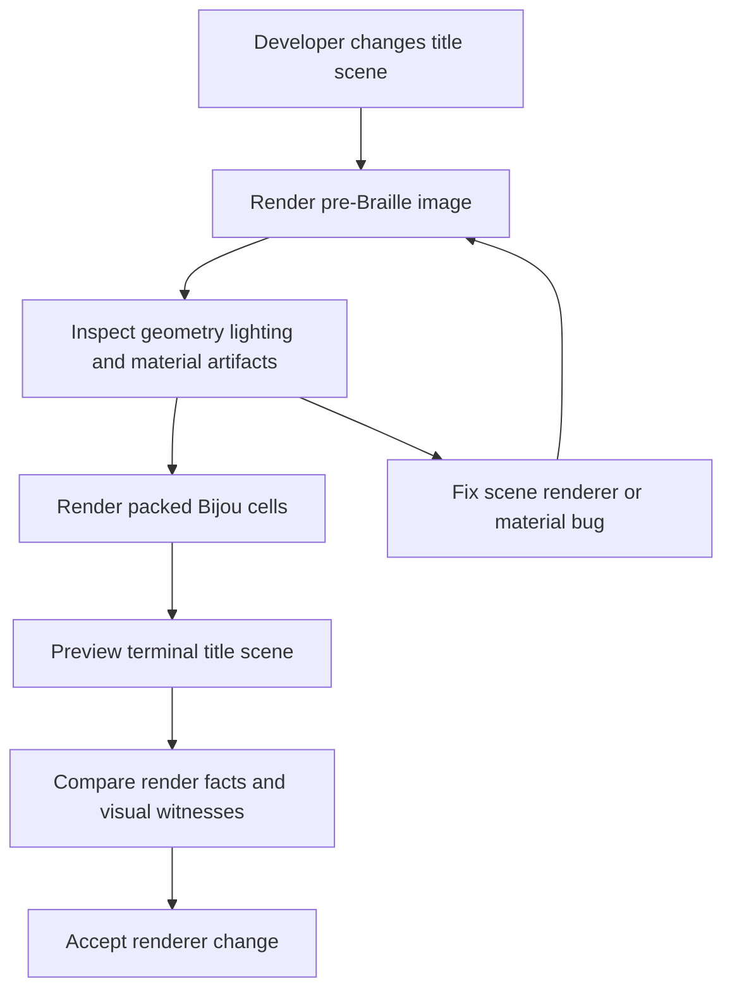
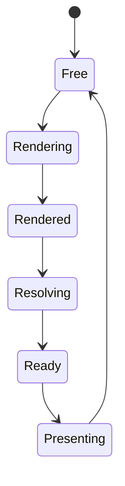
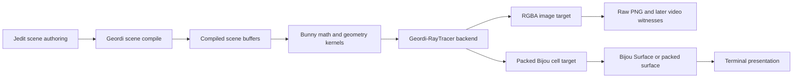

# WF-0107 - Geordi Ray-Traced Title Render Pipeline

## Linked Issue

- TBD. This jedit-owned design should become the coordination seed for later
  jedit, Geordi, Bunny, and Bijou issues.

## Decision Summary

Jedit should move the title-scene ray tracer toward a Geordi-owned renderer
contract with Bunny-owned math/geometry and Bijou-owned terminal presentation.

The target is not merely "put Geordi in the path." The target is a compiled,
buffered renderer pipeline that can produce either pre-Braille image frames for
debug/export or terminal-native packed Braille cells for the live jedit title
screen.

Jedit owns this design because jedit currently drives the user-visible problem:
the title screen needs smooth terminal rendering, performance evidence,
pre-Braille visual debugging, and eventual image/video capture without turning
the editor into a graphics-engine dumping ground.

## Sponsored Human

A jedit developer wants to inspect the ray-traced title scene before Braille
collapse so that material, geometry, lighting, camera, and acceleration bugs can
be debugged as images or videos, without reverse-engineering them from terminal
cells.

## Sponsored Agent

An agent needs a deterministic render contract with explicit frame buffers,
render targets, and renderer facts so it can compare CPU, WASM, and GPU
backends, without inferring performance or image truth from terminal screenshots.

## Hill

By the end of this arc, jedit can ask a Geordi-RayTracer-compatible renderer for
a frame, receive either a pre-Braille RGBA image or a packed Bijou cell buffer,
and prove through fixtures that frame scheduling, buffer reuse, visual witnesses,
and terminal output all describe the same scene.

## Current Truth

This document defines a target architecture. It does not claim the final
Geordi-RayTracer, Bunny geometry kernel, GPU backend, or Bijou packed-cell image
bridge already exists.

The current jedit title renderer has useful pieces that should inform the
target:

- jedit has a title-scene object model, mesh path, primitive objects, lighting,
  camera state, day/night environment, and ray-hit helpers.
- jedit renders the title scene into a Bijou `Surface`.
- jedit has a Braille sampling stage that collapses shader samples into 2x4
  Unicode Braille cells.
- jedit has performance and allocation pressure around the ray/Braille hot path.
- jedit has title recording and visual witness needs that are currently
  terminal-cell-shaped.

The target should preserve those product facts while moving reusable rendering
machinery into the right homes.

## Problem

The title scene is currently difficult to reason about at the right abstraction
level.

Terminal Braille output is the product surface, but it is a poor debug surface
for ray-traced geometry and lighting. A strange mesh edge, shadow artifact,
material color, or camera issue may be visible only after it has already been
quantized into terminal cells. That makes graphics debugging harder than it
needs to be.

At the same time, a naive "render image then sample it" rewrite can make
performance worse if every frame allocates new objects, synchronously waits on a
GPU readback, or copies full image buffers through unnecessary layers.

The renderer needs a better boundary:

- compile scene data once;
- reuse frame buffers;
- render into explicit targets;
- avoid per-frame IR parsing and object graph construction;
- let image/video witnesses inspect pre-Braille frames;
- let the live jedit path consume terminal-native cell buffers.

## Scope

This arc includes:

- Defining the jedit-to-Geordi title render boundary.
- Recording GraphQL as the preferred authoring contract for reusable UI and
  Scene3D profiles.
- Defining a Geordi-RayTracer frame slot and render target model.
- Treating pre-Braille RGBA output as a first-class debug/export target.
- Treating packed Bijou cells as the preferred live jedit target.
- Requiring double-buffered or ring-buffered frame ownership.
- Planning CPU, WASM, and GPU backend compatibility without making GPU the first
  required implementation.
- Recording ownership boundaries between jedit, Geordi, Bunny, and Bijou.
- Defining proof requirements for visual witnesses, frame captures, performance
  facts, and terminal output.

## Non-Goals

This arc does not include:

- Making jedit own a general-purpose graphics engine.
- Making Bijou understand rays, meshes, materials, or Geordi IR.
- Making Bunny own scene files, renderer scheduling, terminal cells, or jedit UI.
- Replacing the editor's Echo-backed text authority.
- Requiring a GPU backend before the CPU pipeline has a deterministic contract.
- Treating screenshots as the primary proof artifact.
- Parsing Geordi IR, JSON, GraphQL, or scene files inside the frame loop.

## User Experience / Product Shape

The live user still sees a terminal title scene. The internal renderer gains a
second inspectable surface: pre-Braille image frames.

The expected developer flow is:

```bash
npm run title:render-image -- --scene title.jedit-scene --frame 120 --output frame.png
npm run title:render-video -- --scene title.jedit-scene --frames 180 --output title.mp4
npm run title:preview -- --scene title.jedit-scene --render braille
```

The exact commands may change, but the product shape should remain:

- image output shows ray-traced color before Braille quantization;
- video output captures the same pre-Braille render target over time;
- terminal preview shows the packed Bijou-cell target;
- JSON facts connect all outputs to the same scene id, camera, time, renderer
  profile, and frame slot policy.

### User Journey



### Wide UI Mockup

Not applicable. This arc changes renderer contracts and evidence surfaces. It
does not add a visible application panel.

### Narrow UI Mockup

Not applicable. Small terminal behavior remains owned by the existing workspace
and title rendering surfaces.

### Accessibility Considerations

The title scene is decorative. Any information needed for review or debugging
must also exist as machine-readable facts, textual summaries, or artifacts. Image
and video exports are evidence surfaces, not the only source of truth.

## Runtime / API Contract

Contract: `GeordiRayTracedTitleFrame`.

The renderer contract should separate scene compilation from frame rendering:

```text
Geordi:
compile(sceneArtifact, assets, rendererProfile) -> CompiledSceneReceipt
acquireFrameSlot(compiledSceneReceipt, targetSpec, uniforms) -> FrameLease
renderFrame(frameLease) -> RenderResult
resolveTarget(renderResult, targetSpec) -> Rgba8Frame | PackedBijouCells
exportWitness(resolvedTarget, witnessPolicy) -> ArtifactReceipt

Bijou/jedit:
presentCells(packedCells) -> BijouSurface
```

Geordi should not own presentation. Geordi compiles, renders, resolves, exports,
and proves. Bijou and jedit present.

### Scene Boundary

The scene boundary should describe:

- stable scene id;
- asset identities and hashes;
- camera defaults;
- time-varying transforms;
- primitive and mesh objects;
- materials;
- environment and lighting;
- supported renderer profile;
- required Bunny math/geometry profile;
- supported render targets.

The first jedit source format may remain `*.jedit-scene`, but the durable
authoring direction should be GraphQL. Authored Scene3D authority belongs to
Geordi, not Bunny. Bunny supplies imported primitive graphics contracts.

The compiled runtime form should be Geordi-owned. If Geordi later owns a
reusable `geordi-scene3d.graphql` profile, it can import or reference
Bunny-owned primitive schemas without changing jedit's live rendering boundary.

### GraphQL Authoring Profiles

GraphQL should describe reusable contracts and authoring surfaces. It should not
be parsed or lowered inside the title-frame loop.

Two profiles should be planned:

```text
bijou-ui.graphql
geordi-scene3d.graphql
```

`bijou-ui.graphql` should describe terminal UI blocks and components:

- layout blocks;
- panes, drawers, overlays, menus, command surfaces, and status rows;
- text, borders, spacing, focus rings, and accessibility labels;
- theme token references;
- event/action ids;
- component-level facts needed by agents and tests.

The expected path is:

```text
GraphQL UI contract
  -> Wesley-generated DTOs and validators
  -> Geordi UI IR
  -> Geordi-Bijou renderer
  -> Bijou Surface or packed cell buffer
```

`geordi-scene3d.graphql` should describe reusable 3D scene content:

- vectors, transforms, cameras, and projection settings;
- primitive shapes and meshes;
- materials, lights, environment, and animation tracks;
- asset identities and hashes;
- renderer feature requirements;
- deterministic numeric and geometry profiles.

It may import or reference Bunny primitive schemas such as:

```text
schemas/bunny/v0/graphics.graphql
schemas/bunny/v0/optics.graphql
```

Those Bunny schemas should define renderer-neutral primitives such as `Vector3`,
`Quaternion`, `Matrix4x4`, `Aabb3`, `Ray3`, `Sphere3`, `RayHit3`, camera math
helpers, projection parameters, and color/vector helper types. Bunny should not
own scene objects, materials, lights, animation tracks, renderer feature
requirements, render targets, Geordi receipts, or jedit title-screen behavior.

The expected path is:

```text
GraphQL Scene3D contract
  -> Wesley-generated DTOs and validators
  -> Geordi Scene3D IR or compiled scene artifact
  -> Geordi-RayTracer backend
  -> rgba8-image or bijou-braille-cells
```

The split matters:

- GraphQL is the authoring and schema authority.
- Wesley provides generated source and drift checks.
- Geordi owns lowered IR, renderer profiles, receipts, and render targets.
- Bunny owns reusable numeric, geometry, collision, and optics primitives used by
  the scene profile.
- Bijou owns the terminal component and cell semantics used by the UI profile.
- jedit owns app-specific screens, title-scene product behavior, and wiring.

The rest of jedit's UI can eventually become "Geordi -> Bijou-ized" through the
UI profile. That should be a Bijou/Geordi feature, not a pile of jedit-only
layout conventions.

### Render Targets

The renderer should support at least two targets:

```text
rgba8-image
bijou-braille-cells
```

`rgba8-image` exists for:

- PNG frame export;
- raw RGBA frame hashes;
- later GIF/video capture;
- visual debugging before Braille;
- renderer cross-checks;
- pixel-level witness probes.

`bijou-braille-cells` exists for:

- live jedit title rendering;
- terminal preview;
- terminal recording;
- Bijou diff/presentation.

The live jedit path should prefer `bijou-braille-cells`. Rendering an RGBA image,
reading it back, then CPU-sampling it into Braille is acceptable as an early
proof, but it should not be the final hot path.

The live-path rule is:

```text
Do not render pixels unless the user asked for pixels.
The terminal asked for cells.
```

The GPU version of the live path should therefore be:

```text
Geordi-RayTracer
  -> WebGPU or native GPU backend
  -> packed Bijou cell buffer
  -> Bijou Surface adapter
  -> terminal
```

The GPU should compute rays, shading, and Braille resolve, then write
terminal-native packed cells. The CPU should read back cells, not a full RGBA
frame, for the live title path.

### Packed Cell Target

Contract: `PackedBijouCellTarget`.

```text
PackedBijouCellTarget = {
  widthCells: PositiveInteger,
  heightCells: PositiveInteger,
  cellFormatId: string,
  sampleGrid: "2x4",
  sampleGridHash: string,
  colorPolicyId: string,
  brailleResolvePolicyId: string,
  cells: PackedBijouCell[]
}
```

The preferred GPU work distribution is one work item per terminal cell, or one
small tile per workgroup:

```text
for each terminal cell:
  cast or sample 2x4 rays
  shade samples
  compute Braille dot mask
  choose foreground, background, and cell attributes
  write one packed cell
```

The live readback target is:

```text
cellCount * packedCellSize
```

not:

```text
pixelWidth * pixelHeight * 4
```

### Target Equivalence

Image and cell targets must prove they describe the same scene. The first proof
should be small and explicit:

```text
sceneId: title-default
frameIndex: 0
timeSeconds: 0
target A: rgba8-image
target B: bijou-braille-cells
proof:
  rgba raw hash
  reference rgba-to-braille hash
  native packed-cell hash
  facts hash
```

The reference path is:

```text
RGBA target at sample-grid resolution
  -> reference Braille resolver
  -> expected PackedBijouCells
```

A native packed-cell renderer then proves:

```text
native PackedBijouCells == reference PackedBijouCells
```

The equivalence policy must name thresholding, gamma, color-space conversion,
dithering, background alpha, dot ordering, terminal cell dimensions, and sample
grid layout. Without those fields, "same scene" is not an inspectable claim.

### Frame Slot

Frame slots should be reusable, mutable storage:

```text
FrameSlot = {
  id: PositiveInteger,
  generation: PositiveInteger,
  leaseId: string,
  state: "free" | "rendering" | "rendered" | "resolving" | "ready" | "presenting",
  targetSpecHash: string,
  bufferPolicy: "double-buffer" | "triple-buffer" | "ring-buffer",
  rgbaTarget?: Rgba8Target,
  cellTarget?: PackedBijouCellTarget,
  facts: RenderFrameFacts
}
```

The implementation must not allocate a new object graph for every rendered
frame. Slots own reusable buffers, and frame rendering mutates those buffers.

`slotId` alone is not enough to prevent stale-frame bugs. Any consumer holding a
slot must also validate the slot generation and lease id.

### Frame Facts

Each frame should report:

```text
RenderFrameFacts = {
  sceneId: string,
  sceneHash: string,
  compiledSceneHash: string,
  assetBundleHash: string,
  uniformsHash: string,
  cameraHash: string,
  rendererName: string,
  rendererProfile: string,
  geordiProfileHash: string,
  bunnySchemaHash?: string,
  rendererBuildHash: string,
  shaderKernelDigest?: string,
  precisionPolicyId?: string,
  target: "rgba8-image" | "bijou-braille-cells",
  targetSpecHash: string,
  frameIndex: NonNegativeInteger,
  timeSeconds: number,
  width: PositiveInteger,
  height: PositiveInteger,
  slotId: PositiveInteger,
  slotGeneration: PositiveInteger,
  bufferPolicy: "double-buffer" | "triple-buffer" | "ring-buffer",
  backend: "typescript-cpu" | "rust-wasm-cpu" | "webgpu" | "webgl" | "native-gpu",
  accelerationPolicyId?: string,
  accelerationStructureHash?: string,
  brailleResolvePolicyId?: string,
  sampleGridHash?: string,
  colorSpace: string,
  toneMapPolicyId?: string,
  cellFormatId?: string,
  rawBufferHash: string,
  artifactHash?: string,
  readbackByteCount?: NonNegativeInteger,
  rayCount?: NonNegativeInteger,
  intersectionCount?: NonNegativeInteger,
  readbackWaitMs?: NonNegativeNumber,
  renderMs?: NonNegativeNumber,
  resolveMs?: NonNegativeNumber,
  presentMs?: NonNegativeNumber
}
```

## Buffering Model

The renderer should use double buffering at minimum and should allow a
three-slot ring when readback or terminal presentation can lag.

Double buffering is enough only when render, resolve, and present are
synchronous:

```text
front buffer: visible or being presented
back buffer: renderer writes next frame
```

The preferred model is a small ring:



At runtime, the pipeline can overlap:

```text
slot A: Geordi renders next frame
slot B: previous rendered frame resolves to image or cells
slot C: previous ready cell frame presents through Bijou
```

If no completed slot is ready, jedit may reuse the last ready title frame rather
than blocking input on a renderer readback.

## CPU And GPU Posture

The first implementation should be CPU-compatible. The design should not require
GPU support before it proves the renderer contract and buffer ownership model.

CPU path:

- compile scene to flat arrays or typed arrays;
- build acceleration structures once per scene or invalidation;
- reuse per-frame ray scratch;
- render into stable RGBA or packed-cell buffers;
- expose allocation and frame-time facts.

GPU path:

- upload compiled scene and acceleration data to GPU resources;
- render into a texture only for image targets;
- render into packed cell storage for the live terminal target;
- resolve Braille cells on GPU for `bijou-braille-cells`;
- read back packed cells rather than full images for the live jedit path;
- avoid mandatory per-frame CPU/GPU synchronization;
- reuse the last ready frame when readback is late;
- report backend identity, shader/kernel digest, precision policy, target hash,
  and readback timing.

The GPU can be much faster at ray/sample work, but synchronous readback can erase
the win. The contract should make late readback observable and non-fatal.

CPU reference remains truth. GPU is acceleration. GPU must emit facts. GPU must
not silently define semantics.

```text
CPU reference:
  proves Ray -> Sample -> BrailleCell semantics

GPU backend:
  proves it matches the reference under a named tolerance and precision policy

Geordi receipt:
  records backend, shader digest, target hash, readback timing, and policy ids

Bijou:
  presents cells and does not learn rays
```

The first GPU proof should be intentionally small:

```text
frameIndex: 0
target: bijou-braille-cells
backend: webgpu
same sceneHash as CPU
same uniformsHash as CPU
same brailleResolvePolicyId
same cellFormatId
gpuCellBufferHash == cpuReferenceCellBufferHash
```

## Data / State Model

| Category | Description |
| --- | --- |
| Source of truth | Scene artifact plus renderer profile and assets. |
| Derived state | Compiled scene buffers, acceleration structures, frame slots, image targets, packed cell targets. |
| Invalid states | Rendering from stale assets, presenting an incomplete slot, parsing scene IR inside the frame loop. |
| Reset behavior | Scene, asset, renderer profile, target size, or backend changes invalidate compiled buffers and frame slots. |
| Serialization | Scene artifacts, frame facts, raw RGBA hashes, PNG exports, terminal-cell recordings, visual witnesses, later video exports. |
| Deterministic assumptions | Fixed scene, time, camera, target size, renderer profile, and asset hashes produce stable facts and bounded visual deltas. |



## Ownership Boundaries

| Project | Owns | Does Not Own |
| --- | --- | --- |
| jedit | App-specific screens, title-screen product behavior, frame scheduling policy, CLI/debug commands, scene selection, terminal integration. | General graphics math, reusable renderer engine, terminal framework internals. |
| Geordi | Scene/UI IR, Scene3D authoring profile, compiled render artifacts, renderer profiles, render targets, frame facts, backend dispatch, visual witnesses. | jedit editor behavior, Echo text authority, Bijou terminal output, Bunny primitive definitions. |
| Bunny | Deterministic math, vectors, matrices, rays, shapes, intersections, bounds, acceleration primitives, optics math, reusable primitive graphics schemas. | Authored scenes, scene scheduling, renderer profiles, render receipts, title-screen UI, terminal cells. |
| Bijou | Surface/cell model, packed cell presentation, frame diffing, terminal output, TUI composition, reusable terminal UI component schema primitives. | Rays, meshes, Scene3D IR, graphics acceleration. |

## Accessibility Posture

| Concern | Posture |
| --- | --- |
| Semantic labels or facts | Frame facts must describe renderer state, scene id, target, backend, and artifact paths. |
| Focus order or ownership | No new focusable UI in this design. |
| Hidden or visual-only information | Debug information must be available through JSON facts, not only image output. |
| Keyboard behavior | Live jedit input must not block waiting for a renderer slot when a prior frame is reusable. |
| Secret or redaction behavior | Title-scene artifacts should not include editor file contents unless a later explicit capture mode says so. |

## Localization / Directionality Posture

| Concern | Posture |
| --- | --- |
| User-visible strings | Export commands and facts should use existing CLI/help localization posture when they become product surfaces. |
| Directionality | The title scene itself is decorative; terminal overlays remain responsible for left-to-right and right-to-left text. |
| Image/video artifacts | Artifact metadata should record locale and text direction when overlays are included. |

## Options Considered

### Option A: Keep Everything In jedit

jedit could continue to own the ray tracer, acceleration structures, image
exports, and Braille collapse.

Pros:

- fastest short-term path;
- fewer repository coordination steps;
- easy to preserve current title behavior.

Cons:

- keeps reusable graphics code trapped in the editor;
- makes GPU/WASM/native backends harder to share;
- encourages jedit-specific math and scene contracts;
- duplicates future Geordi/Bunny/Bijou capabilities.

### Option B: Geordi Renders Only Images

Geordi could render pre-Braille RGBA frames, and jedit could sample those frames
into Bijou cells.

Pros:

- clean image/video debugging;
- common shape for visual witnesses;
- easier first GPU proof.

Cons:

- can add CPU readback and image sampling cost to the live path;
- makes terminal rendering a second-class post-process;
- risks losing jedit's terminal-cell facts and Braille-specific statistics.

### Option C: Geordi Supports Image And Cell Targets

Geordi renders either RGBA frames or packed Bijou cell frames from the same
compiled scene.

Pros:

- supports pre-Braille debug output;
- keeps live jedit rendering terminal-native;
- allows GPU Braille resolve later;
- makes renderer facts comparable across targets;
- gives Bijou a clean cell boundary.

Cons:

- requires a sharper render target contract;
- requires more coordination across repos;
- needs careful proof that image and cell targets describe the same scene.

## Decision

Choose Option C.

The Geordi-RayTracer direction should support both pre-Braille image targets and
packed Bijou cell targets. Jedit should use image targets for debugging,
fixtures, raw RGBA hashes, PNG capture, later video export, and visual witnesses.
Jedit should use packed cell targets for live title rendering whenever the
backend supports them.

The first implementation may use CPU rendering and may internally resolve image
samples into cells, but the public contract should not bake in "image first" as
the only live path.

## Implementation Plan

### Goalpost 1: Jedit-Owned Contract And Witness Shape

Define the jedit-facing renderer interface and evidence formats.

- [ ] Slice 1: Land WF-0107 with ownership, lease, target, and witness
      amendments.
- [ ] Slice 2: Define TypeScript-only target specs, frame leases, frame slots,
      and frame facts.
- [ ] Slice 3: Add a deterministic frame-0 fixture with RGBA raw hash, reference
      RGBA-to-Braille hash, native packed-cell hash, and facts hash.

### Goalpost 2: CPU Frame Slots

Make the current title renderer compatible with reusable frame slots.

- [ ] Slice 4: Introduce reusable frame slot objects or typed buffers with
      generation and lease ids.
- [ ] Slice 5: Render title frames into a caller-owned or renderer-owned slot.
- [ ] Slice 6: Prove no per-frame surface/sample object graph is required after
      warmup.

### Goalpost 3: Pre-Braille Image Export

Expose image debug artifacts before Braille collapse.

- [ ] Slice 7: Add an RGBA8 frame target for the current title scene.
- [ ] Slice 8: Export deterministic raw RGBA hashes and PNG frames from the title
      renderer.
- [ ] Slice 9: Keep GIF/video export as a later convenience artifact, not the
      first proof gate.

### Goalpost 4: Geordi/Bunny Extraction

Move reusable rendering substrate out of jedit.

- [ ] Slice 10: Define the Geordi scene artifact or adapter profile for jedit
      title scenes.
- [ ] Slice 11: Move math/geometry/ray intersection kernels toward Bunny-owned
      crates.
- [ ] Slice 12: Add Geordi renderer facts and compiled scene receipts.

### Goalpost 5: Packed Bijou Cell Target

Make terminal cells a first-class render target.

- [ ] Slice 13: Define packed Bijou cell buffer layout with `cellFormatId`,
      `sampleGridHash`, and `brailleResolvePolicyId`.
- [ ] Slice 14: Add adapter from packed cells to Bijou `Surface`.
- [ ] Slice 15: Prove live title rendering can present from a completed cell
      slot.

### Goalpost 6: GPU-Ready Ring Buffer

Prepare for asynchronous GPU rendering without making it mandatory.

- [ ] Slice 16: Add double-buffer and ring-buffer scheduler tests.
- [ ] Slice 17: Add late-readback behavior that reuses the last ready frame.
- [ ] Slice 18: Add backend capability facts for CPU, WASM, and GPU renderers,
      including shader/kernel digest and precision policy.
- [ ] Slice 19: Add a future WebGPU packed-cell equivalence fixture plan that
      compares GPU cell-buffer hash to CPU reference cell-buffer hash.

## Follow-Up Design Arcs

GraphQL authoring profiles are important, but they should not block WF-0107.
They should move into separate design arcs:

```text
WF-0112 - Bijou UI GraphQL Profile
WF-0113 - Geordi Scene3D Authoring Profile
```

WF-0112 should define `bijou-ui.graphql`, terminal component primitives,
accessibility fields, and the Geordi-Bijou lowering bridge.

WF-0113 should define `geordi-scene3d.graphql`, authored scene objects,
materials, lights, animation tracks, renderer features, target capabilities, and
imports from Bunny primitive graphics schemas.

## Acceptance Criteria

- [ ] jedit has a documented renderer boundary that does not make jedit the
      permanent owner of reusable graphics machinery.
- [ ] The design distinguishes pre-Braille image output from live terminal-cell
      output.
- [ ] The renderer contract supports reusable frame slots.
- [ ] The live path can avoid blocking on an incomplete render slot.
- [ ] Raw RGBA and PNG debug capture are planned before Braille collapse.
- [ ] Packed Bijou cells are planned as the preferred live render target.
- [ ] Bunny, Geordi, Bijou, and jedit ownership boundaries are explicit.
- [ ] GraphQL authoring profiles are distinguished from compiled runtime render
      artifacts.
- [ ] The image target to packed-cell target equivalence policy is explicit.
- [ ] GPU backends are specified as accelerators over CPU reference semantics.
- [ ] The preferred GPU live path writes packed Bijou cells rather than forcing a
      full RGBA image readback.

## Validation Plan

Design validation:

```bash
npx --yes markdownlint-cli docs/design/0107-geordi-raytraced-title-render-pipeline.md
git diff --check
```

Future implementation validation should include:

```bash
npm run build
JEDIT_DIST_PREBUILT=1 node --test spec/title-scene-render.spec.mjs
JEDIT_DIST_PREBUILT=1 node --test spec/title-scene-record-cli.spec.mjs
JEDIT_DIST_PREBUILT=1 node --test spec/title-allocation-facts.spec.mjs
npm run title:render-image -- --frame 0 --json
npm run title:render-image -- --frame 0 --output frame.png
```

## Risks

- A GPU backend can become slower than CPU if every frame blocks on readback.
- A generic renderer contract can over-expand and delay practical title-scene
  fixes.
- Image witnesses can hide terminal-cell regressions if they replace, rather
  than complement, packed-cell witnesses.
- Moving math too early can destabilize jedit before Bunny has published stable
  crates.
- Packed-cell formats can accidentally duplicate Bijou internals unless Bijou
  participates in the contract.
- A GraphQL UI profile can turn into a second UI framework unless Bijou owns the
  reusable component semantics.
- A Scene3D schema can become misplaced graphics authority if scene objects,
  materials, lights, animation, renderer features, or targets are smuggled into
  Bunny.
- A GPU backend can accidentally become the semantic source of truth unless
  reference CPU equivalence remains mandatory.

## Initial Answers And Remaining Questions

- Scene3D profile ownership: not Bunny. If the schema includes authored scene
  objects, materials, lights, animation, renderer features, or targets, it should
  be `geordi-scene3d.graphql`. It may import Bunny primitive schemas.
- Bunny schema ownership: Bunny owns primitive graphics contracts such as
  `schemas/bunny/v0/graphics.graphql` and possibly
  `schemas/bunny/v0/optics.graphql`.
- Bijou UI profile ownership: Bijou should own terminal UI semantics. A
  Geordi-Bijou bridge can own lowering and adapters.
- Packed cell target ownership: cell layout semantics should be Bijou or
  Geordi-Bijou. Geordi may support the render target, but should not silently
  define Bijou internals.
- GIF/video ownership: Geordi witness tooling should own canonical raw frame,
  packed-cell, and frame-fact evidence. jedit CLI tooling may own convenient
  product export commands. GIF/video files are convenience products, not first
  proof artifacts.
- First non-TypeScript backend: Rust/WASM CPU should precede WebGPU. GPU backend
  work needs explicit precision, readback, and equivalence receipts.
- First pixel format: RGBA8 with explicit `colorSpace` and `toneMapPolicyId`.
  Linear float targets can come later if lighting debug work needs them.

Remaining open question:

- Which exact package owns the Geordi-Bijou bridge: Geordi, Bijou, or a separate
  shared workspace package?

## Retrospective

Not yet implemented.
