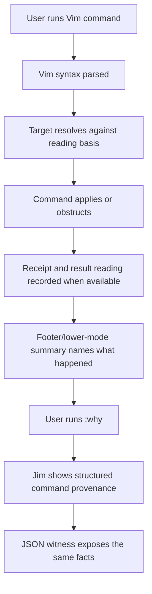
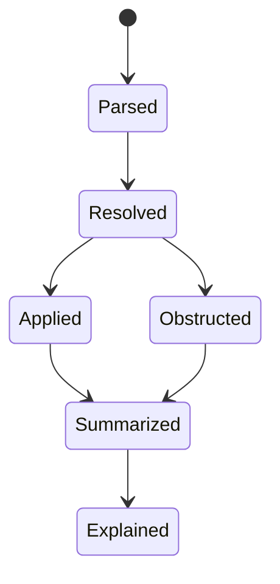

# WF-0108 - Jim Command Provenance And :why

## Linked Issue

- [#131 WF-0108: Jim Command Provenance And :why](https://github.com/flyingrobots/jedit/issues/131)

## Decision Summary

Jim's next product-defining surface is `:why`: selected Vim-powered edits must
emit and expose durable facts that explain what command ran, what runtime target
it resolved, what basis it used, what text/register state changed, and what
evidence proves the result. This cycle starts with a small trust preflight, then
makes command explanation visible to humans through `:why` and a compact
lower-mode summary, and visible to agents through JSON witnesses.

## Product Roadmap Lock

The release is deliberately off the immediate radar. Jim should not ship as a
public editor until it has one unmistakable product promise:

```text
Jim is a modal editor for people and agents who need edits to be explainable,
recoverable, and reviewable.
```

That promise orders the next roadmap by one signature loop:

```text
explain -> preview -> admit -> recover
```

The first user-facing command grammar should be:

| Command | Product role |
| --- | --- |
| `:why` | Explain the last meaningful action. |
| `:preview` | Show a proposed, broad, or destructive edit before admission. |
| `:admit` | Accept all or selected proposed ranges. |
| `:history` | Inspect causal events and historical bases. |
| `:yankfrom` | Pull retained historical material into the current head. |
| `:explain` | Explain a range, character, diagnostic, or result. |

Not all commands need to ship immediately or remain literal forever. They are
the conceptual grammar for the product.

The goalpost order is:

1. **Editor Trust Gate**: prove open, edit, save, quit, search, dirty-state, and
   disk-output behavior before leaning on causal UI.
2. **Command Provenance And `:why`**: explain the last meaningful command and
   expose equivalent facts to agents.
3. **Historical Basis Preview**: preview a historical reading from the history
   drawer while the current head remains unchanged.
4. **Search Sets And Substitute Strand Preview**: create basis-bound search
   result sets, preview `:%s` as a proposal strand, and admit selected rows.
5. **Historical Yank And Register Provenance**: reuse retained historical
   material without moving the current head.
6. **Vim Power Core**: deepen visual mode, registers, semantic repeat, macros,
   marks, structural text objects, and range commands through causal proofs.
7. **Agent-Safe Editing**: require agent edits to arrive as accountable
   proposal strands with basis, range, rationale, evidence, and admission paths.

The next named cycle sequence is:

| Cycle | Issue | Role |
| --- | --- | --- |
| WF-0108 | [#131](https://github.com/flyingrobots/jedit/issues/131) | Jim Command Provenance And `:why` |
| WF-0109 | [#134](https://github.com/flyingrobots/jedit/issues/134) | Historical Basis Preview |
| WF-0110 | [#132](https://github.com/flyingrobots/jedit/issues/132) | Search Sets And Substitute Strand Preview |
| WF-0111 | [#133](https://github.com/flyingrobots/jedit/issues/133) | Historical Yank And Register Provenance |

The internal version ladder remains advisory only:

| Version | Public meaning | Must be true |
| --- | --- | --- |
| `v0.1.x` | Echo-hosted proof / internal release gate | Echo authority and witnesses are honest. |
| `v0.2.0` | Dogfood editor trust release | Core editor lifecycle is reliable. |
| `v0.3.0` | Causal alpha | Provenance, history drawer, checkpoints, and explanations exist. |
| `v0.4.0` | Modal alpha | Visual mode, registers, substitute, repeat, and macros are serious. |
| `v0.5.0` | Proposal alpha | Strand preview covers broad deterministic and agent-suggested edits. |
| `v0.8.0` | Jim public preview | Installable `jim` alias, docs, demo path, and workflow witnesses exist. |
| `v1.0.0` | Real product | Credible keyboard editor plus causal provenance, replay, recovery, and structure. |

Do not rename the repo, contracts, WSC directories, or internal APIs in this
cycle. The `jim` user-facing command alias is earned when the public product
promise is demonstrable.

## Sponsored Human

A modal editor user wants to ask "what happened and why?" after a meaningful
edit so they can trust powerful commands, repeat, and future preview/admission
workflows, without reconstructing intent from raw buffer diffs or terminal
pixels.

## Sponsored Agent

An agent needs structured command provenance facts so it can assert command
syntax, resolved targets, affected ranges, receipt posture, and obstruction
reasons through stable JSON, without scraping the rendered terminal or guessing
private editor state.

## Hill

By the end of this cycle, Jim can explain the last meaningful Vim-powered edit
through a human-facing `:why` surface and a JSON witness, without scraping
terminal pixels or inventing facts not present in runtime behavior.

## Current Truth

Current implemented truth:

- The production TUI has no supported non-Echo text runtime mode.
- Interactive open, edit, read, render, save, export, and checkpoint flows route
  through the Echo-hosted production text session.
- PR #160 hardened the text projection and materialization boundary: bounded
  Echo readings cannot replace whole editable editor text, save/export requires
  full projection evidence, WSC recovery/materialization fails closed on window
  readings, blocked materialization stays visibly blocked, and inactive buffer
  records preserve local projection/authority across file switches.
- WSC history listing, current export, and historical export exist as
  agent-facing JSON surfaces.
- `ctrl+h` opens an Echo History/worldline drawer that can show editor-shaped
  Echo activity and optimistic/worldline posture, but it does not yet reproject
  historical bases.
- The Vim/Jim runtime has parser, normal/operator-pending state, basis-bound
  core motions, core text objects, delete/change/yank/put execution, basic dot
  repeat, transformed-repeat metadata, case operators, joins, local marks, and
  partial register behavior.
- Search repeat `n` and `N`, matching delimiter `%`, paragraph motions, and
  unsupported section motions now expose explicit runtime facts in focused
  specs.
- `/` and `?` search entry and complete search-history mutation are not yet
  product-complete.
- Production undo/redo is still not the final causal undo model.
- WF-0122 and WF-0123 were closed after PR #160; their remaining work is split
  into focused recovery, external edit, braid reconciliation, native Echo
  speculation, and watcher follow-up issues.

Post-#160 anchors:

- PR #160:
  [Harden Echo text projection and file materialization semantics](https://github.com/flyingrobots/jedit/pull/160).
- Restart recovery UI follow-up:
  [#161](https://github.com/flyingrobots/jedit/issues/161).
- External Edit intake follow-up:
  [#162](https://github.com/flyingrobots/jedit/issues/162).
- Braid/diff reconciliation follow-up:
  [#163](https://github.com/flyingrobots/jedit/issues/163).
- Native Echo speculative runtime follow-up:
  [#164](https://github.com/flyingrobots/jedit/issues/164).
- File watcher/external move follow-up:
  [#165](https://github.com/flyingrobots/jedit/issues/165).

Older WF-0108 evidence anchors from merge target
`c511e2abc71c7c812ebc1eb79acb47480dad0ab5`:

- Production text runtime is Echo-only and non-Echo profiles obstruct:
  [spec/text-runtime-profile-session.spec.mjs#53:c511e2abc71c7c812ebc1eb79acb47480dad0ab5](https://github.com/flyingrobots/jedit/blob/c511e2abc71c7c812ebc1eb79acb47480dad0ab5/spec/text-runtime-profile-session.spec.mjs#L53).
- BEARING records the same runtime profile, production undo/redo posture, WSC
  surfaces, and Vim runtime baseline:
  [docs/BEARING.md#14:c511e2abc71c7c812ebc1eb79acb47480dad0ab5](https://github.com/flyingrobots/jedit/blob/c511e2abc71c7c812ebc1eb79acb47480dad0ab5/docs/BEARING.md#L14).
- Production text session opens, edits, reads, checkpoints, and exports through
  app-owned text-session capabilities:
  [spec/production-text-session.spec.mjs#20:c511e2abc71c7c812ebc1eb79acb47480dad0ab5](https://github.com/flyingrobots/jedit/blob/c511e2abc71c7c812ebc1eb79acb47480dad0ab5/spec/production-text-session.spec.mjs#L20).
- Real workspace open/edit/save flows call production text authority and render
  Echo readings:
  [spec/workspace-app-echo-cutover.spec.mjs#5:c511e2abc71c7c812ebc1eb79acb47480dad0ab5](https://github.com/flyingrobots/jedit/blob/c511e2abc71c7c812ebc1eb79acb47480dad0ab5/spec/workspace-app-echo-cutover.spec.mjs#L5).
- Viewer rendering treats Echo reading cache as production text projection,
  not stale local line authority:
  [spec/workspace-text-cutover.spec.mjs#128:c511e2abc71c7c812ebc1eb79acb47480dad0ab5](https://github.com/flyingrobots/jedit/blob/c511e2abc71c7c812ebc1eb79acb47480dad0ab5/spec/workspace-text-cutover.spec.mjs#L128).
- Echo History drawer behavior and `ctrl+h` focus are covered by workspace
  tests:
  [spec/workspace-echo-history-drawer.spec.mjs#35:c511e2abc71c7c812ebc1eb79acb47480dad0ab5](https://github.com/flyingrobots/jedit/blob/c511e2abc71c7c812ebc1eb79acb47480dad0ab5/spec/workspace-echo-history-drawer.spec.mjs#L35).
- WSC history listing exposes deterministic JSON records:
  [spec/jedit-wsc-history-listing.spec.mjs#10:c511e2abc71c7c812ebc1eb79acb47480dad0ab5](https://github.com/flyingrobots/jedit/blob/c511e2abc71c7c812ebc1eb79acb47480dad0ab5/spec/jedit-wsc-history-listing.spec.mjs#L10).
- Current and point-in-time WSC history export are covered by export specs:
  [spec/jedit-wsc-current-history-export.spec.mjs#11:c511e2abc71c7c812ebc1eb79acb47480dad0ab5](https://github.com/flyingrobots/jedit/blob/c511e2abc71c7c812ebc1eb79acb47480dad0ab5/spec/jedit-wsc-current-history-export.spec.mjs#L11).
- Historical basis selection is explicitly non-mutating:
  [spec/jedit-wsc-history-basis.spec.mjs#30:c511e2abc71c7c812ebc1eb79acb47480dad0ab5](https://github.com/flyingrobots/jedit/blob/c511e2abc71c7c812ebc1eb79acb47480dad0ab5/spec/jedit-wsc-history-basis.spec.mjs#L30).
- Vim motion resolver covers reading-basis motions, paragraph motions,
  matching pairs, and repeat-search facts:
  [spec/vim-power-motion-text-object.spec.mjs#9:c511e2abc71c7c812ebc1eb79acb47480dad0ab5](https://github.com/flyingrobots/jedit/blob/c511e2abc71c7c812ebc1eb79acb47480dad0ab5/spec/vim-power-motion-text-object.spec.mjs#L9).
- Vim operators and registers cover delete/change/yank/put-style runtime
  behavior with register provenance:
  [spec/vim-power-operators-registers.spec.mjs#9:c511e2abc71c7c812ebc1eb79acb47480dad0ab5](https://github.com/flyingrobots/jedit/blob/c511e2abc71c7c812ebc1eb79acb47480dad0ab5/spec/vim-power-operators-registers.spec.mjs#L9).
- Dot repeat and transformed repeat metadata are covered by normal-mode specs:
  [spec/vim-power-normal-mode-integration.spec.mjs#9:c511e2abc71c7c812ebc1eb79acb47480dad0ab5](https://github.com/flyingrobots/jedit/blob/c511e2abc71c7c812ebc1eb79acb47480dad0ab5/spec/vim-power-normal-mode-integration.spec.mjs#L9).
- Case operators, joins, and marks are covered by transform/mark specs:
  [spec/vim-power-transforms-marks.spec.mjs#9:c511e2abc71c7c812ebc1eb79acb47480dad0ab5](https://github.com/flyingrobots/jedit/blob/c511e2abc71c7c812ebc1eb79acb47480dad0ab5/spec/vim-power-transforms-marks.spec.mjs#L9).

Current design anchors:

- [WF-0105 Vim Power Moves Causal Parity](0105-vim-power-moves-causal-parity.md)
- [WF-0106 Emacs Ideas To Steal Causally](0106-emacs-ideas-to-steal-causally.md)
- [Echo History Drawer](0034-echo-history-drawer.md)
- [Causal Event Model](causal-event-model.md)
- [Text Edit Algebra](text-edit-algebra.md)

## Problem

Jim has real causal substrate work and real Vim progress, but the product still
does not show the user one unmistakable causal editing move. Receipts, readings,
history exports, and basis facts are valuable, but they remain too
infrastructure-shaped unless a user can ask a simple question after an edit:

```text
Why does the buffer look like this?
```

Without `:why`, Jim risks becoming "Vim-shaped editing with interesting
internals." The product wedge is stronger: every meaningful edit should
eventually be explainable, every broad edit should be previewable, every
proposal should be selectively admissible, every retained history basis should
be useful without moving the current head, and every stale projection should
tell the truth.

## Scope

This cycle includes:

- An Editor Trust Gate preflight that audits open/edit/save/quit, dirty-state,
  search entry, and disk verification gaps before implementation starts.
- A `JeditCommandEvent` model for selected command provenance.
- Provenance for representative Vim edits. Slice 1 scope, tests, and acceptance
  gates use the same initial command set: `dw`, `ciw`, `dd`, and `gUap`. Later
  slices can add `d%`, `n`/`N`, and broader range commands when their product
  surfaces are ready.
- A compact lower-mode summary after meaningful edits.
- `:why` command-line dispatch for the last meaningful command.
- Optional richer detail rendering behind the `:why` surface.
- A JSON witness that reports command provenance without terminal scraping.
- Typed obstruction posture for unsupported, unavailable, or stale-basis cases.

## Slice 1 `:why` MVP

Do not start by explaining every possible edit. The first product slice should
prove one thin path:

```text
last meaningful Vim edit
-> command event record
-> :why explanation
-> lower-mode text
-> JSON witness
-> Echo History drawer row
```

Initial command coverage should use existing proven operations:

| Command | Why it belongs in Slice 1 |
| --- | --- |
| `dw` | Small destructive motion command with familiar Vim semantics. |
| `ciw` | Text-object change proves target/range and mode transition facts. |
| `dd` | Linewise edit proves command event and range summary without search. |
| `gUap` | Operator plus text object proves transformed range provenance. |

## Slice 1 Runtime Status

Slice 1 now has a narrow runtime spine:

- `createJeditCommandEvent(input)` is the supported construction surface for
  command provenance events and returns either a validated Vim event or a typed
  rejection.
- Vim repeat state records the resolved target basis, byte range, and
  charwise/linewise shape for mutating commands, so non-register transforms such
  as `gUap` can still be explained honestly.
- `:why` explains the last meaningful Vim edit using the validated event.
- The normal-mode footer can show a compact last-command summary.
- Echo History applied-edit rows include the command summary when an Echo edit
  receipt settles.
- The JSON witness is available after build:

```bash
node scripts/jedit-command-provenance-witness.mjs --json
node scripts/jedit-command-provenance-witness.mjs --json --command gUap
```

The first witness-backed command set is `dw`, `ciw`, `dd`, and `gUap`. Native
WSC linkage for command events, historical preview, range explanation, search
sets, and substitute proposal strands remain future cycles.

Hold `n`/`N` until `/` and `?` search entry is product-complete. Hold `:%s`
until Search Sets And Substitute Strand Preview becomes the active preview
cycle.

## Slice 0 Editor Trust Gate Preflight

Slice 0 is now recorded by an executable JSON report. The witness requires the
explicit `--json` flag so callers cannot confuse it with a human display mode:

```bash
npm run build
node scripts/jedit-editor-trust-preflight.mjs --json
```

Current passed gates:

- Open, edit, save, and disk output route through production text authority.
- Plain quit requires confirmation, and forced quit remains explicit.

Current scoped posture:

- The product is currently single-buffer. Multi-buffer behavior is not claimed
  in this cycle.

Current blockers before Slice 1:

- Dirty quit uses the generic quit confirmation instead of a dirty-specific
  guardrail.
- Dirty file switches can start a replacement open before unsaved changes are
  resolved.
- `/` and `?` search entry is not product-complete, although repeat-search
  facts exist for `n` and `N`.

## Non-Goals

This cycle does not include:

- Public release work or version tagging.
- Adding the `jim` binary alias.
- Full Vim parity.
- Full visual mode.
- Full macro replay.
- Full causal undo.
- Durable replay completion.
- Full timeline scrubbing.
- AI chat or agent autonomous editing.
- Plugin architecture.
- Broad Git workbench behavior.
- Title-rendering roadmap work.

## User Experience / Product Shape

The signature flow should be small:

1. Open a file.
2. Place the cursor inside a word.
3. Run `ciw`.
4. Type replacement text and return to Normal mode.
5. Run `:why`.
6. Jim shows command, target, range, receipt/result posture, and short
   explanation.

The lower-mode summary should stay quiet by default. It should name causal facts
only when they explain command state, obstruction, or recent meaningful edits.

### User Journey



### Wide UI Mockup

Terminal: 100 columns, dark theme, active editor surface.

```text
+--------------------------------------------------------------------------------------------------+
| src/example.ts                                                                                   |
|                                                                                                  |
| const accountName = customerName                                                                 |
|                                                                                                  |
| NORMAL  last: ciw -> inner word "customerName"  range 3:21-33  receipt tick:77                   |
| :why explains syntax, basis, register effect, receipt, and result reading                        |
+--------------------------------------------------------------------------------------------------+
```

Detail command:

```text
:why

ciw  change inner word
basis: reading:R42
target: word "customerName"
range: line 3, cols 21-33
register: unnamed <- "customerName"
receipt: tick:T77
result: reading:R43
explanation: changed the word under the cursor and entered Insert mode
```

### Narrow UI Mockup

Terminal: 44 columns, dark theme.

```text
+------------------------------------------+
| const accountName = customerName         |
|                                          |
| NORMAL ciw range 3:21-33 receipt T77     |
+------------------------------------------+
```

Optional causal detail collapses before mode, command, obstruction, and recovery
posture. The detail command remains keyboard-accessible.

### Accessibility Considerations

Every surfaced command explanation must have model facts independent of color,
layout, and terminal geometry. The lower-mode summary is a projection over the
same event that JSON witnesses expose. No command explanation may require
visual-only range highlighting.

## Runtime / API Contract

Contract: `JeditCommandEvent`.

Initial event shape:

```text
JeditCommandEvent = {
  eventId,
  keys,
  command,
  mode,
  operator,
  motionOrTextObject,
  count,
  register,
  basisReadingId,
  targetKind,
  rangeSet,
  registerEffect,
  receiptId,
  resultReadingId,
  obstruction,
  summary
}
```

The event distinguishes three phases:

```text
Raw keys
  -> parsed Vim syntax
    -> resolved target over a reading basis
      -> mutation, non-mutating command, or obstruction
```

Echo remains generic. Echo does not learn Vim keys, commands, text objects,
registers, panes, or editor terms. Jim/jedit owns the command event as a
product-shaped projection over Echo receipts, readings, retained evidence, and
app-owned editor state.

## Lower Modes

Lower modes required:

- JSON command provenance witness.
- No-color terminal summary.
- Narrow terminal summary.
- Honest posture when Echo receipt or result reading evidence is unavailable.
- Honest posture when a command is supported in the editor but not yet
  evidence-backed.
- Keyboard-only access through `:why`.

The JSON witness must expose enough structure for an agent to assert command
keys, parsed syntax, resolved target, range, register effect, receipt posture,
result posture, and obstruction reason.

## Data / State Model

| Category | Description |
| --- | --- |
| Source of truth | Echo-backed text readings and receipts, plus jedit-owned command syntax/resolution state. |
| Derived state | Lower-mode summaries and `:why` detail views. |
| Invalid states | Command event claims a mutation without a receipt posture, or claims a range without a basis. |
| Reset behavior | A new meaningful command supersedes the lower-mode summary. |
| Serialization | JSON witness output for command events; future WSC linkage when retained evidence supports it. |
| Deterministic assumptions | Command parsing and target resolution are deterministic over the supplied editor state and basis. |

Invariant enforcement requirement:

- Slice 1 must expose `createJeditCommandEvent(input)` as the only construction
  surface for runtime command events.
- The factory returns a validated event union such as `AppliedCommandEvent`,
  `RangeResolvedCommandEvent`, `ObservedCommandEvent`, or a typed
  `JeditCommandEventRejected` object. Callers must not serialize bare payloads.
- `AppliedCommandEvent` requires explicit receipt posture for any mutation. A
  missing receipt posture returns `JeditCommandEventRejected`.
- `RangeResolvedCommandEvent` requires `basisReadingId` for every emitted range
  or range set. A range without a basis returns `JeditCommandEventRejected`.
- JSON witnesses, lower-mode summaries, and `:why` detail rendering consume only
  the validated event union.
- Slice 0 preflight must confirm the current runtime can distinguish mutation,
  non-mutating command, range resolution, and obstruction facts before Slice 1
  promises those constructors.



## Accessibility Posture

| Concern | Posture |
| --- | --- |
| Semantic labels or facts | Command events carry explicit command, target, range, receipt, and obstruction fields. |
| Focus order or ownership | Detail view or drawer owns focus explicitly and returns to editor focus on close. |
| Hidden or visual-only information | Range highlights are optional projections, never the only explanation. |
| Keyboard behavior | Summary and detail command are keyboard-first. |
| Secret or redaction behavior | Register and range material may need future redaction policy; first slice should avoid secrets-specific claims. |

## Localization / Directionality Posture

| Concern | Posture |
| --- | --- |
| User-visible strings | Lower-mode summary and explanation labels are user-visible. |
| Catalog keys | Add keys with the implementation slice that first renders strings. |
| Supported locales updated | Required with rendering implementation. |
| Directionality assumptions | Facts remain ordered by command semantics; rendered labels use existing footer direction policy. |
| Validation command | Run focused workspace render/i18n specs once strings land. |

## Agent Inspectability / Explainability Posture

Agent inspectability is mandatory. The witness should let an agent answer:

- What command keys ran?
- What syntax parsed?
- What mode was active?
- What basis or reading was used?
- What target resolved?
- What range or range set changed?
- What register changed?
- What receipt/result reading was available?
- What obstruction occurred?
- What short human explanation did Jim show?

## Roadmap System Objects

The next roadmap should be built as four stacked systems, not as disconnected
feature ideas.

### System A: Command Provenance

Enables:

- `:why`;
- `:explain` range;
- register provenance;
- semantic dot-repeat explanation;
- evidence lens;
- agent edit explanation.

Core object: `JeditCommandEvent`.

### System B: Basis-Bound Views

Enables:

- historical basis preview;
- time-travel yank;
- stale diagnostics;
- stale search results;
- current-vs-checkpoint panes.

Core object target:

```text
JeditBasisView = {
  basisId,
  currentHeadId,
  viewPosture,
  sourceEvidence,
  readBudget,
  returnCommand
}
```

Product rule:

```text
Viewing a historical or proposal basis must never mutate current head unless an
explicit admission command runs.
```

### System C: Result Sets And Proposal Strands

Enables:

- search result sets;
- substitute preview;
- global command preview;
- formatter preview;
- agent proposals;
- admit selected;
- macro dry-run.

Core object targets:

- `JeditResultSet`;
- `JeditProposalStrand`;
- `JeditAdmissionSelection`.

### System D: Retained Material Provenance

Enables:

- time-travel yank;
- register provenance;
- causal undo fragments;
- historical paste;
- macro replay evidence.

Core object target:

```text
JeditRetainedTextMaterial = {
  materialRef,
  digest,
  sourceBasis,
  sourceRange,
  producingEvent,
  retentionPosture
}
```

Missing retention is an obstruction, not a fallback invitation.

## Linked Invariants

- Tests are executable spec.
- Runtime truth beats compile-time theater.
- Design should become repo truth.
- Files and previews are projections.
- Echo authority remains outside jedit product nouns.
- Unsupported or rejected work is final for that attempt.
- Retry is explicit new causal input.
- Buffers, panes, panels, and lenses are different things.
- The main editor surface stays quiet; richer context appears at the edges.

## Design Alternatives Considered

### Option A: Build a full timeline first

Pros:

- Visually impressive.
- Could eventually unify history, replay, proposal, and agent workflows.

Cons:

- Too large for the next cycle.
- Risks hiding missing event semantics behind UI spectacle.
- Hard to keep honest before historical basis projection and durable replay are
  complete.

### Option B: Keep provenance JSON-only

Pros:

- Easier to test.
- Useful for agents and CI quickly.

Cons:

- Does not create a user-facing product moment.
- Leaves Jim's causal differentiator invisible during normal editing.

### Option C: Command provenance and `:why` first

Pros:

- Narrow enough to land.
- Turns existing Vim, Echo, receipt, and history work into product shape.
- Gives users and agents the same facts through different projections.
- Creates a foundation for history drawer, strand preview, macros, and agent
  proposals.

Cons:

- Requires discipline to avoid dumping debug details into the editor surface.
- Needs trust preflight so the first demo does not reveal lifecycle gaps.

## Decision

Choose Option C. `:why` is the next product-defining cycle. It starts with an
Editor Trust Gate preflight, then proves a small set of commands through shared
model facts, lower-mode summary, `:why`, JSON witness, and obstruction posture.

## Implementation Slices

- [x] Slice 0: Run Editor Trust Gate preflight and record blockers.
- [x] Slice 1: Define `JeditCommandEvent` model and fixture shape.
- [ ] Slice 2: Emit provenance for `dw`, `ciw`, `dd`, and `gUap`.
- [ ] Slice 3: Render lower-mode command provenance summary.
- [x] Slice 4: Add `:why` command-line dispatch.
- [ ] Slice 5: Add JSON command provenance witness.
- [ ] Slice 6: Add typed obstruction posture for unsupported, no-event, or
      stale-basis cases.

## Tests To Write First

Behavior tests required:

- [x] Trust preflight witness for open/edit/save/quit and disk verification.
- [ ] Command event model test for stable event fields.
- [ ] Runtime tests comparing command behavior with emitted provenance facts.
- [ ] Render test for lower-mode summary at wide and narrow terminal widths.
- [x] Command-line/detail test for `:why`.
- [ ] JSON witness test for agent-readable command facts.
- [ ] Obstruction test for unsupported or stale-basis command provenance.

Required command assertions:

- [ ] `dw` `:why` reports word motion target and deletion range.
- [ ] `ciw` `:why` reports text object, range, register effect, and
      receipt/result posture.
- [ ] `dd` `:why` reports linewise deletion and affected line range.
- [ ] `gUap` `:why` reports paragraph text object and transform operator.
- [x] `:why` with no meaningful event reports calm obstruction.

Documentation and process tests:

- [ ] Roadmap/signpost docs link WF-0108 as the active next cycle.

## Acceptance Criteria

The work is done when:

- [x] Editor Trust Gate preflight names any blockers before implementation
      proceeds.
- [ ] The Slice 1 command set (`dw`, `ciw`, `dd`, `gUap`) emits stable
      provenance facts.
- [ ] Lower-mode summary communicates the last meaningful command without
      overwhelming normal editing.
- [ ] `:why` exposes structured facts for the last meaningful command.
- [ ] JSON witness exposes the same command event facts without terminal
      scraping.
- [ ] Unsupported, unavailable, or stale-basis cases return typed obstruction
      facts.
- [ ] CI and local validation are green.

## Validation Plan

Commands expected before PR:

```bash
npm run build
node --test --test-concurrency=1 \
  spec/editor-trust-preflight.spec.mjs \
  spec/editor-trust-preflight-cli.spec.mjs \
  spec/causal-roadmap-signpost.spec.mjs \
  spec/design-cycle-policy.spec.mjs \
  spec/vim-power-parity-matrix.spec.mjs \
  spec/vim-power-target-usability-fixtures.spec.mjs
npm run quality
npx --yes markdownlint-cli2 docs/BEARING.md README.md VISION.md docs/design/0108-causal-command-provenance-surface.md
git diff --check
```

Implementation PRs must add and run a concrete focused command-provenance spec
path; do not leave template placeholders in shell command blocks.

## Playback / Witness

Target human playback once the `jim` alias is earned:

```text
jim demo.txt
ciw
<replacement>
<Esc>
:why
```

Current repo command while the alias is not earned:

```text
npm run dev -- demo.txt
```

Target witness playback:

```bash
node scripts/jedit-command-provenance-witness.mjs --json --command ciw
```

The script name is a target, not current runtime truth.

## Risks

Known risks:

- Provenance could become noisy and violate the quiet-editor product invariant.
- Event facts could overclaim Echo evidence when only app-owned state exists.
- The first command set could skip editor trust gaps that users hit first.
- Search and structural motion evidence may not yet cover `/` and `?`.

Mitigations:

- Keep lower-mode summaries compact and put full details behind an explicit
  command.
- Separate receipt/result posture from command syntax facts.
- Run Slice 0 before implementation.
- Move `/` and `?` search entry into the Editor Trust Gate if it blocks the
  demo path.

## Follow-On Debt

Follow-on issues:

- [WF-0109 Historical Basis Preview](https://github.com/flyingrobots/jedit/issues/134).
- [WF-0110 Search Sets And Substitute Strand Preview](https://github.com/flyingrobots/jedit/issues/132).
- [WF-0111 Historical Yank And Register Provenance](https://github.com/flyingrobots/jedit/issues/133).
- [WF-0114 Macro Dry-Run With Obstruction Report](https://github.com/flyingrobots/jedit/issues/141).
- [WF-0115 Causal Marks With Drift](https://github.com/flyingrobots/jedit/issues/137).
- [WF-0116 Explain Range](https://github.com/flyingrobots/jedit/issues/140).
- [WF-0117 Register Provenance Detail View](https://github.com/flyingrobots/jedit/issues/139).
- [WF-0118 Semantic Dot-Repeat Explanation](https://github.com/flyingrobots/jedit/issues/136).
- [WF-0119 Stale Diagnostics And Causal Quickfix](https://github.com/flyingrobots/jedit/issues/138).
- [WF-0120 Agent Proposal Strands](https://github.com/flyingrobots/jedit/issues/142).

## Retrospective

Fill this in after implementation.

What changed from the design:

- ...

What the tests proved:

- ...

What remains open:

- ...

PR:

- https://github.com/flyingrobots/jedit/pull/<number>
