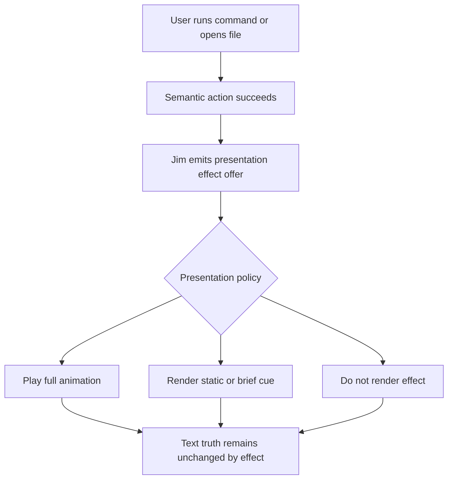
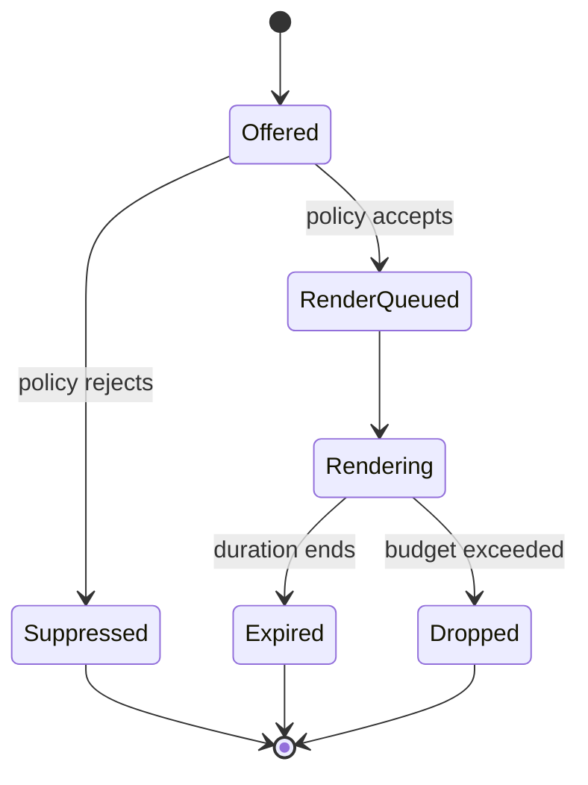

# WF-0108 - Jim Presentation Effect Offers

## Linked Issue

- TBD - open before implementation starts.

## Decision Summary

Jim should model power-move animations, highlights, diagnostic decorations, and
full-buffer transition flourishes as presentation effect offers. An offer is an
inspectable fact that a visual effect may play; it is not the edit, does not
mutate document text, and does not prove playback. Presentation policy decides
whether each offer renders as a full animation, a subtle static cue, or nothing.

## Sponsored Human

A modal editor user wants powerful edits and workspace transitions to clearly
show what changed so that high-leverage commands feel trustworthy, without
giving up a traditional, quiet editor mode when visual effects are distracting.

## Sponsored Agent

An agent needs structured effect-offer facts so it can inspect the intended
presentation consequence of an edit or transition, without scraping terminal
frames or assuming that a user's local presentation policy played an animation.

## Hill

By the end of this future cycle, Jim can emit range-aware presentation effect
offers for selected editor actions, and the repo proves that effects are
policy-controlled overlays which never change the underlying text basis.

## Current Truth

WF-0105 is the active Vim power-moves arc:

- [0105 Vim Power Moves Causal Parity](0105-vim-power-moves-causal-parity.md)
- [0105 Vim Power Moves Parity Matrix](0105-vim-power-moves-parity-matrix.json)
- [0105 Vim Power Target Usability Fixtures](0105-vim-power-target-usability-fixtures.json)

The `vim/power-moves-execution` branch adds runtime motion resolution, text
objects, operators, delete, change, yank, put, named registers, register
provenance facts, Normal-mode pending keys, and dot repeat. The main proof
surface is `spec/vim-power-execution.spec.mjs`.

Today those edits update text and register state, but there is no general
presentation effect vocabulary. The command line has specific invalid-command
feedback, and the title screen has renderer-specific visual behavior, but Jim
does not yet have a shared effect-offer contract for editor text ranges,
diagnostics, yanks, puts, or full-buffer document transitions.

## Problem

Vim power moves can alter a large range from a compact chord. A command such as
`di"` deletes an invisible target range discovered from cursor context. A future
project-wide substitution, macro replay, or causal braid admission can affect an
even larger surface. Users need quick visual confirmation of the affected range,
and agents need an inspectable record that a presentation cue was offered.

The dangerous implementation path is to mix visual behavior into edit truth:

- corruption glyphs must never enter the rope or Echo-backed text material;
- transition frames must never become file content;
- skipped animations must not make the edit less true;
- diagnostics and highlights need semantic facts, not only colored cells;
- reduced-motion and traditional modes must be able to suppress flourish.

Presentation needs a contract that is adjacent to causal editor events without
becoming document authority.

## Scope

This design includes:

- the presentation effect offer boundary;
- local range effects for Vim power moves;
- static decorations for highlights, diagnostics, search, yanks, and puts;
- full-buffer viewport transition effects for opening or switching documents;
- user policy modes for full, subtle, traditional, and reduced-motion behavior;
- agent inspectability fields for ranges, origins, source basis, and policy;
- proof requirements that effects do not mutate text.

## Non-Goals

This design does not include:

- implementing the renderer or effect queue in this branch;
- persisting animation frames as editor truth;
- requiring every effect offer to play;
- adding nonsense animation glyphs to the document model;
- replacing command receipts, register facts, or diagnostic facts;
- teaching Echo about Vim, editor commands, documents, or presentation effects;
- defining a complete animation engine;
- defining Geordi or Bijou renderer internals.

## User Experience / Product Shape

The user-visible rule is:

```text
The edit happens because the editor command succeeded.
The effect may play because presentation policy accepted an offer.
```

### Power-Move Ripple

If the cursor is on the `Z` in `"The Zoo Boys"` and the user runs `di"`, the
delete operation removes the inside-quote range from the buffer. Separately, Jim
may offer an `asciiCorruptionRipple` effect whose origin is the cursor and whose
range is the deleted text. In full-effects mode, glyphs can briefly animate
through density characters and color ramps before fading. In reduced-motion
mode, the same offer can render as a short static highlight. In traditional
mode, it can render as nothing.

For a multi-line range, the same family of effect can propagate from the cursor
origin through the selected rectangle or range set, using distance from origin
to stagger presentation cells. The visual animation is still only an overlay.

### Practical Decorations

Effects are not only flourish. The same contract can support practical cues:

- search result highlight;
- current match highlight;
- yank range color cycle;
- put range flash;
- diagnostic underline, background, or squiggle;
- command preview range outline;
- causal strand or braid preview ghost text;
- gutter markers for ranges affected by a pending command.

Diagnostic facts remain durable semantic facts. Their visual styling is a
presentation effect or decoration derived from that diagnostic truth.

### Full-Buffer Transitions

When a file opens or the active buffer switches, Jim can offer a viewport-scale
transition before revealing the new document. Examples include:

- fade old cells to black, then fade the new document in;
- Matrix-style falling characters over the viewport;
- Doom-style wipe or melt;
- stage curtains closing and parting;
- scanline or block reveal from the cursor, center, or top-left.

These transitions are effects over the buffer viewport or Bijou surface, not
file operations. If effects are disabled, the document appears immediately. If
the renderer cannot animate the transition without hurting input latency, it may
drop or simplify the offer.

### User Journey



### Wide UI Mockup

Not applicable for this draft. The first implementation slice should capture
terminal witnesses once a concrete renderer path exists.

### Narrow UI Mockup

Not applicable for this draft. The effect contract is viewport-size independent;
renderer witnesses must cover narrow terminals before implementation lands.

### Accessibility Considerations

Presentation effect policy must include `reduced-motion` and `traditional`
modes. Effects that blink, rapidly change color, or cover the full viewport must
have a non-animated posture. Any cue that communicates semantic state, such as a
diagnostic, obstruction, or preview, must also be available as structured facts
and keyboard-accessible status, not only animation.

## Runtime / API Contract

The future runtime contract should be shaped like this:

```text
PresentationEffectOffer = {
  id: string,
  kind: PresentationEffectKind,
  source: PresentationEffectSource,
  range?: TextRange | CellRange | RangeSet,
  viewport?: ViewportId,
  origin?: TextPoint | CellPoint,
  operation?: PresentationEffectOperation,
  sourceBasisDigest?: string,
  sourceReceiptId?: string,
  registerName?: string,
  message?: string,
  severity?: "error" | "warning" | "info" | "hint",
  suggestedDurationMs?: number,
  paletteRole?: string,
  payload?: PresentationEffectPayload
}

PresentationEffectKind =
  | "backgroundHighlight"
  | "foregroundTint"
  | "underline"
  | "squiggleUnderline"
  | "flash"
  | "asciiCorruptionRipple"
  | "colorCycle"
  | "fadeOut"
  | "rangeOutline"
  | "ghostText"
  | "gutterMarker"
  | "viewportFade"
  | "viewportMatrixRain"
  | "viewportWipe"
  | "viewportCurtain"

PresentationEffectSource =
  | "vim-power-move"
  | "diagnostic"
  | "search"
  | "yank"
  | "put"
  | "command-preview"
  | "causal-preview"
  | "file-open"
  | "buffer-switch"

PresentationEffectPolicy =
  | "full"
  | "subtle"
  | "traditional"
  | "reduced-motion"
```

The contract intentionally says "offer." A renderer may reject or downgrade an
offer because of user settings, terminal capability, viewport size, battery
policy, performance budget, or accessibility posture.

## Lower Modes

- `traditional`: render no flourish effects; semantic diagnostics and command
  errors remain available through non-animated cues.
- `reduced-motion`: avoid movement, ripple, wipe, rain, curtain, and blink;
  prefer static highlight, underline, or status facts.
- `no-color`: preserve facts and use underline, inverse, or text labels when
  practical.
- `agent/json`: expose offer facts without requiring terminal rendering.
- `slow-terminal`: drop or simplify effects when frame budgets are exceeded.

## Data / State Model

| Category | Description |
| --- | --- |
| Source of truth | Editor command receipts, text basis, registers, diagnostics, and buffer switch facts. |
| Derived state | Presentation effect offers derived from source events. |
| Runtime state | A bounded presentation queue consumed by the active renderer. |
| Invalid states | Effect payload mutates text, claims playback as truth, or hides semantic state. |
| Reset behavior | Transient offers expire by clock, viewport replacement, or explicit clear. |
| Serialization | Offer facts may be logged for witnesses; animation frames are not document state. |
| Deterministic assumptions | Tests fix time, viewport, theme, and policy when comparing rendered effects. |



## Accessibility Posture

| Concern | Posture |
| --- | --- |
| Semantic labels or facts | Every effect offer has source, kind, and range metadata. |
| Focus order or ownership | Effects never steal focus from command line, insert mode, or dialogs. |
| Hidden or visual-only information | Semantic state is available outside animation. |
| Keyboard behavior | Effects do not consume editing keys unless an explicit modal surface owns focus. |
| Secret or redaction behavior | Effects must not reveal redacted text through payloads or frame logs. |

## Localization / Directionality Posture

| Concern | Posture |
| --- | --- |
| User-visible strings | None in this design. |
| Catalog keys | Future effect labels should use existing i18n catalog flow. |
| Supported locales updated | Not applicable until strings are added. |
| Directionality assumptions | Text ranges use buffer coordinates; renderer decides visual direction. |
| Validation command | Future string additions must run the existing i18n generation and tests. |

## Agent Inspectability / Explainability Posture

An agent should be able to inspect effects through JSON facts:

```json
{
  "id": "effect-00042",
  "kind": "asciiCorruptionRipple",
  "source": "vim-power-move",
  "operation": "delete",
  "range": {
    "start": { "row": 0, "column": 5 },
    "end": { "row": 0, "column": 13 }
  },
  "origin": { "row": 0, "column": 5 },
  "sourceBasisDigest": "sha256:...",
  "suggestedDurationMs": 200
}
```

This fact is enough to verify that Jim offered an effect for the intended range.
It is not proof that a human watched it play.

## Linked Invariants

- Echo remains generic and receives no editor, Vim, or presentation nouns.
- Text authority beats presentation.
- Runtime behavior and tests beat design intent.
- Visual effects never masquerade as document content.
- Accessibility and reduced-motion policy can suppress flourish.
- Agent-facing proof uses facts and witnesses, not pixel scraping.

## Design Alternatives Considered

### Option A: Inline Animation In Edit Commands

Pros:

- Fastest path to a flashy demo.
- Edit command has all the range context.

Cons:

- Couples command semantics to rendering.
- Risks mutating or leaking text through animation payloads.
- Makes reduced-motion and agent inspection afterthoughts.

### Option B: Renderer-Only Heuristics

Pros:

- Keeps editing code small.
- Lets renderers invent theme-specific effects.

Cons:

- Renderer must guess semantic intent from text diffs.
- Agents cannot inspect why an effect happened.
- Hard to distinguish delete, change, yank, diagnostic, and file-open effects.

### Option C: Presentation Effect Offers

Pros:

- Keeps text truth and visual presentation separate.
- Gives renderers policy freedom without losing semantic context.
- Supports local ripples and full-viewport transitions with one boundary.
- Gives agents a stable, non-visual proof surface.

Cons:

- Requires a small effect vocabulary and queue.
- Requires tests to prove the negative: effects do not mutate text.
- Requires careful privacy posture for payloads and frame witnesses.

## Decision

Choose Option C. Jim will eventually emit presentation effect offers from
successful semantic events. Renderers may play, downgrade, or suppress those
offers. The offer is inspectable; playback is optional.

## Implementation Slices

- [ ] Slice 1: Define `PresentationEffectOffer` types and policy vocabulary.
- [ ] Slice 2: Add a bounded workspace presentation effect queue.
- [ ] Slice 3: Emit delete/change/yank/put offers from Vim power moves.
- [ ] Slice 4: Render static highlights and flashes for range offers.
- [ ] Slice 5: Add reduced-motion, traditional, and no-color policy tests.
- [ ] Slice 6: Add diagnostic and search decoration offers.
- [ ] Slice 7: Add file-open and buffer-switch viewport transition offers.
- [ ] Slice 8: Add first animated ripple and viewport transition witnesses.

## Tests To Write First

Behavior tests required:

- [ ] `di"` mutates text and emits a range offer over the deleted span.
- [ ] Disabled effects preserve the same text and register result.
- [ ] Reduced-motion downgrades ripple to a non-moving cue.
- [ ] File-open transition offer never delays or replaces file content truth.
- [ ] Expired effects leave no overlay in subsequent render frames.

Documentation and process tests:

- [ ] Design docs link this follow-on from WF-0105 and BEARING.

## Acceptance Criteria

The work is done when:

- [ ] Effect offers have stable typed facts and tests.
- [ ] Vim power edits can offer range effects without changing text semantics.
- [ ] File-open and buffer-switch effects are viewport overlays only.
- [ ] Traditional and reduced-motion modes suppress or downgrade flourish.
- [ ] Diagnostics and semantic cues remain inspectable without animation.
- [ ] Renderer witnesses prove overlay lifecycle and expiration.
- [ ] CI and local validation are green.

## Validation Plan

Expected commands for the future implementation PR:

```bash
npm run build
node --test --test-concurrency=1 \
  spec/vim-power-execution.spec.mjs \
  spec/workspace-presentation-effects.spec.mjs
npm run --silent quality
git diff --check
```

For this design-only slice:

```bash
npx --yes markdownlint-cli2 \
  docs/design/0108-jim-presentation-effect-offers.md \
  docs/BEARING.md
git diff --check
```

## Playback / Witness

Future witnesses should cover:

- fixed text, cursor, command, and time for a power-move ripple;
- fixed viewport, theme, and time for a file-open transition;
- JSON offer facts for agent inspection;
- before/after text material hashes proving effects did not mutate content;
- reduced-motion and traditional policy snapshots.

## Risks

Known risks:

- Effects can become distracting or visually noisy.
- Full-viewport transitions can hide latency instead of improving it.
- Animation payloads can accidentally include sensitive text.
- Renderer-specific behavior can drift from the semantic offer.
- Tests can overfit exact animation frames.

Mitigations:

- Default to short durations and explicit policy control.
- Treat input latency as a hard budget.
- Keep payloads range-based by default, not raw-text based.
- Use facts to prove offers and lightweight witnesses to prove render posture.
- Test lifecycle, policy, and hashes before pixel-perfect animation details.

## Follow-On Debt

Open a GitHub issue before implementation starts. That issue should decide the
first renderer target and whether this work belongs before or after the next
WF-0105 runtime slice.

## Retrospective

To fill when this design lands or is superseded.
