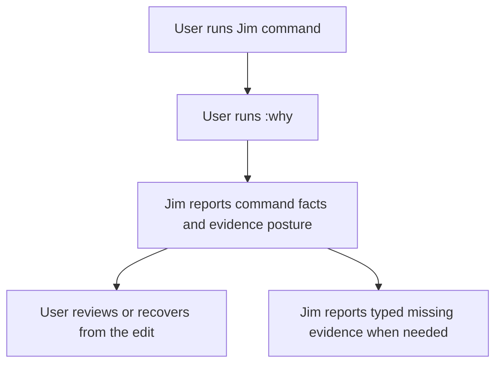

# WF-0108A - :why Observation Evidence Roadmap

## Linked Issue

- [#181 WF-0108A: Complete `:why` through observation evidence](https://github.com/flyingrobots/jedit/issues/181)

## Decision Summary

`:why` is a Jim feature with two different questions that must not be
collapsed.

No-selection `:why` answers the command question: why did Jim treat the last
command as meaningful? That can start from local command provenance, then grow
receipt links as Echo evidence becomes available.

Cursor, selection, or range `:why` answers the text question: why is this text
here? That must come from the rope/worldline path: current reading coordinate,
current rope head, reverse rope diff or rewrite walk, producing tick, and then
receipt or BTR provenance when available.

WF-0108 already landed the narrow command-dispatch and local command-provenance
base. WF-0108A closes the remaining gap by making evidence posture honest,
then moving range explanations toward retained rope history without moving Jim
editor nouns into Echo or pretending that Jim/Echo integration goes through
Continuum.

## Sponsored Human

A Jim user wants `:why` to explain the last meaningful modal edit in product
terms so that recovery, review, and trust do not require reading raw debug
state or guessing which basis the editor observed.

## Sponsored Agent

An agent needs stable `:why` JSON witness fields and typed obstruction posture
so it can inspect command provenance without scraping terminal prose or
inventing Echo evidence that Jim has not received.

## Hill

By the end of WF-0108A, a user or agent can run representative Jim commands,
ask `:why`, and inspect the same command, target, range, register, lower-mode,
and evidence-posture facts through human text and JSON witnesses.

## Current Truth

Current builds already contain the first `:why` proof:

- command-line dispatch for `:why`;
- a command event model for meaningful Vim-powered edits;
- a calm no-event response when no meaningful command is available;
- human-facing explanation surfaces;
- agent-facing witness paths for the local command event.

The remaining production gaps are observation evidence and range causality:

- local reading caches must not be represented as Echo ReadingEnvelopes;
- `:why` must name the local window posture, explicit Echo reading identity, or
  obstruction posture it depended on;
- unsupported, stale, missing, or translated evidence must be typed instead of
  collapsed into prose;
- range `:why` must walk retained rope diff history instead of consulting
  ephemeral command memory;
- the first golden commands must prove the same command facts through runtime
  behavior, JSON, and human explanation;
- cryptographic proof posture should have reserved fields, but fake proof
  strength must not be claimed before Echo and Continuum can witness it.

## Problem

`:why` currently proves that Jim can explain a local meaningful command. It
does not yet prove complete observation evidence for every target command
family, and it does not yet explain a selected text range from retained rope
history.

Without explicit evidence posture, a local reading cache can sound like an Echo
ReadingEnvelope. Without range-at-head lookup, a text explanation can degrade
into string search or command-memory replay. Both are false authority.

## Scope

This roadmap-lock cycle includes:

- the Jim/Echo/Continuum ownership boundary for `:why` evidence;
- the jedit, Echo, and Continuum issue topology;
- the execution order for completing observation evidence;
- the proof posture for future cryptographic evidence without implementation
  overclaiming.

It does not implement the runtime slices. Those are tracked as the linked
jedit, Echo, and Continuum issues below.

## Product Boundary

The ownership split is deliberately strict:

| Layer | Owns | Does not own |
| --- | --- | --- |
| Jim / jedit | `:why` UX, command catalog, Vim command grammar, editor facts, JSON witness shape | Runtime admission or generic protocol doctrine |
| Echo | Reading envelopes, receipts, retained evidence, runtime admission, replayable basis facts | Jim commands, Vim nouns, buffers, registers, macros |
| Continuum | Portable profile vocabulary, evidence posture, participant discovery, conformance fixtures | Jim/Echo app integration, runtime implementation, editor app ontology |

Jim is an Echo app. Jim does not talk to Echo through Continuum. Continuum
becomes relevant only where Jim/Echo evidence needs to be portable to WARP TTD,
Graft, WARP DRIVE, agents, or other Continuum participants.

## User Experience / Product Shape

The product shape stays the golden Jim loop:

- explain;
- preview;
- admit;
- recover.

For WF-0108A, the visible user action is still:

```vim
:why
```

The output should explain the last meaningful command without requiring the
user to understand Echo internals. When evidence is partial, unavailable,
stale, unsupported, translated, redacted, or obstructed, the wording should say
that plainly instead of silently falling back to a weaker claim.

### User Journey



### Wide UI Mockup

Not applicable for this roadmap-lock PR. Runtime slices that change rendered
`:why` output should include focused snapshots or witness text.

### Narrow UI Mockup

Not applicable for this roadmap-lock PR. The intended narrow behavior is
plain-text wrapping with no visual-only facts.

### Accessibility Considerations

`:why` facts must be available as text and JSON, not only through layout,
color, or terminal position.

## Runtime / API Contract

The planned contract is a Jim-owned `:why` explanation surface backed by a
stable JSON witness. The contract should include:

- command identity and parsed form;
- target or typed obstruction;
- affected range or transform;
- register and lower-mode posture;
- Echo reading basis or missing-evidence posture;
- receipt or retained evidence refs when available;
- future-proof posture fields that do not claim proof strength before evidence
  exists.
- Supported Outcome Settlement outcome vocabulary: completion, repairable
  obstruction, authority block, underdetermined support, dispute, and invalid
  proposal must remain distinct in JSON and human text.

Echo supplies generic reading, receipt, obstruction, and replay evidence. Jim
projects that evidence into editor language. Continuum names portable protocol
vocabulary only when the facts cross participant boundaries.

`JeditWhyObservation` is an honesty envelope, not a causal authority source.
It may label local editor provenance, local text-window posture, receipt refs,
explicit Echo ReadingEnvelope refs, translated evidence, native evidence,
missing evidence, stale basis, and obstruction. It must not synthesize an Echo
ReadingEnvelope from a local cache or reading id.

The follow-on range contract is `JeditWhyRange`: given a current rope head and
byte range, map the range backward through retained `RopeDiff` and
`RopeRewrite` history, identify the producing tick or receipt when possible,
and report typed unavailable or missing evidence when BTR or provenance payload
is absent.

## Lower Modes

Required lower modes:

- JSON witness output for agents and tests;
- deterministic no-event output when no meaningful command exists;
- typed obstruction output for missing, stale, unsupported, redacted,
  translated, or unavailable evidence;
- plain terminal text that does not require color or layout to understand.

## Accessibility Posture

| Concern | Posture |
| --- | --- |
| Semantic labels or facts | Command, target, range, register, and evidence posture must be textual and machine-readable. |
| Focus order or ownership | `:why` remains a command-line action; future rendered panels must not steal input focus silently. |
| Hidden or visual-only information | No evidence fact may be conveyed only by color, glyph, or placement. |
| Keyboard behavior | The feature remains keyboard-first through Vim command-line dispatch. |
| Secret or redaction behavior | Redacted evidence must be named as redacted rather than omitted as if complete. |

## Localization / Directionality Posture

| Concern | Posture |
| --- | --- |
| User-visible strings | Roadmap-lock PR only changes docs. Runtime slices must account for changed `:why` strings. |
| Catalog keys | Future command catalog work should provide stable ids before broad string expansion. |
| Supported locales updated | Not applicable for this roadmap-lock PR. |
| Directionality assumptions | `:why` output should not encode meaning through left-to-right alignment. |
| Validation command | Runtime slices should add focused tests for any changed user-visible output. |

## Agent Inspectability / Explainability Posture

Agents should inspect `:why` through stable witness fields:

- command id and key form;
- effect class;
- resolved target or typed obstruction;
- range, transform, and register posture;
- reading identity or missing-evidence posture;
- receipt refs when available;
- proof posture slots that distinguish native, translated, fixture,
  digest-only, claimed, and absent evidence.

Agents must not need to parse the human `:why` paragraph to understand whether
evidence is complete.

## Goalpost

The active jedit goalpost is:

- [#181 WF-0108A: Complete `:why` through observation evidence](https://github.com/flyingrobots/jedit/issues/181)

It is complete when a user can run a representative Vim command, ask `:why`,
and receive an explanation that includes:

- parsed command identity;
- resolved target or typed obstruction;
- affected range or transform;
- register and lower-mode effects where relevant;
- Echo reading basis or explicit missing-evidence posture;
- receipt or retained evidence refs when available;
- JSON witness fields matching the human-facing truth.

For range `:why`, completion additionally requires a selected or cursor-derived
range at the current rope head to resolve through retained rope history rather
than through `editor.lastVimEdit` or text-content search.

## Implementation Slices

The first implementation slices are jedit-owned:

| Issue | Slice | Proof |
| --- | --- | --- |
| [#173](https://github.com/flyingrobots/jedit/issues/173) | Lock WF-0108A roadmap and cross-repo issue links | Docs name ownership, order, and evidence boundaries |
| [#174](https://github.com/flyingrobots/jedit/issues/174) | Add `JeditWhyObservation` coordinate model | Model test proves basis/window/authority fields and no fake Echo envelope |
| [#175](https://github.com/flyingrobots/jedit/issues/175) | Upgrade text-window envelope evidence fields | Window evidence distinguishes full, partial, stale, and unavailable |
| [#176](https://github.com/flyingrobots/jedit/issues/176) | Wire `:why` JSON to Echo ReadingEnvelope identity | JSON witness includes Echo reading identity or obstruction |
| [#177](https://github.com/flyingrobots/jedit/issues/177) | Add typed `:why` evidence obstructions | Unsupported and stale cases return machine-readable posture |
| [#178](https://github.com/flyingrobots/jedit/issues/178) | Golden `dw` witness through Echo evidence | Human and JSON `:why` agree for `dw` |
| [#179](https://github.com/flyingrobots/jedit/issues/179) | Expand witness to `dd`, `ciw`, and `gUap` | Each command proves command, target, range, and evidence facts |
| [#180](https://github.com/flyingrobots/jedit/issues/180) | Add proof posture slots for future crypto evidence | Schema reserves proof posture without overclaiming |
| [#194](https://github.com/flyingrobots/jedit/issues/194) | Explain selected text from rope diff history | Range witness walks rope diffs by coordinate and survives cleared command memory |

## Echo Dependencies

Echo work is required where `:why` needs runtime evidence, not editor semantics:

| Issue | Slice | Why Jim needs it |
| --- | --- | --- |
| [echo#628](https://github.com/flyingrobots/echo/issues/628) | Export ReadingEnvelope identity for app consumers | Lets Jim cite the reading it observed |
| [echo#629](https://github.com/flyingrobots/echo/issues/629) | Stabilize contract obstruction taxonomy for Jim | Lets Jim report typed missing/stale evidence |
| [echo#630](https://github.com/flyingrobots/echo/issues/630) | Return retained receipt and reading evidence refs | Lets `:why` cite real runtime evidence |
| [echo#631](https://github.com/flyingrobots/echo/issues/631) | Preserve trusted-host scheduler split for jedit witness | Prevents app code from claiming runtime admission authority |
| [echo#632](https://github.com/flyingrobots/echo/issues/632) | Add replay proof for Jim edit and bounded reading | Makes recovery/debug claims evidence-backed |
| [echo#633](https://github.com/flyingrobots/echo/issues/633) | Define canonical digest domains for observation evidence | Stabilizes future-proof posture and comparison |

Echo must not learn Jim, Vim, buffers, registers, macros, or `:why`. It should
export generic runtime evidence that Jim can project into editor language.

## Continuum Dependencies

Continuum work is protocol work. It is not on the Jim-to-Echo call path.

Relevant Continuum goalposts:

- [continuum#59](https://github.com/flyingrobots/continuum/issues/59) tracks
  observation evidence and capability proof protocol slices.
- [continuum#58](https://github.com/flyingrobots/continuum/issues/58) tracks
  the later Verkle, IPA, ZK, DID, and UCAN proof posture plan.

Use Continuum vocabulary when Jim/Echo facts need to become portable:

- participant descriptors;
- observation profile fixtures;
- multidimensional evidence posture;
- contract index and `qw doctor` conformance reports;
- WARP TTD discovery and generic attach behavior;
- future capability and proof presentation posture.

Do not put Jim-only `:why` tasks in Continuum unless the task defines portable
protocol shape or conformance evidence for other participants.

## WF-0106 Relationship

WF-0106 is the supporting product surface plan:

- [#192 WF-0106: Emacs ideas to steal causally](https://github.com/flyingrobots/jedit/issues/192)

It should reinforce `:why` by adding command catalog, describe surfaces, prefix
help, register provenance, macro replay reports, buffer/mode reports, and
diagnostic/debug trace buffers. Those features consume the same command and
evidence truth; they do not replace WF-0108A.

## Execution Order

1. Lock this roadmap and issue topology through [#173](https://github.com/flyingrobots/jedit/issues/173).
2. Add the honesty-only `JeditWhyObservation` model through [#174](https://github.com/flyingrobots/jedit/issues/174).
3. Add typed local evidence obstructions through [#177](https://github.com/flyingrobots/jedit/issues/177).
4. Upgrade text-window evidence fields through [#175](https://github.com/flyingrobots/jedit/issues/175).
5. Wire Echo reading identity when Echo exposes the needed refs through [#176](https://github.com/flyingrobots/jedit/issues/176).
6. Start range-at-head reverse rope-diff explanation through [#194](https://github.com/flyingrobots/jedit/issues/194).
7. Prove `dw` end to end through [#178](https://github.com/flyingrobots/jedit/issues/178).
8. Expand the command set through [#179](https://github.com/flyingrobots/jedit/issues/179).
9. Add future-proof posture slots through [#180](https://github.com/flyingrobots/jedit/issues/180).

This order keeps Jim useful before the full protocol and crypto posture are
available, while preventing fake evidence claims.

## Non-Goals

- Do not rename the repo, package, contracts, or WSC directories.
- Do not move Jim editor nouns into Echo.
- Do not route Jim/Echo integration through Continuum.
- Do not implement Verkle, IPA, ZK, DID, or UCAN proof systems in jedit.
- Do not claim native cryptographic proof strength before witnesses exist.
- Do not let `:why` become a raw debug dump.

## Tests To Write First

Behavior tests required:

- [x] `JeditWhyObservation` model test covering basis, window, authority, and
      evidence posture.
- [x] `JeditWhyObservation` regression proving a local reading cache does not
      claim `EchoReadingEnvelope` evidence.
- [ ] JSON witness test proving Echo reading identity or typed missing evidence
      appears without terminal scraping.
- [x] Range `:why` test proving explanation survives cleared or mutated
      `editor.lastVimEdit`.
- [x] Duplicate-text range `:why` test proving coordinate lookup, not string
      search.
- [ ] Golden command tests for `dw`, `dd`, `ciw`, and `gUap`.
- [ ] Obstruction tests for stale, unavailable, unsupported, translated, and
      redacted evidence posture.

Documentation and process tests:

- [x] Design-cycle policy test proving WF-0108A preserves required full-cycle
      headings.

## Acceptance Criteria

- `:why` explains the last meaningful command in user-facing Jim terms.
- JSON witness output contains the same core facts without terminal scraping.
- Missing, stale, partial, unsupported, redacted, or translated evidence is
  machine-readable.
- Local text-window evidence is never mislabeled as an Echo ReadingEnvelope.
- Range `:why` resolves from the current rope head and retained rewrite history
  when available.
- `dw`, `dd`, `ciw`, and `gUap` each have command assertions covering command
  identity, target, range or transform, register posture where applicable, and
  evidence posture.
- Echo evidence is cited through generic reading/receipt refs, not Jim nouns.
- Continuum protocol terms are used only where the evidence crosses participant
  boundaries.

## Validation Plan

Roadmap-lock PRs should run:

```bash
npx --yes markdownlint-cli2 \
  docs/BEARING.md \
  docs/design/0106-emacs-ideas-to-steal-causally.md \
  docs/design/0108-causal-command-provenance-surface.md \
  docs/design/0108a-why-observation-evidence-roadmap.md
node --test --test-concurrency=1 spec/design-cycle-policy.spec.mjs
git diff --check
```

Implementation PRs must add focused runtime tests for the specific slice and
run the relevant command-provenance, witness, and Echo-history specs.

## Playback / Witness

Roadmap playback for this PR is:

- inspect this design document for ownership boundaries and slices;
- inspect linked jedit, Echo, and Continuum issues for repo-specific work;
- run `spec/design-cycle-policy.spec.mjs` for template/process enforcement;
- run markdownlint and `git diff --check` for docs hygiene.

Implementation playback will move into the slice PRs and must include focused
runtime witnesses for command explanations, JSON output, and typed evidence
obstructions.

## Retrospective

This roadmap-lock pass clarified that the remaining `:why` work is evidence
completion, not basic command dispatch. The important outcome is the ownership
boundary: Jim owns the user-facing explanation and editor facts, Echo owns
generic runtime evidence, and Continuum owns portable protocol vocabulary only
when facts cross participant boundaries.

The main correction was moving vague cross-repo ambition into explicit slices:
Jedit can start with local observation coordinates and typed obstructions before
Echo exposes every ReadingEnvelope ref, but local cache evidence must remain
local. The next product pivot is range `:why` through rope diffs and producing
ticks, while the Verkle, IPA, ZK, DID, and UCAN posture remains
protocol-facing and future-proofed rather than claimed.

Implementation retrospectives still belong in the slice PRs that land the
model, witnesses, Echo evidence wiring, and golden command assertions.
