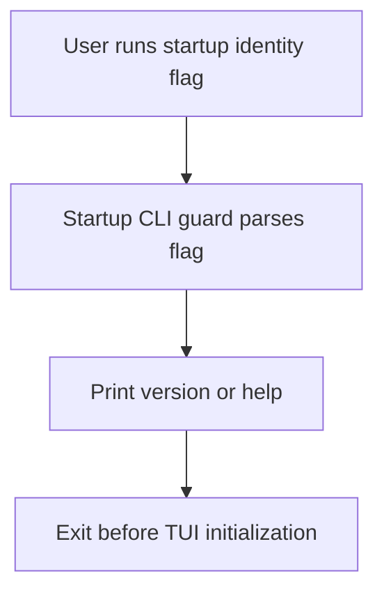

# WF-0145 - jedit CLI version identity

## Linked Issue

- https://github.com/flyingrobots/jedit/issues/145

## Decision Summary

jedit will expose a lightweight startup identity surface before the TUI starts.
`--version` and `-V` print the jedit package identity, and `--help` / `-h`
print the same identity plus supported startup options. These paths exit before
Bijou, terminal mouse handling, Echo-hosted text runtime, Graft, or title
rendering initialization.

## Sponsored Human

A maintainer wants to verify the installed jedit identity from a terminal so
that release and integration checks can prove the local toolchain, without
starting the full editor.

## Sponsored Agent

An agent needs a stable command output contract so it can verify jedit in a
cross-repo chain with Colorful and Graft, without inferring version state from
private package files or interactive UI startup.

## Hill

By the end of this cycle, `node dist/main.js --version` and `node dist/main.js
--help` provide package identity from the command line, and the repo proves
that those paths return before TUI initialization.

## Current Truth

- `package.json` names the package `jedit` and marks it private, but does not
  declare a package `version`:
  [package.json#L1:b01370ffe01cb5c8691f1e5c4774d0d386a4e4e2](https://github.com/flyingrobots/jedit/blob/b01370ffe01cb5c8691f1e5c4774d0d386a4e4e2/package.json#L1).
- `src/main.ts` initializes the text runtime profile, Bijou context, workspace
  app, terminal mouse handling, and TUI at module top level:
  [src/main.ts#L27:b01370ffe01cb5c8691f1e5c4774d0d386a4e4e2](https://github.com/flyingrobots/jedit/blob/b01370ffe01cb5c8691f1e5c4774d0d386a4e4e2/src/main.ts#L27).
- `npm start` runs `node dist/main.js`; no startup flag is documented or
  handled before editor startup:
  [package.json#L15:b01370ffe01cb5c8691f1e5c4774d0d386a4e4e2](https://github.com/flyingrobots/jedit/blob/b01370ffe01cb5c8691f1e5c4774d0d386a4e4e2/package.json#L15).
- Existing release-gate material uses `0.1.0-release-gate` as the current
  jedit/Echo proof identity, for example the final witness report.

## Problem

There is no cheap way to ask jedit what it is. A version check currently means
reading repository files or starting the editor. That is wrong for release
chains, install checks, and agent-run integration diagnostics.

## Scope

This cycle includes:

- Add a private package version to `package.json`.
- Add a small jedit package identity module.
- Add startup flag handling for `--version`, `-V`, `--help`, and `-h`.
- Ensure startup identity output exits before TUI initialization.
- Add tests that pin the command output and keep the runtime identity aligned
  with `package.json`.

## Non-Goals

This cycle does not include:

- Publishing jedit to npm.
- Renaming the executable from `jedit` to `jim`.
- Adding a `bin` entry.
- Changing release policy or tagging a release.
- Starting or changing Graft, Colorful, Echo, or Wesley runtime behavior.

## User Experience / Product Shape

The user can run:

```bash
node dist/main.js --version
```

Expected output:

```text
jedit 0.1.0-release-gate
```

The user can also run:

```bash
node dist/main.js --help
```

Expected output begins with the same package identity and names the supported
startup flags. The command exits immediately after printing.

### User Journey



### Wide UI Mockup

Not applicable. This is command output, not rendered TUI layout.

### Narrow UI Mockup

Not applicable. The output is short single-column terminal text.

### Accessibility Considerations

The output is plain text, does not rely on color, and can be read by shell
logs, screen readers, and agents.

## Runtime / API Contract

The startup identity contract is:

- `--version` prints `jedit <version>\n`.
- `-V` prints the same output.
- `--help` prints `jedit <version>` and supported startup options.
- `-h` prints the same help output.
- Any startup identity path returns before calling `initDefaultContext`,
  `createWorkspaceApp`, or `run`.

The package identity contract is:

- `package.json.version` is `0.1.0-release-gate` until a later release cycle
  changes it intentionally.
- The runtime identity constant must match `package.json.version`.

## Lower Modes

The lower mode is the command itself. It is non-interactive, plain text, and
does not require a terminal, Echo runtime, Graft, Colorful, or an opened
workspace.

## Data / State Model

| Category | Description |
| --- | --- |
| Source of truth | `package.json.version` plus a runtime identity constant pinned by tests. |
| Derived state | Version and help text. |
| Invalid states | Runtime identity differs from `package.json.version`. |
| Reset behavior | No persisted state is read or written. |
| Serialization | Plain terminal text. |
| Deterministic assumptions | Output depends only on committed package identity constants. |

## Accessibility Posture

| Concern | Posture |
| --- | --- |
| Semantic labels or facts | The tool name and version are text. |
| Focus order or ownership | No TUI focus exists on identity paths. |
| Hidden or visual-only information | None. |
| Keyboard behavior | Shell command only. |
| Secret or redaction behavior | No secrets are read or printed. |

## Localization / Directionality Posture

| Concern | Posture |
| --- | --- |
| User-visible strings | Startup help is English ASCII command text. |
| Directionality | Single-column command text; no bidirectional layout behavior. |
| Translation | Not localized in this cycle. |

## Test Strategy

- RED: add startup CLI unit tests for `--version`, `-V`, `--help`, `-h`, and
  no-match behavior.
- RED: add a package identity spec that compares runtime identity with
  `package.json`.
- GREEN: implement the startup guard and package identity.
- VERIFY: run the focused specs, build, quality gate, and smoke-test built
  `dist/main.js --version` and `--help`.

## Retrospective

To be filled before marking the PR ready.
