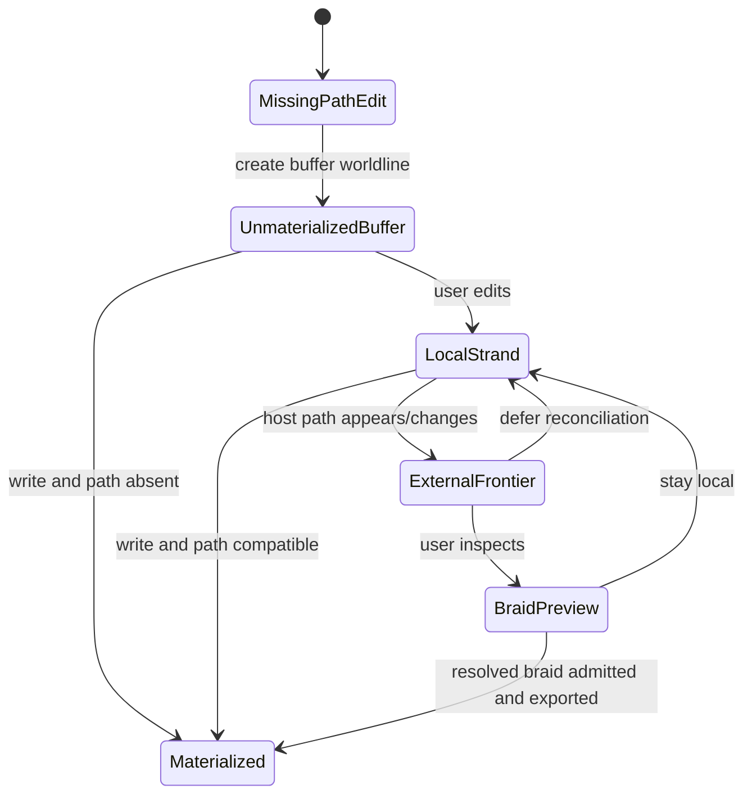

# WF-0123 - Unmaterialized File Buffers And External Edit Frontier

## Linked Issue

- [#159 WF-0123: Unmaterialized file buffers and external edit frontier](https://github.com/flyingrobots/jedit/issues/159) landed its
  safety foundation through [PR #160](https://github.com/flyingrobots/jedit/pull/160).

## Outcome

PR #160 landed the safe foundation:

- missing-path `:edit foo.txt` opens an unmaterialized Echo-backed buffer;
- opening a missing path does not write to disk;
- save/export preflights host fingerprints for missing and existing paths;
- externally changed, deleted, obstructed, or path-kind-conflicted host paths
  block materialization instead of being overwritten;
- blocked materialization never marks the buffer clean/materialized;
- blocked `:wq` does not quit;
- WSC recovery/export refuses bounded readings as materializable text;
- inactive and unmaterialized buffers survive file switching.

Remaining work is split into focused follow-up issues:

- [#161 Restart recovery UI](https://github.com/flyingrobots/jedit/issues/161)
- [#162 External Edit intake](https://github.com/flyingrobots/jedit/issues/162)
- [#163 Braid and diff reconciliation UX](https://github.com/flyingrobots/jedit/issues/163)
- [#165 File watcher and external move detection](https://github.com/flyingrobots/jedit/issues/165)

## Decision Summary

Jim should let `:edit foo.txt` create a causal buffer and local strand even
when `foo.txt` does not exist on disk. The path binding begins
unmaterialized, the user can edit immediately, and the file is only written to
the host filesystem by an explicit save/export materialization. If another
process creates or changes that path, Jim records the host fact as an
`External Edit` intent on the canonical worldline and offers a braid flow
instead of overwriting either frontier silently.

## Sponsored Human

A writer wants to start drafting `foo.txt` by naming it in `:edit`, without
having to pre-create a placeholder file or choose between losing local work
and overwriting disk changes made by another tool.

## Sponsored Agent

An agent needs an inspectable path-binding and frontier contract so it can
open, edit, save, and reconcile files through Echo-backed causal history
without inferring truth from filesystem existence or hidden editor dirtiness.

## Hill

By the end of this design arc, a user can create, edit, recover, save, and
reconcile a not-yet-materialized file through `:edit`, `:write`, the history
drawer, and braid prompts. The repo proves the behavior with command-line,
workspace text, restart/recovery, and worldline UI witnesses.

## Current Truth

At commit `d0e4424b462795bfd814edebc698446ac5dfac20`, `:edit` can name a
file that is not already in the current directory listing. The command
dispatcher resolves the path and forwards a synthetic file entry to the normal
file-open path:

- [`src/app/workspace/command-line-dispatch.ts#L78`](https://github.com/flyingrobots/jedit/blob/d0e4424b462795bfd814edebc698446ac5dfac20/src/app/workspace/command-line-dispatch.ts#L78)
- [`src/app/workspace/command-line-dispatch.ts#L144`](https://github.com/flyingrobots/jedit/blob/d0e4424b462795bfd814edebc698446ac5dfac20/src/app/workspace/command-line-dispatch.ts#L144)

The bug is lower in the text-open command. `openWorkspaceText` calls
`editorFile.loadEditorFile(request.filePath)` before opening the Echo-backed
buffer. If the host path is missing, the catch block converts that exception
into an open obstruction before any causal buffer or local strand can exist:

- [`src/app/workspace/workspace-text-commands.ts#L200`](https://github.com/flyingrobots/jedit/blob/d0e4424b462795bfd814edebc698446ac5dfac20/src/app/workspace/workspace-text-commands.ts#L200)
- [`src/app/workspace/workspace-text-commands.ts#L229`](https://github.com/flyingrobots/jedit/blob/d0e4424b462795bfd814edebc698446ac5dfac20/src/app/workspace/workspace-text-commands.ts#L229)

The file adapter also exposes only `loadEditorFile` and `saveEditorFile`.
There is no app-visible distinction between "missing path", "existing path",
"external path was created after my basis", and "read failed":

- [`src/ports/editor-file.ts#L1`](https://github.com/flyingrobots/jedit/blob/d0e4424b462795bfd814edebc698446ac5dfac20/src/ports/editor-file.ts#L1)

The optimistic typing design already says local projection can be a strand
braided with canonical truth. This design extends that doctrine from typed
characters to path materialization and host filesystem frontiers:

- [`docs/design/0146-optimistic-strand-worldline-phases.md`](0146-optimistic-strand-worldline-phases.md)

## Problem

Filesystem existence is currently treated as an open precondition. That makes
the host filesystem the gatekeeper for causal buffer creation, even though Jim
and Echo want causal history to be the source of truth and filesystem writes
to be materializations.

The broken user story is:

```text
:edit foo.txt
-> error: cannot open foo.txt because it does not exist
```

The intended story is:

```text
:edit foo.txt
-> creates buffer worldline for /cwd/foo.txt
-> path binding is unmaterialized
-> user edits a local strand
-> :write materializes /cwd/foo.txt if the host frontier is compatible
```

The harder case is when the host frontier changes while Jim has a local
unmaterialized or dirty strand:

```text
Jim:       /repo/foo.txt missing at basis H0
User:      drafts local strand L1
External:  creates /repo/foo.txt with content E1
Jim:       records External Edit on canonical mainline
Jim UI:    "frontier advanced; braid external mainline with local strand?"
```

Jim must not pretend the external file is the same thing as the local strand,
and must not silently save over it.

## Scope

This design arc includes:

- missing-path `:edit` opening a causal buffer;
- an unmaterialized path-binding state visible in footer/history surfaces;
- save/export materialization from a chosen causal basis;
- collision detection when disk changed or appeared since the buffer basis;
- an `External Edit` causal event for host-originated file content;
- worldline/history UI for canonical, local, external, and braid frontiers;
- restart/recovery behavior for unmaterialized buffers.

## Non-Goals

This design arc does not include:

- making Git the live reconciliation mechanism;
- writing placeholder files on open;
- auto-admitting external edits into the user's local strand;
- silently overwriting host files whose frontier changed;
- full filesystem watching as a required first slice;
- multi-file transaction UX for project-wide external changes.

Filesystem watchers can become an optimization later. The contract must still
work when external changes are detected only during save, focus, refresh, or
explicit read.

## Product Contract

Jim separates four facts that classic editors usually collapse:

| Fact | Question | Example |
| --- | --- | --- |
| Buffer worldline | What causal document am I editing? | `buffer:/repo/foo.txt` |
| Path binding | Is a host path associated with it? | `/repo/foo.txt` |
| Materialization | Does that path currently exist on disk? | `unmaterialized` |
| Frontier | Which basis does disk represent? | `external@e7`, `main@t4` |

Opening a missing file creates the first two facts but not the third:

```text
buffer worldline: /repo/foo.txt
path binding:     /repo/foo.txt
materialization:  unmaterialized
projection:       canonical empty + local strand
```

The buffer is real even before disk exists.

## Scenario Matrix

| Scenario | Current behavior | Intended behavior |
| --- | --- | --- |
| `:edit foo.txt` and path is missing | Open obstruction. | Open empty unmaterialized buffer on a local strand. |
| Type then quit without save | Classic dirty prompt semantics. | Local causal history remains recoverable; no disk file appears. |
| Type then `:write` and path still missing | Save writes file after edit. | Materialize chosen basis, record checkpoint/export evidence. |
| Type then external process creates path | Save can overwrite by accident. | Record `External Edit`; prompt braid/reconcile before materializing. |
| Existing file opens cleanly | Host contents seed Echo buffer. | Same, but basis records host frontier evidence. |
| Existing file changes externally before local edits | Hidden until reopen/save. | Canonical frontier advances; user can observe or braid. |
| Existing file changes externally after local edits | Collision risk. | Local strand remains; external edit is canonical; braid preview offered. |
| Existing file is deleted externally | Future read/save may fail. | Record external delete as frontier event; local strand can rematerialize or abandon. |
| Parent directory is missing | Generic open error. | Obstruct materialization/open with a path-binding issue, not a buffer-history loss. |
| Host path is read-only | Save error. | Open can still create/view causal buffer; materialization obstructs with permission fact. |

## User Experience

### Missing-Path Open

```text
:edit foo.txt
```

The editor opens immediately with an empty buffer. The footer names the state:

```text
/repo/foo.txt [basis:reading | head:basis | worldline:main | export:pending | admit:main | tick:t0]
```

After typing:

```text
/repo/foo.txt [basis:reading | head:local | worldline:main | export:pending | admit:main | tick:t0]
```

The history/worldline drawer shows:

```text
Worldlines
projection: canonical@t0 + local optimistic | braid active | phase:unconfirmed
s phase       r name           basis          head  span      evidence           note
> settled     C main           main           0     tick:t0   canonical@t0       clear
  unconfirmed L local          canonical@t0   -     local     request:3          optimistic
  unconfirmed B visible braid  main+local     -     local     canonical@t0       active
```

### First Save

If the host path is still absent, `:write` materializes the selected basis:

```text
:write
saved /repo/foo.txt from braid main+local
```

The save creates causal checkpoint/export evidence and changes filesystem
materialization posture from `unmaterialized` to `materialized`.

### External Creation Before Save

If another process creates `/repo/foo.txt` while Jim has local draft text,
Jim should not write over it on save. The save path detects the host frontier
and records the external content as a canonical event:

```text
External Edit: /repo/foo.txt materialized outside Jim
frontier advanced: main@t0 -> main@t1
local strand: local@3
```

The user sees a prompt or notification:

```text
foo.txt changed outside Jim.
Canonical frontier advanced by External Edit.
Open braid preview with your local strand?
```

The default action should be inspection, not overwrite.

### External Change While Open

Detection can happen by watcher, directory refresh, focus regain, explicit
read, or save preflight. The same facts are emitted regardless of detection
mechanism:

```text
host content observed
-> External Edit intent
-> canonical admission attempt
-> local view remains on local strand or visible braid
-> user chooses braid/admit/rewind/materialize
```

## Data / State Model

| Category | Description |
| --- | --- |
| Source of truth | Echo causal history and retained WSC evidence. |
| Host materialization | A projection of a causal basis to a filesystem path. |
| Path binding | A durable association between a buffer worldline and desired path. |
| Local strand | User's active edits, even when path is not materialized. |
| Canonical frontier | Main worldline basis, including admitted external edits. |
| Derived state | Footer labels, history rows, command prompts, file tree badges. |
| Invalid states | Path exists with unknown frontier and save overwrites without prompt. |
| Reset behavior | Rewind/abandon changes moves observer; it does not delete causal history. |
| Serialization | WSC records must retain enough path-binding and materialization evidence to recover unmaterialized buffers. |

Suggested path-binding states:

| State | Meaning |
| --- | --- |
| `unbound` | Buffer has no desired host path. |
| `unmaterialized` | Buffer has a desired path but no host artifact at the observed basis. |
| `materialized` | Host path matches a known causal basis/export. |
| `external-frontier` | Host path differs from the last known materialized basis. |
| `materialization-obstructed` | Jim cannot read/write the host path due to permission, missing parent, type mismatch, or adapter error. |

State sketch:



## Runtime / API Contract

The current `EditorFilePort` is too coarse for this feature. The next contract
should distinguish observation from materialization:

```ts
type HostPathObservation =
  | { kind: 'missing'; filePath: string; observedAtMs: number }
  | { kind: 'file'; filePath: string; lines: readonly string[]; readOnly: boolean; digest: string; observedAtMs: number }
  | { kind: 'directory'; filePath: string; observedAtMs: number }
  | { kind: 'obstructed'; filePath: string; issue: RuntimeIssue };
```

Open should accept both host-backed and missing observations:

```ts
type WorkspaceTextOpenBasis =
  | { kind: 'host-file'; observation: HostPathObservation & { kind: 'file' } }
  | { kind: 'missing-path'; filePath: string; initialText: '' };
```

Save/export should include the observed host frontier it believes it is
materializing over:

```ts
interface WorkspaceTextMaterializeRequest {
  readonly filePath: string;
  readonly bufferId: string;
  readonly basisReceiptId?: string;
  readonly expectedHostDigest?: string;
}
```

If the current host digest does not match `expectedHostDigest`, materialization
does not overwrite. It emits an external frontier result and offers a braid
path.

## External Edit Intent

An external filesystem change is not "just disk". It is a causal input into
Jim's canonical worldline.

Minimal fact shape:

```ts
interface ExternalEditIntent {
  readonly kind: 'external-edit';
  readonly filePath: string;
  readonly previousHostDigest?: string;
  readonly nextHostDigest: string;
  readonly observedAtMs: number;
  readonly source: 'save-preflight' | 'watcher' | 'focus-refresh' | 'manual-refresh';
}
```

Admission semantics:

- If the user has no local divergence, Jim may fast-forward the canonical
  observer after the external intent settles.
- If the user has local divergence, Jim keeps the local strand visible and
  offers braid preview.
- If external content cannot be read, Jim records an obstruction fact rather
  than inventing text.

## Cycle Plan

### Cycle 1 - Missing-Path Open

Hill: `:edit foo.txt` opens a recoverable unmaterialized buffer when the path
is missing.

Deliverables:

- split host path observation from file load;
- open missing paths with empty initial text;
- footer/history label `export:pending`;
- command-line regression for `:edit missing.txt`;
- no host file write before save.

### Cycle 2 - First Save And Collision Preflight

Hill: `:write` materializes an unmaterialized buffer only when the host
frontier is compatible.

Deliverables:

- save preflight observes host digest/existence;
- absent path writes materialized file and records checkpoint/export evidence;
- appeared/changed path returns an external-frontier result instead of
  overwriting;
- command-line and workspace text tests cover absent, compatible, and changed
  host paths.

### Cycle 3 - External Edit Intake

Hill: host-created or host-edited content becomes an `External Edit` causal
event on canonical mainline.

Deliverables:

- external edit intent type and history entry;
- admission/settlement evidence retained in WSC;
- restart recovers external frontier facts;
- manual refresh/save preflight can detect external changes even without a
  watcher.

### Cycle 4 - Frontier Braid UX

Hill: when canonical frontier advances while the user has local strand edits,
Jim shows the local, canonical, external, and visible braid paths and lets the
user choose reconciliation.

Deliverables:

- notification/prompt for frontier advancement;
- history/worldline drawer rows for external edit and braid preview;
- `:why` explains external frontier plus local strand;
- braid preview/admit/defer actions;
- accessibility-friendly lower-mode text for no-color terminals.

## Lower Modes

Lower modes must expose the same facts without relying on color:

- footer text uses explicit `export:pending`, `external-frontier`, and
  `braid active` labels;
- history drawer rows include `External Edit` as text, not just color;
- `:why` states whether the visible buffer is canonical, local, external, or
  a braid;
- JSON witnesses use stable enum-like strings for path-binding state and
  frontier state.

## Accessibility Posture

| Concern | Posture |
| --- | --- |
| Semantic labels | Path materialization and frontier state appear as text. |
| Focus order | Existing command line, editor, history drawer order remains. |
| Hidden information | No conflict state is color-only. |
| Keyboard behavior | All reconcile actions have command-line equivalents. |
| Agent inspectability | External edit, materialization, and braid state use structured facts. |

## Localization / Directionality Posture

The first slice can reuse existing terse English status tokens, but any prompt
or notification must enter the i18n catalog. Directionality-sensitive surfaces
must keep path and receipt ids as literal spans and localize the surrounding
message.

## Test Plan

Add focused tests before implementation expands:

- `:edit missing.txt` opens an empty unmaterialized buffer and queues no host
  write.
- Rapid typing into an unmaterialized buffer follows the optimistic strand
  projection rules from WF-0122.
- `:write` creates the host file only when the path is still missing.
- `:write` detects that the host path appeared and emits external-frontier
  state.
- External edit with no local divergence advances the canonical observer.
- External edit with local divergence keeps the local strand visible and opens
  braid prompt/view state.
- Restart recovers an unmaterialized buffer and its path binding.
- `:why` explains missing-path buffer, external frontier, and braid states.

## Open Questions

- Should `:edit foo.txt` create a canonical empty head immediately, or should
  the empty basis live as an unadmitted local path-binding intent until the
  first edit or save?
- Is external delete its own `External Delete` intent, or an `External Edit`
  with a tombstone body?
- Should Jim ever auto-braid external changes when local edits are only
  additive and non-overlapping, or should braid/admit remain explicit?
- What retention tier is required so an unmaterialized buffer survives a long
  period without host materialization?

## Acceptance Checklist

- [ ] Missing-path `:edit` opens a causal buffer instead of obstructing.
- [ ] Missing-path open does not create a host file.
- [ ] Footer/history distinguish unmaterialized path binding from dirty text.
- [ ] Save materializes only after host frontier compatibility check.
- [ ] Host-created/changed path is recorded as `External Edit`.
- [ ] Save collision never overwrites external content silently.
- [ ] Local strand remains visible after external frontier advancement.
- [ ] Braid UX lets the user inspect, admit, defer, or rewind.
- [ ] Restart/recovery preserves unmaterialized path bindings.
- [ ] `:why` explains the current path/frontier/braid state.
