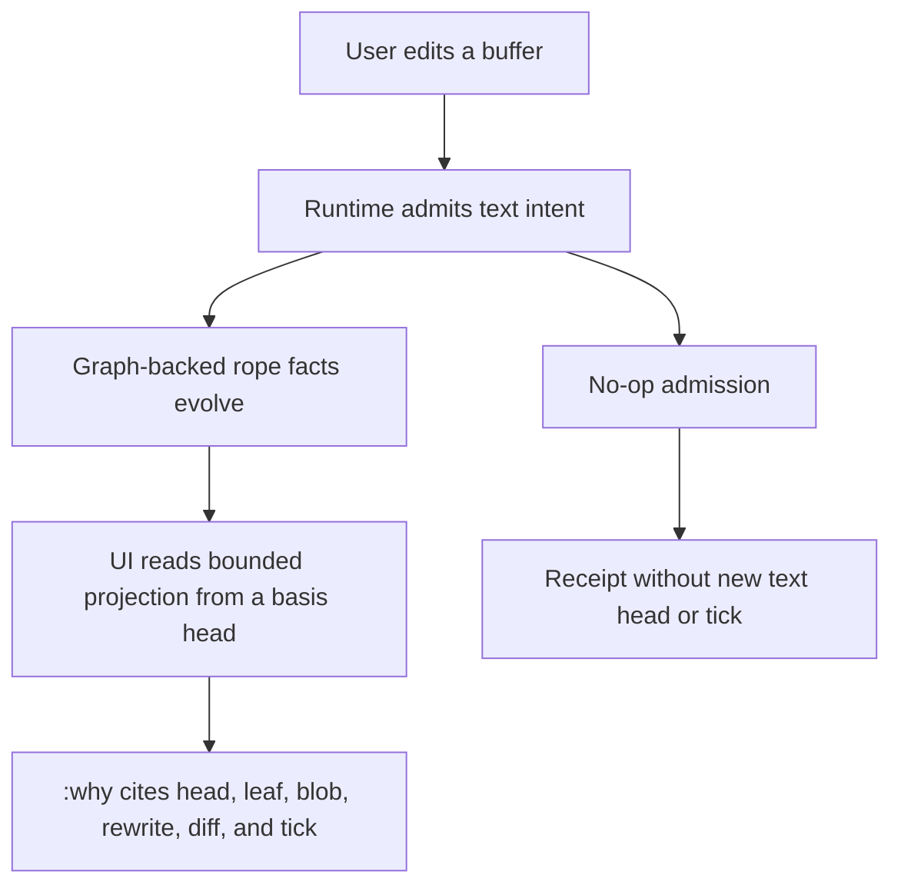
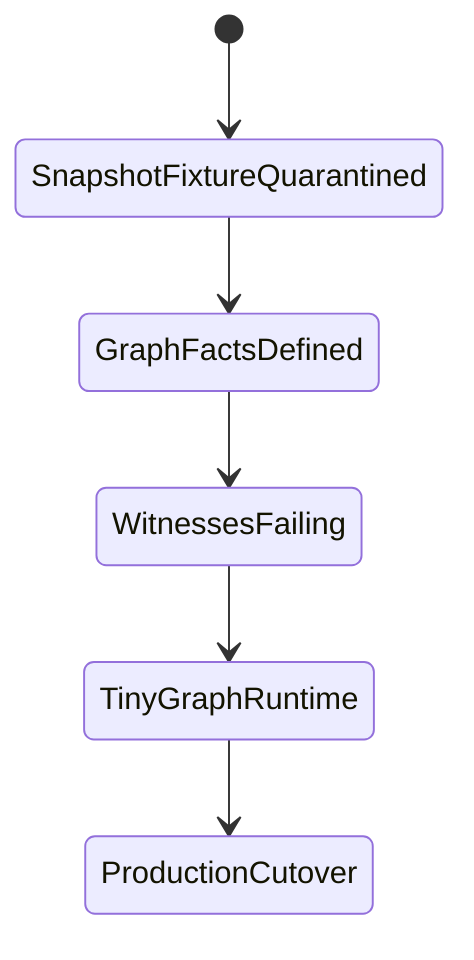

# HT-0149 - Graph-Backed Rope Runtime Discovery

## Linked Issue

- https://github.com/flyingrobots/jedit/issues/206

## Decision Summary

jedit's production text authority must move from retained full-text snapshots to
a graph-backed rope runtime whose heads, nodes, blobs, rewrites, diffs,
checkpoints, and receipts are admitted as inspectable causal facts. Until a real
graph-backed create/read/replace/checkpoint path exists, new UI causal-honesty
work must not claim storage truth that the runtime cannot prove.

## Sponsored Human

A Jim daily driver wants edits, saves, history, and `:why` explanations to remain
fast and causally trustworthy on real files, without depending on retained
full-buffer snapshots that make the editor slower and less honest as files grow.

## Sponsored Agent

An agent needs stable graph facts, basis IDs, byte ranges, receipts, and witness
APIs so it can inspect text authority and explain changes without scraping
rendered projections or inferring private runtime state.

## Hill

By the end of this cycle, jedit can create a graph-backed buffer, read a bounded
text window, replace a narrow byte range, checkpoint the resulting head, and prove
through witnesses that unchanged rope structure and authoritative bytes were not
duplicated as full snapshots.

## Current Truth

An external audit called out a real architectural drift in jedit's current text
runtime. The blunt version is correct: the code currently named around
`RopeHead`, `BufferRoot`, `replaceRangeAsTick`, and `HotTextBufferState` does not
implement a graph-backed rope runtime.

The current hot text runtime still uses full-text snapshots:

- [`src/domain/text-edit-contract.ts`](https://github.com/flyingrobots/jedit/blob/e93b2e1a138a762d7a33da6179d3ad8b8b2a9c6e/src/domain/text-edit-contract.ts#L84)
  encodes the entire buffer into UTF-8 bytes, splices the requested range,
  decodes a new full string, and wraps that string in a new `BufferRoot`.
- [`src/ports/hot-text-runtime.ts`](https://github.com/flyingrobots/jedit/blob/e93b2e1a138a762d7a33da6179d3ad8b8b2a9c6e/src/ports/hot-text-runtime.ts#L6)
  defines `HotTextBufferState.roots` as an array of retained roots.
- [`src/adapters/in-memory-hot-text-runtime.ts`](https://github.com/flyingrobots/jedit/blob/e93b2e1a138a762d7a33da6179d3ad8b8b2a9c6e/src/adapters/in-memory-hot-text-runtime.ts#L76)
  appends the new full root to that retained array after an admitted edit.
- [`src/adapters/installed-jedit-contract-echo-transport.ts`](https://github.com/flyingrobots/jedit/blob/e93b2e1a138a762d7a33da6179d3ad8b8b2a9c6e/src/adapters/installed-jedit-contract-echo-transport.ts#L159)
  still defaults the installed jedit contract transport to that in-memory
  runtime.

That means the current implementation has O(N) edit cost and O(N) retained text
per edit for buffer size N. For repeated small edits on a large file, retained
memory grows with file size times edit count. That is not the intended jedit
architecture.

## What Was Intended

The original design intent is stronger than "a text runtime behind an Echo-shaped
API." The rope should be modeled with Echo graph primitives through the jedit
contract layer. Echo intents should evolve that graph by rewriting rope facts and
producing a new rope model in the Echo-hosted causal history.

In that model:

- `BufferWorldline` is the logical editable object.
- `RopeHead` identifies one graph-backed text state.
- `RopeBranch`, `RopeLeaf`, and `TextBlob` are graph facts, not names for a full
  JavaScript string.
- `replaceRangeAsTick` is an Echo intent that reads a base head, range-closes
  over touched rope nodes, creates the new local rope facts, emits rewrite and
  diff evidence, and advances the worldline head.
- `RopeRewrite`, `RopeDiff`, tick receipts, checkpoints, anchors, strands, and
  admissions are retained causal evidence.
- Materialized strings are readings or projections. They are allowed for UI
  rendering, export, save, tests, and caches, but they are not the source of
  editor truth.

Echo still remains generic. jedit owns the text and rope contract vocabulary;
Echo hosts generic admission, scheduling, receipts, retention, and causal
storage. The important correction is that the jedit contract vocabulary must be
real graph-backed state, not labels over full string snapshots.

## Why This Matters

This is not a minor performance issue.

The current runtime breaks the product's intended causal posture in several
ways:

- It makes the authoritative retained state a list of full materialized strings
  rather than compact causal graph evidence.
- It makes the rope vocabulary misleading because no rope graph is actually
  being evolved.
- It makes `:why`, historical basis preview, strands, braids, gutter evidence,
  and retention policy harder to make honest because they must recover history
  from full roots instead of reading graph facts.
- It can make dogfooding painful on larger files because every edit copies and
  retains the whole buffer.
- It risks making UI language more causally honest than the storage model below
  it.

The existing docs already point in the right direction. In particular:

- [`0003-echo-backed-rope-worldline-contract.md`](https://github.com/flyingrobots/jedit/blob/e93b2e1a138a762d7a33da6179d3ad8b8b2a9c6e/docs/design/0003-echo-backed-rope-worldline-contract/echo-backed-rope-worldline-contract.md#L28)
  says witnessed causal history is canonical and materialized projections are
  not editor truth.
- [`jedit-echo-graph-model.md`](https://github.com/flyingrobots/jedit/blob/e93b2e1a138a762d7a33da6179d3ad8b8b2a9c6e/docs/design/jedit-echo-graph-model.md#L31)
  describes the desired `BufferWorldline -> RopeHead -> Rope DAG` shape and
  states that `ReplaceRangeAsTick` should reuse untouched subtrees.
- [`0027-echo-hosted-production-cutover.md`](https://github.com/flyingrobots/jedit/blob/e93b2e1a138a762d7a33da6179d3ad8b8b2a9c6e/docs/design/0027-echo-hosted-production-cutover.md#L35)
  says the local in-memory text model is no longer a production authority target.
- [`structural-history-graphql-authority.md`](https://github.com/flyingrobots/jedit/blob/e93b2e1a138a762d7a33da6179d3ad8b8b2a9c6e/docs/design/structural-history-graphql-authority.md#L11)
  says the TypeScript model is transitional evidence, not durable authority.

The problem is that implementation reality has not caught up to those design
claims.

## Problem

The installed jedit text authority still admits edits by copying and retaining
whole materialized strings. That contradicts the graph-backed rope architecture,
turns rope/worldline names into misleading labels, makes byte-range provenance
harder to prove, and allows future UI work to present causal claims that the
storage layer cannot support.

## Scope

This cycle includes:

- documenting the current full-snapshot runtime as fixture-only;
- defining the production guard that prevents implicit snapshot authority;
- defining authoritative UTF-8 byte coordinates and projection coordinates;
- defining concrete graph-backed rope fact shapes and validation boundaries;
- defining byte authority for `TextBlob` facts;
- defining no-op admission semantics without minting text ticks;
- defining retention, subtree identity, materialization, checkpoint, and `:why`
  witnesses;
- linking the active repo bearing to this hard gate.

## Non-Goals

This cycle does not include:

- implementing the final production graph-backed runtime;
- optimizing the full-snapshot runtime;
- changing rendered editor UI, gutter UI, footer UI, or settings UI;
- solving compaction, braids, collaborative merges, search indexes, syntax
  caches, or structural highlighting;
- moving jedit text semantics into Echo core.

## User Experience / Product Shape

This design does not add a new rendered surface. The user-facing impact is a
hard execution gate: Jim should avoid additional causal-honesty UI claims until
runtime truth can back those claims with graph facts.

### User Journey



### Wide UI Mockup

Not applicable. This cycle changes runtime authority design and process
signposting, not rendered TUI layout.

### Narrow UI Mockup

Not applicable. This cycle changes runtime authority design and process
signposting, not rendered TUI layout.

### Accessibility Considerations

No rendered accessibility behavior changes in this cycle. Future UI work that
uses this runtime must expose the same causal facts through keyboard-accessible
commands and machine-readable witnesses, not color-only or pixel-only cues.

## Runtime / API Contract

We should not patch this by making full-string replacement faster. That would
preserve the wrong architecture. The response needs to be a graph-backed runtime
cutover.

The hard gate is:

```text
Do not begin more UI causal-honesty work until the text runtime has at least one
real graph-backed path for create, read, replace, and checkpoint.
```

Until then, UI labels such as `basis`, `head`, `tick`, `checkpoint`, and
`worldline` must either be backed by graph facts or explicitly marked as
transitional projection posture.

### 1. Rename And Fence The Fixture

The current in-memory full-snapshot runtime must be renamed so accidental
production use is visibly wrong. Acceptable names include:

- `FullSnapshotHotTextRuntimeFixture`
- `InMemoryFullSnapshotTextRuntime`
- `TransitionalSnapshotTextRuntime`

Unacceptable names include:

- `InMemoryHotTextRuntime`
- `HotTextRuntime`
- `DefaultHotTextRuntime`
- `ProductionHotTextRuntime`

The name should make the wrong wiring ugly.

Planned guardrails:

- rename or document the runtime as full-snapshot/transitional;
- add a production guard against implicit default use;
- keep focused tests able to inject it deliberately;
- make release and preflight checks fail if product code starts treating it as
  durable text authority again.

The installed/default transport must not silently instantiate the full-snapshot
runtime. If a temporary escape hatch is required, it should be explicit:

```typescript
if (process.env.JEDIT_ALLOW_FULL_SNAPSHOT_TEXT_AUTHORITY !== "1") {
  throw new Error(
    "FullSnapshotHotTextRuntimeFixture cannot be used as production text authority.",
  );
}
```

Tests may opt in deliberately. Product startup should not.

### 2. Define Coordinates Before Facts

The graph-backed rope design must define its coordinate system before it defines
facts. The current code uses UTF-8 byte ranges, JavaScript strings are UTF-16,
and editor UI needs line/column positions. Those must not blur together.

Authoritative mutation coordinates should be UTF-8 byte offsets. UI coordinates
should be adapters over that storage coordinate.

The design should introduce branded coordinate types:

```typescript
type ByteOffset = number & { readonly __brand: "utf8-byte-offset" };
type Utf16Offset = number & { readonly __brand: "utf16-code-unit-offset" };

interface LineColumn {
  readonly line: number & { readonly __brand: "zero-based-line-index" };
  readonly columnUtf16: Utf16Offset;
}
```

Rules:

- rope mutation ranges are half-open UTF-8 byte ranges;
- text blobs store UTF-8 bytes;
- `LineColumn.line` is a zero-based logical line index;
- `LineColumn.columnUtf16` is a zero-based UTF-16 code-unit offset from the start
  of that logical line;
- line/column and UTF-16 offsets are UI or protocol projections, not storage
  authority;
- line projection treats CRLF as one logical line break and treats bare CR and
  bare LF as one logical line break each;
- newline projection never mutates stored blob bytes or save/export bytes;
- grapheme-aware movement is a command-planning concern over readings, not the
  authoritative storage coordinate;
- every conversion must cite the basis head or reading it was computed from.

### 3. Define Real Typed Graph Facts

Create a full graph-backed rope runtime design that specifies concrete fact
shapes. The exact names may evolve, but the design must be precise enough for
witnesses to target.

Example fact skeleton:

```typescript
type WorldlineId = string & { readonly __brand: "WorldlineId" };
type RopeHeadId = string & { readonly __brand: "RopeHeadId" };
type RopeNodeId = string & { readonly __brand: "RopeNodeId" };
type TextBlobId = string & { readonly __brand: "TextBlobId" };
type TickId = string & { readonly __brand: "TickId" };
type RopeRewriteId = string & { readonly __brand: "RopeRewriteId" };
type RopeDiffId = string & { readonly __brand: "RopeDiffId" };
type AdmissionId = string & { readonly __brand: "AdmissionId" };
type Hash = string & { readonly __brand: "Hash" };

interface TextByteRange {
  readonly startByte: ByteOffset;
  readonly endByte: ByteOffset;
}

interface BufferWorldlineFact {
  readonly kind: "jedit.text.BufferWorldline";
  readonly schemaVersion: 1;
  readonly worldlineId: WorldlineId;
  readonly createdAtTick: TickId;
  readonly initialHeadId: RopeHeadId;
}

interface RopeHeadFact {
  readonly kind: "jedit.text.RopeHead";
  readonly schemaVersion: 1;
  readonly headId: RopeHeadId;
  readonly worldlineId: WorldlineId;
  readonly rootNodeId: RopeNodeId;
  readonly basisHeadId?: RopeHeadId;
  readonly createdByTickId: TickId;
  readonly byteLength: number;
  readonly lineCount: number;
  readonly contentHash: Hash;
}

interface RopeBranchFact {
  readonly kind: "jedit.text.RopeBranch";
  readonly schemaVersion: 1;
  readonly nodeId: RopeNodeId;
  readonly left: RopeNodeId;
  readonly right: RopeNodeId;
  readonly byteLength: number;
  readonly lineCount: number;
  readonly height: number;
  readonly contentHash: Hash;
}

interface RopeLeafFact {
  readonly kind: "jedit.text.RopeLeaf";
  readonly schemaVersion: 1;
  readonly nodeId: RopeNodeId;
  readonly blobId: TextBlobId;
  readonly byteStart: ByteOffset;
  readonly byteLength: number;
  readonly lineCount: number;
  readonly contentHash: Hash;
}

interface InlineTextBlobStorage {
  readonly kind: "inline-utf8-bytes";
  readonly bytes: Uint8Array;
}

interface StoredTextBlobStorage {
  readonly kind: "content-addressed-blob-store";
  readonly storeId: "jedit.text.blob-store.v1";
  readonly contentRef: string;
}

type TextBlobStorage = InlineTextBlobStorage | StoredTextBlobStorage;

interface TextBlobFact {
  readonly kind: "jedit.text.TextBlob";
  readonly schemaVersion: 1;
  readonly blobId: TextBlobId;
  readonly encoding: "utf8";
  readonly byteLength: number;
  readonly contentHash: Hash;
  readonly storage: TextBlobStorage;
}

interface RopeRewriteFact {
  readonly kind: "jedit.text.RopeRewrite";
  readonly schemaVersion: 1;
  readonly rewriteId: RopeRewriteId;
  readonly worldlineId: WorldlineId;
  readonly basisHeadId: RopeHeadId;
  readonly nextHeadId: RopeHeadId;
  readonly admittedByTickId: TickId;
  readonly range: TextByteRange;
  readonly replacementBlobId: TextBlobId;
  readonly diffId: RopeDiffId;
  readonly contentHash: Hash;
}

interface RopeDiffSpan {
  readonly kind: "equal" | "delete" | "insert";
  readonly basisRange?: TextByteRange;
  readonly nextRange?: TextByteRange;
  readonly blobId?: TextBlobId;
  readonly contentHash: Hash;
}

interface RopeDiffFact {
  readonly kind: "jedit.text.RopeDiff";
  readonly schemaVersion: 1;
  readonly diffId: RopeDiffId;
  readonly rewriteId: RopeRewriteId;
  readonly basisHeadId: RopeHeadId;
  readonly nextHeadId: RopeHeadId;
  readonly spans: readonly RopeDiffSpan[];
  readonly contentHash: Hash;
}

interface TickReceiptFact {
  readonly kind: "jedit.text.TickReceipt";
  readonly schemaVersion: 1;
  readonly tickId: TickId;
  readonly admissionId: AdmissionId;
  readonly worldlineId: WorldlineId;
  readonly basisHeadId: RopeHeadId;
  readonly nextHeadId: RopeHeadId;
  readonly rewriteId: RopeRewriteId;
  readonly admittedAtSequence: number;
}
```

The full design must also define facts for:

- `RopeCheckpoint`;
- anchors;
- strands, braids, and admissions when their implementation slice begins.

Echo remains generic. jedit owns these fact shapes and text-specific witnesses.

Runtime construction and validation are part of the contract. The branded types
above are compile-time helpers only; decoded runtime payloads must pass through
jedit-owned constructors or validators before becoming facts.

Required constructor and validator path:

```typescript
type FactValidationErrorCode =
  | "invalid-kind"
  | "invalid-schema-version"
  | "invalid-id"
  | "invalid-reference"
  | "invalid-metric"
  | "invalid-hash"
  | "hash-mismatch";

type FactValidationResult<TFact> =
  | { readonly ok: true; readonly fact: TFact }
  | { readonly ok: false; readonly code: FactValidationErrorCode };

interface RopeFactReadModel {
  hasFact(id: string): boolean;
}

interface TextBlobStorePort {
  readBlobBytes(storage: StoredTextBlobStorage): Uint8Array | null;
}

interface RopeFactValidationContext {
  readonly writeSet: readonly object[];
  readonly admittedBasis: RopeFactReadModel;
  readonly blobStore: TextBlobStorePort;
}

declare function makeTextBlobFact(bytes: Uint8Array): TextBlobFact;
declare function validateRopeFact(
  payload: object,
  context: RopeFactValidationContext,
): FactValidationResult<
  | BufferWorldlineFact
  | RopeHeadFact
  | RopeBranchFact
  | RopeLeafFact
  | TextBlobFact
  | RopeRewriteFact
  | RopeDiffFact
  | TickReceiptFact
>;
```

Validation rules:

- `kind` and `schemaVersion` are mandatory runtime tags;
- IDs must be non-empty canonical IDs in the expected namespace;
- numeric metrics must be non-negative integers;
- branch children, head roots, leaf blobs, rewrites, diffs, and receipts must
  reference facts available in the same write set or an already admitted basis;
- the validator receives those scopes through `RopeFactValidationContext` and
  must not consult ambient process state;
- `TextBlobFact.blobId` and `contentHash` must be derived from
  `encoding + bytes`, not trusted from caller input;
- inline blob facts must compute hash and length from their `Uint8Array` bytes;
- blob-store-backed facts must name the store adapter and content reference, and
  admission must fetch bytes through `context.blobStore`, verify length, and
  recompute the hash before the fact can become authority;
- a `textWindow` read over a missing or hash-mismatched blob is an obstruction,
  not a fallback to stale projection text;
- branch, leaf, and head hashes must be recomputed from child/blob references and
  metrics before admission;
- rewrite, diff, and tick receipt hashes and sequence numbers must be recomputed
  or range-checked against the admitted basis before admission;
- invalid facts are rejected before Echo admission and never become retained
  authority.

### 4. Separate Text Authority From Observations

No-op behavior needs causal precision. A no-op replacement should not mint a new
text head or rewrite evidence claiming text changed. The system may still record
an admitted no-op intent, rejected edit, idempotent command, observation, or
receipt.

The design should distinguish:

- `ReplaceRangeIntent`;
- `TextChangeAdmission`;
- `NoOpAdmissionReceipt`;
- `RejectedIntentReceipt`;
- `RopeRewrite | null`;
- `RopeDiff | null`;
- `WorldlineAdvance | null`;
- `TickReceipt | null`.

Rules:

- no text change means no new `RopeHead`;
- no changed range means no `RopeRewrite`;
- no text change means no new text tick, no tick sequence advance, and no reuse
  of a prior `TickId`;
- `TickReceipt` exists only for a text-changing admission that advances the
  worldline;
- `NoOpAdmissionReceipt` records request ID, basis head, range, replacement hash,
  and reason such as `unchanged-bytes`, but it is not a text tick;
- rejected intents use `RejectedIntentReceipt` and also do not mint text ticks;
- no-op evidence must not pollute the rope graph as if bytes changed.

### 5. Make Untouched Subtree Identity A Contract

Untouched subtree identity is the central rope property. If a narrow replacement
rebuilds the whole tree, it is not the intended runtime.

Witness shape:

```typescript
const before = await runtime.debugRopeShape(headA);
const result = await runtime.replaceRangeAsTick({
  worldlineId,
  basisHeadId: headA,
  range,
  replacement,
});
const after = await runtime.debugRopeShape(result.nextHeadId);

const preserved = compareUntouchedStructure({
  before,
  after,
  changedRange: range,
});

expect(preserved.rebuiltUntouchedSpans).toEqual([]);
expect(preserved.preservedSubtreeIds).toEqual(
  preserved.expectedUntouchedSubtreeIds,
);
```

This should be part of the contract, not an incidental optimization.

The witness must be recursive. `debugRopeShape` should expose each node's byte
span within the head, node ID, child IDs, hash, and structural-maintenance
evidence if a rebalance touched otherwise unchanged text. The comparison should
walk the before and after shapes, classify spans outside the edited range as
untouched, and require every unaffected subtree identity to survive unless a
retained structural-maintenance fact explicitly explains the replacement.

### 6. Make Retention Measurable

Do not rely on qualitative claims. Add an explicit witness around retained
authoritative bytes.

Example target:

```text
largeBufferSize = 10_000_000 bytes
edits = 1_000 single-byte edits
```

The full-snapshot runtime retains roughly 10 GB of authoritative text snapshots.
The graph-backed runtime should retain approximately:

- initial text blobs;
- changed leaves;
- path-copied branch nodes;
- rewrite and diff facts;
- receipts;
- indexes and checkpoints.

The exact byte count may vary, but the witness must assert retained
authoritative text is not O(buffer_size * edit_count).

### 7. Define Materialization Boundaries

Materialized strings are allowed only as readings or projections. Every
materialized string must answer:

- which `RopeHead` was read;
- which UTF-8 byte range was read;
- whether the materialization came from cache;
- how the cache was validated against the head.

Good:

```typescript
const text = await runtime.textWindow({
  basisHeadId,
  byteRange,
});
```

Bad:

```typescript
const text = state.roots[state.roots.length - 1].text;
```

This boundary is what makes `:why`, historical preview, save/export, and UI
evidence trustworthy.

### 8. Write Witnesses Before Most Implementation

The better implementation order is:

1. minimal design skeleton;
2. failing witnesses;
3. tiny graph-backed runtime;
4. refined design;
5. more witnesses;
6. production cutover.

The witnesses are architectural teeth, not after-the-fact documentation.

Required first witnesses:

- snapshot fixture cannot be constructed as default production authority;
- repeated edits do not retain one full-text snapshot per edit;
- untouched subtree identity survives a narrow replacement;
- no-op intent can produce admission evidence without a new head or rewrite;
- text-window reads cite a basis head and byte range;
- save/export reads from a causal basis without mutating text authority;
- `:why` can cite rewrite, diff, tick, head, leaf, and blob evidence for a byte
  range.

### 9. Build The Smallest Real Runtime First

Do not start by solving compaction, braids, collaborative merge, source
highlighting, and `:why` all at once. The first implementation win should be:

```text
create buffer
-> read window
-> replace small range
-> read window
-> prove untouched identity survived
-> checkpoint
```

Initial scope:

- immutable rope nodes;
- content-addressed blobs;
- binary branch tree;
- append-only graph fact store;
- single-range replacement;
- text-window read;
- checkpoint fact;
- debug-only shape inspection.

### 10. Mark Evidence Versus Indexes

The design must distinguish durable semantic facts from rebuildable acceleration
indexes.

Durable truth:

- `RopeHead`;
- `RopeBranch`;
- `RopeLeaf`;
- `TextBlob`;
- `RopeRewrite`;
- `RopeDiff`;
- `TickReceipt`;
- `RopeCheckpoint`.

Rebuildable indexes and caches:

- line offset index;
- syntax highlighting cache;
- materialized window cache;
- source map cache;
- render layout cache;
- search index.

Rule:

```text
If deleting it changes history, it is evidence.
If deleting it only makes reads slower, it is an index.
```

### 11. Define Balance And Checkpoint Policy

A rope that path-copies forever without balance policy eventually becomes a
linked list with better names. The design must define:

- target leaf size;
- maximum and minimum leaf size;
- branch weight rules;
- balance invariant;
- when replacement triggers rebalance;
- whether rebalance creates causal facts;
- whether rebalance is visible to `:why`.

Recommended posture:

- edits create semantic rewrite evidence;
- rebalancing creates structural maintenance evidence;
- both can be retained;
- normal UI hides structural maintenance unless debugging.

Checkpoint semantics also need precision. A checkpoint is not new text truth. It
is a durable named basis for efficient future reads, retention, or export.

```typescript
interface RopeCheckpointFact {
  readonly kind: "jedit.text.RopeCheckpoint";
  readonly checkpointId: string;
  readonly worldlineId: WorldlineId;
  readonly headId: RopeHeadId;
  readonly createdByTickId: TickId;
  readonly reason:
    | "manual-save"
    | "autosave"
    | "retention-boundary"
    | "import"
    | "test-fixture";
}
```

Save/export should read from a head or checkpoint. It should not mutate text
authority unless the product explicitly records a checkpoint.

### 12. Make `:why` An Acceptance Target

Do not let `:why` become a bolt-on archaeology tool. For a byte range, the
runtime should be able to answer:

- this range is present in head H;
- it descends from leaf L and blob B;
- it was introduced or last touched by rewrite R;
- rewrite R was admitted by tick T;
- tick T had basis head H0;
- here is the diff evidence;
- here are related checkpoints.

This is the runtime acceptance demo.

### 13. Implement The Cutover In Slices

The likely implementation sequence is:

1. rename the snapshot runtime and add the production guard;
2. add the fixture quarantine witness;
3. define coordinate and fact skeletons;
4. add retention, subtree identity, materialization, no-op, and `:why` witnesses;
5. implement graph-backed `createBufferWorldline`;
6. implement graph-backed `textWindow` over a `RopeHead`;
7. implement graph-backed single-range `replaceRangeAsTick`;
8. implement graph-backed `createCheckpoint`;
9. cut the production session over to the graph-backed runtime;
10. quarantine or delete full-root production authority paths;
11. update `:why`, gutter evidence, worldline drawers, and save/export posture to
    consume graph facts directly;
12. define compaction and cold-retention rules.

### 14. Useful Later Ideas

These are not first-slice requirements, but they should stay visible:

- content-addressed `TextBlob` storage where `blobId = hash(encoding + bytes)`;
- internal-only `debugRopeShape` for witnesses and developer tools;
- transitional `textAuthorityKind` such as `full-snapshot-fixture` or
  `graph-backed-rope`;
- explicit import from old snapshot roots into one graph-backed import
  checkpoint;
- queryable retention policy that explains why evidence, blobs, projections, or
  indexes were retained or compacted;
- a rope fact inspector drawer;
- a causal heatmap over edit ancestry;
- a retention budget dashboard;
- basis-pinned save/export receipts.

### 15. Things Not To Do

- Avoid optimizing the full-snapshot runtime as a substitute for graph-backed
  authority.
- Keep names behind facts. A `RopeHead` must point to an actual rope.
- Keep UI claims no more authoritative than storage truth.
- Separate cache invalidation from authority mutation.
- Preserve explainability when compaction policy deletes or cold-stores evidence.

### 16. Treat UI Work As Dependent On Runtime Honesty

UI posture work, including the causal footer and gutter evidence work, should be
checked against the runtime truth. If the UI says "basis", "head", "tick",
"checkpoint", or "worldline", the source underneath should be graph-backed
causal evidence or explicitly marked as a transitional projection.

## Lower Modes

The runtime contract must remain inspectable without a full TUI session:

- tests can inject the full-snapshot fixture only through an explicit
  fixture-allowing path;
- debug and witness APIs can emit deterministic JSON for rope shape, retained
  bytes, materialization basis, no-op receipts, and checkpoints;
- missing Echo, Graft, filesystem, or blob-store evidence produces typed
  obstructions instead of silently falling back to projection text;
- terminal size, color, and localization do not affect graph fact authority.

## Data / State Model

| Category | Description |
| --- | --- |
| Source of truth | Echo-admitted jedit rope facts: worldlines, heads, nodes, blobs, rewrites, diffs, checkpoints, and receipts. |
| Derived state | Materialized text windows, line offset indexes, syntax spans, render layout, search indexes, and UI caches. |
| Invalid states | A head without a root node, a leaf without verified blob bytes, a branch with mismatched metrics or hash, a no-op that advances a text tick, and product startup that silently uses the snapshot fixture. |
| Reset behavior | Rebuild derived indexes from a named head or checkpoint. Do not rebuild authority from rendered lines or cached projections. |
| Serialization | Graph facts and blob-store entries serialize with runtime `kind`, `schemaVersion`, IDs, byte metrics, references, and hashes. |
| Deterministic assumptions | UTF-8 bytes are storage authority; line/column and UTF-16 positions are basis-bound projections; hash and metric validation is deterministic. |



## Accessibility Posture

| Concern | Posture |
| --- | --- |
| Semantic labels or facts | Runtime truth is exposed as graph facts and deterministic witness output. |
| Focus order or ownership | Not changed by this design cycle. |
| Hidden or visual-only information | Causal state must not be available only through color, gutter marks, or footer prose. |
| Keyboard behavior | Not changed by this design cycle. |
| Secret or redaction behavior | Blob witnesses should support redacted byte previews while retaining hashes and byte ranges. |

## Localization / Directionality Posture

| Concern | Posture |
| --- | --- |
| User-visible strings | No new runtime strings beyond guard and obstruction messages. |
| Catalog keys | Not required for this design-only cycle. |
| Supported locales updated | Not required. |
| Directionality assumptions | Text storage uses UTF-8 byte order; UI directionality is a projection concern. |
| Validation command | `npx markdownlint-cli2 docs/design/0149-graph-backed-rope-runtime-discovery.md` |

## Agent Inspectability / Explainability Posture

Agents must be able to inspect the result through stable IDs and witness APIs:

- `debugRopeShape(headId)` exposes head ID, root ID, spans, node IDs, child IDs,
  hashes, depth, retained blob bytes, and materialized projection bytes;
- `textWindow({ basisHeadId, byteRange })` returns text with basis head, byte
  range, cache status, and validation evidence;
- no-op admissions emit non-ticking receipt objects;
- `:why` acceptance cites head, leaf, blob, rewrite, diff, tick, checkpoint, and
  basis evidence for a byte range.

## Linked Invariants

- Runtime truth beats type theater.
- Materialization is a reading, not reality.
- A rope runtime is defined by what survives an edit.
- Echo remains generic and does not learn jedit text semantics.
- UI causal claims must not outrun storage authority.
- Tests and witnesses are executable spec.

## Design Alternatives Considered

### Option A: Optimize The Snapshot Runtime

Pros:

- Smaller immediate code change.
- Could reduce short-term latency for small files.

Cons:

- Preserves the wrong authority model.
- Keeps full-buffer retention as production truth.
- Lets misleading rope/worldline names continue to outrun facts.

### Option B: Move Directly To A Complete Rope Runtime

Pros:

- Reaches the intended architecture in one broad effort.
- Avoids intermediate fixture quarantine work.

Cons:

- Too large to review or witness safely.
- Risks mixing compaction, braids, UI, syntax, and retention before the minimal
  create/read/replace/checkpoint path is proven.

### Option C: Fence The Fixture And Build The Smallest Real Path

Pros:

- Makes the unsafe authority explicit immediately.
- Lets witnesses fail before implementation.
- Proves graph-backed create/read/replace/checkpoint before UI posture depends on
  it.

Cons:

- Leaves some current dogfood discomfort in place while the real runtime lands.
- Requires transitional compatibility until production cutover finishes.

## Decision

Do not treat the current full-snapshot hot text runtime as an acceptable
production implementation. It can remain only as a bounded fixture while the
graph-backed runtime is designed and cut over.

The next work item is not implementation of the final runtime. It is:

1. rename and fence the snapshot fixture;
2. add the production guard;
3. define concrete coordinate and graph fact shapes;
4. write failing witnesses for retention, subtree identity, no-op admission,
   materialization basis, save/export basis, and `:why` evidence;
5. implement the smallest real graph-backed create/read/replace/checkpoint path.

The core principle is:

```text
A rope runtime is defined by what survives an edit.
Materialization is a reading, not reality.
Causal honesty is an end-to-end property.
```

## Implementation Slices

- [ ] Slice 1: Rename the snapshot runtime as a full-snapshot fixture and add the
      production guard.
- [ ] Slice 2: Add a quarantine witness proving default product construction
      cannot silently use the fixture.
- [ ] Slice 3: Land coordinate, fact, byte-authority, and validation contracts.
- [ ] Slice 4: Add failing retention, subtree identity, materialization, no-op,
      save/export, and `:why` witnesses.
- [ ] Slice 5: Implement graph-backed `createBufferWorldline` and `textWindow`.
- [ ] Slice 6: Implement graph-backed single-range `replaceRangeAsTick`.
- [ ] Slice 7: Implement graph-backed `createCheckpoint` and cut product
      construction over to graph-backed authority.

## Tests To Write First

Behavior tests required:

- [ ] Product construction rejects implicit `FullSnapshotHotTextRuntimeFixture`.
- [ ] Repeated small edits on a large buffer do not retain O(buffer size * edit
      count) authoritative bytes.
- [ ] Narrow replacement preserves untouched subtree identity recursively.
- [ ] No-op replacement emits no new head, rewrite, diff, worldline advance, or
      text tick.
- [ ] `textWindow` returns basis head, UTF-8 byte range, cache status, and hash
      validation evidence.
- [ ] Save/export reads from a named head or checkpoint without mutating text
      authority.
- [ ] `:why` can cite head, leaf, blob, rewrite, diff, tick, checkpoint, and
      basis evidence for a byte range.

Documentation and process tests:

- [ ] Design-cycle policy continues to recognize the required template headings.
- [ ] BEARING links this runtime gate while it blocks UI causal-honesty work.

## Acceptance Criteria

The work is done when:

- [ ] The full-snapshot runtime cannot be installed as default production text
      authority without an explicit fixture escape hatch.
- [ ] A graph-backed runtime can create, read, replace, and checkpoint one buffer.
- [ ] Retention, subtree identity, no-op, materialization, save/export, and `:why`
      witnesses pass against graph-backed authority.
- [ ] UI surfaces that mention basis, head, tick, checkpoint, or worldline cite
      graph facts or explicitly mark transitional projection posture.
- [ ] Issue #206 and PR #205 are linked correctly.
- [ ] CI and local validation are green.

## Validation Plan

Commands expected before implementation PRs:

```bash
git diff --check
npx markdownlint-cli2 docs/BEARING.md docs/design/0149-graph-backed-rope-runtime-discovery.md
node --test --test-concurrency=1 spec/design-cycle-policy.spec.mjs
npm run quality
```

Runtime implementation slices should also run focused behavior witnesses and the
full `npm run check` before merge.

## Playback / Witness

Reviewers can inspect:

```bash
sed -n '1,260p' docs/design/0149-graph-backed-rope-runtime-discovery.md
sed -n '1,220p' docs/BEARING.md
node --test --test-concurrency=1 spec/design-cycle-policy.spec.mjs
```

Future runtime PRs should add machine-readable witness output for retained bytes,
debug rope shape, text-window basis, checkpoint basis, and `:why` byte-range
evidence.

## Risks

Known risks:

- The snapshot fixture could remain wired into product code too long.
- A graph-backed runtime could materialize full strings internally and still pass
  superficial read tests.
- Blob-store-backed facts could become unverifiable if byte retrieval and hash
  checks are optional.
- UI work could resume causal language before runtime authority is ready.

Mitigations:

- Keep the fixture name and guard intentionally loud.
- Make retention and untouched subtree witnesses required implementation proof.
- Treat missing or mismatched blob bytes as obstructions.
- Keep BEARING pointed at this gate until create/read/replace/checkpoint lands.

## Follow-On Debt

- Issue #206 tracks the runtime gate and implementation slices.
- Follow-up runtime PRs should create narrower issues for compaction,
  rebalancing policy, `:why` inspector UI, retention dashboards, and migration
  from snapshot fixture state.

## Retrospective

What changed from the design:

- This PR is the design gate and does not implement graph-backed authority.

What the tests proved:

- Markdown structure, design-cycle policy, ASCII hygiene, and the repo quality
  gate pass for the design packet.

What remains open:

- The implementation slices in issue #206 remain open.

PR:

- https://github.com/flyingrobots/jedit/pull/205
