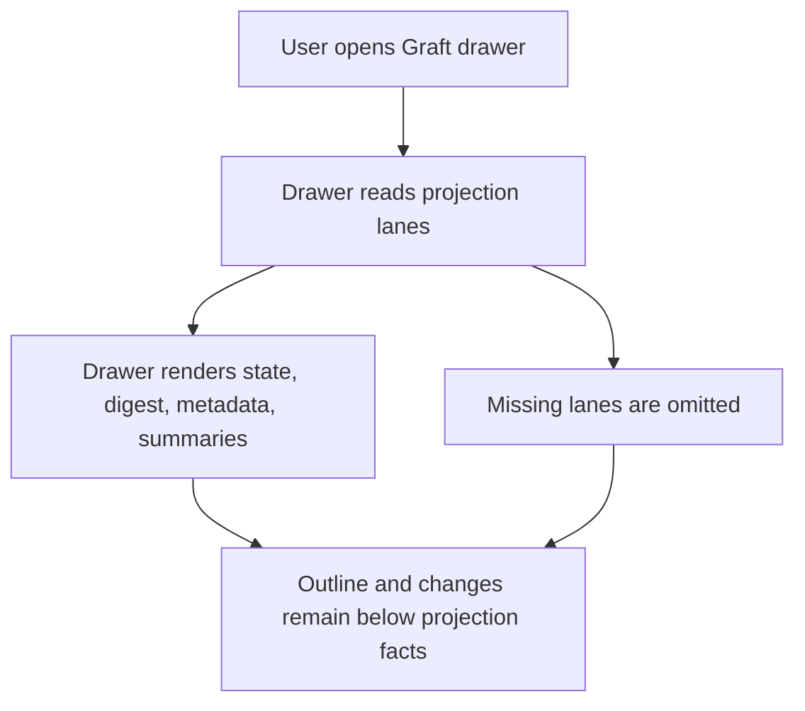

# WF-0152 - Generic Projection-Lane Panel

## Linked Issue

- https://github.com/flyingrobots/jedit/issues/258

## Decision Summary

jedit will add a jedit-owned generic `projectionLanes` display field and route
the existing Edict Core and Echo Target IR facts through it. The cycle keeps the
current Edict-specific fields for compatibility, but makes the display shell
provider-neutral enough for future Graft-backed language lanes without making
jedit an Edict debugger, REPL, Echo runner, or semantic authority.

## Sponsored Human

A Jim user wants compiler and projection facts to appear in a consistent drawer
shape so that Core, Target IR, and future language projections can be compared
without learning a different mini-UI for every provider.

## Sponsored Agent

An agent needs a stable projection-lane display contract so it can inspect
state, digest, metadata, and bounded summary rows without scraping
provider-specific prose or inferring Edict, Echo, Wesley, or Colorful semantics.

## Hill

By the end of this cycle, the Graft drawer renders Edict Core and Echo Target IR
through a generic projection-lane panel helper, focused specs prove the rendered
rows and row accounting are unchanged for the current Edict surface, and the
implementation carries no execution, debugger, REPL, or host-eligibility claim.

## Current Truth

On `origin/main` at
`3a2d576020542f07ba903b2694cf587df521595d`, `GraftInfo` carries two
projection-specific fields, `edictCoreProjection` and
`echoTargetIrProjection`:
[`src/ports/graft-session.ts#L36:3a2d576020542f07ba903b2694cf587df521595d`](https://github.com/flyingrobots/jedit/blob/3a2d576020542f07ba903b2694cf587df521595d/src/ports/graft-session.ts#L36).

The drawer surface renders those fields through dedicated Edict Core and Echo
Target IR helpers:
[`src/ui/graft-drawer.ts#L121:3a2d576020542f07ba903b2694cf587df521595d`](https://github.com/flyingrobots/jedit/blob/3a2d576020542f07ba903b2694cf587df521595d/src/ui/graft-drawer.ts#L121).

The workspace drawer row accounting duplicates that provider-specific split:
[`src/app/workspace/graft-drawer.ts#L115:3a2d576020542f07ba903b2694cf587df521595d`](https://github.com/flyingrobots/jedit/blob/3a2d576020542f07ba903b2694cf587df521595d/src/app/workspace/graft-drawer.ts#L115).

WF-0151 explicitly deferred the generic projection-lane panel to issue #258:
[`docs/design/0151-edict-projection-lens.md#L350:3a2d576020542f07ba903b2694cf587df521595d`](https://github.com/flyingrobots/jedit/blob/3a2d576020542f07ba903b2694cf587df521595d/docs/design/0151-edict-projection-lens.md#L350).

Focused drawer specs already prove the current Edict rows and non-execution
claims:
[`spec/graft-drawer.spec.mjs#L106:3a2d576020542f07ba903b2694cf587df521595d`](https://github.com/flyingrobots/jedit/blob/3a2d576020542f07ba903b2694cf587df521595d/spec/graft-drawer.spec.mjs#L106).

## Problem

The drawer currently has a provider-specific row helper for Edict Core and
another for Echo Target IR. That works for the first Edict slice, but it makes
the next provider harder to add because every projection lane needs bespoke
rendering and row-count code before the UI can show state, digests, metadata,
and summaries. The duplication also keeps the display abstraction too close to
Edict even though jedit only owns projection display.

## Scope

This cycle includes:

- adding a generic projection-lane display model to jedit's Graft session
  boundary;
- rendering Edict Core and Echo Target IR by adapting their existing facts into
  that display model;
- replacing duplicated row-count helpers with generic projection-lane row
  accounting;
- preserving current drawer row order, bounded summaries, receipt display,
  outline navigation, and dirty-buffer posture;
- documenting that this is projection inspection only.

## Non-Goals

This cycle does not include:

- Edict execution from jedit;
- an Edict debugger view;
- an Edict REPL;
- Echo execution, admission, or runtime host selection;
- host compatibility or eligibility checks;
- generic Target IR execution;
- Wesley, Colorful, or other new provider integration;
- full Core or Target IR review JSON viewing;
- canonical Echo receipt bytes or receipt digests;
- jedit-side Edict, Echo, Wesley, or Colorful semantic interpretation.

## User Experience / Product Shape

The visible drawer stays familiar. A `.edict` buffer still shows `edict core`
and `echo target ir`, but those sections are produced through one projection
lane renderer. Future providers can reuse the same section shape without
copying Edict-specific row code.

### User Journey



### Wide UI Mockup

Terminal: 120 columns, default theme.

```text
graft
demo.edict
source: live-buffer
posture: current

edict core
state: available
core digest: sha256:2222222222222222222222222222222222222222222222222222222222222222
review: apiVersion

echo target ir
state: available
domain: echo.span-ir/v1
target: echo.dpo@1
target profile: sha256:1111111111111111111111111111111111111111111111111111111111111111
target ir digest: sha256:3333333333333333333333333333333333333333333333333333333333333333
review: intents

outline
structural outline unavailable
```

### Narrow UI Mockup

Terminal: 50 columns, default theme.

```text
graft
demo.edict
source: live-buffer
posture: current

edict core
state: available
core digest: sha256:222222222222222222222222...
review: apiVersion
```

Long values continue to fit through the existing drawer line-fitting path.

### Accessibility Considerations

Projection lanes remain plain text. State, digest, metadata keys, and summary
rows do not rely on color, layout-only icons, or hidden UI state.

## Runtime / API Contract

This cycle adds a jedit-owned display contract to `GraftInfo`, not a new
runtime API:

```ts
interface GraftProjectionPanelLane {
  readonly title: string;
  readonly state: GraftProjectionSlotState;
  readonly digest?: {
    readonly label: string;
    readonly value: string;
  };
  readonly metadata: readonly {
    readonly label: string;
    readonly value: string;
  }[];
  readonly summaryLines: readonly string[];
}
```

The existing `GraftInfo.edictCoreProjection` and
`GraftInfo.echoTargetIrProjection` fields remain the source facts for this
cycle. `projectionLanes` carries their display shape:

```ts
interface GraftInfo {
  readonly projectionLanes?: readonly GraftProjectionPanelLane[];
}
```

The adapter derives `projectionLanes` from already decoded provider facts. It
does not compute projection facts, validate language semantics, execute Echo, or
admit artifacts.

## Lower Modes

The lower mode is the existing text drawer output. Focused specs assert rendered
lines directly. No JSON, CLI, or pipe output changes in this cycle.

If projection lanes are unavailable, the drawer continues to omit them and show
outline/change sections as it does now.

## Data / State Model

| Category | Description |
| --- | --- |
| Source of truth | Existing `GraftInfo` projection lane fields from the Graft session port. |
| Derived state | `GraftInfo.projectionLanes` rows for rendering and row accounting. |
| Invalid states | jedit deriving projection facts, interpreting provider semantics, showing execution/debugger/REPL controls, or treating projection availability as runtime availability. |
| Reset behavior | Same as WF-0151: lanes disappear when new `GraftInfo` lacks them or the active file changes. |
| Serialization | No persistence or wire format. |
| Deterministic assumptions | Lane ordering is fixed; metadata row order is adapter-defined; summary rows preserve provider order and remain bounded by existing drawer fitting. |

## Accessibility Posture

| Concern | Posture |
| --- | --- |
| Semantic labels or facts | Lane title, state, digest, metadata labels, and summaries are visible text. |
| Focus order or ownership | Existing Graft drawer navigation remains unchanged. |
| Hidden or visual-only information | None; no new icon-only controls or color-only states. |
| Keyboard behavior | Existing refresh and outline navigation keys remain unchanged. |
| Secret or redaction behavior | No new secret material is introduced. |

## Localization / Directionality Posture

| Concern | Posture |
| --- | --- |
| User-visible strings | Existing English drawer labels remain English-only like adjacent Graft rows. |
| Catalog keys | No catalog update in this cycle. |
| Supported locales updated | Not applicable. |
| Directionality assumptions | Rows remain left-to-right diagnostic facts. |
| Validation command | Focused drawer specs assert text rows. |

## Agent Inspectability / Explainability Posture

Agents can inspect the existing `GraftInfo` fields or focused drawer specs. The
new helper gives maintainers one stable row-shape contract for projection
inspection without requiring agents to distinguish Edict-specific rendering
helpers.

## Linked Invariants

- Tests are executable spec.
- Runtime truth beats compile-time theater.
- Graft routes projection authority; jedit displays projection facts.
- Echo authority remains outside jedit product nouns.
- Projection availability is not execution availability.
- Editors are mirrors, not judges.
- No `any`, no `unknown`, no TypeScript file over 500 LOC.

## Design Alternatives Considered

### Option A: Keep Edict-Specific Rendering

Pros:

- No new abstraction.
- Current tests already pass.

Cons:

- Next provider repeats rendering and row-count logic.
- The drawer remains shaped around Edict instead of projection display.

### Option B: Convert `GraftInfo` To Arbitrary Provider Payloads

Pros:

- Moves closer to a fully generic projection model.

Cons:

- Too large for this slice.
- Risks changing the Graft session port before a second provider proves the
  shape.
- Could weaken the already tested Edict projection contract.

### Option C: Add A Generic Drawer Panel Adapter

Pros:

- Removes display duplication while preserving the current port contract.
- Keeps the slice local to drawer rendering and row accounting.
- Builds the seam needed by future providers without claiming provider
  semantics.

Cons:

- Still requires explicit adapters from current `GraftInfo` fields.
- Does not solve full review JSON browsing.

## Decision

Choose Option C. jedit will introduce a generic drawer-panel display model and
adapt the existing Edict Core and Echo Target IR fields into it. The decision
expires when Graft and jedit land a broader multi-provider projection payload
contract.

## Implementation Slices

- [x] Slice 1: Add design packet and issue linkage.
- [x] Slice 2: Add RED drawer spec proving Edict Core and Echo Target IR render
      through a generic projection-lane fixture with current non-execution
      assertions intact.
- [x] Slice 3: Implement generic projection-lane rendering in
      `src/ui/graft-drawer.ts`.
- [x] Slice 4: Add focused workspace row-accounting coverage for generic lane metadata
      and summary rows.
- [x] Slice 5: Implement generic row accounting in
      `src/app/workspace/graft-drawer.ts`.
- [x] Slice 6: Update docs/changelog, fill retrospective, validate, and open
      PR.

## Tests To Write First

Behavior tests required:

- [x] `spec/graft-drawer.spec.mjs` proves projection lanes keep the current
      visible Edict Core and Echo Target IR rows.
- [x] `spec/graft-drawer.spec.mjs` proves projection lane display still avoids
      execution, admission, debugger, and REPL wording.
- [x] `spec/graft-drawer.spec.mjs` proves generic lane metadata remains bounded
      and ordered.
- [x] `spec/graft-drawer.spec.mjs` proves
      page movement accounts for generic projection-lane rows.

Documentation and process tests:

- [x] Existing design-cycle checks remain green.

## Acceptance Criteria

The work is done when:

- [x] `GraftInfo.projectionLanes` can render a provider-neutral projection
      section.
- [x] Edict Core and Echo Target IR rows are rendered through generic
      projection lanes.
- [x] Workspace row accounting uses the same generic lane model.
- [x] Existing obstruction receipt, outline, changes, and dirty projection
      behavior remain unchanged.
- [x] Drawer output contains no execution, admission, debugger, or REPL claim.
- [x] Issue #258 and the PR are linked correctly.
- [x] Local validation is green.

## Validation Plan

Commands expected before PR:

```bash
npm run build
JEDIT_DIST_PREBUILT=1 node --test --test-concurrency=1 spec/graft-drawer.spec.mjs
npm run quality
npx markdownlint-cli2 CHANGELOG.md docs/BEARING.md docs/design/0152-generic-projection-lane-panel.md
node --test --test-concurrency=1 spec/design-cycle-policy.spec.mjs
git diff --check
npm run check
```

## Playback / Witness

Reviewers can inspect the focused drawer specs and run:

```bash
npm run build
JEDIT_DIST_PREBUILT=1 node --test --test-concurrency=1 spec/graft-drawer.spec.mjs
```

The witness is the rendered Graft drawer text rows.

## Risks

Known risks:

- A generic helper could hide important provider-specific labels.
- Row-count logic could drift from rendered rows and break page movement.
- The wording could imply runtime capability if "Run", "Debug", or "REPL"
  language appears near projection facts.

Mitigations:

- Keep provider adapters responsible for labels.
- Add focused row-accounting coverage.
- Assert forbidden runtime/debugger words are absent from projection drawer
  output.

## Follow-On Debt

Known deferrals in this cycle:

- full Core/Target IR review JSON viewer:
  https://github.com/flyingrobots/jedit/issues/259
- Echo run button from jedit:
  https://github.com/flyingrobots/jedit/issues/257
- canonical Echo receipt digest display:
  https://github.com/flyingrobots/jedit/issues/260

No new follow-on issue is required for debugger or REPL work in this cycle
because this cycle explicitly rejects that scope rather than deferring part of
its implementation.

## Retrospective

What changed from the design:

- The implementation added `GraftInfo.projectionLanes` as the generic display
  shape and retained `edictCoreProjection` plus `echoTargetIrProjection` as
  compatibility/source facts for the current Edict projection adapter.
- The row-accounting coverage landed as a compact extension to the existing
  PageDown drawer spec after the generic renderer RED/GREEN, rather than as a
  separate test file, to keep the touched specs under the 500-line ratchet.

What the tests proved:

- `spec/graft-drawer.spec.mjs` first failed because `projectionLanes` were
  ignored, then passed after the generic renderer showed provider-neutral
  title, state, digest, metadata, and summary rows.
- `spec/graft-api-session.spec.mjs` proves the live Edict adapter now carries
  generic `projectionLanes` alongside the existing Edict-specific fields.
- `spec/graft-drawer.spec.mjs` proves PageDown accounting includes generic lane
  metadata and summary rows.
- The drawer output still excludes runtime, debugger, REPL, execution, and
  admission wording for projection lanes.

Validation completed:

- RED:
  `npm run build && JEDIT_DIST_PREBUILT=1 node --test --test-concurrency=1 spec/graft-drawer.spec.mjs`
  failed because the drawer ignored generic `projectionLanes`.
- GREEN:
  `npm run build && JEDIT_DIST_PREBUILT=1 node --test --test-concurrency=1 spec/graft-api-session.spec.mjs spec/graft-drawer.spec.mjs`
- GREEN: `npm run quality`
- GREEN:
  `npx markdownlint-cli2 CHANGELOG.md docs/BEARING.md docs/design/0152-generic-projection-lane-panel.md`
- GREEN: `node --test --test-concurrency=1 spec/design-cycle-policy.spec.mjs`
- GREEN: `git diff --check`
- GREEN: `npm run check`

What remains open:

- Full Core/Target IR review JSON viewer:
  https://github.com/flyingrobots/jedit/issues/259
- Any Echo execution UX belongs in a separate explicitly scoped design, not
  this projection panel:
  https://github.com/flyingrobots/jedit/issues/257
- Canonical Echo receipt digest display:
  https://github.com/flyingrobots/jedit/issues/260

PR:

- https://github.com/flyingrobots/jedit/pull/263
