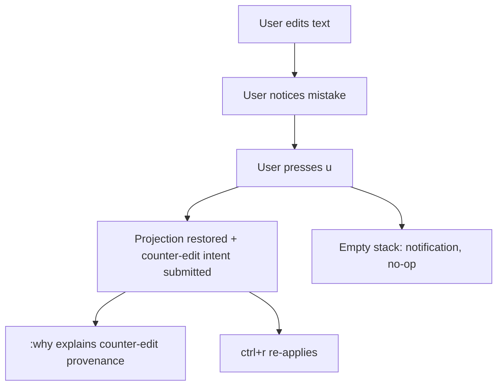

# WF-0153 - E-Brake: Observed Absurdity Fixes

## Linked Issue

- https://github.com/flyingrobots/jedit/issues/267

## Decision Summary

One short emergency-brake goalpost fixes the four absurdities surfaced by the
2026-07-12 forensic audit: (1) undo/redo are fully implemented but wired to
nothing while the help screen advertises them — wire them and route the
restoring delta through the production text session as an authored
counter-edit; (2) the title scene is the highest-churn surface in the repo —
freeze it behind a leash entry and a CI changed-paths guard; (3) root identity
depends on a process-global counter — replace it with a per-runtime allocator;
(4) top-level guides cite files and flows that no longer exist — add an
executable doc-path governance witness and rewrite `ADVANCED_GUIDE.md`.
The Echo WASM lane and the causal-undo family are explicitly out of scope.

## Sponsored Human

A daily-driver Jim user wants `u` to undo their last edit so that a fat-fingered
`dw` is recoverable in one keypress, without having to close the buffer without
saving and reopen it to discard mistakes.

## Sponsored Agent

An agent needs deterministic root/head identities and truthful guide paths so
it can correlate replayed evidence across runs and navigate the codebase from
documentation, without inferring identity from process-global creation order or
discovering that documented files do not exist.

## Hill

By the end of this cycle, a user can undo and redo edits with `u`/`ctrl+r`
recorded as causal counter-edits explainable by `:why`; the title scene is
frozen by CI policy; two independently constructed runtimes replaying the same
script mint identical root identities; and a doc-path witness proves every
`src/**` and `scripts/**` reference in the top-level guides resolves — with the
repo proving all four through RED-first specs.

## Current Truth

All citations at merge target
[`a42e1d5d8d8ee851a556fd714df3584b0fce1ea8`](https://github.com/flyingrobots/jedit/commit/a42e1d5d8d8ee851a556fd714df3584b0fce1ea8).

- `undo()` and `redo()` are complete snapshot-restoring reducers at
  [src/app/workspace/editor-editing-helpers.ts#221:a42e1d5d8d8ee851a556fd714df3584b0fce1ea8](https://github.com/flyingrobots/jedit/blob/a42e1d5d8d8ee851a556fd714df3584b0fce1ea8/src/app/workspace/editor-editing-helpers.ts#L221)
  with zero call sites outside their defining module. `undoStack`/`redoStack`
  are maintained on every mutation
  ([src/app/workspace/editor-editing-core.ts#383:a42e1d5d8d8ee851a556fd714df3584b0fce1ea8](https://github.com/flyingrobots/jedit/blob/a42e1d5d8d8ee851a556fd714df3584b0fce1ea8/src/app/workspace/editor-editing-core.ts#L383)).
  The help surface advertises the unwired keys
  ([src/ui/help.ts#25:a42e1d5d8d8ee851a556fd714df3584b0fce1ea8](https://github.com/flyingrobots/jedit/blob/a42e1d5d8d8ee851a556fd714df3584b0fce1ea8/src/ui/help.ts#L25)).
  `docs/BEARING.md` records production undo/redo as intentionally unsupported.
- `src/ui/title-screen.ts` is the most-modified file in the repository
  (55 commits, 18 fix-prefixed, per `git log --name-only`), including
  `506df18c` "chore: keep merged title screen under quality cap".
- A module-global counter mints root identity:
  [src/domain/text-edit-contract.ts#49:a42e1d5d8d8ee851a556fd714df3584b0fce1ea8](https://github.com/flyingrobots/jedit/blob/a42e1d5d8d8ee851a556fd714df3584b0fce1ea8/src/domain/text-edit-contract.ts#L49)
  (`let nextRootId = 1;`), consumed by `createBufferRoot` and flowing into
  `HeadId`/`RootNodeId` via `src/app/jedit-contract-runtime-id.ts`. Known debt:
  `docs/method/backlog/bad-code/global-next-root-id-counter.md` (priority:
  low).
- `ADVANCED_GUIDE.md` locates the editor core in `src/main.ts`
  ([ADVANCED_GUIDE.md#14:a42e1d5d8d8ee851a556fd714df3584b0fce1ea8](https://github.com/flyingrobots/jedit/blob/a42e1d5d8d8ee851a556fd714df3584b0fce1ea8/ADVANCED_GUIDE.md#L14))
  — a 13-line dispatcher — and cites the deleted
  `src/adapters/in-memory-hot-text-runtime.ts`
  ([ADVANCED_GUIDE.md#91:a42e1d5d8d8ee851a556fd714df3584b0fce1ea8](https://github.com/flyingrobots/jedit/blob/a42e1d5d8d8ee851a556fd714df3584b0fce1ea8/ADVANCED_GUIDE.md#L91)).
  `GUIDE.md` misstates the `check` script composition. Seventeen existing
  doc-governance specs run in the `docs-release` shard; none assert path
  existence.
- Audit provenance: full forensic audit delivered 2026-07-12 in-session;
  findings ledger reproduced in issue #267.

## Problem

Four independently observed defects share one shape: the repo's visible claims
(help text, guides, identity semantics, effort allocation) have drifted from
its runtime truth. Users cannot recover from mistakes despite the machinery
existing; agents cannot trust identity across runs; readers cannot trust the
advanced guide; and revision effort concentrates on a decorative surface.

## Scope

This cycle includes:

- Wiring `u`/`ctrl+r` in normal mode to the existing `undo()`/`redo()`
  reducers, routed through the production text session as authored
  counter-edits with command provenance, behind `JEDIT_UNDO=1` until the
  witness is green, then default-on.
- A leash entry and changed-shards guard freezing
  `src/ui/title-*`, `src/app/title-*`, `src/adapters/raytracer-profiler.ts`,
  and `scripts/title-*` absent a `title-unfreeze` PR label.
- Replacing the module-global root-id counter with a per-runtime allocator;
  re-ranking and closing the bad-code journal entry.
- A doc-path governance spec (RED today) asserting every `src/**` and
  `scripts/**` reference in `README.md`, `GUIDE.md`, `ADVANCED_GUIDE.md`,
  `ARCHITECTURE.md`, and `docs/BEARING.md` resolves; rewriting
  `ADVANCED_GUIDE.md` around the real boot/edit path; correcting `GUIDE.md`'s
  `check` description; naming the in-process contract posture where README
  says "Echo-hosted".

## Non-Goals

This cycle does not include:

- Real Echo WASM in-tree, transport parity, or the agent proposal demo
  (separate lane; depends on slice 3 landing here).
- The causal-undo family (`docs/method/backlog/cool-ideas/causal-undo-family.md`).
- Any new title-scene work, Vim surface growth, or visual-mode features.
- Content-addressed root identity (identity-doctrine decision deferred; this
  cycle only removes order dependence).

## User Experience / Product Shape

The user is editing and makes a mistake. `u` restores the previous state and
the footer/notification confirms the undo; `ctrl+r` re-applies. `:why` on the
resulting state explains the undo as a counter-edit referencing the edit group
it reverses. `u` on an empty stack shows a calm notification and changes
nothing. Failure (obstructed intent) surfaces as the standard typed obstruction
notice. No new chrome; no new panes.

### User Journey



### Wide UI Mockup

Not applicable: no new rendered surface. Undo reuses existing buffer render,
footer, and notification paths.

### Narrow UI Mockup

Not applicable: same as above.

### Accessibility Considerations

Undo/redo outcomes are announced through the existing notification facts and
recorded as history entries; agents and screen-reader flows read the same
structured entries rather than visual diffing.

## Runtime / API Contract

- Normal-mode key dispatch maps `u` -> undo counter-edit planning and
  `ctrl+r` -> redo counter-edit planning.
- The restoring delta is computed from the local projection snapshot (never
  from bounded readings, preserving the BEARING projection-cache constraint)
  and submitted through `ProductionTextSession` as a `replaceRange` intent
  serialized by the existing operation sequencer.
- A command-provenance event is registered for each counter-edit with a target
  reference to the reversed edit group so `:why` can answer.
- `createBufferRoot(text)` gains an explicit allocator: root ids are minted
  per-runtime (allocator owned by runtime state at
  `graph-backed-rope-hot-text-runtime` and the full-snapshot fixture), never
  module-global. Identical scripts on independent runtimes mint identical ids.
- `scripts/ci/changed-shards.mjs` gains a frozen-paths policy: plans fail with
  an explicit reason when frozen title paths change and the PR lacks
  `title-unfreeze`.
- Doc-path witness contract: extract backtick-quoted and link-referenced
  `src/**` / `scripts/**` paths from the five named guides; assert existence.

## Lower Modes

- Undo works identically in keyboard-only operation (it is keyboard-only).
- Doc-path witness and changed-shards guard run headless in CI and emit
  standard `node:test` output; the guard also reports its reason in the plan
  JSON/summary.
- When the production text session obstructs the counter-edit, the projection
  is not restored silently: the obstruction notice is shown and the undo stack
  is left intact for retry.

## Data / State Model

| Category | Description |
| --- | --- |
| Source of truth | Causal history (facts + intents) for text; `EditorState.undoStack`/`redoStack` remain projection-local planning state. |
| Derived state | The restoring `replaceRange` delta derived from projection snapshots. |
| Invalid states | Projection restored while intent obstructed (forbidden: restore commits only with the intent path); duplicate root ids across sessions in one runtime. |
| Reset behavior | Undo/redo stacks reset on buffer open as today; allocator resets per runtime construction. |
| Serialization | No new persisted shapes; counter-edits persist as ordinary edit facts. |
| Deterministic assumptions | Same script + same runtime construction => identical root/head identities (new invariant, witnessed). |

## Accessibility Posture

| Concern | Posture |
| --- | --- |
| Semantic labels or facts | Undo/redo emit history entries + notifications with stable kinds. |
| Focus order or ownership | Unchanged. |
| Hidden or visual-only information | None added; provenance is queryable via `:why`. |
| Keyboard behavior | `u`/`ctrl+r` in normal mode only; no chord conflicts introduced. |
| Secret or redaction behavior | Not applicable. |

## Localization / Directionality Posture

| Concern | Posture |
| --- | --- |
| User-visible strings | Undo/redo/empty-stack notification strings added. |
| Catalog keys | Added via the existing bijou-i18n catalog path. |
| Supported locales updated | Yes, alongside string introduction. |
| Directionality assumptions | None; notifications reuse existing surfaces. |
| Validation command | Existing i18n generation + doc specs. |

## Agent Inspectability / Explainability Posture

- Counter-edits appear as ordinary intents with receipts in the history
  listing JSON surfaces; `:why` resolves them to the reversed edit group.
- Root ids become replay-stable, so agents can correlate evidence across runs.
- The changed-shards guard emits its frozen-path verdict in machine-readable
  plan output.
- The doc-path witness output lists every unresolved path with file and line.

## Linked Invariants

- Tests are executable spec.
- Runtime truth beats type theater.
- Undo is authored counter-history, not deletion.
- `EditorState.lines` is a projection cache and is never reconstructed from
  bounded readings.
- Echo authority remains outside jedit product nouns.
- One file, one runtime truth; no file over 500 LOC.

## Design Alternatives Considered

### Option A: Stack-pop undo that mutates the projection only

Pros:

- Smallest diff; instant.

Cons:

- Projection diverges from causal text authority; history lies; `:why` cannot
  explain the change. Violates the counter-history doctrine.

### Option B: Defer undo until native Echo speculative-intent undo exists

Pros:

- One implementation, doctrinally final.

Cons:

- Users bleed now; the machinery to do counter-edit undo honestly already
  exists; deferral has already lasted the life of the repo.

### Option C (chosen): Counter-edit undo through the production session

Pros:

- Doctrine-compliant (undo as authored counter-history), explainable via
  `:why`, replay-safe, uses existing reducers/sequencer.

Cons:

- Undo latency is intent-path latency; obstruction handling needed.

## Decision

Option C for undo; leash + CI guard for the freeze; per-runtime allocator for
identity (content addressing deferred to the identity doctrine); executable
doc-path witness before prose rewrite. `JEDIT_UNDO=1` is temporary: it expires
when the witness suite is green in CI, within this cycle.

## Implementation Slices

- [ ] Slice 1: RED undo witnesses + wire `u`/`ctrl+r` as causal counter-edits
      (`feat(workspace): wire undo/redo as causal counter-edits`).
- [ ] Slice 2: Undo provenance + BEARING/help truth update + default-on
      (`feat(provenance): explain undo counter-edits through :why`).
- [ ] Slice 3: Title-scene freeze leash + changed-shards guard
      (`chore(ci): freeze title scene behind title-unfreeze label`).
- [ ] Slice 4: RED identity witness + per-runtime root-id allocator; re-rank
      and close bad-code entry
      (`fix(domain): mint root ids per runtime, not per process`).
- [ ] Slice 5: RED doc-path witness + ADVANCED_GUIDE rewrite + GUIDE/README
      corrections (`docs: make top-level guides pass the path witness`).

## Tests To Write First

Behavior tests required:

- [ ] Workspace harness spec: edit -> `u` restores text and submits exactly one
      counter-edit intent through the session; `ctrl+r` round-trips; empty
      stack is a no-op with notification (fails before wiring).
- [ ] Obstruction spec: obstructed counter-edit leaves projection and undo
      stack intact and surfaces the obstruction notice.
- [ ] Identity spec: two independently constructed runtimes replaying an
      identical script mint identical root/head identities; interleaved
      sessions do not perturb ids (fails today).
- [ ] Changed-shards guard spec: plan over a frozen title path without
      `title-unfreeze` fails with the frozen-path reason; with the label it
      passes (fails before guard exists).

Documentation and process tests, only if relevant:

- [ ] Doc-path witness: every `src/**`/`scripts/**` reference in README,
      GUIDE, ADVANCED_GUIDE, ARCHITECTURE, BEARING resolves (fails today on
      ADVANCED_GUIDE).

Rule honored: the doc witness proves only slice 5's doc claims; slices 1-4 are
proven by behavior tests.

## Acceptance Criteria

The work is done when:

- [ ] Behavior test proves `u`/`ctrl+r` as counter-edits with provenance.
- [ ] `:why` output names the reversed edit group for an undo.
- [ ] Identity witness proves replay-stable root ids.
- [ ] Changed-shards guard blocks unlabeled title changes in CI.
- [ ] Doc-path witness is green and ADVANCED_GUIDE describes the real paths.
- [ ] BEARING no longer lists undo as unsupported; help text is truthful.
- [ ] `docs/method/backlog/bad-code/global-next-root-id-counter.md` closed.
- [ ] CHANGELOG updated; issue #267 and the PR are linked.
- [ ] CI and local validation are green.

## Validation Plan

```bash
npm run build
node --test --test-concurrency=1 spec/workspace-undo-*.spec.mjs \
  spec/graph-rope-root-identity.spec.mjs spec/ci-frozen-paths.spec.mjs \
  spec/guide-path-references.spec.mjs
npm run quality
npm run check
```

## Playback / Witness

```bash
node --test --test-concurrency=1 spec/workspace-undo-cutover.spec.mjs
node --test --test-concurrency=1 spec/guide-path-references.spec.mjs
```

TUI reproduction: open a file, `dw`, `u` (text restored, notification shown),
`:why` (counter-edit explanation), `ctrl+r` (re-applied). 120x30 terminal,
graphite theme, en locale.

## Risks

Known risks:

- Undo across in-flight checkpoints or obstructed intents could desync the
  projection from authority.
- Persisted WSC envelopes may embed counter-derived ids; allocator change
  could break replay of existing local histories.
- Doc-path witness may flag intentional future-tense references.

Mitigations:

- Counter-edit goes through the existing per-session sequencer; restore
  commits only on intent acceptance; obstruction leaves the stack intact.
- Slice 4 includes a blast-radius check of persisted id consumers and a
  fixture-regeneration witness if any are found.
- Witness supports an explicit allowlist for documented-as-future paths, with
  zero entries to start.

## Follow-On Debt

- Native Echo speculative-intent undo metadata (existing BEARING third-lane
  item; issue to be linked when this cycle's counter-edit shape informs it).
- Causal-undo family design cycle
  (`docs/method/backlog/cool-ideas/causal-undo-family.md`).
- Content-addressed root identity under the identity doctrine.

## Retrospective

Fill this in after implementation.

What changed from the design:

- ...

What the tests proved:

- ...

What remains open:

- ...

PR:

- https://github.com/flyingrobots/jedit/pull/<number>
