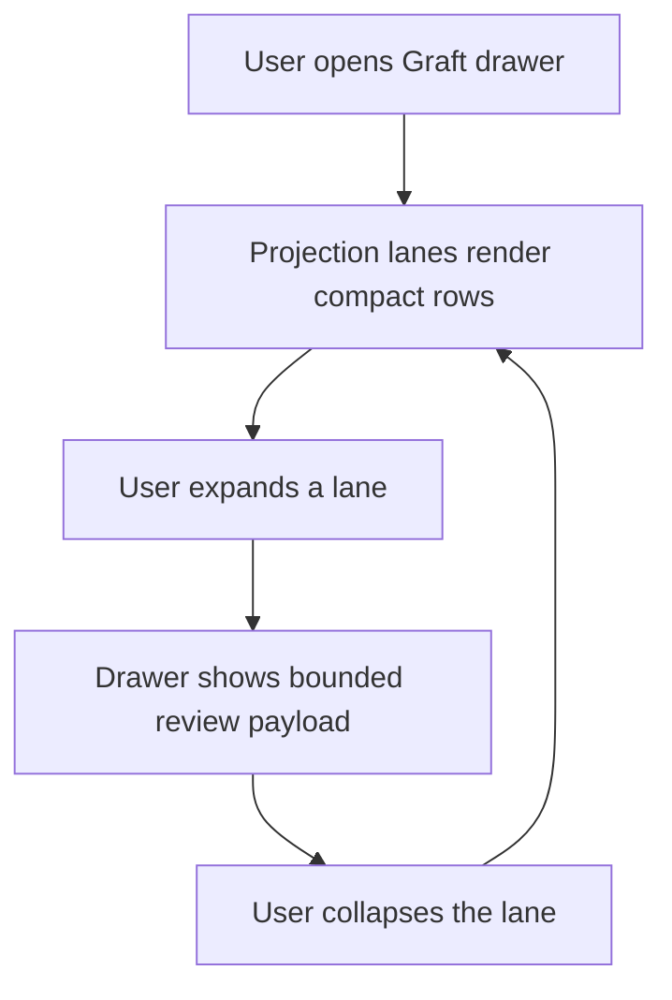

# WF-0153 - Generic Projection Review Payload Viewer

## Linked Issue

- https://github.com/flyingrobots/jedit/issues/259

## Decision Summary

jedit will let generic Graft projection lanes carry provider-owned review
payloads and render those payloads through an expandable, bounded, display-only
viewer in the Graft drawer. Edict Core and Echo Target IR review payloads are
the first concrete payloads, but the viewer is provider-neutral.

## Sponsored Human

A Jim user wants to inspect the details behind compact projection lanes so that
they can see the Core or Target IR review payload produced upstream, without
leaving jedit or pretending jedit understands provider semantics.

## Sponsored Agent

An agent needs a bounded structured payload display surface so it can inspect
projection evidence and row accounting, without scraping provider-specific prose
or inferring Edict, Echo, Wesley, or Colorful meaning.

## Hill

By the end of this cycle, a projection lane can expose an optional review
payload, the Graft drawer can expand that payload as bounded structured text,
and focused specs prove row accounting, truncation, and non-execution wording.

## Current Truth

On `origin/main` at
`6363afeb20854811f4617d029fdfbf41564458da`, `GraftProjectionPanelLane`
contains title, state, digest, metadata, and summary rows, but no review payload:
[`src/ports/graft-session.ts#L67:6363afeb20854811f4617d029fdfbf41564458da`](https://github.com/flyingrobots/jedit/blob/6363afeb20854811f4617d029fdfbf41564458da/src/ports/graft-session.ts#L67).

The generic lane adapter can synthesize Edict Core and Echo Target IR projection
lanes, but it only forwards compact row data:
[`src/ports/graft-projection-lanes.ts#L26:6363afeb20854811f4617d029fdfbf41564458da`](https://github.com/flyingrobots/jedit/blob/6363afeb20854811f4617d029fdfbf41564458da/src/ports/graft-projection-lanes.ts#L26).

The drawer renders each projection lane as title, state, digest, metadata, and
summary lines:
[`src/ui/graft-drawer.ts#L128:6363afeb20854811f4617d029fdfbf41564458da`](https://github.com/flyingrobots/jedit/blob/6363afeb20854811f4617d029fdfbf41564458da/src/ui/graft-drawer.ts#L128).

Issue #259 now tracks the generic projection review payload viewer:
https://github.com/flyingrobots/jedit/issues/259

## Problem

Projection lanes currently prove that upstream projection artifacts exist, but
they only show compact summaries such as `review: apiVersion`. A user cannot
inspect the provider-owned review payload from inside jedit. Adding an Edict-
specific JSON panel would solve the first example but would repeat the exact
provider-shaped drawer problem WF-0152 removed.

## Scope

This cycle includes:

- adding an optional provider-neutral review payload field to projection lanes;
- carrying Edict Core and Echo Target IR review payloads into that field;
- rendering review payloads as bounded structured text in the Graft drawer;
- exposing collapsed and expanded lane states through jedit-owned UI state;
- updating drawer row accounting for expanded review payloads;
- documenting that this is projection inspection only.

## Non-Goals

This cycle does not include:

- Edict execution;
- Echo execution;
- an Edict debugger;
- an Edict REPL;
- Core validation in jedit;
- Target IR lowering in jedit;
- receipt digest computation;
- runtime host selection;
- runtime compatibility checks;
- provider-specific schema-aware formatting;
- jedit-owned interpretation of Core, Target IR, Wesley, Colorful, or Echo
  payload semantics.

## User Experience / Product Shape

The Graft drawer keeps compact projection lanes by default. A focused projection
lane can be expanded to reveal its provider-owned review payload. The expanded
rows are plain text, capped, and explicitly truncated when the payload is too
large for the viewer budget.

### User Journey



### Wide UI Mockup

Terminal: 120 columns, default theme.

```text
graft
demo.edict
source: live-buffer
posture: current

edict core
state: available
core digest: sha256:2222222222222222222222222222222222222222222222222222222222222222
review: apiVersion
review payload:
  {
    "apiVersion": "edict.core/v1",
    "module": {
      "name": "demo.echo"
    },
    "intents": [
      {
        "name": "replaceThing"
      }
    ]
  }

outline
structural outline unavailable
```

### Narrow UI Mockup

Terminal: 50 columns, default theme.

```text
edict core
state: available
core digest: sha256:222222222222222222222222...
review: apiVersion
review payload:
  {
    "apiVersion": "edict.core/v1",
    "module": {
      "name": "demo.echo"
```

Long rows continue through the drawer line-fitting path.

### Accessibility Considerations

The expanded payload is visible text. The presence of a payload, truncation
state, and scalar values do not rely on color, hidden controls, or icon-only
state.

## Runtime / API Contract

This cycle adds a display field to the existing jedit projection lane contract:

```ts
interface GraftProjectionPanelLane {
  readonly reviewPayload?: GraftJsonValue;
}
```

Expansion is jedit-owned drawer state. Providers supply payload data; jedit
decides which lane is currently expanded in the drawer. The rendering contract
is intentionally generic:

- JSON object keys render deterministically.
- arrays render in order.
- strings are JSON-escaped and length-capped.
- arrays, objects, depth, and row count are bounded.
- truncation is explicit.

jedit displays provider-owned review payloads. jedit does not interpret,
validate, lower, execute, canonicalize, or assign semantic meaning to those
payloads.

## Lower Modes

Focused specs assert rendered text rows directly. No CLI, JSON pipe, or external
protocol changes are introduced in this cycle.

When a payload is absent, compact projection lane rendering stays unchanged.
When a payload is present but collapsed, the compact lane still shows only the
existing title, state, digest, metadata, and summary rows.

## Data / State Model

| Category | Description |
| --- | --- |
| Source of truth | Provider-owned review payloads already decoded by the Graft projection adapter. |
| Derived state | Bounded drawer rows generated from `reviewPayload`. |
| Invalid states | jedit validating provider semantics, computing digests, executing artifacts, or treating expansion as runtime availability. |
| Reset behavior | Expanded lane state is jedit-owned UI state and resets with normal drawer/file changes. |
| Serialization | No persistence or wire format. |
| Deterministic assumptions | Object keys are sorted; arrays preserve provider order; truncation is stable. |

## Accessibility Posture

| Concern | Posture |
| --- | --- |
| Semantic labels or facts | Lane title, digest labels, metadata, summaries, payload rows, and truncation notices are visible text. |
| Focus order or ownership | Existing Graft drawer focus remains unchanged. |
| Hidden or visual-only information | None; no new icon-only controls. |
| Keyboard behavior | Existing drawer navigation remains; expansion uses jedit-owned drawer state. |
| Secret or redaction behavior | No new secret material is introduced. Payloads are upstream projection facts. |

## Localization / Directionality Posture

| Concern | Posture |
| --- | --- |
| User-visible strings | New English diagnostic labels match adjacent drawer rows. |
| Catalog keys | No catalog update in this cycle. |
| Supported locales updated | Not applicable. |
| Directionality assumptions | Payload inspection rows remain left-to-right structured facts. |
| Validation command | Focused drawer specs assert the visible rows. |

## Agent Inspectability / Explainability Posture

Agents can inspect `GraftInfo.projectionLanes[].reviewPayload` and focused
drawer specs. The viewer produces stable text rows rather than provider-specific
UI state.

## Linked Invariants

- Tests are executable spec.
- Runtime truth beats compile-time theater.
- Graft routes projection authority; jedit displays projection facts.
- jedit displays provider-owned review payloads without interpreting them.
- Projection availability is not execution availability.
- Editors are mirrors, not judges.
- No `any`, no `unknown`, no TypeScript file over 500 LOC.

## Design Alternatives Considered

### Option A: Edict-Specific Core And Target IR JSON Panels

Pros:

- Fast path for the first payloads.

Cons:

- Reintroduces provider-specific drawer paths.
- Delays Wesley or Colorful reuse.
- Makes the panel look like jedit understands Edict/Echo semantics.

### Option B: Generic Structured Payload Viewer

Pros:

- Reuses the projection-lane model.
- Fits future providers.
- Keeps semantics provider-owned.

Cons:

- Cannot provide schema-specific formatting.
- Requires bounded rendering and row accounting.

## Decision

Choose Option B. The first implementation will render provider-owned JSON-like
payloads generically and use Edict Core plus Echo Target IR as fixtures.

## Implementation Slices

- [x] Slice 1: Reframe issue #259 and add this design packet.
- [x] Slice 2: Add RED drawer/API tests for collapsed and expanded review
      payloads.
- [x] Slice 3: Add generic review payload fields and carry Edict/Echo review
      payloads through the projection lane adapter.
- [x] Slice 4: Add bounded payload rendering and row accounting.
- [ ] Slice 5: Update docs/changelog, fill retrospective, validate, and open
      PR.

## Tests To Write First

Behavior tests required:

- [x] `spec/graft-review-payload-viewer.spec.mjs` proves collapsed lanes do not show review
      payload rows.
- [x] `spec/graft-review-payload-viewer.spec.mjs` proves an expanded generic lane renders a
      structured review payload.
- [x] `spec/graft-review-payload-viewer.spec.mjs` proves large payloads truncate explicitly.
- [x] `spec/graft-review-payload-viewer.spec.mjs` proves collection entries are capped explicitly.
- [x] `spec/graft-review-payload-viewer.spec.mjs` proves PageDown accounting includes expanded
      payload rows.
- [x] `spec/graft-review-payload-api-session.spec.mjs` proves Edict Core and Echo Target IR
      lanes carry review payloads from upstream projection results.
- [x] `spec/graft-review-payload-viewer.spec.mjs` proves runtime, admission, debugger, and REPL
      wording stays absent.

Documentation and process tests:

- [x] Existing design-cycle checks remain green.

## Acceptance Criteria

The work is done when:

- [x] Projection lanes may expose an optional review payload.
- [x] jedit can render collapsed compact lanes without payload rows.
- [x] jedit can render expanded generic review payload rows.
- [x] Payload rendering is bounded by depth, row count, array/object entries,
      and scalar length.
- [x] Truncation is explicit.
- [x] Row accounting remains correct for expanded payloads.
- [x] Edict Core review payloads display through the generic viewer.
- [x] Echo Target IR review payloads display through the generic viewer.
- [x] Drawer output contains no execution, admission, debugger, or REPL claim.
- [x] Issue #259 and the PR are linked correctly.
- [ ] Local validation is green.

## Validation Plan

Commands expected before PR:

```bash
npm run build
JEDIT_DIST_PREBUILT=1 node --test --test-concurrency=1 spec/graft-api-session.spec.mjs spec/graft-drawer.spec.mjs
npm run quality
npx markdownlint-cli2 CHANGELOG.md docs/BEARING.md docs/design/0153-generic-projection-review-payload-viewer.md
node --test --test-concurrency=1 spec/design-cycle-policy.spec.mjs
git diff --check
npm run check
```

## Playback / Witness

Reviewers can inspect the focused drawer specs and run:

```bash
npm run build
JEDIT_DIST_PREBUILT=1 node --test --test-concurrency=1 spec/graft-drawer.spec.mjs
```

The witness is the rendered Graft drawer text rows.

## Risks

Known risks:

- Pretty-printing could become schema interpretation.
- Large payloads could crowd out outline navigation.
- Row-count logic could drift from rendered rows.

Mitigations:

- Keep the renderer generic.
- Cap row count, depth, entries, and scalar length.
- Assert row accounting in focused tests.

## Follow-On Debt

Known deferrals in this cycle:

- profile-aware Wesley SDL projection belongs in Graft first;
- jedit Wesley projection consumption follows the Graft provider work;
- canonical Echo receipt digest display waits for Echo-side canonical receipt
  bytes and digests.

## Retrospective

What changed from the design:

- The implementation kept the viewer generic by adding `reviewPayload` to
  projection panel lanes rather than adding Edict- or Echo-specific drawer
  branches.
- Edict Core and Echo Target IR review objects are normalized at the Graft
  adapter boundary before entering jedit's `GraftJsonObject` display model.
- Expanded payload state is jedit-owned drawer state; providers only supply the
  payload.
- The renderer caps total rows, depth, collection entries, and scalar length.

What the tests proved:

- RED:
  `npm run build && JEDIT_DIST_PREBUILT=1 node --test --test-concurrency=1 spec/graft-review-payload-api-session.spec.mjs spec/graft-review-payload-viewer.spec.mjs`
  failed because lanes did not carry review payloads and the drawer ignored
  expanded payload state.
- GREEN:
  `npm run build && JEDIT_DIST_PREBUILT=1 node --test --test-concurrency=1 spec/graft-review-payload-api-session.spec.mjs spec/graft-review-payload-viewer.spec.mjs spec/graft-api-session.spec.mjs spec/graft-drawer.spec.mjs`
- GREEN: `npm run quality`
- GREEN: `git diff --check`

What remains open:

- Profile-aware Wesley SDL projection belongs in Graft first.
- jedit Wesley projection consumption follows the Graft provider work.
- Canonical Echo receipt digest display waits for Echo-side canonical receipt
  bytes and digests.

PR:

- https://github.com/flyingrobots/jedit/pull/264
