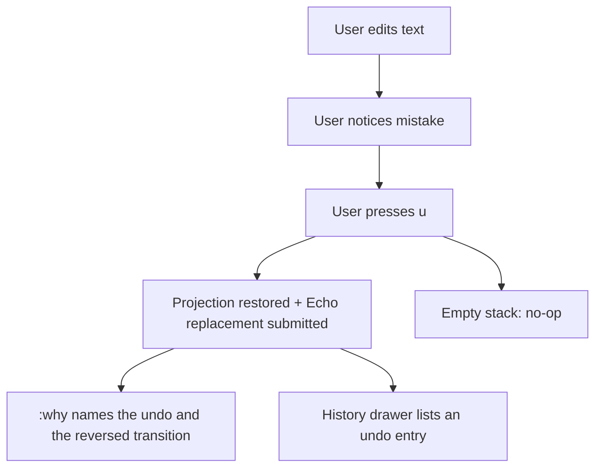

# WF-0154 - E-Brake: Observed Absurdity Fixes

## Linked Issue

- https://github.com/flyingrobots/jedit/issues/267

## Decision Summary

One short emergency-brake goalpost fixes four absurdities surfaced by the
2026-07-12 forensic audit and its review: (1) production undo/redo works and
submits Echo replacement edits, but `docs/BEARING.md` still declares it
unsupported and provenance records undo as an anonymous replacement — retire
the stale claim and name undo/redo in provenance so `:why` can explain a
reversal; (2) the title scene is the highest-churn surface in the repo —
freeze it behind a leash entry and a CI changed-paths guard; (3) root identity
depends on a process-global counter — replace it with chain-threaded
allocation state; (4) top-level guides cite files and flows that no longer
exist — add an executable doc-path governance witness and rewrite
`ADVANCED_GUIDE.md`. The Echo WASM lane and the causal-undo family are
explicitly out of scope.

## Sponsored Human

A daily-driver Jim user wants `:why` to explain an undo as the reversal it is
so that recovered mistakes are as accountable as the edits that caused them,
without having to reconstruct intent from an anonymous replacement event.

## Sponsored Agent

An agent needs deterministic root/head identities and truthful guide paths so
it can correlate replayed evidence across runs and navigate the codebase from
documentation, without inferring identity from process-global creation order or
discovering that documented files do not exist.

## Hill

By the end of this cycle, undo/redo settlements are named as reversals that
`:why` and the history surfaces can explain, and the stale unsupported claim is
retired; the title scene is frozen by CI policy; two independently constructed
runtimes replaying the same script mint identical root identities; and a
doc-path witness proves every `src/**` and `scripts/**` reference in the
top-level guides resolves — with the repo proving all four through RED-first
specs.

## Current Truth

Citations at merge target
[`a42e1d5d8d8ee851a556fd714df3584b0fce1ea8`](https://github.com/flyingrobots/jedit/commit/a42e1d5d8d8ee851a556fd714df3584b0fce1ea8).

- Production undo/redo **works**: `u`/`ctrl+r` are mapped at
  [src/app/workspace/editor-editing.ts#95:a42e1d5d8d8ee851a556fd714df3584b0fce1ea8](https://github.com/flyingrobots/jedit/blob/a42e1d5d8d8ee851a556fd714df3584b0fce1ea8/src/app/workspace/editor-editing.ts#L95),
  and `viewer-key.ts` routes the history transition through
  `planWorkspaceTextReplaceTransition` into the production text session
  (landed in `f7a96fce`, PR #66). Witnessed green by
  `spec/workspace-text-boundaries.spec.mjs` ("production undo and redo submit
  Echo replacement edits", "production insert-mode edits can be undone through
  Echo").
- Two truth defects remain. `docs/BEARING.md` still states "Production
  undo/redo remains intentionally unsupported until modeled as explicit causal
  input" — contradicted by the spec above. And no `undo`/`redo` command kind
  exists in `src/app/workspace/command-provenance.ts` or the settlement
  envelopes (persisted settlements carry kinds like `insert`), so an undo is
  indistinguishable from an ordinary replacement in `:why`, history listing,
  and WSC evidence.
- The initial audit claim that undo was unwired was wrong; review
  falsification corrected it, and this document records the verified truth.
- `src/ui/title-screen.ts` is the most-modified file in the repository
  (55 commits, 18 fix-prefixed, per `git log --name-only`), including
  `506df18c` "chore: keep merged title screen under quality cap". Title-scene
  code spans `src/ui/title-*` (28 files), `src/app/title-*` (5),
  `src/app/workspace/title-*` (5), `src/adapters/title-*` and
  `src/adapters/raytracer-profiler.ts` (7), `scripts/title-*` (4), and the
  `src/ui/*.obj` mesh assets.
- A module-global counter mints root identity:
  [src/domain/text-edit-contract.ts#49:a42e1d5d8d8ee851a556fd714df3584b0fce1ea8](https://github.com/flyingrobots/jedit/blob/a42e1d5d8d8ee851a556fd714df3584b0fce1ea8/src/domain/text-edit-contract.ts#L49)
  (`let nextRootId = 1;`), consumed by `createBufferRoot` and flowing into
  `HeadId`/`RootNodeId` via `src/app/jedit-contract-runtime-id.ts`. Known debt:
  `docs/method/backlog/bad-code/global-next-root-id-counter.md`.
- `ADVANCED_GUIDE.md` locates the editor core in `src/main.ts`
  ([ADVANCED_GUIDE.md#14:a42e1d5d8d8ee851a556fd714df3584b0fce1ea8](https://github.com/flyingrobots/jedit/blob/a42e1d5d8d8ee851a556fd714df3584b0fce1ea8/ADVANCED_GUIDE.md#L14))
  — a 13-line dispatcher — and cites the deleted
  `src/adapters/in-memory-hot-text-runtime.ts`
  ([ADVANCED_GUIDE.md#91:a42e1d5d8d8ee851a556fd714df3584b0fce1ea8](https://github.com/flyingrobots/jedit/blob/a42e1d5d8d8ee851a556fd714df3584b0fce1ea8/ADVANCED_GUIDE.md#L91)),
  the latter appearing inside a fenced flow block rather than as a backtick
  or link reference. `GUIDE.md` misstates the `check` script composition.
  Seventeen existing doc-governance specs run in the `docs-release` shard;
  none assert path existence.
- Audit provenance: full forensic audit delivered 2026-07-12 in-session;
  findings ledger reproduced in issue #267, corrected by PR #268 review.

## Problem

Four independently observed defects share one shape: the repo's visible claims
(BEARING, provenance vocabulary, guides, identity semantics, effort
allocation) have drifted from its runtime truth. The bearing document denies a
capability the spec suite proves; recovered mistakes are unexplainable as
reversals; agents cannot trust identity across runs; readers cannot trust the
advanced guide; and revision effort concentrates on a decorative surface.

## Scope

This cycle includes:

- Naming undo/redo in command provenance and settlement metadata so `:why`
  and history surfaces can explain a reversal, and retiring the stale
  `docs/BEARING.md` unsupported claim.
- A leash entry and changed-shards guard freezing `src/ui/title-*`,
  `src/app/title-*`, `src/app/workspace/title-*`, `src/adapters/title-*`,
  `src/adapters/raytracer-profiler.ts`, `scripts/title-*`, and `src/ui/*.obj`
  absent a `title-unfreeze` PR label.
- Replacing the module-global root-id counter with chain-threaded allocation
  state (`nextRootId` as value state on `TickAdmissionState` and
  `HotTextBufferState`); resolving the bad-code journal entry.
- A doc-path governance spec (RED today) asserting every `src/**` and
  `scripts/**` path-like reference in `README.md`, `GUIDE.md`,
  `ADVANCED_GUIDE.md`, `ARCHITECTURE.md`, and `docs/BEARING.md` resolves,
  including references inside fenced code blocks and plain prose; rewriting
  `ADVANCED_GUIDE.md` around the real boot/edit path; correcting `GUIDE.md`'s
  `check` description; naming the in-process contract posture where README
  says "Echo-hosted".

## Non-Goals

This cycle does not include:

- Real Echo WASM in-tree, transport parity, or the agent proposal demo
  (separate lane; depends on Slice 3 landing here).
- The causal-undo family (`docs/method/backlog/cool-ideas/causal-undo-family.md`).
- Any new title-scene work, Vim surface growth, or visual-mode features.
- Content-addressed root identity (identity-doctrine decision deferred; this
  cycle only removes order dependence).
- Reworking the undo mechanism itself — the existing
  projection-transition-to-replacement path stays as-is.

## User Experience / Product Shape

The user edits, makes a mistake, presses `u`; the text restores exactly as it
does today. What changes: `:why` on the resulting state explains the last
meaningful command as an undo that reverses a named prior transition, the
history drawer lists it as an undo rather than an anonymous edit, and BEARING
tells the truth about the capability. `u` on an empty stack remains a calm
no-op. No new chrome; no new panes.

### User Journey



### Wide UI Mockup

Not applicable: no new rendered surface. Undo reuses existing buffer render,
footer, `:why`, and history-drawer paths.

### Narrow UI Mockup

Not applicable: same as above.

### Accessibility Considerations

Undo/redo outcomes are announced through the existing notification facts and
recorded as named history entries; agents and screen-reader flows read the
same structured entries rather than visual diffing.

## Runtime / API Contract

- Undo/redo settlements carry a reversal-aware command kind (e.g.
  `undo`/`redo`) in the settlement envelope and command-provenance event,
  with a reference to the reversed transition, so `:why` output and history
  listing name the reversal.
- `docs/BEARING.md` Current Truth describes undo/redo as supported through
  the production text session, citing the boundary spec.
- `createBufferRoot(id, text)`, `createTextFragment(id, text)`,
  `emptyFragment(id)`, and `replaceRange(base, range, fragment, nextRootId)`
  take explicit ids; `TickAdmissionState` and `HotTextBufferState` thread
  `nextRootId` as value state; `admitReplaceRangeTick(state, range, text)` is
  the single allocation authority. Identical scripts on independent runtimes
  mint identical ids.
- `scripts/ci/changed-shards.mjs` gains a frozen-paths policy: plans fail with
  an explicit reason when frozen title paths change and the PR lacks
  `title-unfreeze`.
- Doc-path witness contract: extract every `src/**` / `scripts/**` path-like
  token from the five named guides — backtick spans, markdown links, fenced
  code blocks, and plain prose — and assert existence, with an explicit
  allowlist (empty to start) for documented-as-future paths.

## Lower Modes

- Undo works identically in keyboard-only operation (it is keyboard-only).
- Doc-path witness and changed-shards guard run headless in CI and emit
  standard `node:test` output; the guard also reports its reason in the plan
  JSON/summary.
- Provenance naming appears in the agent-facing history JSON surfaces, not
  only in rendered UI.

## Data / State Model

| Category | Description |
| --- | --- |
| Source of truth | Causal history (facts + settlements) for text; `EditorState.undoStack`/`redoStack` remain projection-local planning state. |
| Derived state | The restoring replacement delta derived from projection snapshots (existing behavior). |
| Invalid states | Duplicate root ids across chains in one runtime; undo settlements without reversal metadata once this cycle lands. |
| Reset behavior | Undo/redo stacks reset on buffer open as today; `nextRootId` resets per chain construction. |
| Serialization | Settlement envelopes gain the reversal-aware command kind; `HotTextBufferState` serializes `nextRootId` across the optic seam (state is not persisted to disk). |
| Deterministic assumptions | Same script + same runtime construction => identical root/head identities (witnessed). |

## Accessibility Posture

| Concern | Posture |
| --- | --- |
| Semantic labels or facts | Undo/redo history entries carry named kinds and reversal references. |
| Focus order or ownership | Unchanged. |
| Hidden or visual-only information | None added; provenance is queryable via `:why` and history JSON. |
| Keyboard behavior | Unchanged (`u`/`ctrl+r` already live). |
| Secret or redaction behavior | Not applicable. |

## Localization / Directionality Posture

| Concern | Posture |
| --- | --- |
| User-visible strings | `:why`/history wording for undo reversal entries. |
| Catalog keys | Added via the existing bijou-i18n catalog path if new strings land. |
| Supported locales updated | Yes, alongside string introduction. |
| Directionality assumptions | None; existing surfaces. |
| Validation command | Existing i18n generation + doc specs. |

## Agent Inspectability / Explainability Posture

- Undo/redo appear as named settlement kinds with reversal references in the
  history listing JSON surfaces; `:why` resolves them.
- Root ids become replay-stable, so agents can correlate evidence across runs.
- The changed-shards guard emits its frozen-path verdict in machine-readable
  plan output.
- The doc-path witness output lists every unresolved path with file and line.

## Linked Invariants

- Tests are executable spec.
- Runtime truth beats type theater.
- Undo is authored counter-history, not deletion.
- `EditorState.lines` is a projection cache and is never reconstructed from
  bounded readings.
- Echo authority remains outside jedit product nouns.
- One file, one runtime truth; no file over 500 LOC.

## Design Alternatives Considered

### Option A: Leave undo provenance anonymous

Pros:

- Zero work; behavior already correct.

Cons:

- `:why` cannot answer the question the product promise names ("why did this
  edit happen?") for the one command whose purpose is recovery; BEARING keeps
  lying; the drift that misled the audit stays load-bearing.

### Option B: Rework undo into first-class causal counter-history now

Pros:

- Doctrinally final; aligns with the causal-undo family direction.

Cons:

- Rebuilds a working, spec-proven mechanism inside an emergency-brake cycle;
  belongs to the causal-undo design cycle instead.

### Option C (chosen): Name the existing mechanism in provenance and fix doc truth

Pros:

- Small, honest, immediately explains reversals through existing `:why` and
  history surfaces; leaves mechanism rework to the causal-undo cycle.

Cons:

- Reversal reference is metadata over a replacement settlement, not yet a
  first-class causal reversal fact.

## Decision

Option C for undo truth; leash + CI guard for the freeze; chain-threaded
allocation state for identity (content addressing deferred to the identity
doctrine); executable doc-path witness before prose rewrite.

## Implementation Slices

- [x] Slice 1: Name undo/redo in provenance (issue #269; the stale BEARING
      claim was retired in PR #268)
      (`feat(provenance): name undo and redo settlements as reversals`).
- [x] Slice 2: Title-scene freeze leash + changed-shards guard
      (`chore(ci): freeze title scene behind title-unfreeze label`).
- [x] Slice 3: RED identity witness + chain-threaded root-id allocation;
      resolve bad-code entry
      (`fix(domain): thread root id allocation through chain state`).
- [x] Slice 4: RED doc-path witness + ADVANCED_GUIDE rewrite + GUIDE/README
      corrections (`docs: make top-level guides pass the path witness`).

## Tests To Write First

Behavior tests required:

- [x] Provenance spec: after an edit and `u`, the settlement/provenance
      surface names an undo with a reference to the reversed transition (the
      reversed edit's settlement receipt id, carried as `reversedReceiptId`
      on the event and the settlement payload), and `:why` output includes
      the reversal explanation
      (`spec/undo-provenance.spec.mjs`; failed RED before naming landed).
- [x] Redo provenance spec: `ctrl+r` after undo is named as a redo
      (`spec/undo-provenance.spec.mjs`; failed RED before naming landed).
- [x] Identity spec: two independently constructed runtimes replaying an
      identical script mint identical root/head identities; interleaved
      buffers do not perturb ids (`spec/root-identity-determinism.spec.mjs`;
      failed RED before the allocation change).
- [x] Changed-shards guard spec: plan over a frozen title path without
      `title-unfreeze` fails with the frozen-path reason; with the label it
      passes (`spec/ci-frozen-paths.spec.mjs`; failed RED before the module
      existed).

Documentation and process tests, only if relevant:

- [x] Doc-path witness: every `src/**`/`scripts/**` path-like reference in
      README, GUIDE, ADVANCED_GUIDE, ARCHITECTURE, BEARING — including fenced
      code blocks and plain prose — resolves
      (`spec/guide-path-references.spec.mjs`; failed RED on ADVANCED_GUIDE's
      fenced `in-memory-hot-text-runtime` flow before the guide fix).
- [ ] BEARING truth assertion: BEARING no longer claims undo/redo is
      unsupported.

Rule honored: the doc witnesses prove only doc claims; slices 1-3 are proven
by behavior tests.

## Acceptance Criteria

The work is done when:

- [x] Provenance/history surfaces name undo and redo settlements with
      reversal references, proven by behavior spec.
- [x] `:why` output explains an undo as a reversal (history command events
      flow through the existing `lastCommandEvent` -> `:why` path).
- [x] Identity witness proves replay-stable root ids.
- [x] Changed-shards guard blocks unlabeled title changes in CI.
- [x] Doc-path witness is green and ADVANCED_GUIDE describes the real paths.
- [ ] BEARING describes undo/redo truthfully, citing the boundary spec.
- [x] `docs/method/backlog/bad-code/global-next-root-id-counter.md` resolved.
- [ ] CHANGELOG updated; issue #267 and PR #268 linked.
- [ ] CI and local validation are green.

## Validation Plan

```bash
npm run build
node --test --test-concurrency=1 spec/root-identity-determinism.spec.mjs \
  spec/workspace-text-boundaries.spec.mjs spec/tick-admission.contract.spec.mjs \
  spec/replace-range.contract.spec.mjs
npm run quality
npm run check
```

## Playback / Witness

```bash
node --test --test-concurrency=1 spec/root-identity-determinism.spec.mjs
node --test --test-concurrency=1 spec/workspace-text-boundaries.spec.mjs
```

TUI reproduction: open a file, `dw`, `u` (text restored), `:why` (reversal
explanation once Slice 1 lands), `ctrl+r` (re-applied). 120x30 terminal,
graphite theme, en locale.

## Risks

Known risks:

- Renaming settlement kinds could affect consumers of persisted
  `workspace_text_edit_settlement.v1` envelopes or history JSON readers.
- Widening `HotTextBufferState` changes the optic-seam wire shape.
- Doc-path witness may flag intentional future-tense references.

Mitigations:

- Additive metadata: keep existing kind vocabulary valid; new reversal fields
  are additive, and the restart round-trip spec guards recovery.
- State is transport-transient (never persisted); the schema change is
  encode/decode symmetric within one process and covered by transport specs.
- Witness supports an explicit allowlist for documented-as-future paths, with
  zero entries to start.

## Follow-On Debt

- Native Echo speculative-intent undo metadata (existing BEARING third-lane
  item).
- Causal-undo family design cycle
  (`docs/method/backlog/cool-ideas/causal-undo-family.md`).
- Content-addressed root identity under the identity doctrine.
- `docs/design/0001-replace-range-contract/replace-range-contract.md`
  turned out to state only behavior-level laws (still true); a Later
  Evolution note recording the WF-0154 identity-allocation change was added
  instead of a rewrite.

## Retrospective

What changed from the design:

- The original draft claimed undo/redo was implemented but unwired; review
  falsification (PR #268) proved it wired and Echo-routed since `f7a96fce`,
  and Slice 1 was rescoped from "wire undo" to "name undo in provenance and
  fix doc truth". The doc-truth half (BEARING correction) landed in this PR;
  the provenance naming half is deferred to issue #269 because it requires
  extending the `'vim' | 'rejected'` command-event union and splitting
  `command-provenance.ts` (at 492/500 lines), which deserves its own
  RED/GREEN slice rather than a tail-end rush.
- The doc was renumbered WF-0153 -> WF-0154 mid-cycle (0153 was already taken
  on main) and the title-freeze globs were expanded from two path roots to
  seven after inventorying the real title-scene file spread.
- The root-id fix was implemented as chain-threaded value state
  (`nextRootId` on `TickAdmissionState`/`HotTextBufferState`) rather than an
  allocator object — stronger than the design's "per-runtime allocator":
  serializable, replay-safe, and per-chain deterministic.
- `admitReplaceRangeTick` now takes fragment text instead of a pre-built
  fragment, making the domain the single allocation authority; the
  `EXPECTED_RUNTIME_EXPORTS` pin in `tests/replace-range-cycle.spec.mjs`
  gained `FIRST_ROOT_ID`.

What the tests proved:

- `spec/root-identity-determinism.spec.mjs` (RED against the global counter,
  GREEN after): same-script buffers and independent runtimes mint identical
  root/head identities; interleaved creation does not perturb per-buffer ids.
- `spec/ci-frozen-paths.spec.mjs` (RED before the module existed): all seven
  title path roots are frozen, non-title paths never are, and the
  `title-unfreeze` label admits changes; the CLI exits 1 with the policy
  reason on a real historical title-only diff.
- `spec/guide-path-references.spec.mjs` (RED on ADVANCED_GUIDE.md:91): every
  `src/**`/`scripts/**` reference in the five top-level guides resolves,
  including fenced-code and plain-prose references.
- `npm run check` (full suite + quality gate) green over all slices.

What remains open:

- Nothing. Slice 1 (provenance naming, #269) landed in the closeout PR along
  with the dist/source parity witness (#249), the retained full-root guard
  (#247), the 0001 Later Evolution note, and the WF-0155/WF-0156 draft
  designs. The goalpost is met.

PR:

- https://github.com/flyingrobots/jedit/pull/268
