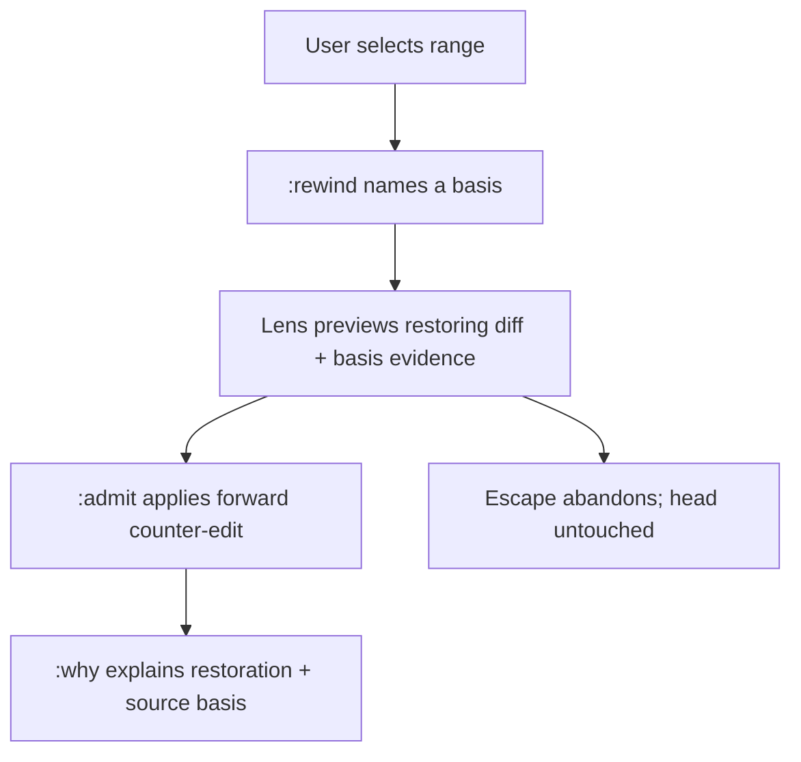

# WF-0155 - Causal Undo Family

## Linked Issue

- https://github.com/flyingrobots/jedit/issues/270

## Decision Summary

Undo becomes a family of causal operations layered on the signature loop
rather than a stack pop: (1) regional time-rewind restores a cursor-scoped
range to its state at a named time or checkpoint via materialize + diff;
(2) surgical revert attributes a line to its originating fact, synthesizes the
inverse, and commutes it to head via anchor transforms; (3) cascade revert
computes downstream dependency closure from basis-bound edit evidence. Every
variant is a forward counter-edit proposal strand behind preview -> admit —
never history deletion. Plain `u`/`ctrl+r` stays untouched; the family lives
near `:why` and `g?`.

## Sponsored Human

A Jim user wants to point at a line and undo the change that introduced it —
or rewind a region to last Wednesday — so that recovery is targeted, without
having to hand-reconstruct the past or globally rewind unrelated work.

## Sponsored Agent

An agent operator needs "revert everything this agent's edit caused
downstream" as one reviewable proposal strand so that machine edits are
recoverable at the same granularity they were made, without diff archaeology.

## Hill

By the end of this family's first cycle, a user can select a range and
propose its restoration to a named historical basis, preview the resulting
strand, and admit it — with the repo proving the proposal is a forward
counter-edit whose evidence chain replays.

## Current Truth

- Plain undo/redo works and is provenance-named as of WF-0154
  (`spec/workspace-text-boundaries.spec.mjs`, `spec/undo-provenance.spec.mjs`).
- Anchor commutation primitives exist:
  `src/domain/anchor-transform-contract.ts` (`transformPointAnchor`, bias,
  receipts).
- Attribution front end is specced but unbuilt:
  `docs/method/backlog/cool-ideas/JEDIT_why-is-this-character-here-debugger.md`
  (`g?`), blocked on Echo session/event attribution.
- Historical Basis Preview (roadmap goalpost 3) and proposal strands /
  `:admit` (goalpost 4) are unshipped; this family composes them.
- Origin and blast-radius laws:
  `docs/method/backlog/cool-ideas/causal-undo-family.md`.
- Open substrate question: whether `RopeDiff` facts retain replaced bytes
  (cheap local inversion) or ranges only (inversion materializes adjacent
  states); pin before slicing surgical revert.

## Problem

Recovery today is all-or-nothing temporal: `u` walks the whole-buffer stack.
Users and agent operators cannot undo a *specific* past change or a *region's*
drift without manually reconstructing text, even though the substrate records
everything needed to do it lawfully.

## Scope

This cycle includes (first slice only; later slices are follow-on cycles):

- Regional time-rewind: select range + named basis (time/checkpoint) ->
  materialized historical window -> diff -> `replaceRange` proposal strand ->
  preview -> `:admit`.
- The proposal strand carries source-basis evidence so `:why` explains the
  restoration.

## Non-Goals

This cycle does not include:

- Surgical revert and cascade (later slices; need attribution + commutation).
- `g?` attribution UI (separate cool-idea, blocked on Echo).
- Any change to plain `u`/`ctrl+r` semantics.
- Collaboration or multi-worldline braiding.

## User Experience / Product Shape

Visual-select a range (or accept the current line), `:rewind <basis>`; a lens
shows the proposed restoration as a diff against head with the source basis
named; `:admit` applies it as an ordinary forward edit; escape abandons. The
head never moves until admission.

### User Journey



### Wide UI Mockup

Deferred to cycle activation; the preview reuses the existing lens/diff
surfaces (no new chrome planned).

### Narrow UI Mockup

Deferred with the wide mockup; wrapping and footer behavior follow the
existing preview-lens rules.

### Accessibility Considerations

The proposal is announced as a structured pending strand with named basis and
range; admission/abandonment emit the standard notification facts.

## Runtime / API Contract

- `:rewind` resolves a named basis (checkpoint id or relative time) to a
  bounded historical reading for the selected range.
- The restoration is planned as a standard `replaceRange` intent whose
  provenance names the operation `rewind` and references the source basis.
- No new persistence: the proposal is a pending intent; admitted output is an
  ordinary edit fact.

## Lower Modes

- Agent-facing JSON: the proposal strand, its basis reference, and the diff
  are readable through the history/why JSON surfaces before admission.
- When retention for the named basis is unavailable, the command returns a
  typed obstruction naming the missing retention — never a silent fallback.

## Data / State Model

| Category | Description |
| --- | --- |
| Source of truth | Causal history; the proposal is a pending intent until admitted. |
| Derived state | Materialized historical window and restoring diff. |
| Invalid states | Admitted restoration without basis evidence; preview mutating head. |
| Reset behavior | Abandoning the preview discards derived state only. |
| Serialization | Provenance kind `rewind` + basis reference on the settlement (additive). |
| Deterministic assumptions | Same basis + same range => identical proposal bytes. |

## Accessibility Posture

| Concern | Posture |
| --- | --- |
| Semantic labels or facts | Proposal strand carries named kind, basis, range. |
| Focus order or ownership | Preview lens follows existing lens focus rules. |
| Hidden or visual-only information | None; JSON surfaces mirror the lens. |
| Keyboard behavior | `:rewind`, `:admit`, escape; no new chords. |
| Secret or redaction behavior | Not applicable. |

## Localization / Directionality Posture

| Concern | Posture |
| --- | --- |
| User-visible strings | `:rewind` prompts, obstruction messages. |
| Catalog keys | Via the bijou-i18n catalog path. |
| Supported locales updated | With string introduction. |
| Directionality assumptions | None; existing surfaces. |
| Validation command | Existing i18n generation + doc specs. |

## Agent Inspectability / Explainability Posture

- Proposal strands, basis references, and admission receipts are readable
  through history JSON before and after admission; `:why` explains admitted
  restorations.

## Linked Invariants

- Undo is authored counter-history, not deletion.
- Preview and structural inspection surfaces are projections over buffer
  truth, not competing sources of truth.
- Echo authority remains outside jedit product nouns.
- Tests are executable spec.

## Design Alternatives Considered

### Option A: Ship surgical revert first

Pros:

- The most-asked-for gesture ("undo the change that introduced this line").

Cons:

- Requires attribution (`g?`, Echo-blocked) and inverse commutation; highest
  theory load; wrong first slice.

### Option B (chosen): Ship regional time-rewind first

Pros:

- No commutation: materialize + diff; exercises Historical Basis Preview and
  proposal strands exactly as the roadmap intends; delivers the causal-undo
  experience at a tenth of the machinery.

Cons:

- Defers the headline surgical gesture one cycle.

## Decision

Option B. Surgical revert and cascade follow as separate cycles once `g?`
attribution and commutation land; cascade obeys the blast-radius containment
laws (dependency = non-commutation; minimal honest bases; ring preview with
budget; surgical escape valve).

## Implementation Slices

- [ ] Slice 1: Basis resolution + bounded historical window for a range
      (RED: obstruction when retention is missing).
- [ ] Slice 2: Restoring-diff proposal strand + preview lens.
- [ ] Slice 3: `:admit` path with `rewind` provenance naming; `:why` proof.

## Tests To Write First

Behavior tests required:

- [ ] Rewind proposal for a range reproduces the historical bytes exactly
      (fails before materialization lands).
- [ ] Admission applies a forward edit whose settlement names `rewind` and
      the source basis.
- [ ] Missing retention yields the typed obstruction, not a fallback.

Documentation and process tests, only if relevant:

- [ ] Design/roadmap linkage assertions per docs-release conventions.

## Acceptance Criteria

The work is done when:

- [ ] A selected range can be previewed and admitted back to a named basis.
- [ ] Head never changes before admission (spec-proven).
- [ ] `:why` explains the restoration with its basis.
- [ ] Docs/changelog updated; issue and PR linked; CI green.

## Validation Plan

```bash
npm run build
node --test --test-concurrency=1 spec/rewind-*.spec.mjs
npm run quality
```

## Playback / Witness

To be named at cycle activation (rewind witness spec + TUI reproduction
sequence).

## Risks

Known risks:

- Retention gaps make honest rewind impossible for old bases.
- Basis vocabulary (time vs checkpoint) may outrun what Echo retains.

Mitigations:

- Typed obstructions for missing retention are first-class outcomes.
- Start with checkpoint-named bases; add relative time only when retention
  proves it.

## Follow-On Debt

- Surgical revert cycle (attribution + inverse + commutation).
- Cascade cycle under the blast-radius containment laws.
- `g?` attribution (existing cool-idea).

## Retrospective

Fill this in after implementation.

What changed from the design:

- ...

What the tests proved:

- ...

What remains open:

- ...

PR:

- https://github.com/flyingrobots/jedit/pull/<number>
