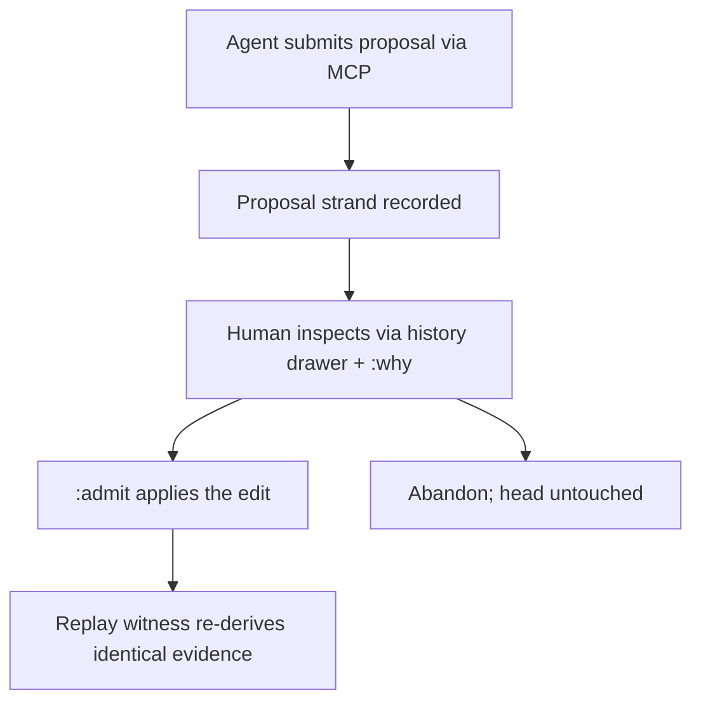

# WF-0156 - Real Echo WASM In-Tree And The Accountable-Edit Demo

## Linked Issue

- https://github.com/flyingrobots/jedit/issues/271

## Decision Summary

The real Echo engine becomes an in-tree dependency behind the existing
transport seam, validated by a differential parity witness against the
installed TypeScript contract implementation, and proven by one end-to-end
demo: an agent submits a proposal strand, a human inspects and admits it, and
a replay witness re-derives identical evidence. Five phases: (A) publish a
hash-pinned `@flyingrobots/echo-warp-wasm` package from the echo repo;
(B) a real transport adapter promoting the loading/ABI logic from
`scripts/jedit-echo-witness.mjs`; (C) an `echoWasm` member on
`TextRuntimeProfile`; (D) the parity witness wired into the release gate,
gating any default cutover; (E) the demo. The three-month TypeScript
implementation stops being a placeholder and becomes the conformance oracle.

## Sponsored Human

A Jim maintainer wants the engine the product story names to actually run
under the editor so that dogfooding hours harden Echo instead of a
simulation, without a sibling-checkout ritual (`ECHO_WARP_WASM_DIR`).

## Sponsored Agent

An agent needs a durable, versioned Echo boundary and a proposal-submission
tool so it can produce accountable edits with basis, range, rationale, and
admission paths, without reaching around the product into runtime internals.

## Hill

By the end of this lane, `JEDIT_TEXT_RUNTIME=echoWasm` runs the real engine
for open/edit/read/checkpoint, the parity witness proves it indistinguishable
from the installed implementation on identical scripts, and the demo
recording shows propose -> inspect -> admit -> replay with re-derived
evidence.

## Current Truth

- Production text runs the in-process TypeScript Echo-contract implementation
  (`src/adapters/installed-jedit-contract-echo-transport.ts`); zero `.wasm`
  files exist in the repo.
- Real Echo is exercised only by opt-in witnesses requiring a sibling
  checkout (`scripts/run-real-echo-wasm-stack-witness.sh` requires
  `ECHO_WARP_WASM_DIR`); the WASM stack spec skips in CI when
  `JEDIT_ECHO_WASM_MODULE` is unset
  (`spec/jedit-echo-wasm-stack-witness.spec.mjs`).
- The wire layer is ready: `src/transport/eint.ts` mirrors `echo_wasm_abi`,
  and `TextRuntimeProfile` is a single-member union with obstruction-typed
  parsing built to receive a second member
  (`src/app/text-runtime-profile.ts`).
- Root identity is replay-stable as of WF-0154
  (`spec/root-identity-determinism.spec.mjs`) — the precondition for
  differential evidence comparison.
- An MCP witness surface exists to extend for proposals
  (`src/adapters/jedit-echo-witness-mcp-adapter.ts`).
- VISION names `missing_retention` and `durable_replay_unavailable` as
  release-gate blockers, not acceptable end states.
- **Upstream dependency: Edict.** Echo's runtime execution semantics flow
  through the Edict pipeline (intent -> Core IR -> Echo Target IR -> WASM
  sandbox), and Edict `v0.11.0-alpha.1` states that participant admission,
  runtime execution, canonical full-manifest bytes, and the WASM sandbox are
  not implemented yet (Edict README, Current Status). The raw text-kernel
  byte ABI (`rmg_wasm` create/replace/textWindow) exists today without
  Edict, so Phases A-C are packaging/adapter work; Phase D's full gate
  (scheduler-owned tick, retained evidence, durable replay) and Phase E's
  admission step land behind Edict's runtime milestones.

## Problem

The gating strategy ("jedit is Echo's release gate") currently validates Echo
through a narrow hand-run witness while all real editing pressure hardens the
TypeScript stand-in. None of that evidence transfers to the Rust engine, and
the product's moat claim rests on an engine that is not in the tree.

## Scope

This lane includes (phases; each activates as its own cycle):

- Phase A (echo repo): versioned, hash-pinned `@flyingrobots/echo-warp-wasm`
  npm package owning the byte ABI and package export boundary.
- Phase B: `createEchoWasmJeditContractTransport` behind the same seam as the
  installed transport, promoting witness-script loading into an adapter.
- Phase C: `echoWasm` profile member; default remains `echoHosted`.
- Phase D: differential parity witness — identical scripts through both
  transports must yield identical readings, evidence, and obstruction
  posture; wired into `release-gate:jedit-echo`; default cutover gated on
  parity plus Echo clearing its retention/replay blockers.
- Phase E: the demo — agent proposes via MCP, human inspects (`:why`,
  history drawer), `:admit`, replay witness re-derives identical evidence;
  scripted and recorded. One file, one proposal, one admit.

## Non-Goals

This lane does not include:

- Collaboration, Continuum, or multi-worldline braiding.
- Search Sets / `:%s` proposal preview (goalpost 4 owns that surface).
- Deleting the installed TypeScript transport — it remains the conformance
  oracle and the fallback profile.
- Echo feature work beyond the package/retention/replay boundary the gate
  already names.

## User Experience / Product Shape

No visible change until cutover: same editor, same commands. The demo adds an
agent-facing MCP tool (`jedit_propose_edit`) and exercises existing surfaces
(history drawer, `:why`, `:admit`). Post-cutover, the footer's authority
posture names the engine profile.

### User Journey



### Wide UI Mockup

Not applicable: no new rendered surface; existing drawer/lens/footer paths.

### Narrow UI Mockup

Not applicable: same as above.

### Accessibility Considerations

The demo's every step is JSON-witnessable; nothing is screen-only.

## Runtime / API Contract

- `@flyingrobots/echo-warp-wasm` exports the versioned WASM module and byte
  ABI; the adapter loads it without environment path lore.
- `createEchoWasmJeditContractTransport` implements the same transport seam
  as `createInstalledJeditContractEchoTransport`.
- `parseTextRuntimeProfile` accepts `echoWasm`; unsupported values keep the
  existing typed obstruction.
- Parity witness contract: for a scripted session (create, edits, reads,
  checkpoint, replay), both transports produce identical reading payloads,
  evidence identifiers, and obstruction postures.
- `jedit_propose_edit` MCP tool: basis, range, rationale, proposed text ->
  proposal strand id + admission path.

## Lower Modes

- Parity witness and demo script run headless with JSON reports (CI and
  agent consumption).
- When the WASM package is absent or version-mismatched, profile selection
  yields a typed obstruction naming the package requirement.

## Data / State Model

| Category | Description |
| --- | --- |
| Source of truth | Echo-owned causal substrate behind the transport seam. |
| Derived state | Parity reports; demo recordings. |
| Invalid states | Divergent evidence between transports for identical scripts (gate failure). |
| Reset behavior | Profile selection is per-process; no migration of local histories in this lane. |
| Serialization | Package version + module hash pinned in the lockfile and asserted by the adapter. |
| Deterministic assumptions | WF-0154 root-id determinism; Echo scheduler determinism per its own gate. |

## Accessibility Posture

| Concern | Posture |
| --- | --- |
| Semantic labels or facts | Proposal strands and admissions are structured facts. |
| Focus order or ownership | Unchanged. |
| Hidden or visual-only information | None; JSON witnesses mirror the demo. |
| Keyboard behavior | Unchanged. |
| Secret or redaction behavior | Not applicable. |

## Localization / Directionality Posture

| Concern | Posture |
| --- | --- |
| User-visible strings | Obstruction messages for missing package/profile. |
| Catalog keys | Via the bijou-i18n catalog path. |
| Supported locales updated | With string introduction. |
| Directionality assumptions | None. |
| Validation command | Existing i18n generation + doc specs. |

## Agent Inspectability / Explainability Posture

- The MCP tool returns structured strand ids and admission paths; parity and
  replay witnesses emit machine-readable reports; nothing requires scraping.

## Linked Invariants

- Echo authority remains outside jedit product nouns.
- jedit is the consumer, not the substrate.
- Witness reports stay honest about retention and replay obstructions.
- Tests are executable spec.

## Design Alternatives Considered

### Option A: Vendor the .wasm binary into this repo

Pros:

- No publish pipeline; immediate availability.

Cons:

- Unversioned drift against the echo repo; binary blobs in git; violates the
  "package is versioned, byte ABI is documented" boundary doctrine.

### Option B (chosen): Versioned npm package from the echo repo

Pros:

- Matches the stack's distribution channel; lockfile pinning; the boundary
  doctrine's "boring" Echo interface.

Cons:

- Requires echo-repo release work before jedit phases B-E can go green.

## Decision

Option B. Phase D is the hinge: no default cutover until the parity witness
is green in the release gate and Echo's retention/replay blockers are
cleared. The installed TypeScript transport is retained as oracle and
fallback.

## Implementation Slices

- [ ] Phase A (echo repo): publish hash-pinned `@flyingrobots/echo-warp-wasm`.
- [ ] Phase B: WASM transport adapter behind the installed seam.
- [ ] Phase C: `echoWasm` profile member + obstruction for missing package.
- [ ] Phase D: differential parity witness in the release gate.
- [ ] Phase E: `jedit_propose_edit` MCP tool + demo script + recording.

## Tests To Write First

Behavior tests required:

- [ ] Profile spec: `echoWasm` selects the WASM transport; absence of the
      package yields the typed obstruction (fails before phases B-C).
- [ ] Parity spec: scripted session through both transports produces
      identical readings/evidence/obstructions (fails before phase B).
- [ ] Demo spec: proposal -> admit -> replay re-derives identical evidence
      (fails before phase E).

Documentation and process tests, only if relevant:

- [ ] Release-gate report includes the parity verdict.

## Acceptance Criteria

The work is done when:

- [ ] `JEDIT_TEXT_RUNTIME=echoWasm` runs open/edit/read/checkpoint on the
      real engine.
- [ ] Parity witness is green in the release gate.
- [ ] The demo recording exists and its witness re-derives evidence.
- [ ] Docs/changelog updated; issues and PRs linked; CI green.

## Validation Plan

```bash
npm run build
node --test --test-concurrency=1 spec/echo-wasm-*.spec.mjs
npm run release-gate:jedit-echo
npm run quality
```

## Playback / Witness

To be named at cycle activation (parity witness + demo script + recording
path).

## Risks

Known risks:

- Edict readiness is the pacing dependency: runtime execution, participant
  admission, and the WASM sandbox are unimplemented at `v0.11.0-alpha.1`,
  and Phases D-E cannot go green until Echo hosts them.
- Echo-repo readiness: retention and durable replay are admitted blockers.
- ABI drift between the package and `src/transport/eint.ts`.
- Parity divergence exposing semantic gaps the TS implementation papered
  over.

Mitigations:

- Sequence around Edict: land Phases A-C (package, adapter, profile) against
  the existing text-kernel byte ABI now, and scope an interim parity witness
  to the create/replace/read/checkpoint script that ABI already serves;
  widen the gate to scheduler/retention/replay as Edict milestones land.
- Phase D treats divergence as the product working as designed: every
  divergence becomes an Echo conformance bug with a jedit-authored witness.
- EINT codec round-trip tests pin the ABI on both sides.
- Cutover is gated, not scheduled; `echoHosted` remains the default until
  the gate says otherwise.

## Follow-On Debt

- Retire the sibling-checkout witness scripts once the package path covers
  them.
- Native Echo speculative-intent undo metadata (BEARING third lane).

## Retrospective

Fill this in after implementation.

What changed from the design:

- ...

What the tests proved:

- ...

What remains open:

- ...

PR:

- https://github.com/flyingrobots/jedit/pull/<number>
