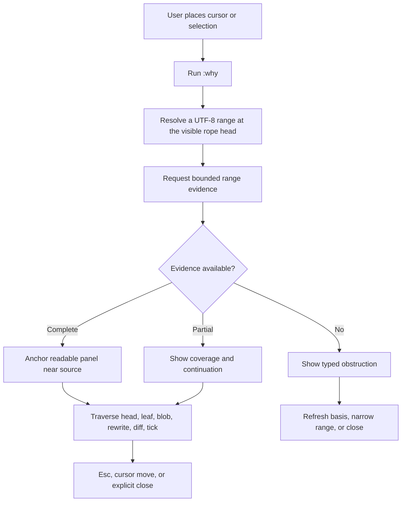
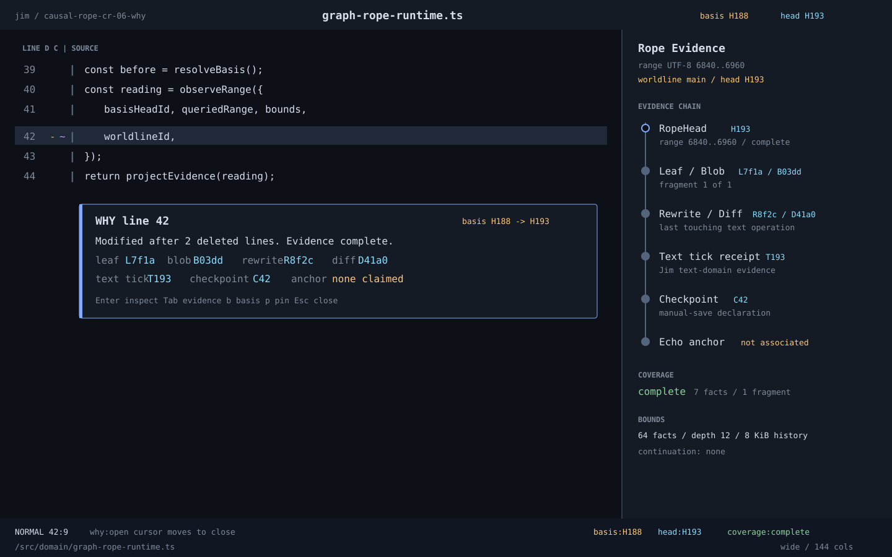
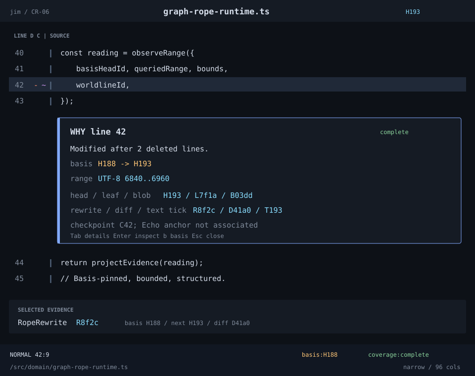
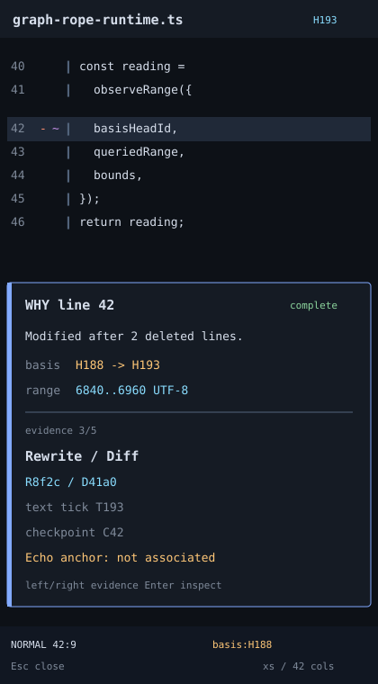
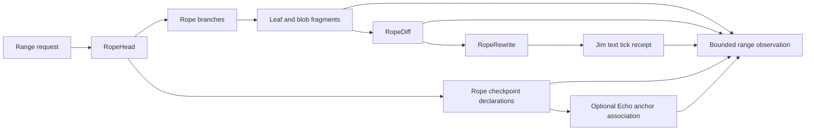

# WF-0157 - Rope Fact Inspector And Runtime-Backed Range Why

## Linked Issue

- [#209 Design rope fact inspector and range why UI](https://github.com/flyingrobots/jedit/issues/209)

## Decision Summary

Jim will expose one bounded, basis-pinned range-evidence observation as the
shared source for human `:why`, the developer rope fact inspector, gutter and
footer explainers, and machine-readable agent output. The observation reports
coverage fragments from the requested `RopeHead` through contributing leaves
and blobs, then cites retained rewrite, diff, text-tick, checkpoint, and
optional Echo anchor evidence without synthesizing missing identities. The TUI
projects that structured result into an anchored panel and an optional wide
inspector drawer; it does not parse a prose report or inspect private runtime
maps.

## Sponsored Human

A Jim daily driver wants to ask why a character, line, selection, deletion, or
file state exists so that causal history is useful during ordinary editing,
without reading opaque logs or racing a disappearing toast.

## Sponsored Agent

An agent needs a deterministic range-evidence response with an explicit head,
UTF-8 range, bounds, coverage, evidence references, and typed obstructions so
it can reason about text ancestry without scraping terminal cells or
reimplementing Echo or Jim identity algorithms.

## Hill

By the end of CR-06, a user can run `:why` over graph-backed text and inspect a
persistent explanation citing every retained layer from the current rope head
through leaf/blob and rewrite/diff/tick evidence. Tests prove imported, edited,
checkpointed, and unsupported generated-text outcomes, while gutter and footer
details consume the same evidence model.

## Current Truth

The merge target is
[`6c4a54cda6d47b297a90ceed580691a2bc2b1fb8`](https://github.com/flyingrobots/jedit/commit/6c4a54cda6d47b297a90ceed580691a2bc2b1fb8).

- The public `JeditWhyRangeReport` names a worldline, current head, queried
  range, reverse walk, and one produced-or-unavailable result, but it has no
  leaf, blob, checkpoint, anchor, coverage, bound, or continuation model.
  [`src/ports/jedit-why-range.ts#L21:6c4a54cda6d47b297a90ceed580691a2bc2b1fb8`](https://github.com/flyingrobots/jedit/blob/6c4a54cda6d47b297a90ceed580691a2bc2b1fb8/src/ports/jedit-why-range.ts#L21)
- The current implementation reconstructs a pseudo-diff from retained local
  `TickMetadata`, derives rewrite and diff identifiers through local conversion
  helpers, and aliases tick to rewrite plus receipt to diff. Those aliases are
  not proof that distinct runtime facts were observed.
  [`src/app/jedit-why-range.ts#L98:6c4a54cda6d47b297a90ceed580691a2bc2b1fb8`](https://github.com/flyingrobots/jedit/blob/6c4a54cda6d47b297a90ceed580691a2bc2b1fb8/src/app/jedit-why-range.ts#L98)
  [`src/app/jedit-why-range.ts#L143:6c4a54cda6d47b297a90ceed580691a2bc2b1fb8`](https://github.com/flyingrobots/jedit/blob/6c4a54cda6d47b297a90ceed580691a2bc2b1fb8/src/app/jedit-why-range.ts#L143)
- The legacy range-why spec still constructs the production-unsafe full
  snapshot fixture and asserts those identity aliases. It proves coordinate
  walking behavior, not graph-backed provenance.
  [`spec/jedit-why-range.spec.mjs#L7:6c4a54cda6d47b297a90ceed580691a2bc2b1fb8`](https://github.com/flyingrobots/jedit/blob/6c4a54cda6d47b297a90ceed580691a2bc2b1fb8/spec/jedit-why-range.spec.mjs#L7)
  [`spec/jedit-why-range.spec.mjs#L43:6c4a54cda6d47b297a90ceed580691a2bc2b1fb8`](https://github.com/flyingrobots/jedit/blob/6c4a54cda6d47b297a90ceed580691a2bc2b1fb8/spec/jedit-why-range.spec.mjs#L43)
- Graph-rope authority already defines distinct worldline, head, leaf, blob,
  rewrite, diff, and text-tick receipt facts.
  [`src/domain/graph-rope-types.ts#L89:6c4a54cda6d47b297a90ceed580691a2bc2b1fb8`](https://github.com/flyingrobots/jedit/blob/6c4a54cda6d47b297a90ceed580691a2bc2b1fb8/src/domain/graph-rope-types.ts#L89)
  [`src/domain/graph-rope-types.ts#L156:6c4a54cda6d47b297a90ceed580691a2bc2b1fb8`](https://github.com/flyingrobots/jedit/blob/6c4a54cda6d47b297a90ceed580691a2bc2b1fb8/src/domain/graph-rope-types.ts#L156)
- Checkpoint declarations and optional Echo anchor associations are already
  separate application facts, so `:why` must not infer an anchor from a
  checkpoint.
  [`src/domain/graph-rope-types.ts#L261:6c4a54cda6d47b297a90ceed580691a2bc2b1fb8`](https://github.com/flyingrobots/jedit/blob/6c4a54cda6d47b297a90ceed580691a2bc2b1fb8/src/domain/graph-rope-types.ts#L261)
  [`src/domain/graph-rope-types.ts#L302:6c4a54cda6d47b297a90ceed580691a2bc2b1fb8`](https://github.com/flyingrobots/jedit/blob/6c4a54cda6d47b297a90ceed580691a2bc2b1fb8/src/domain/graph-rope-types.ts#L302)
- `GraphRopeRuntime` exposes basis-pinned text windows, causal line diffs, and a
  debug rope shape, but not a bounded range-provenance observation.
  [`src/domain/graph-rope-runtime.ts#L146:6c4a54cda6d47b297a90ceed580691a2bc2b1fb8`](https://github.com/flyingrobots/jedit/blob/6c4a54cda6d47b297a90ceed580691a2bc2b1fb8/src/domain/graph-rope-runtime.ts#L146)
- Workspace inline panels already stay tied to a buffer and cursor anchor and
  close on `Esc`, focus loss, buffer change, or cursor movement. Their payload
  is currently only a title, message, and tone.
  [`src/app/workspace/workspace-inline-panel.ts#L17:6c4a54cda6d47b297a90ceed580691a2bc2b1fb8`](https://github.com/flyingrobots/jedit/blob/6c4a54cda6d47b297a90ceed580691a2bc2b1fb8/src/app/workspace/workspace-inline-panel.ts#L17)
  [`src/app/workspace/workspace-inline-panel.ts#L64:6c4a54cda6d47b297a90ceed580691a2bc2b1fb8`](https://github.com/flyingrobots/jedit/blob/6c4a54cda6d47b297a90ceed580691a2bc2b1fb8/src/app/workspace/workspace-inline-panel.ts#L64)
- The architectural gate already requires range `:why` to cite head, leaf,
  blob, rewrite, diff, tick, and checkpoint evidence.
  [`docs/design/0149-graph-backed-rope-runtime-discovery.md#L880:6c4a54cda6d47b297a90ceed580691a2bc2b1fb8`](https://github.com/flyingrobots/jedit/blob/6c4a54cda6d47b297a90ceed580691a2bc2b1fb8/docs/design/0149-graph-backed-rope-runtime-discovery.md#L880)
- [PR #205](https://github.com/flyingrobots/jedit/pull/205) established that
  runtime-honesty gate. CR-00 through CR-05 subsequently landed the graph-rope,
  coordinate, materialization, durability, and gutter prerequisites.

## Problem

Jim has the facts and a persistent panel foundation, but the active `:why`
pipeline does not observe those facts. It walks local session metadata, emits a
single prose string, and equates identities that the graph model keeps
distinct. The TUI therefore cannot show leaf/blob coverage, fragmented range
ancestry, checkpoint declarations, optional anchor associations, bounds, or
typed stale evidence without inventing a second explanation model.

The developer inspector has a related risk. Exposing `factsById` or raw runtime
maps would make private storage shape a product protocol and invite unbounded
graph dumps. The correct surface is a bounded Jim-owned observation over
admitted Jim facts, with Echo-owned references treated as opaque.

## Scope

This cycle includes:

- a Jim-owned request and response contract for basis-pinned UTF-8 range
  explanations;
- fragmented leaf/blob coverage for ranges crossing rope boundaries;
- retained rewrite, diff, text-tick receipt, basis-head, checkpoint, and
  optional anchor-association references;
- typed complete, partial, stale, unavailable, unauthorized, and bound-exceeded
  posture;
- one structured payload consumed by prose, TUI, gutter/footer, and agent
  projections;
- a persistent anchored panel with wide, narrow, and extra-small layouts;
- deterministic witnesses for imported, edited, checkpointed, and unsupported
  generated text.

## Non-Goals

This cycle does not include:

- adding Jim mutation authority to the inspector;
- exposing raw `factsById`, WAL records, Echo scheduler internals, or private
  graph storage;
- minting, hashing, decoding, or predicting Echo identities in TypeScript;
- claiming that every text tick is an Echo control-plane receipt;
- implementing native generated Edict mutation invocation;
- materializing unbounded deleted text;
- implementing Graft-derived symbol and function scopes;
- turning checkpoint declarations into implicit causal anchors;
- deriving causal evidence from Git.

Bounded historical deleted-text exploration is tracked by
[#278](https://github.com/flyingrobots/jedit/issues/278). Basis-pinned symbol
and function scopes are tracked by
[#279](https://github.com/flyingrobots/jedit/issues/279).

## User Experience / Product Shape

The default editor stays quiet. Receipt-backed gutter glyphs summarize where
causal evidence exists. `:why` opens a compact panel at the cursor or selected
range. The panel gives a human answer first and exposes a traversable evidence
chain second. A wide terminal can additionally open a developer inspector on
the right without changing editor focus or text coordinates.

The user is trying to answer:

1. What text or boundary am I asking about?
2. Which rope head and UTF-8 range were actually observed?
3. Which leaf and blob supply these bytes?
4. Which rewrite, diff, and text tick last touched them?
5. Which checkpoint declarations or Echo anchors are related?
6. Is the answer complete, partial, stale, unavailable, or unauthorized?

The answer remains visible until the cursor leaves its supported range, the
buffer or head changes, `Esc` closes it, or another explanation replaces it.
Evidence that becomes stale changes to an obstruction; it does not remain on
screen with a current-looking label.

### User Journey



### Wide UI Mockup

The `wide` profile begins at 120 columns. It keeps source readable, anchors the
immediate answer beside the requested line, and gives the optional inspector a
right drawer. The standalone SVG uses named Jim semantic token roles with
representative preview values; implementation resolves those roles from the
active theme.



### Narrow UI Mockup

The `narrow` profile spans 72 through 119 columns. It does not reserve a side
drawer. The evidence chain becomes a word-wrapped panel below the anchor row,
or above when the remaining viewport is too short.



### Extra-Small UI Mockup

The `xs` profile is below 72 columns. It renders a bounded bottom sheet with a
single selected evidence node and paging actions. Source, range, basis, and
coverage remain textual; no identity is communicated by horizontal position.



### Deleted-Line Exploration

A deletion marker identifies a boundary, not a surviving line. `:why` on that
marker explains the boundary through its diff and rewrite support. The compact
CR-06 panel shows counts and identities. Follow-on issue #278 will add bounded,
read-only virtual rows for the deleted historical text. Those rows will never
enter the current rope or alter cursor coordinates.

### Scope Model

The evidence core accepts a UTF-8 range, not a UI noun. Scope adapters resolve
human intent before calling it:

| Scope | Resolver | Authority posture |
| --- | --- | --- |
| Character | UTF-16/line-column to UTF-8 adapter | Text authority when the visible head matches. |
| Line | Basis-pinned line index | Disposable projection over the named head. |
| Selection | Editor selection to UTF-8 adapter | Text authority when bounds validate. |
| Deletion | Causal deletion boundary reading | Historical range at the retained basis head. |
| Symbol | Graft semantic projection | Deferred to #279; must name the same head. |
| Function | Graft semantic projection | Deferred to #279; must name the same head. |
| File | Full head range with explicit bounds | Summary first; never an unbounded fact dump. |

### Accessibility Considerations

- Every glyph has a textual evidence label.
- Color is redundant; `inserted`, `modified`, `deleted`, `partial`, and
  `obstructed` are present in the payload and prose.
- The panel does not steal editor focus when it first opens.
- Keyboard traversal uses `Tab`, `Shift-Tab`, arrows, `Enter`, and `Esc`.
- Evidence text wraps at word boundaries, then grapheme-safe hard boundaries
  for a single oversized opaque identifier.
- The source gutter remains a fixed left-to-right coordinate surface in RTL
  locales; localized panel prose follows locale direction.
- Agents and screen readers consume the structured evidence tree rather than
  inferring relationships from line art.

## Runtime / API Contract

The domain contract is a Jim-owned bounded observation. Exact exported names
may move during implementation, but these fields and distinctions are binding.

```ts
interface JeditWhyRangeRequest {
  readonly worldlineId: string;
  readonly basisHeadId: string;
  readonly queriedRange: TextByteRange;
  readonly bounds: JeditWhyEvidenceBounds;
}

interface JeditWhyEvidenceBounds {
  readonly maxFacts: number;
  readonly maxDepth: number;
  readonly maxHistoricalTextBytes: number;
}

type JeditWhyRangeObservation =
  | JeditWhyRangeAvailable
  | JeditWhyRangeObstructed;

interface JeditWhyRangeAvailable {
  readonly kind: "available";
  readonly worldlineId: string;
  readonly basisHeadId: string;
  readonly queriedRange: TextByteRange;
  readonly coverage: JeditWhyCoverage;
  readonly fragments: readonly JeditWhyRangeFragment[];
  readonly relatedCheckpoints: readonly JeditWhyCheckpointEvidence[];
  readonly inspectedFactCount: number;
}

interface JeditWhyRangeFragment {
  readonly coveredRange: TextByteRange;
  readonly headId: string;
  readonly leafId: string;
  readonly blobId: string;
  readonly origin: JeditWhyRangeOrigin;
}

type JeditWhyRangeOrigin =
  | JeditWhyImportedOrigin
  | JeditWhyRewriteOrigin
  | JeditWhyOriginUnavailable;

interface JeditWhyRewriteOrigin {
  readonly kind: "rewrite";
  readonly rewriteId: string;
  readonly diffId: string;
  readonly textTickReceiptId: string;
  readonly basisHeadId: string;
  readonly nextHeadId: string;
}

interface JeditWhyCheckpointEvidence {
  readonly checkpointId: string;
  readonly headId: string;
  readonly reason: RopeCheckpointReason;
  readonly anchorAssociation?: {
    readonly associationId: string;
    readonly causalAnchorId: string;
    readonly causalAnchorFactId: string;
    readonly causalAnchorReceiptId: string;
  };
}
```

`JeditWhyImportedOrigin` cites the initial worldline, head, leaf, and blob
without inventing a rewrite or diff. `JeditWhyOriginUnavailable` carries a
typed retention or support reason for its fragment. Mixed-origin ranges return
multiple fragments; they are not collapsed into one falsely universal
producer.

`textTickReceiptId` refers to the Jim text-domain `TickReceiptFact`. It must not
be labeled as an Echo control receipt unless a separate opaque Echo evidence
reference supports that claim. Echo-owned anchor and receipt IDs are compared,
stored, and returned opaquely.

### Coverage

```ts
type JeditWhyCoverage =
  | {
      readonly kind: "complete";
      readonly coveredRange: TextByteRange;
    }
  | {
      readonly kind: "partial";
      readonly coveredRanges: readonly TextByteRange[];
      readonly continuation: string;
      readonly reason: string;
    };
```

A continuation is opaque. Jim must not encode graph internals into a token that
callers are expected to interpret. Empty evidence is never reported as
complete merely because no rows were returned.

### Typed Obstructions

At minimum, the contract distinguishes:

- invalid or empty UTF-8 range;
- missing worldline or head;
- worldline/head mismatch;
- stale visible head;
- missing leaf, blob, rewrite, diff, or receipt support;
- retained-history horizon;
- fact, depth, or historical-byte bound exceeded;
- unavailable blob bytes;
- unauthorized or redacted evidence;
- stale derived line or semantic projection;
- generated text without retained generation evidence.

Every obstruction includes the requested basis, recoverability, and a stable
code. Human wording is localized outside the domain observation.

### Authority Boundary

- Jim owns text facts, range semantics, checkpoint declarations, and the
  explanation projection.
- A checkpoint declaration does not imply an Echo anchor.
- Echo owns admission, scheduling, causal control history, anchor facts, and
  Echo receipts.
- The current graph-rope runtime may expose a transitional read seam, but the
  observation contract must remain independent of its private map layout.
- Generated Edict operations will eventually own mutation invocation. This
  design adds no new handwritten mutation or inverse protocol.
- Caches, line indexes, syntax readings, and rendered panels are disposable.

## Lower Modes

The same observation must support:

- deterministic JSON returned by the application port;
- CLI or JSONL projection without ANSI or layout dependencies;
- MCP projection through a future generated observation surface;
- no-color text with explicit semantic labels;
- partial results with opaque continuation tokens;
- typed obstruction when Echo, Graft, blob storage, or retained facts are
  unavailable.

Illustrative machine response:

```json
{
  "kind": "available",
  "worldlineId": "worldline:opaque:main",
  "basisHeadId": "head:opaque:H193",
  "queriedRange": {
    "startByte": { "kind": "utf8-byte-offset", "value": 6840 },
    "endByte": { "kind": "utf8-byte-offset", "value": 6960 }
  },
  "coverage": {
    "kind": "complete",
    "coveredRange": {
      "startByte": { "kind": "utf8-byte-offset", "value": 6840 },
      "endByte": { "kind": "utf8-byte-offset", "value": 6960 }
    }
  },
  "fragments": [
    {
      "leafId": "leaf:opaque:L7f1a",
      "blobId": "blob:opaque:B03dd",
      "origin": {
        "kind": "rewrite",
        "rewriteId": "rewrite:opaque:R8f2c",
        "diffId": "diff:opaque:D41a0",
        "textTickReceiptId": "text-receipt:opaque:T193",
        "basisHeadId": "head:opaque:H188",
        "nextHeadId": "head:opaque:H193"
      }
    }
  ],
  "relatedCheckpoints": [
    {
      "checkpointId": "checkpoint:opaque:C42",
      "headId": "head:opaque:H193",
      "reason": "manual-save"
    }
  ],
  "inspectedFactCount": 7
}
```

This example deliberately omits `anchorAssociation`: a checkpoint declaration
does not imply one.

## Data / State Model

| Category | Description |
| --- | --- |
| Source of truth | Retained Jim graph-rope facts plus explicitly associated opaque Echo evidence. |
| Derived state | Range observation, line/symbol scope resolution, prose, panel layout, inspector tree, and caches. |
| Invalid states | Basis/head mismatch, fragment outside query, rewrite without its diff, claimed Echo authority without Echo evidence, or complete coverage with a gap. |
| Reset behavior | Discard observation and rebuild from a named head; never reconstruct authority from prose or rendered cells. |
| Serialization | Branded coordinate values unwrap only in explicit JSON/CLI/MCP adapters. Opaque identities remain opaque strings. |
| Deterministic assumptions | Same retained facts, basis, range, bounds, schema, and observer policy produce the same ordered observation. |



## Accessibility Posture

| Concern | Posture |
| --- | --- |
| Semantic labels or facts | Every evidence node has a textual kind, opaque ID, and relationship. |
| Focus order or ownership | Opening `:why` preserves editor focus; explicit inspector focus is reversible. |
| Hidden or visual-only information | No causal claim exists only as color, line art, or gutter placement. |
| Keyboard behavior | `Esc` closes, arrows move, `Enter` expands, and tab order is deterministic. |
| Secret or redaction behavior | Redacted blobs retain range/hash/support posture without leaking text bytes. |

## Localization / Directionality Posture

| Concern | Posture |
| --- | --- |
| User-visible strings | Titles, evidence labels, coverage, actions, and obstruction messages use catalog keys. |
| Catalog keys | Added with the implementation slice that introduces each visible string. |
| Supported locales updated | Every installed catalog receives schema-complete values through generation. |
| Directionality assumptions | Relationships are ordered data, not ASCII arrow meaning; source coordinates remain LTR. |
| Validation command | Focused panel tests plus `npm run check`. |

## Agent Inspectability / Explainability Posture

Agents consume `JeditWhyRangeObservation` directly. They never parse the human
message or infer a fact from screen placement. The response names:

- application subject, worldline, and basis head;
- branded queried and covered UTF-8 ranges;
- complete or partial coverage and opaque continuation;
- each leaf/blob fragment and its origin posture;
- distinct rewrite, diff, text-tick receipt, checkpoint, and optional Echo
  anchor references;
- exact fact/depth/text bounds;
- typed obstruction and recovery posture.

The future MCP/CLI/JSONL adapter may rename transport fields through generated
schemas, but it must preserve these semantic distinctions.

## Linked Invariants

- Runtime truth beats type theater.
- Materialization is a reading, not reality.
- A cache or inspector is not text authority.
- Every causal claim names its basis.
- Echo identities are opaque and Echo authority is never manufactured in Jim.
- Checkpoint declaration and causal anchoring are separate propositions.
- Mixed-origin ranges preserve fragments instead of inventing one producer.
- Stale evidence fails closed.
- Tests and witnesses are executable spec.

## Design Alternatives Considered

### Option A: Enrich The Existing Prose String

Pros:

- Small renderer change.
- Reuses the current inline panel payload.

Cons:

- Forces TUI, tests, and agents to parse prose.
- Cannot represent fragmented coverage or typed bounds safely.
- Preserves legacy identity aliasing.

### Option B: Expose Raw Rope Facts And Runtime Maps

Pros:

- Minimal observation code.
- Maximum developer detail.

Cons:

- Makes private storage shape a public protocol.
- Encourages unbounded reads and authority leakage.
- Couples callers to transitional runtime internals.

### Option C: Bounded Structured Observation With Projections

Pros:

- One evidence truth for humans and agents.
- Keeps storage private and responses bounded.
- Supports partial coverage, stale refusal, and future generated adapters.
- Preserves separate Jim and Echo authority.

Cons:

- Requires a real range-provenance reader and structured panel model.
- Needs migration away from legacy fixture-based tests.

## Decision

Choose Option C. The graph-rope runtime will gain a bounded read operation that
returns Jim-owned range evidence. Product and agent ports will copy and project
that result without exposing mutable arrays or private fact maps. The current
Slice #239 removed the `TickMetadata` reverse-walk from the reachable product
path. `TextBufferSession.explainRange` now consumes the generated, bounded
`whyRange` observer through the installed Echo transport.

## Implementation Slices

- [x] Slice 1: Design rope fact inspector and range-why UI (#209).
- [x] Slice 2: Explain a range from head through leaf/blob/rewrite/diff/tick
  evidence (#239).
- [ ] Slice 3: Render structured evidence in the persistent anchored panel
  (#240).
- [ ] Slice 4: Add import, edit, checkpoint, and generated-text witnesses
  (#241).
- [ ] Slice 5: Reuse the evidence pipeline for gutter and footer explainers
  (#242).

## Tests To Write First

Behavior tests required:

- [x] Graph-rope range observation returns actual distinct retained fact IDs.
- [x] A range crossing leaves returns complete ordered coverage fragments.
- [x] Imported text does not invent rewrite/diff evidence.
- [x] Edited text cites the last touching retained rewrite, diff, and text tick.
- [x] Checkpoint declaration and optional anchor association remain distinct.
- [x] Missing or bounded-out support produces a typed obstruction or partial
  result.
- [ ] Structured panel remains until cursor/head invalidation or `Esc`.
- [ ] Gutter and footer explainers cite the same evidence IDs as range `:why`.

Documentation and process tests:

- [x] Design packet names every evidence layer and responsive profile.
- [x] SVG mockups use named semantic token roles instead of direct element
  colors.

## Acceptance Criteria

The work is done when:

- [ ] Runtime range evidence cites head, leaf, blob, rewrite, diff, text tick,
  checkpoint, and optional anchor evidence when retained.
- [ ] Imported and mixed-origin ranges are honest and fragmented.
- [ ] The visible panel and machine result share one structured payload.
- [ ] Stale and unsupported evidence fails closed.
- [ ] Wide, narrow, and extra-small layouts are covered.
- [ ] New visible strings are localized through the catalog schema.
- [ ] Gutter and footer details do not invent facts.
- [ ] CR-06 issues and PR are linked correctly.
- [ ] CI and local validation are green.

## Validation Plan

Commands expected before the CR-06 PR:

```bash
npm run build
node --test --test-concurrency=1 spec/rope-fact-inspector-design.spec.mjs
node --test --test-concurrency=1 spec/jedit-why-range.spec.mjs
node --test --test-concurrency=1 spec/workspace-command-line.spec.mjs
npm run quality
npm run check
```

Validate standalone SVGs with:

```bash
xmllint --noout docs/design/0157-rope-fact-inspector-wide.svg
xmllint --noout docs/design/0157-rope-fact-inspector-narrow.svg
xmllint --noout docs/design/0157-rope-fact-inspector-xs.svg
```

## Playback / Witness

After implementation:

1. Open a file through the Echo-hosted graph-rope profile.
2. Edit text spanning at least one rope leaf boundary.
3. Place the cursor over edited and imported text and run `:why`.
4. Confirm the panel stays open, names its head/range/coverage, and cites
   distinct retained facts.
5. Save, re-run `:why`, and confirm the checkpoint appears without an anchor
   unless an explicit anchor association exists.
6. Move the cursor or press `Esc` and confirm the panel closes.

The agent witness inspects the same response object as deterministic JSON.

## Risks

Known risks:

- Reverse provenance over path-copied leaves may confuse physical leaf origin
  with semantic last-touch origin.
- A range can contain fragments with different origins and retention posture.
- Checkpoint lookup could become an unbounded scan without a disposable index.
- UI code may be tempted to call a debug fact reader directly.
- Transitional Jim text ticks may be mislabeled as Echo control receipts.

Mitigations:

- Define fragment coverage and semantic origin separately.
- Require explicit bounds and continuation posture.
- Keep indexes reconstructible from retained facts.
- Expose only the observation port to product code.
- Name authorities and identity kinds in the payload.

## Follow-On Debt

- [#278 Add bounded deleted-text explorer to causal gutter and `:why`](https://github.com/flyingrobots/jedit/issues/278)
- [#279 Add basis-pinned symbol and function scopes to `:why`](https://github.com/flyingrobots/jedit/issues/279)

## Retrospective

Fill this in after CR-06 implementation.

What changed from the design:

- Pending.

What the tests proved:

- Pending.

What remains open:

- Pending.

PR:

- Pending.
