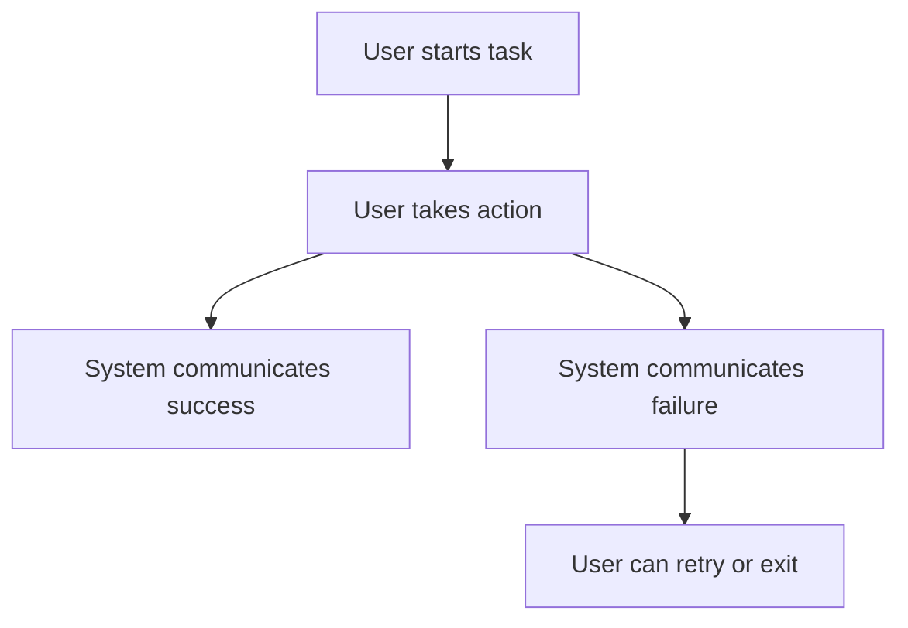
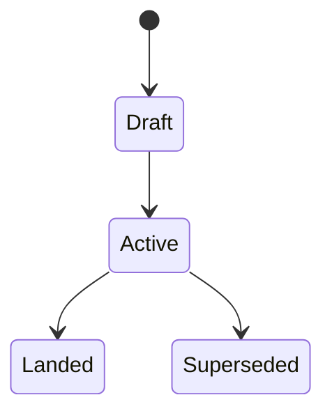

# <LEGEND>-<ID> - <Short Title>

## Linked Issue

- https://github.com/flyingrobots/jedit/issues/<number>

## Decision Summary

One short paragraph describing the decision this document is making.

This must be specific enough that a reviewer can say whether the implementation
matches the design. Avoid roadmap language. Say what will exist, what it will
do, and what boundary it owns.

## Sponsored Human

A <type of user> wants <capability/outcome> so that <reason>, without having to
<current pain or unsafe workaround>.

## Sponsored Agent

An agent needs <inspectable contract/tool/surface> so it can <operation>,
without inferring <unstable/private/visual-only state>.

## Hill

By the end of this cycle, <user/agent> can <observable outcome> through
<surface/API/command>, and the repo proves it with <tests/witnesses>.

## Current Truth

Describe what exists today. This section is factual, not aspirational.

Include concrete anchors:

- files
- commands
- exported APIs
- current docs and dogfood surfaces
- current failure mode
- relevant GitHub issues or PRs
- known test coverage

Provide links to evidence supporting strong claims, including source code or
test results at specific, fully qualified git commit SHAs.

Citation format:

```md
[<repo-relative-path>#<line-number>:<fully-qualified-commit-sha>](https://github.com/flyingrobots/jedit/blob/<fully-qualified-commit-sha>/<repo-relative-path>#L<line-number>)
```

Use the merge target SHA for pre-change truth. Use the PR or landed SHA in the
retrospective for implemented truth.

## Problem

State the actual problem.

Good:

- "The title modal keeps raytracing while a text input owns focus, so input
  latency can spike during startup."

Bad:

- "The startup screen should be nicer."

## Scope

This cycle includes:

- ...

## Non-Goals

This cycle does not include:

- ...

Non-goals prevent the design from silently expanding while the PR is in flight.

## User Experience / Product Shape

Use this section for rendered TUI, visible CLI, docs, or user-facing behavior.
If the work is not a rendered or user-facing surface, say "Not applicable" and
explain why.

Answer:

- What is the user trying to do?
- What are the user's goals?
- What are the user's pain points?
- What communicates system state and actions?
- What communicates success or failure?
- Can the user undo or retry?
- What animations or transitions exist?
- How does this behave in left-to-right and right-to-left locales?
- How does this behave for keyboard and screen-reader users?

### User Journey



### Wide UI Mockup

Embed a wide UI mockup image when the work changes rendered UI.

- Use an SVG in the design packet when static structure is enough.
- Use a generated or captured bitmap only when visual fidelity matters.
- State terminal dimensions and theme assumptions.

### Narrow UI Mockup

Embed a narrow UI mockup image when the work changes rendered UI.

- Include small terminal geometry and wrapping behavior.
- Include panel collapse, focus ownership, and footer behavior.

### Accessibility Considerations

<screen-reader/agent-friendly summary of state, actions, and facts>

If the work is not a rendered surface, say "Not applicable" and explain why.

## Runtime / API Contract

Name the software contract.

Include only relevant subsections:

- exported functions and types
- command intents
- schema input and output
- facts emitted
- state transitions
- layout, focus, and input boundaries
- Echo authority boundary
- Graft API boundary
- error behavior
- compatibility aliases or migration behavior

This is the section tests should be able to compile against.

## Lower Modes

Required when the work is user-visible, agent-visible, or has a non-visual
operation mode.

Describe:

- terminal size constraints
- no-color or reduced-color output
- JSON, pipe, fixture, or dry-run output
- keyboard-only operation
- behavior when optional adapters are unavailable
- behavior when Echo, Graft, or filesystem evidence is partial

If no lower mode applies, say "Not applicable" and explain why.

## Data / State Model

Describe state that persists, mutates, or crosses boundaries.

| Category | Description |
| --- | --- |
| Source of truth | ... |
| Derived state | ... |
| Invalid states | ... |
| Reset behavior | ... |
| Serialization | ... |
| Deterministic assumptions | ... |

Use Mermaid diagrams for complex state, entity relationships, or data flow.



## Accessibility Posture

State how accessibility is preserved.

| Concern | Posture |
| --- | --- |
| Semantic labels or facts | ... |
| Focus order or ownership | ... |
| Hidden or visual-only information | ... |
| Keyboard behavior | ... |
| Secret or redaction behavior | ... |

## Localization / Directionality Posture

Required when new visible strings are added or changed.

| Concern | Posture |
| --- | --- |
| User-visible strings | ... |
| Catalog keys | ... |
| Supported locales updated | ... |
| Directionality assumptions | ... |
| Validation command | ... |

If no strings change, say "Not applicable" and explain why.

## Agent Inspectability / Explainability Posture

Describe how an agent can inspect the result without scraping pixels or prose.

Examples:

- stable ids
- metadata fields
- emitted facts
- deterministic pipe output
- registry entries
- schema descriptions
- command ids
- machine-readable witness output

## Linked Invariants

List repo invariants this work must preserve.

Examples:

- Tests are executable spec.
- Runtime truth beats type theater.
- Design should become repo truth.
- Buffers, panes, panels, and lenses are different things.
- Files and previews are projections.
- Echo authority remains outside jedit product nouns.

## Design Alternatives Considered

### Option A: <name>

Pros:

- ...

Cons:

- ...

### Option B: <name>

Pros:

- ...

Cons:

- ...

## Decision

State the chosen option and why.

If the decision is temporary, name the expiration or migration window.

## Implementation Slices

- [ ] Slice 1: <smallest testable slice and intended commit message>
- [ ] Slice 2: <next slice>
- [ ] Slice 3: <next slice>

Each slice should be small enough to commit or review independently. Each slice
should correspond to one test case, user story, or inspectable process change.

If the right slices are unclear, budget a spike to understand the requirements
and slice appropriately.

## Tests To Write First

Behavior tests required:

- [ ] <package/runtime/render test that fails before implementation>
- [ ] <integration test that exercises user-visible behavior>
- [ ] <lower-mode or pipe/accessibility test, if relevant>
- [ ] <regression test for the specific bug or risk>

Documentation and process tests, only if relevant:

- [ ] <design/changelog/backlog/process assertion>

Rule: documentation tests cannot be the only proof for implementation work.

## Acceptance Criteria

The work is done when:

- [ ] Behavior test proves <contract>
- [ ] Rendered output or runtime API proves <user-visible outcome>
- [ ] Lower modes are covered, if relevant
- [ ] New strings have supported translations, if relevant
- [ ] Docs, changelog, or dogfood are updated when behavior or direction changes
- [ ] Issue and PR are linked correctly
- [ ] CI and local validation are green

## Validation Plan

Commands expected before PR:

```bash
npm run build
node --test --test-concurrency=1 <focused behavior tests>
npm run quality
```

Trim commands that do not apply. Add package-specific commands when needed.

## Playback / Witness

Describe what a reviewer can run or inspect.

Examples:

```bash
npm run jedit:echo:witness
node --test --test-concurrency=1 spec/<cycle>.spec.mjs
```

If there is a visual or TUI result, include the route, key sequence, terminal
size, theme, and locale needed to reproduce it.

## Risks

Known risks:

- ...

Mitigations:

- ...

## Follow-On Debt

Create GitHub issues for anything deferred.

Do not hide future work in prose. If it matters, it gets an issue.

## Retrospective

Fill this in after implementation.

What changed from the design:

- ...

What the tests proved:

- ...

What remains open:

- ...

PR:

- https://github.com/flyingrobots/jedit/pull/<number>
