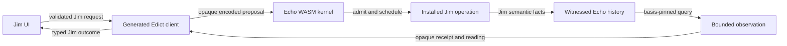
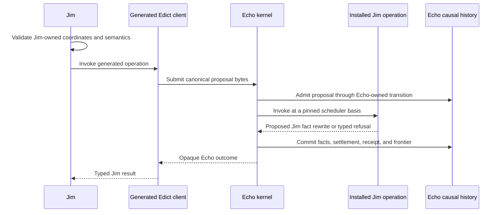

# Echo Application Hosting Guide

This guide states the current Jim/Echo integration boundary. It deliberately
does not describe the deleted process-local contract host as an Echo
integration.

Identity rules are governed by
[`docs/design/echo-identity-doctrine.md`](design/echo-identity-doctrine.md).

## Hard Rule

Application code proposes work. Echo owns admission, scheduling, ticks,
receipts, witnessed control history, and basis-pinned observation. Jim owns text
semantics and presentation. A TypeScript map, queue, runtime, or ledger inside
Jim may not impersonate any Echo-owned authority.

Test doubles are allowed only below `spec/` or `tests/`, must be injected
explicitly, and must use test-only identities. They are evidence fixtures, not
an alternate application mode.

## Current State

The production workspace performs these steps:

1. Load the configured Echo WASM module through
   `src/adapters/echo-wasm-kernel.ts`.
2. Bootstrap and initialize the Echo kernel.
3. Refuse startup if the module cannot be loaded or does not expose its trusted
   host control boundary.
4. Expose an obstructed text session until Echo can install and invoke a
   generated Jim Edict package.

This is intentionally broken rather than counterfeit. The UI can no longer
fall back to a full-snapshot runtime, graph-rope TypeScript executor, local
installed-contract transport, or fake Echo transport.

## Ownership

Echo owns:

- proposal admission and durable admission facts;
- scheduler basis selection and deterministic tick selection;
- installed-operation invocation authority;
- receipts, obstructions, and causal parentage;
- witnessed causal history and restart recovery;
- basis-pinned observation execution;
- generic retention and causal-anchor admission.

Jim owns:

- rope, buffer, checkpoint, range, and editor semantics;
- branded UTF-8, UTF-16, and line/column coordinates;
- operation request validation before invoking Echo;
- interpretation of opaque Echo identities and outcomes;
- disposable line indexes and materialization caches;
- UI policy and rendering.

Edict owns the generated boundary between them:

- canonical operation identities;
- request and outcome codecs;
- deterministic installed-operation metadata;
- generated clients for bounded observations;
- schema/version compatibility checks.

Jim must not copy those algorithms into handwritten TypeScript.

## Production Boundary



The generated Edict client and installed Jim operation do not exist in the
normal workspace path yet. Therefore, the current session returns typed
obstructions. It does not execute a substitute implementation.

## Intended Intent Lifecycle



No Jim-owned code may mint a receipt, advance a frontier, stage scheduler work,
or publish graph facts directly.

## Projection Rule

Line indexes, text windows, rendered lines, syntax spans, and materialized
exports are readings. Each reading must name its basis and coverage. Cache
entries are disposable and must be rejected when basis, policy, schema,
observer, or materializer versions disagree.

Deleting a projection must never delete causal history. Recovering a
projection must begin from witnessed Echo history, not from a Jim-owned replay
ledger.

## Checkpoints And Anchors

A Jim checkpoint declaration and an Echo causal anchor are separate facts:

- Jim may declare that rope head `H` is meaningful for reason `R`.
- Jim may request that Echo anchor a subject and retained roots under Echo
  policy.
- Echo decides whether to admit that anchor and returns opaque identities.
- Jim may associate the checkpoint with the admitted anchor without claiming
  to own the anchor.

Ordinary navigation markers and temporary checkpoints do not automatically
require a causal anchor.

## Failure Posture

Missing Echo or missing generated operations are typed obstructions. The
application must not:

- install an in-process replacement;
- construct fake Echo receipts;
- decode or reproduce Echo identity algorithms;
- treat a WAL registry as a second semantic authority;
- mutate a local graph and label it Echo-backed;
- continue with degraded causal evidence.

## Executable Evidence

From a clean checkout:

```bash
npm run build
node scripts/jedit-production-cutover-guard.mjs
JEDIT_ECHO_WASM_MODULE=/path/to/echo-wasm.js npm run witness:echo
npm run check
```

`npm start` additionally requires a real module named by
`JEDIT_ECHO_WASM_MODULE` or the default `@flyingrobots/jedit-echo-wasm`. Until
that package exists and installs the generated Jim operations, startup or text
operations are expected to fail closed.

## Next Integration Slice

1. Echo exposes native installed Edict package invocation.
2. Edict generates one Jim `ReplaceRange` operation and client.
3. Jim replaces the obstructed method with that generated call.
4. The operation writes Jim facts only through Echo admission and ticking.
5. Jim consumes the returned receipt and basis-pinned text window.
6. The same corridor expands to create, checkpoint, save/export, undo, redo,
   and historical explanation.

The acceptance bar is not that an adapter has an Echo-shaped interface. The
acceptance bar is that every user-visible text transition and reading is
supported by first-class witnessed Echo history.
