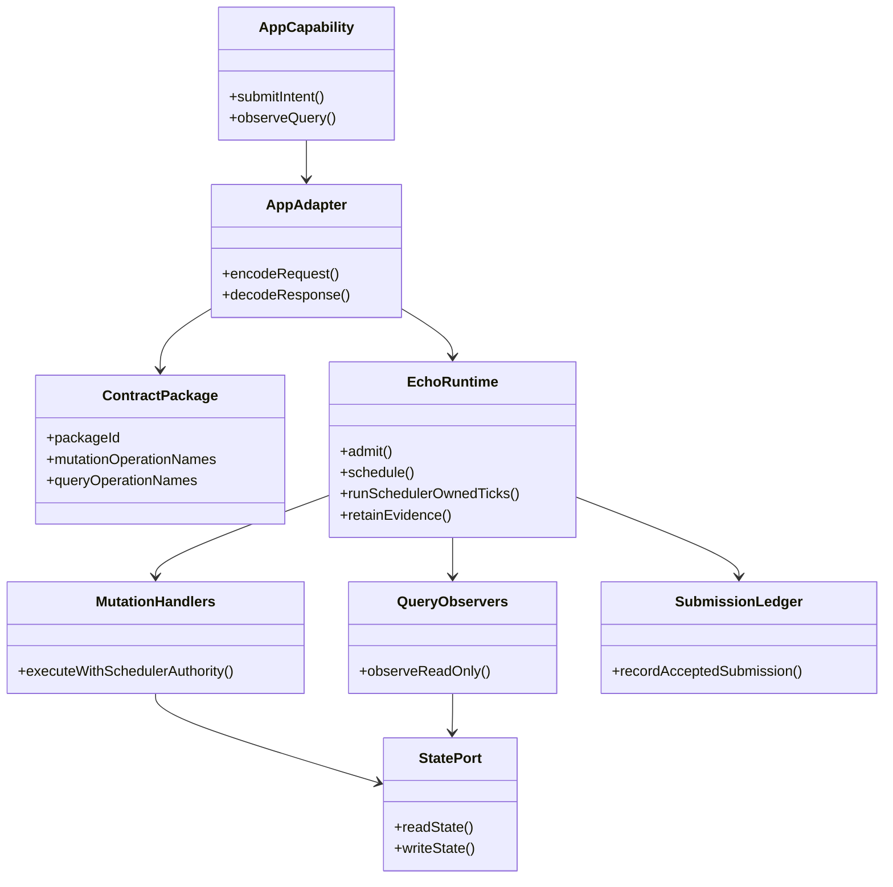
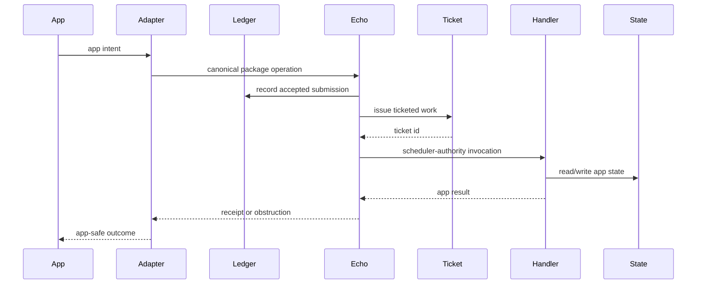
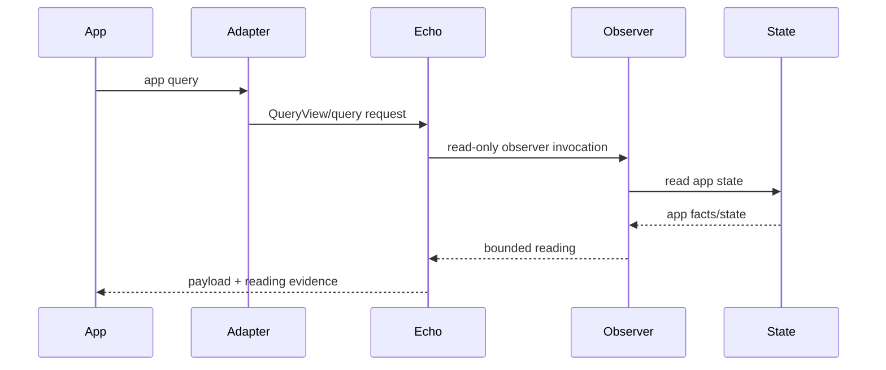
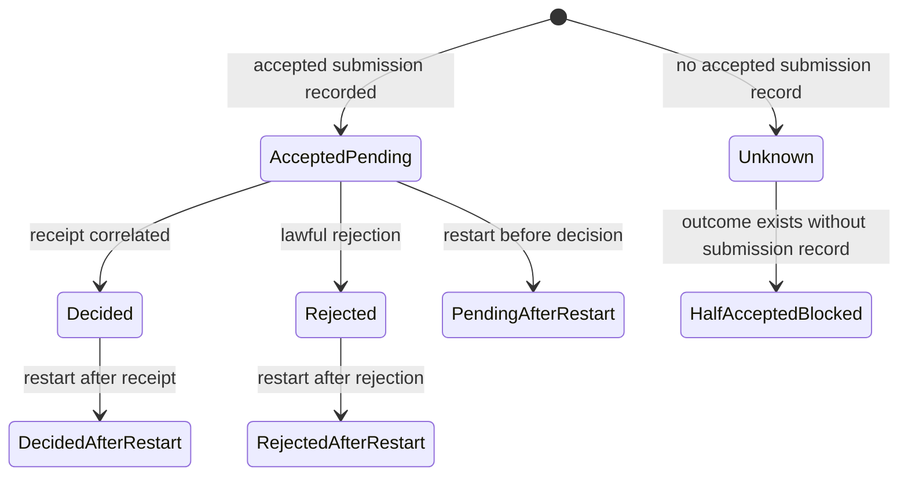

# Echo Application Hosting Guide

This guide explains how to build an application that is hosted by Echo without
teaching Echo the application's domain nouns.

It is written from the `jedit` proof, but the pattern is intended for other
applications such as Graft and Think.

## The Rule

Echo remains generic.

Identity is locked by [docs/design/echo-identity-doctrine.md](design/echo-identity-doctrine.md):

- Values are content-addressed (`ContentRef`/`RecordRef`).
- Logical entity identities are declared IDs (random or public-key-derived).
- Bindings are local resolution and do not leak into hashed payloads.
- Basis defines observations; it is not storage.
- Transport import is explicit (`inspect`, `fork`, `adopt`).

Applications own:

- domain nouns;
- GraphQL contract schemas;
- generated helper use;
- package descriptors;
- mutation handlers;
- query observers;
- state ports;
- submission ledger adapters;
- app-safe capability APIs.

Echo owns:

- admission;
- scheduler-owned ticks;
- ticketed runtime work;
- handler invocation authority;
- receipt and obstruction posture;
- QueryView/query routing;
- retained evidence lookup;
- runtime fault posture.

## Minimal Build Recipe

1. Write the app contract schema.
2. Generate helpers and metadata with Wesley.
3. Define an app-owned package descriptor.
4. Implement app-owned mutation handlers.
5. Implement app-owned query observers.
6. Put app state behind a port.
7. Put accepted submissions behind a ledger port.
8. Require ticketed work before handler invocation.
9. Correlate decided work to receipts.
10. Retain receipt, reading-envelope, and payload evidence.
11. Add restart/recovery posture witnesses.
12. Expose only an app-safe capability to application code.

## Boundary Diagram



## Mutation Flow



Application dispatch does not execute synchronously. The app observes an
outcome after Echo-owned admission, ticketing, and scheduler-authority handler
invocation.

## Query Flow



Query observers do not receive mutable runtime, scheduler control, or tick
authority.

## Submission And Restart Flow



Half-accepted state is blocked. Recovery must not execute handlers merely
because the host restarted.

## jedit Mapping

| Hosting Role | jedit Surface |
|---|---|
| app-safe capability | `TextBufferOptic` |
| contract schema | `contracts/jedit/hot-text-runtime.graphql` |
| package descriptor | `jedit.hot-text-runtime` |
| mutation handlers | create buffer, replace range, checkpoint |
| query observers | worldline snapshot, text window |
| state port | jedit contract fact set port |
| submission ledger | jedit accepted submission ledger |
| ticketed work | jedit ticketed work boundary |
| receipt correlation | jedit receipt correlation posture |
| retention | jedit retained evidence lookup |
| restart witness | jedit restart witness |

`TextBufferOptic` is a `jedit` noun. Echo must not import it.

Current port names used by this proof:

- `TextBufferSessionPort`;
- `TrustedEchoRuntimeLifecyclePort`;
- `EchoContractPackageHostPort`;
- `JeditRestartRecoveryPort`.

## Second-App Template

The counter template exists to prove the pattern is not `jedit`-only:

```text
contracts/fixtures/counter.graphql
src/app/echo-hosting-counter-template.ts
spec/echo-hosting-counter-template.spec.mjs
```

The template includes:

- a package descriptor;
- an in-memory state port;
- one mutation;
- one query;
- receipt and reading identities;
- a test that rejects `jedit` product imports.

## Required Witnesses For A New App

Every new Echo-hosted app should provide focused tests for:

- package descriptor identity;
- supported mutation and query ids;
- mutation handler scheduler authority;
- query observer read-only authority;
- state port read/write path;
- accepted submission ledger;
- ticketed work boundary;
- receipt correlation;
- retained evidence lookup;
- restart/recovery posture;
- app-facing API has no tick, lifecycle, package install, handler, or state-port
  authority.

## Durability And Historical Export Template

The `jedit` WSC work adds the durable-history half of the hosting pattern. The
portable lesson is not "make Echo know files." The portable lesson is to keep
the app's semantic history app-owned while retaining Echo-shaped evidence
coordinates that agents can inspect.

For a production app, add these boundaries:

- an app-owned settlement or rejection envelope schema for semantic outcomes;
- a retained-envelope store hidden behind an app port;
- an app-safe history listing that exposes submissions, outcomes, receipts,
  readings, checkpoints, rejection reasons, and export refs when available;
- point-in-time export by retained basis id;
- semantic replay comparison that excludes wall-clock cadence and diagnostic
  prose;
- missing, malformed, unsupported, or rejected evidence as typed obstruction,
  not silent fallback;
- a release-gate witness for restart, current export, historical export,
  replay, and non-applied outcome retention.

The authority bar is:

```text
App owns: domain schema, settlement/rejection nouns, file or object naming,
          reading cache shape, export materialization, CLI/MCP affordances.

Echo owns: admission, scheduler authority, ticketed execution, receipt
           posture, retained evidence coordinates, and recovery facts.

Wesley owns: generated helper material for contract-shaped requests and
             responses, never product policy.
```

Fake-port fixtures are allowed only when they prove an app-facing contract or
obstruction posture. They must not reopen alternate runtime modes, hide missing
Echo evidence, or become a second production authority path.

## Graft/Think Readiness Checklist

Before applying the hosting pattern to Graft, Think, or another app, require:

- app-owned contract schema and package descriptor;
- generated Wesley helper path with a drift witness;
- app-safe capability port with no lifecycle or tick authority;
- trusted adapter that installs packages and invokes handlers;
- mutation handler witness over ticketed scheduler authority;
- read-only query observer witness;
- state port and accepted-submission ledger;
- retained-evidence lookup and restart/recovery witness;
- historical listing and point-in-time export surface if the app has durable
  user-visible history;
- semantic replay proof with timing permutations excluded from identity;
- static guard that prevents app nouns from entering Echo core;
- minimum release gate covering package identity, mutation/query happy path,
  unsupported path, retention, restart, replay, and docs drift.

Reference `jedit` examples when useful, but do not copy `jedit` nouns into the
next app's Echo boundary. The new app must name its own semantics and keep Echo
generic.

## Current Evidence Commands

From a clean checkout:

```bash
npm run build
npm run --silent quality
npm run --silent release-gate:jedit-echo
node --test --test-concurrency=1 spec/echo-hosting-counter-template.spec.mjs
node --test --test-concurrency=1 spec/jedit-wsc-history-listing.spec.mjs
node --test --test-concurrency=1 spec/jedit-wsc-replay-proof.spec.mjs
node scripts/jedit-wsc-history.mjs list --json
node scripts/jedit-echo-powered-session.mjs --json --dry-run
node scripts/jedit-echo-powered-session.mjs --json --allow-full-snapshot-fixture
node scripts/jedit-echo-powered-session.mjs --json --allow-full-snapshot-fixture --replay-local
```

## Non-Goals

This guide does not require:

- release tagging;
- browser packaging;
- streaming subscriptions;
- distributed replica import;
- settlement shells;
- full observer-rights governance;
- social/speculative lane policy.
