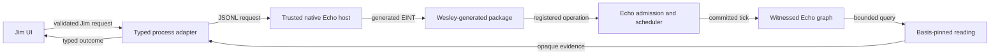
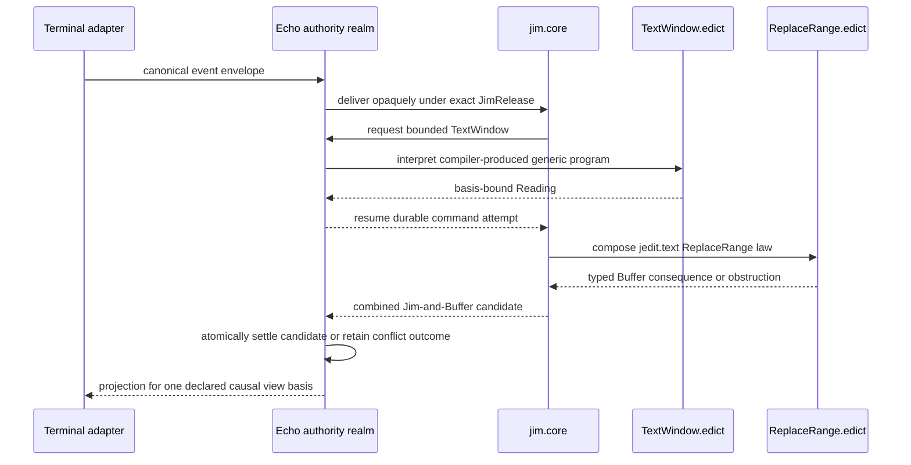
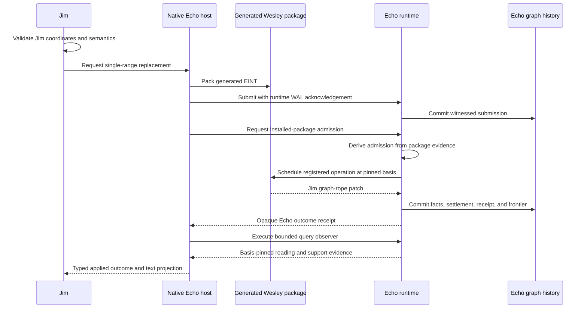

# Echo Application Hosting Guide

This guide records the executable GraphQL/Wesley compatibility corridor and the
target Edict-native boundary. The compatibility walkthrough is implementation
evidence, not the final application composition.

Identity rules are governed by
[`docs/design/echo-identity-doctrine.md`](design/echo-identity-doctrine.md).

## Hard Rule

`Jim.edict` is the application and proposes work. Echo owns generic admission,
scheduling, ticks, receipts, witnessed causal history, recovery, bounded
program interpretation, and basis-pinned observation. Jim-owned Edict lawpacks
own text semantics. Jedit/Bijou/native code owns terminal and process I/O plus
rendering. A TypeScript map, queue, runtime, or ledger may neither impersonate
Echo authority nor interpret Jim commands and choose application operations.

Test doubles are allowed only below `spec/` or `tests/`, must be injected
explicitly, and must use test-only identities. They are evidence fixtures, not
an alternate application mode.

## Current State

The production workspace now performs this narrow path:

1. Launch `native/jedit-echo-host`, a trusted Rust process linked to Echo.
2. Register the package generated from
   `contracts/jedit/echo-text.graphql` by Echo's Wesley contract-host
   extension.
3. Pack a generated EINT envelope for buffer creation or single-range
   replacement.
4. Submit it through Echo's WAL-acknowledged app capability.
5. Ask Echo's trusted host to admit the witnessed installed-package
   submission; Jim does not construct admission tickets or Echo identities.
6. Let Echo schedule and tick the registered operation.
7. Consume Echo's opaque receipt and query a basis-pinned bounded text window.
8. Recover the graph and continue editing from Echo's runtime WAL after
   process restart.

Create/open, single-range insert/replace/delete, and bounded text-window reads
are implemented. Checkpoints, save/export, multi-range editing, undo/redo,
causal gutter readings, and `:why` fail closed with typed obstructions.

The prior raw WASM facade is deleted. It was not the product text path and no
longer has a runnable side lane.

## Target Ownership

Echo owns:

- proposal admission and durable admission evidence;
- scheduler basis selection and deterministic tick selection;
- installed-package verification and invocation authority;
- receipts, obstructions, and causal parentage;
- witnessed graph history and restart recovery;
- basis-pinned observation execution;
- generic retention and causal-anchor admission.

`Jim.edict` owns:

- editor state, modes, operators, motions, cursor, selection, registers, and
  pending actions;
- canonical event interpretation, observation requests, operation intents,
  and outcome or obstruction handling.

Jim-owned Edict lawpacks own:

- rope, buffer, checkpoint, range, and editor semantics;
- application fact schemas, identities, results, and typed obstructions;
- `ReplaceRange`, `CreateBuffer`, `DeclareCheckpoint`, and `TextWindow`.

Jedit/Bijou/native adapters own:

- canonical event decoding and raw process transport;
- package bootstrap and addressing;
- typed artifact codecs with no application decision logic;
- disposable line indexes, materialization caches, UI surfaces, and rendering.

The Wesley compatibility package currently supplies:

- canonical EINT codecs and operation ids generated from GraphQL;
- package registry and artifact evidence;
- generated mutation-rule and query-observer host helpers;
- a typed Rust binding around the transitional Jim-owned operation law.

Edict owns the generated semantic boundary:

- source checking, Core IR, and authority/lawpack closure;
- target lowering and compiler-produced package construction;
- structurally separate verification;
- request and outcome codecs;
- installed-operation metadata and transport stubs;
- schema and version compatibility checks.

Jim must not copy Echo identity, receipt, admission, scheduler, WAL, or support
policy algorithms into application code.

Echo production code must not implement or branch on `ReplaceRange`, rope,
`Buffer`, `TextWindow`, or any other Jim/Jedit vocabulary. A schema and oracle
are conformance resources, not executable semantics; only a compiler-produced,
independently verified generic package may supply runtime meaning.

## Current Compatibility Boundary



The process adapter correlates requests and responses only. It is not text,
receipt, graph, or recovery authority.

In current compatibility code, TypeScript and native Rust still derive a Jim
request before Echo admission. That is migration debt. It must not be widened
or described as the final Edict design.

## Target Active-Observer Boundary

Jedit normalizes physical input into one canonical event envelope with stable
event, source, ordering, normalized-input, and admission coordinates. Echo
admits and transports the envelope without inspecting Jim or Jedit fields.
Only `jim.core`, authored from `Jim.edict`, interprets editor meaning. The
complete authority and settlement contract is frozen in
[Jim: Components, Responsibilities, and Ownership](jim-component-ownership.md).



A generated client in this boundary is a codec and transport stub. It may not
decide what a key means, derive a `ReplaceRange`, calculate a rope patch, or
advance cursor, mode, register, or operator state.

## Current Intent Lifecycle



No Jim-owned code may mint an Echo receipt, derive an Echo admission identity,
advance a frontier, stage scheduler work directly, or publish an independent
graph and call it Echo history.

## Projection Rule

Line indexes, text windows, rendered lines, syntax spans, and materialized
exports are readings. Each reading must name its basis and coverage. Cache
entries are disposable and must be rejected when basis, policy, schema,
observer, or materializer versions disagree.

Deleting a projection must never delete causal history. Recovering a
projection must begin from witnessed Echo history, not from a Jim-owned replay
ledger.

## Checkpoints And Anchors

A Jim checkpoint declaration and an Echo causal anchor are separate facts:

- Jim may declare that rope head `H` is meaningful for reason `R`.
- Jim may request that Echo anchor a subject and retained roots under Echo
  policy.
- Echo decides whether to admit that anchor and returns opaque identities.
- Jim may associate the checkpoint with the admitted anchor without claiming
  to own the anchor.

Ordinary navigation markers and temporary checkpoints do not automatically
require a causal anchor.

## Failure Posture

Missing Echo, a failed package registration, stale basis, invalid coordinates,
or unsupported operations produce typed obstructions. The application must
not:

- install an in-process replacement;
- construct fake Echo receipts;
- decode or reproduce Echo identity algorithms;
- treat a WAL registry as a second semantic authority;
- mutate a local graph and label it Echo-backed;
- continue with degraded causal evidence.

## Executable Evidence

From a clean checkout:

```bash
npm run build
npm run echo:test
node scripts/jedit-production-cutover-guard.mjs
JEDIT_DIST_PREBUILT=1 node --test spec/workspace-production-echo-wiring.spec.mjs
npm run witness:echo
```

`npm run witness:echo` performs a real create, replace, bounded observation,
and clean host shutdown. Its report carries the Echo receipt, admitted tick,
package artifact, observer plan, reading identity, commit hash, and rope support
count.

## Edict Convergence

The compatibility corridor is deliberately narrow. Do not restore feature
parity by widening handwritten Rust operation APIs.

The planned migration is:

1. Author the exact Jim-owned `ReplaceRange.edict` source and closure.
2. Build it through Edict's public application-build boundary.
3. Add only the generic Edict or Echo capabilities that the honest build proves
   missing; execute the exact verified package against the retained oracle.
4. Author `TextWindow.edict` and the smallest `Jim.edict` active observer.
5. Move production input to canonical event delivery and projection rendering.
6. Make direct frontend operation orchestration and the bespoke Wesley/Rust
   replacement path unreachable, then delete them.
7. Migrate buffer creation, checkpoint, save/export, undo/redo, and historical
   explanation as Jim-owned lawpacks and bounded observations.
8. Delete semantic JSONL operation glue once only the event/artifact membrane
   remains.

The acceptance bar is not an Echo-shaped interface. Every user-visible text
transition and authoritative reading must be supported by first-class
witnessed Echo history.
