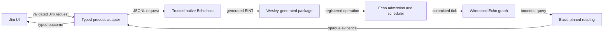
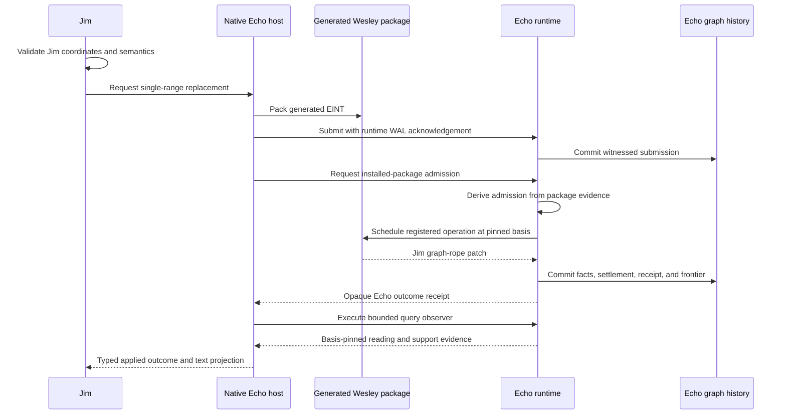

# Echo Application Hosting Guide

This guide states the current Jim/Echo integration boundary. It distinguishes
the executable GraphQL/Wesley compatibility corridor from the future
Edict-native corridor.

Identity rules are governed by
[`docs/design/echo-identity-doctrine.md`](design/echo-identity-doctrine.md).

## Hard Rule

Application code proposes work. Echo owns admission, scheduling, ticks,
receipts, witnessed causal history, recovery, and basis-pinned observation.
Jim owns text semantics and presentation. A TypeScript map, queue, runtime, or
ledger inside Jim may not impersonate an Echo-owned authority.

Test doubles are allowed only below `spec/` or `tests/`, must be injected
explicitly, and must use test-only identities. They are evidence fixtures, not
an alternate application mode.

## Current State

The production workspace now performs this narrow path:

1. Launch `native/jedit-echo-host`, a trusted Rust process linked to Echo.
2. Register the package generated from
   `contracts/jedit/echo-text.graphql` by Echo's Wesley contract-host
   extension.
3. Pack a generated EINT envelope for buffer creation or single-range
   replacement.
4. Submit it through Echo's WAL-acknowledged app capability.
5. Ask Echo's trusted host to admit the witnessed installed-package
   submission; Jim does not construct admission tickets or Echo identities.
6. Let Echo schedule and tick the registered operation.
7. Consume Echo's opaque receipt and query a basis-pinned bounded text window.
8. Recover the graph and continue editing from Echo's runtime WAL after
   process restart.

Create/open, single-range insert/replace/delete, and bounded text-window reads
are implemented. Checkpoints, save/export, multi-range editing, undo/redo,
causal gutter readings, and `:why` fail closed with typed obstructions.

The prior raw WASM facade is deleted. It was not the product text path and no
longer has a runnable side lane.

## Ownership

Echo owns:

- proposal admission and durable admission evidence;
- scheduler basis selection and deterministic tick selection;
- installed-package verification and invocation authority;
- receipts, obstructions, and causal parentage;
- witnessed graph history and restart recovery;
- basis-pinned observation execution;
- generic retention and causal-anchor admission.

Jim owns:

- rope, buffer, checkpoint, range, and editor semantics;
- branded UTF-8, UTF-16, and line/column coordinates;
- validation of Jim-owned requests before invoking Echo;
- interpretation of opaque Echo identities and outcomes;
- disposable line indexes and materialization caches;
- UI policy and rendering.

The Wesley compatibility package currently supplies:

- canonical EINT codecs and operation ids generated from GraphQL;
- package registry and artifact evidence;
- generated mutation-rule and query-observer host helpers;
- a typed Rust binding around the transitional Jim-owned operation law.

Edict will later own the generated semantic boundary:

- deterministic operation law;
- request and outcome codecs;
- installed-operation metadata;
- generated clients for bounded observations;
- schema and version compatibility checks.

Jim must not copy Echo identity, receipt, admission, scheduler, WAL, or support
policy algorithms into application code.

## Production Boundary



The process adapter correlates requests and responses only. It is not text,
receipt, graph, or recovery authority.

## Current Intent Lifecycle



No Jim-owned code may mint an Echo receipt, derive an Echo admission identity,
advance a frontier, stage scheduler work directly, or publish an independent
graph and call it Echo history.

## Projection Rule

Line indexes, text windows, rendered lines, syntax spans, and materialized
exports are readings. Each reading must name its basis and coverage. Cache
entries are disposable and must be rejected when basis, policy, schema,
observer, or materializer versions disagree.

Deleting a projection must never delete causal history. Recovering a
projection must begin from witnessed Echo history, not from a Jim-owned replay
ledger.

## Checkpoints And Anchors

A Jim checkpoint declaration and an Echo causal anchor are separate facts:

- Jim may declare that rope head `H` is meaningful for reason `R`.
- Jim may request that Echo anchor a subject and retained roots under Echo
  policy.
- Echo decides whether to admit that anchor and returns opaque identities.
- Jim may associate the checkpoint with the admitted anchor without claiming
  to own the anchor.

Ordinary navigation markers and temporary checkpoints do not automatically
require a causal anchor.

## Failure Posture

Missing Echo, a failed package registration, stale basis, invalid coordinates,
or unsupported operations produce typed obstructions. The application must
not:

- install an in-process replacement;
- construct fake Echo receipts;
- decode or reproduce Echo identity algorithms;
- treat a WAL registry as a second semantic authority;
- mutate a local graph and label it Echo-backed;
- continue with degraded causal evidence.

## Executable Evidence

From a clean checkout:

```bash
npm run build
npm run echo:test
node scripts/jedit-production-cutover-guard.mjs
JEDIT_DIST_PREBUILT=1 node --test spec/workspace-production-echo-wiring.spec.mjs
npm run witness:echo
```

`npm run witness:echo` performs a real create, replace, bounded observation,
and clean host shutdown. Its report carries the Echo receipt, admitted tick,
package artifact, observer plan, reading identity, commit hash, and rope support
count.

## Edict Convergence

The compatibility corridor is deliberately narrow. Do not restore feature
parity by widening handwritten Rust operation APIs.

The planned migration is:

1. Echo and Edict establish one natively installed generated operation.
2. Jim migrates `ReplaceRange` to the generated Edict client and operation.
3. The bespoke Wesley/Rust replacement path becomes unreachable and is
   deleted.
4. Buffer creation and bounded text observation migrate next.
5. Checkpoint, save/export, undo/redo, and historical explanation are added as
   generated operations and bounded observations.
6. The transitional JSONL operation protocol is deleted when generated client
   invocation can replace it.

The acceptance bar is not an Echo-shaped interface. Every user-visible text
transition and authoritative reading must be supported by first-class
witnessed Echo history.
