# jedit + Echo End-to-End Guide

This guide explains how jedit works from process entry to process termination,
and how jedit interacts with Echo today. It assumes no prior knowledge of jedit,
Echo, Wesley, Graft, Bijou, or the WARP stack.

The short version:

- jedit is a terminal editor and product pressure test for the Echo stack.
- Echo is a deterministic runtime over witnessed causal history.
- Wesley compiles jedit-authored GraphQL contracts into generated operation
  metadata, types, codecs, and observer helpers.
- Graft supplies structural intelligence such as outlines and diffs.
- Bijou supplies the terminal application loop.
- jedit must never smuggle editor nouns into Echo core.

The current repository contains three relevant execution postures:

1. The interactive jedit TUI path. This starts in `src/main.ts`, runs through
   Bijou, and is being cut over from direct editor state to the production text
   session.
2. The production text session path. This is the jedit-owned
   `TextBufferSessionPort` facade used by tests and witnesses to open, edit,
   checkpoint, observe bounded windows, export text, and retain refs through the
   Echo-hosted contract surface.
3. The Echo witness path. This runs an opt-in real Echo WASM integration that
   proves jedit can submit contract-shaped work, let a trusted host request an
   Echo-owned run policy, and receive a typed `UNSUPPORTED_QUERY` obstruction
   instead of hardcoded text when no generated observer is installed.

Those postures intentionally meet through ports and adapters. The interactive
product is now being wired to consume the production text session as its only
production text authority without letting application code gain tick authority
or substrate coordinates.

## Vocabulary

| Term | Meaning in this repository |
| --- | --- |
| jedit | The terminal editor product and Echo release gate consumer. |
| Echo | The generic deterministic WARP runtime. It owns admission, scheduling, ticks, receipts, and readings. |
| Wesley | The contract compiler. It turns jedit-authored GraphQL SDL into runtime-facing artifacts. |
| Bijou | The terminal UI application runtime used by jedit. |
| Graft | The structural intelligence engine used for outlines, diffs, and source projections. |
| Intent | Canonical request to change causal history. The application submits it; Echo admits and schedules it. |
| Observation | Bounded request to read through an observer plan. Echo returns payload plus evidence. |
| ReadingEnvelope | Evidence-carrying context for a read: basis, observer identity, posture, and payload identity. |
| Tick | Scheduler-owned logical execution opportunity. Application code cannot create or command ticks. |
| TickReceipt | Evidence that the scheduler decided work during a tick. It is not an AdmissionTicket. |
| TextBufferOptic | A jedit-owned app capability. Echo must not contain this noun or know what it means. |
| ReadBasisHandle | A jedit app-safe token that hides runtime coordinates below the app boundary. |

## Doctrine

Echo is generic. jedit owns editor nouns.

This means:

- `TextBuffer`, `TextWindow`, `TextBufferOptic`, edit groups, panes, buffers,
  and editor commands belong to jedit.
- Echo owns generic runtime concepts: intent bytes, observation bytes,
  scheduler status, trusted control, receipts, readings, witnesses, retained
  artifacts, and runtime faults.
- Wesley bridges them by compiling jedit-authored contracts into generated
  artifacts.
- A jedit adapter may translate `TextBufferOptic.applyIntent(...)` into Echo
  intent bytes.
- Echo core must never grow a `TextBufferOptic`.

If a future change needs an Echo API named after a jedit product noun, the
boundary is wrong. Put the noun in a contract, generated adapter, or jedit port.

```mermaid
sequenceDiagram
  autonumber
  participant App as jedit app
  participant Port as jedit port or optic
  participant Adapter as generated/host adapter
  participant Echo as Echo generic runtime

  App->>Port: apply text-domain intent
  Port->>Adapter: encode contract operation bytes
  Adapter->>Echo: submit generic intent bytes
  Echo-->>Adapter: witnessed ingress/admission evidence
  Adapter-->>Port: app-safe receipt handle
  Port-->>App: TextBufferOptic result

  App->>Port: request bounded text reading
  Port->>Adapter: encode contract query bytes
  Adapter->>Echo: observe QueryView
  Echo-->>Adapter: ReadingEnvelope + generic payload or obstruction
  Adapter-->>Port: decode jedit-owned reading
  Port-->>App: TextWindowReading + evidence

  Note over App,Echo: jedit owns text nouns; Echo owns generic time, admission, receipts, and readings.
```

## Repository Map

The files most relevant to this guide are:

| Path                                                   | Role                                                                          |
| ------------------------------------------------------ | ----------------------------------------------------------------------------- |
| `src/main.ts`                                          | Process entry for the TUI application.                                        |
| `src/adapters/workspace-app.ts`                        | Wires concrete ports into the workspace runtime.                              |
| `src/app/workspace/runtime.ts`                         | Pure-ish workspace update/view runtime.                                       |
| `src/app/workspace/model.ts`                           | Workspace model shape.                                                        |
| `src/app/workspace/editor-session.ts`                  | File/editor session behavior.                                                 |
| `src/app/workspace/production-text-session.ts`         | jedit-owned production text session facade over the text-buffer session port. |
| `src/app/workspace/production-text-session-witness.ts` | Local witness proving open/edit/checkpoint/read/export/replay posture.        |
| `src/ports/text-buffer-session.ts`                     | jedit app-facing text-buffer session port.                                    |
| `src/ports/jedit-optic-client.ts`                      | Lower jedit optic client interface consumed by adapters.                      |
| `src/adapters/jedit-echo-optic-client.ts`              | Adapter from jedit optic calls to Echo-shaped transport bytes.                |
| `src/adapters/echo-backed-text-buffer-session.ts`      | Echo-backed implementation of the text-buffer session port.                   |
| `src/app/echo-powered-text-buffer-witness.ts`          | App workflow witness over the Echo-powered product session.                   |
| `src/app/trusted-echo-runtime-host.ts`                 | Host helper for trusted Echo shutdown requests.                               |
| `src/ports/echo-kernel-transport.ts`                   | App-safe and trusted-host Echo transport ports.                               |
| `src/adapters/echo-wasm-kernel.ts`                     | Real Echo WASM transport adapter.                                             |
| `src/ports/echo-runtime-lifecycle.ts`                  | Trusted-host runtime lifecycle port.                                          |
| `src/adapters/echo-runtime-lifecycle.ts`               | Adapter from lifecycle requests to trusted Echo control bytes.                |
| `src/adapters/fake-echo-jedit-optic-transport.ts`      | Default fake Echo-shaped test transport.                                      |
| `src/app/jedit-contract-runtime.ts`                    | jedit-owned transitional hot-text contract executor.                          |
| `src/app/jedit-observer-runtime.ts`                    | jedit-owned observer/read envelope helpers.                                   |
| `src/adapters/full-snapshot-hot-text-runtime-fixture.ts` | Full-snapshot hot-text runtime fixture.                                       |
| `contracts/jedit/hot-text-runtime.graphql`             | jedit-authored hot-text runtime contract.                                     |
| `contracts/jedit/text-buffer-optic.graphql`            | jedit app-facing optic contract.                                              |
| `contracts/jedit/structural-history.graphql`           | jedit structural history contract authority.                                  |
| `scripts/jedit-echo-witness.mjs`                       | CLI for the real Echo witness path.                                           |
| `scripts/jedit-echo-powered-session.mjs`               | Fast agent CLI over the app-facing Echo-powered session.                      |
| `scripts/ports/echo-witness-runner.mjs`                | Witness runner port logic.                                                    |
| `scripts/adapters/node-echo-witness-runner.mjs`        | Node filesystem/process adapter for the witness runner.                       |
| `spec/jedit-echo-wasm-stack-witness.spec.mjs`          | Opt-in real Echo WASM generic observer-boundary witness.                      |

## TypeScript Model

The TypeScript side is deliberately split into product capabilities, ports, and
adapters. `TextBufferOptic` is a jedit app capability. `JeditOpticClient` is a
jedit port. Echo transports are generic byte/control ports. None of these
classes implies that Echo implements text buffers.

## TypeScript Class Diagram

This diagram shows the major runtime participants. It is not a TypeScript class
inventory; it is the useful object boundary map.

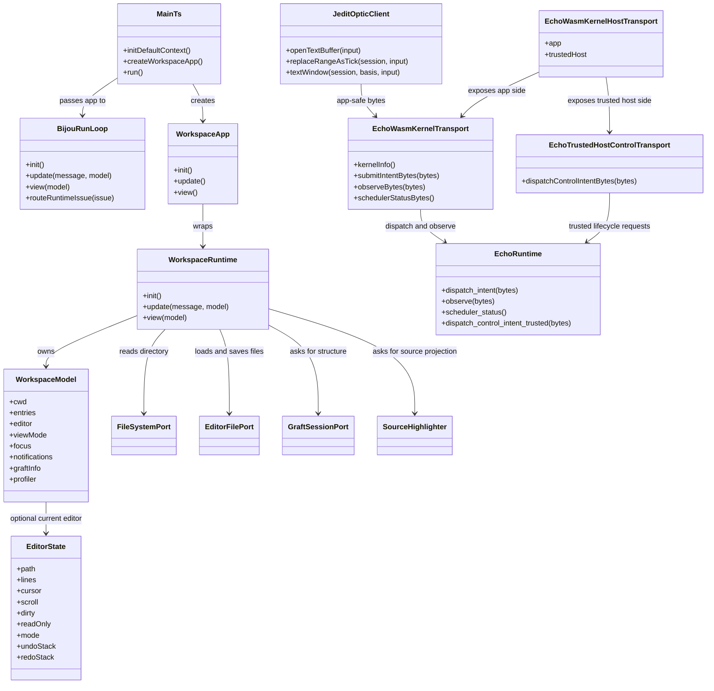

## TypeScript Entity Relationship Diagram

This is a conceptual ER diagram, not a database schema. It names the durable
relationships the system is trying to prove.

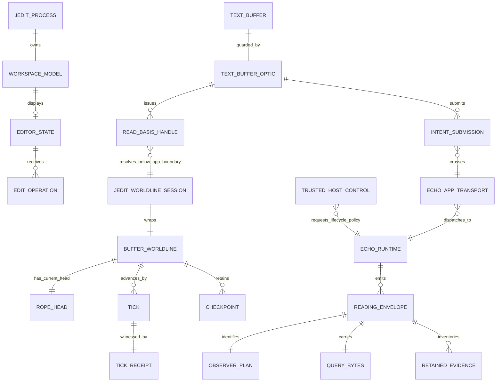

## Process Startup: `int main()`

jedit is TypeScript, so the practical equivalent of `int main()` is
`src/main.ts`.

```ts
initDefaultContext();

const app = createWorkspaceApp({
  initialColumns: process.stdout.columns ?? 100,
  initialRows: process.stdout.rows ?? 32,
  initialWorkingDirectory: process.cwd(),
  perfEnabled: envBoolean(process.env.JEDIT_PERF),
});

run(app, { mouse: JEDIT_TERMINAL_MOUSE_OPTIONS.mouse });
```

The startup sequence is:

1. Node starts the built entry point (`node dist/main.js`) or development entry
   point (`tsx src/main.ts`).
2. `initDefaultContext()` initializes Bijou's default Node context.
3. jedit reads terminal dimensions from `process.stdout`.
4. jedit chooses the launch workspace as `process.cwd()`.
5. jedit reads `JEDIT_PERF`; only `1` enables the perf overlay.
6. jedit calls `createWorkspaceApp(...)`.
7. jedit hands the app to Bijou's `run(...)`.
8. Bijou owns terminal IO and calls jedit's `init`, `update`, and `view`
   functions.

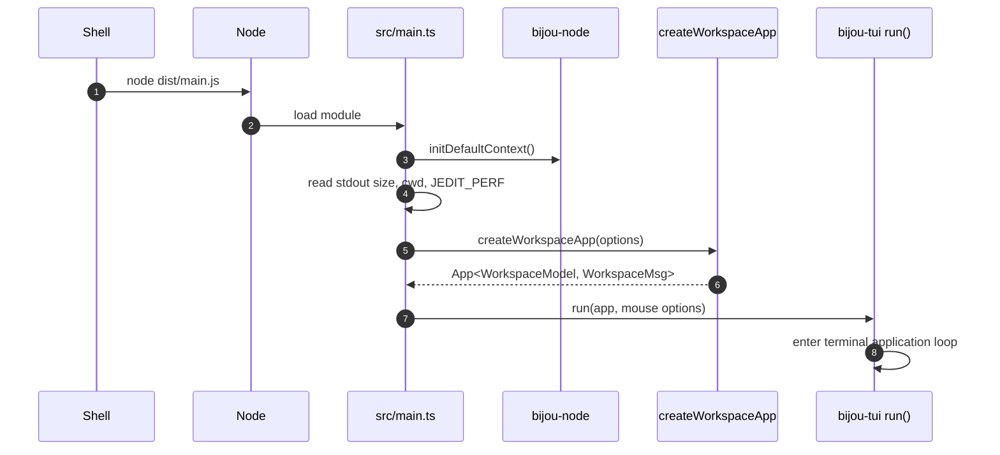

## Workspace App Construction

`createWorkspaceApp` lives in `src/adapters/workspace-app.ts`. It is where the
pure workspace runtime receives concrete ports.

The adapter installs:

- `FileSystemPortAdapter` for directory entries.
- `editorFilePort` for opening and saving file text.
- `createGraftSessionPort()` for direct Graft API calls.
- `createGraftSourceHighlighter()` for source highlighting.
- `createTitleSceneLoaderPort()` for the title scene.
- `createRaytracerProfilerPort(nowMs)` for profiling.
- `createInitialModelSnapshot(...)` for initial workspace state.
- Bijou animation commands for time ticks, notification ticks, and drawer
  animation.

The important architectural point is that the runtime does not import Node
filesystem APIs or Graft SDK calls directly. It receives ports.

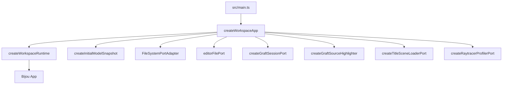

## The Bijou Runtime Loop

Bijou repeatedly calls the app:

- `init()` once at startup.
- `update(message, model)` whenever terminal input, resize, animation, or async
  command output arrives.
- `view(model)` after model changes.
- `routeRuntimeIssue(issue)` when Bijou needs to report runtime issues back into
  app messages.

jedit's workspace runtime handles messages in this order:

1. Resize messages.
2. State messages such as drawer progress, Graft results, scene loading, source
   highlight results, and title camera frames.
3. Effect messages such as notification ticks, time ticks, perf toggles,
   profiler events, and runtime issues.
4. Input messages from mouse and keyboard.

That ordering matters: external state updates and runtime effects are applied
before interactive key or mouse routing.

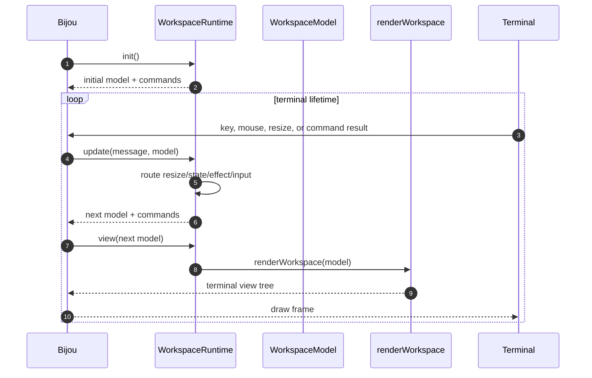

## Interactive Editing Path

The current TUI path is the active cutover target. Historically it opened,
edited, and saved files through direct `EditorState.lines` helpers. That legacy
path is no longer the production target. The production target is:

```text
workspace key or file event
-> jedit workspace command planner
-> ProductionTextSession
-> TextBufferSessionPort
-> jedit contract operation or query
-> Echo-hosted causal state
-> bounded reading cache
-> terminal render
```

The direct in-memory line model may remain only as a fixture, adapter-private
implementation detail, or temporary render cache. It must not be treated as the
production source of truth.

A legacy local file flow still visible in the codebase is:

1. User presses a key.
2. `updateFromKey` routes it by current workspace state and focus.
3. File-opening commands call `loadEditor(...)`.
4. `loadEditor` calls `editorFile.loadEditorFile(...)`.
5. The returned file text becomes an `EditorState`.
6. Editing updates `EditorState.lines`, cursor, dirty flag, and undo/redo
   stacks.
7. Saving calls `saveEditor(...)`.
8. `saveEditor` calls `editorFile.saveEditorFile(...)`.

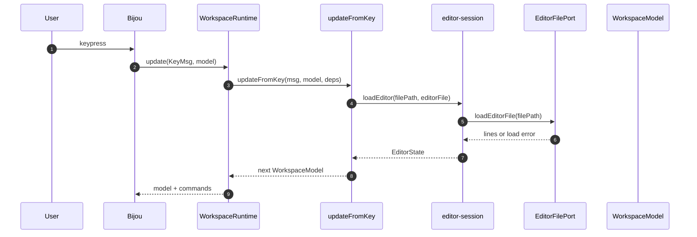

This legacy path is the drift tracked by `docs/BEARING.md` slices 81-90. The
production text session witness already proves the headless path. The remaining
work is to make the interactive workspace event loop consume that same
production session for open, edit, render, save/export, and checkpoint.

The intended production interactive flow is:

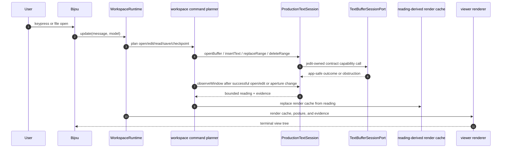

The planner may update cursor and viewport UI state locally. It must not use
cursor movement as a mutation, and it must not request Echo ticks. Echo ticks
itself under trusted runtime ownership.

## Graft Path

Graft is structural intelligence, not editing truth.

jedit uses Graft for:

- file outlines;
- structural diffs;
- source highlighting and projections;
- future structural selections and inspections.

The Graft port is an adapter:

```text
WorkspaceRuntime
-> GraftSessionPort
-> @flyingrobots/graft direct API
-> Graft tools such as file_outline and graft_diff
-> GraftInfo message
-> WorkspaceModel.graftInfo
```

Graft results are projections over files or buffers. They do not replace jedit's
editor state, Echo's causal history, or Wesley contract authority.

## jedit Contract Model

jedit expresses the Echo-facing editor model as contracts.

The important contract surfaces are:

- `contracts/jedit/text-buffer-optic.graphql`: the app-facing product optic.
- `contracts/jedit/hot-text-runtime.graphql`: the current hot-text runtime
  contract.
- `contracts/jedit/structural-history.graphql`: the structural history authority
  for revisions, replacements, edit groups, checkpoints, provenance, command
  status, errors, and bounded readings.

The app-facing model is intentionally capability-shaped:

```text
TextBufferSessionPort
-> TextBufferOptic
-> currentReadBasis()
-> applyIntent(replace range)
-> textWindow(read basis, bounded input)
```

The app can hold and use a `TextBufferOptic`. It cannot inspect the private
runtime coordinates that make the optic work.

The Echo-backed session adapter composes that product capability with the
app-safe client boundary:

```text
TextBufferOptic.applyIntent(...)
-> app-safe JeditOpticClient mutation
-> later TextBufferOptic.textWindow(...)
```

The session and optic returned to application code still do not expose
`requestRunUntilIdle`, raw trusted control bytes, or any tick method. Trusted
host lifecycle is a separate host adapter concern; it is not part of app-facing
dispatch.

The current TypeScript contract shape is defined in
`src/ports/text-buffer-session.ts`:

- `TextBufferOptic`;
- `TextBufferSessionPort`;
- `ReadBasisHandle`;
- `ReplaceRangeIntent`;
- `TextWindowReading`;
- `Observed<T>`;

The lower generated/transport client shape remains in
`src/ports/jedit-optic-client.ts`:

- `JeditMutationOpticClient`;
- `JeditObserverOpticClient`.

The important anti-leak rule:

```text
ReadBasisHandle.id is diagnostic.
ReadBasisHandle is not authority.
The adapter resolves it through a WeakMap binding.
Forged or cloned handles fail.
```

## App-Safe Read Basis Handles

`ReadBasisHandleRegistry` hides runtime coordinates below the app boundary.

When a jedit session creates a buffer:

1. Echo or the fake transport returns a `JeditWorldlineSession`.
2. The adapter creates a `ReadBasisHandle`.
3. The registry stores a private binding from that handle object to the
   worldline id.
4. App-facing code receives only `{ kind: 'read-basis-handle', id: ... }`.

When app code asks for a text window:

1. The app supplies the `ReadBasisHandle`.
2. The adapter checks object identity and handle kind.
3. The adapter checks that the handle belongs to the supplied session.
4. The adapter resolves the private `worldlineId`.
5. The adapter encodes the lower-level query request.

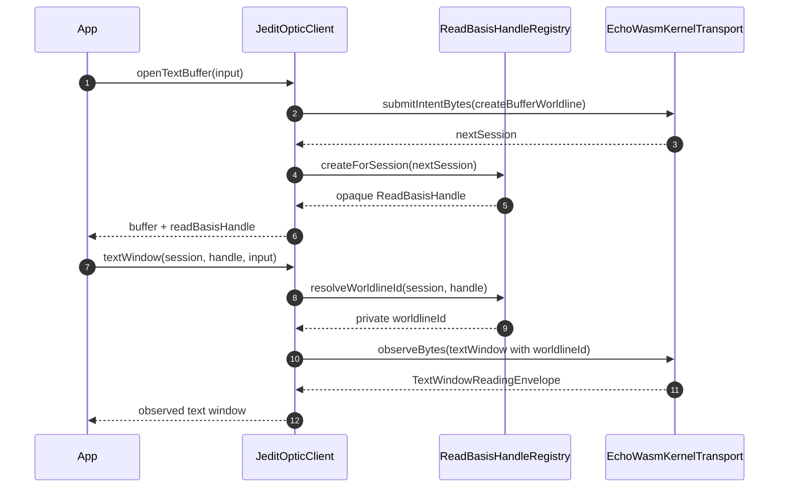

## Echo Transport Ports

jedit sees Echo through ports in `src/ports/echo-kernel-transport.ts`.

The app-safe port is:

```ts
interface EchoWasmKernelTransport {
  kernelInfo(): EchoKernelInfo;
  submitIntentBytes(intentBytes: Uint8Array): Uint8Array;
  observeBytes(requestBytes: Uint8Array): Uint8Array;
  schedulerStatusBytes(): Uint8Array;
}
```

The trusted-host port is separate:

```ts
interface EchoTrustedHostControlTransport {
  dispatchControlIntentBytes(controlIntentBytes: Uint8Array): Uint8Array;
}
```

Raw trusted control is then wrapped by the jedit lifecycle port:

```ts
interface TrustedEchoRuntimeLifecyclePort {
  requestRunUntilIdle(request: EchoRunUntilIdleRequest): EchoRunUntilIdleResult;
}
```

The lifecycle port is still trusted-host-only. Its job is to make host code
talk about lifecycle policy instead of raw control bytes or external tick
injection.

The split is the whole point:

- Application code can submit intents and observe readings.
- Trusted host code can request runtime lifecycle policy.
- Application code cannot tick Echo.
- Application code cannot tunnel trusted runtime lifecycle control through
  dispatch.

`createEchoWasmKernelHostTransport(...)` returns both sides:

```text
{
  app: EchoWasmKernelTransport,
  trustedHost: EchoTrustedHostControlTransport
}
```

The real adapter in `src/adapters/echo-wasm-kernel.ts` loads a WASM module and
adapts these Echo exports:

- `dispatch_intent`;
- `observe`;
- `scheduler_status`;
- `dispatch_control_intent_trusted`;
- `get_codec_id`;
- `get_registry_version`;
- `get_schema_sha256_hex`.

## Fake Echo-Shaped Transport

`src/adapters/fake-echo-jedit-optic-transport.ts` implements the app-safe Echo
transport without loading real Echo.

It exists so default jedit tests can exercise the app-facing contract without
depending on a sibling Echo checkout or a WASM build.

The fake transport:

- uses `createFullSnapshotHotTextRuntimeFixture()`;
- decodes jedit JSON fixture request bytes;
- executes jedit-owned contract runtime functions;
- returns encoded OK or obstructed responses;
- exposes an idle scheduler status.

It is not Echo core, and it is not a distributed runtime. It is a test adapter
that preserves the shape of the real app boundary.

The current lower jedit client still exposes `replaceRangeAsTick(...)` because
that is the historical generated operation name in the hot-text contract. This
is jedit contract terminology, not an Echo tick authority grant. The app-facing
production session exposes insert, replace, delete, checkpoint, observe, and
export operations; it does not expose a tick method.

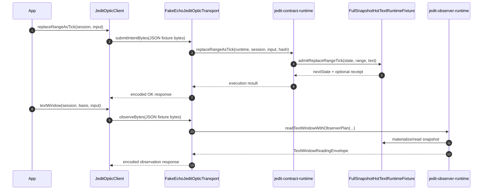

## Real Echo WASM Witness Path

The real Echo integration is currently opt-in and witness-driven.

The command is:

```sh
ECHO_WARP_WASM_DIR=/path/to/echo/crates/warp-wasm \
  node scripts/jedit-echo-witness.mjs --json --replay
```

The witness runner:

1. Validates the Echo `warp-wasm` directory.
2. Locates Echo's `scripts/build-warp-wasm-package.sh`.
3. Builds Echo's WASM package.
4. Runs `npm run build` in jedit.
5. Runs `node --test spec/jedit-echo-wasm-stack-witness.spec.mjs`.
6. Reads the witness report JSON.
7. Optionally summarizes replay posture.

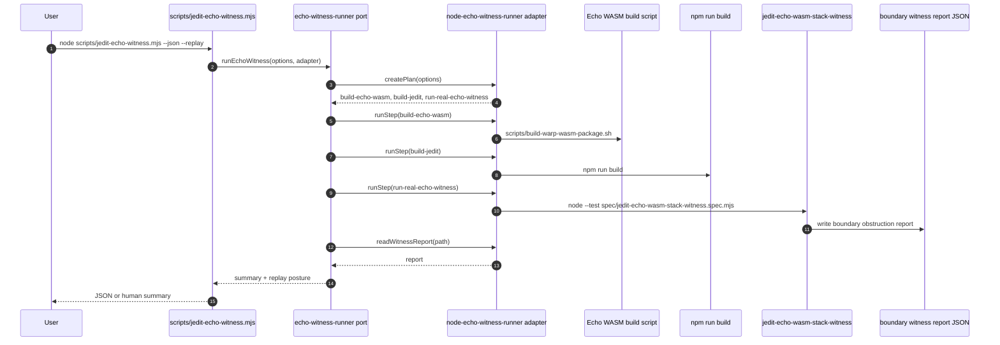

## What the Real Echo Witness Proves

`spec/jedit-echo-wasm-stack-witness.spec.mjs` is the current real Echo witness.

It proves:

- jedit can load a real Echo WASM module through `createEchoWasmKernelHostTransport`;
- app code can submit canonical fixture intents through the app transport;
- trusted host code can request Echo's internal run loop until idle through the
  trusted control transport;
- trusted host code can request stop through the same lifecycle port without
  exposing app-controlled cancellation;
- app code cannot materialize a jedit `textWindow` query unless Echo has an
  installed contract query observer for that query id;
- Echo returns `UNSUPPORTED_QUERY` instead of hardcoded text bytes when no
  observer is installed.

The current real Echo boundary witness is deliberately tiny:

```text
submit jedit-shaped fixture bytes
-> trusted host requests Echo-owned run-until-idle
-> request textWindow QueryView without an installed observer
-> Echo UNSUPPORTED_QUERY obstruction
```

This is enough to prove the app/host authority split and the absence of
hardcoded jedit text semantics in Echo. It is not yet the full interactive
editor running on Echo for every edit. The next real proof must install a
jedit-authored contract package with mutation handlers and query observers
through the generic Echo contract-host boundary.

## Real Echo Witness Sequence

The witness does not let jedit app code tick Echo. It uses two transports.

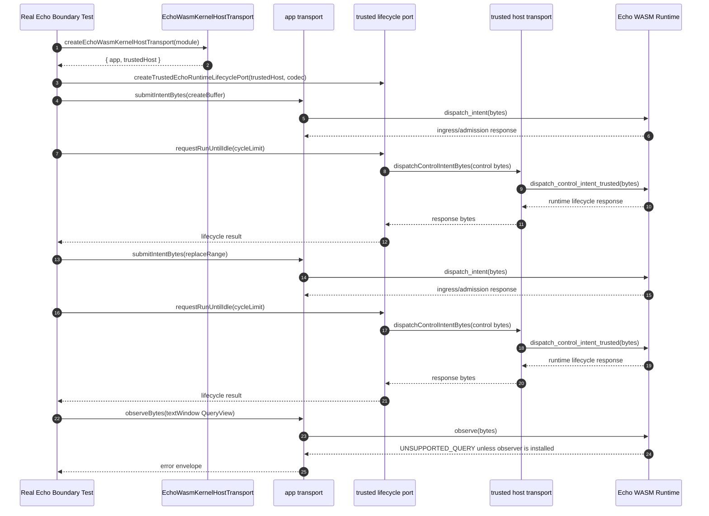

The trusted lifecycle request in this witness uses an until-idle cycle limit.
That limit is a guardrail around Echo's own run loop; it is not an externally
supplied tick stream. Future long-lived hosts may ask Echo to start on a
cadence, stop, or recover faults, but those controls remain lifecycle requests.
Echo still owns each logical tick boundary and every `TickReceipt`.

The lifecycle port also carries `requestStop()`. Stop is trusted host control:
it suspends future scheduler opportunities at a safe boundary. It is not a
jedit application intent and it does not interrupt a half-committed tick.

## Agent Echo-Powered Session Witness

The fast product-session command is:

```sh
npm run witness:echo:session
```

It is not the real Echo WASM substrate proof. It is a host-owned agent smoke
path over the same app-facing product capability:

```text
TextBufferOptic session
-> create buffer
-> apply replace-range intent
-> observe text window
-> host stop request
-> JSON receipt/reading report
```

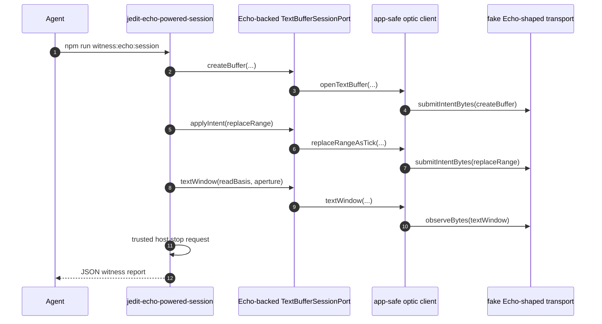

This command reports `transport: installed-jedit-contract` and proves the
product-session lifecycle composition over the installed jedit contract
transport. The opt-in real Echo WASM witness remains the authority for proving
what the current Echo WASM substrate actually supports. The agent command keeps
raw lifecycle control out of the app-facing optic and requests trusted stop at
the end of the host-owned command, proving shutdown remains a host lifecycle
concern.

## Intent, Tick, Receipt, Reading

The most common misunderstanding is to treat application dispatch as "run this
now." That is wrong.

The intended Echo shape is:

```text
application submits intent
-> Echo records/adopts ingress posture
-> trusted host requests runtime availability
-> Echo scheduler chooses deterministic work
-> Echo emits tick receipt
-> application observes outcome or bounded reading
```

Application code controls neither tick boundaries nor scheduler order.

For jedit this means:

- The editor asks for a replace-range operation.
- The app adapter encodes contract-shaped intent bytes.
- Echo admits or obstructs the intent.
- A trusted host later requests Echo's internal run loop.
- Echo's scheduler decides what applies.
- jedit observes the resulting text window through a bounded query once a
  matching generated contract observer is installed.

If an edit conflicts with another edit, the answer should be an explicit
rejection or obstruction. Hidden retry is not allowed. A retry must be a new
causal input.

## Observation and Retained Evidence

Echo observations return more than payload bytes once an observer is installed.
The final jedit release path needs:

- `QueryBytes`: the raw reading payload.
- `ReadingEnvelope`: evidence about the reading basis and observer posture.
- Generated contract metadata: the query identity jedit expected.
- Retained evidence posture: what material is inline and what durable material
  is missing.
- Replay posture: currently obstructed by durable replay unavailability.

The current opt-in real Echo WASM witness is one step earlier: it verifies that
Echo fails closed with `UNSUPPORTED_QUERY` when jedit asks for `textWindow`
without an installed generated observer. That is intentional. Echo must not
return hardcoded text bytes from a kernel fixture.

The witness report is not a vanity log. It is the current machine-readable proof
surface for the release gate.

Current retained evidence posture:

```text
available inline:
  package_identity
  contract_receipt

missing durable retention:
  reading_envelope_ref
  reading_payload_ref
```

That means the session-level witness consumes reading-evidence posture from the
observer adapter instead of manufacturing reading refs later in the witness
layer. The current observer adapter can say the reading envelope and reading
payload refs are missing durable material; future Echo/WSC retention work must
replace that posture with durable evidence instead of changing jedit's app
boundary.

## Shutdown: From SIGTERM to Process Exit

jedit currently does not install a jedit-specific SIGTERM handler in
`src/main.ts`. The process lifecycle is mostly inherited from Node and Bijou.

The current practical behavior is:

1. The operating system or parent process sends SIGTERM.
2. Node begins termination according to its signal behavior.
3. The Bijou terminal loop is interrupted as the process exits.
4. Any explicit jedit cleanup only runs if the surrounding runtime gives pending
   commands a chance to complete.

The workspace runtime no longer schedules a Graft sidecar lifecycle command.
`graftSession.closeConnection` remains on the port as a harmless cleanup hook,
but the direct API adapter has no repo-local child process to drain during
normal app-command execution. A future host lifecycle slice should add explicit
shutdown handling if jedit needs strong cleanup guarantees.

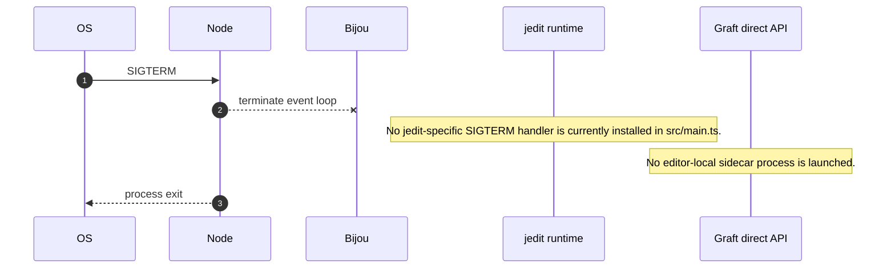

## Start, Stop, and Trusted Runtime Control

The current witness records trusted start, until-idle drain, and stop posture.
The design direction for a long-running host is still the same authority split:

- The application may ask for work by submitting intents.
- The trusted host may start or stop Echo's internal run loop.
- The trusted host may choose cadence policy.
- Echo owns logical ticks and receipt emission.
- Wall-clock cadence is host policy, not semantic history.
- Even trusted host code must not inject discrete ticks or choose individual
  tick boundaries.

The host-facing shape is:

```text
Start(tickIntervalSeconds = 1/60)
Stop()
```

those controls belong behind a trusted host port or adapter. They must not be
available through `TextBufferOptic`, editor commands, query observers, or normal
application intent submission.

The key distinction:

```text
User edit:
  application causal input

Host start/stop:
  trusted runtime control input

Echo tick:
  runtime-owned logical execution boundary, never externally injected
```

## Current Completeness Matrix

| Area | Current status |
| --- | --- |
| Terminal application startup | Implemented through Bijou and `src/main.ts`. |
| Local file editing | Implemented through jedit workspace/editor ports. |
| Graft structural intelligence | Implemented through direct API adapter and source highlighter ports. |
| jedit app-facing optic contract | Designed and partly represented through `TextBufferOptic`, `ReadBasisHandle`, and SDL. |
| Wesley generated operation metadata | Used for hot-text and structural-history operation identity. |
| Fake Echo-shaped transport | Implemented for default tests and app-boundary pressure. |
| Real Echo WASM app transport | Implemented through `echo-wasm-kernel.ts`. |
| Trusted Echo host transport | Implemented separately from app transport. |
| Real Echo generic boundary witness | Implemented as opt-in unsupported-query proof without hardcoded jedit text semantics. |
| Echo-backed TextBufferSessionPort | Implemented as an adapter over the app-safe client boundary. |
| Production text session witness | Implemented for open, edit, checkpoint, bounded read, export, retained refs, and local replay posture. |
| Interactive workspace Echo cutover | Active slices 81-90; direct `EditorState.lines` authority remains visible and must be removed from production paths. |
| Agent Echo-powered session witness | Implemented as `npm run witness:echo:session`. |
| Trusted host stop helper | Implemented as `stopTrustedEchoRuntime(...)`. |
| Durable retained evidence | Not complete; witness reports `missing_retention`. |
| Durable replay | Not complete; witness reports `durable_replay_unavailable`. |
| Full interactive TUI on Echo | Not complete; this is the active BEARING plan. |
| Explicit SIGTERM cleanup | Not complete as a jedit-specific lifecycle contract. |

## How to Run the Important Paths

Run the interactive development app:

```sh
npm run dev
```

Build and start the compiled app:

```sh
npm run build
npm start
```

Run the default checks:

```sh
npm run check
```

Plan the real Echo witness without running it:

```sh
ECHO_WARP_WASM_DIR=/path/to/echo/crates/warp-wasm \
  node scripts/jedit-echo-witness.mjs --dry-run --json
```

Run the real Echo witness and include replay posture:

```sh
ECHO_WARP_WASM_DIR=/path/to/echo/crates/warp-wasm \
  node scripts/jedit-echo-witness.mjs --json --replay
```

Run the fast product-session witness:

```sh
npm run witness:echo:session
```

Run the production text session witness:

```sh
npm run build
node scripts/jedit-production-text-session.mjs --json
```

## The End-to-End Story

Here is the whole current stack in one sequence.

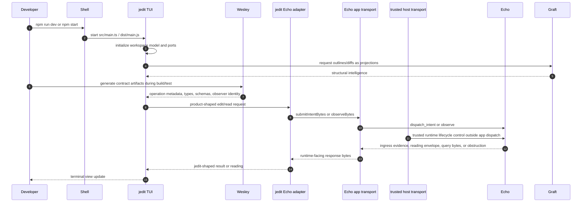

The stack becomes release-grade when the interactive product path and the
production session witness path are the same path for real editing:
jedit-authored contract, Wesley artifacts, Echo package install, jedit app
intent, trusted host runtime loop outside app dispatch, Echo-owned tick receipt,
bounded reading, retained evidence, and replay.

## Future Work Called Out by This Guide

This guide intentionally exposes gaps instead of papering over them:

1. Complete BEARING slices 81-90 so the interactive workspace opens, edits,
   renders, saves/exports, and checkpoints through the production text session.
2. Quarantine legacy direct `EditorState.lines` mutation as fixture-only or
   adapter-private behavior.
3. Install jedit-authored contract packages into Echo through the generic registry boundary.
4. Replace fixture JSON transport bytes with durable Wesley-generated codecs.
5. Complete retained evidence lookup for payloads, reading envelopes, and
   contract receipts.
6. Complete durable replay for accepted edit/read evidence.
7. Add explicit trusted host lifecycle controls for long-running jedit hosts.
8. Add Echo WSC causal-history persistence only after interactive cutover is
   credible.
9. Add explicit SIGTERM/shutdown behavior if strong cleanup guarantees become
   product requirements.
10. Keep Echo generic while jedit becomes a serious product-shaped consumer.

The north star remains small but strict:

```text
jedit owns editor semantics.
Wesley owns contract compilation.
Echo owns deterministic runtime truth.
Application code submits and observes.
Trusted host code requests runtime lifecycle.
Echo ticks itself.
Evidence tells the truth.
```
