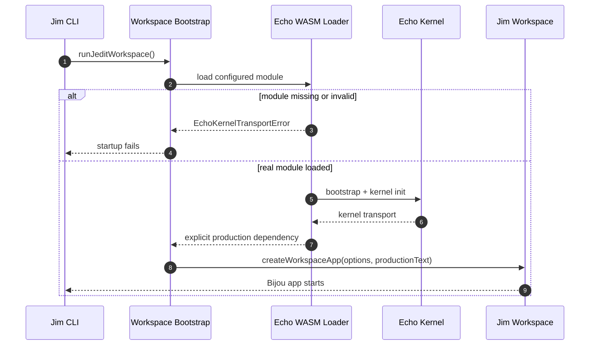
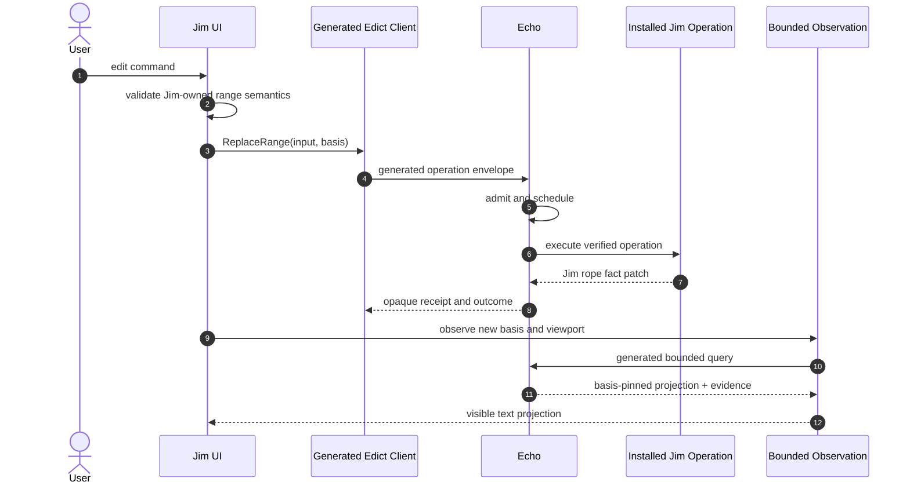

# Jim + Echo End-To-End Guide

This document describes the executable repository as it exists after the real
Echo-only hard cutover. It does not describe the deleted TypeScript runtime as
a migration option.

## Current Truth

Jim has one production substrate posture:

1. load a configured Echo WASM module;
2. initialize the real Echo kernel transport;
3. construct the workspace with that explicit dependency;
4. fail every text operation closed until Echo can install and invoke Jim's
   generated Edict package.

The TUI can start with a real Echo kernel, but it cannot currently open or edit
text through Echo. This is intentional. A non-editing product with an honest
obstruction is preferable to a functional product backed by counterfeit local
authority.

## Ownership

| Concern | Owner |
| --- | --- |
| Modal UI, Vim syntax, cursor, viewport, settings | Jim |
| Rope facts, text ranges, checkpoint declarations | Jim |
| Operation source law | Jim-authored Edict package |
| Generated client and verified operation package | Edict |
| Admission, scheduling, ticks, receipts, causal history | Echo |
| WASM ABI and byte transport | Echo |
| Syntax and structural projections | Graft |
| Terminal loop and surfaces | Bijou |

Jim must treat Echo-issued head, fact, anchor, tick, and receipt identities as
opaque. Jim may validate its own operation arguments before calling Echo, but
it may not copy Echo identity, admission, scheduler, receipt, WAL, or support
policy into TypeScript.

## Startup Sequence



`JEDIT_ECHO_WASM_MODULE` names the real module. The repository does not provide
a production fallback package.

```sh
JEDIT_ECHO_WASM_MODULE=/path/to/echo-wasm-package npm run dev
```

Without that module, startup exits with a typed `module-load` transport error.

## Text Operation Posture

The current production text session receives the initialized Echo transport,
reads its kernel identity, and returns typed obstructions for open, read,
replace, delete, checkpoint, export, causal-line, and range-why requests.

This obstruction is not an implementation placeholder that may mutate local
state. It is the product contract while the generated operation corridor is
absent:

```text
Echo kernel is initialized.
Generated Jim Edict package is not installed.
Text operation is obstructed.
No editor text, head, receipt, or causal history is manufactured.
```

## Required Operation Corridor

The first real operation path must be:



The UI must not render changed text before the final basis-pinned observation.
The local Vim planner may derive a proposed byte range and expected cursor
effect, but its temporary transformed lines are not authority and are not
published as visible settled text.

## Undo And Redo

There is no process-local undo or redo stack. `u` and `Ctrl-R` cannot mutate
production text today.

The future path is:

1. observe basis-pinned reversible candidates from retained Echo history;
2. select the exact retained receipt to reverse;
3. invoke an installed generated inverse operation;
4. receive a new Echo receipt;
5. refresh visible text from the returned basis.

Redo is an inverse-of-inverse operation with explicit causal support, not a
cursor moving through a local snapshot array.

## Checkpoints And Saves

Jim checkpoint declarations and Echo causal anchors remain separate facts.
Saving may associate both, but declaring a Jim checkpoint does not inherently
mint an Echo anchor.

A durable save eventually needs:

1. a named admitted rope head;
2. an optional Echo-admitted causal anchor under runtime policy;
3. a complete UTF-8 materialization derived from that basis;
4. host-file drift preflight;
5. a save/export receipt or observation that identifies the exact basis.

The current production path obstructs this flow because the installed
operations and generated observations do not exist yet.

## Projections And Caches

`EditorState.lines`, text-window materializations, line indexes, syntax spans,
and render surfaces are projections. They may be discarded and rebuilt. They
must carry or be checked against an admitted basis before they can support a
causal claim.

The graph-rope fact types and validators remain Jim-owned domain law. The local
graph-rope executor was deleted because executing those facts in TypeScript
would create a second authority beside Echo.

## Test Policy

Tests may inject deterministic production-session doubles under `spec/`.
Product source and executable scripts may not contain fake, fixture, in-memory,
snapshot-authority, handwritten session, local receipt, or local scheduler
implementations.

The policy is executable:

```sh
node scripts/jedit-production-cutover-guard.mjs
```

The guard scans `src/**/*.ts` and `scripts/**/*.mjs`, except its own pattern
definitions. It also pins deleted authority files so they cannot quietly return.

## Evidence

Run the local gates:

```sh
npm run test:all
npm run quality
node scripts/jedit-production-cutover-guard.mjs
```

Run the real Echo substrate witness:

```sh
ECHO_WARP_WASM_DIR=/path/to/echo/crates/warp-wasm \
  scripts/run-real-echo-wasm-stack-witness.sh --json
```

That witness proves only module build, load, kernel initialization, and a real
scheduler-status call. It must not be cited as proof that a Jim text operation
was admitted or ticked.

## Next Milestone

Echo and Edict must establish one installed generated operation. Jim should
then migrate in this order:

1. `ReplaceRange` generated invocation;
2. bounded text-window observation;
3. deletion of the obstructed replacement branch for that operation;
4. checkpoint declaration;
5. save/export basis association;
6. retained undo/redo candidate observation and installed inverse operations;
7. deletion of any remaining transitional request glue.

No step may restore the deleted local runtime to make the UI appear functional.
