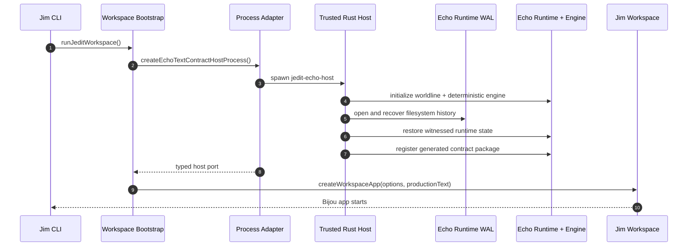
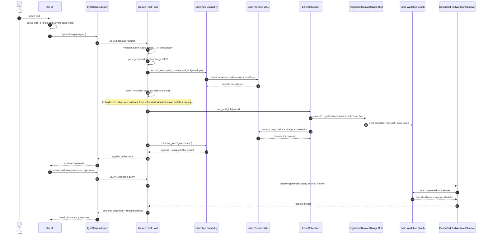

# Jim + Echo End-To-End Guide

This document describes the executable production text corridor as it exists
now. It distinguishes the narrow Wesley compatibility package from the future
Edict-native operation path.

## Current Truth

Jim has one production text-authority posture:

1. `npm run dev` builds and launches `jedit-echo-host` as a trusted native
   process.
2. The host initializes a real `WorldlineRuntime`, filesystem runtime WAL, and
   deterministic Echo engine.
3. The host registers the checked generated package for buffer creation,
   single-range replacement, and bounded text-window observation.
4. Mutations enter through Echo's WAL-acknowledged app capability, receive
   Echo-owned installed-operation admission evidence, and execute only during a
   scheduler-owned tick.
5. Text authority is an immutable graph rope in Echo's worldline graph.
6. TypeScript receives opaque receipt and reading identities over a JSONL
   process port and installs only bounded observed text as visible projection.

There is no TypeScript text authority, fake production transport, local receipt
builder, snapshot fallback, or optimistic settled-text mutation.

## Implemented Surface

The real corridor currently implements:

- create or reopen a buffer;
- insert text through single-range replacement;
- replace one UTF-8 byte range;
- delete one UTF-8 byte range;
- observe a bounded text window at an explicit rope head;
- recover the graph and receipts from Echo's filesystem WAL after restart;
- continue editing after recovery.

These operations remain typed obstructions:

- multi-range edits;
- checkpoint declaration and causal-anchor association;
- save and export;
- causal line-diff and gutter evidence;
- `:why` range explanation;
- undo and redo.

The product remains intentionally incomplete rather than implementing those
features through a second authority.

## Ownership

| Concern | Owner |
| --- | --- |
| Modal UI, Vim syntax, cursor, viewport, settings | Jim |
| Rope fact schema, text ranges, replacement semantics | Jim Rust package |
| GraphQL operation declaration | Jim |
| EINT codecs, operation ids, registry, host rule helpers | Echo Wesley generator |
| Package verification and registration | Echo trusted host |
| Submission admission, WAL, scheduling, ticks, receipts | Echo |
| Authoritative graph and restart reconstruction | Echo |
| Bounded query execution and reading evidence | Echo |
| JSONL process transport and UI mapping | Jim adapters |
| Future generated operation law and client | Edict |
| Syntax and structural projections | Graft |
| Terminal loop and surfaces | Bijou |

Jim treats Echo-issued head, tick, commit, receipt, and reading identities as
opaque. It validates Jim-owned request semantics before crossing the host port,
but it does not copy Echo identity, admission, scheduler, receipt, WAL, or
support policy.

## Build And Startup

```sh
npm run dev
```

The script first runs:

```sh
cargo build --manifest-path native/jedit-echo-host/Cargo.toml
```

The TypeScript adapter then launches:

```text
native/jedit-echo-host/target/debug/jedit-echo-host
```

Optional process-boundary configuration:

- `JEDIT_ECHO_HOST_BIN` selects a compatible host binary.
- `JEDIT_ECHO_WAL_DIR` selects the filesystem runtime-WAL directory.

If the binary is unavailable, emits invalid JSONL, or exits, pending and future
text requests become typed obstructions. No local fallback is selected.

## Package Construction

The authored compatibility contract is
`contracts/jedit/echo-text.graphql`. From an Echo checkout, generate against
the Jim checkout with:

```sh
cargo run -p echo-wesley-gen -- \
  --schema /path/to/jedit/contracts/jedit/echo-text.graphql \
  --contract-host \
  --out /path/to/jedit/native/jedit-echo-host/src/generated/contract.rs
rustfmt --edition 2021 \
  /path/to/jedit/native/jedit-echo-host/src/generated/contract.rs
```

The checked generated Rust binds:

- canonical EINT codecs;
- stable operation and query ids;
- package registry and compatibility evidence;
- generated contract rules and runtime-ingress footprints;
- the bounded text-window observer plan.

`native/jedit-echo-host/src/contract.rs` supplies transitional Rust operation
handlers for those generated rules. This is not the final authoring model.
Edict will replace those handlers and the current invocation glue.

## Startup Sequence



## One Replacement, End To End



The UI must not render the changed text as settled before the final observation
returns. A local Vim planner may compute a proposed edit and cursor effect, but
that proposal is not authoritative text.

## Rope Authority

The graph stores immutable buffer, head, branch, leaf, blob, rewrite, and diff
facts. A narrow edit splits the basis rope, creates replacement leaves, joins
the resulting roots, and updates the buffer's canonical head during the Echo
tick. Untouched subtrees retain identity.

Materialized strings exist only at boundaries:

- initial import bytes;
- replacement input;
- bounded text-window output;
- eventual save/export projection.

No retained full-string root is the authoritative edit history.

## Restart

The host starts from an empty runtime shell, opens Echo's filesystem WAL, and
asks Echo to reconstruct witnessed submissions, committed graph state,
provenance, and receipt correlations. Package registration then restores the
verified executable operation boundary.

The restart witness proves that recovered text can be observed and that a new
generated replacement can be admitted and committed afterward. A process-local
map is never the recovery authority.

## Test Policy

Tests may inject deterministic ports under `spec/` and native test targets.
Product source may not contain fake, fixture, in-memory, snapshot-authority,
Jim-owned admission-ticket, local receipt, or local scheduler implementations.

The policy is executable:

```sh
node scripts/jedit-production-cutover-guard.mjs
```

The guard scans `src/**/*.ts`, executable scripts, and
`native/jedit-echo-host/src/**/*.rs`. It also pins deleted authority files so
they cannot quietly return.

## Evidence

Run:

```sh
npm run echo:test
npm run build
JEDIT_DIST_PREBUILT=1 node --test spec/workspace-production-echo-wiring.spec.mjs
node scripts/jedit-production-cutover-guard.mjs
```

The older Echo WASM smoke witness proves a separate module-load boundary only.
It is not the production text path and is not evidence that this package ran.

## Edict Migration

The compatibility corridor exists to apply product pressure now, not to become
permanent protocol law. The convergence order is:

1. Keep create, replace, and bounded read green through real Echo.
2. Establish one natively installed generated Edict operation in Echo.
3. Migrate `ReplaceRange` to the generated Edict client and operation.
4. Make the Wesley/Rust replacement path unreachable and delete it.
5. Migrate buffer create/open and bounded text-window observation.
6. Add checkpoint, save/export, and inverse operations through generated Edict
   packages and bounded Echo readings.
7. Delete the compatibility package and transitional process protocol.

No migration step may restore local text authority to make the editor appear
more complete.
