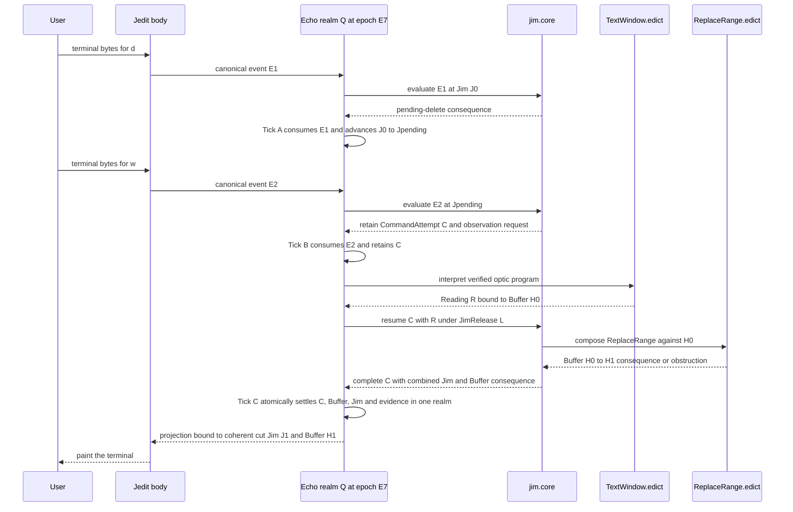
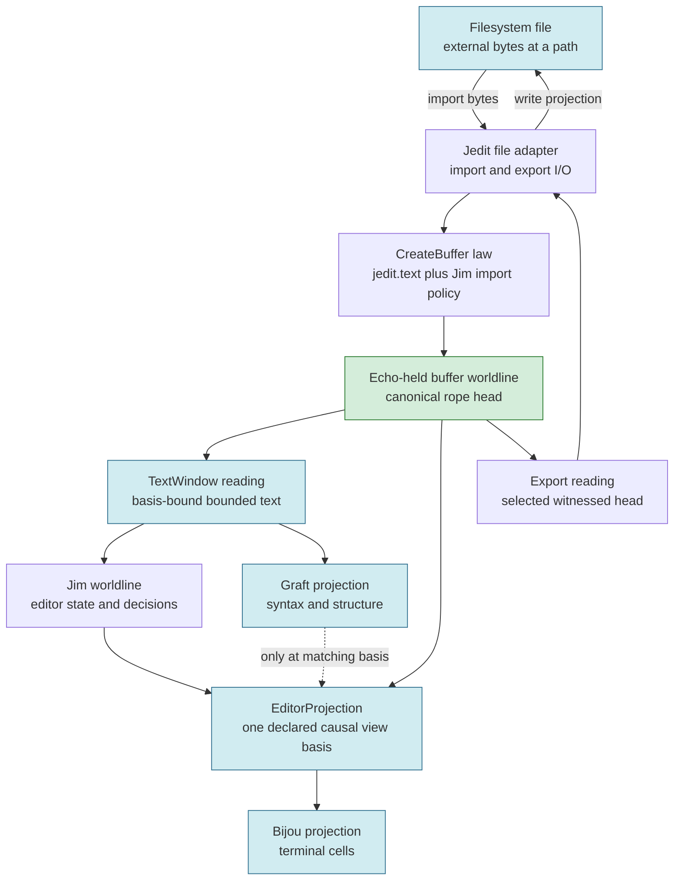

# Jim: Components, Responsibilities, and Ownership

## The sixty-second orientation

Jim is the editor personality and persistent semantic observer: the part of
the system that knows what a key means, which mode the editor is in, where the
cursor is, what an operator is waiting for, which lawful text operation to
compose, and how Jim should advance when that operation applies or refuses.
The larger Jedit application domain also contains reusable capabilities such as
`jedit.text`; Jedit's product shell supplies Jim's body. Edict is the language
and compiler used to author that application law. Echo is the generic runtime
that admits, schedules, commits, records, and recovers its verified programs.

That distinction matters because the word "owns" can otherwise hide several
different responsibilities. Jim owns editor *meaning*. Echo owns authoritative
runtime *commit and history*. Edict owns the *compiler trust boundary* between
source and executable package. Jedit, Bijou, and native adapters own *I/O and
presentation*. Graft owns *structural intelligence over bounded readings*.
None of those roles may silently absorb another.

The target can be summarized in one sentence:

> Jedit is Jim's body, `jim.core` is Jim's mind, `jedit.text` is the lawful text
> capability Jim composes, Edict compiles and verifies the application release,
> and Echo realizes its worldlines without learning editor vocabulary.

This document uses `jim.core` for the installed capability or module and
`Jim.edict` for its primary authored source. They are related artifacts, not
interchangeable names: source is compiled into a package, and an exact package
is admitted as part of a `JimRelease`.

Today, that target is not yet the production composition. The real Echo-backed
compatibility corridor works, but TypeScript still interprets Vim commands and
derives ranges, while native Rust still plans rope changes. This document maps
both the target and that current transitional reality so that architectural
intent is never mistaken for executable proof.

In summary, Jim is not synonymous with the TypeScript frontend, the Rust host,
the Echo runtime, the text substrate, or the whole Jedit repository. Jim is the
editor personality inside an application-owned release, and the migration is
complete only when that composition is authored in Edict and realized
generically by Echo.

### A small vocabulary before the walkthrough

The architecture uses a few precise terms repeatedly. They are worth defining
before following an edit through the system:

| Term | Meaning in this document |
| --- | --- |
| Worldline | The retained causal history of one running entity, such as Jim or a buffer, as it advances through committed states |
| Basis | The exact observed state or head against which a reading, decision, or requested change is valid |
| Lawpack | A versioned, digest-bound Edict bundle containing application types, helper law, permitted effects, profiles, and typed obstructions |
| Optic | A bounded program that observes a selected view of state without becoming another authority over that state |
| Intent | A typed request to evaluate an application operation against a named basis; it is not a preapproved mutation |
| Command attempt | The durable identity of one semantic command from consumed input through terminal settlement, potentially spanning observations, conflicts, and retries |
| Candidate settlement | One privately evaluated proposal associated with a command attempt; an explicit retry may create another candidate under the same attempt |
| Tick | One atomic Echo state transition: all admitted consequences commit together, or none do |
| Settlement | The single Tick or explicitly equivalent durable protocol that makes all consequences of one completed semantic command agree |
| Obstruction | A typed, expected refusal explaining why a requested application consequence did not apply; an enclosing observer may still settle its lawful refusal or retry state |
| Reading | Evidence-carrying observed data bound to a particular basis and support footprint |
| Receipt | Echo's evidence that a particular admitted program was evaluated with a particular outcome |
| WAL | Echo's write-ahead log, which durably records enough ordered information for recovery |
| Core IR | Edict's canonical, application-neutral intermediate representation after source checking |
| Target IR | The lower-level generic program representation that Echo can interpret after verification |
| Release closure | The immutable set of exact package, schema, profile, and verifier-policy identities governing one Jim worldline |
| Authority realm | The Echo-controlled transaction domain that gives its hosted mutable worldlines one serialized history |
| Authority epoch | A monotonically distinct tenure of one realm authority; an epoch change fences former hosts from committing |
| Transaction conflict | Echo evidence that a candidate Tick could not linearize because an expected read or authority coordinate changed |
| Read set | The exact state coordinates a privately evaluated candidate relied on and requires to remain valid when Echo orders the candidate |
| Serialization point | The instant at which one authority realm orders a candidate relative to competing candidates and decides whether it can commit |
| View basis | The exact Jim, buffer, and required projection coordinates that may lawfully be presented together |
| Fencing token | An epoch-bound credential that prevents a former or competing holder from continuing to mutate a protected authority |
| Materialization guarantee | The declared strength with which an external adapter can serialize or merely observe a filesystem effect |

Wesley's generated compatibility code also uses **EINT**, the current canonical
Echo intent-envelope encoding. EINT is a transport representation; it does not
grant Wesley, TypeScript, or Echo authority to decide what an editor command
means.

In summary, these terms separate Jim's application decisions from the evidence
and generic machinery used to compile, run, and retain them.

## One editing action, shown in full

The best way to see every boundary is to follow one ordinary Vim-shaped edit.
Suppose the current Echo-backed buffer contains this UTF-8 text, and the cursor
is on the first byte of `beta`:

```text
alpha beta gamma
      ^
```

The user presses `d`, then `w`. In normal Vim terminology, `d` begins a delete
operator and `w` supplies a word motion. For this example, the intended result
is:

```text
alpha gamma
      ^
```

This example is deliberately simple, but it is not a single primitive action.
Jim must remember a pending operator after `d`, durably consume `w`, observe
enough text to resolve the motion, derive a basis-bound byte range, preserve the
deleted text in a register, compose a lawful text replacement, update cursor,
repeat, undo-group, and mode state, and finally emit a renderable view. Most of
those steps may span several Ticks. The completed command has one non-negotiable
boundary, however: its buffer and Jim-state consequences must settle as one
coherent causal cut.

The target interaction is the following. The canonical event envelope's exact
wire schema is not frozen by this document; the invariant is that the Jedit
boundary constructs it, Echo carries it opaquely, and only `jim.core`
interprets its editor meaning.



<details>
<summary>Figure 1 - The target `dw` active-observer round trip</summary>

The two key events enter through Jedit's I/O membrane, but their meaning is
decided by `jim.core`. Observation may take multiple durable transitions. When
the reading arrives, Jim composes the independently specified `ReplaceRange`
law inside the parent command evaluation. One Echo authority realm settles the buffer edit, Jim
state, register, cursor, repeat recipe, undo group, command result, and evidence
together. Echo realizes those verified programs without branching on `d`, `w`,
words, ranges, buffers, or ropes.

</details>

| Turn | Component acting | What it is allowed to decide |
| --- | --- | --- |
| Decode | Jedit/Bijou/native boundary | Which canonical input event the terminal bytes represent |
| Interpret | `jim.core` | That `d` starts a delete and `w` completes a word motion |
| Observe | `TextWindow.edict` through Echo | Which basis and bounded support the reading proves |
| Derive | `jim.core` | The operator target, register consequence, cursor policy, repeat recipe, undo group, and text-operation intent |
| Execute | `ReplaceRange.edict` through Echo | The application-owned text law and its typed result or obstruction |
| Settle | Echo realm and epoch | Whether the combined Jim-and-buffer consequence becomes one atomic Tick and correlated evidence set |
| Present | Jedit/Bijou | How a projection bound to the settled Jim and buffer bases appears on the terminal |

Two foils sharpen the boundary. A TypeScript client that directly submits a
`ReplaceRange` request proves only operation transport; it does not prove that
Jim interpreted `dw`. Likewise, an RPC-shaped sequence in which the buffer edit
commits and Jim later updates its register and cursor is not a completed Jim
command. It permits a crash to leave `Buffer H1` paired with `Jim Jpending`.

The settlement invariant can therefore be stated without implementation
shorthand:

```text
CommandAttempt C under JimRelease L
  bound to:
    Echo realm Q at authority epoch E7
    Jim basis Jpending
    Buffer basis H0
    Reading R supported by H0
    input events E1 and E2

  privately evaluated candidate K1:
    read_set_digest D

  successful settlement:
    Buffer H0 -> H1
    Jim Jpending -> J1
    pending operator cleared
    deleted-content register updated
    cursor, repeat recipe, and undo group updated
    CommandSettled(C, Applied)
    one correlated evidence set

  obstructed settlement:
    Buffer remains H0
    Jim advances to the lawfully defined refusal or retry state
    CommandSettled(C, Obstructed(reason))
    one correlated evidence set

  candidate transaction conflict:
    no Tick commits
    no Jim or Buffer state advances
    no CommandSettled fact exists yet
    CandidateSettlementRejected(
      outcome O1,
      attempt C,
      candidate K1,
      serialization S,
      read_set_digest D,
      ReadSetChanged(...)
    ) is retained
    CommandAttempt C remains unresolved for a later Jim resolver Tick
```

The block describes one atomic causal cut, not a caller-authored graph patch.
`jim.core` and `jedit.text` produce typed consequences by composing verified
law; one Echo realm and epoch alone admits the candidate and either commits its
generic target program or records a distinct transaction conflict.

The obstruction branch describes an application result whose enclosing Jim
settlement successfully committed. The transaction-conflict branch is
different: it is Echo evidence about a candidate that never became a Tick, so
it cannot emit a Jim outcome. A later Jim resolver consumes the identified
conflict outcome at most once. At most one terminal result may ever exist for
the retained attempt; eventual terminal settlement additionally depends on the
realm progressing and the pinned release and required evidence remaining
available.

In summary, `dw` belongs to Jim even though several other components carry,
compile, execute, persist, and display its consequences. The owner of a
decision is the component allowed to choose its meaning, while the settlement
boundary prevents those correctly owned decisions from becoming a torn editor
state.

## What "ownership" means in this architecture

Ownership in Jim is intentionally split into distinct kinds because no single
component should control meaning, compilation, execution, durability, and
presentation. The split is a safety property: each component receives enough
authority to perform its job and no more.

| Ownership kind | Question it answers | Owner |
| --- | --- | --- |
| Semantic ownership | What does this event, state, operation, fact, or domain result mean to the editor? | `jim.core` plus Jedit application capabilities such as `jedit.text` |
| Compilation ownership | Is the authored law well-typed, authority-closed, canonical, lowerable, and independently verified? | Edict |
| Runtime authority | May this verified program run now, with this basis, release, realm, epoch, budget, and footprint, and may its consequence commit? | Echo authority realm |
| Durable-history ownership | Which Tick, conflict outcome, reading, receipt, and recovery record actually exists? | Echo realm WAL or consensus history |
| I/O ownership | How do terminal, process, filesystem, and package bytes cross the application boundary? | Jedit/Bijou/native adapters |
| Projection ownership | How is witnessed state cached, indexed, highlighted, laid out, or painted? | Jedit/Bijou, with Graft for structural projections |
| Evidence ownership | What independently demonstrates expected application behavior? | Jim/Jedit schemas, oracles, tests, and conformance harnesses |

This division means two true statements can coexist. The Jedit application
domain owns the meaning of a text edit, while Echo owns whether the edit and
its Jim-state consequences were lawfully committed. The text capability owns
the meaning of a checkpoint declaration, while Echo owns the Tick and receipt
that witness its persistence. Jedit owns a screen cache, while neither that
cache nor the screen becomes text authority.

> **Intuition to carry forward:** semantic ownership and storage authority are
> different powers. Jim decides what command to perform, the text capability
> defines what the text operation means, and Echo decides whether their
> combined verified consequence becomes durable history.

In summary, "owns" should always be read with a qualifier. Most architectural
confusion in this system comes from treating semantic, runtime, storage, and
projection ownership as if they were the same thing.

## Jim from the inside out

`jim.core` is the planned persistent active observer at the center of the
system. It has not yet been authored, so the names below describe stable
responsibilities rather than claiming that these are already checked-in Edict
modules. The important design constraint is that every editor-semantic decision
has exactly one final home inside Jim or a named application capability.

| Jim responsibility | What Jim owns | What Jim delegates |
| --- | --- | --- |
| Persistent editor state | Active buffer, mode, cursor, selection, registers, marks, pending operator, pending chord, repeat state, search state, and command-attempt state | Echo persists the realized worldline; Jedit renders projections |
| Event interpretation | Meaning of canonical key, text-input, paste, command, agent, or automation events | Jedit normalizes raw input; Echo admits and delivers envelopes |
| Modal state machine | Normal/insert behavior, operator-pending transitions, counts, registers, motions, and text objects | No semantic delegation |
| Observation policy | Which bounded text or structural reading is needed and at which basis | Echo schedules readings; `TextWindow.edict` defines the optic; Graft may supply structural projections |
| Operation selection | Whether the next application intent is `ReplaceRange`, `CreateBuffer`, `DeclareCheckpoint`, another Jim operation, or no operation | Edict compiles the selected law; Echo admits and executes it |
| Command settlement | Which Jim-state consequences must settle atomically with a selected text consequence | `jedit.text` supplies the text consequence; one Echo realm and epoch commits the combined Tick |
| Result handling | How normal domain results, typed obstructions, admission rejections, and external failures affect Jim | Echo supplies witnessed evidence without collapsing result categories |
| Undo and repeat policy | Which forward compensating command or semantic recipe should be constructed from retained history | Echo supplies retained history and basis-bound evidence |
| Render intent | Which coherent causal view basis the body should display | Jedit/Bijou chooses terminal layout and paint; stale optional projections are withheld |

Jim does **not** own scheduler order, WAL identifiers, receipt formation,
runtime recovery rules, direct graph mutation authority, terminal escape
sequences, filesystem syscalls, Git operations, or syntax-parser internals.
Those are dependencies Jim may invoke through bounded contracts, not hidden
parts of Jim's mind.

In summary, Jim's internal boundary contains every editor policy that must
survive a change of UI toolkit, transport, compiler backend, or runtime host.
If changing TypeScript or Rust can silently change what `dw` means, the semantic
boundary has not yet been completed. If a crash can preserve the text edit
without the corresponding Jim consequences, the causal boundary has not been
completed either.

## The application is a pinned release, not one giant Jim module

Jim should compose independently specified application capabilities rather
than absorb their private representations. That makes `jim.core` the editor
personality and `jedit.text` a reusable lawful text substrate, while an
immutable `JimRelease` pins their exact composition for execution and recovery.

```text
JimRelease L
├── jim.core
│   ├── persistent Jim state
│   ├── input interpretation and modal grammar
│   ├── motions and text objects
│   ├── registers, cursor, repeat, and undo policy
│   └── command-attempt and settlement composition
├── jedit.text
│   ├── Buffer, RopeHead, slice, diff, and range contracts
│   ├── ReplaceRange
│   ├── TextWindow
│   ├── CreateBuffer and DeclareCheckpoint
│   └── private rope representation and structural invariants
├── jim.external-policy
│   ├── import and export policy
│   └── external-conflict and reconciliation policy
└── exact transitive executable closure
    ├── every application package and lawpack dependency
    ├── exact edict.std.* standard-library packages
    ├── schema and codec packages
    ├── entry-point identities
    ├── target instruction-set semantics
    ├── Echo execution and authority profiles
    ├── verifier-policy identity
    ├── effect-protocol versions
    ├── migration packages
    └── structural-provider packages whose readings affect command meaning
```

This tree is a composition map, not a repository-layout mandate. Its
load-bearing property is that `jim.core` may understand public text concepts
such as buffer identity, head, range, slice, content reference, result, and
obstruction without understanding `RopeLeaf`, `RopeBranch`, tree height,
balancing, split/join mechanics, or path copying. Those representation details
remain private to `jedit.text`.

The release closure also prevents ambient upgrades. A retained event or
interrupted command attempt must never be resumed under “the latest” Jim law.
Every evaluation records `JimRelease L`; an upgrade from `L1` to `L2` is an
explicit, admitted Jim transition with a migration result and receipt.
Historical commands remain governed by the release that originally interpreted
them. There is no ambient current `edict.std.collections`, target instruction
set, effect protocol, or structural provider when its reading changes command
meaning.

Identity alone is insufficient for reenactment. Every release manifest and
package byte sequence reachable from retained history intended for reenactment
remains available in a content-addressed artifact store. A digest may prove
which absent object once existed, but it cannot execute that object during
recovery.

The first release-upgrade protocol uses strict quiescence rather than
accidentally creating a multiversion runtime:

```text
ActivateRelease L1 -> L2 is admissible only when:
  no unresolved CommandAttempt exists
  no observation request remains pending
  no external effect remains prepared but unresolved
  no queued event is pinned to L1
  the migration accepts the complete current Jim state
  the complete L2 closure is retained, installed, and verified
```

Repeat recipes and undo metadata are part of the current Jim state, so the
migration must explicitly preserve, transform, or reject them. Work begun
under `L1` does not quietly finish after the worldline activates `L2`.
Supporting that later would require a deliberate multiversion protocol.

| Layer in the release | Public to `jim.core` | Private responsibility |
| --- | --- | --- |
| `jim.core` | Jim state and semantic command results | Editor personality and command policy |
| `jedit.text` | Buffers, heads, ranges, slices, content references, diffs, and typed text outcomes | Rope nodes, balancing, path copying, and text-model invariants |
| `jim.external-policy` | Logical external identities and observed external results | When import, export, conflict, or reconciliation is appropriate |
| `JimRelease` | Immutable release identity | Exact transitive closure of packages, profiles, schemas, entry points, and verifier policy |
| Artifact store | Content-addressed bytes and manifests reachable for reenactment | Retention, integrity, and availability of the exact executable closure |
| Upgrade protocol | Explicit `L1 -> L2` transition and migration receipt | Quiescence, closure installation, state migration, and activation admissibility |

In summary, the application domain owns both Jim and its text substrate, but
Jim does not own rope internals. The immutable release closure binds their
collaboration so replay and recovery cannot reinterpret old events under new
law, while retention and quiescent activation make that identity executable
rather than ceremonial.

## The complete cast and each component's territory

Jim operates inside a larger system whose components have intentionally narrow
territories. This table is the primary ownership map: it states both the
positive responsibility and the forbidden expansion for each participant.

| Component | Responsibility | What it owns | What it must not own | Current posture |
| --- | --- | --- | --- | --- |
| Jedit product shell | Compose the application, adapters, UI surfaces, and package/bootstrap lifecycle | Product configuration, ports, panes, panels, lenses, process wiring | Jim's final command semantics or text authority | Exists; still contains compatibility semantic orchestration |
| Bijou | Terminal UI substrate | Terminal event decoding support, surface lifecycle, focus, layout, paint | Modes, motions, rope law, causal truth | Exists and remains part of the target body |
| Native adapters | Process bootstrap and raw host capabilities | Echo process lifecycle, filesystem import/export, declared materialization guarantees, package transport, raw I/O | Native Jim planner callbacks or exaggerated filesystem authority in the final composition | Exists; the current Rust host still contains compatibility rope law |
| `jim.core` / `Jim.edict` | Active observer and editor mind | Persistent editor state, event interpretation, observation requests, operation choice, command settlement composition, result handling | Rope representation, scheduling, WAL, receipt identity, terminal or filesystem mechanics | Target only; source not yet checked in |
| `jedit.text` Edict capability | Reusable application-owned text model, operations, and optics | Buffer and head contracts, `ReplaceRange`, `CreateBuffer`, `DeclareCheckpoint`, `TextWindow`, slices, diffs, rope invariants, and typed text outcomes | Jim modes, commands, registers, cursor policy, Echo admission, host syscalls | Schema and oracle are frozen; executable sources are not yet authored |
| `jim.external-policy` | Jim's policy for external authorities | Import, export, provider selection, expected-fingerprint, guarantee-class, conflict, and reconciliation decisions | Ambient paths, raw syscalls, or claims that an external effect committed or was authored without matching evidence | Target contract defined here; no executable provider protocol yet |
| `JimRelease` | Immutable executable application composition | Complete transitive package, standard-library, schema, codec, entry-point, instruction-set, execution-profile, verifier, effect-protocol, migration, and command-relevant provider closure | Ambient “latest package” lookup or reinterpretation of historical events | Target contract defined here; exact manifest schema, artifact store, and activation protocol remain unimplemented |
| Edict | Language, compiler, package builder, and verifier boundary | Parsing, typing, authority closure, Core IR, Target IR lowering, canonical package construction, independent verification | Running Jim, choosing events, or committing graph state | Generic prerequisites have landed; Jim is the next real consumer |
| Echo | Generic causal runtime | Package installation, admission, footprints, budgets, scheduling, private evaluation, atomic Ticks, WAL, receipts, readings, recovery | `Jim`, `Buffer`, `Rope`, `ReplaceRange`, `TextWindow`, Vim policy, native planner callbacks | Real production authority already exists through the compatibility host |
| Echo authority realm | Serialized current-head authority for commit-time mutable read and write preconditions during one epoch | Realm identity, authority epoch, hosted-worldline membership, transaction order, and authoritative WAL or consensus history | Independent contradictory commits by multiple hosts or claims of atomic revalidation over another realm's mutable head | Target shared-worldline contract; not yet proven by the current per-process composition |
| Graft | Structural intelligence over bounded text | Syntax spans, folds, outlines, parser diagnostics, cursor-node context, structural selections and diffs | Text mutation authority, Jim state, or a reason to specialize Echo | Adapter/projection role; not the editor kernel |
| Wesley | Transitional contract compiler and generator | GraphQL-derived codecs, EINT operation identities, registry evidence, host rule helpers, query observer scaffolding | Final Jim semantics, runtime policy, or application state | Active compatibility dependency; scheduled for retirement from semantic execution |
| Canonical-event adapter | Normalize physical input without deciding editor commands | Stable event identity, source principal, source order, normalized key/text/paste/resize/pointer payload, composition boundaries, capability context, and payload digest where applicable | Turning `d` plus `w` into delete-word | Target contract not yet frozen |
| Generated clients | Typed syscall-style stubs | Canonical encoding/decoding, package addresses, event and artifact transport | Command interpretation, range derivation, rope patches, optimistic authority | Allowed in target only as non-semantic membrane code |
| Filesystem | External file storage and ecosystem interchange | Bytes at paths under operating-system authority | Current in-editor buffer truth after import | Import source and export destination, not canonical editor state |
| Git | External version-control ecosystem | Repository commits, refs, index, and worktree projections | Jim's causal edit history or live buffer authority | Optional adapter/export boundary |

The table also explains why “Echo runs Jim” is acceptable while “Echo
implements `ReplaceRange`” is not. A CPU can execute an editor without knowing
what an editor is. Echo should have the same relationship to the complete
`JimRelease`: generic program interpretation and causal authority, with
application vocabulary remaining inside compiler-produced data.

In summary, every component has both a job and a refusal. The refusal column is
as important as the responsibility column because it prevents a convenient
adapter or runtime from becoming a second, contradictory Jim.

## Jim's rope and who owns which part of it

The Jedit text capability's rope is the persistent text model behind an open
buffer. A buffer keeps a stable application identity while each admitted edit
creates a new immutable head. The head names a tree of text nodes; an edit
path-copies only the touched region, reuses untouched subtree identities,
records the rewrite and diff, and advances the buffer's canonical head in the
same Echo Tick that settles the completed Jim command.

The current compatibility implementation demonstrates the intended invariants
in native Rust. It validates the expected basis, byte-range ordering, bounds,
UTF-8 boundaries, content identities, arithmetic, and rope structure; splits
the old tree; builds replacement text; rejoins the retained pieces; emits a new
head, rewrite, diff, and buffer fact; and returns typed obstruction codes for
invalid cases. That implementation is a valuable oracle and migration witness,
but it is not the final ownership boundary.

| Rope concern | Final owner | Why |
| --- | --- | --- |
| Meaning of buffer, head, rewrite, diff, checkpoint, range, and text-obstruction facts | `jedit.text` lawpacks | These are application-domain text concepts, reusable independently of Jim |
| Algorithm expressed by `ReplaceRange.edict` | `jedit.text` source | The rope algorithm is application-owned law, not a `jim.core` or Echo intrinsic |
| Command decision that composes `ReplaceRange` | `jim.core` | Modes, motions, registers, cursor, repeat, and undo policy belong to the editor personality |
| Typechecking and lowering that algorithm | Edict | Compiler correctness and package identity belong at the language boundary |
| Generic graph reads and staged writes | Echo target profile | These are application-neutral runtime primitives |
| Admission, footprint enforcement, combined atomic Tick, receipt, WAL, and recovery | Echo | These are generic causal-runtime powers |
| Materialized lines, line indexes, scroll windows, and screen cells | Jedit/Bijou | They are rebuildable projections |
| Syntax tree, folds, symbols, and structural selections over a reading | Graft | They are structural projections, not rope authority |
| Current native split/join/plan implementation | Compatibility Rust host | It exists today but must become unreachable and then be deleted from production |

> **Intuition to carry forward:** Echo may store and transform opaque rope facts
> by interpreting a generic program, just as a database stores application
> rows. That does not give Echo a rope operation or editor ontology.

A second foil is useful here. Graft may parse the whole visible buffer and know
where every function begins, yet deleting Graft's snapshot must not delete or
rewind the buffer. The syntax tree is a projection over one rope head, not a
competing text store.

In summary, the Jedit application domain owns the text law, but `jedit.text`,
not `jim.core`, owns rope representation and algorithms. Jim consumes its
public buffer, head, range, slice, diff, and result contracts. Edict translates
the composed law, Echo makes the combined Jim-and-buffer settlement real, and
Jedit and Graft see projections of that authority.

## How Jim sees source files

A source file is not the live editor buffer. It is an external byte sequence at
a filesystem path that may be imported into Jim and later receive an exported
projection. Once imported, the authoritative current text is the Echo-backed
buffer worldline head, not whatever bytes happen to remain at the path.

The source lifecycle looks like this:



<details>
<summary>Figure 2 - A file is an import source and export projection</summary>

The filesystem participates at the boundary. Import creates or associates an
Echo-backed Jim buffer; subsequent editing advances rope heads independently
of the path. Saving selects a witnessed head and exports its bytes. Text
windows, syntax trees, coherent editor projections, and terminal cells are
derived views and can be recreated without changing canonical history. A Graft
view joins the editor projection only when it names the rendered buffer head.

</details>

| Situation | Authoritative fact | Consequence |
| --- | --- | --- |
| Before first import | Filesystem bytes at the selected path | Jedit may read them through an adapter under Jim policy |
| After buffer creation | Echo-backed buffer identity and canonical rope head | The path is provenance and projection metadata, not live text authority |
| While editing | Latest admitted rope head plus Jim state | A stale disk file cannot overwrite the buffer silently |
| While rendering | A declared causal view basis plus basis-matching optional projections | Deleting a cache or pane changes no text history; stale Graft data is withheld |
| During save/export | A selected witnessed rope head | The adapter writes a projection and records which basis was materialized |
| After external file change | Two potentially divergent authorities are observed | Jim must apply an explicit import, rebase, conflict, or refusal policy |

This model also prevents a common false shortcut: reading a file immediately
before every command does not make the filesystem an Echo reading, and writing
the UI's current lines does not prove a lawful save. Both operations need an
explicit boundary and a named basis.

A save is an external-effect protocol because Echo and the filesystem do not
share one transaction. Jim first commits an export intent naming immutable
content and the expected prior external fingerprint. The adapter then performs
the host write and reports what it actually observed:

```text
ExportIntent {
  intent_id,
  logical_destination,
  selected_buffer_head,
  exported_content_ref,
  expected_prior_external_fingerprint,
  idempotency_key,
  adapter_capability
}

ExportObserved {
  outcome_id,
  intent_id,
  idempotency_key,
  resulting_external_fingerprint,
  observed_content_identity,
  result: DesiredStateObserved
        | DivergentStateObserved
        | NotAppliedObserved
        | Indeterminate
        | Unsupported,
  guarantee: CausallyAdmitted
           | CooperativeSerialized
           | OptimisticObserved
           | None,
  effect_evidence: ProviderReceipt
                 | CooperativeLeaseReceipt
                 | ObservationRecord
                 | None,
  authorship: Correlated | Unattributed | NotClaimed
}
```

The logical destination is durable application vocabulary; a machine-specific
path is resolved by the adapter or workspace membrane. A fingerprint check
followed by ordinary replacement is not compare-and-swap: another writer can
replace the destination after the check and before the rename, and an ordinary
rename may then destroy that intervening state. The adapter must therefore
declare the materialization guarantee it actually provides.

| Guarantee | Authority and protection | Honest claim |
| --- | --- | --- |
| `CausallyAdmitted` | Destination mutation participates in a transactional authority such as WARP-mediated storage | The provider can correlate the admitted operation with the materialization receipt |
| `CooperativeSerialized` | Authorized adapters share a destination lease and fencing protocol | Cooperating materializers serialize; uncooperative external tools remain outside the guarantee |
| `OptimisticObserved` | Adapter checks before and observes after without exclusive authority | The desired state was observed, but an intervening writer could not be prevented |
| `Unsupported` result | The required provider behavior is unavailable | Refuse before mutation rather than exaggerate the guarantee |

A cooperative provider uses a lease coordinate such as:

```text
MaterializationLease {
  destination_identity,
  materializer_identity,
  authority_epoch,
  fencing_token,
  expiration_or_revocation_rule
}
```

The fencing token prevents an expired or superseded cooperative materializer
from continuing under its old authority. Effect evidence may come from a
causally admitted provider receipt, a cooperative lease receipt, an operation
identity transferred in filesystem metadata or an extended attribute, or a
plain observation record. Authorship is a separate coordinate: a lease proves
participation in cooperative serialization but does not by itself prove that
the operation authored the final bytes. Ordinary matching bytes prove neither.

The adapter performs the write protocol appropriate to its declared class—or
returns `Unsupported` before mutation—then observes any attempted result. If
the host crashes after the filesystem state changes but before Echo records
`ExportObserved`, recovery re-observes the destination using the idempotency
key, content identity, and provider evidence instead of guessing or blindly
overwriting it.

| Recovery observation | Meaning | Jim policy choice |
| --- | --- | --- |
| Destination conclusively retains the expected prior fingerprint | `NotAppliedObserved`; the intended materialized state is absent | Retry under the declared provider protocol or settle a typed not-applied result |
| Destination contains the exact intended content without correlated provider evidence | `DesiredStateObserved`; who authored it is unknown | Record state equivalence and `authorship: Unattributed` without claiming this intent wrote it |
| Destination contains the intended content plus evidence correlated to this intent | `DesiredStateObserved` with provider-backed effect evidence | Record `authorship: Correlated` only to the strength justified by the provider |
| Destination differs from both expected and intended state | `DivergentStateObserved`; bytes alone do not identify the author or cause | Preserve the divergent evidence and apply conflict or reconciliation policy |
| Observation cannot establish the resulting state after an effect may have started | `Indeterminate`; the effect may or may not have happened | Keep the intent unresolved and do not blindly retry or claim not-applied |

An indeterminate export remains causally live. A later save must either
reconcile it first or create an explicitly related superseding intent; it may
not reuse the original intent identity or attribute a later observation to the
wrong operation. Exact supersession and reconciliation schemas belong in the
external-materialization ADR, but stable intent and outcome identities are
required here.

The same separation applies to import: the adapter observes bytes and external
identity, while Jim policy decides whether they create a buffer, reconcile with
an existing head, or produce a conflict result. Echo history retains logical
external identities, immutable content references, intents, and observations;
it does not acquire ambient host paths as application authority.

In summary, Jim sees source files as external coordinates and import/export
surfaces. Jim edits an Echo-backed buffer worldline; the path is not the buffer,
and the saved file is one observed materialization of a chosen head. Durable
intent plus re-observable, idempotent effect evidence makes the crash window
recoverable without pretending that every filesystem offers compare-and-swap
or that observed matching bytes prove operation authorship. Indeterminate
effects remain explicit unresolved evidence rather than being mislabeled as
not applied.

## The artifacts that must never be collapsed

Jim's application law travels through several artifacts, each with a distinct
owner and evidentiary role. Treating any two as interchangeable is how schema
definitions or test oracles accidentally become fake runtime implementations.

| Artifact | Owner | What it proves | What it does not prove |
| --- | --- | --- | --- |
| `jedit.text.schema@1` | Jim/Jedit | Canonical application fact shapes, codecs, coordinates, and identity rules | Executable behavior |
| `jedit.text.ReplaceRange.oracle@1` | Jim/Jedit test evidence | Expected results and obstructions for retained cases | An algorithm or package |
| `ReplaceRange.edict` | `jedit.text` source | Authored operation semantics | Its dependency closure, successful compilation, installation, or execution |
| Lawpack | Jedit application domain | Versioned application dependency bundle and permitted law | Canonical compiler output or an installed executable composition |
| Core IR, Target IR, package, and verification report | Edict | Canonical compiler output and structurally separate acceptance | That Echo installed the package or admitted a particular run |
| `JimRelease` manifest | Jedit application domain plus Edict-produced identities | Exact transitive identities and lifecycle coordinate intended to govern one Jim worldline | That every required byte remains retained, installed, verified, or active |
| Content-addressed release closure | Artifact store | Exact package and manifest bytes remain available for installation and reenactment | That Echo activated the release or a command committed |
| Installed release record | Echo | One complete closure was retained, installed, verified, and activated for a worldline under an explicit transition | That a particular command committed |
| Tick, conflict outcome, reading, receipt, and recovery evidence | Echo realm | What happened under one release, realm, epoch, basis, and admitted or rejected execution | What Jim should decide next |

The schema and oracle are already frozen under
`contracts/jedit/lawpacks/replace-range-v1/`. `ReplaceRange.edict` and its
complete application-owned lawpack closure do not yet exist in Jedit. Neither
does the release manifest that would bind `jim.core`, `jedit.text`, their entry
points, and the relevant profiles. Edict's generic application-owned lawpack
authoring and bounded-control prerequisites have landed, but only the real
application source can reveal the next honest compiler or target-profile gap.

In summary, the artifact chain moves from application definition, to authored
source and lawpack closure, to compiler-produced package, to installed release,
to runtime evidence. No stage may be invented from the stage before or after
it, and “package” must not be used as a synonym for the whole chain.

## What exists today and where it diverges from the target

The current system is not fake: it uses a real native Echo host, real
WAL-acknowledged admission, scheduler-owned Ticks, graph-rope facts, receipts,
bounded observations, and restart recovery. The divergence is ownership. Jim's
semantic state machine is still split across TypeScript and native Rust rather
than authored as `jim.core` composed with `jedit.text` under a pinned release.

```mermaid
flowchart TD
    subgraph CURRENT["Current Wesley compatibility corridor"]
        C1["TypeScript<br/>Vim parsing, motion and range decisions"]
        C2["Generated Wesley package<br/>codecs and operation identity"]
        C3["Native Rust host<br/>rope planner and operation handlers"]
        C4["Echo<br/>admission, Tick, WAL and receipt"]
        C1 --> C2 --> C3 --> C4
    end

    subgraph TARGET["Target Jim-on-Edict corridor"]
        T1["jim.core<br/>event interpretation and state"]
        T2["jedit.text<br/>operations, optics and text law"]
        T3["JimRelease<br/>retained verified composition"]
        T4["Echo realm and epoch<br/>one coherent generic settlement"]
        T1 --> T2 --> T3 --> T4
    end

    style C1 fill:#f8d7da,stroke:#c0392b
    style C3 fill:#f8d7da,stroke:#c0392b
    style T1 fill:#d4edda,stroke:#2e7d32
    style T2 fill:#d4edda,stroke:#2e7d32
```



<details>
<summary>Figure 3 - The semantic-authority cutover</summary>

The current route already reaches Echo, but application meaning enters through
TypeScript command planning and native Rust rope handlers. The target keeps
Echo's generic authority while replacing those semantic owners with checked-in
`jim.core` and `jedit.text` Edict source, a retained pinned release closure, and
one coherent command settlement inside an explicit authority realm and epoch.

</details>

| Concern in the `dw` example | Current owner | Target owner |
| --- | --- | --- |
| Parse the `d` and `w` chord | TypeScript Vim grammar and executor | `jim.core` |
| Remember pending delete state | TypeScript editor state | `jim.core` |
| Resolve the word motion | TypeScript over projected `EditorState.lines` | `jim.core` over a basis-bound reading |
| Convert UI coordinates to UTF-8 byte offsets | TypeScript compatibility planner | Public `jedit.text` coordinate contracts composed by `jim.core` motion law |
| Choose insert/replace/delete operation | TypeScript workspace command orchestration | `jim.core` |
| Split, join, validate, and emit rope facts | Native Rust compatibility planner | `jedit.text`'s `ReplaceRange.edict`, compiled to generic target operations |
| Settle buffer, Jim state, command result, and evidence | Not yet one application-authored causal cut | Echo executing the composed `JimRelease` program inside one realm and epoch |
| Reject a candidate whose read set changed | Current compatibility behavior does not yet prove the final Jim protocol | Echo conflict outcome followed by a separate idempotent `jim.core` resolver Tick |
| Admit, schedule, persist, receipt, recover | Echo | Echo |
| Read the resulting bounded text | Generated/native `TextWindow` observer | `TextWindow.edict` through Echo |
| Install lines into the editor and paint | TypeScript/Bijou projection code | Jedit/Bijou projection code |

The current GraphQL contract declares four operations: create a buffer
worldline, replace a range as a Tick, declare a checkpoint, and read a bounded
text window. Wesley generates codecs, identities, registry evidence, and host
helpers from that schema. The actual operation law still appears in
`native/jedit-echo-host/src/contract.rs` and its rope modules. TypeScript's
`vim-chord-syntax.ts`, `vim-motion-resolver.ts`,
`vim-command-executor.ts`, `workspace-text-edit-planner.ts`, and
`workspace-text-commands.ts` still perform active compatibility semantics.

> **Intuition to carry forward:** “Echo-backed” and “Jim authored in Edict” are
> separate milestones. The compatibility route genuinely proves Echo runtime
> authority, but it does not prove the final application boundary.

In summary, the migration preserves the already-real Echo corridor and changes
who supplies application meaning and how a complete command settles. We do not
need to teach Echo about ropes; we need to replace TypeScript and native Rust
semantic authority with a compiled, pinned application release whose Jim and
buffer consequences become one causal cut.

## Echo authority realms serialize shared worldlines

Atomic settlement requires one authority to order every mutable worldline in
the Tick. Two independent Echo processes with independent WALs do not race over
one history; they create two histories. The target therefore introduces an
Echo authority realm and epoch before claiming that multiple Jim instances can
edit one shared buffer serially.

The conceptual realm coordinate is:

```text
EchoAuthorityRealm {
  realm_identity,
  authority_epoch,
  hosted_worldlines,
  transaction_order,
  WAL_or_consensus_history
}
```

`WAL_or_consensus_history` means one authoritative ordered record, whether it
is retained by one local write-ahead log or by a future replicated agreement
protocol. Replication may change how the order is hosted; it does not create a
second valid order for the same realm and epoch.

The type does not make Echo globally singular. It makes mutation authority
singular for a declared set of worldlines during one epoch. Every mutable
worldline belongs to exactly one authoritative realm during that epoch. Every
mutable worldline whose current head participates in a candidate's commit-time
read or write preconditions belongs to that same realm and epoch.

Cross-realm state may enter a candidate only as immutable, witnessed evidence.
For example, Realm A may consume a reading bound to `Realm B Buffer@H7` as a
historical fact. Realm A cannot claim “commit only if Realm B is still at H7”
because Realm A cannot atomically revalidate Realm B's mutable head at its own
serialization point. That stronger claim requires an explicit cross-realm
protocol. The committing realm **MUST NOT** represent cross-realm mutable state
as an atomically revalidated current-state read.

For the first production composition, `echod`—the local Echo daemon—should be
one workspace-scoped authority service:

```text
one local echod per workspace
├── Jim session A worldline
├── Jim session B worldline
├── shared Buffer worldlines
└── one serialized transaction authority
```

Multiple Jedit processes may connect as clients. Echo may later replicate or
move a realm across processes, but those hosts participate in one authoritative
order rather than independently committing contradictory histories.

Here “WARP-style” means an explicit, evidence-carrying operation that relates,
merges, rebases, or adopts histories across authority domains. It is not an
atomic cross-realm Jim command.

| Situation | Authority rule | Result |
| --- | --- | --- |
| Two Jim clients share one buffer in one realm and epoch | One realm serializes both candidate settlements | At most one candidate based on `H0` can commit as the next buffer transition |
| A mutable read or write precondition spans different realms | One realm cannot atomically revalidate the other's current head | Move authority, weaken the remote input to immutable witnessed evidence, or use an explicit cross-realm protocol |
| A realm moves to a new host | Authority epoch changes and the old epoch is fenced | A former host cannot continue committing after handoff |
| Two independent realms import the same basis | Each may advance its own branch | `H1A` and `H1B` are explicit branches, not competing commits to one history |
| Branches must reconcile | Use a witnessed WARP-style merge, adoption, or rebase operation | Reconciliation becomes named causal history rather than a hidden Jim command |

The current compatibility deployment proves real Echo authority inside its
existing host boundary, but it does not yet prove this shared-realm contract
across independent Echo processes. Shared-buffer races remain target behavior
until realm identity, epoch fencing, hosted-worldline membership, and
serialization are executable.

In summary, Echo is not one global server, but each shared mutable history has
one authoritative realm and epoch. Independent realms branch; one realm
serializes; authority movement fences the past host; cross-realm reconciliation
is explicit.

## The active observer is a durable protocol

The arrows around Jim describe retained protocol states, not in-memory
callbacks. Every input, observation request, reading, command attempt, outcome,
and settlement needs stable identity, causal correlation, and idempotent
consumption so restart can resume at any boundary without losing or duplicating
editor meaning.

A canonical input event is therefore structured but semantically opaque to the
body and Echo. Its contract preserves at least:

| Event field | Why the protocol needs it | Who interprets it |
| --- | --- | --- |
| Stable event identity | Deduplicates redelivery and proves consumption | Echo tracks delivery; `jim.core` assigns semantic consequences once |
| Source principal and input source | Distinguishes terminal, agent, automation, or another admitted producer | Admission policy and `jim.core` |
| Source sequence or ordering coordinate | Preserves order while Jim waits for a reading | Echo scheduling under the declared protocol |
| Normalized physical input | Represents `Key`, `TextInput`, `Paste`, `Resize`, `Pointer`, or another body-level event | Jedit normalizes; `jim.core` decides editor meaning |
| Composition or paste boundary | Prevents text composition and bracketed paste from becoming accidental command chords | Jedit observes the physical boundary; `jim.core` applies modal policy |
| Capability or admission context | Proves which source was authorized to submit the event | Echo admission |
| Payload digest where relevant | Binds large or separately stored payload bytes | Transport and Echo evidence |

Normalizing an escape sequence into `Key("d")` is body-level decoding.
Combining `Key("d")` and `Key("w")` into delete-word is application semantics
and belongs only to `jim.core`.

The retained protocol states make progress and recovery explicit:

| Protocol state | Durable evidence | Permitted next step |
| --- | --- | --- |
| Event admitted | Event identity, source order, release identity | Commit at most one semantic consumption against the named Jim basis and progress under the protocol's liveness conditions |
| Operator pending | Consumed `d` event and new Jim basis | Accept later input in declared order |
| Command attempt waiting | Consumed `w`, `CommandAttempt C`, requested observation and correlation identity | Deliver a matching reading or a typed observation failure |
| Reading available | Reading basis, support footprint, correlation identity | Resume exactly `C` under the same release closure |
| Command ready | Jim and text consequences evaluated privately under a candidate identity and read-set digest | Attempt one combined settlement against all expected bases |
| Candidate rejected by Echo | Outcome, attempt, candidate, realm, epoch, serialization, read-set, and conflict-reason identities | Retain the attempt unresolved and admit a later Jim resolver Tick that consumes the outcome identity at most once |
| Command settled | Applied, normal-domain, or obstructed result plus correlated evidence | Render its coherent causal cut or begin another command |

Two independent Jim instances may legitimately race on `Buffer H0` only inside
one authority realm and epoch. Their candidates are conditional on exact Jim
bases, buffer basis `H0`, reading support, release identity, event identities,
budgets, and footprints. One combined Tick may advance the buffer to `H1` and
its Jim instance to `J1`. At the serialization point, Echo rejects the other
candidate because its read set expected `H0` and now observes `H1`.

The initial protocol deliberately separates this Echo conflict from Jim's
application outcome:

```text
CandidateSettlementRejected {
  outcome_id: O1,
  attempt_id: CB,
  candidate_id: K1,
  realm,
  authority_epoch,
  serialization_coordinate,
  read_set_digest,
  reason: ReadSetChanged(Buffer, expected=H0, current=H1)
}

later Jim resolver Tick:
  consume outcome O1 for CB at most once
  leave Buffer at H1
  advance Jim JBpending -> JBstale or an explicit retry state
  emit CommandSettled(CB, Obstructed(StaleBasis(H0, H1)))
```

The rejected candidate was not a Tick and emits no application settlement.
The durable `CommandAttempt CB` remains unresolved until the later resolver
Tick commits. A transactional conditional branch at Echo's serialization point
could someday choose between applied and stale Jim consequences atomically,
but that is a separate generic runtime capability; the initial architecture
does not assume it.

One semantic attempt may produce a later candidate after explicit
re-observation or retry, so attempt identity and candidate identity are not
synonyms. The outcome identity deduplicates delivery of the exact rejection;
the candidate identity identifies the privately evaluated proposal; and the
serialization coordinate places that rejection in the realm's authoritative
order.

Terminal settlement has separate safety and liveness rules:

```text
Safety:
  At most one terminal CommandSettled record may exist
  for one CommandAttempt.

Liveness:
  While the authoritative realm continues to make progress
  and the attempt's pinned release and required evidence remain available,
  every unresolved CommandAttempt MUST eventually receive one of:
    CommandSettled(Applied)
    CommandSettled(NormalResult(...))
    CommandSettled(Obstructed(...))
    CommandSettled(Cancelled(...))
```

Runtime conflicts, redelivery, and crashes cannot manufacture a second terminal
record. A stopped realm, unavailable release closure, missing required
evidence, or permanent runtime fault may prevent progress, so unconditional
eventual settlement is not claimed. An explicitly admitted cancellation is a
terminal result when the liveness conditions hold and Jim policy chooses not to
retry. No winning buffer consequence can be paired with the losing command's
register or cursor consequence.

The durable uniqueness key is the `CommandAttempt` identity in realm-governed
state. A terminal resolver candidate may commit only while that attempt's
terminal-settlement slot is empty. Recovery and authority-epoch transfer retain
the attempt worldline and its filled or empty slot; a new host cannot reopen a
terminal attempt merely because the authority epoch changed. The exact generic
Echo compare-and-commit shape belongs in the realm transaction ADR.

> **Intuition to carry forward:** an active observer is a recoverable state
> machine whose messages are facts with identities. It is not an object waiting
> on a promise in a private heap.

In summary, multiple transitions may admit input, request observations, and
resume work, but every transition is retained and correlated. The completed
command crosses one settlement boundary. A rejected candidate remains an Echo
transaction outcome until a separate Jim resolver settles the application
meaning. At-most-one terminal settlement is unconditional safety; eventual
terminal settlement is liveness under named realm, release, and evidence
availability conditions.

## Undo, repeat, and results are forward semantic actions

Undo and repeat must preserve causal history instead of pretending a mutable
editor can rewind time. Jim constructs new commands from retained evidence:
undo proposes a compensating edit against the current basis, while repeat
reapplies a semantic recipe against a new reading.

| Feature | Jim retains or derives | What it must not do |
| --- | --- | --- |
| Undo | Edit-group identity, originating command receipts, affected heads, removed and inserted content identities, and enough evidence to construct a compensating command | Move Echo's canonical head backward or assume an old inverse still applies |
| Repeat | A semantic recipe such as “delete one word under word-policy P” plus the governing release identity | Reuse the stale byte range from the previous buffer head |
| Redo | A forward semantic recipe derived from the relevant undo group and current basis | Replay opaque graph patches outside current law |

A compensating command may obstruct when intervening changes make its old
evidence inapplicable. That is honest forward history: the earlier edit remains
a fact, and the attempted compensation becomes another witnessed fact.

The word “obstruction” also needs a narrow type boundary. Otherwise unrelated
failures become one junk drawer and Jim cannot apply lawful policy:

| Result class | Examples | Owner |
| --- | --- | --- |
| Normal Jim domain result | Search miss, user cancel, empty motion, nothing to do | `jim.core` |
| Typed text or observation obstruction | Stale basis, invalid range, invalid UTF-8 boundary, insufficient reading support | `jedit.text` or the relevant optic, interpreted by `jim.core` |
| Echo transaction outcome | Candidate read-set change, footprint conflict, fenced authority epoch, or serialization rejection | Echo; a rejected candidate is not a Jim settlement |
| Admission or verification rejection | Missing authority, invalid package, unsupported target profile, exhausted admission budget | Edict verification or Echo admission |
| Compiler diagnostic | Ill-typed source, unclosed lawpack authority, lowering failure | Edict |
| External-effect result | Desired, divergent, not-applied, indeterminate, or unsupported materialization with declared guarantee, effect evidence, and authorship classification | Adapter observation plus `jim.external-policy` |
| Runtime fault | Internal evaluator, WAL, or recovery invariant failure | Echo fault boundary, not an application obstruction |

In summary, undo, redo, and repeat advance history through new semantic
commands, and result types retain their layer of origin. This keeps recovery
explainable and prevents “obstruction” from hiding compiler, runtime, or
external-effect failures.

## Rendering consumes one coherent causal cut

Rendering is disposable, but the bases of the projection are not arbitrary.
Every Jim state declares the buffer head against which its semantic coordinates
are valid, and every editor projection identifies one coherent view basis. A
shared command settlement is one way to establish that basis, but ordinary
cursor, mode, and pending-operator transitions must also remain renderable when
the buffer does not change.

```text
JimState J {
  active_buffer,
  presentation_buffer_head,
  cursor_basis,
  selection_basis,
  pending_command_basis,
  ...
}

EditorProjection {
  jim_basis,
  buffer_head,
  structural_basis: Graft@buffer_head | absent,
  viewport_basis,
  projection_version
}

EditorProjection is current iff:
  projection.jim_basis resolves to JimState J
  projection.buffer_head == J.presentation_buffer_head
  every required semantic coordinate in J is valid at that head
  every required projection names that same view basis
  optional projections either match that head or are absent
```

For the successful `dw`, `Jim J1` and `Buffer H1` come from one combined
settlement. A later cursor movement may lawfully produce `J2/H1`, and entering
visual mode may produce `J3/H1`; no text edit is required for those pairs to be
coherent. Each Jim transition declares that its cursor, selection, mode, and
pending-command coordinates still refer to `H1`.

If another Jim session advances the shared buffer to `H2`, the local state
`JB7/H1` does not become valid over `H2` automatically. The local Jim may keep
presenting the coherent historical pair `JB7/H1` while indicating that a newer
shared head exists, or it may observe `H2` and settle a reconciliation such as:

```text
JB7/H1
  -> observe H2
  -> reconcile cursor, selection, pending command, and viewport
  -> JB8/H2
```

Optional Graft intelligence may lag. Jedit withholds syntax decorations, folds,
or structural selections whose basis does not match the rendered buffer head.
It does not mix `Graft@H0` with text from `H1` merely because both caches are
locally available.

| Available projection state | Rendering rule |
| --- | --- |
| Jim and buffer came from one combined edit settlement | Render their declared coherent view basis |
| Jim advanced cursor or mode without changing the buffer | Render the new Jim basis over the unchanged declared presentation head |
| A shared buffer has a newer head than local Jim coordinates | Keep the coherent historical pair or reconcile Jim before presenting the new head |
| Graft basis matches the rendered buffer head | Add matching structural decoration |
| Graft is absent or stale | Render without that optional decoration and request a new projection |
| Jim coordinates are not valid at the proposed buffer head | Refuse to present the combination as current editor state |

In summary, the screen is not a bag of whichever caches updated most recently.
It renders one declared causal view basis. Shared settlement can establish that
basis, but the general rule is that Jim's semantic coordinates are valid at the
named presentation head and optional projections are either basis-matched or
absent.

## Five non-negotiable causal clauses

The detailed model reduces to five normative clauses. These clauses are the
review boundary for later design and implementation: a convenient API or
platform limitation may refine the mechanism, but may not silently weaken the
meaning.

1. Every mutable worldline whose current head participates in a candidate's
   commit-time read or write preconditions **MUST** be governed by the same Echo
   authority realm and authority epoch. Cross-realm state may enter only as
   immutable, witnessed evidence; independent realms produce branches, not
   competing commits to one history. The committing realm **MUST NOT** represent
   cross-realm mutable state as an atomically revalidated current-state read.
2. A failed candidate Tick **MUST NOT** emit an application settlement. Echo
   transaction conflicts and Jim command outcomes are distinct evidence
   classes.
3. Every current editor projection **MUST** identify one coherent view basis.
   Jim semantic coordinates **MUST** be interpreted against the exact buffer
   head named by that basis.
4. Every external-effect receipt **MUST** identify the materialization
   guarantee, result certainty, effect evidence, and authorship classification
   actually provided. Observed state equivalence **MUST NOT** be represented as
   proof of operation authorship, and an indeterminate effect **MUST NOT** be
   represented as not applied.
5. `JimRelease` **MUST** identify and retain the complete transitive executable
   closure. Release activation **MUST** follow an explicit lifecycle protocol;
   there is no ambient latest dependency or implementation.

| Clause | Failure it rules out |
| --- | --- |
| Realm and epoch | Two independent WALs both claiming to have atomically validated or changed mutable current heads in one transaction |
| Conflict versus outcome | A rejected, nonexistent Tick leaving a ghost Jim obstruction |
| Coherent view basis | New text rendered with an old cursor, selection, pending command, or syntax projection |
| Materialization guarantee | Matching bytes being reported as authorship, optimistic rename being described as compare-and-swap, or an indeterminate effect being mislabeled as not applied |
| Retained release lifecycle | Recovery replaying old events under new or unavailable application and standard-library law |

In summary, these clauses freeze the authority, evidence, projection, external
effect, and executable-identity boundaries. Any implementation that cannot
demonstrate them remains a compatibility or experimental composition rather
than the canonical Jim architecture.

## Known claims gaps and active review questions

The architecture is deliberately under review because several written claims
still need reconciliation with executable reality. Naming these gaps makes the
document useful as a review instrument rather than another source of confident
but contradictory prose.

| Review question | Current evidence | Required resolution |
| --- | --- | --- |
| Can one command tear across Jim and buffer state? | Earlier target prose showed `ReplaceRange` committing before Jim advanced | Freeze a combined command-settlement contract and prove one Tick or an explicitly equivalent durable protocol over Jim state, buffer state, command result, and evidence |
| What serializes mutable read and write preconditions? | Independent Echo processes and WALs can each advance their own imported `H0`; one realm also cannot revalidate another realm's mutable head | Define and prove authority-realm identity, hosted-worldline membership, transaction order, epoch fencing, immutable cross-realm evidence rules, and explicit branch reconciliation |
| What does the losing candidate produce? | A failed candidate cannot both abort and emit a Jim stale-basis settlement; one attempt may generate multiple candidates | Retain an identified Echo rejection outcome with attempt, candidate, realm, epoch, serialization, and read-set coordinates; keep the attempt unresolved; preserve at-most-one terminal settlement safety and conditional liveness |
| Is the text substrate part of Jim? | Earlier prose grouped rope law under “Jim-owned lawpacks” | Separate `jim.core` editor semantics from reusable application-owned `jedit.text` representation and operation law |
| Can restart resume every active-observer boundary? | Target arrows imply event, reading, and outcome delivery but do not yet define retained protocol facts | Freeze stable event, attempt, correlation, reading, settlement, ordering, deduplication, and recovery identities |
| Which law interprets replayed work? | Lawpacks are digest-bound, but no retained full Jim release closure exists | Define the transitive `JimRelease`, retain every reachable byte needed for reenactment, pin work to it, and require an explicit quiescent migration before activation |
| How does save survive a host crash or intervening writer? | The file is correctly described as an export projection, but no executable effect provider or compare-and-swap contract exists | Define stable intent and outcome identities, fingerprints, immutable content references, idempotency keys, guarantee and certainty classes, effect evidence, authorship classification, indeterminate supersession, leases and fencing where available, and recovery decisions |
| Can the UI combine inconsistent bases? | Projections are disposable, but the current target has no canonical view-basis contract | Make every Jim state declare its presentation head and coordinate bases; render only a valid view basis and withhold optional Graft data when its basis differs |
| Are all unhappy outcomes obstructions? | Current prose and contracts emphasize typed obstructions | Freeze separate normal-domain, obstruction, admission, compiler, external-effect, and runtime-fault result classes |
| Is checkpoint declaration supported today? | The native host registers, admits, persists, and returns `RopeCheckpointDeclared` evidence; `docs/BEARING.md` records it as implemented | Remove stale claims that checkpoint always fails closed; retain the distinction from causal anchors and text mutation |
| What exactly is a canonical event envelope? | The target sequences require one, but the final wire schema is not yet frozen | Define one opaque transport contract: Jedit decodes raw input, Echo carries the envelope without interpreting Jim fields, and only `jim.core` assigns editor meaning |
| Which TypeScript paths still own semantics? | Vim parsing, motion resolution, coordinate conversion, operation selection, and transition planning are executable today | Classify them explicitly as compatibility authority, not merely import or migration plumbing |
| Who owns text and rope contracts in target prose? | Some older documents say “Jedit” broadly, while the first draft grouped them under Jim | Name `jedit.text` as the application-owned text capability, `jim.core` as its semantic consumer, and Jedit as the product/body composition |
| Do documentation tests prove the canonical section? | Some policy tests search required phrases anywhere in a document | Scope tests to the named ownership sections and assert the complete contract, including test-only direct `ReplaceRange` invocation |
| Does the target exist in code? | `Jim.edict`, `ReplaceRange.edict`, `TextWindow.edict`, `JimRelease`, authority realms, durable conflict resolution, and materialization guarantee providers are absent or unproven | Keep every target statement labeled as target until compiler, runtime, recovery, and external-effect evidence exists |

There is also a procedural gap. The clean architecture worktree is one commit
ahead of current Jedit `main`, and PR #300 carries these ownership corrections,
but it remains blocked by five unresolved review threads. This document is a
review draft on that branch; it is not merged architecture doctrine and must
not be cited as production evidence.

In summary, the remaining disagreements are not about whether Echo should
learn Jim vocabulary. They are about making every document and executable
guard describe one pinned-release, durable-event, split Jim/text semantics,
realm-serialized, conflict-honest, coherent-view, guarantee-labeled,
generic-Echo model.

## How the ownership map was audited

This map was built by comparing canonical architecture claims with the code
paths that currently make decisions. Documentation alone was insufficient,
because the open architecture PR itself contains a stale checkpoint statement
and under-classifies some compatibility authority.

The audit followed these evidence layers:

1. `ARCHITECTURE.md`, `docs/BEARING.md`, `docs/stack-map.md`, and
   `docs/jedit-echo-end-to-end.md` supplied the declared target and current
   runtime corridor.
2. `contracts/jedit/echo-text.graphql` supplied the current operation surface.
3. `src/app/workspace/editor/model.ts`, `vim-chord-syntax.ts`,
   `vim-motion-resolver.ts`, `vim-command-executor.ts`,
   `workspace-text-position.ts`, `workspace-text-edit-planner.ts`, and
   `workspace-text-commands.ts` showed where TypeScript currently decides
   editor meaning.
4. `native/jedit-echo-host/src/contract.rs`, `host.rs`, and the `rope/`
   modules showed where native Rust currently supplies operation law.
5. The frozen schema, codec vectors, and oracle under
   `contracts/jedit/lawpacks/replace-range-v1/` established what exists without
   pretending those artifacts are executable semantics.
6. Live PR and issue state established that PR #300 is blocked, Jedit #296 is
   the first operation slice, and the relevant generic Edict prerequisites have
   landed.

One earlier line of thought treated a generic native rope capability as the
likely answer. That was rejected because it would preserve application law
outside the Jedit domain and tempt Echo or a native host to acquire rope
ontology. The correct model is a `jedit.text` algorithm compiled into generic
Target IR, composed by `jim.core`, and interpreted by Echo's
application-neutral primitives.

The first draft of this map then made a subtler mistake: its boxes were owned
correctly, but its `dw` sequence committed `ReplaceRange` and advanced Jim in
apparently separate transitions. Independent architecture review demonstrated
the torn-command schedule and also exposed that “Jim-owned rope law” conflated
the editor personality with the reusable text capability. The corrected map
therefore adds one coherent settlement, separates `jim.core` from
`jedit.text`, and pins both inside an immutable release closure.

A second review then tested the new causal protocol at its boundaries. It
found that the two-Jim race assumed a shared transaction authority that the
document had not named; a rejected candidate was still being described as if
it could emit a Jim outcome; projection coherence was tied too narrowly to text
edits; matching file bytes were overstated as export authorship; and the release
identity omitted retention and lifecycle rules. The final amendment introduces
authority realms and epochs, separates Echo conflict evidence from later Jim
resolution, generalizes rendering to a declared view basis, labels external
guarantee, certainty, effect evidence, and authorship classification, and makes
the complete executable closure both retained and explicitly activated.

In summary, the audit worked from decisions in executable code outward to
ownership claims in prose. Whenever the two disagreed, the document records the
gap instead of choosing the more attractive story.

## Verification and what mature looks like

The ownership model is mature only when it is executable, independently
verified, and destructive of the compatibility path it replaces. A green
operation transport or a plausible diagram is insufficient.

The planned proof sequence is:

| Stage | Required proof | Ownership consequence |
| --- | --- | --- |
| Jedit #296 | Check in real `jedit.text` `ReplaceRange.edict` and its complete application-owned lawpack closure; build through Edict; execute the exact verified package through Echo; agree with the independent oracle | Removes native Rust as the owner of one text operation without calling the text substrate Jim |
| Jedit #297 | Author the `jedit.text` `CreateBuffer`, `TextWindow`, and `DeclareCheckpoint` lawpacks | Moves the remaining text operation and optic vocabulary into reusable application-owned source |
| Protocol design gate | Freeze canonical events, durable attempts/readings/outcomes, combined settlement, authority realms and epochs, candidate conflict identities, settlement safety and liveness, retained `JimRelease` lifecycle, coherent view bases, and external certainty, guarantee, evidence, authorship, and supersession classes | Prevents the observer implementation from encoding an RPC-shaped, fork-blind, ambient-version, or filesystem-overclaiming protocol |
| Echo realm and conflict gate | Host all mutable commit-time preconditions in one explicit realm and epoch; reject a stale candidate without emitting a Jim outcome; recover, consume the identified conflict outcome at most once, and prove conditional resolution liveness | Supplies the serialization and evidence boundary required by combined command settlement |
| Jedit #301 | Host the smallest persistent `jim.core` observer under a pinned release and prove one combined Jim-and-buffer command settlement plus the separate conflict-resolver path | Moves mode, event interpretation, observation requests, operation choice, and outcome handling into Jim without permitting torn or ghost commands |
| Jedit #298 | Make frontend operation orchestration, native Jim callbacks, and Wesley compatibility execution unreachable, then delete them | Leaves one production semantic authority |

For the running `dw` example, “done” means all of the following are true:

- [ ] Jedit turns terminal bytes into a canonical event envelope without
  deciding that they mean delete-word.
- [ ] Each event has stable source, ordering, admission, and deduplication
  identity, and Echo delivers it under an exact `JimRelease`.
- [ ] The complete transitive release closure is retained content-addressably,
  including standard-library, target, effect, verifier, migration, and any
  command-relevant structural-provider identities and bytes.
- [ ] Release activation is refused until the initial quiescence conditions and
  migration checks hold.
- [ ] Jim persists the pending delete after `d`.
- [ ] Jim durably consumes `w` into a correlated command attempt and requests a
  basis-bound bounded reading.
- [ ] Jim resolves the motion, byte range, register update, and cursor policy.
- [ ] The selected `ReplaceRange.edict` package is compiler-produced and
  independently verified.
- [ ] `jim.core` composes the public `jedit.text` operation without knowing rope
  nodes, balancing, or split/join mechanics.
- [ ] One explicit Echo realm and authority epoch govern every mutable current
  head used as a commit-time read or write precondition; cross-realm inputs are
  immutable witnessed evidence rather than atomically revalidated state.
- [ ] Echo evaluates privately, enforces budget and footprint, and—when the
  candidate can linearize—atomically settles the buffer head, Jim state,
  register, cursor, repeat recipe, undo group, command result, and correlated
  evidence.
- [ ] A candidate invalidated at serialization produces only an Echo transaction
  conflict with stable outcome, attempt, candidate, serialization, and read-set
  identities; a later idempotent Jim resolver consumes the outcome at most once.
- [ ] Recovery proves at most one terminal settlement per attempt, and proves
  eventual terminal settlement only while the realm progresses and the pinned
  release and required evidence remain available.
- [ ] Restart resumes from every retained event, observation, attempt, and
  settlement boundary under the same release closure.
- [ ] Undo constructs a forward compensating command, and repeat reevaluates a
  semantic recipe against a new basis.
- [ ] Every Jim state declares its presentation head and semantic-coordinate
  bases; Jedit renders one valid causal view basis and withholds stale optional
  Graft projections.
- [ ] Export uses an idempotent intent-and-observation protocol capable of
  distinguishing desired, divergent, not-applied, indeterminate, and
  unsupported recovery states; labels its materialization guarantee and effect
  evidence; and classifies authorship without inferring it from state
  equivalence.
- [ ] An indeterminate export remains unresolved until reconciled or explicitly
  superseded, and stable intent and outcome identities prevent later
  observations from being attributed to the wrong effect.
- [ ] No production TypeScript command planner, native rope planner, handwritten
  package, fake transport, `MutationPlan`, or compatibility fallback can satisfy
  the production gate.
- [ ] The superseded semantic paths are deleted rather than left as an
  undocumented second Jim.

The most important review questions for this document are therefore concrete:

1. Is Jim's semantic boundary drawn narrowly enough to exclude terminal,
   compiler, scheduler, WAL, filesystem, Git, and rendering mechanics?
2. Is the rope correctly split among `jim.core` command policy,
   `jedit.text` representation law, and Echo-owned generic runtime authority?
3. Is a source file correctly treated as import/export material rather than
   live buffer authority?
4. Is Graft clearly structural intelligence rather than editor or text
   authority?
5. Is Wesley clearly useful compatibility evidence rather than the final
   application architecture?
6. Does one completed semantic command have exactly one settled causal cut?
7. Does one authority realm and epoch govern every mutable current head in the
   candidate's commit-time read and write preconditions, while cross-realm
   inputs remain immutable evidence and independent realms create branches?
8. Can a rejected candidate be resolved without inventing an application result
   from a Tick that never committed?
9. Are every event, release, external effect, and rendered projection bound to
   enough durable identity for deterministic recovery?
10. Does every external receipt state its actual guarantee, certainty, effect
    evidence, and authorship classification; preserve indeterminate effects;
    and avoid claiming authorship from matching bytes alone?
11. Can every reenacted historical command still obtain its exact retained
    executable closure, and can releases activate only through the declared
    lifecycle?
12. Does every current-vs-target statement make shipped behavior unmistakable?

In summary, maturity is not “Jim can call Echo.” It is one continuous,
recoverable active-observer protocol in which `jim.core` decides editor
meaning, `jedit.text` defines reusable text law, Edict turns their pinned
and retained composition into verified packages, one Echo realm and epoch
serializes coherent generic settlements, transaction conflicts remain distinct
from Jim outcomes, and Jedit provides the body through which the user interacts
with a valid causal view basis and honestly classified external effects.
