# jedit — Exhaustive Technical Teardown

> **Terminal-first text and Markdown editing, built on Bijou and shaped around causal history through Echo.**

This document is a progressive, end-to-end technical explanation of `jedit` aimed at a reader with no prior knowledge of this codebase, its domain vocabulary, or the surrounding runtime stack. Each section builds on the last.

## Maintenance Posture

This teardown is a deep reference for how the codebase is shaped. It is not the
active roadmap and should not be treated as the freshest status ledger.

Use these documents for current planning posture:

- [`docs/BEARING.md`](BEARING.md) for compact current truth and next goalpost.
- [`docs/stack-map.md`](stack-map.md) for the layer map.
- [`docs/method/roadmap-planning.md`](method/roadmap-planning.md) for roadmap
  process.
- [`docs/design/0105-vim-power-moves-causal-parity.md`](design/0105-vim-power-moves-causal-parity.md)
  for the active Jim/Vim power-move roadmap.
- [`docs/jedit-echo-end-to-end.md`](jedit-echo-end-to-end.md) for the current
  jedit plus Echo proof path.

Keep this file accurate with compact truth passes when architectural claims
become misleading. Defer a full rewrite until more Echo/Jim goalposts have
executable proof, especially basis-bound motion, causal operators, WSC recovery,
and open/edit/save usability witnesses.

---

## Table of Contents

- [Maintenance Posture](#maintenance-posture)
0. [Domain Dictionary](#0-domain-dictionary)
1. [What is jedit?](#1-what-is-jedit)
2. [The Ecosystem — Bijou, Echo, Graft, Wesley](#2-the-ecosystem--bijou-echo-graft-wesley)
3. [Entry Point: `src/main.ts`](#3-entry-point-srcmaints)
4. [Bootstrapping vs. Runtime](#4-bootstrapping-vs-runtime)
5. [Configuration and Environment Tuning](#5-configuration-and-environment-tuning)
6. [The Bijou TEA Runtime Loop](#6-the-bijou-tea-runtime-loop)
7. [Concurrency and Asynchronous Flows](#7-concurrency-and-asynchronous-flows)
8. [Hexagonal Architecture — The Five Layers](#8-hexagonal-architecture--the-five-layers)
9. [External Dependencies and Borders](#9-external-dependencies-and-borders)
10. [The Central State: `WorkspaceModel`](#10-the-central-state-workspacemodel)
11. [The Message Dispatch Pipeline](#11-the-message-dispatch-pipeline)
12. [The Vim Editor Layer](#12-the-vim-editor-layer)
13. [The Rendering Pipeline](#13-the-rendering-pipeline)
14. [The Text Editing Domain — Three Pure Contracts](#14-the-text-editing-domain--three-pure-contracts)
15. [Anatomy of a Payload](#15-anatomy-of-a-payload)
16. [The Hot Text Runtime Adapter](#16-the-hot-text-runtime-adapter)
17. [The TextBufferOptic — The Capability Boundary](#17-the-textbufferoptic--the-capability-boundary)
18. [Security Boundaries and Auth Flows](#18-security-boundaries-and-auth-flows)
19. [The Echo Transport Architecture](#19-the-echo-transport-architecture)
20. [The Codec Layer — JSON Serialization and Zod Validation](#20-the-codec-layer--json-serialization-and-zod-validation)
21. [Unhappy Paths and Error Handling](#21-unhappy-paths-and-error-handling)
22. [The GraphQL SDL and Wesley Code Generation](#22-the-graphql-sdl-and-wesley-code-generation)
23. [The Structural History Path](#23-the-structural-history-path)
24. [Graft Integration — Structural Intelligence via Direct API](#24-graft-integration--structural-intelligence-via-direct-api)
25. [Golden Path: Opening and Editing a File](#25-golden-path-opening-and-editing-a-file)
26. [Golden Path: A Keystroke to Terminal Pixels](#26-golden-path-a-keystroke-to-terminal-pixels)
27. [Architectural Trade-offs](#27-architectural-trade-offs)
28. [Architecture Summary](#28-architecture-summary)
29. [Title Screen 3D Ray-Tracer and Bounding Volume Acceleration](#29-title-screen-3d-ray-tracer-and-bounding-volume-acceleration)

---

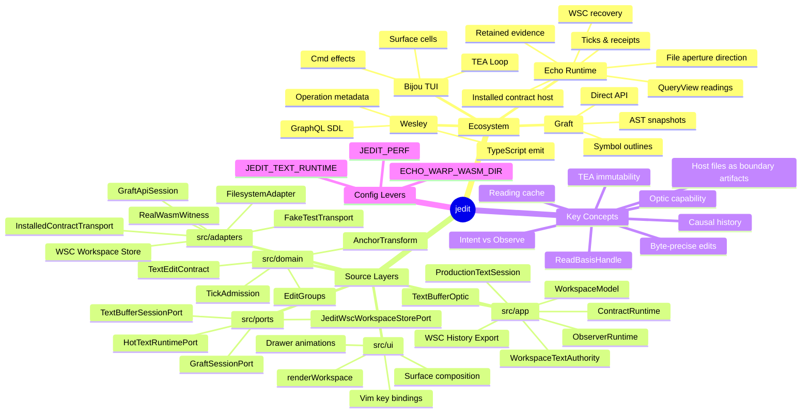

---

## 0. Domain Dictionary

These terms appear throughout the codebase with precise meanings that differ from everyday usage. Read this before diving into the code.

| Term                    | Definition                                                                                                                                                                                                                                   |
| ----------------------- | -------------------------------------------------------------------------------------------------------------------------------------------------------------------------------------------------------------------------------------------- |
| **Worldline**           | Echo's causal lane for admitted history. In jedit docs this usually means the causal coordinate that hosts a text-buffer contract session, not a mutable editor object.                                                                      |
| **Tick**                | One scheduler-owned unit of Echo progress. A keypress may propose an intent, but Echo decides whether and when that intent becomes a tick.                                                                                                   |
| **Rope**                | Contract vocabulary from the transitional jedit text schema. It describes byte-precise text structure for generated operations and fixture execution; it is not an Echo-core product noun.                                                   |
| **BufferRoot**          | Transitional hot-text runtime value naming a full text snapshot at a point in the contract fixture. Production UI code treats it as adapter/runtime detail.                                                                                  |
| **RopeHead**            | Transitional contract head coordinate for the text-buffer fixture path. Production app code should hide it behind `ReadBasisHandle`, readings, and authority posture.                                                                        |
| **Receipt**             | Machine-readable evidence for an Echo or jedit-contract operation outcome. Production receipts should correlate admitted intent, tick outcome, retained reading, or WSC evidence instead of acting as log lines.                             |
| **Intent**              | A request to perform a mutation. Application code submits intent material; Echo admission, scheduling, receipts, and retained evidence remain below the application boundary.                                                                |
| **Observe**             | A bounded read request. Unlike a raw string dump, an observation returns structured evidence: reading identity, basis/frontier posture, and retained-evidence posture when available.                                                        |
| **TextBufferOptic**     | The app-facing capability object for one text-buffer session. It is how jedit talks to the Echo-hosted text authority without exposing runtime coordinates to the UI.                                                                        |
| **ReadBasisHandle**     | An opaque capability token produced by the optic after buffer creation, mutation, or recovery. Application code passes it back to `textWindow()` to request a read. It cannot be forged or cloned.                                           |
| **Frontier**            | A causal marker for an observation. It identifies the point against which a reading was taken without giving UI code scheduler or tick authority.                                                                                            |
| **Reading Cache**       | Observation evidence from an Echo-backed text reading. It may be a window. It must carry coverage metadata before any code treats it as whole-document material.                                                                             |
| **Visible Projection**  | The full local text projection in `EditorState.lines`. It is used for rendering, cursoring, and transitional edit planning, but Echo/session authority owns causal text.                                                                      |
| **Edit Group**          | Product-level grouping of editing actions. The current local grouping/snapshot mechanics are transitional until undo and redo become explicit causal input.                                                                                  |
| **Checkpoint**          | A named posture marker created through the text session. It is useful for save/export evidence, but the UI does not get direct Echo checkpoint authority.                                                                                    |
| **Structural History**  | The product-layer taxonomy of text history events: revisions, replacements, edit groups, provenance, command status. It describes what the editor did above the generic Echo boundary.                                                       |
| **Optic**               | A general term for a capability-bounded view or interaction with runtime truth. jedit owns product optics; Echo owns generic admission, readings, receipts, and retention.                                                                   |
| **Transport**           | The byte-level I/O channel between the optic client and the Echo-hosted contract path. Production uses the installed jedit contract transport; fake and real-WASM paths are focused witnesses/fixtures.                                      |
| **Worldline Session**   | A `JeditWorldlineSession` bundle used by the transitional contract runtime and witnesses. It is not the long-term durable authority; WSC/WAL-backed Echo evidence is the durability boundary.                                                |
| **WSC Workspace Store** | jedit's adapter-private placement policy for generic Echo WSC envelopes under the workspace. It owns host paths; Echo owns generic envelope semantics.                                                                                       |
| **File Aperture**       | Echo-owned direction for treating host files as observed boundary artifacts and materialization targets. jedit should open arbitrary files normally while Echo owns causal observation, drift, and materialization evidence.                 |
| **Witness**             | A test script that exercises the full stack in a product-shaped way and records evidence. Witnesses are not unit tests — they are proofs that the seams work end-to-end. The `scripts/jedit-echo-witness.mjs` script is the primary witness. |
| **Footprint**           | The declared set of entity kinds an operation reads, writes, creates, and forbids. Encoded in the `@wes_footprint` SDL directive. Used by the Echo scheduler for conflict detection and admission control.                                   |
| **Surface**             | Bijou's 2D array of styled terminal cells. A `Surface` is the output of the `view` function — the entire terminal screen as a data value. Bijou diffs successive surfaces and emits ANSI escape sequences for only the changed cells.        |
| **Cmd**                 | A Bijou effect descriptor. `Cmd<Msg>` is an opaque value returned from `update` that Bijou executes asynchronously. When the async work completes, Bijou delivers a `Msg` back to `update`.                                                  |
| **TEA**                 | The Elm Architecture — a reactive pattern: `init` produces initial state, `update(Msg, Model)` produces new state and effects, `view(Model)` produces a rendered output. All state lives in the model; all change happens through messages.  |

---

## 1. What is jedit?

`jedit` is a **terminal UI text editor** rendered entirely within a terminal emulator. Run `npm run dev` and you get:

- A one-line header identifying the active file
- A main editor pane with Vim-shaped Normal/Insert modes, a growing motion and
  operator set, and explicit unsupported posture where production causal input
  does not exist yet
- Slide-out drawers for the file tree, Echo history, and a structural outline
  (Graft)
- A two-line footer with mode hints and workspace truth
- A Markdown preview lens over the active buffer
- A deterministic no-file title flow where Tab opens an animated
  current-directory startup file drawer, Escape opens quit confirmation when the
  drawer is closed, and `m`/`M` cycles named title material presets on the live
  ray-traced title scene

That description makes it sound like a standard terminal editor. What makes `jedit` architecturally interesting is its _purpose_: it is the **release gate** for a broader distributed runtime stack called **Echo**. The README states this philosophy plainly:

> _Product pressure determines architecture truth. The stack should advance when a real editor constraint forces a seam to become honest, not when an abstract protocol theory wants a place to land._

`jedit` doesn't just use Echo — it _proves_ Echo. Every edit intent it submits,
every bounded text reading it requests, every retained receipt it inspects, and
every WSC-backed recovery/export posture it reports is evidence that the
underlying causal runtime works from the perspective of a real product. This
shapes every architectural decision in the codebase.

The current production truth is narrower and more precise than earlier versions
of this teardown:

- The production TUI has no non-Echo text runtime mode.
- File open, edit planning, reading, render, save/export, and checkpoint flows
  route through jedit-owned ports backed by an Echo-hosted production text
  session.
- `EditorState.lines` is the full local visible projection cache used for
  rendering, cursoring, and transitional edit planning. It must not be
  reconstructed from bounded readings, and it is not saved or recovered as
  authority.
- Local undo/redo is intentionally blocked in the production path until undo is
  modeled as explicit causal input.
- WSC-backed persistence, startup recovery, current export, and historical
  export have active implementation slices. They are the durability bridge, not
  a replacement authority for Echo.
- Host files are ordinary user-facing files, but architecturally they are
  boundary artifacts: jedit owns path/UI policy, while Echo is expected to own
  causal observation, drift admission, and materialization evidence.

---

## 2. The Ecosystem — Bijou, Echo, Graft, Wesley

Four external systems surround `jedit`. Understanding their roles is prerequisite to understanding any code.

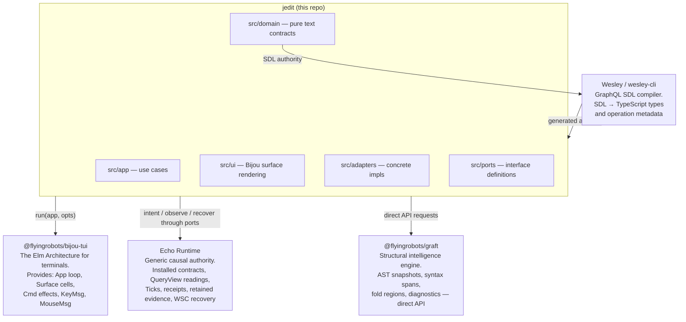

### Bijou

Bijou is an in-house TUI framework implementing **The Elm Architecture (TEA)** for terminals. It provides:

- An `App<Model, Msg>` interface with `init`, `update`, and `view`
- A `Surface` type — a 2D grid of styled cells (characters + ANSI color/style)
- `Cmd<Msg>` for scheduling asynchronous effects (filesystem reads, Graft API calls, timers)
- Terminal event decoding — raw bytes become typed `KeyMsg`, `MouseMsg`, or `ResizeMsg` values

The TEA pattern means the entire application state is a single immutable value. The `update` function is a pure function from `(Msg, Model) → [Model, Cmd[]]`. There are no mutable singletons. State change happens only through messages.

### Echo

Echo is the generic causal authority underneath the production text session.
It should not contain hardcoded text-buffer or editor nouns. jedit owns product
contracts, path policy, UI posture, and generated adapters; Echo owns generic
admission, scheduling, ticks, receipts, QueryView routing, retained evidence,
WAL/WSC recovery posture, and obstruction/fault posture.

Current jedit integration follows an app/host split:

- Application code submits jedit-owned intent material and bounded observe
  requests through ports.
- Trusted host/lifecycle code installs contract packages, starts or drains the
  runtime, and controls scheduler opportunities.
- Bounded readings return evidence posture instead of raw strings from a hidden
  mutable store.
- WSC-backed recovery/export work persists generic Echo evidence through a
  jedit adapter that owns workspace placement under `.jedit/`.
- The next architectural direction is Echo-owned file aperture semantics:
  opening a host file admits an observation or drift against a file coordinate;
  saving materializes authorized causal history back to the host filesystem.

### Graft

Graft is a structural intelligence engine — AST spans, fold regions, symbol outlines, diagnostics, rename previews, structural diffs. `jedit` reaches Graft through the direct `@flyingrobots/graft` API, treating it as an intelligent adapter rather than an editor kernel.

### Wesley

Wesley is the contract compiler. It reads **GraphQL SDL** files and emits the
modern TypeScript type definitions and operation metadata objects used by
`jedit`. The SDL files in `contracts/jedit/` are the canonical authority for
the data model; generated TypeScript in `src/generated/jedit/` is derived
output. Runtime validation for the transitional JSON transport is a separate,
app-owned boundary concern in `src/app/jedit-hot-text-json-schemas.ts`; it does
not define Wesley operation authority.

---

## 3. Entry Point: `src/main.ts`

```text
src/main.ts → createWorkspaceApp() → run(app, { mouse })
```

`main.ts` is deliberately thin — the entry point validates startup knobs,
initializes Bijou, constructs the app, and hands it to the TUI runner:

```typescript
// src/main.ts (abridged)
requireTextRuntimeProfile(
  parseTextRuntimeProfile(process.env["JEDIT_TEXT_RUNTIME"]),
);

initDefaultContext();

const app = createWorkspaceApp({
  initialColumns: process.stdout.columns ?? 100,
  initialRows: process.stdout.rows ?? 32,
  initialWorkingDirectory: process.cwd(),
  perfEnabled: envBoolean(process.env["JEDIT_PERF"]),
});

run(app, { mouse: JEDIT_TERMINAL_MOUSE_OPTIONS.mouse });
```

**`requireTextRuntimeProfile()`** validates `JEDIT_TEXT_RUNTIME` before Bijou
touches terminal raw mode. Unset and `echoHosted` are accepted. Any other value
is unsupported startup input.

**`initDefaultContext()`** initializes the Bijou TUI context — sets up raw terminal mode, ANSI output streams, signal handlers for `SIGTERM`/`SIGINT`.

**`textRuntimeProfile`** remains visible in the model as evidence posture, but
the production TUI has exactly one admissible value: `echoHosted`. There is no
non-Echo operating profile.

**`createWorkspaceApp()`** wires all adapters, constructs the initial model, and returns a Bijou `App` object. Crucially, it does not start anything — it returns a pure description of the application.

**`run(app, opts)`** hands the app object to Bijou, which owns the event loop from this point forward.

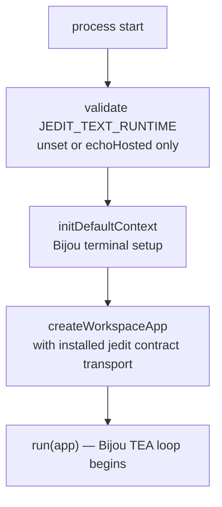

---

## 4. Bootstrapping vs. Runtime

It is worth drawing a hard line between what happens _once at startup_ and what happens _on every event_. Confusing these two phases is a common source of bugs in reactive apps.

### Bootstrap Phase (runs once)

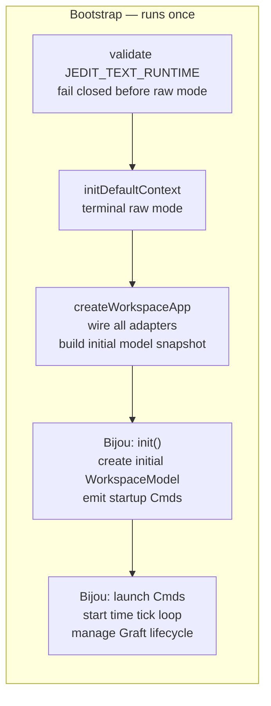

During bootstrap:

- The text runtime profile is locked to Echo-hosted production behavior.
- All port adapters are instantiated: `FileSystemPortAdapter`, `GraftSessionPort`, `SourceHighlighter`, `TitleSceneLoaderPort`.
- The initial `WorkspaceModel` is constructed from `createInitialModelSnapshot` — this snapshot picks the initial theme, seeds the title screen animation, sets up i18n, and chooses the initial working directory.
- Bijou calls `init()` on the workspace runtime, which returns `[initialModel, startupCmds]`. The startup commands include the time-tick loop and the Graft lifecycle manager.

Critically, **no I/O happens during bootstrap**. The filesystem, Graft API, and Echo transport are only touched _after_ Bijou begins executing commands from `init`.

### Runtime Phase (runs on every event)

The runtime phase is the steady state: Bijou delivers a message, `update` returns a new model and new commands, Bijou renders the new model and executes the commands. This cycle has no defined end — it runs until `SIGTERM`.

Key runtime invariants:

- **`update` is always synchronous and pure** — it never awaits anything. All async work is in `Cmd` closures.
- **The model is replaced, never mutated** — every field change produces a new object via spread (`{ ...model, field: newValue }`).
- **Commands are declarative** — returning a `Cmd` from `update` does not execute it immediately. Bijou decides when to run it.

---

## 5. Configuration and Environment Tuning

`jedit` currently has three environment variables relevant to runtime startup:

### `JEDIT_TEXT_RUNTIME`

Validates the text runtime posture. It no longer switches the text backend.

| Value         | Effect                                                                                                                        |
| ------------- | ----------------------------------------------------------------------------------------------------------------------------- |
| _(unset)_     | `echoHosted` default — installed jedit contract transport with no sibling checkout required. This is the production TUI path. |
| `echoHosted`  | Explicitly selects the same production text runtime as the unset default.                                                     |
| anything else | Unsupported startup input; the TUI fails before terminal raw mode.                                                            |

**Architectural implication**: Because the profile has only one production
value, there is no conditional logic in the app or domain layers about which
backend is running. The production `TextBufferOptic` path always uses the
installed jedit contract transport. Focused tests that need fake behavior
inject fake ports directly instead of selecting a runtime mode.

**Trade-off**: Removing the fixture profile gives up a convenient command-line
escape hatch, but it prevents runtime feature-flag drift and makes Echo
authority the only production story.

### `JEDIT_PERF`

Set to `1` to enable the performance overlay.

When enabled, `createPerfApp` wraps the workspace app in a decorator that tracks frame timing and renders a profiler HUD. The overlay shows frame time history as a spark line and live FPS.

Internally, `frameTimeHistory` in `WorkspaceModel` is an array of the last 50 frame times. The profiler reads this on every `TimeTick` message. Setting `JEDIT_PERF=0` (or leaving it unset) means the perf overlay never renders but `frameTimeHistory` still accumulates — the model always tracks frame times as a side effect of the time tick loop.

**Trade-off**: Always tracking frame times (even when the overlay is off) consumes a trivial amount of memory (50 numbers) but means the data is always available if you dynamically enable the overlay later. This is a minor "pay it anyway" cost for a useful debugging capability.

### `ECHO_WARP_WASM_DIR`

Only relevant for the opt-in real Echo WASM witness. Points at the directory containing Echo's compiled WASM module. Used exclusively by the witness scripts (`scripts/jedit-echo-witness.mjs`, `scripts/run-real-echo-wasm-stack-witness.sh`).

This variable is intentionally absent from the main app boot path — it is only read by the witness scripts that build and exercise the real Echo transport. This prevents accidental production dependency on a sibling repository checkout.

---

## 6. The Bijou TEA Runtime Loop

The Elm Architecture is the heartbeat of `jedit`. Everything flows through it.

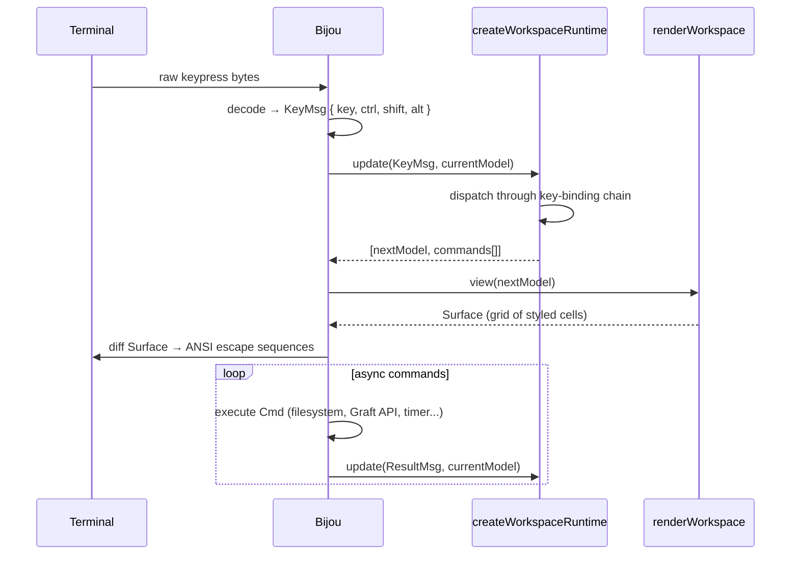

The three functions that `createWorkspaceRuntime` must implement:

| Function | Signature                       | Role                                                     |
| -------- | ------------------------------- | -------------------------------------------------------- |
| `init`   | `() → [Model, Cmd[]]`           | Construct the initial model and launch startup effects   |
| `update` | `(Msg, Model) → [Model, Cmd[]]` | Pure state transition — the entire application logic     |
| `view`   | `(Model) → Surface`             | Pure render — translate model into a terminal pixel grid |

A fourth function, `routeRuntimeIssue`, converts unhandled async errors into messages the update loop can handle gracefully (displaying a toast notification rather than crashing).

**Commands** (`Cmd<Msg>`) are the mechanism for side effects. They are opaque values returned from `update` that Bijou executes asynchronously. When complete, they produce a new message that re-enters the update loop. This means `update` is always pure — it never touches the filesystem, network, or terminal directly.

---

## 7. Concurrency and Asynchronous Flows

This section addresses the most common question from developers new to TEA: _how does a reactive immutable model handle concurrent async operations without race conditions?_

### The Key Insight: Sequential Update, Concurrent Effects

The `update` function processes **one message at a time**. Bijou's event loop is single-threaded (Node.js event loop). There is no possibility of two `update` calls running simultaneously.

However, multiple `Cmd` effects _can be in flight concurrently_. Consider what happens when a user opens a file:

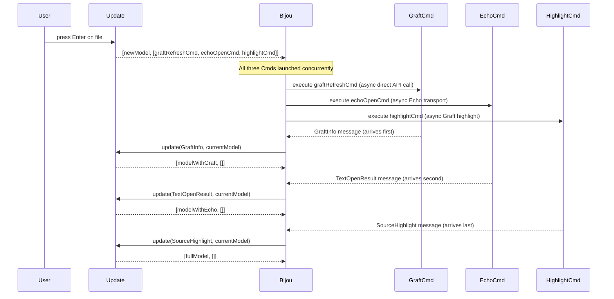

Each result message updates the model independently. If Graft responds before Echo, the model gets `graftInfo` first, then `textAuthority` when Echo responds. The model is always in a consistent partial state — there is no invalid intermediate state because each message is applied atomically.

### The Stale Request Problem and Request IDs

This concurrent design creates one subtle problem: what if the user opens a second file before the first Graft response arrives? The Graft response for file A arrives while file B is open.

`jedit` solves this with **request IDs**. Every async request that might arrive stale is tagged with an integer `requestId` stored in the model at dispatch time:

```typescript
// In WorkspaceModel
readonly graftRequestId: number;
readonly sourceHighlightRequestId: number;
readonly textRequestId: number;
```

When the result arrives, the update handler checks:

```typescript
function updateGraftInfoMessage(msg, model): WorkspaceRuntimeResult {
  return msg.requestId === model.graftRequestId
    ? [applyGraftInfo(model, msg.info), []] // fresh — apply it
    : [model, []]; // stale — drop it
}
```

If the request ID doesn't match, the message is silently discarded. No error, no state corruption — just a dropped stale response.

### The Time Tick Loop

`jedit` has a heartbeat: the time tick command emits a `TimeTick` message on every animation frame. This is how:

- Drawer animations advance (lerping progress from 0.0 to 1.0)
- The performance profiler samples frame times
- Notification toasts expire and fade

The tick command re-schedules itself on every invocation — it is a self-perpetuating loop. If the loop breaks (e.g., an unhandled error in a command), the entire UI freezes. This is a known fragility of self-scheduling command loops in TEA; the mitigation is `routeRuntimeIssue`, which converts errors into toast messages before they can escape the loop.

### What jedit Does NOT Have

- **No shared mutable state between Cmds** — each Cmd closure captures only the values it needs at dispatch time
- **No explicit mutex or lock** — the single-threaded event loop provides the serialization guarantee
- **No background threads** — Node.js single-threaded, all I/O is event-loop callbacks
- **No optimistic rollback** — if an Echo intent fails, the UI already rendered the edit (optimistic); a `RuntimeIssue` toast is shown but the `lines[]` state is not rolled back in the current design. This is a stated gap.

---

## 8. Hexagonal Architecture — The Five Layers

`jedit` enforces a strict hexagonal (ports-and-adapters) architecture. The dependency rule is absolute: dependencies point **inward only**.


**`src/domain`** — Pure runtime truth. No Node APIs, no Bijou, no JSON, no filesystem. Contains: `TextEditContract`, `EditGroupContract`, `TickAdmissionContract`, `SaveCheckpointContract`, `AnchorTransformContract`. These are the mathematical invariants of the text editing model. They could compile and run identically in a browser, Deno, or a Rust WASM host.

**`src/app`** — Use cases and orchestration over domain types. Depends on domain and ports; never on concrete adapters. Contains the workspace runtime, editor session logic, text buffer session, observer runtime, and contract runtime.

**`src/ports`** — Interface definitions only. A port describes a typed runtime contract; it never decodes raw payloads. Examples: `HotTextRuntimePort`, `TextBufferSessionPort`, `FileSystemPort`, `GraftSessionPort`, `SourceHighlighter`.

**`src/adapters`** — Concrete implementations. Raw strings, JSON bytes, and Graft API payloads are decoded _here_ and _only here_. Contains: the installed jedit contract transport, the fake transport used by focused tests, the real Echo WASM witness client, the filesystem adapter, Graft direct API session, source highlighter.

**`src/ui`** — Presentation and input mapping. UI translates Bijou events into app commands and renders app state into `Surface` cells. It does not own business rules.

### Why This Matters in Practice

The separation is enforced by convention, not by a module bundler boundary. The benefit is demonstrated by the transport design: the production app always runs through the installed jedit contract transport, while focused fixture tests can inject fake ports without any modification to `src/app` or `src/domain`. There is no production runtime profile switch.

---

## 9. External Dependencies and Borders

This section maps precisely where `jedit`'s code ends and another system's code begins.

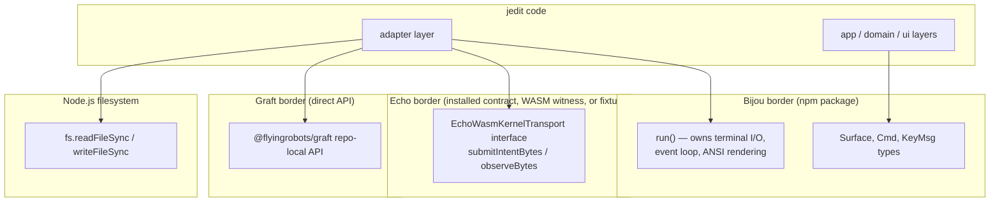

### The Bijou Border

**Where**: `src/adapters/workspace-app.ts` calls `run(app, opts)`. From that point, Bijou owns the terminal.

**What crosses the border**: The `App<WorkspaceModel, WorkspaceMsg>` object — a plain JavaScript object with three functions. Bijou never holds a reference to any jedit internal type; it only calls `init`, `update`, and `view` through that interface. The `Surface` type that `view` returns is a Bijou type, but it is a pure data object (no methods, no callbacks).

**What jedit cannot control past this border**: Terminal resize events arrive via Bijou's own signal handler. The ANSI diffing algorithm is internal to Bijou. The raw keystroke byte decoding is internal to Bijou.

### The Echo Border

**Where**: `src/adapters/installed-jedit-contract-echo-transport.ts` (default production session seam), `src/adapters/fake-echo-jedit-optic-transport.ts` (focused test fixture path), and `src/adapters/echo-wasm-kernel.ts` (opt-in WASM witness path). The border is the `EchoWasmKernelTransport`/transport-seam shape: byte calls plus any explicitly exposed session port needed by the production text session.

**What crosses the border**: `Uint8Array` in, `Uint8Array` out. No JavaScript objects, no shared memory, no callbacks. The byte arrays are JSON-encoded intent requests and observe requests.

**Why bytes at the border**: WASM modules communicate via linear memory. When the Echo WASM witness calls into the WASM module, it passes a pointer and length into WASM linear memory, gets back a pointer and length. The installed-contract and fake test transports use the same `Uint8Array` interface to keep the codec layer honest — the same boundary decoding rules run in production and focused tests.

**What jedit cannot control past this border**: Echo admission, scheduler
opportunities, tick outcomes, retained evidence posture, and recovery/fault
posture. jedit owns product contracts and presentation; it does not own Echo
runtime causality.

### The Graft Border

**Where**: `src/adapters/graft-api-session.ts`. Graft runs in-process through the `@flyingrobots/graft` direct API. `jedit` keeps Graft behind `GraftSessionPort`, but it does not launch a repo-local child process for editor-local enrichment.

**What crosses the border**: A repo-local API call with `{ path }` → Graft tool-shaped output for `file_outline` and `graft_diff`, decoded into `GraftInfo`. Unsaved edits are not sent to Graft; when the editor buffer is dirty, the drawer reports that it reflects the saved file only.

**Failure mode**: If the Graft API refuses, cannot parse, or fails a structural query, the adapter returns an empty drawer payload with an error line. The editor continues to work — Graft is enrichment, not load-bearing.

### The Filesystem Border

**Where**: `src/adapters/filesystem.ts` (directory listing) and `src/adapters/editor-file.ts` (file read/write).

**What crosses the border**: Raw `Buffer` bytes for file content. The adapter is responsible for:

- Detecting binary files (null byte presence)
- UTF-8 decoding
- Line ending normalization (`\r\n` → `\n`)
- Encoding back to bytes on save

Domain code never touches the filesystem. App code uses the `EditorFilePort` and `FileSystemPort` interfaces. The concrete Node.js `fs` calls are isolated in these two adapter files.

---

## 10. The Central State: `WorkspaceModel`

The entire application state lives in a single `WorkspaceModel` record. Because Bijou TEA requires pure functions, this object is **never mutated in place** — every update returns a new object via spread.

> **Live UI State: `WorkspaceModel`**
> All live UI and orchestration state lives in this object, in JavaScript heap
> memory. Cursor position, focus, drawer animation progress, notifications,
> selected files, title-flow state, and the current reading cache are model
> fields. Production text authority is represented by `textAuthority` posture
> and session capabilities; it is not the mutable `lines[]` cache. Durable
> editing evidence is moving through Echo/WSC recovery/export paths, not a
> jedit-owned causal ledger.

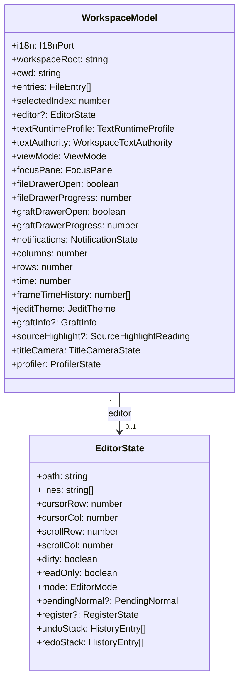

### Notable Fields

**`editor?: EditorState`** — The `?` is significant. When no file is open, `editor` is `undefined` and the workspace shows the animated title screen. The title screen is not a separate route — it is just the absent-editor state. This elegantly avoids a `page`/`route` concept entirely.

**`textAuthority: WorkspaceTextAuthority`** — The workspace posture for Echo-hosted text authority. It tracks which buffer is backed by the production text session, the `bufferId`, the latest reading cache, and the current obstruction/export/checkpoint posture. `EditorState.lines` remains the full local visible projection cache, not production text authority.

**`fileDrawerProgress / graftDrawerProgress`** — Floating-point animation state (`0.0` to `1.0`). The layout engine reads these on every frame to calculate drawer pixel widths. Partial values produce the slide-open animation. Animation is data, not code.

**`undoStack / redoStack` (inside `EditorState`)** — Full local snapshots used
by the legacy editor helper path and focused fixture tests. In the production
Echo-hosted path, hidden local undo/redo is blocked until undo can be submitted
as explicit causal input.

---

## 11. The Message Dispatch Pipeline

The `update` function dispatches through a priority chain. Each handler returns `[model, cmds]` or `undefined` (meaning "pass to the next handler").

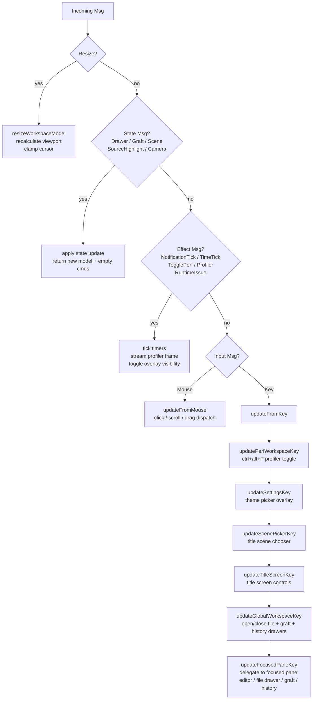

The priority chain is architectural policy encoded as code order. `updatePerfWorkspaceKey` is first — the profiler toggle must always work, even if the editor has swallowed key focus. Overlays (`updateSettingsKey`, `updateScenePickerKey`) intercept before global workspace commands because an open overlay should capture all input. The focused pane is last because it handles only keys that nothing else claimed.

---

## 12. The Vim Editor Layer

### Mode State Machine

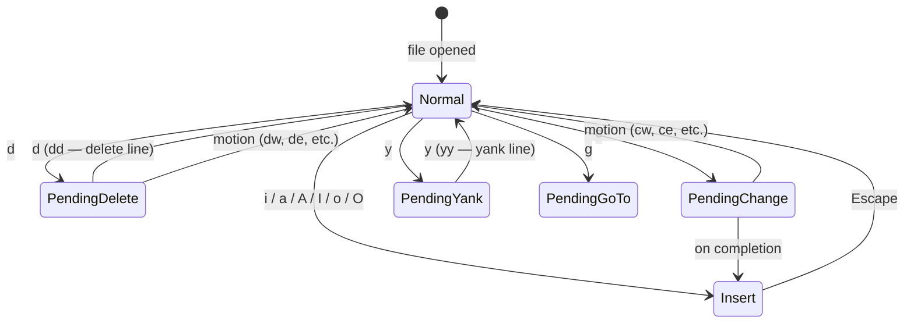

The `EditorState.pendingNormal` field stores `'d'`, `'c'`, `'y'`, or `'g'` while waiting for the second key. When the second key arrives, `applyPendingOperator` resolves the full command.

### Command Dispatch by Descriptor String

Normal-mode commands are a static table of `{ key, ctrl?, shift?, run }` records. Matching uses a descriptor string:

```text
descriptor = `${key}|${ctrl?'1':'0'}|${alt?'1':'0'}|${shift?'1':'0'}`
```

This is O(n) over ~25 entries but keeps the command table declarative. An example excerpt:

```typescript
const NORMAL_COMMANDS: readonly NormalCommandDefinition[] = [
  { key: "i", run: (e) => ({ ...e, mode: "insert" }) },
  { key: "a", run: (e) => enterInsertAfterCursor(e) },
  { key: "A", shift: true, run: (e) => enterInsertAtLineEnd(e) },
  { key: "w", run: (e) => moveCursorToNextWordStart(e) },
  { key: "u", run: (e) => undo(e) },
  { key: "r", ctrl: true, run: (e) => redo(e) },
  // ...
];
```

The `run` functions are pure: `(EditorState, viewport) → EditorState`. They never cause side effects.

### Vim Command-Line And Completion Surface

Vim command-line mode is workspace state, not editor-buffer state. Pressing `:`
in Normal mode opens `WorkspaceModel.commandLine`, captures printable input,
Escape cancellation, arrow selection, Tab acceptance, and Enter dispatch before
focused-pane editor keys can interpret those events. Title-screen Browse mode is
also allowed to enter this command line so no-file startup has the same command
surface as an opened buffer.

The command registry lives in `src/app/workspace/command-completion.ts` and is
the source of command completion labels for `edit`, `write`, `quit`, and `wq`
plus their aliases. Details are catalog-backed through the i18n port, so the
footer and popup copy do not keep hardcoded UI strings beside dispatch logic.
Unknown command fragments are validated by
`src/app/workspace/command-line-validation.ts`; invalid text is rendered by
`src/ui/workspace-command-line-footer.ts` with the theme error posture and the
localized "type :help" guidance.

Dispatch is separate from suggestion. `src/app/workspace/command-line-dispatch.ts`
translates accepted command text into existing workspace behavior:

- `:edit <path>` opens through `createWorkspaceTextOpenCmd`, the same
  Echo-backed production text authority used by the file drawer.
- `:write` and `:w` call the existing save path, preserving dirty-state and
  text-authority posture.
- `:quit` and `:q` route through normal quit confirmation instead of bypassing
  unsaved-change checks.
- `:wq` and `:x` write first and then request the same quit posture.

Completion providers produce provider-neutral inline completion items. Command
completion is one provider; `:edit <prefix>` swaps to file completions from the
workspace directory; `src/app/workspace/editor-completion.ts` defines the editor
completion registry seam; and `src/app/workspace/graft-symbol-completion.ts`
proves Graft-backed symbol suggestions can use the same
`src/ui/inline-completion-popup.ts` renderer. The renderer understands command,
file, directory, documentation, source-definition, causal-history, and
unavailable preview postures without importing Graft or filesystem details.

This leaves three intentionally distinct file-opening surfaces:

- Vim command mode is the primary type-to-open surface.
- `ctrl+b` remains the standard browsable file drawer for explicit navigation.
- The startup title drawer remains a non-filtering current-directory affordance,
  but it no longer owns printable type-to-search input.

### Undo/Redo

Undo and redo currently have two different postures:

- Legacy editor helpers still contain snapshot-based undo/redo for fixture and
  non-production editing helpers.
- The production Echo-hosted path does not allow hidden local undo/redo to
  mutate text authority. Pressing history keys must either submit explicit
  causal input or return an honest unsupported/obstructed posture.

That distinction is deliberate. The long-term design is Echo-backed causal
history for undo semantics, where undo is an authored inverse operation with
evidence. Until that contract exists, local snapshot stacks cannot pretend to
be production truth.

### UTF-8 Dual-Track Awareness

Insert mode builds on jedit-owned edit planning over displayed text positions.
The production text path works in **byte offsets** —
`byteOffsetForTextPosition` converts `{ row, column }` to a UTF-8 byte offset
before submitting to the text runtime. Planning uses the full local visible
projection; bounded readings may refresh observation evidence, but they must
not replace the whole editor unless coverage proves a full projection.

---

## 13. The Rendering Pipeline

Every frame, Bijou calls `view(model)` → `renderWorkspace(model)`.

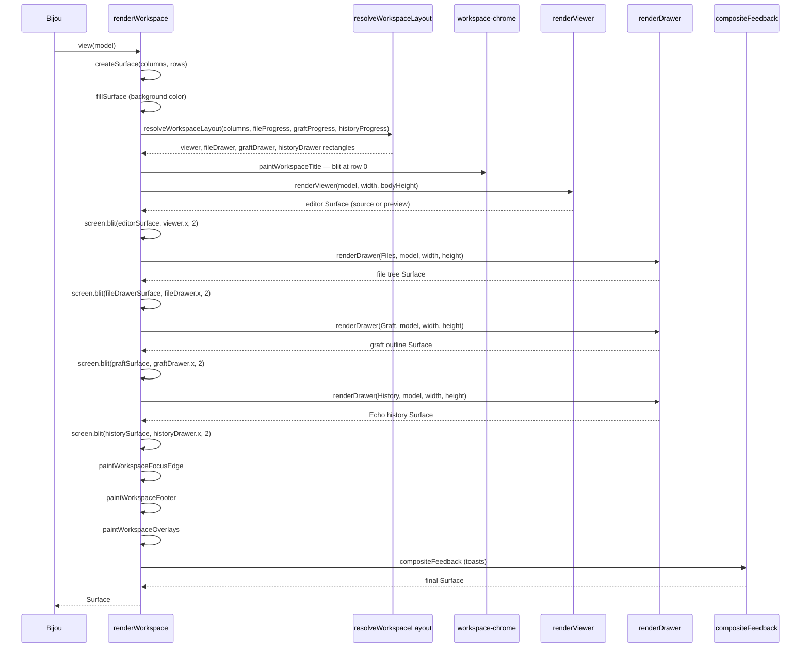

### Layout as Pure Math

`resolveWorkspaceLayout` maps terminal columns plus file, Graft, and Echo
History drawer progress values to pixel rectangles. The animation is implicit —
the layout function is called every frame, and the progress values in the model
are incremented by animation `Cmd`s over time. There is no "animation system" —
the animation is just model state advancing on a timer.

### Surface Composition via `blit`

A `Surface` is a 2D array of styled cells. `screen.blit(source, x, y)` copies cells from `source` into `screen` at position `(x, y)`. The final `renderWorkspace` result is one fully composed `Surface` representing the entire terminal frame. Bijou diffs this against the previous frame and emits only the ANSI sequences for changed cells.

### The Markdown Preview Lens

When `viewMode === ViewModes.Preview` and the active file is `.md`, `renderViewer` calls `renderMarkdownPreview`. This is a deliberately minimal text transform:

- `# Heading` → `HEADING` (uppercased, stripped of `#`)
- `- item` / `* item` → `• item`
- `> quote` → `│ quote`
- Fenced code blocks → blank lines

No Markdown parser is imported. The lens is zero-dependency, fast, and correct enough for the current goal. Richer preview fidelity is on the roadmap.

---

## 14. The Text Editing Domain — Three Pure Contracts

The `src/domain/` layer has **zero external dependencies**. These files contain the mathematical core of the text model and could run identically in a browser, Node.js, or a Rust-compiled WASM module.

### Contract 1: `TextEditContract` — UTF-8 Byte-Precise Rope Operations

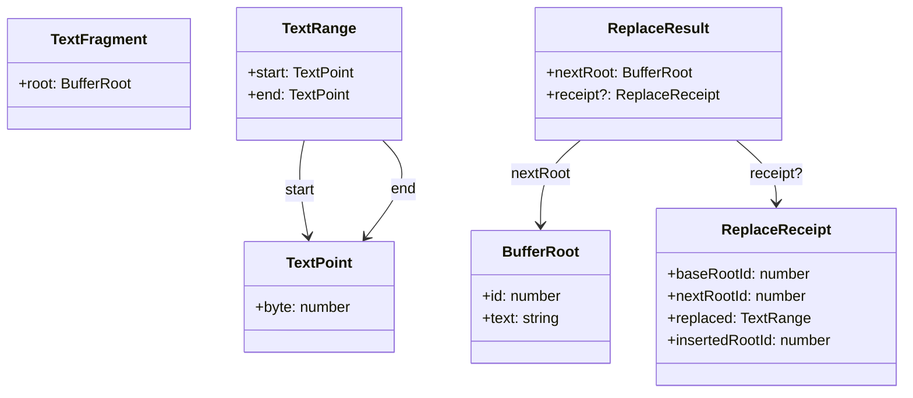

`replaceRange(baseRoot, range, fragment)` is the single most important function in the domain:

1. UTF-8 encode `baseRoot.text` → `Uint8Array`
2. Validate range: `start.byte <= end.byte`, both within `[0, byteLength]`
3. **Validate UTF-8 boundaries**: attempt `decodeText` on the sub-arrays `[0..start]` and `[end..]`. A split in the middle of a multi-byte character causes `decodeText` to throw; the contract re-throws as `TextEditContractError(REPLACE_RANGE_ERROR_INVALID_UTF8_BOUNDARY)`.
4. **No-op detection**: byte-compare the to-be-replaced region against the insertion bytes. If identical, return `{ nextRoot: baseRoot }` with no receipt — no tick is generated, no history entry created.
5. Concatenate prefix + inserted + suffix into a new `BufferRoot` with the next globally-incrementing `id`.
6. Return `{ nextRoot, receipt }` with full provenance.

The no-op detection is a clever optimization: pressing `x` on an empty line would otherwise generate a tick, an undo entry, and a dirty flag — all for doing nothing. The contract suppresses this at the lowest level.

### Contract 2: `TickAdmissionContract` — Ordered Admitted Rewrites

The contiguity invariant is strict: tick IDs must be dense integers (`1, 2, 3, …`). No gaps. The `currentRoot.id` must match the `rootId` of the most recently admitted tick.

```text
admitReplaceRangeTick :: (TickAdmissionState, TextRange, TextFragment) → TickAdmissionResult
```

This invariant is what makes the tick sequence a **causal chain** rather than an unordered bag of edits. Because each tick's `rootId` matches the next tick's `currentRoot`, you can replay any prefix of the tick sequence and arrive at a deterministic intermediate state.

### Contract 3: `EditGroupContract` — Undo Unit Management

Edit groups map ticks to product-level undo actions. One keystroke → one open group → one close → one group receipt.

```text
openEditGroup → [includeTickInOpenGroup × N] → closeEditGroup → EditGroupReceipt?
```

Closing an empty group is a no-op (no receipt). This handles the case where a keystroke motion (e.g., `w` to move forward a word) opens a group but produces no text change tick — the group is silently discarded.

---

## 15. Anatomy of a Payload

This section shows exactly what data looks like as it moves through the system.

### Payload A: Intent Request (app → transport)

When the user types `h` in a buffer that currently contains `ello`:

```json
{
  "kind": "jedit.intent-request",
  "operationName": "replaceRangeAsTick",
  "input": {
    "worldlineId": "wl:1",
    "baseHeadId": "hd:1",
    "startByte": 0,
    "endByte": 0,
    "insertText": "h",
    "author": "jedit-text-buffer-optic"
  },
  "session": {
    "worldline": {
      "worldlineId": "wl:1",
      "bufferKey": "src/main.ts",
      "canonicalHeadId": "hd:1",
      "projectionPath": "src/main.ts",
      "createdAtRopeRewriteId": null
    },
    "state": {
      "path": "src/main.ts",
      "currentRoot": { "id": 1, "text": "ello" },
      "roots": [{ "id": 1, "text": "ello" }],
      "ticks": [],
      "editGroups": [],
      "openEditGroup": null,
      "checkpoints": [{ "id": 1, "rootId": 1, "path": "src/main.ts" }]
    },
    "tickMetadata": [],
    "checkpointMetadata": [{ "checkpointId": 1, "kind": "INITIAL" }]
  }
}
```

**Notable**: This is the legacy/fake payload shape, where the entire buffer
state can travel with the request so a stateless fixture transport can derive
execution context. The production installed-contract seam resolves session
state through a shared session port and should continue moving away from
shipping full mutable context as request payload.

### Payload B: Intent Response (transport → app)

```json
{
  "status": "OK",
  "operationName": "replaceRangeAsTick",
  "execution": {
    "nextSession": {
      "worldline": {
        "worldlineId": "wl:1",
        "bufferKey": "src/main.ts",
        "canonicalHeadId": "hd:2"
      },
      "state": {
        "path": "src/main.ts",
        "currentRoot": { "id": 2, "text": "hello" },
        "roots": [
          { "id": 1, "text": "ello" },
          { "id": 2, "text": "hello" }
        ],
        "ticks": [{ "id": 1, "rootId": 2 }],
        "editGroups": [],
        "checkpoints": [{ "id": 1, "rootId": 1, "path": "src/main.ts" }]
      },
      "tickMetadata": [{ "tickId": 1, "kind": "REPLACE_RANGE_AS_TICK" }],
      "checkpointMetadata": [{ "checkpointId": 1, "kind": "INITIAL" }]
    },
    "worldline": { "worldlineId": "wl:1", "canonicalHeadId": "hd:2" },
    "nextHead": {
      "headId": "hd:2",
      "worldlineId": "wl:1",
      "rootNodeId": "root:2",
      "byteLength": 5,
      "lineCount": 1,
      "utf16Length": 5,
      "equivalenceDigest": "sha256:2cf24dba5fb0a30e26e83b2ac5b9e29e1b161e5c1fa7425e73043362938b9824"
    },
    "ropeRewrite": {
      "ropeRewriteId": "rw:1",
      "worldlineId": "wl:1",
      "kind": "REPLACE_RANGE_AS_TICK",
      "sequenceNumber": 1
    },
    "ropeDiff": {
      "ropeDiffId": "rd:1",
      "ropeRewriteId": "rw:1",
      "baseHeadId": "hd:1",
      "nextHeadId": "hd:2",
      "rewriteKind": "REPLACE_RANGE_AS_TICK",
      "startByte": 0,
      "endByte": 0,
      "insertedByteLength": 1,
      "deletedByteLength": 0,
      "inverseFragmentDigest": null,
      "summary": "replace 0..0"
    }
  }
}
```

**Notable**: The `ropeDiff` includes `inverseFragmentDigest` — the hash of the bytes that were deleted. When content is deleted, this field holds the hash of the removed fragment. This is how undo-as-inverse-history will work: the inverse operation can verify it is reversing the correct edit by checking the digest before applying.

### Payload C: Observed Text Window (transport → app)

After a `textWindow` observe call, the envelope returned:

```json
{
  "status": "OK",
  "operationName": "textWindow",
  "envelope": {
    "frontierRef": "frontier:text-buffer-optic:src/main.ts",
    "readingId": "reading:1",
    "receiptId": "receipt:rw:1",
    "retainedEvidence": {
      "kind": "retained-evidence-inventory",
      "retainedRefs": [],
      "posture": "missing_retention"
    },
    "reading": {
      "worldline": { "worldlineId": "wl:1", "canonicalHeadId": "hd:2" },
      "head": { "headId": "hd:2", "byteLength": 5, "lineCount": 1 },
      "readingId": "reading:1",
      "startLine": 0,
      "lineCount": 1,
      "totalLineCount": 1,
      "hasMoreBefore": false,
      "hasMoreAfter": false,
      "lines": [
        { "lineNumber": 0, "text": "hello", "startByte": 0, "endByte": 5 }
      ]
    }
  }
}
```

**Notable**: The `posture: "missing_retention"` field is an explicit statement
that this particular observation did not carry retained refs. Current WSC
history, export, and replay witnesses cover durable evidence where those
surfaces are installed. The important invariant is honesty: absence of retained
material must be explicit rather than implied by missing fields.

---

## 16. The Hot Text Runtime Adapter

`createFullSnapshotHotTextRuntimeFixture()` implements `HotTextRuntimePort` by composing the three domain contracts into a stateful full-snapshot fixture.

> **Transitional Runtime Fixture: `HotTextBufferState`**
> The hot text runtime remains the local executor for contract-runtime fixtures,
> fake transport tests, and witness scaffolding. It is not the production TUI
> authority. Production opens, edits, readings, saves, checkpoints, and recovery
> posture route through the Echo-hosted production text session and WSC
> recovery/export evidence where available.

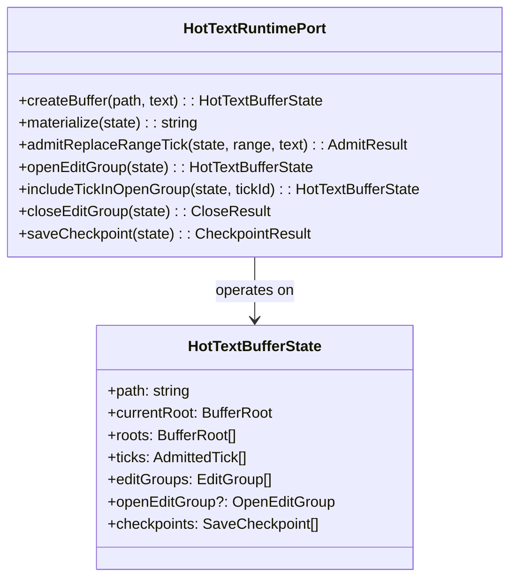

The adapter is **functionally stateless** — it is a collection of pure
functions. State is owned by the caller (`JeditWorldlineSession`) and passed in
on every call. This is useful for tests and fixtures because any constructed
state can be exercised without setup/teardown. Production code should not infer
durable causal authority from this object.

The extraction pattern:

```typescript
function toTickAdmissionState(state: HotTextBufferState): TickAdmissionState {
  return createTickAdmissionState(state.currentRoot, state.ticks);
}
```

This appears for every domain contract the adapter composes. It is verbose but explicit — there is never ambiguity about which contract is being invoked with which subset of state.

---

## 17. The TextBufferOptic — The Capability Boundary

The `TextBufferOptic` is the most architecturally significant abstraction in
`jedit`. It is the interface through which application code accesses text
buffers. App code may replay opaque Jim rope-head IDs returned by operations so
every materialization names its causal basis. It never derives those IDs or
receives raw worldline and Echo substrate coordinates.

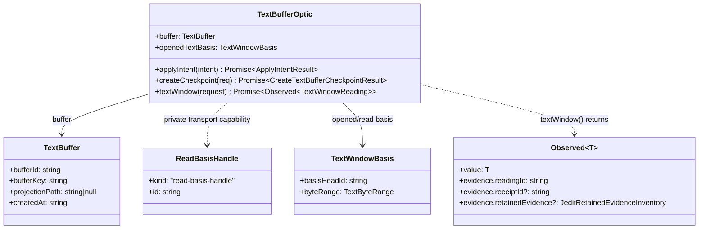

### The `Observed<T>` Generic — Evidence-Bearing Reads

`textWindow` returns `Observed<TextWindowReading>` rather than a bare `TextWindowReading`. The `evidence` field carries the causal provenance of the reading: which head it was taken against, which tick receipt was current, and what the retention posture is. This makes every visible reading **auditable** — you can ask "why does the screen show this?" and get a traceable answer back to the specific tick that produced it.

---

## 18. Security Boundaries and Auth Flows

`jedit` is a local desktop tool, not a multi-user server. Its "security" concerns are about **authority separation** — ensuring that application code cannot acquire capabilities it was not granted, and that Echo substrate coordinates cannot be manufactured by app-layer code.

### Capability 1: `ReadBasisHandle` — Object Identity as Authorization

A `ReadBasisHandle` is `{ kind: "read-basis-handle", id: string }`. The optic
holds one internally and passes it through the transport when it executes
`textWindow()`. Product code supplies a separate explicit `TextWindowBasis`;
the handle is capability plumbing, not causal history. Inside
`ReadBasisHandleRegistry`:

```typescript
// In ReadBasisHandleRegistry (src/app/read-basis-handle-registry.ts)
private readonly bindings = new WeakMap<ReadBasisHandle, ReadBasisBinding>();

public createForSession(session: JeditWorldlineSession): ReadBasisHandle {
  const handle = Object.freeze({ kind: READ_BASIS_HANDLE_KIND, id: `read-basis:${this.nextHandleId}` });
  this.bindings.set(handle, { worldlineId: session.worldline.worldlineId });
  return handle;
}

public resolveWorldlineId(session: JeditWorldlineSession, handle: ReadBasisHandle): string {
  const binding = this.bindings.get(handle);
  if (binding === undefined || binding.worldlineId !== session.worldline.worldlineId) {
    throw new ReadBasisHandleResolutionError();
  }
  return binding.worldlineId;
}
```

**Why `WeakMap`**: A `WeakMap` is keyed on _object identity_ — the exact same JavaScript object reference, not a value that equals it. You cannot forge a handle by constructing `{ kind: "read-basis-handle", id: "read-basis:0" }` — that is a _different object_ and will not exist in the map. The handle is unforgeable and unclonable by construction. This is a rare case where JavaScript's reference semantics are used as an access-control mechanism.

**Why `Object.freeze`**: The handle is frozen so it cannot be mutated after creation. App code cannot write to `handle.id = 'something-else'` to try to match a different binding.

### Capability 2: App / Host Authority Split

The Echo integration enforces a hard separation between **application authority** and **trusted host authority**:

| Application code (`jedit` app layer) | Trusted host code (lifecycle adapter) |
| ------------------------------------ | ------------------------------------- |
| Submit edit intents                  | Install Echo packages                 |
| Observe text windows                 | Start/stop the Echo runtime           |
| Create checkpoints                   | Control the scheduler                 |
| Hold `ReadBasisHandle`               | Fault recovery                        |

Application code can call `submitIntentBytes` and `observeBytes`. It cannot call lifecycle methods that control the scheduler or runtime. The lifecycle adapter lives in `src/adapters/echo-runtime-lifecycle.ts` and is wired by `workspace-production-text-session.ts` at app construction time — not accessible through any port that application code holds.

This mirrors how operating systems separate user space from kernel space. The Echo runtime is the "kernel"; the lifecycle adapter is the trusted supervisor; `jedit` application code is user space.

### Capability 3: JSON Boundary Validation

The adapter layer is the only place external JSON data is trusted. Every byte
array entering through the transitional Echo JSON transport is decoded and
validated before domain code consumes it. The app-owned schemas are typed
against the modern Wesley artifact, but they are protocol guards rather than a
second generated contract. Any schema violation throws at the adapter boundary.

This means the domain contracts' invariant checks (contiguous tick IDs, positive root IDs, etc.) are safety-net validations, not primary defenses. The primary defense is at the codec layer.

---

## 19. The Echo Transport Architecture

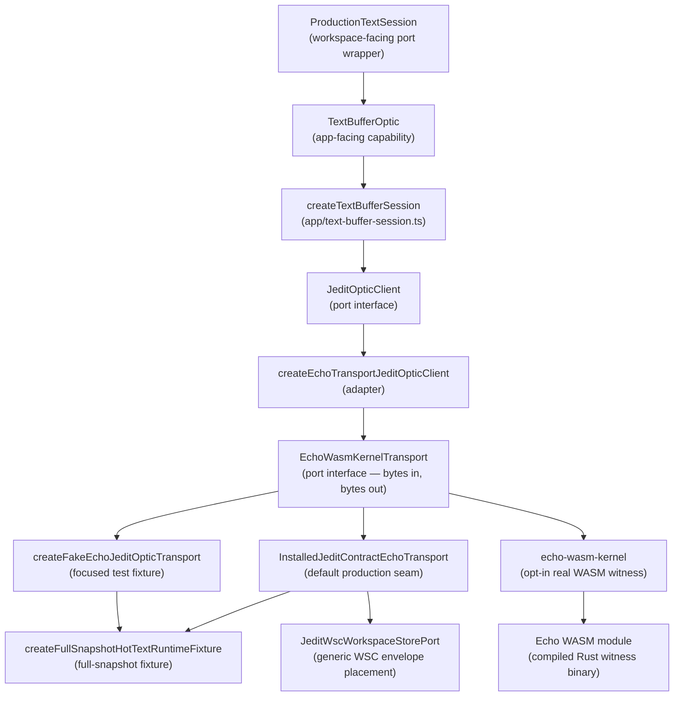

### `EchoWasmKernelTransport` — The Byte-Level Interface

```typescript
interface EchoWasmKernelTransport {
  kernelInfo(): EchoKernelInfo;
  submitIntentBytes(intentBytes: Uint8Array): Uint8Array;
  observeBytes(requestBytes: Uint8Array): Uint8Array;
  schedulerStatusBytes(): Uint8Array;
}
```

Every call is **bytes in, bytes out**. This interface mirrors the real WASM ABI:
WASM modules receive and return linear memory slices, not JavaScript objects.
Using `Uint8Array` at this boundary means the codec is exercised under the same
conditions as real WASM I/O. The installed-contract and fake transports also
use bytes so production and focused tests traverse the same validation layer.

The important architectural distinction: the installed-contract transport is
the production TUI seam, but its current executor still uses the transitional
hot-text runtime behind installed package/handler boundaries. The product code
must treat only the `ProductionTextSession`, readings, receipts, and recovery
posture as authority.

### The Intent/Observe Split

Echo separates writes from reads at the protocol level:

- **Intent** (`submitIntentBytes`) — mutations: `createBufferWorldline`, `replaceRangeAsTick`, `createCheckpoint`
- **Observe** (`observeBytes`) — queries: `worldlineSnapshot`, `textWindow`

This split reflects the Echo scheduler model. Intent admission requires scheduler authorization. Observations are reads against already-admitted state. Separating at the byte level makes the authorization boundary explicit in the protocol, not just in documentation.

---

## 20. The Codec Layer — JSON Serialization and Zod Validation

`src/adapters/jedit-echo-optic-codec.ts` is the only place `JSON.stringify` and `JSON.parse` happen for the Echo transport. It is the sole I/O boundary between typed objects and wire bytes.

### Decoding Pipeline

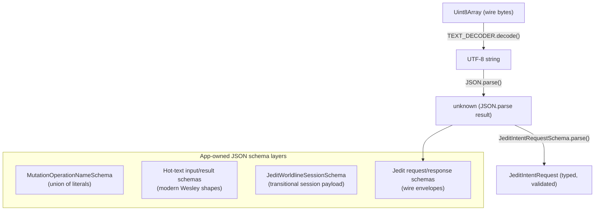

The Zod schemas enforce integer fields, literal operation names, and typed
collections. The hot-text input/result guards live in
`src/app/jedit-hot-text-json-schemas.ts` and are compiled against the modern
Wesley types. A malformed payload throws `ZodError` at the adapter boundary,
converted to a `RuntimeIssue` toast by `routeRuntimeIssue`.

### Encoding: JSON now, Binary Later

The current wire format is human-readable JSON. The README notes these are "fixture bytes — human-readable scaffolding, not the durable Wesley runtime codec." The `src/codec.ts` file at the repo root already implements a little-endian binary reader/writer (`Writer`, `Reader`) for the eventual migration to Wesley-generated binary codecs. The migration path is: keep the codec interface identical (`Uint8Array` in/out), replace the JSON body with binary-encoded fields. No other layer needs to change.

---

## 21. Unhappy Paths and Error Handling

The system defines failure at four distinct levels. Here is what happens at each.

### Level 1: Domain Contract Violation

A domain contract error is a _programming error_ — it means a caller passed invalid arguments (e.g., a non-contiguous tick ID, a byte range that splits a UTF-8 sequence). These throw typed errors:

- `TextEditContractError(code, message)` — invalid range, out of bounds, invalid UTF-8 boundary
- `TickAdmissionContractError(code, message)` — non-contiguous tick IDs, root mismatch
- `EditGroupContractError(code, message)` — invalid group state, unknown tick

These errors are never caught silently. They propagate up to the fake transport's `executeIntent` function, which catches them and returns a `OBSTRUCTED` response with `code: 'JEDIT_CONTRACT_RUNTIME_ERROR'`.

### Level 2: Transport Obstruction (`OBSTRUCTED` status)

The transport can return an `OBSTRUCTED` response for any operation:

```json
{
  "status": "OBSTRUCTED",
  "operationName": "replaceRangeAsTick",
  "obstruction": {
    "code": "BASE_HEAD_MISMATCH",
    "message": "The supplied baseHeadId does not match the worldline's current canonical head.",
    "recovery": "refresh reading and retry",
    "worldlineId": "wl:1",
    "requestedBaseHeadId": "hd:1",
    "currentHeadId": "hd:3"
  }
}
```

The `BASE_HEAD_MISMATCH` case is the most important — it means two edits raced. The user typed something, a concurrent process also changed the buffer, and the base head the app submitted is now stale. The `recovery` field is a human-readable hint; the app layer translates this into a `RuntimeIssue` toast.

**Current production behavior on obstruction**: The app records an explicit
obstructed text-authority posture and routes the issue to a runtime toast. A
cache update that cannot be supported by a receipt or fresh reading must not be
treated as production text authority. Recovery requires a new explicit user or
command action against a fresh basis.

### Level 3: Codec / Protocol Error

`decodeJeditIntentRequest` throws `InvalidJsonPayloadError` if the bytes are not valid UTF-8 JSON, or `ZodError` if the JSON doesn't match the schema. These indicate a protocol mismatch — the sender and receiver disagree on the wire format.

In the fake transport these errors should be impossible (the same process encodes and decodes). In the real WASM transport they indicate a version mismatch between `jedit` and the Echo WASM module. The error propagates as a `RuntimeIssue`.

### Level 4: External Capability Failure

**Graft API failure**: The Graft adapter catches structural-query failures and converts them to a `GraftInfo` with empty content plus an error. The graft drawer shows the failure posture. The editor continues to work normally — structural intelligence is enrichment, not critical path.

**Filesystem error on open**: `loadEditorFile` catches all `fs.readFileSync` errors and returns a read-only single-line buffer containing the error message string. The editor opens in read-only mode with the error visible. This is an intentional UX decision — the error state is visible and recoverable (the user can close and reopen).

**Filesystem error on save/export**: Production save/export first materializes
text from the production session, then writes host bytes through the file
adapter. If the write fails, `routeRuntimeIssue` converts the failure to a
runtime toast and the dirty/export posture must remain honest. The host write
is not allowed to retroactively become Echo history.

### `routeRuntimeIssue` — The Last Resort Handler

```typescript
routeRuntimeIssue: (issue) => ({ type: WorkspaceMessageTypes.RuntimeIssue, issue }),
```

Bijou calls this when a `Cmd` throws an unhandled error. It converts the raw `RuntimeIssue` into a typed workspace message. `pushRuntimeIssueToast` then adds it to `notifications`, which renders as a timed toast in the UI. This is the catch-all — any error that escapes its designated handler ends up here rather than crashing the process.

---

## 22. The GraphQL SDL and Wesley Code Generation

The `contracts/jedit/rope.graphql` file is the **canonical authority** for jedit's data model.

### The `@wes_footprint` Directive — The Most Interesting Thing in the Repo

This directive is architecturally novel enough to warrant deep examination. Every mutation declares an explicit **access manifest**:

```graphql
replaceRangeAsTick(input: ReplaceRangeAsTickInput!): ReplaceRangeAsTickResult!
    @wes_footprint(
        reads:   ["BufferWorldline", "RopeHead", "RopeBranch", "RopeLeaf", "TextBlob", "Anchor"]
        writes:  ["BufferWorldline"]
        creates: ["TextBlob", "RopeLeaf", "RopeBranch", "RopeHead", "RopeRewrite", "RopeDiff"]
        slots: [
            { slot: "worldline", bindFromArg: "input.worldlineId", access: [READ, WRITE] },
            { slot: "baseHead",  bindFromArg: "input.baseHeadId",  access: [READ] }
        ]
        closures: [
            {
                slot: "touchedRope",
                fromSlot: "baseHead",
                operator: "ropeRangeClosure",
                argBindings: ["input.startByte", "input.endByte"],
                reads: ["RopeBranch", "RopeLeaf", "TextBlob"],
                cardinality: MANY
            }
        ]
        forbids: ["AstState", "Diagnostics", "GitWitness", "UiState"]
    )
```

What makes this remarkable is the `forbids` list. This is **negative capability declaration**: the mutation explicitly states which entity kinds it is _not allowed to touch_. A `replaceRangeAsTick` must not touch AST state, diagnostics, Git history, or UI state. If someone adds a side effect that reads diagnostics while applying a text edit, the footprint guard will catch it.

The `closures` section is equally interesting. The `touchedRope` closure says: "starting from the `baseHead` slot, walk the rope DAG using the `ropeRangeClosure` operator, bounded by `[startByte, endByte]`, and collect all `RopeBranch`, `RopeLeaf`, and `TextBlob` nodes you touch." This is a **declarative traversal specification** — Wesley uses it to generate the exact minimal read set for the operation, enabling Echo's scheduler to reason about conflicts without needing to understand rope tree internals.

### Generated Artifacts

| File                       | Contents                                 |
| -------------------------- | ---------------------------------------- |
| `rope.wesley.generated.ts` | TypeScript shapes and operation metadata |

The former `host-node typescript` operation maps and generated Zod registry
were deleted with the retired Node host. Observer specifications and plan
identity are Jim-owned in `src/app/jedit-observer-spec.ts` and
`src/app/jedit-observer-plan.ts`. Transitional JSON validation is intentionally
app-owned and narrower than the contract surface.

---

## 23. The Structural History Path

The structural history path is a second, parallel contract surface for the editor's history model — a complement to the rope schema, modeling the _history taxonomy_ rather than the raw substrate.

```text
contracts/jedit/structural-history.graphql
    → scripts/gen-structural-history-wesley.mjs (installs wesley-cli 0.0.4)
    → .wesley-cache/structural-history.wesley.generated.ts
    → src/generated/jedit/structural-history-replace-text-range.wesley.generated.ts
    → src/app/structural-history-replace-text-range.ts
    → applyBufferEdit() result carries generated replaceTextRange operation identity
```

The key distinction from the rope schema: the rope schema models the substrate (rope nodes, ticks, checkpoints). The structural-history schema models the **product-level event taxonomy** — revisions, replacements, edit groups, provenance, command status. It names things from the editor user's perspective.

This is a **staged migration pattern**: the generated metadata owns the operation identity (`replaceTextRange` operation name, operation ID) before the full Echo-backed execution exists. The runtime still runs the old in-memory code path. The contract authority is established first; execution migrates later. This prevents the contract from diverging from the runtime during migration.

### WSC Recovery and Export Path

WSC work is the current durability bridge for Echo-hosted jedit sessions. The
design rule is:

```text
jedit-owned path and UI policy
-> generic Echo WSC causal-history evidence
-> jedit-owned recovery, basis selection, and export adapters
```

The important files in the current path are:

| File                                          | Responsibility                                                            |
| --------------------------------------------- | ------------------------------------------------------------------------- |
| `src/ports/jedit-wsc-workspace-store.ts`      | App-facing port for generic WSC envelope write/read/list operations.      |
| `src/adapters/jedit-wsc-workspace-store.ts`   | Node workspace placement policy under `.jedit/echo-wsc/envelopes/`.       |
| `src/app/jedit-wsc-history-basis.ts`          | Read-only listing and selection of retained historical basis evidence.    |
| `src/app/jedit-wsc-current-history-export.ts` | Materializes current retained history through an explicit export adapter. |

This is not a jedit-owned causal ledger. The adapter owns where generic
envelopes live in a workspace and how host artifacts are written. Echo owns the
meaning of accepted submissions, receipt correlations, retained materials,
reading refs, commit markers, and obstruction posture.

Restart classification is deliberately fail-closed:

- no WSC history means host file import is still explicit;
- recovered WSC evidence creates Echo-history authority posture pending
  materialization;
- corrupt, incomplete, missing, or digest-mismatched evidence becomes typed
  obstruction;
- current and historical export are read/materialization operations and must
  not mutate current Echo history.

The next architectural step is to replace this jedit-local WSC placement
adapter with a cleaner Echo file aperture API once Echo exposes host file
observation, drift admission, deterministic content intent formation, and
authorized materialization as a standard contract.

---

## 24. Graft Integration — Structural Intelligence via Direct API

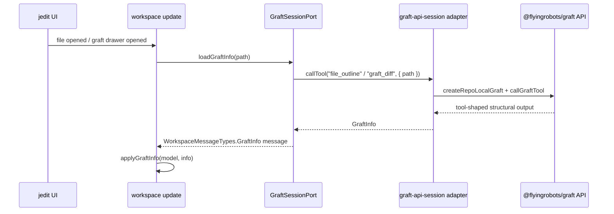

The `GraftInfo` payload carries an `outline` (list of structural symbols with `{ kind, name, startLine }`) and a diff summary string. The graft drawer renders this as a navigable list.

**Transport is not architecture**: The former sidecar path has been retired for editor-local enrichment. Graft is now reached through a direct API surface behind `GraftSessionPort`, and the runtime still depends on the port rather than the concrete adapter.

---

## 25. Golden Path: Opening and Editing a File

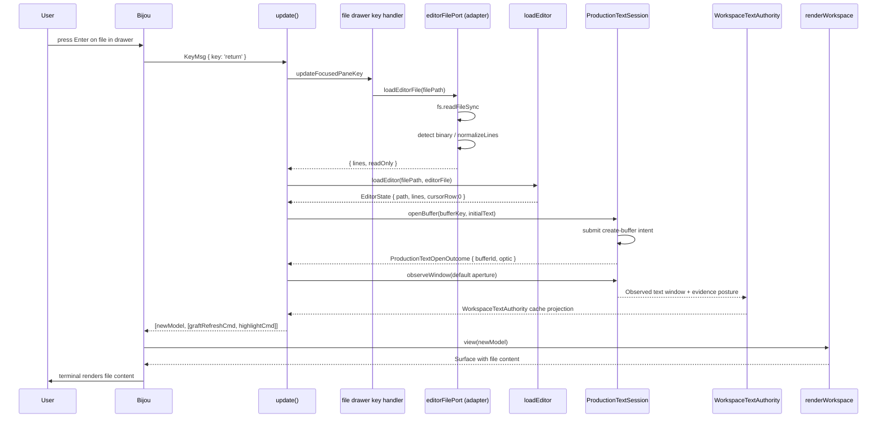

**Authority/cache split**: Production rendering uses `EditorState.lines` as the
full local visible projection cache. A full projection may replace that cache.
A bounded text-window reading may update reading evidence, history, status, and
diagnostics, but it must not replace the whole editor. The production session
owns open/edit/read/checkpoint/export behavior through `TextBufferOptic` and
`WorkspaceTextAuthority`.

---

## 26. Golden Path: A Keystroke to Terminal Pixels

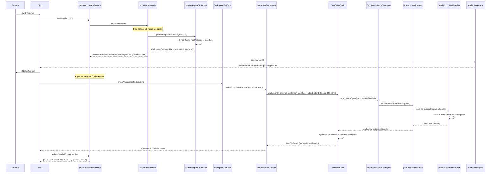

The key design here is **projection-assisted production authority**. Key
handlers plan byte-precise edits from the full visible projection, but the
production state transition is the session command and its Echo-hosted receipt.
Follow-up read commands refresh bounded observation evidence. They replace the
whole editor only when coverage proves a full projection. If the production
command is obstructed, the workspace must show explicit obstruction posture
instead of silently treating local projection movement as authority.

---

## 27. Architectural Trade-offs

Every significant decision in `jedit` is a deliberate compromise. This section names them explicitly.

### Trade-off 1: Unsupported Production Undo vs. Local Snapshot Undo

**Current**: Legacy helper paths still support snapshot undo/redo, but the
production Echo-hosted workspace blocks hidden local history mutation. Undo and
redo need explicit causal command modeling before they can change production
text authority.

**Cost**: Users expect `u` and `ctrl+r` to work like Vim. The honest posture is
worse UX in the short term, but it avoids pretending local JavaScript snapshots
are Echo history.

**Future direction**: Echo-backed causal undo. Each inverse action becomes
authored input with receipt evidence, not a private rewind of render cache.

**Why not done now**: The editor first needs production open/edit/read/save and
WSC recovery/export to be consistently Echo-backed. Undo should build on that
authority rather than create a competing one.

---

### Trade-off 2: Reading Cache vs. Echo Authority

**Current**: `EditorState.lines[]` is the full local visible projection cache
used for rendering, cursoring, and transitional edit planning.
`WorkspaceTextAuthority` and `ProductionTextSession` track the production text
authority posture. Bounded readings are observation evidence unless coverage
proves they are full-document projections.

**Gain**: The editor can keep cursor movement, viewport math, highlighting, and
rendering responsive while still routing open/edit/read/save/checkpoint/export
through the production session.

**Cost**: Any cache update that escapes the production command/read pipeline can
look like a text change without Echo evidence. This is why the codebase has
static guards and why production undo/redo is blocked until modeled causally.

**Why accepted**: Full TUI rendering still needs fast local material. The
architecture keeps that local material labeled as cache instead of treating it
as durable history.

---

### Trade-off 3: JSON Codec vs. Binary Codec

**Current**: Wire format is JSON. Every intent/observe request is `JSON.stringify` → UTF-8 bytes. Every response is UTF-8 bytes → `JSON.parse`.

**Gain**: Human-readable. Trivial to debug (just log the bytes and read the JSON). The encoding is deterministic and diff-friendly.

**Cost**: Verbose. Legacy/fake payloads can carry a large session-shaped JSON
body for a one-character edit. For the in-process fake transport, this is
negligible. For real WASM or durable contract-host paths, the direction is to
move stable operation bytes and basis/session references rather than shipping
full mutable context.

**Future direction**: Wesley-generated binary codecs. The `src/codec.ts` little-endian binary reader/writer is already in the repo as a skeleton. The migration requires replacing the codec functions (`encode/decode`) without changing any other layer — the `Uint8Array` transport boundary is already correct.

---

### Trade-off 4: Fake Echo Transport for Focused Tests

**Current**: Focused tests can use `createFakeEchoJeditOpticTransport` — an
in-process, synchronous implementation of the text contract behavior backed by
`HotTextBufferState`. The production TUI uses the installed-contract session
path.

**Gain**: Tests are hermetic, fast, and have zero external dependencies. No sibling repository checkout required. The entire test suite runs in milliseconds.

**Cost**: The fake transport is not Echo. If the production installed-contract
path or real WASM witness diverges from the fake's behavior, fake-only tests
can pass while production fails. This is the classic mock/stub risk.

**Mitigation**: The release gate runs production-session and interactive
workspace witnesses. The opt-in real WASM witness exercises the real ABI path.
The codec's Zod validation provides schema-level compatibility guarantees, and
generated Wesley metadata keeps operation identity visible.

---

### Trade-off 5: TEA Immutability vs. Mutable Object Patterns

**Current**: The entire `WorkspaceModel` is replaced on every state change via object spread. A single keypress that moves the cursor produces a new `WorkspaceModel`, a new `EditorState`, and a new `lines[]` array reference (though the contents are the same array — JavaScript spread is shallow).

**Gain**: No mutable state. No action-at-a-distance bugs. The model at any point in time is a pure value. Testing `update` is as simple as calling it with a known model and asserting the output.

**Cost**: Garbage collection pressure. Every keypress allocates several new objects. For a typical session this is entirely acceptable — V8's GC handles short-lived small objects efficiently. For a very large buffer (hundreds of thousands of lines) with rapid edits, the frame time impact could become perceptible.

**Trade-off clarity**: The immutability guarantee is worth the GC cost for the correctness properties it provides. This is not a decision that needs revisiting until profiling reveals actual frame-time problems.

---

### Trade-off 6: `WeakMap` Capability for `ReadBasisHandle`

**Current**: `ReadBasisHandleRegistry` uses a `WeakMap` keyed on handle object identity to store the `worldlineId` binding.

**Gain**: Handles are unforgeable by construction. No capability can be manufactured by app code. Memory is automatically reclaimed when the handle is GC'd (no manual cleanup required).

**Cost**: The handle must stay alive in JavaScript's heap while it is needed. If
the optic holds the only reference and it is GC'd prematurely, the binding is
lost. In practice the active production text session retains the optic for the
open buffer lifetime.

**Interesting property**: Using `WeakMap` means the capability registry does not prevent the handle from being garbage collected. This is the correct behavior — a handle that nothing holds a reference to is a handle that nobody can use, so its binding can be cleaned up automatically.

---

### Trade-off 7: Stateless Runtime Functions vs. Stateful Classes

**Current**: `HotTextRuntimePort` is a set of pure functions that take and return `HotTextBufferState`. There is no `HotTextRuntime` class with a `this.state` field.

**Gain**: Functions are trivially testable — pass any state, assert the output, no setup/teardown. Functions compose naturally. State ownership is explicit — the caller decides where to put the state.

**Cost**: Every call requires passing the full state object. For deeply nested call chains, the state must be threaded through every function signature. This can be verbose.

**Why it's right here**: The state lives in `JeditWorldlineSession`, which is owned by the transport layer. The transport layer is the right place for state ownership — it is the boundary between application code and the runtime substrate. Putting state there and passing it to pure functions produces a clear ownership model with no hidden side channels.

---

### Trade-off 8: O(n) Normal-Mode Command Lookup

**Current**: Normal-mode commands are matched by linear scan over a ~25-element array, building a descriptor string for each entry and comparing.

**Cost**: O(n) per keypress in normal mode. For 25 commands, this is ~25 string comparisons on every key event.

**Why acceptable**: 25 comparisons of short strings is unmeasurable on a modern CPU — certainly less than 1 microsecond. The declarative table format is far more readable and maintainable than a pre-built `Map`. Premature optimization here would trade readability for no perceptible gain.

**When to change it**: If the command table grows to hundreds of entries (unlikely for a Vim-shaped editor) or if profiling shows this function in the hot path, replace with a `Map<string, NormalCommandDefinition>` keyed on the descriptor string.

---

## 28. Architecture Summary

```mermaid
graph TB
    subgraph "External World"
        TERM["Terminal<br />(keystrokes, resize, mouse)"]
        FS["Filesystem<br />(open, read, save)"]
        GRAFT_API["Graft direct API<br />(@flyingrobots/graft)"]
        ECHO_HOST["Echo-hosted contract seam<br />(installed contract, WSC evidence,<br />optional real WASM witness)"]
    end

    subgraph "jedit"
        MAIN["src/main.ts<br />Entry point, profile resolution"]
        BIJOU_RUN["Bijou run()<br />TEA event loop"]
        subgraph "src/adapters"
            WA["workspace-app<br />Wires all adapters"]
            FEW["fake-echo-jedit-optic-transport<br />Focused fixture"]
            IECW["installed-jedit-contract-echo-transport<br />Production contract seam"]
            WSC_STORE["jedit-wsc-workspace-store<br />Generic WSC envelope placement"]
            FS_ADAPT["filesystem.ts<br />Node fs wrapping"]
            GRAFT_ADAPT["graft-api-session.ts<br />Direct Graft API"]
        end
        subgraph "src/app"
            WR["workspace/runtime.ts<br />init / update / view"]
            PTS["production-text-session.ts<br />Open / edit / read / export"]
            WTA["workspace-text-authority.ts<br />Authority posture + reading cache"]
            TBS["text-buffer-session.ts<br />TextBufferOptic factory"]
            JCR["jedit-contract-runtime.ts<br />Worldline session management"]
            JOR["jedit-observer-runtime.ts<br />Observe with observer plan"]
            JSON_GUARDS["jedit-hot-text-json-schemas.ts<br />Transitional JSON guards"]
        end
        subgraph "src/domain"
            TEC["text-edit-contract<br />UTF-8 rope operations"]
            TAC["tick-admission-contract<br />Ordered tick sequence"]
            EGC["edit-group-contract<br />Undo unit grouping"]
            ATC["anchor-transform-contract<br />Byte anchor tracking"]
            SCC["save-checkpoint-contract<br />Save point anchoring"]
        end
        subgraph "src/ui"
            RW["renderWorkspace<br />Surface composition"]
        end
        subgraph "src/generated"
            WES["rope.wesley.generated.ts<br />Types + operation metadata"]
            SH["structural-history descriptor<br />.wesley.generated.ts"]
        end
    end

    TERM -->|"raw bytes"| BIJOU_RUN
    MAIN --> WA
    WA --> BIJOU_RUN
    BIJOU_RUN --> WR
    WR --> PTS
    WR --> WTA
    PTS --> TBS
    TBS --> JCR
    JCR --> TAC
    TAC --> TEC
    JCR --> EGC
    JCR --> SCC
    WA --> FEW
    WA --> IECW
    WA --> WSC_STORE
    FEW -->|"synchronous byte calls"| JCR
    IECW -->|"contract byte calls"| ECHO_HOST
    WSC_STORE -->|"workspace envelopes"| ECHO_HOST
    FS_ADAPT --> FS
    GRAFT_ADAPT --> GRAFT_API
    WR --> RW
    JSON_GUARDS -->|"transitional runtime validation"| JCR
    WES -->|"types + operation metadata"| JCR
    WES -->|"type definitions"| TBS
    SH -->|"operation identity"| JCR
```

The overall shape is clean:

1. **Bijou** owns the event loop and terminal I/O.
2. **`src/adapters`** is the only place raw bytes, JSON, Node filesystem calls,
   Graft API calls, and WSC workspace placement happen.
3. **`src/app`** orchestrates pure state transitions using domain types and port
   interfaces; `ProductionTextSession` is the production text boundary.
4. **`src/domain`** contains portable text-editing invariants and transitional
   contract fixtures, not Echo-core authority.
5. **`src/ui`** is a pure function from model to pixels.
6. **`contracts/`** and **`src/generated/`** form the schema authority and its
   derived artifacts.

The architecture is in deliberate tension: local render/cache data is simple,
fast, and necessary for a responsive TUI, while Echo-hosted text authority,
retained readings, receipts, and WSC recovery/export are the correct production
truth. The codebase should keep those roles separate until Echo's file aperture
can make arbitrary host-file observation, drift, and materialization a standard
runtime surface.

---

## 29. Title Screen 3D Ray-Tracer and Bounding Volume Acceleration

The `jedit` startup screen renders an interactive, real-time 3D ray-traced scene in the terminal using Braille subpixels or ASCII characters. When `WorkspaceModel.editor` is `undefined`, the Elm Architecture view loop delegates rendering to `renderTitleScreen` (in `src/ui/title-screen.ts`).

### The 3D Ray-Traced Title Screen Engine
The 3D engine simulates:
1. **Camera Placement & Drift**: Generates camera coordinates and angles that slowly drift over time using `titleSceneCameraAngleAt` and `titleSceneCameraPosition`.
2. **Object Geometry**: Models spheres, boxes, cylinders, and complex 3D meshes (Utah teapot, bunny, Stanford dragon) loaded via `title-mesh.ts` and `title-bunny-mesh.ts`.
3. **Lighting & Shadows**: Computes spotlights, ambient day-night cycles, contact shadows, reflection/refraction tints, and floor caustics using math libraries in `src/ui/title-scene-math.ts`.
4. **Braille Canvas**: Sub-pixel dithering and sampling are managed by `averagingBrailleCanvas` which groups sub-pixels into 2x4 Braille cells, creating high-density terminal graphics.

### The Performance Bottleneck: Ray-Tracing in Single-Threaded JavaScript
Since the entire application runs in a single-threaded Node.js event loop (under the Bijou TEA loop), rendering a high-density 3D scene cell-by-cell is extremely CPU-bound. If every ray (1 ray per sub-pixel, which is 8 sub-pixels per Braille character) has to intersect with every 3D mesh triangle and primitive in the scene, frame rates drop below usable levels.

### The Optimization: Bounding Volume Hierarchies (`TitleSceneRayAcceleration`)
The `title/ray-acceleration` feature optimizes this via bounding volume checks implemented in `src/ui/title-scene-ray-acceleration.ts`:

```mermaid
flowchart TD
    Ray[Cast Ray] --> SceneBound{Intersects Scene Sphere?}
    SceneBound -- No --> Abort[Immediately Abort: Return Background/Sky]
    SceneBound -- Yes --> Loop[Loop through Objects]
    Loop --> ObjBound{Intersects Object Sphere?}
    ObjBound -- No --> Skip[Skip Expensive Geometry Check]
    ObjBound -- Yes --> GeomCheck[Perform Ray-Triangle or Ray-Primitive Intersection]
```

1. **Bounding Spheres for Objects**:
   Each object is mapped to a `TitleSceneObjectRayBound` which contains the object's dynamic center (accounting for physics/time) and a calculated bounding radius:
   $$\text{Radius} = \sqrt{\text{FootprintRadius}^2 + \left(\frac{\text{Height}}{2}\right)^2}$$
   This is computed dynamically in `titleSceneObjectBoundingRadius`.
2. **Global Scene Bounding Sphere**:
   `titleSceneBound` computes a bounding box (`TitleSceneRayBoundExtents`) around all objects' bounding spheres, finds the center, and determines a global bounding radius that encapsulates every object in the scene.
3. **Ray-Sphere Projection Check (`titleSceneRayMayHitBound`)**:
   Instead of expensive ray-object intersection, the engine performs a fast projection test:
   - Computes vector $\vec{d}$ from ray origin to sphere center.
   - Computes projection of $\vec{d}$ onto the normalized ray direction.
   - If the closest distance from the ray line to the sphere center is greater than the radius, it is mathematically guaranteed that the ray misses. The intersection test aborts immediately.
4. **Pruning Primary Hit Tests**:
   Before looping over all objects to find the nearest hit, `nearestTitleSceneObjectHit` checks if the ray intersects the global scene sphere. If not, the entire hit test returns `undefined` immediately, skipping all objects.
5. **Pruning Shadow Ray Tests**:
   When computing floor shadow multiplier at a point, the engine casts a shadow ray toward the light source. In `titleFloorPointInShadow`, for each object in the scene, the engine first runs a bounding sphere intersection test for the shadow ray. If it misses the object's sphere, it skips the expensive primitive/mesh intersection checks.

This optimization yields a massive reduction in ray-primitive intersection checks, allowing the TUI's animated 3D backdrop to render smoothly even on lower-performance systems.

---

The deepest insight: `jedit` treats _product pressure as a test suite for the underlying stack_. The Echo stack does not advance based on protocol theory — it advances when a real editor use case forces a seam to become honest. The `@wes_footprint` directive, the `ReadBasisHandle` capability, the intent/observe split, the receipt evidence in `Observed<T>` — none of these were designed in isolation. Each was forced into existence by the requirements of a working editor that needed provenance, authority separation, and replayable history to function correctly.
