# jedit — Exhaustive Technical Teardown

> **Terminal-first text and Markdown editing, built on Bijou and shaped around causal history through Echo.**

This document is a progressive, end-to-end technical explanation of `jedit` aimed at a reader with no prior knowledge of this codebase, its domain vocabulary, or the surrounding runtime stack. Each section builds on the last.

---

## Table of Contents

0. [Domain Dictionary](#0-domain-dictionary)
1. [What is jedit?](#1-what-is-jedit)
2. [The Ecosystem — Bijou, Echo, Graft, Wesley](#2-the-ecosystem--bijou-echo-graft-wesley)
3. [Entry Point: `src/main.ts`](#3-entry-point-srcmaints)
4. [Bootstrapping vs. Runtime](#4-bootstrapping-vs-runtime)
5. [Configuration and Environment Tuning](#5-configuration-and-environment-tuning)
6. [The Bijou TEA Runtime Loop](#6-the-bijou-tea-runtime-loop)
7. [Concurrency and Asynchronous Flows](#7-concurrency-and-asynchronous-flows)
8. [Hexagonal Architecture — The Five Layers](#8-hexagonal-architecture--the-five-layers)
9. [External Dependencies and Borders](#9-external-dependencies-and-borders)
10. [The Central State: `WorkspaceModel`](#10-the-central-state-workspacemodel)
11. [The Message Dispatch Pipeline](#11-the-message-dispatch-pipeline)
12. [The Vim Editor Layer](#12-the-vim-editor-layer)
13. [The Rendering Pipeline](#13-the-rendering-pipeline)
14. [The Text Editing Domain — Three Pure Contracts](#14-the-text-editing-domain--three-pure-contracts)
15. [Anatomy of a Payload](#15-anatomy-of-a-payload)
16. [The Hot Text Runtime Adapter](#16-the-hot-text-runtime-adapter)
17. [The TextBufferOptic — The Capability Boundary](#17-the-textbufferoptic--the-capability-boundary)
18. [Security Boundaries and Auth Flows](#18-security-boundaries-and-auth-flows)
19. [The Echo Transport Architecture](#19-the-echo-transport-architecture)
20. [The Codec Layer — JSON Serialization and Zod Validation](#20-the-codec-layer--json-serialization-and-zod-validation)
21. [Unhappy Paths and Error Handling](#21-unhappy-paths-and-error-handling)
22. [The GraphQL SDL and Wesley Code Generation](#22-the-graphql-sdl-and-wesley-code-generation)
23. [The Structural History Path](#23-the-structural-history-path)
24. [Graft Integration — Structural Intelligence via MCP](#24-graft-integration--structural-intelligence-via-mcp)
25. [Golden Path: Opening and Editing a File](#25-golden-path-opening-and-editing-a-file)
26. [Golden Path: A Keystroke to Terminal Pixels](#26-golden-path-a-keystroke-to-terminal-pixels)
27. [Architectural Trade-offs](#27-architectural-trade-offs)
28. [Architecture Summary](#28-architecture-summary)

---

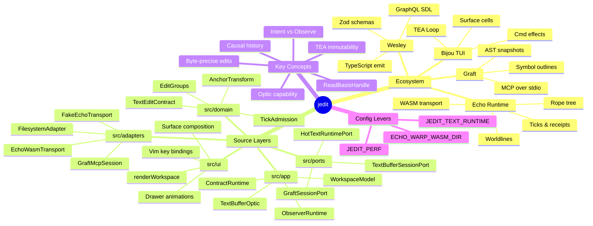

---

## 0. Domain Dictionary

These terms appear throughout the codebase with precise meanings that differ from everyday usage. Read this before diving into the code.

| Term | Definition |
|------|-----------|
| **Worldline** | The complete causal history of a single text buffer. A worldline is an ordered sequence of rewrite events (ticks) that deterministically produce the current text. Think of it as a git history for a single file — but immutable and auditable at the byte level. |
| **Tick** | One admitted, sequenced rewrite event. A tick is not a keypress — it is the *receipt* that a keypress was accepted by the scheduler and applied to the worldline. Every tick has a monotonically increasing integer ID. |
| **Rope** | The data structure used to represent text in Echo's substrate. A rope is a binary tree of text fragments — efficient for splitting and joining at arbitrary byte positions without copying the full string. In this codebase the "rope" is conceptual; the in-memory hot text runtime uses a plain JavaScript string as a transitional implementation. |
| **BufferRoot** | The in-memory representation of a rope's full text content at a given point in time. Each `BufferRoot` has a unique integer ID. A series of `BufferRoot`s linked by ticks forms the worldline. |
| **RopeHead** | The Echo substrate's pointer to the current canonical state of a rope. Analogous to a git `HEAD` commit pointer. Changing the head means the worldline has advanced. |
| **Receipt** | Proof that an operation was applied. A `TickAdmissionReceipt` carries the tick ID and the underlying `ReplaceReceipt`. A `ReplaceReceipt` records the base root ID, the next root ID, the replaced byte range, and the inserted fragment ID. Receipts are the causal audit trail. |
| **Intent** | A *request* to perform a mutation. Application code submits an intent; the Echo scheduler decides whether to admit it. Crucially, submitting an intent is not the same as the edit being applied — the scheduler has authority over admission. |
| **Observe** | A bounded read request. Unlike a raw string dump, an observation returns structured evidence: the reading ID, which head it was taken against, and optionally the receipt it correlates to. |
| **TextBufferOptic** | The app-facing capability object for a single text buffer. It is the *only* way application code interacts with the text runtime. It hides all substrate coordinates. |
| **ReadBasisHandle** | An opaque capability token produced by the optic after each mutation or buffer creation. Application code passes it back to `textWindow()` to request a read. It cannot be forged or cloned. |
| **Frontier** | A reference string that acts as a causal marker for an observation — it identifies the point in the worldline against which a read was taken. |
| **Edit Group** | A collection of tick IDs that form one logical undo unit at the product layer. One keypress → one edit group. Edit groups are the product's abstraction over the substrate's ticks. |
| **Checkpoint** | A named, durable marker in the worldline. A manual save creates a `MANUAL_SAVE` checkpoint. The initial buffer creation creates an `INITIAL` checkpoint. Checkpoints are the substrate's equivalent of git tags. |
| **Structural History** | The product-layer taxonomy of text history events: revisions, replacements, edit groups, provenance, command status. This is a different model from the rope substrate — it describes *what the user did*, not *how the bytes changed*. |
| **Optic** | A general term for a capability-bounded view into the runtime. The `TextBufferOptic` is the first optic; future optics may provide different projections (e.g., a selection optic, a search optic). |
| **Transport** | The byte-level I/O channel between the optic client and the Echo runtime. The fake transport is synchronous and in-process. The real transport speaks to a WASM module. Both implement `EchoWasmKernelTransport`. |
| **Worldline Session** | A `JeditWorldlineSession` — the bundle of a `BufferWorldline`, a `HotTextBufferState`, and metadata (tick records, checkpoint records) that represents one buffer's live runtime state. The transport holds one session per open worldline. |
| **Witness** | A test script that exercises the full stack in a product-shaped way and records evidence. Witnesses are not unit tests — they are proofs that the seams work end-to-end. The `scripts/jedit-echo-witness.mjs` script is the primary witness. |
| **Footprint** | The declared set of entity kinds an operation reads, writes, creates, and forbids. Encoded in the `@wes_footprint` SDL directive. Used by the Echo scheduler for conflict detection and admission control. |
| **Surface** | Bijou's 2D array of styled terminal cells. A `Surface` is the output of the `view` function — the entire terminal screen as a data value. Bijou diffs successive surfaces and emits ANSI escape sequences for only the changed cells. |
| **Cmd** | A Bijou effect descriptor. `Cmd<Msg>` is an opaque value returned from `update` that Bijou executes asynchronously. When the async work completes, Bijou delivers a `Msg` back to `update`. |
| **TEA** | The Elm Architecture — a reactive pattern: `init` produces initial state, `update(Msg, Model)` produces new state and effects, `view(Model)` produces a rendered output. All state lives in the model; all change happens through messages. |

---

## 1. What is jedit?

`jedit` is a **terminal UI text editor** rendered entirely within a terminal emulator. Run `npm run dev` and you get:

- A one-line header identifying the active file
- A main editor pane with Vim Normal/Insert modes and core motions (`w`, `b`, `e`, `dd`, `yy`, `p`, `u`, `ctrl+r`)
- Slide-out drawers for the file tree and a structural outline (Graft)
- A two-line footer with mode hints and workspace truth
- A Markdown preview lens over the active buffer

That description makes it sound like a standard terminal editor. What makes `jedit` architecturally interesting is its *purpose*: it is the **release gate** for a broader distributed runtime stack called **Echo**. The README states this philosophy plainly:

> *Product pressure determines architecture truth. The stack should advance when a real editor constraint forces a seam to become honest, not when an abstract protocol theory wants a place to land.*

`jedit` doesn't just use Echo — it *proves* Echo. Every edit intent it submits, every bounded text reading it requests, and every retained receipt it inspects is evidence that the underlying causal text substrate works from the perspective of a real product. This shapes every architectural decision in the codebase.

---

## 2. The Ecosystem — Bijou, Echo, Graft, Wesley

Four external systems surround `jedit`. Understanding their roles is prerequisite to understanding any code.

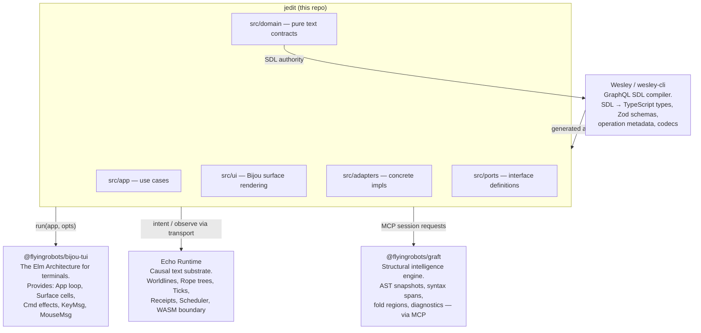

### Bijou

Bijou is an in-house TUI framework implementing **The Elm Architecture (TEA)** for terminals. It provides:

- An `App<Model, Msg>` interface with `init`, `update`, and `view`
- A `Surface` type — a 2D grid of styled cells (characters + ANSI color/style)
- `Cmd<Msg>` for scheduling asynchronous effects (filesystem reads, MCP calls, timers)
- Terminal event decoding — raw bytes become typed `KeyMsg`, `MouseMsg`, or `ResizeMsg` values

The TEA pattern means the entire application state is a single immutable value. The `update` function is a pure function from `(Msg, Model) → [Model, Cmd[]]`. There are no mutable singletons. State change happens only through messages.

### Echo

Echo is the causal text substrate. It models text as **worldlines** — ordered sequences of rewrite ticks that produce a deterministic rope tree. Key properties:

- Every edit is a **tick** (an admitted, sequenced rewrite event)
- Ticks are receipted, sequenced, and form a causal history
- Text is read through **bounded observations** (not raw string extraction)
- A **scheduler** controls tick admission — application code submits intent; the trusted host authorizes
- Echo can be embedded as a WASM module; jedit speaks to it through a byte-level transport

### Graft

Graft is a structural intelligence engine — AST spans, fold regions, symbol outlines, diagnostics, rename previews, structural diffs. `jedit` reaches Graft through an **MCP (Model Context Protocol) session**, treating it as an intelligent adapter rather than an editor kernel.

### Wesley

Wesley is the contract compiler. It reads **GraphQL SDL** files and emits TypeScript type definitions, Zod validation schemas, and operation metadata objects. The SDL files in `contracts/jedit/` are the canonical authority for `jedit`'s data model; the generated TypeScript in `src/generated/jedit/` is derived output.

---

## 3. Entry Point: `src/main.ts`

```
src/main.ts → createWorkspaceApp() → run(app, { mouse })
```

`main.ts` is deliberately thin — nine meaningful lines of logic:

```typescript
// src/main.ts (abridged)
initDefaultContext();

const textRuntimeProfile = resolveTextRuntimeProfile(
  parseTextRuntimeProfile(process.env['JEDIT_TEXT_RUNTIME'])
);

const app = createWorkspaceApp({
  initialColumns: process.stdout.columns ?? 100,
  initialRows:    process.stdout.rows    ?? 32,
  initialWorkingDirectory: process.cwd(),
  textRuntimeProfile,
  perfEnabled: envBoolean(process.env['JEDIT_PERF']),
});

run(app, { mouse: JEDIT_TERMINAL_MOUSE_OPTIONS.mouse });
```

**`initDefaultContext()`** initializes the Bijou TUI context — sets up raw terminal mode, ANSI output streams, signal handlers for `SIGTERM`/`SIGINT`.

**`textRuntimeProfile`** is determined from the `JEDIT_TEXT_RUNTIME` environment variable. This single variable switches the entire text runtime. The profile is resolved before the app is constructed, so the transport is injected at construction time rather than discovered lazily.

**`createWorkspaceApp()`** wires all adapters, constructs the initial model, and returns a Bijou `App` object. Crucially, it does not start anything — it returns a pure description of the application.

**`run(app, opts)`** hands the app object to Bijou, which owns the event loop from this point forward.

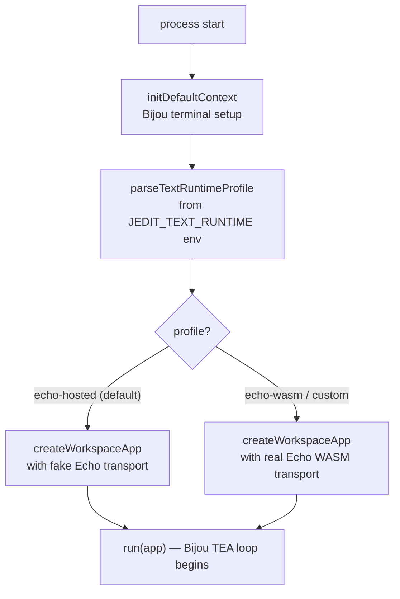

---

## 4. Bootstrapping vs. Runtime

It is worth drawing a hard line between what happens *once at startup* and what happens *on every event*. Confusing these two phases is a common source of bugs in reactive apps.

### Bootstrap Phase (runs once)

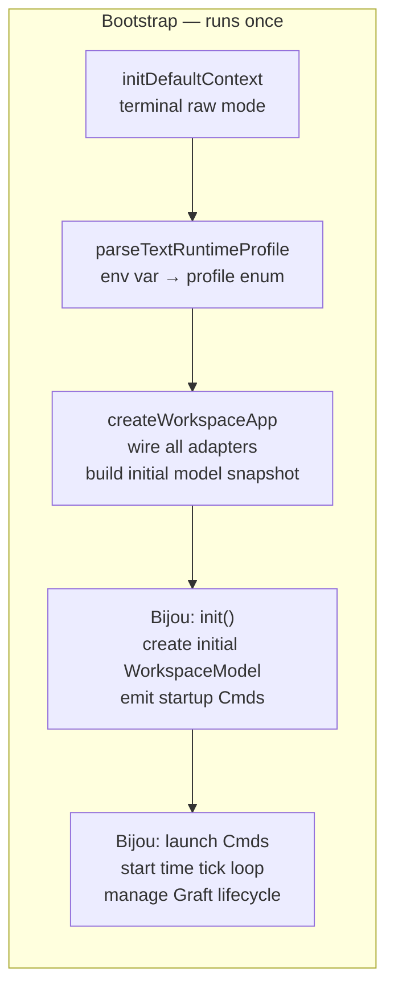

During bootstrap:

- The text runtime profile is locked in — it cannot change without restarting the process.
- All port adapters are instantiated: `FileSystemPortAdapter`, `GraftSessionPort`, `SourceHighlighter`, `TitleSceneLoaderPort`.
- The initial `WorkspaceModel` is constructed from `createInitialModelSnapshot` — this snapshot picks the initial theme, seeds the title screen animation, sets up i18n, and chooses the initial working directory.
- Bijou calls `init()` on the workspace runtime, which returns `[initialModel, startupCmds]`. The startup commands include the time-tick loop and the Graft lifecycle manager.

Critically, **no I/O happens during bootstrap**. The filesystem, MCP session, and Echo transport are only touched *after* Bijou begins executing commands from `init`.

### Runtime Phase (runs on every event)

The runtime phase is the steady state: Bijou delivers a message, `update` returns a new model and new commands, Bijou renders the new model and executes the commands. This cycle has no defined end — it runs until `SIGTERM`.

Key runtime invariants:

- **`update` is always synchronous and pure** — it never awaits anything. All async work is in `Cmd` closures.
- **The model is replaced, never mutated** — every field change produces a new object via spread (`{ ...model, field: newValue }`).
- **Commands are declarative** — returning a `Cmd` from `update` does not execute it immediately. Bijou decides when to run it.

---

## 5. Configuration and Environment Tuning

`jedit` currently has three environment variables that materially change runtime behavior:

### `JEDIT_TEXT_RUNTIME`

Controls the entire text backend. This is the most impactful lever in the codebase.

| Value | Effect |
|-------|--------|
| *(unset)* | `echo-hosted` default — fake in-process Echo transport backed by in-memory `HotTextBufferState`. Zero external dependencies. All tests use this. |
| `echo-wasm` | Real Echo WASM transport. Requires `ECHO_WARP_WASM_DIR` to point at a built Echo checkout. Echo runs as a compiled Rust WASM module. |

**Architectural implication**: Because the profile is resolved at process start and injected into `createWorkspaceApp`, there is no conditional logic in the app or domain layers about which backend is running. The same `TextBufferOptic` code path executes identically in both cases. The swap point is a single factory call in `workspace-production-text-session.ts`.

**Trade-off**: This "inject at boot" design means you cannot hot-swap the text runtime without restarting the process. That is an acceptable trade-off for development — it makes the runtime boundary explicit and prevents runtime feature-flag drift.

### `JEDIT_PERF`

Set to `1` to enable the performance overlay.

When enabled, `createPerfApp` wraps the workspace app in a decorator that tracks frame timing and renders a profiler HUD. The overlay shows frame time history as a spark line and live FPS.

Internally, `frameTimeHistory` in `WorkspaceModel` is an array of the last 50 frame times. The profiler reads this on every `TimeTick` message. Setting `JEDIT_PERF=0` (or leaving it unset) means the perf overlay never renders but `frameTimeHistory` still accumulates — the model always tracks frame times as a side effect of the time tick loop.

**Trade-off**: Always tracking frame times (even when the overlay is off) consumes a trivial amount of memory (50 numbers) but means the data is always available if you dynamically enable the overlay later. This is a minor "pay it anyway" cost for a useful debugging capability.

### `ECHO_WARP_WASM_DIR`

Only relevant when `JEDIT_TEXT_RUNTIME=echo-wasm`. Points at the directory containing Echo's compiled WASM module. Used exclusively by the witness scripts (`scripts/jedit-echo-witness.mjs`, `scripts/run-real-echo-wasm-stack-witness.sh`).

This variable is intentionally absent from the main app boot path — it is only read by the witness scripts that build and exercise the real Echo transport. This prevents accidental production dependency on a sibling repository checkout.

---

## 6. The Bijou TEA Runtime Loop

The Elm Architecture is the heartbeat of `jedit`. Everything flows through it.


The three functions that `createWorkspaceRuntime` must implement:

| Function | Signature | Role |
|----------|-----------|------|
| `init` | `() → [Model, Cmd[]]` | Construct the initial model and launch startup effects |
| `update` | `(Msg, Model) → [Model, Cmd[]]` | Pure state transition — the entire application logic |
| `view` | `(Model) → Surface` | Pure render — translate model into a terminal pixel grid |

A fourth function, `routeRuntimeIssue`, converts unhandled async errors into messages the update loop can handle gracefully (displaying a toast notification rather than crashing).

**Commands** (`Cmd<Msg>`) are the mechanism for side effects. They are opaque values returned from `update` that Bijou executes asynchronously. When complete, they produce a new message that re-enters the update loop. This means `update` is always pure — it never touches the filesystem, network, or terminal directly.

---

## 7. Concurrency and Asynchronous Flows

This section addresses the most common question from developers new to TEA: *how does a reactive immutable model handle concurrent async operations without race conditions?*

### The Key Insight: Sequential Update, Concurrent Effects

The `update` function processes **one message at a time**. Bijou's event loop is single-threaded (Node.js event loop). There is no possibility of two `update` calls running simultaneously.

However, multiple `Cmd` effects *can be in flight concurrently*. Consider what happens when a user opens a file:


Each result message updates the model independently. If Graft responds before Echo, the model gets `graftInfo` first, then `textAuthority` when Echo responds. The model is always in a consistent partial state — there is no invalid intermediate state because each message is applied atomically.

### The Stale Request Problem and Request IDs

This concurrent design creates one subtle problem: what if the user opens a second file before the first Graft response arrives? The Graft response for file A arrives while file B is open.

`jedit` solves this with **request IDs**. Every async request that might arrive stale is tagged with an integer `requestId` stored in the model at dispatch time:

```typescript
// In WorkspaceModel
readonly graftRequestId: number;
readonly sourceHighlightRequestId: number;
readonly textRequestId: number;
```

When the result arrives, the update handler checks:

```typescript
function updateGraftInfoMessage(msg, model): WorkspaceRuntimeResult {
  return msg.requestId === model.graftRequestId
    ? [applyGraftInfo(model, msg.info), []]  // fresh — apply it
    : [model, []];                            // stale — drop it
}
```

If the request ID doesn't match, the message is silently discarded. No error, no state corruption — just a dropped stale response.

### The Time Tick Loop

`jedit` has a heartbeat: the time tick command emits a `TimeTick` message on every animation frame. This is how:

- Drawer animations advance (lerping progress from 0.0 to 1.0)
- The performance profiler samples frame times
- Notification toasts expire and fade

The tick command re-schedules itself on every invocation — it is a self-perpetuating loop. If the loop breaks (e.g., an unhandled error in a command), the entire UI freezes. This is a known fragility of self-scheduling command loops in TEA; the mitigation is `routeRuntimeIssue`, which converts errors into toast messages before they can escape the loop.

### What jedit Does NOT Have

- **No shared mutable state between Cmds** — each Cmd closure captures only the values it needs at dispatch time
- **No explicit mutex or lock** — the single-threaded event loop provides the serialization guarantee
- **No background threads** — Node.js single-threaded, all I/O is event-loop callbacks
- **No optimistic rollback** — if an Echo intent fails, the UI already rendered the edit (optimistic); a `RuntimeIssue` toast is shown but the `lines[]` state is not rolled back in the current design. This is a stated gap.

---

## 8. Hexagonal Architecture — The Five Layers

`jedit` enforces a strict hexagonal (ports-and-adapters) architecture. The dependency rule is absolute: dependencies point **inward only**.

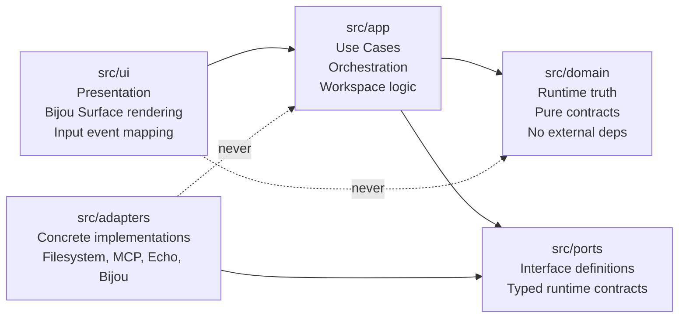

**`src/domain`** — Pure runtime truth. No Node APIs, no Bijou, no JSON, no filesystem. Contains: `TextEditContract`, `EditGroupContract`, `TickAdmissionContract`, `SaveCheckpointContract`, `AnchorTransformContract`. These are the mathematical invariants of the text editing model. They could compile and run identically in a browser, Deno, or a Rust WASM host.

**`src/app`** — Use cases and orchestration over domain types. Depends on domain and ports; never on concrete adapters. Contains the workspace runtime, editor session logic, text buffer session, observer runtime, and contract runtime.

**`src/ports`** — Interface definitions only. A port describes a typed runtime contract; it never decodes raw payloads. Examples: `HotTextRuntimePort`, `TextBufferSessionPort`, `FileSystemPort`, `GraftSessionPort`, `SourceHighlighter`.

**`src/adapters`** — Concrete implementations. Raw strings, JSON bytes, and MCP payloads are decoded *here* and *only here*. Contains: the in-memory hot text runtime, the fake Echo transport, the real Echo WASM transport client, the filesystem adapter, Graft MCP session, source highlighter.

**`src/ui`** — Presentation and input mapping. UI translates Bijou events into app commands and renders app state into `Surface` cells. It does not own business rules.

### Why This Matters in Practice

The separation is enforced by convention, not by a module bundler boundary. The benefit is demonstrated by the dual-transport design: the entire test suite runs against the fake Echo transport (`createFakeEchoJeditOpticTransport`) without any modification to `src/app` or `src/domain`. Swapping the transport is a single-line change in `workspace-production-text-session.ts` — no other file knows or cares.

---

## 9. External Dependencies and Borders

This section maps precisely where `jedit`'s code ends and another system's code begins.

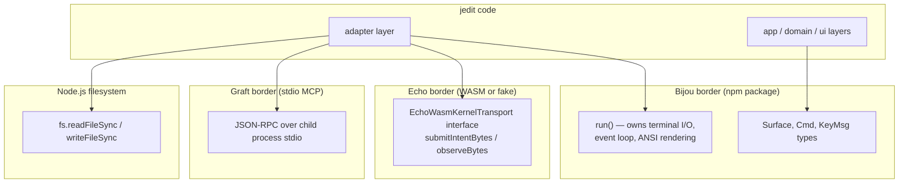

### The Bijou Border

**Where**: `src/adapters/workspace-app.ts` calls `run(app, opts)`. From that point, Bijou owns the terminal.

**What crosses the border**: The `App<WorkspaceModel, WorkspaceMsg>` object — a plain JavaScript object with three functions. Bijou never holds a reference to any jedit internal type; it only calls `init`, `update`, and `view` through that interface. The `Surface` type that `view` returns is a Bijou type, but it is a pure data object (no methods, no callbacks).

**What jedit cannot control past this border**: Terminal resize events arrive via Bijou's own signal handler. The ANSI diffing algorithm is internal to Bijou. The raw keystroke byte decoding is internal to Bijou.

### The Echo Border

**Where**: `src/adapters/fake-echo-jedit-optic-transport.ts` (fake) and `src/adapters/installed-jedit-contract-echo-transport.ts` (real). The border is the `EchoWasmKernelTransport` port.

**What crosses the border**: `Uint8Array` in, `Uint8Array` out. No JavaScript objects, no shared memory, no callbacks. The byte arrays are JSON-encoded intent requests and observe requests.

**Why bytes at the border**: WASM modules communicate via linear memory. When the real Echo transport calls into the WASM module, it passes a pointer and length into WASM linear memory, gets back a pointer and length. The fake transport uses the same `Uint8Array` interface to keep the codec layer honest — the same JSON parsing and Zod validation runs in both cases.

**What jedit cannot control past this border (real WASM)**: The Echo scheduler's admission decisions. The timing of tick sequencing. The internal rope tree structure. These are Echo's domain.

### The Graft Border

**Where**: `src/adapters/graft-mcp-session.ts`. Graft runs as a separate OS process. `jedit` communicates with it via MCP (Model Context Protocol), which is JSON-RPC over the child process's stdin/stdout.

**What crosses the border**: A JSON-RPC request with `{ path, content }` → a response with `{ outline: [...], diffSummary: string }`. The full buffer content is sent on every request (Graft receives a snapshot, not a stream of edits).

**Failure mode**: If the Graft process crashes or is slow, the MCP session times out or errors. This produces a `RuntimeIssue` message that `routeRuntimeIssue` converts into a toast notification. The editor continues to work — Graft is enrichment, not load-bearing.

### The Filesystem Border

**Where**: `src/adapters/filesystem.ts` (directory listing) and `src/adapters/editor-file.ts` (file read/write).

**What crosses the border**: Raw `Buffer` bytes for file content. The adapter is responsible for:
- Detecting binary files (null byte presence)
- UTF-8 decoding
- Line ending normalization (`\r\n` → `\n`)
- Encoding back to bytes on save

Domain code never touches the filesystem. App code uses the `EditorFilePort` and `FileSystemPort` interfaces. The concrete Node.js `fs` calls are isolated in these two adapter files.

---

## 10. The Central State: `WorkspaceModel`

The entire application state lives in a single `WorkspaceModel` record. Because Bijou TEA requires pure functions, this object is **never mutated in place** — every update returns a new object via spread.

> **Data Source of Truth: `WorkspaceModel`**
> All live application state lives in this object, in JavaScript heap memory. There is no database, no Redis, no file-backed state during a session. The filesystem is only read at file open and written at explicit save. Everything in between — cursor position, dirty flag, undo stack, drawer animation progress, Echo session state — is held in this in-memory record.

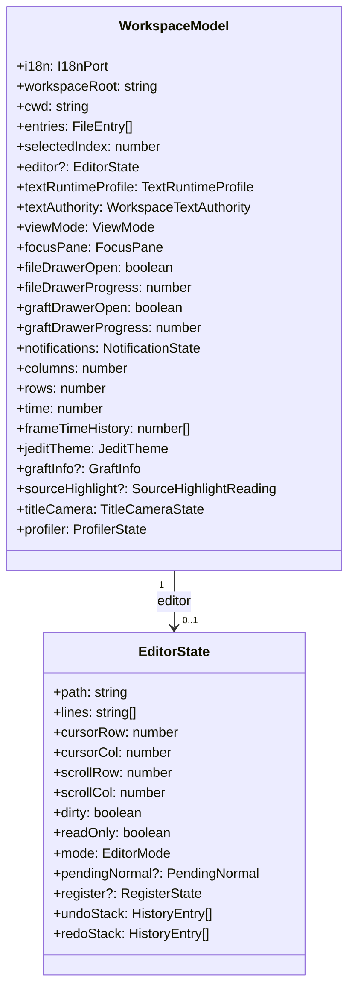

### Notable Fields

**`editor?: EditorState`** — The `?` is significant. When no file is open, `editor` is `undefined` and the workspace shows the animated title screen. The title screen is not a separate route — it is just the absent-editor state. This elegantly avoids a `page`/`route` concept entirely.

**`textAuthority: WorkspaceTextAuthority`** — The bridge between the legacy `lines[]` buffer and the Echo-backed `TextBufferOptic` path. It tracks which buffer is currently backed by Echo, the `bufferId`, and the latest `ReadBasisHandle`. The UI reads from `EditorState.lines`; the Echo session advances independently.

**`fileDrawerProgress / graftDrawerProgress`** — Floating-point animation state (`0.0` to `1.0`). The layout engine reads these on every frame to calculate drawer pixel widths. Partial values produce the slide-open animation. Animation is data, not code.

**`undoStack / redoStack` (inside `EditorState`)** — Full snapshots of `{ lines, cursorRow, cursorCol, scrollRow, scrollCol, dirty }`. Memory-intensive but simple. See the trade-offs section for analysis.

---

## 11. The Message Dispatch Pipeline

The `update` function dispatches through a priority chain. Each handler returns `[model, cmds]` or `undefined` (meaning "pass to the next handler").

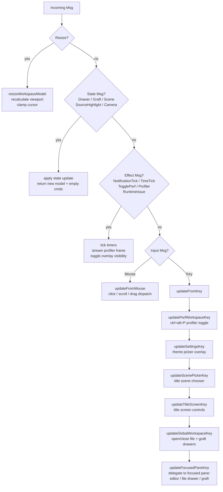

The priority chain is architectural policy encoded as code order. `updatePerfWorkspaceKey` is first — the profiler toggle must always work, even if the editor has swallowed key focus. Overlays (`updateSettingsKey`, `updateScenePickerKey`) intercept before global workspace commands because an open overlay should capture all input. The focused pane is last because it handles only keys that nothing else claimed.

---

## 12. The Vim Editor Layer

### Mode State Machine

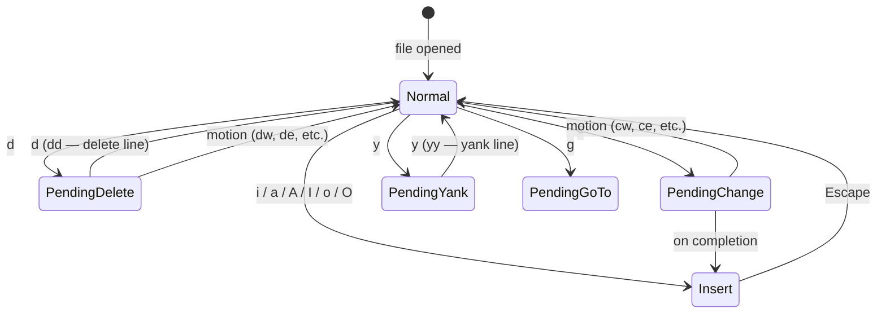

The `EditorState.pendingNormal` field stores `'d'`, `'c'`, `'y'`, or `'g'` while waiting for the second key. When the second key arrives, `applyPendingOperator` resolves the full command.

### Command Dispatch by Descriptor String

Normal-mode commands are a static table of `{ key, ctrl?, shift?, run }` records. Matching uses a descriptor string:

```
descriptor = `${key}|${ctrl?'1':'0'}|${alt?'1':'0'}|${shift?'1':'0'}`
```

This is O(n) over ~25 entries but keeps the command table declarative. An example excerpt:

```typescript
const NORMAL_COMMANDS: readonly NormalCommandDefinition[] = [
  { key: 'i', run: (e) => ({ ...e, mode: 'insert' }) },
  { key: 'a', run: (e) => enterInsertAfterCursor(e) },
  { key: 'A', shift: true, run: (e) => enterInsertAtLineEnd(e) },
  { key: 'w', run: (e) => moveCursorToNextWordStart(e) },
  { key: 'u', run: (e) => undo(e) },
  { key: 'r', ctrl: true, run: (e) => redo(e) },
  // ...
];
```

The `run` functions are pure: `(EditorState, viewport) → EditorState`. They never cause side effects.

### Undo/Redo

Undo is **snapshot-based**. Before any mutating operation, `commitMutation` pushes the full editor state snapshot onto `undoStack`. Undo pops this stack and pushes to `redoStack`.

This is simple and correct but O(n) in memory per edit — a 10,000-line file with 500 edits holds ~500 copies of the line array. The architecture explicitly names this as transitional: the long-term design is Echo-backed causal tick history for undo semantics, where undo is an inverse-history operation that costs O(1) extra memory per tick.

### UTF-8 Dual-Track Awareness

Insert mode builds on `insertText(editor, text)` which works on the `lines[]` array as JavaScript strings (UTF-16 internally). The production text path works in **byte offsets** — `byteOffsetForTextPosition` converts `{ row, column }` to a UTF-8 byte offset before submitting to the text runtime. These two representations must be kept in sync; divergence is a latent bug that the migration to a single Echo-backed truth will resolve.

---

## 13. The Rendering Pipeline

Every frame, Bijou calls `view(model)` → `renderWorkspace(model)`.

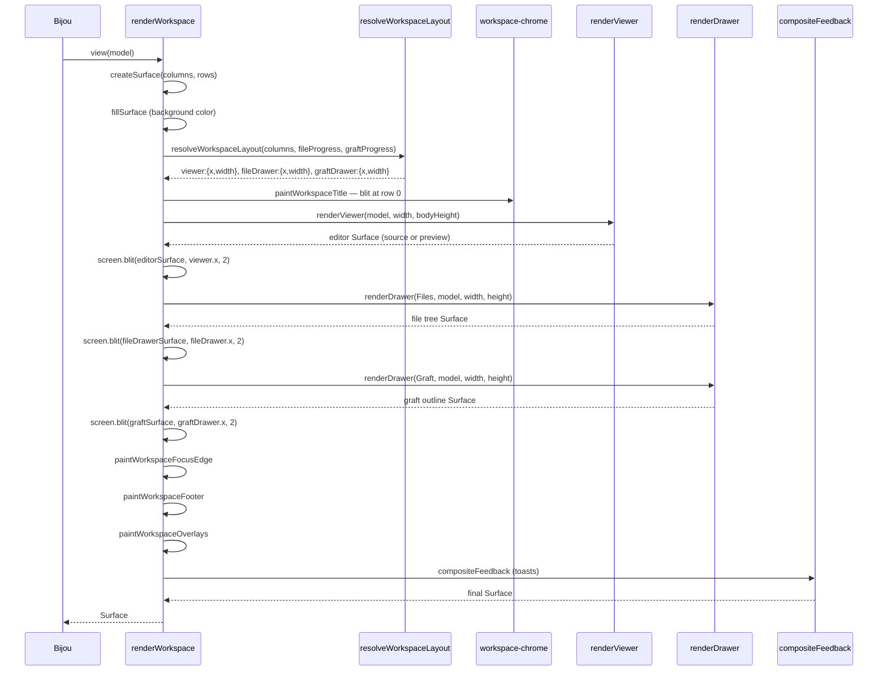

### Layout as Pure Math

`resolveWorkspaceLayout` maps three numbers (terminal columns, file drawer progress 0–1, graft drawer progress 0–1) to three pixel rectangles. The animation is implicit — the layout function is called every frame, and the progress values in the model are incremented by animation `Cmd`s over time. There is no "animation system" — the animation is just model state advancing on a timer.

### Surface Composition via `blit`

A `Surface` is a 2D array of styled cells. `screen.blit(source, x, y)` copies cells from `source` into `screen` at position `(x, y)`. The final `renderWorkspace` result is one fully composed `Surface` representing the entire terminal frame. Bijou diffs this against the previous frame and emits only the ANSI sequences for changed cells.

### The Markdown Preview Lens

When `viewMode === ViewModes.Preview` and the active file is `.md`, `renderViewer` calls `renderMarkdownPreview`. This is a deliberately minimal text transform:

- `# Heading` → `HEADING` (uppercased, stripped of `#`)
- `- item` / `* item` → `• item`
- `> quote` → `│ quote`
- Fenced code blocks → blank lines

No Markdown parser is imported. The lens is zero-dependency, fast, and correct enough for the current goal. Richer preview fidelity is on the roadmap.

---

## 14. The Text Editing Domain — Three Pure Contracts

The `src/domain/` layer has **zero external dependencies**. These files contain the mathematical core of the text model and could run identically in a browser, Node.js, or a Rust-compiled WASM module.

### Contract 1: `TextEditContract` — UTF-8 Byte-Precise Rope Operations

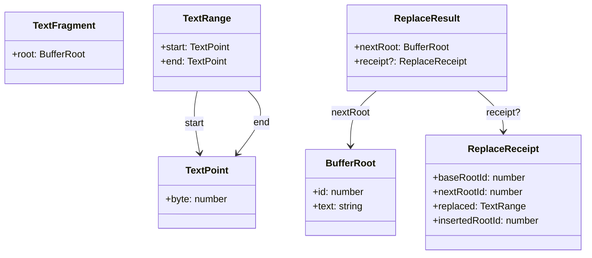

`replaceRange(baseRoot, range, fragment)` is the single most important function in the domain:

1. UTF-8 encode `baseRoot.text` → `Uint8Array`
2. Validate range: `start.byte <= end.byte`, both within `[0, byteLength]`
3. **Validate UTF-8 boundaries**: attempt `decodeText` on the sub-arrays `[0..start]` and `[end..]`. A split in the middle of a multi-byte character causes `decodeText` to throw; the contract re-throws as `TextEditContractError(REPLACE_RANGE_ERROR_INVALID_UTF8_BOUNDARY)`.
4. **No-op detection**: byte-compare the to-be-replaced region against the insertion bytes. If identical, return `{ nextRoot: baseRoot }` with no receipt — no tick is generated, no history entry created.
5. Concatenate prefix + inserted + suffix into a new `BufferRoot` with the next globally-incrementing `id`.
6. Return `{ nextRoot, receipt }` with full provenance.

The no-op detection is a clever optimization: pressing `x` on an empty line would otherwise generate a tick, an undo entry, and a dirty flag — all for doing nothing. The contract suppresses this at the lowest level.

### Contract 2: `TickAdmissionContract` — Ordered Admitted Rewrites

The contiguity invariant is strict: tick IDs must be dense integers (`1, 2, 3, …`). No gaps. The `currentRoot.id` must match the `rootId` of the most recently admitted tick.

```
admitReplaceRangeTick :: (TickAdmissionState, TextRange, TextFragment) → TickAdmissionResult
```

This invariant is what makes the tick sequence a **causal chain** rather than an unordered bag of edits. Because each tick's `rootId` matches the next tick's `currentRoot`, you can replay any prefix of the tick sequence and arrive at a deterministic intermediate state.

### Contract 3: `EditGroupContract` — Undo Unit Management

Edit groups map ticks to product-level undo actions. One keystroke → one open group → one close → one group receipt.

```
openEditGroup → [includeTickInOpenGroup × N] → closeEditGroup → EditGroupReceipt?
```

Closing an empty group is a no-op (no receipt). This handles the case where a keystroke motion (e.g., `w` to move forward a word) opens a group but produces no text change tick — the group is silently discarded.

---

## 15. Anatomy of a Payload

This section shows exactly what data looks like as it moves through the system.

### Payload A: Intent Request (app → transport)

When the user types `h` in a buffer that currently contains `ello`:

```json
{
  "kind": "jedit.intent-request",
  "operationName": "replaceRangeAsTick",
  "input": {
    "worldlineId": "wl:1",
    "baseHeadId": "hd:1",
    "startByte": 0,
    "endByte": 0,
    "insertText": "h",
    "author": "jedit-text-buffer-optic"
  },
  "session": {
    "worldline": {
      "worldlineId": "wl:1",
      "bufferKey": "src/main.ts",
      "canonicalHeadId": "hd:1",
      "projectionPath": "src/main.ts",
      "createdAtRopeRewriteId": null
    },
    "state": {
      "path": "src/main.ts",
      "currentRoot": { "id": 1, "text": "ello" },
      "roots": [{ "id": 1, "text": "ello" }],
      "ticks": [],
      "editGroups": [],
      "openEditGroup": null,
      "checkpoints": [{ "id": 1, "rootId": 1, "path": "src/main.ts" }]
    },
    "tickMetadata": [],
    "checkpointMetadata": [{ "checkpointId": 1, "kind": "INITIAL" }]
  }
}
```

**Notable**: The entire buffer state is serialized with every request. The fake transport is stateless — it derives all execution context from the session payload. This is why the payload is large. The real Echo WASM transport will not need the full state in every request (Echo maintains its own persistent state), but the codec is intentionally identical for both transports.

### Payload B: Intent Response (transport → app)

```json
{
  "status": "OK",
  "operationName": "replaceRangeAsTick",
  "execution": {
    "nextSession": {
      "worldline": {
        "worldlineId": "wl:1",
        "bufferKey": "src/main.ts",
        "canonicalHeadId": "hd:2"
      },
      "state": {
        "path": "src/main.ts",
        "currentRoot": { "id": 2, "text": "hello" },
        "roots": [
          { "id": 1, "text": "ello" },
          { "id": 2, "text": "hello" }
        ],
        "ticks": [{ "id": 1, "rootId": 2 }],
        "editGroups": [],
        "checkpoints": [{ "id": 1, "rootId": 1, "path": "src/main.ts" }]
      },
      "tickMetadata": [{ "tickId": 1, "kind": "REPLACE_RANGE_AS_TICK" }],
      "checkpointMetadata": [{ "checkpointId": 1, "kind": "INITIAL" }]
    },
    "worldline": { "worldlineId": "wl:1", "canonicalHeadId": "hd:2" },
    "nextHead": {
      "headId": "hd:2",
      "worldlineId": "wl:1",
      "rootNodeId": "root:2",
      "byteLength": 5,
      "lineCount": 1,
      "utf16Length": 5,
      "equivalenceDigest": "sha256:2cf24dba5fb0a30e26e83b2ac5b9e29e1b161e5c1fa7425e73043362938b9824"
    },
    "ropeRewrite": {
      "ropeRewriteId": "rw:1",
      "worldlineId": "wl:1",
      "kind": "REPLACE_RANGE_AS_TICK",
      "sequenceNumber": 1
    },
    "ropeDiff": {
      "ropeDiffId": "rd:1",
      "ropeRewriteId": "rw:1",
      "baseHeadId": "hd:1",
      "nextHeadId": "hd:2",
      "rewriteKind": "REPLACE_RANGE_AS_TICK",
      "startByte": 0,
      "endByte": 0,
      "insertedByteLength": 1,
      "deletedByteLength": 0,
      "inverseFragmentDigest": null,
      "summary": "replace 0..0"
    }
  }
}
```

**Notable**: The `ropeDiff` includes `inverseFragmentDigest` — the hash of the bytes that were deleted. When content is deleted, this field holds the hash of the removed fragment. This is how undo-as-inverse-history will work: the inverse operation can verify it is reversing the correct edit by checking the digest before applying.

### Payload C: Observed Text Window (transport → app)

After a `textWindow` observe call, the envelope returned:

```json
{
  "status": "OK",
  "operationName": "textWindow",
  "envelope": {
    "frontierRef": "frontier:text-buffer-optic:src/main.ts",
    "readingId": "reading:1",
    "receiptId": "receipt:rw:1",
    "retainedEvidence": {
      "kind": "retained-evidence-inventory",
      "retainedRefs": [],
      "posture": "missing_retention"
    },
    "reading": {
      "worldline": { "worldlineId": "wl:1", "canonicalHeadId": "hd:2" },
      "head": { "headId": "hd:2", "byteLength": 5, "lineCount": 1 },
      "readingId": "reading:1",
      "startLine": 0,
      "lineCount": 1,
      "totalLineCount": 1,
      "hasMoreBefore": false,
      "hasMoreAfter": false,
      "lines": [
        { "lineNumber": 0, "text": "hello", "startByte": 0, "endByte": 5 }
      ]
    }
  }
}
```

**Notable**: The `posture: "missing_retention"` field is an explicit statement that durable replay evidence is not yet wired. The system knows what it does not yet prove — this is an architectural honesty invariant, not a TODO comment.

---

## 16. The Hot Text Runtime Adapter

`createInMemoryHotTextRuntime()` implements `HotTextRuntimePort` by composing the three domain contracts into a stateful buffer.

> **Data Source of Truth: `HotTextBufferState`**
> For the default (non-WASM) transport, all buffer text, tick history, edit groups, and checkpoints live in a `HotTextBufferState` object inside a `JeditWorldlineSession`. This is JavaScript heap memory with no persistence. Closing jedit loses all Echo-side history; the saved file on disk remains the durable record.

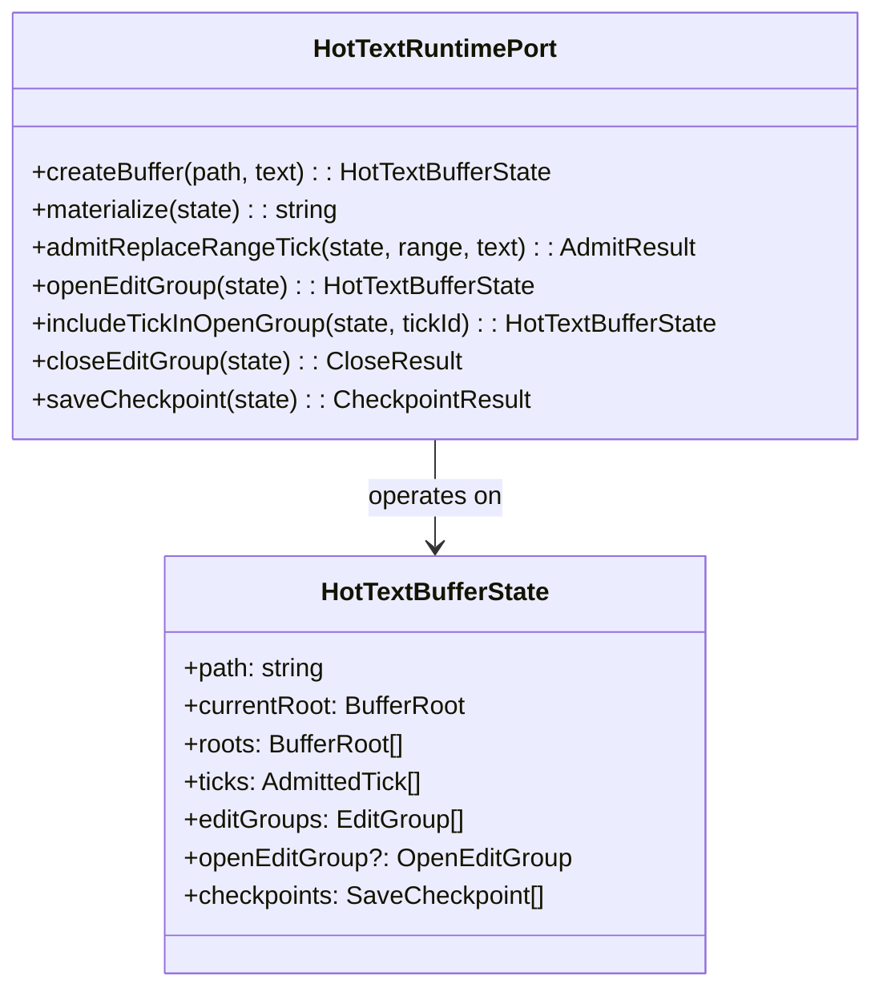

The adapter is **functionally stateless** — it is a collection of pure functions. State is owned by the caller (`JeditWorldlineSession`) and passed in on every call. This is an unusual design choice in JavaScript (where classes holding `this` state are the norm) but it makes testing trivial: you can call any function with any constructed state and assert the output without any setup/teardown.

The extraction pattern:
```typescript
function toTickAdmissionState(state: HotTextBufferState): TickAdmissionState {
  return createTickAdmissionState(state.currentRoot, state.ticks);
}
```

This appears for every domain contract the adapter composes. It is verbose but explicit — there is never ambiguity about which contract is being invoked with which subset of state.

---

## 17. The TextBufferOptic — The Capability Boundary

The `TextBufferOptic` is the most architecturally significant abstraction in `jedit`. It is the interface through which application code accesses text buffers. **App code never sees raw worldline IDs, rope head IDs, or any Echo substrate coordinate.**

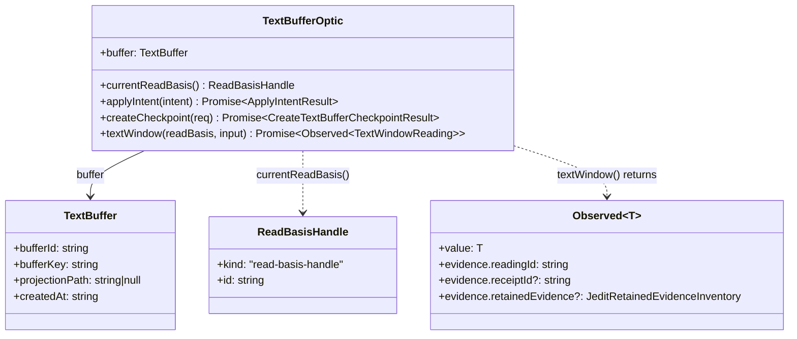

### The `Observed<T>` Generic — Evidence-Bearing Reads

`textWindow` returns `Observed<TextWindowReading>` rather than a bare `TextWindowReading`. The `evidence` field carries the causal provenance of the reading: which head it was taken against, which tick receipt was current, and what the retention posture is. This makes every visible reading **auditable** — you can ask "why does the screen show this?" and get a traceable answer back to the specific tick that produced it.

---

## 18. Security Boundaries and Auth Flows

`jedit` is a local desktop tool, not a multi-user server. Its "security" concerns are about **authority separation** — ensuring that application code cannot acquire capabilities it was not granted, and that Echo substrate coordinates cannot be manufactured by app-layer code.

### Capability 1: `ReadBasisHandle` — Object Identity as Authorization

A `ReadBasisHandle` is `{ kind: "read-basis-handle", id: string }`. App code holds one. It passes it to `textWindow()`. Inside `ReadBasisHandleRegistry`:

```typescript
// In ReadBasisHandleRegistry (src/app/read-basis-handle-registry.ts)
private readonly bindings = new WeakMap<ReadBasisHandle, ReadBasisBinding>();

public createForSession(session: JeditWorldlineSession): ReadBasisHandle {
  const handle = Object.freeze({ kind: READ_BASIS_HANDLE_KIND, id: `read-basis:${this.nextHandleId}` });
  this.bindings.set(handle, { worldlineId: session.worldline.worldlineId });
  return handle;
}

public resolveWorldlineId(session: JeditWorldlineSession, handle: ReadBasisHandle): string {
  const binding = this.bindings.get(handle);
  if (binding === undefined || binding.worldlineId !== session.worldline.worldlineId) {
    throw new ReadBasisHandleResolutionError();
  }
  return binding.worldlineId;
}
```

**Why `WeakMap`**: A `WeakMap` is keyed on *object identity* — the exact same JavaScript object reference, not a value that equals it. You cannot forge a handle by constructing `{ kind: "read-basis-handle", id: "read-basis:0" }` — that is a *different object* and will not exist in the map. The handle is unforgeable and unclonable by construction. This is a rare case where JavaScript's reference semantics are used as an access-control mechanism.

**Why `Object.freeze`**: The handle is frozen so it cannot be mutated after creation. App code cannot write to `handle.id = 'something-else'` to try to match a different binding.

### Capability 2: App / Host Authority Split

The Echo integration enforces a hard separation between **application authority** and **trusted host authority**:

| Application code (`jedit` app layer) | Trusted host code (lifecycle adapter) |
|---------------------------------------|----------------------------------------|
| Submit edit intents | Install Echo packages |
| Observe text windows | Start/stop the Echo runtime |
| Create checkpoints | Control the scheduler |
| Hold `ReadBasisHandle` | Fault recovery |

Application code can call `submitIntentBytes` and `observeBytes`. It cannot call lifecycle methods that control the scheduler or runtime. The lifecycle adapter lives in `src/adapters/echo-runtime-lifecycle.ts` and is wired by `workspace-production-text-session.ts` at app construction time — not accessible through any port that application code holds.

This mirrors how operating systems separate user space from kernel space. The Echo runtime is the "kernel"; the lifecycle adapter is the trusted supervisor; `jedit` application code is user space.

### Capability 3: Zod Validation as the Trust Boundary

The adapter layer is the only place external data is trusted. Every byte array that enters from the Echo transport is parsed and validated by Zod before any domain code touches it. Any schema violation throws at the adapter boundary. Domain code never receives unvalidated data.

This means the domain contracts' invariant checks (contiguous tick IDs, positive root IDs, etc.) are safety-net validations, not primary defenses. The primary defense is at the codec layer.

---

## 19. The Echo Transport Architecture

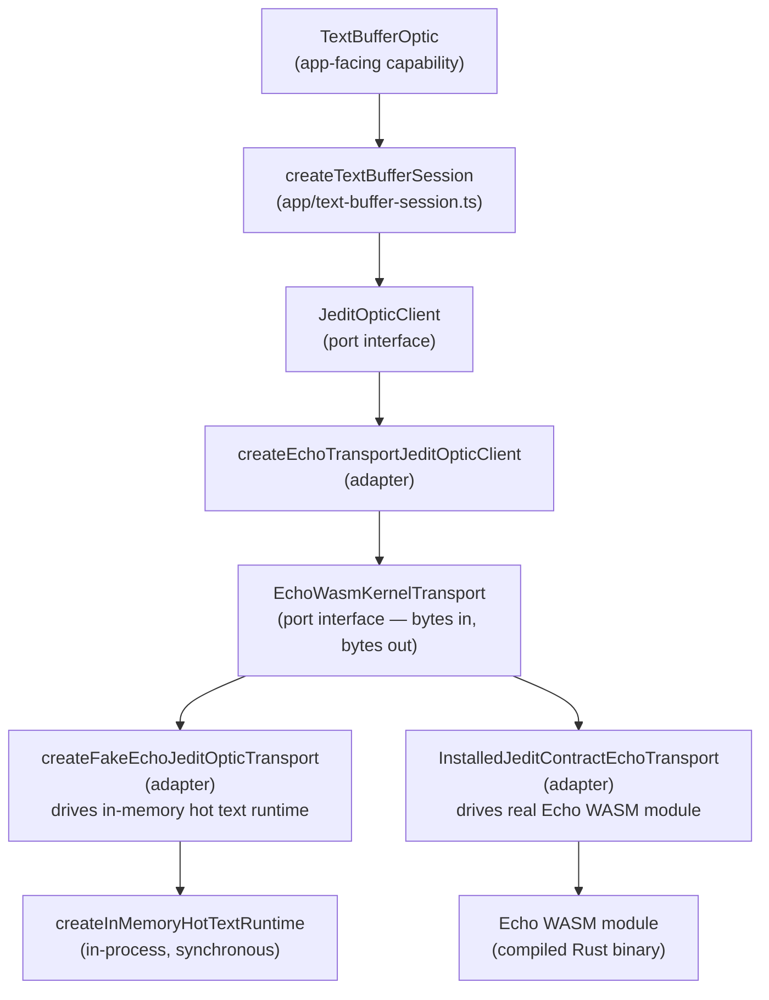

### `EchoWasmKernelTransport` — The Byte-Level Interface

```typescript
interface EchoWasmKernelTransport {
  kernelInfo(): EchoKernelInfo;
  submitIntentBytes(intentBytes: Uint8Array): Uint8Array;
  observeBytes(requestBytes: Uint8Array): Uint8Array;
  schedulerStatusBytes(): Uint8Array;
}
```

Every call is **bytes in, bytes out**. This interface mirrors the real WASM ABI: WASM modules receive and return linear memory slices, not JavaScript objects. Using `Uint8Array` at this boundary means the codec is exercised under the same conditions as real WASM I/O — the fake transport provides the same validation pressure as the real one.

### The Intent/Observe Split

Echo separates writes from reads at the protocol level:

- **Intent** (`submitIntentBytes`) — mutations: `createBufferWorldline`, `replaceRangeAsTick`, `createCheckpoint`
- **Observe** (`observeBytes`) — queries: `worldlineSnapshot`, `textWindow`

This split reflects the Echo scheduler model. Intent admission requires scheduler authorization. Observations are reads against already-admitted state. Separating at the byte level makes the authorization boundary explicit in the protocol, not just in documentation.

---

## 20. The Codec Layer — JSON Serialization and Zod Validation

`src/adapters/jedit-echo-optic-codec.ts` is the only place `JSON.stringify` and `JSON.parse` happen for the Echo transport. It is the sole I/O boundary between typed objects and wire bytes.

### Decoding Pipeline

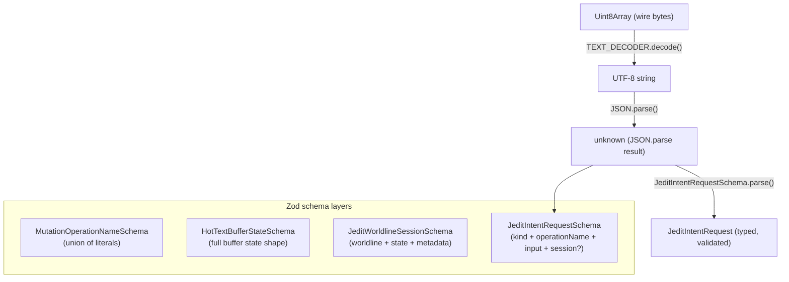

The Zod schemas are strict: `z.number().int()` for tick IDs (rejects floats), `z.literal('replaceRangeAsTick')` for operation names (rejects typos), `z.array(...)` with typed elements for all collections. A malformed payload throws `ZodError` at the adapter boundary, converted to a `RuntimeIssue` toast by `routeRuntimeIssue`.

### Encoding: JSON now, Binary Later

The current wire format is human-readable JSON. The README notes these are "fixture bytes — human-readable scaffolding, not the durable Wesley runtime codec." The `src/codec.ts` file at the repo root already implements a little-endian binary reader/writer (`Writer`, `Reader`) for the eventual migration to Wesley-generated binary codecs. The migration path is: keep the codec interface identical (`Uint8Array` in/out), replace the JSON body with binary-encoded fields. No other layer needs to change.

---

## 21. Unhappy Paths and Error Handling

The system defines failure at four distinct levels. Here is what happens at each.

### Level 1: Domain Contract Violation

A domain contract error is a *programming error* — it means a caller passed invalid arguments (e.g., a non-contiguous tick ID, a byte range that splits a UTF-8 sequence). These throw typed errors:

- `TextEditContractError(code, message)` — invalid range, out of bounds, invalid UTF-8 boundary
- `TickAdmissionContractError(code, message)` — non-contiguous tick IDs, root mismatch
- `EditGroupContractError(code, message)` — invalid group state, unknown tick

These errors are never caught silently. They propagate up to the fake transport's `executeIntent` function, which catches them and returns a `OBSTRUCTED` response with `code: 'JEDIT_CONTRACT_RUNTIME_ERROR'`.

### Level 2: Transport Obstruction (`OBSTRUCTED` status)

The transport can return an `OBSTRUCTED` response for any operation:

```json
{
  "status": "OBSTRUCTED",
  "operationName": "replaceRangeAsTick",
  "obstruction": {
    "code": "BASE_HEAD_MISMATCH",
    "message": "The supplied baseHeadId does not match the worldline's current canonical head.",
    "recovery": "refresh reading and retry",
    "worldlineId": "wl:1",
    "requestedBaseHeadId": "hd:1",
    "currentHeadId": "hd:3"
  }
}
```

The `BASE_HEAD_MISMATCH` case is the most important — it means two edits raced. The user typed something, a concurrent process also changed the buffer, and the base head the app submitted is now stale. The `recovery` field is a human-readable hint; the app layer translates this into a `RuntimeIssue` toast.

**Current behavior on obstruction**: A toast appears ("Text edit failed"). The `EditorState.lines[]` already reflects the optimistic edit (the character was rendered immediately). The Echo session did not advance. This is an acknowledged gap — the model shows the optimistic state, but the Echo worldline does not. A full resolution would require rolling back `lines[]` or retrying with a fresh base head.

### Level 3: Codec / Protocol Error

`decodeJeditIntentRequest` throws `InvalidJsonPayloadError` if the bytes are not valid UTF-8 JSON, or `ZodError` if the JSON doesn't match the schema. These indicate a protocol mismatch — the sender and receiver disagree on the wire format.

In the fake transport these errors should be impossible (the same process encodes and decodes). In the real WASM transport they indicate a version mismatch between `jedit` and the Echo WASM module. The error propagates as a `RuntimeIssue`.

### Level 4: External Process Failure

**Graft process crash**: The MCP session catches all errors and converts them to a `GraftInfo` with empty content. The graft drawer shows nothing. The editor continues to work normally — structural intelligence is enrichment, not critical path.

**Filesystem error on open**: `loadEditorFile` catches all `fs.readFileSync` errors and returns a read-only single-line buffer containing the error message string. The editor opens in read-only mode with the error visible. This is an intentional UX decision — the error state is visible and recoverable (the user can close and reopen).

**Filesystem error on save**: The `saveEditor` function calls `editorFile.saveEditorFile`. If the write fails, the error propagates as an unhandled promise rejection in the Cmd, which `routeRuntimeIssue` converts to a `RuntimeIssue` toast. The `dirty` flag remains `true` — the buffer is still considered unsaved.

### `routeRuntimeIssue` — The Last Resort Handler

```typescript
routeRuntimeIssue: (issue) => ({ type: WorkspaceMessageTypes.RuntimeIssue, issue }),
```

Bijou calls this when a `Cmd` throws an unhandled error. It converts the raw `RuntimeIssue` into a typed workspace message. `pushRuntimeIssueToast` then adds it to `notifications`, which renders as a timed toast in the UI. This is the catch-all — any error that escapes its designated handler ends up here rather than crashing the process.

---

## 22. The GraphQL SDL and Wesley Code Generation

The `contracts/jedit/rope.graphql` file is the **canonical authority** for jedit's data model.

### The `@wes_footprint` Directive — The Most Interesting Thing in the Repo

This directive is architecturally novel enough to warrant deep examination. Every mutation declares an explicit **access manifest**:

```graphql
replaceRangeAsTick(input: ReplaceRangeAsTickInput!): ReplaceRangeAsTickResult!
    @wes_footprint(
        reads:   ["BufferWorldline", "RopeHead", "RopeBranch", "RopeLeaf", "TextBlob", "Anchor"]
        writes:  ["BufferWorldline"]
        creates: ["TextBlob", "RopeLeaf", "RopeBranch", "RopeHead", "RopeRewrite", "RopeDiff"]
        slots: [
            { slot: "worldline", bindFromArg: "input.worldlineId", access: [READ, WRITE] },
            { slot: "baseHead",  bindFromArg: "input.baseHeadId",  access: [READ] }
        ]
        closures: [
            {
                slot: "touchedRope",
                fromSlot: "baseHead",
                operator: "ropeRangeClosure",
                argBindings: ["input.startByte", "input.endByte"],
                reads: ["RopeBranch", "RopeLeaf", "TextBlob"],
                cardinality: MANY
            }
        ]
        forbids: ["AstState", "Diagnostics", "GitWitness", "UiState"]
    )
```

What makes this remarkable is the `forbids` list. This is **negative capability declaration**: the mutation explicitly states which entity kinds it is *not allowed to touch*. A `replaceRangeAsTick` must not touch AST state, diagnostics, Git history, or UI state. If someone adds a side effect that reads diagnostics while applying a text edit, the footprint guard will catch it.

The `closures` section is equally interesting. The `touchedRope` closure says: "starting from the `baseHead` slot, walk the rope DAG using the `ropeRangeClosure` operator, bounded by `[startByte, endByte]`, and collect all `RopeBranch`, `RopeLeaf`, and `TextBlob` nodes you touch." This is a **declarative traversal specification** — Wesley uses it to generate the exact minimal read set for the operation, enabling Echo's scheduler to reason about conflicts without needing to understand rope tree internals.

### Generated Artifacts

| File | Contents |
|------|----------|
| `rope.types.generated.ts` | TypeScript interfaces and operation maps |
| `rope.zod.generated.ts` | Zod schemas for every type + operation result validation |
| `rope.wesley.generated.ts` | Operation metadata objects (field names, operation IDs, request shapes) |

---

## 23. The Structural History Path

The structural history path is a second, parallel contract surface for the editor's history model — a complement to the rope schema, modeling the *history taxonomy* rather than the raw substrate.

```
contracts/jedit/structural-history.graphql
    → scripts/gen-structural-history-wesley.mjs (installs wesley-cli 0.0.4)
    → .wesley-cache/structural-history.wesley.generated.ts
    → src/generated/jedit/structural-history-replace-text-range.wesley.generated.ts
    → src/app/structural-history-replace-text-range.ts
    → applyBufferEdit() result carries generated replaceTextRange operation identity
```

The key distinction from the rope schema: the rope schema models the substrate (rope nodes, ticks, checkpoints). The structural-history schema models the **product-level event taxonomy** — revisions, replacements, edit groups, provenance, command status. It names things from the editor user's perspective.

This is a **staged migration pattern**: the generated metadata owns the operation identity (`replaceTextRange` operation name, operation ID) before the full Echo-backed execution exists. The runtime still runs the old in-memory code path. The contract authority is established first; execution migrates later. This prevents the contract from diverging from the runtime during migration.

---

## 24. Graft Integration — Structural Intelligence via MCP

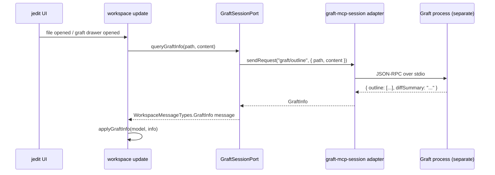

The `GraftInfo` payload carries an `outline` (list of structural symbols with `{ kind, name, startLine }`) and a diff summary string. The graft drawer renders this as a navigable list.

**Transport is not architecture**: The MCP-over-stdio path is explicitly noted as transitional. The long-term posture is Graft as a built-in engine with a direct API surface, not a separate process. The port interface (`GraftSessionPort`) already abstracts away the transport — switching from stdio MCP to a native binding would be a single adapter replacement.

---

## 25. Golden Path: Opening and Editing a File

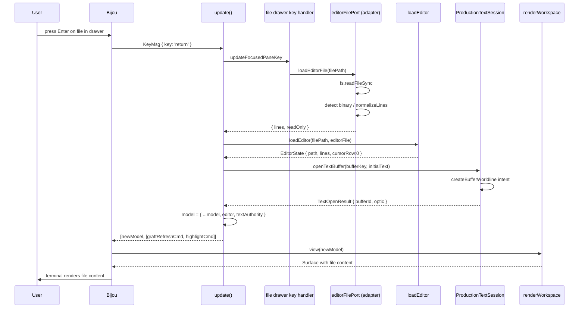

**Two parallel truths**: The editor renders from `EditorState.lines` (fast, synchronous). The `TextBufferOptic` maintains a parallel Echo-backed worldline. Edits go to both. This dual-track is explicit and documented — it is not accidental drift, and it will be resolved when the Echo path becomes the single rendering source.

---

## 26. Golden Path: A Keystroke to Terminal Pixels

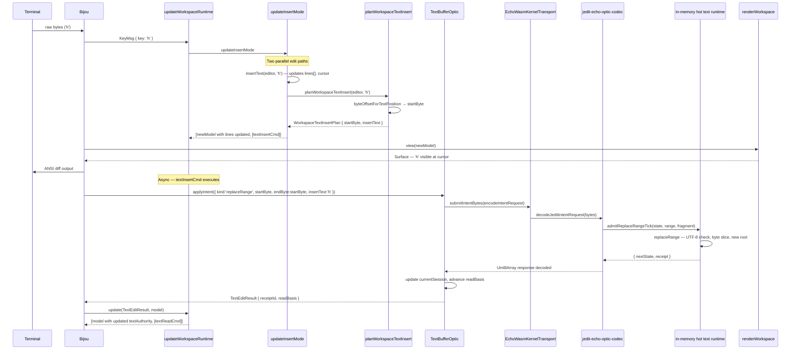

**Optimistic rendering** is the key design here. Frame 1 renders the character from `lines[]` immediately — before the Echo transaction begins. The user sees zero latency. The Echo round-trip updates `textAuthority` evidence asynchronously. If the Echo transaction fails (OBSTRUCTED), the optimistic render is already committed to the screen but `textAuthority` is not advanced — the next read will reveal the mismatch via stale evidence.

---

## 27. Architectural Trade-offs

Every significant decision in `jedit` is a deliberate compromise. This section names them explicitly.

### Trade-off 1: Snapshot Undo vs. Delta Undo

**Current**: Full `EditorState` snapshots on every mutation. Simple, correct, and requires zero domain complexity.

**Cost**: Memory scales linearly with edit count. A session with 1,000 edits on a 50KB file holds ~50MB of undo history in the worst case. Snapshots include the entire `lines[]` array, not just the diff.

**Future direction**: Echo-backed tick-history undo. Each tick carries a `ReplaceReceipt` with `inverseFragmentDigest`. Undo becomes "replay the inverse of this tick" — O(1) extra storage per edit. The migration path requires resolving the dual-track problem first.

**Why not done now**: Building Echo-backed undo requires Echo to be stable and to support durable replay. The current architecture correctly prioritizes proving the seam before migrating the implementation.

---

### Trade-off 2: Dual-Track Text (lines[] + Echo)

**Current**: `EditorState.lines[]` is the rendering source. `TextBufferOptic` maintains a parallel Echo worldline. Both advance on every edit.

**Gain**: The editor works immediately and reliably. The Echo proof advances in parallel without blocking the UI. If Echo fails, the editor degrades gracefully.

**Cost**: Two sources of truth for the same buffer content. They *should* be identical at all times, but there is no enforcement of this invariant. A bug in the byte-offset calculation, a Unicode edge case, or an Echo obstruction that isn't rolled back could silently diverge the two representations. This divergence would only be visible when the Echo read path is used for display.

**Why accepted**: This is an explicitly named transitional design. The architecture document says so. The alternative — waiting until Echo is ready before implementing any text editing — would stall the editor indefinitely.

---

### Trade-off 3: JSON Codec vs. Binary Codec

**Current**: Wire format is JSON. Every intent/observe request is `JSON.stringify` → UTF-8 bytes. Every response is UTF-8 bytes → `JSON.parse`.

**Gain**: Human-readable. Trivial to debug (just log the bytes and read the JSON). The encoding is deterministic and diff-friendly.

**Cost**: Verbose. A `replaceRangeAsTick` request for a single character insertion carries the entire `HotTextBufferState` serialized as JSON — potentially hundreds of bytes for a one-character edit. For the in-process fake transport, this is negligible (JSON parse is microseconds). For a real WASM transport with linear memory copies, it would be a bottleneck.

**Future direction**: Wesley-generated binary codecs. The `src/codec.ts` little-endian binary reader/writer is already in the repo as a skeleton. The migration requires replacing the codec functions (`encode/decode`) without changing any other layer — the `Uint8Array` transport boundary is already correct.

---

### Trade-off 4: Fake Echo Transport for Tests

**Current**: All default tests use `createFakeEchoJeditOpticTransport` — an in-process, synchronous implementation of the Echo behavior backed by `HotTextBufferState`.

**Gain**: Tests are hermetic, fast, and have zero external dependencies. No sibling repository checkout required. The entire test suite runs in milliseconds.

**Cost**: The fake transport is not Echo. If Echo's real behavior diverges from the fake's behavior (e.g., Echo validates something the fake doesn't, or Echo produces a slightly different response shape), tests will pass while production fails. This is the classic mock/stub risk.

**Mitigation**: The opt-in real WASM witness (`scripts/jedit-echo-witness.mjs`) exercises the real transport. The codec's Zod validation provides schema-level compatibility guarantees. The `@wes_footprint` SDL is the shared contract that both sides generate from. The architecture acknowledges this risk explicitly: "The important invariant is that app-facing jedit assertions do not care whether the transport is fake or real."

---

### Trade-off 5: TEA Immutability vs. Mutable Object Patterns

**Current**: The entire `WorkspaceModel` is replaced on every state change via object spread. A single keypress that moves the cursor produces a new `WorkspaceModel`, a new `EditorState`, and a new `lines[]` array reference (though the contents are the same array — JavaScript spread is shallow).

**Gain**: No mutable state. No action-at-a-distance bugs. The model at any point in time is a pure value. Testing `update` is as simple as calling it with a known model and asserting the output.

**Cost**: Garbage collection pressure. Every keypress allocates several new objects. For a typical session this is entirely acceptable — V8's GC handles short-lived small objects efficiently. For a very large buffer (hundreds of thousands of lines) with rapid edits, the frame time impact could become perceptible.

**Trade-off clarity**: The immutability guarantee is worth the GC cost for the correctness properties it provides. This is not a decision that needs revisiting until profiling reveals actual frame-time problems.

---

### Trade-off 6: `WeakMap` Capability for `ReadBasisHandle`

**Current**: `ReadBasisHandleRegistry` uses a `WeakMap` keyed on handle object identity to store the `worldlineId` binding.

**Gain**: Handles are unforgeable by construction. No capability can be manufactured by app code. Memory is automatically reclaimed when the handle is GC'd (no manual cleanup required).

**Cost**: The handle must stay alive in JavaScript's heap while it is needed. If the optic holds the only reference and it is GC'd prematurely, the binding is lost. In practice this is not a problem because the `WorkspaceModel` holds `currentReadBasis` and is always reachable.

**Interesting property**: Using `WeakMap` means the capability registry does not prevent the handle from being garbage collected. This is the correct behavior — a handle that nothing holds a reference to is a handle that nobody can use, so its binding can be cleaned up automatically.

---

### Trade-off 7: Stateless Runtime Functions vs. Stateful Classes

**Current**: `HotTextRuntimePort` is a set of pure functions that take and return `HotTextBufferState`. There is no `HotTextRuntime` class with a `this.state` field.

**Gain**: Functions are trivially testable — pass any state, assert the output, no setup/teardown. Functions compose naturally. State ownership is explicit — the caller decides where to put the state.

**Cost**: Every call requires passing the full state object. For deeply nested call chains, the state must be threaded through every function signature. This can be verbose.

**Why it's right here**: The state lives in `JeditWorldlineSession`, which is owned by the transport layer. The transport layer is the right place for state ownership — it is the boundary between application code and the runtime substrate. Putting state there and passing it to pure functions produces a clear ownership model with no hidden side channels.

---

### Trade-off 8: O(n) Normal-Mode Command Lookup

**Current**: Normal-mode commands are matched by linear scan over a ~25-element array, building a descriptor string for each entry and comparing.

**Cost**: O(n) per keypress in normal mode. For 25 commands, this is ~25 string comparisons on every key event.

**Why acceptable**: 25 comparisons of short strings is unmeasurable on a modern CPU — certainly less than 1 microsecond. The declarative table format is far more readable and maintainable than a pre-built `Map`. Premature optimization here would trade readability for no perceptible gain.

**When to change it**: If the command table grows to hundreds of entries (unlikely for a Vim-shaped editor) or if profiling shows this function in the hot path, replace with a `Map<string, NormalCommandDefinition>` keyed on the descriptor string.

---

## 28. Architecture Summary

```mermaid
graph TB
    subgraph "External World"
        TERM["Terminal<br />(keystrokes, resize, mouse)"]
        FS["Filesystem<br />(open, read, save)"]
        GRAFT_PROC["Graft Process<br />(MCP over stdio)"]
        ECHO_WASM["Echo WASM<br />(or in-memory fake)"]
    end

    subgraph "jedit"
        MAIN["src/main.ts<br />Entry point, profile resolution"]
        BIJOU_RUN["Bijou run()<br />TEA event loop"]
        subgraph "src/adapters"
            WA["workspace-app<br />Wires all adapters"]
            FEW["fake-echo-jedit-optic-transport<br />In-process fake Echo"]
            IECW["installed-jedit-contract-echo-transport<br />Real Echo WASM bridge"]
            FS_ADAPT["filesystem.ts<br />Node fs wrapping"]
            GRAFT_ADAPT["graft-mcp-session.ts<br />MCP client"]
        end
        subgraph "src/app"
            WR["workspace/runtime.ts<br />init / update / view"]
            TBS["text-buffer-session.ts<br />TextBufferOptic factory"]
            JCR["jedit-contract-runtime.ts<br />Worldline session management"]
            JOR["jedit-observer-runtime.ts<br />Observe with observer plan"]
        end
        subgraph "src/domain"
            TEC["text-edit-contract<br />UTF-8 rope operations"]
            TAC["tick-admission-contract<br />Ordered tick sequence"]
            EGC["edit-group-contract<br />Undo unit grouping"]
            ATC["anchor-transform-contract<br />Byte anchor tracking"]
            SCC["save-checkpoint-contract<br />Save point anchoring"]
        end
        subgraph "src/ui"
            RW["renderWorkspace<br />Surface composition"]
        end
        subgraph "src/generated"
            TYPES["rope.types.generated.ts"]
            ZOD["rope.zod.generated.ts"]
            WES["rope.wesley.generated.ts"]
            SH["structural-history descriptor<br />.wesley.generated.ts"]
        end
    end

    TERM -->|"raw bytes"| BIJOU_RUN
    MAIN --> WA
    WA --> BIJOU_RUN
    BIJOU_RUN --> WR
    WR --> TBS
    TBS --> JCR
    JCR --> TAC
    TAC --> TEC
    JCR --> EGC
    JCR --> SCC
    WA --> FEW
    WA --> IECW
    FEW -->|"synchronous byte calls"| JCR
    IECW -->|"WASM byte calls"| ECHO_WASM
    FS_ADAPT --> FS
    GRAFT_ADAPT --> GRAFT_PROC
    WR --> RW
    ZOD -->|"runtime validation"| JCR
    TYPES -->|"type definitions"| TBS
    WES -->|"operation metadata"| JCR
    SH -->|"operation identity"| JCR
```

The overall shape is clean:

1. **Bijou** owns the event loop and terminal I/O
2. **`src/adapters`** is the only place raw bytes, JSON, and external process calls happen
3. **`src/app`** orchestrates pure state transitions using domain types and port interfaces
4. **`src/domain`** contains the mathematical invariants of the text editing model — fully portable, fully testable, zero external dependencies
5. **`src/ui`** is a pure function from model to pixels
6. **`contracts/`** and **`src/generated/`** form the schema authority and its derived artifacts

The architecture is in deliberate tension: the `EditorState.lines[]` path is simple, fast, and works today; the `TextBufferOptic` / Echo path is the correct long-term design. Both coexist without either pretending the other doesn't exist. That honesty — naming the seam explicitly, having two clearly-labeled paths, defining the migration contract through tests and witnesses — is the architectural signature of this codebase.

The deepest insight: `jedit` treats *product pressure as a test suite for the underlying stack*. The Echo stack does not advance based on protocol theory — it advances when a real editor use case forces a seam to become honest. The `@wes_footprint` directive, the `ReadBasisHandle` capability, the intent/observe split, the receipt evidence in `Observed<T>` — none of these were designed in isolation. Each was forced into existence by the requirements of a working editor that needed provenance, authority separation, and replayable history to function correctly.
