# Jim UI

This topic describes the user-facing screens and reusable UI components in
Jim. It is for dogfooding, support, and implementation review: each page names
how to open the surface, what keys it owns, what state it should reveal, and
where the implementation lives.

Jim is still named `jedit` in repository paths, package names, and several
internal APIs. The UI documentation uses Jim for the product surface and
`jedit` when referring to code.

## Terminal Width Profiles

Jim UI documents use three terminal width profiles:

| Profile | Shape |
| --- | --- |
| `wide` | Desktop-sized terminal with room for the editor, footer posture, and side panels. |
| `narrow` | Tablet-sized terminal where previews and secondary panels may stack or collapse. |
| `xs` | Phone-sized or very small terminal where one focused surface should dominate. |

## Screens And Components

| Page | Surface |
| --- | --- |
| [Title Screen](title-screen.md) | Startup scene, title browser, and first file-open path. |
| [Editor Chrome](editor-chrome.md) | Source viewport, gutter, status footer, dirty state, and cursor position. |
| [Settings Menu](settings-menu.md) | F2 settings drawer, keyboard controls, diagnostics, and change feedback. |
| [Command Line And Completions](command-line-and-completions.md) | Normal-mode `:` input, command help, file completion, and inline suggestions. |
| [Drawers And Panels](drawers-and-panels.md) | File tree, Graft outline, Echo history, diagnostics, and inline why panels. |
| [Help And Discovery](help-and-discovery.md) | `:help`, command descriptions, footer hints, and discoverability rules. |

## UI Rules

Jim UI should feel like one application, not a collection of unrelated
terminal widgets.

- Use theme tokens instead of hardcoded colors.
- Keep focus visible and inspectable.
- Prefer in-place panels, drawers, or inline suggestion boxes over transient
  toasts when the user needs time to read.
- Use toasts for short confirmations, especially setting changes.
- Keep command help close to the command being typed.
- Keep text clipped or wrapped by word boundary inside its viewport.
- Do not let wide Unicode text alter adjacent panel geometry.
- Report editor coordinates as `line:col` when the user is editing source.

## Code Map

| File | Responsibility |
| --- | --- |
| [`src/app/workspace/runtime.ts`](../../../src/app/workspace/runtime.ts) | Workspace model update loop. |
| [`src/app/workspace/key-bindings.ts`](../../../src/app/workspace/key-bindings.ts) | Top-level key routing across modes and overlays. |
| [`src/app/workspace/viewer-overlays.ts`](../../../src/app/workspace/viewer-overlays.ts) | Overlay composition for settings, drawers, diagnostics, and inline panels. |
| [`src/ui/workspace-render.ts`](../../../src/ui/workspace-render.ts) | Terminal surface rendering and clipping helpers. |
| [`src/ui/workspace-chrome.ts`](../../../src/ui/workspace-chrome.ts) | Header and footer chrome. |
| [`src/ui/jedit-themes.ts`](../../../src/ui/jedit-themes.ts) | Theme definitions and tokens. |
