# Command Line And Completions

Jim's command line is the Normal-mode `:` surface. It is the main path for
Vim-shaped commands, command discovery, file opening, and future command
arguments.

## How To Access It

Press `:` in Normal mode. The footer becomes a command input row.

Close command input with `Esc`. Run the command with `Enter`.

## Completion Behavior

As the user types, Jim can show an inline completion popup near the command
line. The popup should:

- stay anchored to the command cursor;
- flip above the footer if there is not enough room below;
- support arrow-key navigation;
- support `Tab` to accept the selected completion;
- show command details when available;
- preserve the typed prefix when completing arguments.

Completions are not a separate mode. They are part of command-line input.

## Commands

Common commands:

| Command | Purpose |
| --- | --- |
| `:edit <path>` | Open a file or descend into a directory completion. |
| `:write` | Save the current buffer. |
| `:quit` | Quit when it is safe. |
| `:wq` | Write and quit. |
| `:ttd` | Observe a causal tick without moving canonical head. |
| `:strand` | Create, switch, or list copy-on-write strands. |
| `:braid` | View, preview, or admit braid candidates. |
| `:why` | Explain the last meaningful command. |
| `:help` | Open help and command discovery. |

The completion list should show argument help for commands that need arguments.
For example, `:edit` should explain that it expects a path and should complete
files and directories from the current workspace basis.

## File Completion

`:edit <path>` uses file completion. Selecting a file opens it. Selecting a
directory descends into that directory and keeps command input active so the
user can choose a child entry.

This behavior should be the same from the title screen and from an opened
editor buffer.

## Help Inline With Input

When the selected command has required arguments or important variants, Jim
should show help close to the completion list. That help can be an inline
description row, a suggestion-style box above the popup, or a preview area when
space allows.

The command line should not require users to guess how `:strand`, `:braid`, or
`:ttd` are shaped.

## Implementation Map

| File | Responsibility |
| --- | --- |
| [`src/app/workspace/command-line.ts`](../../../src/app/workspace/command-line.ts) | Command-line state and dispatch helpers. |
| [`src/app/workspace/command-completion.ts`](../../../src/app/workspace/command-completion.ts) | Command and argument completion. |
| [`src/ui/inline-completion-popup.ts`](../../../src/ui/inline-completion-popup.ts) | Completion popup rendering. |
| [`src/ui/inline-completion-popup-geometry.ts`](../../../src/ui/inline-completion-popup-geometry.ts) | Popup placement and flipping. |
| [`src/app/workspace/file-tree.ts`](../../../src/app/workspace/file-tree.ts) | Shared file entry open and directory traversal behavior. |
