# Drawers And Panels

Drawers and panels are secondary Jim surfaces that appear over or beside the
editor without becoming independent applications. They should preserve context,
use theme tokens, and close predictably.

## Common Rules

All drawers and panels should:

- have one clear focused row or focused control;
- keep keyboard instructions in the footer or a compact hint row;
- wrap prose at word boundaries;
- clip paths and machine identifiers only when wrapping is impossible;
- avoid hardcoded foreground or background colors;
- leave the editor buffer unchanged unless the user runs an explicit command.

When a panel is meant for reading, it should stay visible until focus changes,
`Esc` closes it, or a related command replaces it. Time-limited toasts are not
enough for detailed explanations.

## Files Drawer

Open the files drawer with `ctrl+b`.

The files drawer is for browsing workspace entries. It should share file-opening
behavior with `:edit`: selecting a file opens it, and selecting a directory
enters that directory.

## Graft Drawer

Open the Graft drawer with `ctrl+g` when structural data is available.

The Graft drawer is a projection surface. It can show symbols, structure, and
projection posture, but it does not own source text. If the projection is stale
or unavailable, the drawer should say so directly.

## Causal History

Jim does not currently expose a history drawer. The previous drawer projected
process-local entries and was deleted. A replacement must consume a bounded,
basis-pinned Echo observation and must not imply that browsing history moved a
canonical head.

## Diagnostics Panel

Diagnostics can be opened from settings when Graft diagnostics are available.
The panel should appear beside settings when space allows. If terminal width is
tight, the layout may choose a stacked or clipped fallback, but it should not
silently replace the settings drawer without a clear focus transition.

## Inline Why Panel

`:why` and range why explanations are durable reading surfaces. They should be
anchored near the line or command they explain when possible. They should stay
visible until the cursor moves away, the user presses `Esc`, or another command
replaces the explanation.

## Implementation Map

| File | Responsibility |
| --- | --- |
| [`src/app/workspace/viewer-overlays.ts`](../../../src/app/workspace/viewer-overlays.ts) | Overlay composition. |
| [`src/ui/drawer-layout.ts`](../../../src/ui/drawer-layout.ts) | Drawer geometry helpers. |
| [`src/ui/graft-drawer.ts`](../../../src/ui/graft-drawer.ts) | Graft drawer rendering. |
| [`src/ui/graft-diagnostics-panel.ts`](../../../src/ui/graft-diagnostics-panel.ts) | Diagnostics panel rendering. |
| [`src/ui/why-inline-panel.ts`](../../../src/ui/why-inline-panel.ts) | Inline why explanation rendering. |
| [`src/app/workspace/file-tree.ts`](../../../src/app/workspace/file-tree.ts) | File tree state and entry behavior. |
