# Editor Chrome

Editor chrome is the persistent frame around the current buffer: source
viewport, gutter, header title, footer hints, dirty markers, and coordinate
readouts.



## How To Reach It

Open a file from the title screen, files drawer, or command line:

```text
:edit README.md
```

The editor surface becomes active when Jim has a text buffer projection for the
opened file.

## Source Viewport

The source viewport paints the current buffer projection. Jim owns cursoring,
scrolling, text layout, gutter layout, and theme application. Graft can provide
syntax spans, but Graft does not own the buffer.

Expected behavior:

- source text stays aligned when Unicode text is present;
- syntax spans are ignored when stale or unavailable;
- cursor position remains visible in Normal and Insert modes;
- source editing continues even if a projection provider fails.

## Gutter

The gutter is the left-side margin next to source text. It may show absolute
line numbers, relative line numbers, or no line numbers depending on settings.

Line number modes:

| Mode | Meaning |
| --- | --- |
| `Absolute` | Show the source line number from the top of the file. |
| `Relative` | Show line distance from the current cursor line for Vim motions. |
| `Off` | Hide line numbers. |

Future gutter work should add theme-token-controlled dimming and modified-line
markers. Modified-line markers need a real saved-buffer baseline; they should
not be faked from the generic dirty flag.

## Footer

The footer is the main low-friction status surface. It should show:

- current mode;
- `line:col` cursor position when a source cursor is active;
- mode-specific hints;
- pending-intent and admitted causal-head posture;
- saved or exported file-basis posture;
- separately observed local and remote Git posture;
- target branch or runtime posture when available;
- command-line input when `:` mode is active.

When settings or another non-source overlay owns focus, the footer should show
that surface's focus state instead of leaking the editor cursor coordinate.

On wide terminals, the lower-right status segment reports `intent:*`,
`causal:*`, `file:*`, `git:*`, and `remote:*` independently before the worldline
context. `causal:unsaved` means the admitted rope head differs from the last
successful host projection basis. It does not mean that Git is dirty. Git and
remote posture remain `unknown` until an external observer supplies evidence.

The complete status is omitted when it cannot fit beside the path. Jim never
clips a durability claim mid-token. Narrow and xs profiles retain mode,
`line:col`, hints, and path without pretending that omitted evidence has a
different value. The worldline `+N/-N` segment is not a line-diff counter unless
it is backed by causal rewrite/diff evidence.

## Implementation Map

| File | Responsibility |
| --- | --- |
| [`src/ui/workspace-chrome.ts`](../../../src/ui/workspace-chrome.ts) | Header and footer rows. |
| [`src/ui/source-viewer.ts`](../../../src/ui/source-viewer.ts) | Source viewport rendering. |
| [`src/ui/source-highlight.ts`](../../../src/ui/source-highlight.ts) | Highlight span painting. |
| [`src/app/settings-session.ts`](../../../src/app/settings-session.ts) | Line-number setting rows and mode labels. |
| [`src/app/workspace/editor-session.ts`](../../../src/app/workspace/editor-session.ts) | Editor projection and cursor session state. |
